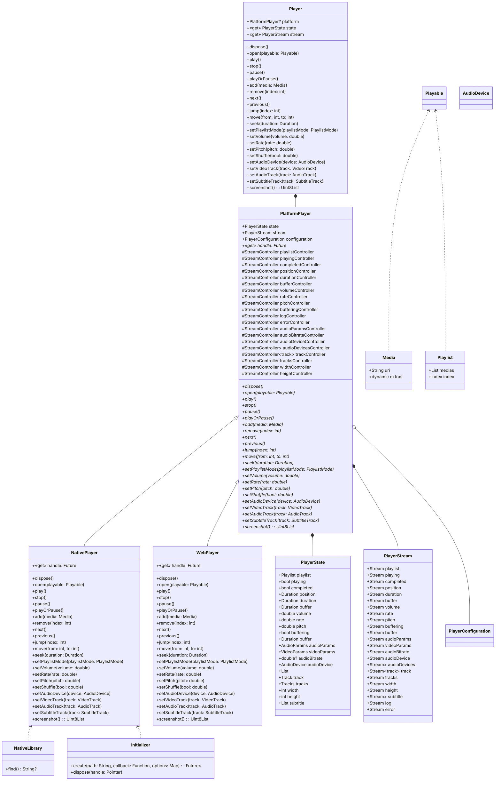
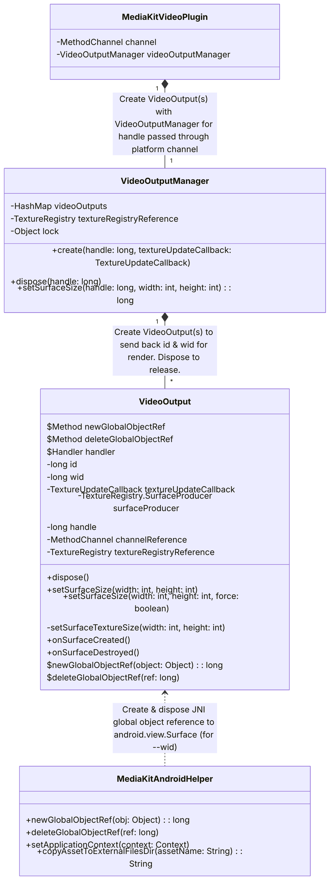
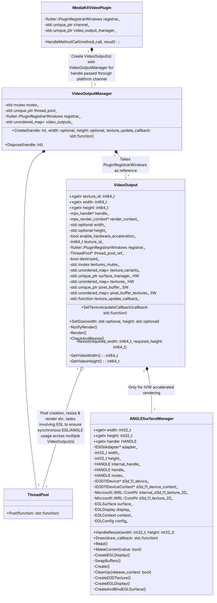
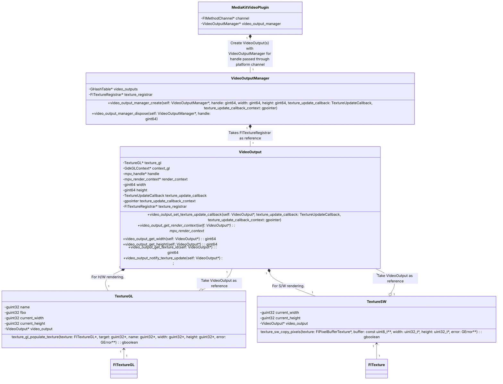

Project Path: media-kit

Source Tree:

```txt
media-kit
├── README.md
├── libs
│   ├── android
│   │   ├── media_kit_libs_android_audio
│   │   │   ├── README.md
│   │   │   ├── example
│   │   │   │   └── README.md
│   │   │   └── pubspec.yaml
│   │   └── media_kit_libs_android_video
│   │       ├── README.md
│   │       ├── example
│   │       │   └── README.md
│   │       └── pubspec.yaml
│   ├── ios
│   │   ├── media_kit_libs_ios_audio
│   │   │   ├── README.md
│   │   │   ├── example
│   │   │   │   └── README.md
│   │   │   └── pubspec.yaml
│   │   └── media_kit_libs_ios_video
│   │       ├── README.md
│   │       ├── example
│   │       │   └── README.md
│   │       └── pubspec.yaml
│   ├── linux
│   │   └── media_kit_libs_linux
│   │       ├── README.md
│   │       ├── example
│   │       │   └── README.md
│   │       └── pubspec.yaml
│   ├── macos
│   │   ├── media_kit_libs_macos_audio
│   │   │   ├── README.md
│   │   │   ├── example
│   │   │   │   └── README.md
│   │   │   └── pubspec.yaml
│   │   └── media_kit_libs_macos_video
│   │       ├── README.md
│   │       ├── example
│   │       │   └── README.md
│   │       └── pubspec.yaml
│   ├── universal
│   │   ├── media_kit_libs_audio
│   │   │   ├── README.md
│   │   │   ├── example
│   │   │   │   └── README.md
│   │   │   ├── lib
│   │   │   │   └── media_kit_libs_audio.dart
│   │   │   └── pubspec.yaml
│   │   └── media_kit_libs_video
│   │       ├── README.md
│   │       ├── example
│   │       │   └── README.md
│   │       ├── lib
│   │       │   └── media_kit_libs_video.dart
│   │       └── pubspec.yaml
│   └── windows
│       ├── media_kit_libs_windows_audio
│       │   ├── README.md
│       │   ├── example
│       │   │   └── README.md
│       │   └── pubspec.yaml
│       └── media_kit_libs_windows_video
│           ├── README.md
│           ├── example
│           │   └── README.md
│           └── pubspec.yaml
├── media_kit
│   ├── README.md
│   ├── example
│   │   └── README.md
│   ├── lib
│   │   ├── ffi
│   │   │   ├── ffi.dart
│   │   │   └── src
│   │   │       ├── allocation.dart
│   │   │       ├── arena.dart
│   │   │       ├── utf16.dart
│   │   │       └── utf8.dart
│   │   ├── generated
│   │   │   └── libmpv
│   │   │       └── bindings.dart
│   │   ├── media_kit.dart
│   │   └── src
│   │       ├── legacy.dart
│   │       ├── media_kit.dart
│   │       ├── models
│   │       │   ├── audio_device.dart
│   │       │   ├── audio_params.dart
│   │       │   ├── media
│   │       │   │   ├── media.dart
│   │       │   │   ├── media_native.dart
│   │       │   │   └── media_web.dart
│   │       │   ├── playable.dart
│   │       │   ├── player_log.dart
│   │       │   ├── player_state.dart
│   │       │   ├── player_stream.dart
│   │       │   ├── playlist.dart
│   │       │   ├── playlist_mode.dart
│   │       │   ├── track.dart
│   │       │   └── video_params.dart
│   │       ├── player
│   │       │   ├── native
│   │       │   │   ├── core
│   │       │   │   │   ├── execmem_restriction.dart
│   │       │   │   │   ├── fallback_bitrate_handler.dart
│   │       │   │   │   ├── initializer.dart
│   │       │   │   │   ├── initializer_isolate.dart
│   │       │   │   │   ├── initializer_native_callable.dart
│   │       │   │   │   └── native_library.dart
│   │       │   │   ├── player
│   │       │   │   │   ├── player.dart
│   │       │   │   │   ├── real.dart
│   │       │   │   │   └── stub.dart
│   │       │   │   └── utils
│   │       │   │       ├── android_asset_loader.dart
│   │       │   │       ├── android_content_uri_provider.dart
│   │       │   │       ├── android_helper.dart
│   │       │   │       ├── asset_loader.dart
│   │       │   │       ├── isolates.dart
│   │       │   │       ├── native_reference_holder.dart
│   │       │   │       └── temp_file.dart
│   │       │   ├── platform_player.dart
│   │       │   ├── player.dart
│   │       │   └── web
│   │       │       ├── player
│   │       │       │   ├── player.dart
│   │       │       │   ├── real.dart
│   │       │       │   └── stub.dart
│   │       │       └── utils
│   │       │           ├── asset_loader.dart
│   │       │           ├── duration.dart
│   │       │           └── hls.dart
│   │       └── values.dart
│   ├── pubspec.yaml
│   └── test
│       ├── common
│       │   ├── sources.dart
│       │   ├── sources_native.dart
│       │   └── sources_web.dart
│       └── src
│           ├── models
│           │   └── media
│           │       ├── media_test.dart
│           │       └── player_state_test.dart
│           └── player
│               ├── native
│               │   ├── core
│               │   │   ├── initializer_test.dart
│               │   │   └── native_library_test.dart
│               │   └── utils
│               │       └── asset_loader_test.dart
│               ├── player_test.dart
│               └── web
│                   └── utils
│                       └── asset_loader_test.dart
├── media_kit_test
│   ├── ios
│   │   └── Runner
│   │       └── Assets.xcassets
│   │           └── LaunchImage.imageset
│   │               └── README.md
│   ├── lib
│   │   ├── common
│   │   │   ├── globals.dart
│   │   │   ├── sources
│   │   │   │   ├── sources.dart
│   │   │   │   ├── sources_native.dart
│   │   │   │   └── sources_web.dart
│   │   │   └── widgets.dart
│   │   ├── main.dart
│   │   └── tests
│   │       ├── 01.single_player_single_video.dart
│   │       ├── 02.single_player_multiple_video.dart
│   │       ├── 03.multiple_player_multiple_video.dart
│   │       ├── 04.tabs_test.dart
│   │       ├── 05.stress_test.dart
│   │       ├── 06.paint_first_frame.dart
│   │       ├── 07.video_controller_set_size.dart
│   │       ├── 08.screenshot.dart
│   │       ├── 09.seamless.dart
│   │       ├── 10.programmatic_fullscreen.dart
│   │       └── 11.video_view_parameters.dart
│   └── pubspec.yaml
├── media_kit_video
│   ├── README.md
│   ├── example
│   │   ├── README.md
│   │   └── pubspec.yaml
│   ├── lib
│   │   ├── media_kit_video.dart
│   │   ├── media_kit_video_controls
│   │   │   ├── media_kit_video_controls.dart
│   │   │   └── src
│   │   │       └── controls
│   │   │           ├── adaptive.dart
│   │   │           ├── cupertino.dart
│   │   │           ├── extensions
│   │   │           │   └── duration.dart
│   │   │           ├── material.dart
│   │   │           ├── material_desktop.dart
│   │   │           ├── methods
│   │   │           │   ├── fullscreen.dart
│   │   │           │   └── video_state.dart
│   │   │           ├── no.dart
│   │   │           └── widgets
│   │   │               ├── fullscreen_inherited_widget.dart
│   │   │               ├── video_controls_theme_data_injector.dart
│   │   │               └── video_state_inherited_widget.dart
│   │   └── src
│   │       ├── subtitle
│   │       │   └── subtitle_view.dart
│   │       ├── utils
│   │       │   ├── dispose_safe_notifer.dart
│   │       │   ├── query_decoders.dart
│   │       │   └── wakelock.dart
│   │       ├── video
│   │       │   ├── video.dart
│   │       │   ├── video_texture.dart
│   │       │   └── video_web.dart
│   │       ├── video_controller
│   │       │   ├── android_video_controller
│   │       │   │   ├── android_video_controller.dart
│   │       │   │   ├── real.dart
│   │       │   │   └── stub.dart
│   │       │   ├── native_video_controller
│   │       │   │   ├── native_video_controller.dart
│   │       │   │   ├── real.dart
│   │       │   │   └── stub.dart
│   │       │   ├── platform_video_controller.dart
│   │       │   ├── video_controller.dart
│   │       │   └── web_video_controller
│   │       │       ├── real.dart
│   │       │       ├── stub.dart
│   │       │       └── web_video_controller.dart
│   │       └── video_view_parameters.dart
│   └── pubspec.yaml
├── pubspec.yaml
└── video_player_media_kit
    ├── README.md
    ├── example
    │   ├── README.md
    │   ├── integration_test
    │   │   ├── controller_swap_test.dart
    │   │   └── video_player_test.dart
    │   ├── ios
    │   │   └── Runner
    │   │       └── Assets.xcassets
    │   │           └── LaunchImage.imageset
    │   │               └── README.md
    │   ├── lib
    │   │   └── main.dart
    │   ├── pubspec.yaml
    │   └── test_driver
    │       └── integration_test.dart
    ├── lib
    │   ├── src
    │   │   └── media_kit_video_player.dart
    │   └── video_player_media_kit.dart
    └── pubspec.yaml

```

`media-kit/README.md`:

```md
# [package:media_kit](https://github.com/media-kit/media-kit)

#### A cross-platform video player & audio player for Flutter & Dart.

[](https://discord.gg/h7qf2R9n57) [](https://github.com/media-kit/media-kit/actions/workflows/ci.yml)

<hr>

<strong>Sponsored with 💖 by</strong>

<a href="https://getstream.io/chat/sdk/flutter/?utm_source=alexmercerind_dart&utm_medium=Github_Repo_Content_Ad&utm_content=Developer&utm_campaign=alexmercerind_December2022_FlutterSDK_klmh22" target="_blank">
  <picture>
    <source media="(prefers-color-scheme: dark)" srcset="https://user-images.githubusercontent.com/28951144/204903234-4a64b63c-2fc2-4eef-be44-d287d27021e5.svg">
    <source media="(prefers-color-scheme: light)" srcset="https://user-images.githubusercontent.com/28951144/204903022-bbaa49ca-74c2-4a8f-a05d-af8314bfd2cc.svg">
    
  </picture>
</a>
<br></br>
<strong>
  <a href="https://getstream.io/chat/sdk/flutter/?utm_source=alexmercerind_dart&utm_medium=Github_Repo_Content_Ad&utm_content=Developer&utm_campaign=alexmercerind_December2022_FlutterSDK_klmh22" target="_blank">
  Try the Flutter Chat tutorial
  </a>
</strong>

<br></br>

<a href="https://ottomatic.io/" target="_blank">
  <picture>
    <source media="(prefers-color-scheme: dark)" srcset="https://user-images.githubusercontent.com/28951144/228648854-e5d7c557-ee92-47b2-a037-17b447873e1c.svg">
    <source media="(prefers-color-scheme: light)" srcset="https://user-images.githubusercontent.com/28951144/228648844-f2a59ab1-12cd-4fee-bc8d-b2d332033c45.svg">
    
  </picture>
</a>
<br></br>
<strong>
  <a href="https://ottomatic.io/" target="_blank">
  Clever Apps for Film Professionals
  </a>
</strong>

## Installation

[package:media_kit](https://github.com/media-kit/media-kit) is split into multiple packages to improve modularity & reduce bundle size.

#### For apps that need video playback:

```yaml
dependencies:
  media_kit: ^1.1.11 # Primary package.
  media_kit_video: ^1.2.5 # For video rendering.
  media_kit_libs_video: ^1.0.5 # Native video dependencies.
```

#### For apps that need audio playback:

```yaml
dependencies:
  media_kit: ^1.1.11 # Primary package.
  media_kit_libs_audio: ^1.0.5 # Native audio dependencies.
```

**Notes:**

- The video libraries should be selected if both video & audio support is needed.
- The `media_kit_libs_video` & `media_kit_libs_audio` packages should not be mixed.
- The performance in ["Release" mode](https://docs.flutter.dev/testing/build-modes#release) is substantially higher than in ["Debug" mode](https://docs.flutter.dev/testing/build-modes#debug).
- [Enable --split-per-abi](https://docs.flutter.dev/deployment/android#what-is-a-fat-apk) or [use app bundle (instead of APK)](https://docs.flutter.dev/deployment/android#when-should-i-build-app-bundles-versus-apks) on Android.

## Platforms

| Platform  | Video | Audio | Notes                              | Demo                                                                                                                        |
| --------- | ----- | ----- | ---------------------------------- | --------------------------------------------------------------------------------------------------------------------------- |
| Android   | ✅    | ✅    | Android 5.0 or above.              | [Download](https://github.com/media-kit/media-kit/releases/download/media_kit-v1.1.10/media_kit_test_android-arm64-v8a.apk) |
| iOS       | ✅    | ✅    | iOS 9 or above.                    | [Download](https://github.com/media-kit/media-kit/releases/download/media_kit-v1.1.10/media_kit_test_ios_arm64.7z)          |
| macOS     | ✅    | ✅    | macOS 10.9 or above.               | [Download](https://github.com/media-kit/media-kit/releases/download/media_kit-v1.1.10/media_kit_test_macos_universal.7z)    |
| Windows   | ✅    | ✅    | Windows 7 or above.                | [Download](https://github.com/media-kit/media-kit/releases/download/media_kit-v1.1.10/media_kit_test_win32_x64.7z)          |
| GNU/Linux | ✅    | ✅    | Any modern GNU/Linux distribution. | [Download](https://github.com/media-kit/media-kit/releases/download/media_kit-v1.1.10/media_kit_test_linux_x64.7z)          |
| Web       | ✅    | ✅    | Any modern web browser.            | [Visit](https://media-kit.github.io/media-kit/)                                                                             |

<table>
  <tr>
    <td>
      Android
    </td>
    <td>
      iOS
    </td>
  </tr>
  <tr>
    <td>
      </img>
      </img>
    </td>
    <td>
      </img>
      </img>
    </td>
  </tr>
  <tr>
    <td>
      macOS
    </td>
    <td>
      Windows
    </td>
  </tr>
  <tr>
    <td>
      </img>
    </td>
    <td>
      </img>
    </td>
  </tr>
  <tr>
    <td>
      GNU/Linux
    </td>
    <td>
      Web
    </td>
  </tr>
  <tr>
    <td>
      </img>
    </td>
    <td>
      </img>
    </td>
</table>

- ✅ Video playback
- ✅ Audio playback
- ✅ Cross platform
- ✅ Wide format/codec support
- ✅ Hardware/GPU acceleration
- ✅ Playlist support with next/previous/jump/shuffle
- ✅ Volume/Rate/Pitch change
- ✅ Video/Audio/Subtitle track selection
- ✅ External audio/subtitle track selection
- ✅ HTTP headers
- ✅ Video controls
- ✅ Subtitle styling
- ✅ Screenshot

## TL;DR

A quick usage example.

```dart
import 'package:flutter/material.dart';

// Make sure to add following packages to pubspec.yaml:
// * media_kit
// * media_kit_video
// * media_kit_libs_video
import 'package:media_kit/media_kit.dart';                      // Provides [Player], [Media], [Playlist] etc.
import 'package:media_kit_video/media_kit_video.dart';          // Provides [VideoController] & [Video] etc.

void main() {
  WidgetsFlutterBinding.ensureInitialized();
  // Necessary initialization for package:media_kit.
  MediaKit.ensureInitialized();
  runApp(
    const MaterialApp(
      home: MyScreen(),
    ),
  );
}

class MyScreen extends StatefulWidget {
  const MyScreen({Key? key}) : super(key: key);
  @override
  State<MyScreen> createState() => MyScreenState();
}

class MyScreenState extends State<MyScreen> {
  // Create a [Player] to control playback.
  late final player = Player();
  // Create a [VideoController] to handle video output from [Player].
  late final controller = VideoController(player);

  @override
  void initState() {
    super.initState();
    // Play a [Media] or [Playlist].
    player.open(Media('https://user-images.githubusercontent.com/28951144/229373695-22f88f13-d18f-4288-9bf1-c3e078d83722.mp4'));
  }

  @override
  void dispose() {
    player.dispose();
    super.dispose();
  }

  @override
  Widget build(BuildContext context) {
    return Center(
      child: SizedBox(
        width: MediaQuery.of(context).size.width,
        height: MediaQuery.of(context).size.width * 9.0 / 16.0,
        // Use [Video] widget to display video output.
        child: Video(controller: controller),
      ),
    );
  }
}
```

**Note:** You may need to add required [permissions](#permissions) to your project (only if required).

## Guide

A usage guide for [package:media_kit](https://github.com/media-kit/media-kit).

**Tip:** Use <kbd>Ctrl</kbd> + <kbd>F</kbd> to quickly search for things.

### Contents

- [Initialization](#initialization)
- [Create a `Player`](#create-a-player)
- [Dispose a `Player`](#dispose-a-player)
- [Open a `Media` or `Playlist`](#open-a-media-or-playlist)
- [Play, pause or play/pause](#play-pause-or-playpause)
- [Stop](#stop)
- [Seek](#seek)
- [Loop or repeat](#loop-or-repeat)
- [Set volume, rate or pitch](#set-volume-rate-or-pitch)
- [Handle playback events](#handle-playback-events)
- [Shuffle the queue](#shuffle-the-queue)
- [Use HTTP headers](#use-http-headers)
- [Use `extras` to store additional data with `Media`](#use-extras-store-additional-data-with-media)
- [Go to next, previous or any other position in queue](#go-to-next-previous-or-any-other-position-in-queue)
- [Modify `Player`'s queue](#modify-players-queue)
- [Select video, audio or subtitle track](#select-video-audio-or-subtitle-track)
- [Select audio device](#select-audio-device)
- [Display the video](#display-the-video)
- [Capture screenshot](#capture-screenshot)
- [Customize subtitles](#customize-subtitles)
- [Load external subtitle track](#load-external-subtitle-track)
- [Load external audio track](#load-external-audio-track)
- [Video controls](#video-controls)
- [Next steps](#next-steps)

### Initialization

`MediaKit.ensureInitialized` must be called before using the package:

```dart
void main() {
  WidgetsFlutterBinding.ensureInitialized();
  // Make sure to add the required packages to pubspec.yaml:
  // * https://github.com/media-kit/media-kit#installation
  // * https://pub.dev/packages/media_kit#installation
  MediaKit.ensureInitialized();
  runApp(const MyApp());
}
```

The method also has some optional arguments to customize the global behavior. To handle any initialization errors, this may be surrounded by `try`/`catch`.

### Create a `Player`

A `Player` instance is used to start & control the playback of a media source e.g. URL or file.

```dart
final Player player = Player();
```

Additional options may be provided using the `configuration` argument in the constructor. In general situations, you will never require this.

```dart
final Player player = Player(
  configuration: PlayerConfiguration(
    // Supply your options:
    title: 'My awesome package:media_kit application',
    ready: () {
      print('The initialization is complete.');
    },
  ),
);
```

### Dispose a `Player`

It is extremely important to release the allocated resources back to the system:

```dart
await player.dispose();
```

### Open a `Media` or `Playlist`

A `Playable` can either be a `Media` or a `Playlist`.

- `Media`: Single playback source (file or URL).
- `Playlist`: Queue of playback sources (file or URL).

Use the `Player.open` method to load & start playback.

#### `Media`

```dart
final playable = Media('https://user-images.githubusercontent.com/28951144/229373695-22f88f13-d18f-4288-9bf1-c3e078d83722.mp4');
await player.open(playable);
```

#### `Playlist`

```dart
final playable = Playlist(
  [
    Media('https://user-images.githubusercontent.com/28951144/229373695-22f88f13-d18f-4288-9bf1-c3e078d83722.mp4'),
    Media('https://user-images.githubusercontent.com/28951144/229373709-603a7a89-2105-4e1b-a5a5-a6c3567c9a59.mp4'),
    Media('https://user-images.githubusercontent.com/28951144/229373716-76da0a4e-225a-44e4-9ee7-3e9006dbc3e3.mp4'),
    Media('https://user-images.githubusercontent.com/28951144/229373718-86ce5e1d-d195-45d5-baa6-ef94041d0b90.mp4'),
    Media('https://user-images.githubusercontent.com/28951144/229373720-14d69157-1a56-4a78-a2f4-d7a134d7c3e9.mp4'),
  ],
);
await player.open(playable);
```

**Notes:**

1. By default, this will automatically start playing the playable. This may be disabled as follows:

```dart
await player.open(
  playable,
  play: false,
);
```

2. By default, the playlist will start at the index `0`. This may be changed as follows:

```dart
final playable = Playlist(
  [
    Media('https://user-images.githubusercontent.com/28951144/229373695-22f88f13-d18f-4288-9bf1-c3e078d83722.mp4'),
    Media('https://user-images.githubusercontent.com/28951144/229373709-603a7a89-2105-4e1b-a5a5-a6c3567c9a59.mp4'),
    Media('https://user-images.githubusercontent.com/28951144/229373716-76da0a4e-225a-44e4-9ee7-3e9006dbc3e3.mp4'),
    Media('https://user-images.githubusercontent.com/28951144/229373718-86ce5e1d-d195-45d5-baa6-ef94041d0b90.mp4'),
    Media('https://user-images.githubusercontent.com/28951144/229373720-14d69157-1a56-4a78-a2f4-d7a134d7c3e9.mp4'),
  ],
  // Declare the starting position.
  index: 0,
);
await player.open(playable);
```

### Play, pause or play/pause

The 3 methods are:

```dart
await player.play();
```

```dart
await player.pause();
```

```dart
await player.playOrPause();
```

### Stop

The `stop` method may be used to stop the playback of currently opened `Media` or `Playlist`.

```dart
await player.stop();
```

It does not release allocated resources back to the system (unlike [`dispose`](#dispose-a-player)) & `Player` still stays usable.

### Seek

Supply the final position to `Player.seek` method as `Duration`:

```dart
await player.seek(
  const Duration(
    minutes: 6,
    seconds: 9,
  ),
);
```

### Loop or repeat

Three `PlaylistMode`s are available:

- `PlaylistMode.none`: End playback once end of the playlist is reached.
- `PlaylistMode.single`: Indefinitely loop over the currently playing file in the playlist.
- `PlaylistMode.loop`: Loop over the playlist & restart it from beginning once end is reached.

```dart
await player.setPlaylistMode(PlaylistMode.single);
```

### Set volume, rate or pitch

#### Set the volume

This controls the loudness of audio output. The maximum volume is `100.0`.

```dart
await player.setVolume(50.0);
```

#### Set the rate

This controls the playback speed.

```dart
await player.setRate(1.5);
```

#### Set the pitch

This controls the pitch of the audio output.

```dart
await player.setPitch(1.2);
```

**Note:** This requires `pitch` argument to be `true` in `PlayerConfiguration`.

### Handle playback events

You can access or subscribe to `Player`'s state changes.

Event handling is an extremely important part of media playback. It is used to show changes in the UI, handle errors, detect the occurrence of play/pause, end-of-file, position updates etc.

- `Player.stream.*`: Provides access to `Player`'s state as [`Stream`](https://dart.dev/tutorials/language/streams)(s).
- `Player.state.*`: Provides access to `Player`'s state directly (for instantaneous access).

A typical example will be:

```dart
player.stream.playing.listen(
  (bool playing) {
    if (playing) {
      // Playing.
    } else {
      // Paused.
    }
  },
);
player.stream.position.listen(
  (Duration position) {
    setState(() {
      // Update UI.
    });
  },
);
```

The following state(s) are available as events:

| Type                        | Name           | Description                                                                                              |
| --------------------------- | -------------- | -------------------------------------------------------------------------------------------------------- |
| `Stream<Playlist>`          | `playlist`     | Currently opened media sources.                                                                          |
| `Stream<bool>`              | `playing`      | Whether playing or not.                                                                                  |
| `Stream<bool>`              | `completed`    | Whether end of currently playing media source has been reached.                                          |
| `Stream<Duration>`          | `position`     | Current playback position.                                                                               |
| `Stream<Duration>`          | `duration`     | Current playback duration.                                                                               |
| `Stream<double>`            | `volume`       | Current volume.                                                                                          |
| `Stream<double>`            | `rate`         | Current playback rate.                                                                                   |
| `Stream<double>`            | `pitch`        | Current pitch.                                                                                           |
| `Stream<bool>`              | `buffering`    | Whether buffering or not.                                                                                |
| `Stream<Duration>`          | `buffer`       | Current buffer position. This indicates how much of the stream has been decoded & cached by the demuxer. |
| `Stream<PlaylistMode>`      | `playlistMode` | Current playlist mode.                                                                                   |
| `Stream<bool>`              | `shuffle`      | Whether playlist is shuffled or not.
| `Stream<AudioParams>`       | `audioParams`  | Audio parameters of the currently playing media source e.g. sample rate, channels, etc.                  |
| `Stream<VideoParams>`       | `videoParams`  | Video parameters of the currently playing media source e.g. width, height, rotation etc.                 |
| `Stream<double?>`           | `audioBitrate` | Audio bitrate of the currently playing media source.                                                     |
| `Stream<AudioDevice>`       | `audioDevice`  | Currently selected audio device.                                                                         |
| `Stream<List<AudioDevice>>` | `audioDevices` | Currently available audio devices.                                                                       |
| `Stream<Track>`             | `track`        | Currently selected video, audio and subtitle track.                                                      |
| `Stream<Tracks>`            | `tracks`       | Currently available video, audio and subtitle tracks.                                                    |
| `Stream<int>`               | `width`        | Currently playing video's width.                                                                         |
| `Stream<int>`               | `height`       | Currently playing video's height.                                                                        |
| `Stream<int>`               | `subtitle`     | Currently displayed subtitle.                                                                            |
| `Stream<PlayerLog>`         | `log`          | Internal logs.                                                                                           |
| `Stream<String>`            | `error`        | Error messages. This may be used to handle & display errors to the user.                                 |

### Shuffle the queue

You may find the requirement to shuffle the `Playlist` you `open`'d in `Player`, like some music players do.

```dart
await player.setShuffle(true);
```

**Note:** This option is reset upon the next `Player.open` call.

### Use HTTP headers

Declare the `httpHeaders` argument in `Media` constructor. It takes the HTTP headers as `Map<String, String>`.

```dart
final playable = Media(
  'https://user-images.githubusercontent.com/28951144/229373695-22f88f13-d18f-4288-9bf1-c3e078d83722.mp4',
  httpHeaders: {
    'Foo': 'Bar',
    'Accept': '*/*',
    'Range': 'bytes=0-',
  },
);
```

### Use `extras` to store additional data with `Media`

The `extras` argument may be utilized to store additional data with a `Media` in form of `Map<String, dynamic>`.

```dart
final playable = Media(
  'https://user-images.githubusercontent.com/28951144/229373695-22f88f13-d18f-4288-9bf1-c3e078d83722.mp4',
  extras: {
    'track': '9',
    'year': '2012',
    'title': 'Courtesy Call',
    'artist': 'Thousand Foot Krutch',
    'album': 'The End Is Where We Begin',
  },
);
```

### Modify `Player`'s queue

You can add or remove (etc.) a `Media` in an already playing `Playlist`:

#### Add

Add a new `Media` to the back of the queue:

```dart
await player.add(Media('https://user-images.githubusercontent.com/28951144/229373695-22f88f13-d18f-4288-9bf1-c3e078d83722.mp4'));
```

#### Remove

Remove any item from the queue:

```dart
await player.remove(0);
```

#### Move

Move any item in the queue from one position to another:

```dart
await player.move(6, 9);
```

### Go to next, previous or any other position in queue

#### Skip to the next queue item

```dart
await player.next();
```

#### Skip to the previous queue item

```dart
await player.previous();
```

#### Skip to any other queue item

```dart
await player.jump(5);
```

### Select video, audio or subtitle track

A media source may contain multiple video, audio or subtitle tracks e.g. for multiple languages. Available video, audio or subtitle tracks are notified through `Player`'s state. See ["Handle playback events" section](#handle-playback-events) for related information.

By default, video, audio & subtitle track is selected automatically _i.e._ `VideoTrack.auto()`, `AudioTrack.auto()` & `SubtitleTrack.auto()`.

#### Automatic selection

```dart
await player.setVideoTrack(VideoTrack.auto());

await player.setAudioTrack(AudioTrack.auto());

await player.setSubtitleTrack(SubtitleTrack.auto());
```

#### Disable track

This may be used to essentially disable video output, disable audio output or stop rendering of subtitles etc.

```dart
await player.setVideoTrack(VideoTrack.no());

await player.setAudioTrack(AudioTrack.no());

await player.setSubtitleTrack(SubtitleTrack.no());
```

#### Select custom track

- Retrieve currently available tracks:

```dart
List<VideoTrack> videos = player.state.tracks.video;
List<AudioTrack> audios = player.state.tracks.audio;
List<SubtitleTrack> subtitles = player.state.tracks.subtitle;

// Get notified as [Stream]:
player.stream.tracks.listen((event) {
  List<VideoTrack> videos = event.video;
  List<AudioTrack> audios = event.audio;
  List<SubtitleTrack> subtitles = event.subtitle;
});
```

- Select the track:

```dart
await player.setVideoTrack(videos[0]);
await player.setAudioTrack(audios[1]);
await player.setSubtitleTrack(subtitles[2]);
```

- Get notified about currently selected track:

```dart
VideoTrack video = player.state.track.video;
AudioTrack audio = player.state.track.audio;
SubtitleTrack subtitle = player.state.track.subtitle;

// Get notified as [Stream]:
player.stream.track.listen((event) {
  VideoTrack video = event.video;
  AudioTrack audio = event.audio;
  SubtitleTrack subtitle = event.subtitle;
});
```

### Select audio device

Available audio devices are notified through `Player`'s state. See ["Handle playback events" section](#handle-playback-events) for related information.

By default, audio device is selected automatically _i.e._ `AudioDevice.auto()`.

#### Default selection

```dart
await player.setAudioDevice(AudioDevice.auto());
```

#### Disable audio output

```dart
await player.setAudioDevice(AudioDevice.no());
```

#### Select custom audio device

- Retrieve currently available audio devices:

```dart
List<AudioDevice> devices = player.state.audioDevices;

// Get notified as [Stream]:
player.stream.audioDevices.listen((event) {
  List<AudioDevice> devices = event;
});
```

- Select the audio device:

```dart
await player.setAudioDevice(devices[1]);
```

- Get notified about currently selected audio device:

```dart
AudioDevice device = player.state.audioDevice;

// Get notified as [Stream]:
player.stream.audioDevice.listen((event) {
  AudioDevice device = event;
});
```

### Display the video

The **existing ["TL;DR example"](#tldr) should provide you better idea**.

For displaying the video inside Flutter UI, you must:

- Create `VideoController`
  - Pass the `Player` you already have.
- Create `Video` widget
  - Pass the `VideoController` you already have.

The code is easier to understand:

```dart
class _MyScreenState extends State<MyScreen> {
  late final Player player = Player();
  late final VideoController controller = VideoController(player);

  @override
  void dispose() {
    player.dispose();
    super.dispose();
  }

  @override
  Widget build(BuildContext context) {
    return Scaffold(
      body: Video(
        controller: controller,
      ),
    );
  }
}
```

The video playback uses [hardware acceleration](https://en.wikipedia.org/wiki/Hardware_acceleration) _i.e._ GPU by default.

Additional options may be provided using the `configuration` argument in the constructor. In general situations, you will never require this.

```dart
final VideoController player = VideoController(
  player,
  configuration: const VideoControllerConfiguration(
    // Supply your options:
    enableHardwareAcceleration: true,      // default: true
    width: 640,                            // default: null
    height: 480,                           // default: null
    // The in-code comments is best place to know more about these options:
    // https://github.com/media-kit/media-kit/blob/main/media_kit_video/lib/src/video_controller/video_controller.dart
  ),
);
```

### Capture screenshot

The `screenshot` method takes the snapshot of the current video frame & returns encoded image bytes as `Uint8List`.

```dart
final Uint8List? screenshot = await player.screenshot();
```

Additionally `format` argument may be specified to change the encoding format. Following formats are supported:

- `image/jpeg`: Returns a JPEG encoded image.
- `image/png`: Returns a PNG encoded image.
- `null`: Returns BGRA pixel buffer.

### Customize subtitles

`SubtitleViewConfiguration` can be passed to the `Video` widget for customizing the subtitles. The code is easier to understand:

Notably, `TextStyle`, `TextAlign` & `EdgeInsetsGeometry` can be provided.

```dart
Video(
  controller: controller,
  subtitleViewConfiguration: const SubtitleViewConfiguration(
    style: TextStyle(
      height: 1.4,
      fontSize: 24.0,
      letterSpacing: 0.0,
      wordSpacing: 0.0,
      color: Color(0xffffffff),
      fontWeight: FontWeight.normal,
      backgroundColor: Color(0xaa000000),
    ),
    textAlign: TextAlign.center,
    padding: EdgeInsets.all(24.0),
  ),
);
```

https://user-images.githubusercontent.com/28951144/253067794-73b5ca5d-e90d-4892-bc09-2a80f05c9f0b.mp4

### Load external subtitle track

The `SubtitleTrack.uri` constructor can be used to load external subtitle track **with URI** e.g. SRT, WebVTT etc. The code is easier to understand:

```dart
await player.setSubtitleTrack(
  SubtitleTrack.uri(
    'https://www.iandevlin.com/html5test/webvtt/upc-video-subtitles-en.vtt',
    title: 'English',
    language: 'en',
  ),
);
```

The `SubtitleTrack.data` constructor can be used to load external subtitle track **with data** e.g. SRT, WebVTT etc. The code is easier to understand:

```dart
player.setSubtitleTrack(
  SubtitleTrack.data(
    '''WEBVTT FILE

1
00:00:03.500 --> 00:00:05.000 D:vertical A:start
Everyone wants the most from life

2
00:00:06.000 --> 00:00:09.000 A:start
Like internet experiences that are rich <b>and</b> entertaining

3
00:00:11.000 --> 00:00:14.000 A:end
Phone conversations where people truly <c.highlight>connect</c>

4
00:00:14.500 --> 00:00:18.000
Your favourite TV programmes ready to watch at the touch of a button

5
00:00:19.000 --> 00:00:24.000
Which is why we are bringing TV, internet and phone together in <c.highlight>one</c> super package

6
00:00:24.500 --> 00:00:26.000
<c.highlight>One</c> simple way to get everything

7
00:00:26.500 --> 00:00:27.500 L:12%
UPC

8
00:00:28.000 --> 00:00:30.000 L:75%
Simply for <u>everyone</u>
''',
    title: 'English',
    language: 'en',
  ),
);
```

### Load external audio track

The `AudioTrack.uri` constructor can be used to load external audio track **with URI**. The code is easier to understand:

```dart
await player.setAudioTrack(
  AudioTrack.uri(
    'https://www.iandevlin.com/html5test/webvtt/v/upc-tobymanley.mp4',
    title: 'English',
    language: 'en',
  ),
);
```

### Video controls

[`package:media_kit`](https://github.com/media-kit/media-kit) provides highly-customizable pre-built video controls for usage.

Apart from theming, layout can be customized, position of buttons can be modified, custom buttons can be created etc. Necessary features like fullscreen, keyboard shortcuts & swipe-based controls are also supported by default.

<table>
  <tr>
    <td>
      <a href="#materialdesktopvideocontrols"><tt>MaterialDesktopVideoControls</tt></a>
    </td>
    <td>
      <a href="#materialvideocontrols"><tt>MaterialVideoControls</tt></a>
    </td>
  </tr>
  <tr>
    <td>
      
    </td>
    <td>
      
    </td>
  </tr>
</table>

- `Video` widget provides `controls` argument to display & customize video controls.
- By default, [`AdaptiveVideoControls`](#adaptivevideocontrols) are used.

#### Types

| Type                                                            | Description                                                                                                                            |
| --------------------------------------------------------------- | -------------------------------------------------------------------------------------------------------------------------------------- |
| [`AdaptiveVideoControls`](#adaptivevideocontrols)               | Selects [`MaterialVideoControls`](#materialvideocontrols), [`CupertinoVideoControls`](#cupertinovideocontrols) etc. based on platform. |
| [`MaterialVideoControls`](#materialvideocontrols)               | [Material Design](https://material.io/) video controls.                                                                                |
| [`MaterialDesktopVideoControls`](#materialdesktopvideocontrols) | [Material Design](https://material.io/) video controls for desktop.                                                                    |
| [`CupertinoVideoControls`](#cupertinovideocontrols)             | [iOS-style](https://developer.apple.com/design/human-interface-guidelines/designing-for-ios) video controls.                           |
| [`NoVideoControls`](#novideocontrols)                           | Disable video controls _i.e._ only render video output.                                                                                |
| Custom                                                          | Provide custom `builder` for video controls.                                                                                           |

#### Select existing video controls

Modify the `controls` argument. For advanced theming of existing video controls, see [theming & modifying video controls](#theming-&-modifying-video-controls) section.

```dart
Scaffold(
  body: Video(
    controller: controller,
    // Select [MaterialVideoControls].
    controls: MaterialVideoControls,
  ),
);
```

```dart
Scaffold(
  body: Video(
    controller: controller,
    // Select [CupertinoVideoControls].
    controls: CupertinoVideoControls,
  ),
);
```

#### Build custom video controls

Pass custom builder `Widget Function(BuildContext, VideoController)` as `controls` argument.

```dart
Scaffold(
  body: Video(
    controller: controller,
    // Provide custom builder for controls.
    controls: (state) {
      return Center(
        child: IconButton(
          onPressed: () {
            state.widget.controller.player.playOrPause();
          },
          icon: StreamBuilder(
            stream: state.widget.controller.player.stream.playing,
            builder: (context, playing) => Icon(
              playing.data == true ? Icons.pause : Icons.play_arrow,
            ),
          ),
          // It's not necessary to use [StreamBuilder] or to use [Player] & [VideoController] from [state].
          // [StreamSubscription]s can be made inside [initState] of this widget.
        ),
      );
    },
  ),
);
```

#### Use & modify video controls

##### `AdaptiveVideoControls`

- Selects [`MaterialVideoControls`](#materialvideocontrols), [`CupertinoVideoControls`](#cupertinovideocontrols) etc. based on platform.
- Theming:
  - Theme the specific controls according to sections below.

##### `MaterialVideoControls`

- [Material Design](https://material.io/) video controls.
- Theming:
  - Use `MaterialVideoControlsTheme` widget.
  - `Video` widget(s) in the `child` tree will follow the specified theme:

```dart
// Wrap [Video] widget with [MaterialVideoControlsTheme].
MaterialVideoControlsTheme(
  normal: MaterialVideoControlsThemeData(
    // Modify theme options:
    buttonBarButtonSize: 24.0,
    buttonBarButtonColor: Colors.white,
    // Modify top button bar:
    topButtonBar: [
      const Spacer(),
      MaterialDesktopCustomButton(
        onPressed: () {
          debugPrint('Custom "Settings" button pressed.');
        },
        icon: const Icon(Icons.settings),
      ),
    ],
  ),
  fullscreen: const MaterialVideoControlsThemeData(
    // Modify theme options:
    displaySeekBar: false,
    automaticallyImplySkipNextButton: false,
    automaticallyImplySkipPreviousButton: false,
  ),
  child: Scaffold(
    body: Video(
      controller: controller,
    ),
  ),
);
```

- Related widgets (may be used in `primaryButtonBar`, `topButtonBar` & `bottomButtonBar`):
  - `MaterialPlayOrPauseButton`
  - `MaterialSkipNextButton`
  - `MaterialSkipPreviousButton`
  - `MaterialFullscreenButton`
  - `MaterialCustomButton`
  - `MaterialPositionIndicator`

##### `MaterialDesktopVideoControls`

- [Material Design](https://material.io/) video controls for desktop.
- Theming:
  - Use `MaterialDesktopVideoControlsTheme` widget.
  - `Video` widget(s) in the `child` tree will follow the specified theme:

```dart
// Wrap [Video] widget with [MaterialDesktopVideoControlsTheme].
MaterialDesktopVideoControlsTheme(
  normal: MaterialDesktopVideoControlsThemeData(
    // Modify theme options:
    seekBarThumbColor: Colors.blue,
    seekBarPositionColor: Colors.blue,
    toggleFullscreenOnDoublePress: false,
    // Modify top button bar:
    topButtonBar: [
      const Spacer(),
      MaterialDesktopCustomButton(
        onPressed: () {
          debugPrint('Custom "Settings" button pressed.');
        },
        icon: const Icon(Icons.settings),
      ),
    ],
    // Modify bottom button bar:
    bottomButtonBar: const [
      Spacer(),
      MaterialDesktopPlayOrPauseButton(),
      Spacer(),
    ],
  ),
  fullscreen: const MaterialDesktopVideoControlsThemeData(),
  child: Scaffold(
    body: Video(
      controller: controller,
    ),
  ),
);
```

- Related widgets (may be used in `primaryButtonBar`, `topButtonBar` & `bottomButtonBar`):
  - `MaterialDesktopPlayOrPauseButton`
  - `MaterialDesktopSkipNextButton`
  - `MaterialDesktopSkipPreviousButton`
  - `MaterialDesktopFullscreenButton`
  - `MaterialDesktopCustomButton`
  - `MaterialDesktopVolumeButton`
  - `MaterialDesktopPositionIndicator`
- Keyboard shortcuts may be modified using `keyboardShortcuts` argument. Default ones are listed below:

| Shortcut                    | Action                |
| --------------------------- | --------------------- |
| Media Play Button           | Play                  |
| Media Pause Button          | Pause                 |
| Media Play/Pause Button     | Play/Pause            |
| Media Next Track Button     | Skip Next             |
| Media Previous Track Button | Skip Previous         |
| Space                       | Play/Pause            |
| J                           | Seek 10s Behind       |
| I                           | Seek 10s Ahead        |
| Arrow Left                  | Seek 2s Behind        |
| Arrow Right                 | Seek 2s Ahead         |
| Arrow Up                    | Increase Volume 5%    |
| Arrow Down                  | Decrease Volume 5%    |
| F                           | Enter/Exit Fullscreen |
| Escape                      | Exit Fullscreen       |

##### `CupertinoVideoControls`

- [iOS-style](https://developer.apple.com/design/human-interface-guidelines/designing-for-ios) video controls.
- Theming:
  - Use `CupertinoVideoControlsTheme` widget.
  - `Video` widget(s) in the `child` tree will follow the specified theme:

```dart
// Wrap [Video] widget with [CupertinoVideoControlsTheme].
CupertinoVideoControlsTheme(
  normal: const CupertinoVideoControlsThemeData(
    // W.I.P.
  ),
  fullscreen: const CupertinoVideoControlsThemeData(
    // W.I.P.
  ),
  child: Scaffold(
    body: Video(
      controller: controller,
    ),
  ),
);
```

##### `NoVideoControls`

- Disable video controls _i.e._ only render video output.
- Theming:
  - No theming applicable.

### Next steps

This guide follows a tutorial-like structure & covers nearly all features that [package:media_kit](https://github.com/media-kit/media-kit) offers. However, it is _not complete_ by any means. You are free to improve this page & add more documentation, which newcomers may find helpful. The following places can help you learn more:

- [API reference](https://pub.dev/documentation/media_kit/latest/media_kit/media_kit-library.html) can be helpful for diving into deeper specifics.
- [source-code of the demo application](https://github.com/media-kit/media-kit/tree/main/media_kit_test/lib/tests) offers some complete code samples.
- In-code comments & docstrings happen to be the most updated source of knowledge.

## Goals

[package:media_kit](https://github.com/media-kit/media-kit) is a library for Flutter & Dart which **provides video & audio playback**.

- **Strong:** Supports _most_ video & audio codecs.
- **Performant:**
  - Handles multiple FHD videos flawlessly.
  - Rendering is GPU-powered (hardware accelerated).
  - 4K / 8K 60 FPS is supported.
- **Stable:** Implementation is well-tested & used across number of intensive media playback related apps.
- **Feature Proof:** A simple usage API while offering a large number of features to target multitude of apps.
- **Modular:** Project is split into a number of packages for reducing bundle size.
- **Cross Platform**: Implementation works on all platforms supported by Flutter & Dart:
  - Android
  - iOS
  - macOS
  - Windows
  - GNU/Linux
  - Web
- **Flexible Architecture:**
  - Major part of implementation (80%+) is in 100% Dart ([FFI](https://dart.dev/guides/libraries/c-interop)) & shared across platforms.
    - Makes the behavior of library same & more predictable across platforms.
    - Makes development & implementation of new features easier & faster.
    - Avoids separate maintenance of native implementation for each platform.
  - Only video embedding code is platform-specific & part of separate package.

You may see project's [architecture](https://github.com/media-kit/media-kit#architecture) & [implementation](https://github.com/media-kit/media-kit#implementation) details for further information.

The project aims to meet demands of the community, this includes:

1. Holding accountability.
2. Ensuring timely maintenance.

## Supported Formats

A wide variety of formats & codecs are supported. Complete list may be found below:

<details>

```
3dostr          3DO STR
4xm             4X Technologies
aa              Audible AA format files
aac             raw ADTS AAC (Advanced Audio Coding)
aax             CRI AAX
ac3             raw AC-3
ace             tri-Ace Audio Container
acm             Interplay ACM
act             ACT Voice file format
adf             Artworx Data Format
adp             ADP
ads             Sony PS2 ADS
adx             CRI ADX
aea             MD STUDIO audio
afc             AFC
aiff            Audio IFF
aix             CRI AIX
alaw            PCM A-law
alias_pix       Alias/Wavefront PIX image
alp             LEGO Racers ALP
amr             3GPP AMR
amrnb           raw AMR-NB
amrwb           raw AMR-WB
anm             Deluxe Paint Animation
apac            raw APAC
apc             CRYO APC
ape             Monkey's Audio
apm             Ubisoft Rayman 2 APM
apng            Animated Portable Network Graphics
aptx            raw aptX
aptx_hd         raw aptX HD
aqtitle         AQTitle subtitles
argo_asf        Argonaut Games ASF
argo_brp        Argonaut Games BRP
argo_cvg        Argonaut Games CVG
asf             ASF (Advanced / Active Streaming Format)
asf_o           ASF (Advanced / Active Streaming Format)
ass             SSA (SubStation Alpha) subtitle
ast             AST (Audio Stream)
au              Sun AU
av1             AV1 Annex B
avi             AVI (Audio Video Interleaved)
avr             AVR (Audio Visual Research)
avs             Argonaut Games Creature Shock
avs2            raw AVS2-P2/IEEE1857.4
avs3            raw AVS3-P2/IEEE1857.10
bethsoftvid     Bethesda Softworks VID
bfi             Brute Force & Ignorance
bfstm           BFSTM (Binary Cafe Stream)
bin             Binary text
bink            Bink
binka           Bink Audio
bit             G.729 BIT file format
bitpacked       Bitpacked
bmp_pipe        piped bmp sequence
bmv             Discworld II BMV
boa             Black Ops Audio
bonk            raw Bonk
brender_pix     BRender PIX image
brstm           BRSTM (Binary Revolution Stream)
c93             Interplay C93
caf             Apple CAF (Core Audio Format)
cavsvideo       raw Chinese AVS (Audio Video Standard)
cdg             CD Graphics
cdxl            Commodore CDXL video
cine            Phantom Cine
codec2          codec2 .c2 demuxer
codec2raw       raw codec2 demuxer
concat          Virtual concatenation script
cri_pipe        piped cri sequence
dash            Dynamic Adaptive Streaming over HTTP
data            raw data
daud            D-Cinema audio
dcstr           Sega DC STR
dds_pipe        piped dds sequence
derf            Xilam DERF
dfa             Chronomaster DFA
dfpwm           raw DFPWM1a
dhav            Video DAV
dirac           raw Dirac
dnxhd           raw DNxHD (SMPTE VC-3)
dpx_pipe        piped dpx sequence
dsf             DSD Stream File (DSF)
dshow           DirectShow capture
dsicin          Delphine Software International CIN
dss             Digital Speech Standard (DSS)
dts             raw DTS
dtshd           raw DTS-HD
dv              DV (Digital Video)
dvbsub          raw dvbsub
dvbtxt          dvbtxt
dxa             DXA
ea              Electronic Arts Multimedia
ea_cdata        Electronic Arts cdata
eac3            raw E-AC-3
epaf            Ensoniq Paris Audio File
exr_pipe        piped exr sequence
f32be           PCM 32-bit floating-point big-endian
f32le           PCM 32-bit floating-point little-endian
f64be           PCM 64-bit floating-point big-endian
f64le           PCM 64-bit floating-point little-endian
ffmetadata      FFmpeg metadata in text
film_cpk        Sega FILM / CPK
filmstrip       Adobe Filmstrip
fits            Flexible Image Transport System
flac            raw FLAC
flic            FLI/FLC/FLX animation
flv             FLV (Flash Video)
frm             Megalux Frame
fsb             FMOD Sample Bank
fwse            Capcom's MT Framework sound
g722            raw G.722
g723_1          G.723.1
g726            raw big-endian G.726 ("left aligned")
g726le          raw little-endian G.726 ("right aligned")
g729            G.729 raw format demuxer
gdigrab         GDI API Windows frame grabber
gdv             Gremlin Digital Video
gem_pipe        piped gem sequence
genh            GENeric Header
gif             CompuServe Graphics Interchange Format (GIF)
gif_pipe        piped gif sequence
gsm             raw GSM
gxf             GXF (General eXchange Format)
h261            raw H.261
h263            raw H.263
h264            raw H.264 video
hca             CRI HCA
hcom            Macintosh HCOM
hdr_pipe        piped hdr sequence
hevc            raw HEVC video
hls             Apple HTTP Live Streaming
hnm             Cryo HNM v4
ico             Microsoft Windows ICO
idcin           id Cinematic
idf             iCE Draw File
iff             IFF (Interchange File Format)
ifv             IFV CCTV DVR
ilbc            iLBC storage
image2          image2 sequence
image2pipe      piped image2 sequence
imf             IMF (Interoperable Master Format)
ingenient       raw Ingenient MJPEG
ipmovie         Interplay MVE
ipu             raw IPU Video
ircam           Berkeley/IRCAM/CARL Sound Format
iss             Funcom ISS
iv8             IndigoVision 8000 video
ivf             On2 IVF
ivr             IVR (Internet Video Recording)
j2k_pipe        piped j2k sequence
jacosub         JACOsub subtitle format
jpeg_pipe       piped jpeg sequence
jpegls_pipe     piped jpegls sequence
jpegxl_pipe     piped jpegxl sequence
jv              Bitmap Brothers JV
kux             KUX (YouKu)
kvag            Simon & Schuster Interactive VAG
laf             LAF (Limitless Audio Format)
lavfi           Libavfilter virtual input device
live_flv        live RTMP FLV (Flash Video)
lmlm4           raw lmlm4
loas            LOAS AudioSyncStream
lrc             LRC lyrics
luodat          Video CCTV DAT
lvf             LVF
lxf             VR native stream (LXF)
m4v             raw MPEG-4 video
matroska,webm   Matroska / WebM
mca             MCA Audio Format
mcc             MacCaption
mgsts           Metal Gear Solid: The Twin Snakes
microdvd        MicroDVD subtitle format
mjpeg           raw MJPEG video
mjpeg_2000      raw MJPEG 2000 video
mlp             raw MLP
mlv             Magic Lantern Video (MLV)
mm              American Laser Games MM
mmf             Yamaha SMAF
mods            MobiClip MODS
moflex          MobiClip MOFLEX
mov,mp4,m4a,3gp,3g2,mj2 QuickTime / MOV
mp3             MP2/3 (MPEG audio layer 2/3)
mpc             Musepack
mpc8            Musepack SV8
mpeg            MPEG-PS (MPEG-2 Program Stream)
mpegts          MPEG-TS (MPEG-2 Transport Stream)
mpegtsraw       raw MPEG-TS (MPEG-2 Transport Stream)
mpegvideo       raw MPEG video
mpjpeg          MIME multipart JPEG
mpl2            MPL2 subtitles
mpsub           MPlayer subtitles
msf             Sony PS3 MSF
msnwctcp        MSN TCP Webcam stream
msp             Microsoft Paint (MSP))
mtaf            Konami PS2 MTAF
mtv             MTV
mulaw           PCM mu-law
musx            Eurocom MUSX
mv              Silicon Graphics Movie
mvi             Motion Pixels MVI
mxf             MXF (Material eXchange Format)
mxg             MxPEG clip
nc              NC camera feed
nistsphere      NIST SPeech HEader REsources
nsp             Computerized Speech Lab NSP
nsv             Nullsoft Streaming Video
nut             NUT
nuv             NuppelVideo
obu             AV1 low overhead OBU
ogg             Ogg
oma             Sony OpenMG audio
paf             Amazing Studio Packed Animation File
pam_pipe        piped pam sequence
pbm_pipe        piped pbm sequence
pcx_pipe        piped pcx sequence
pfm_pipe        piped pfm sequence
pgm_pipe        piped pgm sequence
pgmyuv_pipe     piped pgmyuv sequence
pgx_pipe        piped pgx sequence
phm_pipe        piped phm sequence
photocd_pipe    piped photocd sequence
pictor_pipe     piped pictor sequence
pjs             PJS (Phoenix Japanimation Society) subtitles
pmp             Playstation Portable PMP
png_pipe        piped png sequence
pp_bnk          Pro Pinball Series Soundbank
ppm_pipe        piped ppm sequence
psd_pipe        piped psd sequence
psxstr          Sony Playstation STR
pva             TechnoTrend PVA
pvf             PVF (Portable Voice Format)
qcp             QCP
qdraw_pipe      piped qdraw sequence
qoi_pipe        piped qoi sequence
r3d             REDCODE R3D
rawvideo        raw video
realtext        RealText subtitle format
redspark        RedSpark
rka             RKA (RK Audio)
rl2             RL2
rm              RealMedia
roq             id RoQ
rpl             RPL / ARMovie
rsd             GameCube RSD
rso             Lego Mindstorms RSO
rtp             RTP input
rtsp            RTSP input
s16be           PCM signed 16-bit big-endian
s16le           PCM signed 16-bit little-endian
s24be           PCM signed 24-bit big-endian
s24le           PCM signed 24-bit little-endian
s32be           PCM signed 32-bit big-endian
s32le           PCM signed 32-bit little-endian
s337m           SMPTE 337M
s8              PCM signed 8-bit
sami            SAMI subtitle format
sap             SAP input
sbc             raw SBC (low-complexity subband codec)
sbg             SBaGen binaural beats script
scc             Scenarist Closed Captions
scd             Square Enix SCD
sdns            Xbox SDNS
sdp             SDP
sdr2            SDR2
sds             MIDI Sample Dump Standard
sdx             Sample Dump eXchange
ser             SER (Simple uncompressed video format for astronomical capturing)
sga             Digital Pictures SGA
sgi_pipe        piped sgi sequence
shn             raw Shorten
siff            Beam Software SIFF
simbiosis_imx   Simbiosis Interactive IMX
sln             Asterisk raw pcm
smjpeg          Loki SDL MJPEG
smk             Smacker
smush           LucasArts Smush
sol             Sierra SOL
sox             SoX native
spdif           IEC 61937 (compressed data in S/PDIF)
srt             SubRip subtitle
stl             Spruce subtitle format
subviewer       SubViewer subtitle format
subviewer1      SubViewer v1 subtitle format
sunrast_pipe    piped sunrast sequence
sup             raw HDMV Presentation Graphic Stream subtitles
svag            Konami PS2 SVAG
svg_pipe        piped svg sequence
svs             Square SVS
swf             SWF (ShockWave Flash)
tak             raw TAK
tedcaptions     TED Talks captions
thp             THP
tiertexseq      Tiertex Limited SEQ
tiff_pipe       piped tiff sequence
tmv             8088flex TMV
truehd          raw TrueHD
tta             TTA (True Audio)
tty             Tele-typewriter
txd             Renderware TeXture Dictionary
ty              TiVo TY Stream
u16be           PCM unsigned 16-bit big-endian
u16le           PCM unsigned 16-bit little-endian
u24be           PCM unsigned 24-bit big-endian
u24le           PCM unsigned 24-bit little-endian
u32be           PCM unsigned 32-bit big-endian
u32le           PCM unsigned 32-bit little-endian
u8              PCM unsigned 8-bit
v210            Uncompressed 4:2:2 10-bit
v210x           Uncompressed 4:2:2 10-bit
vag             Sony PS2 VAG
vbn_pipe        piped vbn sequence
vc1             raw VC-1
vc1test         VC-1 test bitstream
vfwcap          VfW video capture
vidc            PCM Archimedes VIDC
vividas         Vividas VIV
vivo            Vivo
vmd             Sierra VMD
vobsub          VobSub subtitle format
voc             Creative Voice
vpk             Sony PS2 VPK
vplayer         VPlayer subtitles
vqf             Nippon Telegraph and Telephone Corporation (NTT) TwinVQ
w64             Sony Wave64
wady            Marble WADY
wav             WAV / WAVE (Waveform Audio)
wavarc          Waveform Archiver
wc3movie        Wing Commander III movie
webm_dash_manifest WebM DASH Manifest
webp_pipe       piped webp sequence
webvtt          WebVTT subtitle
wsaud           Westwood Studios audio
wsd             Wideband Single-bit Data (WSD)
wsvqa           Westwood Studios VQA
wtv             Windows Television (WTV)
wv              WavPack
wve             Psion 3 audio
xa              Maxis XA
xbin            eXtended BINary text (XBIN)
xbm_pipe        piped xbm sequence
xmd             Konami XMD
xmv             Microsoft XMV
xpm_pipe        piped xpm sequence
xvag            Sony PS3 XVAG
xwd_pipe        piped xwd sequence
xwma            Microsoft xWMA
yop             Psygnosis YOP
yuv4mpegpipe    YUV4MPEG pipe
```

</details>

**Notes:**

- The list contains the supported formats (& not containers).
  - A video/audio format may be present in a number of containers.
  - e.g. an MP4 file generally contains H264 video stream.
- On the web, format support depends upon the web browser.
  - It happens to be extremely limited as compared to native platforms.

## Permissions

You may need to declare & request internet access or file-system permissions depending upon platform.

### Android

Edit `android/app/src/main/AndroidManifest.xml` to add the following permissions inside `<manifest>` tag:

```xml
<manifest xmlns:android="http://schemas.android.com/apk/res/android" package="com.rnd.app">
    <application
      ...
      />
    </application>
    <!--
      Internet access permissions.
      -->
    <uses-permission android:name="android.permission.INTERNET" />
    <!--
      Media access permissions.
      Android 13 or higher.
      https://developer.android.com/about/versions/13/behavior-changes-13#granular-media-permissions
      -->
    <uses-permission android:name="android.permission.READ_MEDIA_AUDIO" />
    <uses-permission android:name="android.permission.READ_MEDIA_VIDEO" />
    <!--
      Storage access permissions.
      Android 12 or lower.
      -->
    <uses-permission android:name="android.permission.READ_EXTERNAL_STORAGE" />
    <uses-permission android:name="android.permission.WRITE_EXTERNAL_STORAGE" />
</manifest>
```

Use [`package:permission_handler`](https://pub.dev/packages/permission_handler) to request access at runtime:

```dart
if (/* Android 13 or higher. */) {
  // Video permissions.
  if (await Permission.videos.isDenied || await Permission.videos.isPermanentlyDenied) {
    final state = await Permission.videos.request();
    if (!state.isGranted) {
      await SystemNavigator.pop();
    }
  }
  // Audio permissions.
  if (await Permission.audio.isDenied || await Permission.audio.isPermanentlyDenied) {
    final state = await Permission.audio.request();
    if (!state.isGranted) {
      await SystemNavigator.pop();
    }
  }
} else {
  if (await Permission.storage.isDenied || await Permission.storage.isPermanentlyDenied) {
    final state = await Permission.storage.request();
    if (!state.isGranted) {
      await SystemNavigator.pop();
    }
  }
}
```

### iOS

Edit `ios/Runner/Info-Release.plist`, `ios/Runner/Info-Profile.plist`, `ios/Runner/Info-Debug.plist`:

**Enable internet access**

```xml
<key>NSAppTransportSecurity</key>
<dict>
    <key>NSAllowsArbitraryLoads</key>
    <true/>
</dict>
```

### Windows

N/A

### macOS

Edit `macos/Runner/Release.entitlements` & `macos/Runner/DebugProfile.entitlements`:

**Enable internet access**

```xml
<key>com.apple.security.network.client</key>
<true/>
```

**Disable sand-box to access files**

```xml
<key>com.apple.security.app-sandbox</key>
<false/>
```

### GNU/Linux

N/A

### Web

N/A

## Notes

### Android

N/A

### iOS

N/A

### Windows

N/A

### macOS

During the build phase, the following warnings are not critical and cannot be silenced:

```log
#import "Headers/media_kit_video-Swift.h"
        ^
/path/to/media_kit/media_kit_test/build/macos/Build/Products/Debug/media_kit_video/media_kit_video.framework/Headers/media_kit_video-Swift.h:270:31: warning: 'objc_ownership' only applies to Objective-C object or block pointer types; type here is 'CVPixelBufferRef' (aka 'struct __CVBuffer *')
- (CVPixelBufferRef _Nullable __unsafe_unretained)copyPixelBuffer SWIFT_WARN_UNUSED_RESULT;
```

```log
# 1 "<command line>" 1
 ^
<command line>:20:9: warning: 'POD_CONFIGURATION_DEBUG' macro redefined
#define POD_CONFIGURATION_DEBUG 1 DEBUG=1
        ^
#define POD_CONFIGURATION_DEBUG 1
        ^
```

### GNU/Linux

#### Install libmpv

System shared libraries from distribution specific user-installed packages are used by-default. **This is how GNU/Linux works.** You can install these as follows:

##### Ubuntu/Debian

```bash
sudo apt install libmpv-dev mpv
```

##### Packaging

There are other ways to bundle these within your app package e.g. within Snap or Flatpak. Few examples:

- [Celluloid](https://github.com/celluloid-player/celluloid/blob/master/flatpak/io.github.celluloid_player.Celluloid.json)
- [VidCutter](https://github.com/ozmartian/vidcutter/tree/master/_packaging)

#### Utilize [mimalloc](https://github.com/microsoft/mimalloc)

You should consider replacing the default memory allocator with [mimalloc](https://github.com/microsoft/mimalloc) for [avoiding memory leaks](https://github.com/media-kit/media-kit/issues/68).

This is as simple as [adding one line to `linux/CMakeLists.txt`](https://github.com/media-kit/media-kit/blob/d02a97ce70b316207db024401fb99e3f4509a250/media_kit_test/linux/CMakeLists.txt#L92-L94):

```cmake
target_link_libraries(${BINARY_NAME} PRIVATE ${MIMALLOC_LIB})
```

In case you prefer dynamic linking of mimalloc, you can additionally add the following line to your `linux/CMakeLists.txt`:

```cmake
# use dynamically linked mimalloc
set(MIMALLOC_USE_STATIC_LIBS OFF)
```

In this case, please ensure you install `libmimalloc-dev` at compile time and `libmimalloc2.0` as runtime dependencies.

#### Ubuntu/Debian

```bash
sudo apt install libmimalloc-dev libmimalloc2.0
```

### Web

On the web, **libmpv is not used**. Video & audio playback is handled by embedding [HTML `<video>` element](https://developer.mozilla.org/en-US/docs/Web/HTML/Element/video). The format support depends upon the web browser. It happens to be extremely limited as compared to native platforms.

## Architecture

### package:media_kit

_Click on the zoom button on top-right or pinch inside._



### package:media_kit_video

_Click on the zoom button on top-right or pinch inside._

#### Android



#### iOS

_TODO: documentation._

#### macOS

_TODO: documentation._

#### Windows



#### GNU/Linux



#### Web

_TODO: documentation._

## Implementation

[libmpv](https://github.com/mpv-player/mpv/tree/master/libmpv) is used for leveraging audio & video playback. It _seems_ the best possible option since supports a wide variety of audio & video formats, provides hardware acceleration & bundle size is also minimal (select only required decoders etc. in FFmpeg/mpv).

Another major advantage is that large part of implementation (80%+) is shared across platforms using FFI. This makes the behavior of package very-very similar on all supported platforms & makes maintenance easier (since there is less code & most of it within Dart).

Alternative backends may be implemented in future to meet certain demands (& project architecture makes it possible).

### package:media_kit

[package:media_kit](https://github.com/media-kit/media-kit) is entirely written in Dart. It uses dart:ffi to invoke native C API of libmpv through it's shared libraries. All the callback management, event-`Stream`s, other methods to control playback of audio/video are implemented in Dart with the help of FFI. Event management i.e. `position`, `duration`, `bitrate`, `audioParams` `Stream`s are important to render changes in the UI.

~~A [big limitation with FFI in Dart SDK](https://github.com/dart-lang/sdk/issues/37022) has been that it does not support async callbacks from another thread. Learn more about this at: [dart/sdk#37022](https://github.com/dart-lang/sdk/issues/37022). Following situation will explain better:~~

> ~~If you pass a function pointer from Dart to C code, you can invoke it fine. But, as soon as you invoke it from some other thread on the native side, Dart VM will instantly crash. This feature is important because most events take place on a background thread.~~

~~However, I could easily do this within Dart because [libmpv](https://github.com/mpv-player/mpv/tree/master/libmpv) offers an "event polling"-like way to listen to events. I got awesome idea to spawn a background [`Isolate`](https://api.flutter.dev/flutter/dart-isolate/Isolate-class.html), where I run the event-loop. I get the memory address of each event and forward it outside the [`Isolate`](https://api.flutter.dev/flutter/dart-isolate/Isolate-class.html) with the help of [`ReceivePort`](https://api.dart.dev/stable/2.18.6/dart-isolate/ReceivePort-class.html), where I finally interpret it using more FFI code. I have explained this in detail within [the in-code comments of initializer.dart, where I had to perform a lot more trickery to get this to work](https://github.com/media-kit/media-kit/blob/master/media_kit/lib/src/libmpv/core/initializer.dart).~~

~~**Thus, invoking native methods & handling of events etc. could be done within 100% Dart using FFI.** This is enough for audio playback & supports both Flutter SDK & Dart VM. Although event handling works entirely within Dart. Later, it was discovered that going beyond certain number of simultaneous instances caused a deadlock ([dart-lang/sdk#51254](https://github.com/dart-lang/sdk/issues/51254) & [dart-lang/sdk#51261](https://github.com/dart-lang/sdk/issues/51261)), making UI entirely freezed along-side any other Dart code in execution. To deal with this, a new package [package:media_kit_native_event_loop](#packagemedia_kit_native_event_loop) is created. Adding [package:media_kit_native_event_loop](#packagemedia_kit_native_event_loop) to `pubspec.yaml` automatically resolves this issue without any chagnes to code!~~

**Update:** The above issue is resolved in Dart SDK 3.1.0. [`NativeCallable`](https://api.flutter.dev/flutter/dart-ffi/NativeCallable-class.html) can now be used to make async C callbacks.

However, no such "event-polling" like API is possible for video rendering. So, I best idea seemed to create a new package [`package:media_kit_video`](https://github.com/media-kit/media-kit) for specifically offering platform-specific video embedding implementation which internally handles Flutter's Texture Registry API & libmpv's OpenGL rendering API. This package only consumes the `mpv_handle*` (which can be shared as primitive `int` value easily) of the instance (created with [package:media_kit](https://github.com/media-kit/media-kit) through FFI) to setup a new viewport. Detailed implementation is discussed below.

### package:media_kit_native_event_loop

> Platform specific threaded event handling for media_kit. Enables support for higher number of concurrent instances.

The package contains a minimal C++ implementation which spawns a detach-ed [`std::thread`](https://en.cppreference.com/w/cpp/thread/thread). This runs the `mpv_wait_event` loop & forwads the events using [`postCObject`](https://api.dart.dev/stable/2.19.6/dart-ffi/NativeApi/postCObject.html), [`SendPort`](https://api.dart.dev/stable/2.19.6/dart-isolate/SendPort-class.html) & [`ReceivePort`](https://api.dart.dev/stable/2.19.6/dart-isolate/ReceivePort-class.html) to Dart VM. Necessary mutex synchronization also takes place.

[`Isolate`](https://api.flutter.dev/flutter/dart-isolate/Isolate-class.html) based event loop is avoided once this package is added to the project.

### package:media_kit_video

#### Android

On Android, [texture registry API](https://api.flutter.dev/javadoc/io/flutter/view/TextureRegistry.html) is based on [`android.graphics.SurfaceTexture`](https://developer.android.com/reference/android/graphics/SurfaceTexture.html?is-external=true).

[libmpv](https://github.com/mpv-player/mpv/tree/master/libmpv) can render directly onto an [`android.view.Surface`](https://developer.android.com/reference/android/view/Surface) after setting [`--wid`](https://mpv.io/manual/stable/#options-wid). Creation of a new [`android.view.Surface`](https://developer.android.com/reference/android/view/Surface) requires reference to an existing [`android.graphics.SurfaceTexture`](https://developer.android.com/reference/android/graphics/SurfaceTexture.html?is-external=true), [which can be consumed from the texture entry created by Flutter itself](<https://api.flutter.dev/javadoc/io/flutter/view/TextureRegistry.SurfaceTextureEntry.html#surfaceTexture()>).

This requires `--hwdec=mediacodec` for hardware decoding, along with `--vo=mediacodec_embed` and `--wid=(intptr_t)(*android.view.Surface)`.

More details may be found at: https://mpv.io/manual/stable/#video-output-drivers-mediacodec-embed

Obtaining a global reference pointer to a Java object ([`android.view.Surface`](https://developer.android.com/reference/android/view/Surface) in our case) requires JNI. For this, a custom shared library is used, you can find it's implementation at [media-kit/media-kit-android-helper](https://github.com/media-kit/media-kit-android-helper). Since compilation of this would require NDK (& make process tedious), pre-built shared libraries is bundled for each architecture at the time of development/build.

Since the `package:media_kit` is a Dart package (which works independent of Flutter), accessing assets was a challenging part. The mentioned shared libraries generated by [media-kit/media-kit-android-helper](https://github.com/media-kit/media-kit-android-helper) helps to [access assets bundled inside Android APK from Dart](https://github.com/alexmercerind/MediaKitAndroidHelper/blob/220cf95958aceb7e3678ba524da812f212524537/app/src/main/cpp/native-lib.cpp#L26-L115) (using FFI, without depending on Flutter).

#### iOS

iOS shares much of it's implementation with macOS. Only difference is that OpenGL ES is used instead of OpenGL.

#### macOS

On macOS the current implementation is based on [libmpv](https://github.com/mpv-player/mpv/tree/master/libmpv) and can be summarized as follows:

1. H/W video decoding: mpv option `hwdec` is set to `auto`, does not depend on a pixel buffer.
2. OpenGL rendering to an OpenGL texture backed by a pixel buffer, which makes it interoperable with METAL ([CVPixelBuffer](https://developer.apple.com/documentation/corevideo/cvpixelbuffer-q2e))

<!--

Possible improvements :
- Render directly to METAL texture:
  - Use ANGLE to not depend on the host OpenGL implementation, deprecated by Apple.
  - Use a future METAL API natively developed by mpv.
- Share the METAL texture between `media_kit_video` and Flutter, without using a pixel buffer.

-->

#### Windows

- [libmpv](https://github.com/mpv-player/mpv/tree/master/libmpv) gives access to C API for rendering hardware-accelerated video output using OpenGL.
  - See:
    - [render.h](https://github.com/mpv-player/mpv/blob/master/libmpv/render.h)
    - [render_gl.h](https://github.com/mpv-player/mpv/blob/master/libmpv/render_gl.h)
- Flutter recently added ability for Windows to [render Direct3D `ID3D11Texture2D` textures](https://github.com/flutter/engine/pull/26840).

The two APIs above are hardware accelerated i.e. GPU backed buffers are used. **This is performant approach, easily capable for rendering 4K 60 FPS videos**, rest depends on the hardware. Since [libmpv](https://github.com/mpv-player/mpv/tree/master/libmpv) API is OpenGL based & the Texture API in Flutter is Direct3D based, [ANGLE (Almost Native Graphics Layer Engine)](https://github.com/google/angle) is used for interop, which translates the OpenGL ES 2.0 calls into Direct3D.

This hardware-accelerated video output requires DirectX 11 or higher. Most Windows systems with either integrated or discrete GPUs should support this already. On systems where Direct3D fails to load due to missing graphics drivers or unsupported feature-level or DirectX version etc. a fallback pixel-buffer based software renderer is used. This means that video is rendered by CPU & every frame is copied back to the RAM. This will cause some redundant load on the CPU, result in decreased battery life & may not play higher resolution videos properly. However, it works well.

<details>

<summary> Windows 7 & 8.x also work correctly. </summary>


</details>

You may visit [experimentation repository](https://github.com/alexmercerind/flutter-windows-OpenGLES) to see a minimal example showing OpenGL ES usage in Flutter Windows.

#### GNU/Linux

On Flutter Linux, [both OpenGL (H/W) & pixel buffer (S/W) APIs](https://github.com/flutter/engine/pull/24916) are available for rendering on [`Texture` widget](https://api.flutter.dev/flutter/widgets/Texture-class.html).

#### Web

Video & audio playback is handled by embedding [HTML `<video>` element](https://developer.mozilla.org/en-US/docs/Web/HTML/Element/video).

## License

Copyright © 2021 & onwards, Hitesh Kumar Saini <<saini123hitesh@gmail.com>>

This project & the work under this repository is governed by MIT license that can be found in the [LICENSE](./LICENSE) file.

```

`media-kit/libs/android/media_kit_libs_android_audio/README.md`:

```md
# [package:media_kit_libs_android_audio](https://github.com/media-kit/media-kit)

[](https://discord.gg/h7qf2R9n57) [](https://github.com/media-kit/media-kit/actions/workflows/ci.yml)

Android package providing audio (only) native libraries for [`package:media_kit`](https://github.com/media-kit/media-kit).

## License

Copyright © 2021 & onwards, Hitesh Kumar Saini <<saini123hitesh@gmail.com>>

This project & the work under this repository is governed by MIT license that can be found in the [LICENSE](./LICENSE) file.

```

`media-kit/libs/android/media_kit_libs_android_audio/example/README.md`:

```md
## Installation

Add in your `pubspec.yaml`:

```yaml
dependencies:
  media_kit_libs_android_audio: ^1.3.6
```

This will automatically bundle required shared libraries for audio (only) playback on Android.

```

`media-kit/libs/android/media_kit_libs_android_audio/pubspec.yaml`:

```yaml
name: media_kit_libs_android_audio
description: Android package providing audio (only) native libraries for package:media_kit.
version: 1.3.7
homepage: https://github.com/media-kit/media-kit.git
repository: https://github.com/media-kit/media-kit.git

environment:
  sdk: ">=2.17.0 <4.0.0"
  flutter: ">=3.3.0"

dependencies:
  flutter:
    sdk: flutter
  plugin_platform_interface: ^2.0.2

dev_dependencies:
  flutter_test:
    sdk: flutter
  flutter_lints: ^5.0.0

flutter:
  plugin:
    platforms:
      android:
        package: com.alexmercerind.media_kit_libs_android_audio
        pluginClass: MediaKitLibsAndroidAudioPlugin

```

`media-kit/libs/android/media_kit_libs_android_video/README.md`:

```md
# [package:media_kit_libs_android_video](https://github.com/media-kit/media-kit)

[](https://discord.gg/h7qf2R9n57) [](https://github.com/media-kit/media-kit/actions/workflows/ci.yml)

Android package providing video (& audio) native libraries for [`package:media_kit`](https://github.com/media-kit/media-kit).

## License

Copyright © 2021 & onwards, Hitesh Kumar Saini <<saini123hitesh@gmail.com>>

This project & the work under this repository is governed by MIT license that can be found in the [LICENSE](./LICENSE) file.

```

`media-kit/libs/android/media_kit_libs_android_video/example/README.md`:

```md
## Installation

Add in your `pubspec.yaml`:

```yaml
dependencies:
  media_kit_libs_android_video: ^1.3.6
```

This will automatically bundle required shared libraries for video (& audio) playback on Android.

```

`media-kit/libs/android/media_kit_libs_android_video/pubspec.yaml`:

```yaml
name: media_kit_libs_android_video
description: Android package providing video (& audio) native libraries for package:media_kit.
version: 1.3.7
homepage: https://github.com/media-kit/media-kit.git
repository: https://github.com/media-kit/media-kit.git

environment:
  sdk: ">=2.17.0 <4.0.0"
  flutter: ">=3.3.0"

dependencies:
  flutter:
    sdk: flutter
  plugin_platform_interface: ^2.0.2

dev_dependencies:
  flutter_test:
    sdk: flutter
  flutter_lints: ^5.0.0

flutter:
  plugin:
    platforms:
      android:
        package: com.alexmercerind.media_kit_libs_android_video
        pluginClass: MediaKitLibsAndroidVideoPlugin

```

`media-kit/libs/ios/media_kit_libs_ios_audio/README.md`:

```md
# [package:media_kit_libs_ios_audio](https://github.com/media-kit/media-kit)

[](https://discord.gg/h7qf2R9n57) [](https://github.com/media-kit/media-kit/actions/workflows/ci.yml)

iOS package providing audio native libraries for [`package:media_kit`](https://github.com/media-kit/media-kit).

Visit [media-kit/libmpv-darwin-build@`main`](https://github.com/media-kit/libmpv-darwin-build/tree/main) for descriptive details.

Thanks to [Julien Muret](https://github.com/birros) for libmpv & FFmpeg builds for iOS.

## License

Copyright © 2022, Hitesh Kumar Saini <<saini123hitesh@gmail.com>>

This project & the work under this repository is governed by MIT license that can be found in the [LICENSE](./LICENSE) file.

```

`media-kit/libs/ios/media_kit_libs_ios_audio/example/README.md`:

```md
## Installation

Add in your `pubspec.yaml`:

```yaml
dependencies:
  media_kit_libs_ios_audio: ^1.1.4
```

This will automatically bundle required shared libraries for audio playback on iOS.

```

`media-kit/libs/ios/media_kit_libs_ios_audio/pubspec.yaml`:

```yaml
name: media_kit_libs_ios_audio
description: iOS package providing audio native libraries for package:media_kit.
version: 1.1.4
homepage: https://github.com/media-kit/media-kit.git
repository: https://github.com/media-kit/media-kit.git

environment:
  sdk: ">=2.17.0 <4.0.0"
  flutter: ">=3.0.0"

dependencies:
  flutter:
    sdk: flutter
  plugin_platform_interface: ^2.0.2

dev_dependencies:
  flutter_test:
    sdk: flutter
  flutter_lints: ^5.0.0

# For information on the generic Dart part of this file, see the
# following page: https://dart.dev/tools/pub/pubspec

# The following section is specific to Flutter packages.
flutter:
  # This section identifies this Flutter project as a plugin project.
  # The 'pluginClass' specifies the class (in Java, Kotlin, Swift, Objective-C, etc.)
  # which should be registered in the plugin registry. This is required for
  # using method channels.
  # The Android 'package' specifies package in which the registered class is.
  # This is required for using method channels on Android.
  # The 'ffiPlugin' specifies that native code should be built and bundled.
  # This is required for using `dart:ffi`.
  # All these are used by the tooling to maintain consistency when
  # adding or updating assets for this project.
  plugin:
    platforms:
      ios:
        pluginClass: MediaKitLibsIosAudioPlugin

  # To add assets to your plugin package, add an assets section, like this:
  # assets:
  #   - images/a_dot_burr.jpeg
  #   - images/a_dot_ham.jpeg
  #
  # For details regarding assets in packages, see
  # https://flutter.dev/assets-and-images/#from-packages
  #
  # An image asset can refer to one or more resolution-specific "variants", see
  # https://flutter.dev/assets-and-images/#resolution-aware

  # To add custom fonts to your plugin package, add a fonts section here,
  # in this "flutter" section. Each entry in this list should have a
  # "family" key with the font family name, and a "fonts" key with a
  # list giving the asset and other descriptors for the font. For
  # example:
  # fonts:
  #   - family: Schyler
  #     fonts:
  #       - asset: fonts/Schyler-Regular.ttf
  #       - asset: fonts/Schyler-Italic.ttf
  #         style: italic
  #   - family: Trajan Pro
  #     fonts:
  #       - asset: fonts/TrajanPro.ttf
  #       - asset: fonts/TrajanPro_Bold.ttf
  #         weight: 700
  #
  # For details regarding fonts in packages, see
  # https://flutter.dev/custom-fonts/#from-packages

```

`media-kit/libs/ios/media_kit_libs_ios_video/README.md`:

```md
# [package:media_kit_libs_ios_video](https://github.com/media-kit/media-kit)

[](https://discord.gg/h7qf2R9n57) [](https://github.com/media-kit/media-kit/actions/workflows/ci.yml)

iOS package providing video (& audio) native libraries for [`package:media_kit`](https://github.com/media-kit/media-kit).

Visit [media-kit/libmpv-darwin-build@`main`](https://github.com/media-kit/libmpv-darwin-build/tree/main) for descriptive details.

Thanks to [Julien Muret](https://github.com/birros) for libmpv & FFmpeg builds for iOS.

## License

Copyright © 2022, Hitesh Kumar Saini <<saini123hitesh@gmail.com>>

This project & the work under this repository is governed by MIT license that can be found in the [LICENSE](./LICENSE) file.

```

`media-kit/libs/ios/media_kit_libs_ios_video/example/README.md`:

```md
## Installation

Add in your `pubspec.yaml`:

```yaml
dependencies:
  media_kit_libs_ios_video: ^1.1.4
```

This will automatically bundle required shared libraries for video (& audio) playback on iOS.

```

`media-kit/libs/ios/media_kit_libs_ios_video/pubspec.yaml`:

```yaml
name: media_kit_libs_ios_video
description: iOS package providing video (& audio) native libraries for package:media_kit.
version: 1.1.4
homepage: https://github.com/media-kit/media-kit.git
repository: https://github.com/media-kit/media-kit.git

environment:
  sdk: ">=2.17.0 <4.0.0"
  flutter: ">=3.0.0"

dependencies:
  flutter:
    sdk: flutter
  plugin_platform_interface: ^2.0.2

dev_dependencies:
  flutter_test:
    sdk: flutter
  flutter_lints: ^5.0.0

# For information on the generic Dart part of this file, see the
# following page: https://dart.dev/tools/pub/pubspec

# The following section is specific to Flutter packages.
flutter:
  # This section identifies this Flutter project as a plugin project.
  # The 'pluginClass' specifies the class (in Java, Kotlin, Swift, Objective-C, etc.)
  # which should be registered in the plugin registry. This is required for
  # using method channels.
  # The Android 'package' specifies package in which the registered class is.
  # This is required for using method channels on Android.
  # The 'ffiPlugin' specifies that native code should be built and bundled.
  # This is required for using `dart:ffi`.
  # All these are used by the tooling to maintain consistency when
  # adding or updating assets for this project.
  plugin:
    platforms:
      ios:
        pluginClass: MediaKitLibsIosVideoPlugin

  # To add assets to your plugin package, add an assets section, like this:
  # assets:
  #   - images/a_dot_burr.jpeg
  #   - images/a_dot_ham.jpeg
  #
  # For details regarding assets in packages, see
  # https://flutter.dev/assets-and-images/#from-packages
  #
  # An image asset can refer to one or more resolution-specific "variants", see
  # https://flutter.dev/assets-and-images/#resolution-aware

  # To add custom fonts to your plugin package, add a fonts section here,
  # in this "flutter" section. Each entry in this list should have a
  # "family" key with the font family name, and a "fonts" key with a
  # list giving the asset and other descriptors for the font. For
  # example:
  # fonts:
  #   - family: Schyler
  #     fonts:
  #       - asset: fonts/Schyler-Regular.ttf
  #       - asset: fonts/Schyler-Italic.ttf
  #         style: italic
  #   - family: Trajan Pro
  #     fonts:
  #       - asset: fonts/TrajanPro.ttf
  #       - asset: fonts/TrajanPro_Bold.ttf
  #         weight: 700
  #
  # For details regarding fonts in packages, see
  # https://flutter.dev/custom-fonts/#from-packages

```

`media-kit/libs/linux/media_kit_libs_linux/README.md`:

```md
# [package:media_kit_libs_linux](https://github.com/media-kit/media-kit)

[](https://discord.gg/h7qf2R9n57) [](https://github.com/media-kit/media-kit/actions/workflows/ci.yml)

GNU/Linux dependency package for [`package:media_kit`](https://github.com/media-kit/media-kit). Necessary for initialization.

## License

Copyright © 2021 & onwards, Hitesh Kumar Saini <<saini123hitesh@gmail.com>>

This project & the work under this repository is governed by MIT license that can be found in the [LICENSE](./LICENSE) file.

```

`media-kit/libs/linux/media_kit_libs_linux/example/README.md`:

```md
## Installation

Add in your `pubspec.yaml`:

```yaml
dependencies:
  media_kit_libs_linux: ^1.1.3
```

This will automatically invoke the necessary initialization code.

```

`media-kit/libs/linux/media_kit_libs_linux/pubspec.yaml`:

```yaml
name: media_kit_libs_linux
description: GNU/Linux dependency package for package:media_kit. Necessary for initialization.
version: 1.2.1
homepage: https://github.com/media-kit/media-kit.git
repository: https://github.com/media-kit/media-kit.git

environment:
  sdk: ">=2.17.0 <4.0.0"
  flutter: ">=3.0.0"

dependencies:
  flutter:
    sdk: flutter

dev_dependencies:
  flutter_test:
    sdk: flutter
  flutter_lints: ^5.0.0

flutter:
  plugin:
    platforms:
      linux:
        pluginClass: MediaKitLibsLinuxPlugin

```

`media-kit/libs/macos/media_kit_libs_macos_audio/README.md`:

```md
# [package:media_kit_libs_macos_audio](https://github.com/media-kit/media-kit)

[](https://discord.gg/h7qf2R9n57) [](https://github.com/media-kit/media-kit/actions/workflows/ci.yml)

macOS package providing audio native libraries for [`package:media_kit`](https://github.com/media-kit/media-kit).

Visit [media-kit/libmpv-darwin-build@`main`](https://github.com/media-kit/libmpv-darwin-build/tree/main) for descriptive details.

Thanks to [Julien Muret](https://github.com/birros) for libmpv & FFmpeg builds for macOS.

## License

Copyright © 2022, Hitesh Kumar Saini <<saini123hitesh@gmail.com>>

This project & the work under this repository is governed by MIT license that can be found in the [LICENSE](./LICENSE) file.

```

`media-kit/libs/macos/media_kit_libs_macos_audio/example/README.md`:

```md
## Installation

Add in your `pubspec.yaml`:

```yaml
dependencies:
  media_kit_libs_macos_audio: ^1.1.4
```

This will automatically bundle required shared libraries for audio playback on macOS.

```

`media-kit/libs/macos/media_kit_libs_macos_audio/pubspec.yaml`:

```yaml
name: media_kit_libs_macos_audio
description: macOS package providing audio native libraries for package:media_kit.
version: 1.1.4
homepage: https://github.com/media-kit/media-kit.git
repository: https://github.com/media-kit/media-kit.git

environment:
  sdk: ">=2.17.0 <4.0.0"
  flutter: ">=3.0.0"

dependencies:
  flutter:
    sdk: flutter
  plugin_platform_interface: ^2.0.2

dev_dependencies:
  flutter_test:
    sdk: flutter
  flutter_lints: ^5.0.0

flutter:
  plugin:
    platforms:
      macos:
        pluginClass: MediaKitLibsMacosAudioPlugin

```

`media-kit/libs/macos/media_kit_libs_macos_video/README.md`:

```md
# [package:media_kit_libs_macos_video](https://github.com/media-kit/media-kit)

[](https://discord.gg/h7qf2R9n57) [](https://github.com/media-kit/media-kit/actions/workflows/ci.yml)

macOS package providing video (& audio) native libraries for [`package:media_kit`](https://github.com/media-kit/media-kit).

Visit [media-kit/libmpv-darwin-build@`main`](https://github.com/media-kit/libmpv-darwin-build/tree/main) for descriptive details.

Thanks to [Julien Muret](https://github.com/birros) for libmpv & FFmpeg builds for macOS.

## License

Copyright © 2022, Hitesh Kumar Saini <<saini123hitesh@gmail.com>>

This project & the work under this repository is governed by MIT license that can be found in the [LICENSE](./LICENSE) file.

```

`media-kit/libs/macos/media_kit_libs_macos_video/example/README.md`:

```md
## Installation

Add in your `pubspec.yaml`:

```yaml
dependencies:
  media_kit_libs_macos_video: ^1.1.4
```

This will automatically bundle required shared libraries for video (& audio) playback on macOS.

```

`media-kit/libs/macos/media_kit_libs_macos_video/pubspec.yaml`:

```yaml
name: media_kit_libs_macos_video
description: macOS package providing video (& audio) native libraries for package:media_kit.
version: 1.1.4
homepage: https://github.com/media-kit/media-kit.git
repository: https://github.com/media-kit/media-kit.git

environment:
  sdk: ">=2.17.0 <4.0.0"
  flutter: ">=3.0.0"

dependencies:
  flutter:
    sdk: flutter
  plugin_platform_interface: ^2.0.2

dev_dependencies:
  flutter_test:
    sdk: flutter
  flutter_lints: ^5.0.0

flutter:
  plugin:
    platforms:
      macos:
        pluginClass: MediaKitLibsMacosVideoPlugin

```

`media-kit/libs/universal/media_kit_libs_audio/README.md`:

```md
# [package:media_kit_libs_audio](https://github.com/media-kit/media-kit)

[](https://discord.gg/h7qf2R9n57) [](https://github.com/media-kit/media-kit/actions/workflows/ci.yml)

[`package:media_kit`](https://github.com/media-kit/media-kit) audio (only) playback native libraries for all platforms.

## License

Copyright © 2021 & onwards, Hitesh Kumar Saini <<saini123hitesh@gmail.com>>

This project & the work under this repository is governed by MIT license that can be found in the [LICENSE](./LICENSE) file.

```

`media-kit/libs/universal/media_kit_libs_audio/example/README.md`:

```md
## Installation

Add in your `pubspec.yaml`:

```yaml
dependencies:
  media_kit_libs_audio: ^1.0.5
```

This will automatically invoke the necessary initialization code.

```

`media-kit/libs/universal/media_kit_libs_audio/lib/media_kit_libs_audio.dart`:

```dart
/// This file is a part of media_kit (https://github.com/media-kit/media-kit).
///
/// Copyright © 2021 & onwards, Hitesh Kumar Saini <saini123hitesh@gmail.com>.
/// All rights reserved.
/// Use of this source code is governed by MIT license that can be found in the LICENSE file.
library media_kit_libs_audio;

```

`media-kit/libs/universal/media_kit_libs_audio/pubspec.yaml`:

```yaml
name: media_kit_libs_audio
description: package:media_kit audio (only) playback native libraries for all platforms.
version: 1.0.6
homepage: https://github.com/media-kit/media-kit.git
repository: https://github.com/media-kit/media-kit.git

environment:
  sdk: ">=2.17.0 <4.0.0"
  flutter: ">=3.7.0"

dependencies:
  media_kit_libs_android_audio: ^1.3.7
  media_kit_libs_ios_audio: ^1.1.4
  media_kit_libs_macos_audio: ^1.1.4
  media_kit_libs_windows_audio: ^1.0.9
  media_kit_libs_linux: ^1.2.1

```

`media-kit/libs/universal/media_kit_libs_video/README.md`:

```md
# [package:media_kit_libs_video](https://github.com/media-kit/media-kit)

[](https://discord.gg/h7qf2R9n57) [](https://github.com/media-kit/media-kit/actions/workflows/ci.yml)

[`package:media_kit`](https://github.com/media-kit/media-kit) video (& audio) playback native libraries for all platforms.

## License

Copyright © 2021 & onwards, Hitesh Kumar Saini <<saini123hitesh@gmail.com>>

This project & the work under this repository is governed by MIT license that can be found in the [LICENSE](./LICENSE) file.

```

`media-kit/libs/universal/media_kit_libs_video/example/README.md`:

```md
## Installation

Add in your `pubspec.yaml`:

```yaml
dependencies:
  media_kit_libs_video: ^1.0.5
```

This will automatically invoke the necessary initialization code.

```

`media-kit/libs/universal/media_kit_libs_video/lib/media_kit_libs_video.dart`:

```dart
/// This file is a part of media_kit (https://github.com/media-kit/media-kit).
///
/// Copyright © 2021 & onwards, Hitesh Kumar Saini <saini123hitesh@gmail.com>.
/// All rights reserved.
/// Use of this source code is governed by MIT license that can be found in the LICENSE file.
library media_kit_libs_video;

```

`media-kit/libs/universal/media_kit_libs_video/pubspec.yaml`:

```yaml
name: media_kit_libs_video
description: package:media_kit video (& audio) playback native libraries for all platforms.
version: 1.0.6
homepage: https://github.com/media-kit/media-kit.git
repository: https://github.com/media-kit/media-kit.git

environment:
  sdk: ">=2.17.0 <4.0.0"
  flutter: ">=3.7.0"

dependencies:
  media_kit_libs_android_video: ^1.3.7
  media_kit_libs_ios_video: ^1.1.4
  media_kit_libs_macos_video: ^1.1.4
  media_kit_libs_windows_video: ^1.0.11
  media_kit_libs_linux: ^1.2.1

```

`media-kit/libs/windows/media_kit_libs_windows_audio/README.md`:

```md
# [package:media_kit_libs_windows_audio](https://github.com/media-kit/media-kit)

[](https://discord.gg/h7qf2R9n57) [](https://github.com/media-kit/media-kit/actions/workflows/ci.yml)

Windows package providing audio (only) native libraries for [`package:media_kit`](https://github.com/media-kit/media-kit).

Visit [media-kit/libmpv-win32-audio-cmake@`master`](https://github.com/media-kit/libmpv-win32-audio-cmake) & [media-kit/libmpv-win32-audio-build@`master`](https://github.com/media-kit/libmpv-win32-audio-build) for descriptive details.

Thanks to [Mitchel Stewart](https://github.com/Quackdoc) for providing patches to generate minimal libmpv & FFmpeg audio specific builds.

## License

Copyright © 2021 & onwards, Hitesh Kumar Saini <<saini123hitesh@gmail.com>>

This project & the work under this repository is governed by MIT license that can be found in the [LICENSE](./LICENSE) file.

```

`media-kit/libs/windows/media_kit_libs_windows_audio/example/README.md`:

```md
## Installation

Add in your `pubspec.yaml`:

```yaml
dependencies:
  media_kit_libs_windows_audio: ^1.0.9
```

This will automatically bundle required shared libraries for audio (only) playback on Windows.

```

`media-kit/libs/windows/media_kit_libs_windows_audio/pubspec.yaml`:

```yaml
name: media_kit_libs_windows_audio
description: Windows package providing audio (only) native libraries for package:media_kit.
version: 1.0.9
homepage: https://github.com/media-kit/media-kit.git
repository: https://github.com/media-kit/media-kit.git

environment:
  sdk: ">=2.17.0 <4.0.0"
  flutter: ">=3.0.0"

dependencies:
  flutter:
    sdk: flutter

dev_dependencies:
  flutter_test:
    sdk: flutter
  flutter_lints: ^5.0.0

flutter:
  plugin:
    platforms:
      windows:
        pluginClass: MediaKitLibsWindowsAudioPluginCApi

```

`media-kit/libs/windows/media_kit_libs_windows_video/README.md`:

```md
# [package:media_kit_libs_windows_video](https://github.com/media-kit/media-kit)

[](https://discord.gg/h7qf2R9n57) [](https://github.com/media-kit/media-kit/actions/workflows/ci.yml)

Windows package providing video (& audio) native libraries for [`package:media_kit`](https://github.com/media-kit/media-kit).

Visit [media-kit/libmpv-win32-video-cmake@`master`](https://github.com/media-kit/libmpv-win32-video-cmake) & [media-kit/libmpv-win32-video-build@`master`](https://github.com/media-kit/libmpv-win32-video-build) for descriptive details.

## License

Copyright © 2021 & onwards, Hitesh Kumar Saini <<saini123hitesh@gmail.com>>

This project & the work under this repository is governed by MIT license that can be found in the [LICENSE](./LICENSE) file.

```

`media-kit/libs/windows/media_kit_libs_windows_video/example/README.md`:

```md
## Installation

Add in your `pubspec.yaml`:

```yaml
dependencies:
  media_kit_libs_windows_audio: ^1.0.9
```

This will automatically bundle required shared libraries for video (& audio) playback on Windows.

```

`media-kit/libs/windows/media_kit_libs_windows_video/pubspec.yaml`:

```yaml
name: media_kit_libs_windows_video
description: Windows package providing video (& audio) native libraries for package:media_kit.
version: 1.0.11
homepage: https://github.com/media-kit/media-kit.git
repository: https://github.com/media-kit/media-kit.git

environment:
  sdk: ">=2.17.0 <4.0.0"
  flutter: ">=3.0.0"

dependencies:
  flutter:
    sdk: flutter

dev_dependencies:
  flutter_test:
    sdk: flutter
  flutter_lints: ^5.0.0

flutter:
  plugin:
    platforms:
      windows:
        pluginClass: MediaKitLibsWindowsVideoPluginCApi

```

`media-kit/media_kit/README.md`:

```md
# [package:media_kit](https://github.com/media-kit/media-kit)

#### A cross-platform video player & audio player for Flutter & Dart.

[](https://discord.gg/h7qf2R9n57) [](https://github.com/media-kit/media-kit/actions/workflows/ci.yml)

<hr>

<strong>Sponsored with 💖 by</strong>

<a href="https://getstream.io/chat/sdk/flutter/?utm_source=alexmercerind_dart&utm_medium=Github_Repo_Content_Ad&utm_content=Developer&utm_campaign=alexmercerind_December2022_FlutterSDK_klmh22" target="_blank">
  
</a>
<br></br>
<strong>
  <a href="https://getstream.io/chat/sdk/flutter/?utm_source=alexmercerind_dart&utm_medium=Github_Repo_Content_Ad&utm_content=Developer&utm_campaign=alexmercerind_December2022_FlutterSDK_klmh22" target="_blank">
  Try the Flutter Chat tutorial
  </a>
</strong>

<br></br>

<a href="https://ottomatic.io/" target="_blank">
  
</a>
<br></br>
<strong>
  <a href="https://ottomatic.io/" target="_blank">
  Clever Apps for Film Professionals
  </a>
</strong>

## Installation

[package:media_kit](https://github.com/media-kit/media-kit) is split into multiple packages to improve modularity & reduce bundle size.

#### For apps that need video playback:

```yaml
dependencies:
  media_kit: ^1.1.11 # Primary package.
  media_kit_video: ^1.2.5 # For video rendering.
  media_kit_libs_video: ^1.0.5 # Native video dependencies.
```

#### For apps that need audio playback:

```yaml
dependencies:
  media_kit: ^1.1.11 # Primary package.
  media_kit_libs_audio: ^1.0.5 # Native audio dependencies.
```

**Notes:**

- The video libraries should be selected if both video & audio support is needed.
- The `media_kit_libs_video` & `media_kit_libs_audio` packages should not be mixed.
- The performance in ["Release" mode](https://docs.flutter.dev/testing/build-modes#release) is substantially higher than in ["Debug" mode](https://docs.flutter.dev/testing/build-modes#debug).
- [Enable --split-per-abi](https://docs.flutter.dev/deployment/android#what-is-a-fat-apk) or [use app bundle (instead of APK)](https://docs.flutter.dev/deployment/android#when-should-i-build-app-bundles-versus-apks) on Android.

## Platforms

| Platform  | Video | Audio | Notes                              | Demo                                                                                                                        |
| --------- | ----- | ----- | ---------------------------------- | --------------------------------------------------------------------------------------------------------------------------- |
| Android   | ✅    | ✅    | Android 5.0 or above.              | [Download](https://github.com/media-kit/media-kit/releases/download/media_kit-v1.1.10/media_kit_test_android-arm64-v8a.apk) |
| iOS       | ✅    | ✅    | iOS 9 or above.                    | [Download](https://github.com/media-kit/media-kit/releases/download/media_kit-v1.1.10/media_kit_test_ios_arm64.7z)          |
| macOS     | ✅    | ✅    | macOS 10.9 or above.               | [Download](https://github.com/media-kit/media-kit/releases/download/media_kit-v1.1.10/media_kit_test_macos_universal.7z)    |
| Windows   | ✅    | ✅    | Windows 7 or above.                | [Download](https://github.com/media-kit/media-kit/releases/download/media_kit-v1.1.10/media_kit_test_win32_x64.7z)          |
| GNU/Linux | ✅    | ✅    | Any modern GNU/Linux distribution. | [Download](https://github.com/media-kit/media-kit/releases/download/media_kit-v1.1.10/media_kit_test_linux_x64.7z)          |
| Web       | ✅    | ✅    | Any modern web browser.            | [Visit](https://media-kit.github.io/media-kit/)                                                                             |

<table>
  <tr>
    <td>
      Android
    </td>
    <td>
      iOS
    </td>
  </tr>
  <tr>
    <td>
      </img>
      </img>
    </td>
    <td>
      </img>
      </img>
    </td>
  </tr>
  <tr>
    <td>
      macOS
    </td>
    <td>
      Windows
    </td>
  </tr>
  <tr>
    <td>
      </img>
    </td>
    <td>
      </img>
    </td>
  </tr>
  <tr>
    <td>
      GNU/Linux
    </td>
    <td>
      Web
    </td>
  </tr>
  <tr>
    <td>
      </img>
    </td>
    <td>
      </img>
    </td>
</table>

- ✅ Video playback
- ✅ Audio playback
- ✅ Cross platform
- ✅ Wide format/codec support
- ✅ Hardware/GPU acceleration
- ✅ Playlist support with next/previous/jump/shuffle
- ✅ Volume/Rate/Pitch change
- ✅ Video/Audio/Subtitle track selection
- ✅ External audio/subtitle track selection
- ✅ HTTP headers
- ✅ Video controls
- ✅ Subtitle styling
- ✅ Screenshot

## TL;DR

A quick usage example.

```dart
// Make sure to add following packages to pubspec.yaml:
// * media_kit
// * media_kit_video
// * media_kit_libs_video
import 'package:flutter/material.dart';

import 'package:media_kit/media_kit.dart';                      // Provides [Player], [Media], [Playlist] etc.
import 'package:media_kit_video/media_kit_video.dart';          // Provides [VideoController] & [Video] etc.

void main() {
  WidgetsFlutterBinding.ensureInitialized();
  // Necessary initialization for package:media_kit.
  MediaKit.ensureInitialized();
  runApp(
    const MaterialApp(
      home: MyScreen(),
    ),
  );
}

class MyScreen extends StatefulWidget {
  const MyScreen({Key? key}) : super(key: key);
  @override
  State<MyScreen> createState() => MyScreenState();
}

class MyScreenState extends State<MyScreen> {
  // Create a [Player] to control playback.
  late final player = Player();
  // Create a [VideoController] to handle video output from [Player].
  late final controller = VideoController(player);

  @override
  void initState() {
    super.initState();
    // Play a [Media] or [Playlist].
    player.open(Media('https://user-images.githubusercontent.com/28951144/229373695-22f88f13-d18f-4288-9bf1-c3e078d83722.mp4'));
  }

  @override
  void dispose() {
    player.dispose();
    super.dispose();
  }

  @override
  Widget build(BuildContext context) {
    return Center(
      child: SizedBox(
        width: MediaQuery.of(context).size.width,
        height: MediaQuery.of(context).size.width * 9.0 / 16.0,
        // Use [Video] widget to display video output.
        child: Video(controller: controller),
      ),
    );
  }
}
```

**Note:** You may need to add required [permissions](#permissions) to your project.

## Guide

A usage guide for [package:media_kit](https://github.com/media-kit/media-kit).

**Tip:** Use <kbd>Ctrl</kbd> + <kbd>F</kbd> to quickly search for things.

### Contents

- [Initialization](#initialization)
- [Create a `Player`](#create-a-player)
- [Dispose a `Player`](#dispose-a-player)
- [Open a `Media` or `Playlist`](#open-a-media-or-playlist)
- [Play, pause or play/pause](#play-pause-or-playpause)
- [Seek](#seek)
- [Loop or repeat](#loop-or-repeat)
- [Set volume, rate or pitch](#set-volume-rate-or-pitch)
- [Handle playback events](#handle-playback-events)
- [Shuffle the queue](#shuffle-the-queue)
- [Use HTTP headers](#use-http-headers)
- [Use `extras` to store additional data with `Media`](use-extras-store-additional-data-with-media)
- [Go to next, previous or any other position in queue](#go-to-next-previous-or-any-other-position-in-queue)
- [Modify `Player`'s queue](#modify-players-queue)
- [Select video, audio or subtitle track](#select-video-audio-or-subtitle-track)
- [Select audio device](#select-audio-device)
- [Display the video](#display-the-video)
- [Capture screenshot](#capture-screenshot)
- [Customize subtitles](#customize-subtitles)
- [Load external subtitle track](#load-external-subtitle-track)
- [Load external audio track](#load-external-audio-track)
- [Video controls](#video-controls)
- [Next steps](#next-steps)

### Initialization

`MediaKit.ensureInitialized` must be called before using the package:

```dart
void main() {
  WidgetsFlutterBinding.ensureInitialized();
  // Make sure to add the required packages to pubspec.yaml:
  // * https://github.com/media-kit/media-kit#installation
  // * https://pub.dev/packages/media_kit#installation
  MediaKit.ensureInitialized();
  runApp(const MyApp());
}
```

The method also has some optional arguments to customize the global behavior. To handle any initialization errors, this may be surrounded by `try`/`catch`.

### Create a `Player`

A `Player` instance is used to start & control the playback of a media source e.g. URL or file.

```dart
final Player player = Player();
```

Additional options may be provided using the `configuration` argument in the constructor. In general situations, you will never require this.

```dart
final Player player = Player(
  configuration: PlayerConfiguration(
    // Supply your options:
    title: 'My awesome package:media_kit application',
    ready: () {
      print('The initialization is complete.');
    },
  ),
);
```

### Dispose a `Player`

It is extremely important to release the allocated resources back to the system:

```dart
await player.dispose();
```

### Open a `Media` or `Playlist`

A `Playable` can either be a `Media` or a `Playlist`.

- `Media`: Single playback source (file or URL).
- `Playlist`: Queue of playback sources (file or URL).

Use the `Player.open` method to load & start playback.

#### `Media`

```dart
final playable = Media('https://user-images.githubusercontent.com/28951144/229373695-22f88f13-d18f-4288-9bf1-c3e078d83722.mp4');
await player.open(playable);
```

#### `Playlist`

```dart
final playable = Playlist(
  [
    Media('https://user-images.githubusercontent.com/28951144/229373695-22f88f13-d18f-4288-9bf1-c3e078d83722.mp4'),
    Media('https://user-images.githubusercontent.com/28951144/229373709-603a7a89-2105-4e1b-a5a5-a6c3567c9a59.mp4'),
    Media('https://user-images.githubusercontent.com/28951144/229373716-76da0a4e-225a-44e4-9ee7-3e9006dbc3e3.mp4'),
    Media('https://user-images.githubusercontent.com/28951144/229373718-86ce5e1d-d195-45d5-baa6-ef94041d0b90.mp4'),
    Media('https://user-images.githubusercontent.com/28951144/229373720-14d69157-1a56-4a78-a2f4-d7a134d7c3e9.mp4'),
  ],
);
await player.open(playable);
```

**Notes:**

1. By default, this will automatically start playing the playable. This may be disabled as follows:

```dart
await player.open(
  playable,
  play: false,
);
```

2. By default, the playlist will start at the index `0`. This may be changed as follows:

```dart
final playable = Playlist(
  [
    Media('https://user-images.githubusercontent.com/28951144/229373695-22f88f13-d18f-4288-9bf1-c3e078d83722.mp4'),
    Media('https://user-images.githubusercontent.com/28951144/229373709-603a7a89-2105-4e1b-a5a5-a6c3567c9a59.mp4'),
    Media('https://user-images.githubusercontent.com/28951144/229373716-76da0a4e-225a-44e4-9ee7-3e9006dbc3e3.mp4'),
    Media('https://user-images.githubusercontent.com/28951144/229373718-86ce5e1d-d195-45d5-baa6-ef94041d0b90.mp4'),
    Media('https://user-images.githubusercontent.com/28951144/229373720-14d69157-1a56-4a78-a2f4-d7a134d7c3e9.mp4'),
  ],
  // Declare the starting position.
  index: 0,
);
await player.open(playable);
```

### Play, pause or play/pause

The 3 methods are:

```dart
await player.play();
```

```dart
await player.pause();
```

```dart
await player.playOrPause();
```

### Stop

The `stop` method may be used to stop the playback of currently opened `Media` or `Playlist`.

```dart
await player.stop();
```

It does not release allocated resources back to the system (unlike [`dispose`](#dispose-a-player)) & `Player` still stays usable.

### Seek

Supply the final position to `Player.seek` method as `Duration`:

```dart
await player.seek(
  const Duration(
    minutes: 6,
    seconds: 9,
  ),
);
```

### Loop or repeat

Three `PlaylistMode`s are available:

- `PlaylistMode.none`: End playback once end of the playlist is reached.
- `PlaylistMode.single`: Indefinitely loop over the currently playing file in the playlist.
- `PlaylistMode.loop`: Loop over the playlist & restart it from beginning once end is reached.

```dart
await player.setPlaylistMode(PlaylistMode.single);
```

### Set volume, rate or pitch

#### Set the volume

This controls the loudness of audio output. The maximum volume is `100.0`.

```dart
await player.setVolume(50.0);
```

#### Set the rate

This controls the playback speed.

```dart
await player.setRate(1.5);
```

#### Set the pitch

This controls the pitch of the audio output.

```dart
await player.setPitch(1.2);
```

**Note:** This requires `pitch` argument to be `true` in `PlayerConfiguration`.

### Handle playback events

You can access or subscribe to `Player`'s state changes.

Event handling is an extremely important part of media playback. It is used to show changes in the UI, handle errors, detect the occurrence of play/pause, end-of-file, position updates etc.

- `Player.stream.*`: Provides access to `Player`'s state as [`Stream`](https://dart.dev/tutorials/language/streams)(s).
- `Player.state.*`: Provides access to `Player`'s state directly (for instantaneous access).

A typical example will be:

```dart
player.stream.playing.listen(
  (bool playing) {
    if (playing) {
      // Playing.
    } else {
      // Paused.
    }
  },
);
player.stream.position.listen(
  (Duration position) {
    setState(() {
      // Update UI.
    });
  },
);
```

The following state(s) are available as events:

| Type                        | Name           | Description                                                                                              |
| --------------------------- | -------------- | -------------------------------------------------------------------------------------------------------- |
| `Stream<Playlist>`          | `playlist`     | Currently opened media sources.                                                                          |
| `Stream<bool>`              | `playing`      | Whether playing or not.                                                                                  |
| `Stream<bool>`              | `completed`    | Whether end of currently playing media source has been reached.                                          |
| `Stream<Duration>`          | `position`     | Current playback position.                                                                               |
| `Stream<Duration>`          | `duration`     | Current playback duration.                                                                               |
| `Stream<double>`            | `volume`       | Current volume.                                                                                          |
| `Stream<double>`            | `rate`         | Current playback rate.                                                                                   |
| `Stream<double>`            | `pitch`        | Current pitch.                                                                                           |
| `Stream<bool>`              | `buffering`    | Whether buffering or not.                                                                                |
| `Stream<Duration>`          | `buffer`       | Current buffer position. This indicates how much of the stream has been decoded & cached by the demuxer. |
| `Stream<PlaylistMode>`      | `playlistMode` | Current playlist mode.                                                                                   |
| `Stream<AudioParams>`       | `audioParams`  | Audio parameters of the currently playing media source e.g. sample rate, channels, etc.                  |
| `Stream<VideoParams>`       | `videoParams`  | Video parameters of the currently playing media source e.g. width, height, rotation etc.                 |
| `Stream<double?>`           | `audioBitrate` | Audio bitrate of the currently playing media source.                                                     |
| `Stream<AudioDevice>`       | `audioDevice`  | Currently selected audio device.                                                                         |
| `Stream<List<AudioDevice>>` | `audioDevices` | Currently available audio devices.                                                                       |
| `Stream<Track>`             | `track`        | Currently selected video, audio and subtitle track.                                                      |
| `Stream<Tracks>`            | `tracks`       | Currently available video, audio and subtitle tracks.                                                    |
| `Stream<int>`               | `width`        | Currently playing video's width.                                                                         |
| `Stream<int>`               | `height`       | Currently playing video's height.                                                                        |
| `Stream<int>`               | `subtitle`     | Currently displayed subtitle.                                                                            |
| `Stream<PlayerLog>`         | `log`          | Internal logs.                                                                                           |
| `Stream<String>`            | `error`        | Error messages. This may be used to handle & display errors to the user.                                 |

### Shuffle the queue

You may find the requirement to shuffle the `Playlist` you `open`'d in `Player`, like some music players do.

```dart
await player.setShuffle(true);
```

**Note:** This option is reset upon the next `Player.open` call.

### Use HTTP headers

Declare the `httpHeaders` argument in `Media` constructor. It takes the HTTP headers as `Map<String, String>`.

```dart
final playable = Media(
  'https://user-images.githubusercontent.com/28951144/229373695-22f88f13-d18f-4288-9bf1-c3e078d83722.mp4',
  httpHeaders: {
    'Foo': 'Bar',
    'Accept': '*/*',
    'Range': 'bytes=0-',
  },
);
```

### Use `extras` to store additional data with `Media`

The `extras` argument may be utilized to store additional data with a `Media` in form of `Map<String, dynamic>`.

```dart
final playable = Media(
  'https://user-images.githubusercontent.com/28951144/229373695-22f88f13-d18f-4288-9bf1-c3e078d83722.mp4',
  extras: {
    'track': '9',
    'year': '2012',
    'title': 'Courtesy Call',
    'artist': 'Thousand Foot Krutch',
    'album': 'The End Is Where We Begin',
  },
);
```

### Modify `Player`'s queue

You can add or remove (etc.) a `Media` in an already playing `Playlist`:

#### Add

Add a new `Media` to the back of the queue:

```dart
await player.add(Media('https://user-images.githubusercontent.com/28951144/229373695-22f88f13-d18f-4288-9bf1-c3e078d83722.mp4'));
```

#### Remove

Remove any item from the queue:

```dart
await player.remove(0);
```

#### Move

Move any item in the queue from one position to another:

```dart
await player.move(6, 9);
```

### Go to next, previous or any other position in queue

#### Skip to the next queue item

```dart
await player.next();
```

#### Skip to the previous queue item

```dart
await player.previous();
```

#### Skip to any other queue item

```dart
await player.jump(5);
```

### Select video, audio or subtitle track

A media source may contain multiple video, audio or subtitle tracks e.g. for multiple languages. Available video, audio or subtitle tracks are notified through `Player`'s state. See ["Handle playback events" section](#handle-playback-events) for related information.

By default, video, audio & subtitle track is selected automatically _i.e._ `VideoTrack.auto()`, `AudioTrack.auto()` & `SubtitleTrack.auto()`.

#### Automatic selection

```dart
await player.setVideoTrack(VideoTrack.auto());

await player.setAudioTrack(AudioTrack.auto());

await player.setSubtitleTrack(SubtitleTrack.auto());
```

#### Disable track

This may be used to essentially disable video output, disable audio output or stop rendering of subtitles etc.

```dart
await player.setVideoTrack(VideoTrack.no());

await player.setAudioTrack(AudioTrack.no());

await player.setSubtitleTrack(SubtitleTrack.no());
```

#### Select custom track

- Retrieve currently available tracks:

```dart
List<VideoTrack> videos = player.state.tracks.video;
List<AudioTrack> audios = player.state.tracks.audio;
List<SubtitleTrack> subtitles = player.state.tracks.subtitle;

// Get notified as [Stream]:
player.stream.tracks.listen((event) {
  List<VideoTrack> videos = event.video;
  List<AudioTrack> audios = event.audio;
  List<SubtitleTrack> subtitles = event.subtitle;
});
```

- Select the track:

```dart
await player.setVideoTrack(videos[0]);
await player.setAudioTrack(audios[1]);
await player.setSubtitleTrack(subtitles[2]);
```

- Get notified about currently selected track:

```dart
VideoTrack video = player.state.track.video;
AudioTrack audio = player.state.track.audio;
SubtitleTrack subtitle = player.state.track.subtitle;

// Get notified as [Stream]:
player.stream.track.listen((event) {
  VideoTrack video = event.video;
  AudioTrack audio = event.audio;
  SubtitleTrack subtitle = event.subtitle;
});
```

### Select audio device

Available audio devices are notified through `Player`'s state. See ["Handle playback events" section](#handle-playback-events) for related information.

By default, audio device is selected automatically _i.e._ `AudioDevice.auto()`.

#### Default selection

```dart
await player.setAudioDevice(AudioDevice.auto());
```

#### Disable audio output

```dart
await player.setAudioDevice(AudioDevice.no());
```

#### Select custom audio device

- Retrieve currently available audio devices:

```dart
List<AudioDevice> devices = player.state.audioDevices;

// Get notified as [Stream]:
player.stream.audioDevices.listen((event) {
  List<AudioDevice> devices = event;
});
```

- Select the audio device:

```dart
await player.setAudioDevice(devices[1]);
```

- Get notified about currently selected audio device:

```dart
AudioDevice device = player.state.audioDevice;

// Get notified as [Stream]:
player.stream.audioDevice.listen((event) {
  AudioDevice device = event;
});
```

### Display the video

The **existing ["TL;DR example"](#tldr) should provide you better idea**.

For displaying the video inside Flutter UI, you must:

- Create `VideoController`
  - Pass the `Player` you already have.
- Create `Video` widget
  - Pass the `VideoController` you already have.

The code is easier to understand:

```dart
class _MyScreenState extends State<MyScreen> {
  late final Player player = Player();
  late final VideoController controller = VideoController(player);

  @override
  void dispose() {
    player.dispose();
    super.dispose();
  }

  @override
  Widget build(BuildContext context) {
    return Scaffold(
      body: Video(
        controller: controller,
      ),
    );
  }
}
```

The video playback uses [hardware acceleration](https://en.wikipedia.org/wiki/Hardware_acceleration) _i.e._ GPU by default.

Additional options may be provided using the `configuration` argument in the constructor. In general situations, you will never require this.

```dart
final VideoController player = VideoController(
  player,
  configuration: const VideoControllerConfiguration(
    // Supply your options:
    enableHardwareAcceleration: true,      // default: true
    width: 640,                            // default: null
    height: 480,                           // default: null
    // The in-code comments is best place to know more about these options:
    // https://github.com/media-kit/media-kit/blob/main/media_kit_video/lib/src/video_controller/video_controller.dart
  ),
);
```

### Capture screenshot

The `screenshot` method takes the snapshot of the current video frame & returns encoded image bytes as `Uint8List`.

```dart
final Uint8List? screenshot = await player.screenshot();
```

Additionally `format` argument may be specified to change the encoding format. Following formats are supported:

- `image/jpeg`: Returns a JPEG encoded image.
- `image/png`: Returns a PNG encoded image.
- `null`: Returns BGRA pixel buffer.

### Customize subtitles

`SubtitleViewConfiguration` can be passed to the `Video` widget for customizing the subtitles. The code is easier to understand:

Notably, `TextStyle`, `TextAlign` & `EdgeInsetsGeometry` can be provided.

```dart
Video(
  controller: controller,
  subtitleViewConfiguration: const SubtitleViewConfiguration(
    style: TextStyle(
      height: 1.4,
      fontSize: 24.0,
      letterSpacing: 0.0,
      wordSpacing: 0.0,
      color: Color(0xffffffff),
      fontWeight: FontWeight.normal,
      backgroundColor: Color(0xaa000000),
    ),
    textAlign: TextAlign.center,
    padding: EdgeInsets.all(24.0),
  ),
);
```

https://user-images.githubusercontent.com/28951144/253067794-73b5ca5d-e90d-4892-bc09-2a80f05c9f0b.mp4

### Load external subtitle track

The `SubtitleTrack.uri` constructor can be used to load external subtitle track **with URI** e.g. SRT, WebVTT etc. The code is easier to understand:

```dart
await player.setSubtitleTrack(
  SubtitleTrack.uri(
    'https://www.iandevlin.com/html5test/webvtt/upc-video-subtitles-en.vtt',
    title: 'English',
    language: 'en',
  ),
);
```

The `SubtitleTrack.data` constructor can be used to load external subtitle track **with data** e.g. SRT, WebVTT etc. The code is easier to understand:

```dart
player.setSubtitleTrack(
  SubtitleTrack.data(
    '''WEBVTT FILE

1
00:00:03.500 --> 00:00:05.000 D:vertical A:start
Everyone wants the most from life

2
00:00:06.000 --> 00:00:09.000 A:start
Like internet experiences that are rich <b>and</b> entertaining

3
00:00:11.000 --> 00:00:14.000 A:end
Phone conversations where people truly <c.highlight>connect</c>

4
00:00:14.500 --> 00:00:18.000
Your favourite TV programmes ready to watch at the touch of a button

5
00:00:19.000 --> 00:00:24.000
Which is why we are bringing TV, internet and phone together in <c.highlight>one</c> super package

6
00:00:24.500 --> 00:00:26.000
<c.highlight>One</c> simple way to get everything

7
00:00:26.500 --> 00:00:27.500 L:12%
UPC

8
00:00:28.000 --> 00:00:30.000 L:75%
Simply for <u>everyone</u>
''',
    title: 'English',
    language: 'en',
  ),
);
```

### Load external audio track

The `AudioTrack.uri` constructor can be used to load external audio track **with URI**. The code is easier to understand:

```dart
await player.setAudioTrack(
  AudioTrack.uri(
    'https://www.iandevlin.com/html5test/webvtt/v/upc-tobymanley.mp4',
    title: 'English',
    language: 'en',
  ),
);
```

### Video controls

[`package:media_kit`](https://github.com/media-kit/media-kit) provides highly-customizable pre-built video controls for usage.

Apart from theming, layout can be customized, position of buttons can be modified, custom buttons can be created etc. Necessary features like fullscreen, keyboard shortcuts & swipe-based controls are also supported by default.

<table>
  <tr>
    <td>
      <a href="#materialdesktopvideocontrols"><tt>MaterialDesktopVideoControls</tt></a>
    </td>
    <td>
      <a href="#materialvideocontrols"><tt>MaterialVideoControls</tt></a>
    </td>
  </tr>
  <tr>
    <td>
      
    </td>
    <td>
      
    </td>
  </tr>
</table>

- `Video` widget provides `controls` argument to display & customize video controls.
- By default, [`AdaptiveVideoControls`](#adaptivevideocontrols) are used.

#### Types

| Type                                                            | Description                                                                                                                            |
| --------------------------------------------------------------- | -------------------------------------------------------------------------------------------------------------------------------------- |
| [`AdaptiveVideoControls`](#adaptivevideocontrols)               | Selects [`MaterialVideoControls`](#materialvideocontrols), [`CupertinoVideoControls`](#cupertinovideocontrols) etc. based on platform. |
| [`MaterialVideoControls`](#materialvideocontrols)               | [Material Design](https://material.io/) video controls.                                                                                |
| [`MaterialDesktopVideoControls`](#materialdesktopvideocontrols) | [Material Design](https://material.io/) video controls for desktop.                                                                    |
| [`CupertinoVideoControls`](#cupertinovideocontrols)             | [iOS-style](https://developer.apple.com/design/human-interface-guidelines/designing-for-ios) video controls.                           |
| [`NoVideoControls`](#novideocontrols)                           | Disable video controls _i.e._ only render video output.                                                                                |
| Custom                                                          | Provide custom `builder` for video controls.                                                                                           |

#### Select existing video controls

Modify the `controls` argument. For advanced theming of existing video controls, see [theming & modifying video controls](#theming-&-modifying-video-controls) section.

```dart
Scaffold(
  body: Video(
    controller: controller,
    // Select [MaterialVideoControls].
    controls: MaterialVideoControls,
  ),
);
```

```dart
Scaffold(
  body: Video(
    controller: controller,
    // Select [CupertinoVideoControls].
    controls: CupertinoVideoControls,
  ),
);
```

#### Build custom video controls

Pass custom builder `Widget Function(BuildContext, VideoController)` as `controls` argument.

```dart
Scaffold(
  body: Video(
    controller: controller,
    // Provide custom builder for controls.
    controls: (state) {
      return Center(
        child: IconButton(
          onPressed: () {
            state.widget.controller.player.playOrPause();
          },
          icon: StreamBuilder(
            stream: state.widget.controller.player.stream.playing,
            builder: (context, playing) => Icon(
              playing.data == true ? Icons.pause : Icons.play_arrow,
            ),
          ),
          // It's not necessary to use [StreamBuilder] or to use [Player] & [VideoController] from [state].
          // [StreamSubscription]s can be made inside [initState] of this widget.
        ),
      );
    },
  ),
);
```

#### Use & modify video controls

##### `AdaptiveVideoControls`

- Selects [`MaterialVideoControls`](#materialvideocontrols), [`CupertinoVideoControls`](#cupertinovideocontrols) etc. based on platform.
- Theming:
  - Theme the specific controls according to sections below.

##### `MaterialVideoControls`

- [Material Design](https://material.io/) video controls.
- Theming:
  - Use `MaterialVideoControlsTheme` widget.
  - `Video` widget(s) in the `child` tree will follow the specified theme:

```dart
// Wrap [Video] widget with [MaterialVideoControlsTheme].
MaterialVideoControlsTheme(
  normal: MaterialVideoControlsThemeData(
    // Modify theme options:
    buttonBarButtonSize: 24.0,
    buttonBarButtonColor: Colors.white,
    // Modify top button bar:
    topButtonBar: [
      const Spacer(),
      MaterialDesktopCustomButton(
        onPressed: () {
          debugPrint('Custom "Settings" button pressed.');
        },
        icon: const Icon(Icons.settings),
      ),
    ],
  ),
  fullscreen: const MaterialVideoControlsThemeData(
    // Modify theme options:
    displaySeekBar: false,
    automaticallyImplySkipNextButton: false,
    automaticallyImplySkipPreviousButton: false,
  ),
  child: Scaffold(
    body: Video(
      controller: controller,
    ),
  ),
);
```

- Related widgets (may be used in `primaryButtonBar`, `topButtonBar` & `bottomButtonBar`):
  - `MaterialPlayOrPauseButton`
  - `MaterialSkipNextButton`
  - `MaterialSkipPreviousButton`
  - `MaterialFullscreenButton`
  - `MaterialCustomButton`
  - `MaterialPositionIndicator`

##### `MaterialDesktopVideoControls`

- [Material Design](https://material.io/) video controls for desktop.
- Theming:
  - Use `MaterialDesktopVideoControlsTheme` widget.
  - `Video` widget(s) in the `child` tree will follow the specified theme:

```dart
// Wrap [Video] widget with [MaterialDesktopVideoControlsTheme].
MaterialDesktopVideoControlsTheme(
  normal: MaterialDesktopVideoControlsThemeData(
    // Modify theme options:
    seekBarThumbColor: Colors.blue,
    seekBarPositionColor: Colors.blue,
    toggleFullscreenOnDoublePress: false,
    // Modify top button bar:
    topButtonBar: [
      const Spacer(),
      MaterialDesktopCustomButton(
        onPressed: () {
          debugPrint('Custom "Settings" button pressed.');
        },
        icon: const Icon(Icons.settings),
      ),
    ],
    // Modify bottom button bar:
    bottomButtonBar: const [
      Spacer(),
      MaterialDesktopPlayOrPauseButton(),
      Spacer(),
    ],
  ),
  fullscreen: const MaterialDesktopVideoControlsThemeData(),
  child: Scaffold(
    body: Video(
      controller: controller,
    ),
  ),
);
```

- Related widgets (may be used in `primaryButtonBar`, `topButtonBar` & `bottomButtonBar`):
  - `MaterialDesktopPlayOrPauseButton`
  - `MaterialDesktopSkipNextButton`
  - `MaterialDesktopSkipPreviousButton`
  - `MaterialDesktopFullscreenButton`
  - `MaterialDesktopCustomButton`
  - `MaterialDesktopVolumeButton`
  - `MaterialDesktopPositionIndicator`
- Keyboard shortcuts may be modified using `keyboardShortcuts` argument. Default ones are listed below:

| Shortcut                    | Action                |
| --------------------------- | --------------------- |
| Media Play Button           | Play                  |
| Media Pause Button          | Pause                 |
| Media Play/Pause Button     | Play/Pause            |
| Media Next Track Button     | Skip Next             |
| Media Previous Track Button | Skip Previous         |
| Space                       | Play/Pause            |
| J                           | Seek 10s Behind       |
| I                           | Seek 10s Ahead        |
| Arrow Left                  | Seek 2s Behind        |
| Arrow Right                 | Seek 2s Ahead         |
| Arrow Up                    | Increase Volume 5%    |
| Arrow Down                  | Decrease Volume 5%    |
| F                           | Enter/Exit Fullscreen |
| Escape                      | Exit Fullscreen       |

##### `CupertinoVideoControls`

- [iOS-style](https://developer.apple.com/design/human-interface-guidelines/designing-for-ios) video controls.
- Theming:
  - Use `CupertinoVideoControlsTheme` widget.
  - `Video` widget(s) in the `child` tree will follow the specified theme:

```dart
// Wrap [Video] widget with [CupertinoVideoControlsTheme].
CupertinoVideoControlsTheme(
  normal: const CupertinoVideoControlsThemeData(
    // W.I.P.
  ),
  fullscreen: const CupertinoVideoControlsThemeData(
    // W.I.P.
  ),
  child: Scaffold(
    body: Video(
      controller: controller,
    ),
  ),
);
```

##### `NoVideoControls`

- Disable video controls _i.e._ only render video output.
- Theming:
  - No theming applicable.

### Next steps

This guide follows a tutorial-like structure & covers nearly all features that [package:media_kit](https://github.com/media-kit/media-kit) offers. However, it is _not complete_ by any means. You are free to improve this page & add more documentation, which newcomers may find helpful. The following places can help you learn more:

- [API reference](https://pub.dev/documentation/media_kit/latest/media_kit/media_kit-library.html) can be helpful for diving into deeper specifics.
- [source-code of the demo application](https://github.com/media-kit/media-kit/tree/main/media_kit_test/lib/tests) offers some complete code samples.
- In-code comments & docstrings happen to be the most updated source of knowledge.

## Goals

[package:media_kit](https://github.com/media-kit/media-kit) is a library for Flutter & Dart which **provides video & audio playback**.

- **Strong:** Supports _most_ video & audio codecs.
- **Performant:**
  - Handles multiple FHD videos flawlessly.
  - Rendering is GPU-powered (hardware accelerated).
  - 4K / 8K 60 FPS is supported.
- **Stable:** Implementation is well-tested & used across number of intensive media playback related apps.
- **Feature Proof:** A simple usage API while offering a large number of features to target multitude of apps.
- **Modular:** Project is split into a number of packages for reducing bundle size.
- **Cross Platform**: Implementation works on all platforms supported by Flutter & Dart:
  - Android
  - iOS
  - macOS
  - Windows
  - GNU/Linux
  - Web
- **Flexible Architecture:**
  - Major part of implementation (80%+) is in 100% Dart ([FFI](https://dart.dev/guides/libraries/c-interop)) & shared across platforms.
    - Makes the behavior of library same & more predictable across platforms.
    - Makes development & implementation of new features easier & faster.
    - Avoids separate maintenance of native implementation for each platform.
  - Only video embedding code is platform-specific & part of separate package.

You may see project's [architecture](https://github.com/media-kit/media-kit#architecture) & [implementation](https://github.com/media-kit/media-kit#implementation) details for further information.

The project aims to meet demands of the community, this includes:

1. Holding accountability.
2. Ensuring timely maintenance.

## Supported Formats

A wide variety of formats & codecs are supported. Complete list may be found below:

<details>

```
3dostr          3DO STR
4xm             4X Technologies
aa              Audible AA format files
aac             raw ADTS AAC (Advanced Audio Coding)
aax             CRI AAX
ac3             raw AC-3
ace             tri-Ace Audio Container
acm             Interplay ACM
act             ACT Voice file format
adf             Artworx Data Format
adp             ADP
ads             Sony PS2 ADS
adx             CRI ADX
aea             MD STUDIO audio
afc             AFC
aiff            Audio IFF
aix             CRI AIX
alaw            PCM A-law
alias_pix       Alias/Wavefront PIX image
alp             LEGO Racers ALP
amr             3GPP AMR
amrnb           raw AMR-NB
amrwb           raw AMR-WB
anm             Deluxe Paint Animation
apac            raw APAC
apc             CRYO APC
ape             Monkey's Audio
apm             Ubisoft Rayman 2 APM
apng            Animated Portable Network Graphics
aptx            raw aptX
aptx_hd         raw aptX HD
aqtitle         AQTitle subtitles
argo_asf        Argonaut Games ASF
argo_brp        Argonaut Games BRP
argo_cvg        Argonaut Games CVG
asf             ASF (Advanced / Active Streaming Format)
asf_o           ASF (Advanced / Active Streaming Format)
ass             SSA (SubStation Alpha) subtitle
ast             AST (Audio Stream)
au              Sun AU
av1             AV1 Annex B
avi             AVI (Audio Video Interleaved)
avr             AVR (Audio Visual Research)
avs             Argonaut Games Creature Shock
avs2            raw AVS2-P2/IEEE1857.4
avs3            raw AVS3-P2/IEEE1857.10
bethsoftvid     Bethesda Softworks VID
bfi             Brute Force & Ignorance
bfstm           BFSTM (Binary Cafe Stream)
bin             Binary text
bink            Bink
binka           Bink Audio
bit             G.729 BIT file format
bitpacked       Bitpacked
bmp_pipe        piped bmp sequence
bmv             Discworld II BMV
boa             Black Ops Audio
bonk            raw Bonk
brender_pix     BRender PIX image
brstm           BRSTM (Binary Revolution Stream)
c93             Interplay C93
caf             Apple CAF (Core Audio Format)
cavsvideo       raw Chinese AVS (Audio Video Standard)
cdg             CD Graphics
cdxl            Commodore CDXL video
cine            Phantom Cine
codec2          codec2 .c2 demuxer
codec2raw       raw codec2 demuxer
concat          Virtual concatenation script
cri_pipe        piped cri sequence
dash            Dynamic Adaptive Streaming over HTTP
data            raw data
daud            D-Cinema audio
dcstr           Sega DC STR
dds_pipe        piped dds sequence
derf            Xilam DERF
dfa             Chronomaster DFA
dfpwm           raw DFPWM1a
dhav            Video DAV
dirac           raw Dirac
dnxhd           raw DNxHD (SMPTE VC-3)
dpx_pipe        piped dpx sequence
dsf             DSD Stream File (DSF)
dshow           DirectShow capture
dsicin          Delphine Software International CIN
dss             Digital Speech Standard (DSS)
dts             raw DTS
dtshd           raw DTS-HD
dv              DV (Digital Video)
dvbsub          raw dvbsub
dvbtxt          dvbtxt
dxa             DXA
ea              Electronic Arts Multimedia
ea_cdata        Electronic Arts cdata
eac3            raw E-AC-3
epaf            Ensoniq Paris Audio File
exr_pipe        piped exr sequence
f32be           PCM 32-bit floating-point big-endian
f32le           PCM 32-bit floating-point little-endian
f64be           PCM 64-bit floating-point big-endian
f64le           PCM 64-bit floating-point little-endian
ffmetadata      FFmpeg metadata in text
film_cpk        Sega FILM / CPK
filmstrip       Adobe Filmstrip
fits            Flexible Image Transport System
flac            raw FLAC
flic            FLI/FLC/FLX animation
flv             FLV (Flash Video)
frm             Megalux Frame
fsb             FMOD Sample Bank
fwse            Capcom's MT Framework sound
g722            raw G.722
g723_1          G.723.1
g726            raw big-endian G.726 ("left aligned")
g726le          raw little-endian G.726 ("right aligned")
g729            G.729 raw format demuxer
gdigrab         GDI API Windows frame grabber
gdv             Gremlin Digital Video
gem_pipe        piped gem sequence
genh            GENeric Header
gif             CompuServe Graphics Interchange Format (GIF)
gif_pipe        piped gif sequence
gsm             raw GSM
gxf             GXF (General eXchange Format)
h261            raw H.261
h263            raw H.263
h264            raw H.264 video
hca             CRI HCA
hcom            Macintosh HCOM
hdr_pipe        piped hdr sequence
hevc            raw HEVC video
hls             Apple HTTP Live Streaming
hnm             Cryo HNM v4
ico             Microsoft Windows ICO
idcin           id Cinematic
idf             iCE Draw File
iff             IFF (Interchange File Format)
ifv             IFV CCTV DVR
ilbc            iLBC storage
image2          image2 sequence
image2pipe      piped image2 sequence
imf             IMF (Interoperable Master Format)
ingenient       raw Ingenient MJPEG
ipmovie         Interplay MVE
ipu             raw IPU Video
ircam           Berkeley/IRCAM/CARL Sound Format
iss             Funcom ISS
iv8             IndigoVision 8000 video
ivf             On2 IVF
ivr             IVR (Internet Video Recording)
j2k_pipe        piped j2k sequence
jacosub         JACOsub subtitle format
jpeg_pipe       piped jpeg sequence
jpegls_pipe     piped jpegls sequence
jpegxl_pipe     piped jpegxl sequence
jv              Bitmap Brothers JV
kux             KUX (YouKu)
kvag            Simon & Schuster Interactive VAG
laf             LAF (Limitless Audio Format)
lavfi           Libavfilter virtual input device
live_flv        live RTMP FLV (Flash Video)
lmlm4           raw lmlm4
loas            LOAS AudioSyncStream
lrc             LRC lyrics
luodat          Video CCTV DAT
lvf             LVF
lxf             VR native stream (LXF)
m4v             raw MPEG-4 video
matroska,webm   Matroska / WebM
mca             MCA Audio Format
mcc             MacCaption
mgsts           Metal Gear Solid: The Twin Snakes
microdvd        MicroDVD subtitle format
mjpeg           raw MJPEG video
mjpeg_2000      raw MJPEG 2000 video
mlp             raw MLP
mlv             Magic Lantern Video (MLV)
mm              American Laser Games MM
mmf             Yamaha SMAF
mods            MobiClip MODS
moflex          MobiClip MOFLEX
mov,mp4,m4a,3gp,3g2,mj2 QuickTime / MOV
mp3             MP2/3 (MPEG audio layer 2/3)
mpc             Musepack
mpc8            Musepack SV8
mpeg            MPEG-PS (MPEG-2 Program Stream)
mpegts          MPEG-TS (MPEG-2 Transport Stream)
mpegtsraw       raw MPEG-TS (MPEG-2 Transport Stream)
mpegvideo       raw MPEG video
mpjpeg          MIME multipart JPEG
mpl2            MPL2 subtitles
mpsub           MPlayer subtitles
msf             Sony PS3 MSF
msnwctcp        MSN TCP Webcam stream
msp             Microsoft Paint (MSP))
mtaf            Konami PS2 MTAF
mtv             MTV
mulaw           PCM mu-law
musx            Eurocom MUSX
mv              Silicon Graphics Movie
mvi             Motion Pixels MVI
mxf             MXF (Material eXchange Format)
mxg             MxPEG clip
nc              NC camera feed
nistsphere      NIST SPeech HEader REsources
nsp             Computerized Speech Lab NSP
nsv             Nullsoft Streaming Video
nut             NUT
nuv             NuppelVideo
obu             AV1 low overhead OBU
ogg             Ogg
oma             Sony OpenMG audio
paf             Amazing Studio Packed Animation File
pam_pipe        piped pam sequence
pbm_pipe        piped pbm sequence
pcx_pipe        piped pcx sequence
pfm_pipe        piped pfm sequence
pgm_pipe        piped pgm sequence
pgmyuv_pipe     piped pgmyuv sequence
pgx_pipe        piped pgx sequence
phm_pipe        piped phm sequence
photocd_pipe    piped photocd sequence
pictor_pipe     piped pictor sequence
pjs             PJS (Phoenix Japanimation Society) subtitles
pmp             Playstation Portable PMP
png_pipe        piped png sequence
pp_bnk          Pro Pinball Series Soundbank
ppm_pipe        piped ppm sequence
psd_pipe        piped psd sequence
psxstr          Sony Playstation STR
pva             TechnoTrend PVA
pvf             PVF (Portable Voice Format)
qcp             QCP
qdraw_pipe      piped qdraw sequence
qoi_pipe        piped qoi sequence
r3d             REDCODE R3D
rawvideo        raw video
realtext        RealText subtitle format
redspark        RedSpark
rka             RKA (RK Audio)
rl2             RL2
rm              RealMedia
roq             id RoQ
rpl             RPL / ARMovie
rsd             GameCube RSD
rso             Lego Mindstorms RSO
rtp             RTP input
rtsp            RTSP input
s16be           PCM signed 16-bit big-endian
s16le           PCM signed 16-bit little-endian
s24be           PCM signed 24-bit big-endian
s24le           PCM signed 24-bit little-endian
s32be           PCM signed 32-bit big-endian
s32le           PCM signed 32-bit little-endian
s337m           SMPTE 337M
s8              PCM signed 8-bit
sami            SAMI subtitle format
sap             SAP input
sbc             raw SBC (low-complexity subband codec)
sbg             SBaGen binaural beats script
scc             Scenarist Closed Captions
scd             Square Enix SCD
sdns            Xbox SDNS
sdp             SDP
sdr2            SDR2
sds             MIDI Sample Dump Standard
sdx             Sample Dump eXchange
ser             SER (Simple uncompressed video format for astronomical capturing)
sga             Digital Pictures SGA
sgi_pipe        piped sgi sequence
shn             raw Shorten
siff            Beam Software SIFF
simbiosis_imx   Simbiosis Interactive IMX
sln             Asterisk raw pcm
smjpeg          Loki SDL MJPEG
smk             Smacker
smush           LucasArts Smush
sol             Sierra SOL
sox             SoX native
spdif           IEC 61937 (compressed data in S/PDIF)
srt             SubRip subtitle
stl             Spruce subtitle format
subviewer       SubViewer subtitle format
subviewer1      SubViewer v1 subtitle format
sunrast_pipe    piped sunrast sequence
sup             raw HDMV Presentation Graphic Stream subtitles
svag            Konami PS2 SVAG
svg_pipe        piped svg sequence
svs             Square SVS
swf             SWF (ShockWave Flash)
tak             raw TAK
tedcaptions     TED Talks captions
thp             THP
tiertexseq      Tiertex Limited SEQ
tiff_pipe       piped tiff sequence
tmv             8088flex TMV
truehd          raw TrueHD
tta             TTA (True Audio)
tty             Tele-typewriter
txd             Renderware TeXture Dictionary
ty              TiVo TY Stream
u16be           PCM unsigned 16-bit big-endian
u16le           PCM unsigned 16-bit little-endian
u24be           PCM unsigned 24-bit big-endian
u24le           PCM unsigned 24-bit little-endian
u32be           PCM unsigned 32-bit big-endian
u32le           PCM unsigned 32-bit little-endian
u8              PCM unsigned 8-bit
v210            Uncompressed 4:2:2 10-bit
v210x           Uncompressed 4:2:2 10-bit
vag             Sony PS2 VAG
vbn_pipe        piped vbn sequence
vc1             raw VC-1
vc1test         VC-1 test bitstream
vfwcap          VfW video capture
vidc            PCM Archimedes VIDC
vividas         Vividas VIV
vivo            Vivo
vmd             Sierra VMD
vobsub          VobSub subtitle format
voc             Creative Voice
vpk             Sony PS2 VPK
vplayer         VPlayer subtitles
vqf             Nippon Telegraph and Telephone Corporation (NTT) TwinVQ
w64             Sony Wave64
wady            Marble WADY
wav             WAV / WAVE (Waveform Audio)
wavarc          Waveform Archiver
wc3movie        Wing Commander III movie
webm_dash_manifest WebM DASH Manifest
webp_pipe       piped webp sequence
webvtt          WebVTT subtitle
wsaud           Westwood Studios audio
wsd             Wideband Single-bit Data (WSD)
wsvqa           Westwood Studios VQA
wtv             Windows Television (WTV)
wv              WavPack
wve             Psion 3 audio
xa              Maxis XA
xbin            eXtended BINary text (XBIN)
xbm_pipe        piped xbm sequence
xmd             Konami XMD
xmv             Microsoft XMV
xpm_pipe        piped xpm sequence
xvag            Sony PS3 XVAG
xwd_pipe        piped xwd sequence
xwma            Microsoft xWMA
yop             Psygnosis YOP
yuv4mpegpipe    YUV4MPEG pipe
```

</details>

**Notes:**

- The list contains the supported formats (& not containers).
  - A video/audio format may be present in a number of containers.
  - e.g. an MP4 file generally contains H264 video stream.
- On the web, format support depends upon the web browser.
  - It happens to be extremely limited as compared to native platforms.

## Permissions

You may need to declare & request internet access or file-system permissions depending upon platform.

### Android

Edit `android/app/src/main/AndroidManifest.xml` to add the following permissions inside `<manifest>` tag:

```xml
<manifest xmlns:android="http://schemas.android.com/apk/res/android" package="com.rnd.app">
    <application
      ...
      />
    </application>
    <!--
      Internet access permissions.
      -->
    <uses-permission android:name="android.permission.INTERNET" />
    <!--
      Media access permissions.
      Android 13 or higher.
      https://developer.android.com/about/versions/13/behavior-changes-13#granular-media-permissions
      -->
    <uses-permission android:name="android.permission.READ_MEDIA_AUDIO" />
    <uses-permission android:name="android.permission.READ_MEDIA_VIDEO" />
    <!--
      Storage access permissions.
      Android 12 or lower.
      -->
    <uses-permission android:name="android.permission.READ_EXTERNAL_STORAGE" />
    <uses-permission android:name="android.permission.WRITE_EXTERNAL_STORAGE" />
</manifest>
```

Use [`package:permission_handler`](https://pub.dev/packages/permission_handler) to request access at runtime:

```dart
if (/* Android 13 or higher. */) {
  // Video permissions.
  if (await Permission.videos.isDenied || await Permission.videos.isPermanentlyDenied) {
    final state = await Permission.videos.request();
    if (!state.isGranted) {
      await SystemNavigator.pop();
    }
  }
  // Audio permissions.
  if (await Permission.audio.isDenied || await Permission.audio.isPermanentlyDenied) {
    final state = await Permission.audio.request();
    if (!state.isGranted) {
      await SystemNavigator.pop();
    }
  }
} else {
  if (await Permission.storage.isDenied || await Permission.storage.isPermanentlyDenied) {
    final state = await Permission.storage.request();
    if (!state.isGranted) {
      await SystemNavigator.pop();
    }
  }
}
```

### iOS

Edit `ios/Runner/Info-Release.plist`, `ios/Runner/Info-Profile.plist`, `ios/Runner/Info-Debug.plist`:

**Enable internet access**

```xml
<key>NSAppTransportSecurity</key>
<dict>
    <key>NSAllowsArbitraryLoads</key>
    <true/>
</dict>
```

### Windows

N/A

### macOS

Edit `macos/Runner/Release.entitlements` & `macos/Runner/DebugProfile.entitlements`:

**Enable internet access**

```xml
<key>com.apple.security.network.client</key>
<true/>
```

**Disable sand-box to access files**

```xml
<key>com.apple.security.app-sandbox</key>
<false/>
```

### GNU/Linux

N/A

### Web

N/A

## Notes

### Android

N/A

### iOS

N/A

### Windows

N/A

### macOS

During the build phase, the following warnings are not critical and cannot be silenced:

```log
#import "Headers/media_kit_video-Swift.h"
        ^
/path/to/media_kit/media_kit_test/build/macos/Build/Products/Debug/media_kit_video/media_kit_video.framework/Headers/media_kit_video-Swift.h:270:31: warning: 'objc_ownership' only applies to Objective-C object or block pointer types; type here is 'CVPixelBufferRef' (aka 'struct __CVBuffer *')
- (CVPixelBufferRef _Nullable __unsafe_unretained)copyPixelBuffer SWIFT_WARN_UNUSED_RESULT;
```

```log
# 1 "<command line>" 1
 ^
<command line>:20:9: warning: 'POD_CONFIGURATION_DEBUG' macro redefined
#define POD_CONFIGURATION_DEBUG 1 DEBUG=1
        ^
#define POD_CONFIGURATION_DEBUG 1
        ^
```

### GNU/Linux

#### Install libmpv

System shared libraries from distribution specific user-installed packages are used by-default. **This is how GNU/Linux works.** You can install these as follows:

##### Ubuntu/Debian

```bash
sudo apt install libmpv-dev mpv
```

##### Packaging

There are other ways to bundle these within your app package e.g. within Snap or Flatpak. Few examples:

- [Celluloid](https://github.com/celluloid-player/celluloid/blob/master/flatpak/io.github.celluloid_player.Celluloid.json)
- [VidCutter](https://github.com/ozmartian/vidcutter/tree/master/_packaging)


#### Utilize [mimalloc](https://github.com/microsoft/mimalloc)

You should consider replacing the default memory allocator with [mimalloc](https://github.com/microsoft/mimalloc) for [avoiding memory leaks](https://github.com/media-kit/media-kit/issues/68).

This is as simple as [adding one line to `linux/CMakeLists.txt`](https://github.com/media-kit/media-kit/blob/d02a97ce70b316207db024401fb99e3f4509a250/media_kit_test/linux/CMakeLists.txt#L92-L94):

```cmake
target_link_libraries(${BINARY_NAME} PRIVATE ${MIMALLOC_LIB})
```

In case you prefer dynamic linking of mimalloc, you can additionally add the following line to your `linux/CMakeLists.txt`:

```cmake
# use dynamically linked mimalloc
set(MIMALLOC_USE_STATIC_LIBS OFF)
```

In this case, please ensure you install `libmimalloc-dev` at compile time and `libmimalloc2.0` as runtime dependencies.

#### Ubuntu/Debian

```bash
sudo apt install libmimalloc-dev libmimalloc2.0
```

### Web

On the web, **libmpv is not used**. Video & audio playback is handled by embedding [HTML `<video>` element](https://developer.mozilla.org/en-US/docs/Web/HTML/Element/video). The format support depends upon the web browser. It happens to be extremely limited as compared to native platforms.

## License

Copyright © 2021 & onwards, Hitesh Kumar Saini <<saini123hitesh@gmail.com>>

This project & the work under this repository is governed by MIT license that can be found in the [LICENSE](./LICENSE) file.

```

`media-kit/media_kit/example/README.md`:

```md
```dart
import 'package:flutter/material.dart';

// Make sure to add following packages to pubspec.yaml:
// * media_kit
// * media_kit_video
// * media_kit_libs_video
import 'package:media_kit/media_kit.dart';                      // Provides [Player], [Media], [Playlist] etc.
import 'package:media_kit_video/media_kit_video.dart';          // Provides [VideoController] & [Video] etc.

void main() {
  WidgetsFlutterBinding.ensureInitialized();
  // Necessary initialization for package:media_kit.
  MediaKit.ensureInitialized();
  runApp(
    const MaterialApp(
      home: MyScreen(),
    ),
  );
}

class MyScreen extends StatefulWidget {
  const MyScreen({Key? key}) : super(key: key);
  @override
  State<MyScreen> createState() => MyScreenState();
}

class MyScreenState extends State<MyScreen> {
  // Create a [Player] to control playback.
  late final player = Player();
  // Create a [VideoController] to handle video output from [Player].
  late final controller = VideoController(player);

  @override
  void initState() {
    super.initState();
    // Play a [Media] or [Playlist].
    player.open(Media('https://user-images.githubusercontent.com/28951144/229373695-22f88f13-d18f-4288-9bf1-c3e078d83722.mp4'));
  }

  @override
  void dispose() {
    player.dispose();
    super.dispose();
  }

  @override
  Widget build(BuildContext context) {
    return Center(
      child: SizedBox(
        width: MediaQuery.of(context).size.width,
        height: MediaQuery.of(context).size.width * 9.0 / 16.0,
        // Use [Video] widget to display video output.
        child: Video(controller: controller),
      ),
    );
  }
}
```

```

`media-kit/media_kit/lib/ffi/ffi.dart`:

```dart
// Copyright (c) 2019, the Dart project authors.  Please see the AUTHORS file
// for details. All rights reserved. Use of this source code is governed by a
// BSD-style license that can be found in the LICENSE file.

export 'src/allocation.dart' show calloc, malloc;
export 'src/arena.dart';
export 'src/utf8.dart';
export 'src/utf16.dart';

```

`media-kit/media_kit/lib/ffi/src/allocation.dart`:

```dart
// Copyright (c) 2019, the Dart project authors.  Please see the AUTHORS file
// for details. All rights reserved. Use of this source code is governed by a
// BSD-style license that can be found in the LICENSE file.

import 'dart:ffi';
import 'dart:io';

// Note that kernel32.dll is the correct name in both 32-bit and 64-bit.
final DynamicLibrary stdlib = Platform.isWindows
    ? DynamicLibrary.open('kernel32.dll')
    : DynamicLibrary.process();

typedef PosixMallocNative = Pointer Function(IntPtr);
typedef PosixMalloc = Pointer Function(int);
final PosixMalloc posixMalloc =
    stdlib.lookupFunction<PosixMallocNative, PosixMalloc>('malloc');

typedef PosixCallocNative = Pointer Function(IntPtr num, IntPtr size);
typedef PosixCalloc = Pointer Function(int num, int size);
final PosixCalloc posixCalloc =
    stdlib.lookupFunction<PosixCallocNative, PosixCalloc>('calloc');

typedef PosixFreeNative = Void Function(Pointer);
typedef PosixFree = void Function(Pointer);
final PosixFree posixFree =
    stdlib.lookupFunction<PosixFreeNative, PosixFree>('free');

typedef WinGetProcessHeapFn = Pointer Function();
final WinGetProcessHeapFn winGetProcessHeap = stdlib
    .lookupFunction<WinGetProcessHeapFn, WinGetProcessHeapFn>('GetProcessHeap');
final Pointer processHeap = winGetProcessHeap();

typedef WinHeapAllocNative = Pointer Function(Pointer, Uint32, IntPtr);
typedef WinHeapAlloc = Pointer Function(Pointer, int, int);
final WinHeapAlloc winHeapAlloc =
    stdlib.lookupFunction<WinHeapAllocNative, WinHeapAlloc>('HeapAlloc');

typedef WinHeapFreeNative = Int32 Function(
    Pointer heap, Uint32 flags, Pointer memory);
typedef WinHeapFree = int Function(Pointer heap, int flags, Pointer memory);
final WinHeapFree winHeapFree =
    stdlib.lookupFunction<WinHeapFreeNative, WinHeapFree>('HeapFree');

// ignore: constant_identifier_names
const int HEAP_ZERO_MEMORY = 8;

/// Manages memory on the native heap.
///
/// Does not initialize newly allocated memory to zero. Use [_CallocAllocator]
/// for zero-initialized memory on allocation.
///
/// For POSIX-based systems, this uses `malloc` and `free`. On Windows, it uses
/// `HeapAlloc` and `HeapFree` against the default public heap.
class _MallocAllocator implements Allocator {
  const _MallocAllocator();

  /// Allocates [byteCount] bytes of of unitialized memory on the native heap.
  ///
  /// For POSIX-based systems, this uses `malloc`. On Windows, it uses
  /// `HeapAlloc` against the default public heap.
  ///
  /// Throws an [ArgumentError] if the number of bytes or alignment cannot be
  /// satisfied.
  @override
  Pointer<T> allocate<T extends NativeType>(int byteCount, {int? alignment}) {
    Pointer<T> result;
    if (Platform.isWindows) {
      result = winHeapAlloc(processHeap, /*flags=*/ 0, byteCount).cast();
    } else {
      result = posixMalloc(byteCount).cast();
    }
    if (result.address == 0) {
      throw ArgumentError('Could not allocate $byteCount bytes.');
    }
    return result;
  }

  /// Releases memory allocated on the native heap.
  ///
  /// For POSIX-based systems, this uses `free`. On Windows, it uses `HeapFree`
  /// against the default public heap. It may only be used against pointers
  /// allocated in a manner equivalent to [allocate].
  ///
  /// Throws an [ArgumentError] if the memory pointed to by [pointer] cannot be
  /// freed.
  ///
  @override
  void free(Pointer pointer) {
    if (Platform.isWindows) {
      if (winHeapFree(processHeap, /*flags=*/ 0, pointer) == 0) {
        throw ArgumentError('Could not free $pointer.');
      }
    } else {
      posixFree(pointer);
    }
  }
}

/// Manages memory on the native heap.
///
/// Does not initialize newly allocated memory to zero. Use [calloc] for
/// zero-initialized memory allocation.
///
/// For POSIX-based systems, this uses `malloc` and `free`. On Windows, it uses
/// `HeapAlloc` and `HeapFree` against the default public heap.
const Allocator malloc = _MallocAllocator();

/// Manages memory on the native heap.
///
/// Initializes newly allocated memory to zero.
///
/// For POSIX-based systems, this uses `calloc` and `free`. On Windows, it uses
/// `HeapAlloc` with [HEAP_ZERO_MEMORY] and `HeapFree` against the default
/// public heap.
class _CallocAllocator implements Allocator {
  const _CallocAllocator();

  /// Allocates [byteCount] bytes of zero-initialized of memory on the native
  /// heap.
  ///
  /// For POSIX-based systems, this uses `malloc`. On Windows, it uses
  /// `HeapAlloc` against the default public heap.
  ///
  /// Throws an [ArgumentError] if the number of bytes or alignment cannot be
  /// satisfied.
  @override
  Pointer<T> allocate<T extends NativeType>(int byteCount, {int? alignment}) {
    Pointer<T> result;
    if (Platform.isWindows) {
      result = winHeapAlloc(processHeap, /*flags=*/ HEAP_ZERO_MEMORY, byteCount)
          .cast();
    } else {
      result = posixCalloc(byteCount, 1).cast();
    }
    if (result.address == 0) {
      throw ArgumentError('Could not allocate $byteCount bytes.');
    }
    return result;
  }

  /// Releases memory allocated on the native heap.
  ///
  /// For POSIX-based systems, this uses `free`. On Windows, it uses `HeapFree`
  /// against the default public heap. It may only be used against pointers
  /// allocated in a manner equivalent to [allocate].
  ///
  /// Throws an [ArgumentError] if the memory pointed to by [pointer] cannot be
  /// freed.
  ///
  @override
  void free(Pointer pointer) {
    if (Platform.isWindows) {
      if (winHeapFree(processHeap, /*flags=*/ 0, pointer) == 0) {
        throw ArgumentError('Could not free $pointer.');
      }
    } else {
      posixFree(pointer);
    }
  }
}

/// Manages memory on the native heap.
///
/// Initializes newly allocated memory to zero. Use [malloc] for uninitialized
/// memory allocation.
///
/// For POSIX-based systems, this uses `calloc` and `free`. On Windows, it uses
/// `HeapAlloc` with [HEAP_ZERO_MEMORY] and `HeapFree` against the default
/// public heap.
const Allocator calloc = _CallocAllocator();

```

`media-kit/media_kit/lib/ffi/src/arena.dart`:

```dart
// Copyright (c) 2019, the Dart project authors.  Please see the AUTHORS file
// for details. All rights reserved. Use of this source code is governed by a
// BSD-style license that can be found in the LICENSE file.
//
// Explicit arena used for managing resources.

import 'dart:ffi';
import 'dart:async';

import 'package:media_kit/ffi/src/allocation.dart';

/// An [Allocator] which frees all allocations at the same time.
///
/// The arena allows you to allocate heap memory, but ignores calls to [free].
/// Instead you call [releaseAll] to release all the allocations at the same
/// time.
///
/// Also allows other resources to be associated with the arena, through the
/// [using] method, to have a release function called for them when the arena
/// is released.
///
/// An [Allocator] can be provided to do the actual allocation and freeing.
/// Defaults to using [calloc].
class Arena implements Allocator {
  /// The [Allocator] used for allocation and freeing.
  final Allocator _wrappedAllocator;

  /// Native memory under management by this [Arena].
  final List<Pointer<NativeType>> _managedMemoryPointers = [];

  /// Callbacks for releasing native resources under management by this [Arena].
  final List<void Function()> _managedResourceReleaseCallbacks = [];

  bool _inUse = true;

  /// Creates a arena of allocations.
  ///
  /// The [allocator] is used to do the actual allocation and freeing of
  /// memory. It defaults to using [calloc].
  Arena([Allocator allocator = calloc]) : _wrappedAllocator = allocator;

  /// Allocates memory and includes it in the arena.
  ///
  /// Uses the allocator provided to the [Arena] constructor to do the
  /// allocation.
  ///
  /// Throws an [ArgumentError] if the number of bytes or alignment cannot be
  /// satisfied.
  @override
  Pointer<T> allocate<T extends NativeType>(int byteCount, {int? alignment}) {
    _ensureInUse();
    final p = _wrappedAllocator.allocate<T>(byteCount, alignment: alignment);
    _managedMemoryPointers.add(p);
    return p;
  }

  /// Registers [resource] in this arena.
  ///
  /// Executes [releaseCallback] on [releaseAll].
  ///
  /// Returns [resource] again, to allow for easily inserting
  /// `arena.using(resource, ...)` where the resource is allocated.
  T using<T>(T resource, void Function(T) releaseCallback) {
    _ensureInUse();
    releaseCallback = Zone.current.bindUnaryCallback(releaseCallback);
    _managedResourceReleaseCallbacks.add(() => releaseCallback(resource));
    return resource;
  }

  /// Registers [releaseResourceCallback] to be executed on [releaseAll].
  void onReleaseAll(void Function() releaseResourceCallback) {
    _managedResourceReleaseCallbacks.add(releaseResourceCallback);
  }

  /// Releases all resources that this [Arena] manages.
  ///
  /// If [reuse] is `true`, the arena can be used again after resources
  /// have been released. If not, the default, then the [allocate]
  /// and [using] methods must not be called after a call to `releaseAll`.
  ///
  /// If any of the callbacks throw, [releaseAll] is interrupted, and should
  /// be started again.
  void releaseAll({bool reuse = false}) {
    if (!reuse) {
      _inUse = false;
    }
    // The code below is deliberately wirtten to allow allocations to happen
    // during `releaseAll(reuse:true)`. The arena will still be guaranteed
    // empty when the `releaseAll` call returns.
    while (_managedResourceReleaseCallbacks.isNotEmpty) {
      _managedResourceReleaseCallbacks.removeLast()();
    }
    for (final p in _managedMemoryPointers) {
      _wrappedAllocator.free(p);
    }
    _managedMemoryPointers.clear();
  }

  /// Does nothing, invoke [releaseAll] instead.
  @override
  void free(Pointer<NativeType> pointer) {}

  void _ensureInUse() {
    if (!_inUse) {
      throw StateError(
          'Arena no longer in use, `releaseAll(reuse: false)` was called.');
    }
  }
}

/// Runs [computation] with a new [Arena], and releases all allocations at the
/// end.
///
/// If the return value of [computation] is a [Future], all allocations are
/// released when the future completes.
///
/// If the isolate is shut down, through `Isolate.kill()`, resources are _not_
/// cleaned up.
R using<R>(R Function(Arena) computation,
    [Allocator wrappedAllocator = calloc]) {
  final arena = Arena(wrappedAllocator);
  bool isAsync = false;
  try {
    final result = computation(arena);
    if (result is Future) {
      isAsync = true;
      return (result.whenComplete(arena.releaseAll) as R);
    }
    return result;
  } finally {
    if (!isAsync) {
      arena.releaseAll();
    }
  }
}

/// Creates a zoned [Arena] to manage native resources.
///
/// The arena is availabe through [zoneArena].
///
/// If the isolate is shut down, through `Isolate.kill()`, resources are _not_
/// cleaned up.
R withZoneArena<R>(R Function() computation,
    [Allocator wrappedAllocator = calloc]) {
  final arena = Arena(wrappedAllocator);
  var arenaHolder = [arena];
  bool isAsync = false;
  try {
    return runZoned(() {
      final result = computation();
      if (result is Future) {
        isAsync = true;
        return result.whenComplete(() {
          arena.releaseAll();
        }) as R;
      }
      return result;
    }, zoneValues: {#_arena: arenaHolder});
  } finally {
    if (!isAsync) {
      arena.releaseAll();
      arenaHolder.clear();
    }
  }
}

/// A zone-specific [Arena].
///
/// Asynchronous computations can share a [Arena]. Use [withZoneArena] to create
/// a new zone with a fresh [Arena], and that arena will then be released
/// automatically when the function passed to [withZoneArena] completes.
/// All code inside that zone can use `zoneArena` to access the arena.
///
/// The current arena must not be accessed by code which is not running inside
/// a zone created by [withZoneArena].
Arena get zoneArena {
  final arenaHolder = Zone.current[#_arena] as List<Arena>?;
  if (arenaHolder == null) {
    throw StateError('Not inside a zone created by `useArena`');
  }
  if (arenaHolder.isNotEmpty) {
    return arenaHolder.single;
  }
  throw StateError('Arena has already been cleared with releaseAll.');
}

```

`media-kit/media_kit/lib/ffi/src/utf16.dart`:

```dart
// Copyright (c) 2019, the Dart project authors.  Please see the AUTHORS file
// for details. All rights reserved. Use of this source code is governed by a
// BSD-style license that can be found in the LICENSE file.

import 'dart:ffi';
import 'dart:typed_data';

import 'package:media_kit/ffi/src/allocation.dart';

/// The contents of a native zero-terminated array of UTF-16 code units.
///
/// The Utf16 type itself has no functionality, it's only intended to be used
/// through a `Pointer<Utf16>` representing the entire array. This pointer is
/// the equivalent of a char pointer (`const wchar_t*`) in C code. The
/// individual UTF-16 code units are stored in native byte order.
final class Utf16 extends Opaque {}

/// Extension method for converting a`Pointer<Utf16>` to a [String].
extension Utf16Pointer on Pointer<Utf16> {
  /// The number of UTF-16 code units in this zero-terminated UTF-16 string.
  ///
  /// The UTF-16 code units of the strings are the non-zero code units up to
  /// the first zero code unit.
  int get length {
    _ensureNotNullptr('length');
    final codeUnits = cast<Uint16>();
    return _length(codeUnits);
  }

  /// Converts this UTF-16 encoded string to a Dart string.
  ///
  /// Decodes the UTF-16 code units of this zero-terminated code unit array as
  /// Unicode code points and creates a Dart string containing those code
  /// points.
  ///
  /// If [length] is provided, zero-termination is ignored and the result can
  /// contain NUL characters.
  ///
  /// If [length] is not provided, the returned string is the string up til
  /// but not including  the first NUL character.
  String toDartString({int? length}) {
    _ensureNotNullptr('toDartString');
    final codeUnits = cast<Uint16>();
    if (length == null) {
      return _toUnknownLengthString(codeUnits);
    } else {
      RangeError.checkNotNegative(length, 'length');
      return _toKnownLengthString(codeUnits, length);
    }
  }

  static String _toKnownLengthString(Pointer<Uint16> codeUnits, int length) =>
      String.fromCharCodes(codeUnits.asTypedList(length));

  static String _toUnknownLengthString(Pointer<Uint16> codeUnits) {
    final buffer = StringBuffer();
    var i = 0;
    while (true) {
      final char = (codeUnits + i).value;
      if (char == 0) {
        return buffer.toString();
      }
      buffer.writeCharCode(char);
      i++;
    }
  }

  static int _length(Pointer<Uint16> codeUnits) {
    var length = 0;
    while (codeUnits[length] != 0) {
      length++;
    }
    return length;
  }

  void _ensureNotNullptr(String operation) {
    if (this == nullptr) {
      throw UnsupportedError(
          "Operation '$operation' not allowed on a 'nullptr'.");
    }
  }
}

/// Extension method for converting a [String] to a `Pointer<Utf16>`.
extension StringUtf16Pointer on String {
  /// Creates a zero-terminated [Utf16] code-unit array from this String.
  ///
  /// If this [String] contains NUL characters, converting it back to a string
  /// using [Utf16Pointer.toDartString] will truncate the result if a length is
  /// not passed.
  ///
  /// Returns an [allocator]-allocated pointer to the result.
  Pointer<Utf16> toNativeUtf16({Allocator allocator = malloc}) {
    final units = codeUnits;
    final Pointer<Uint16> result = allocator<Uint16>(units.length + 1);
    final Uint16List nativeString = result.asTypedList(units.length + 1);
    nativeString.setRange(0, units.length, units);
    nativeString[units.length] = 0;
    return result.cast();
  }
}

```

`media-kit/media_kit/lib/generated/libmpv/bindings.dart`:

```dart
// ignore_for_file: non_constant_identifier_names, constant_identifier_names, camel_case_types, unused_element, unused_field

// AUTO GENERATED FILE, DO NOT EDIT.
//
// Generated by `package:ffigen`.
import 'dart:ffi' as ffi;

class MPV {
  /// Holds the symbol lookup function.
  final ffi.Pointer<T> Function<T extends ffi.NativeType>(String symbolName)
      _lookup;

  /// The symbols are looked up in [dynamicLibrary].
  MPV(ffi.DynamicLibrary dynamicLibrary) : _lookup = dynamicLibrary.lookup;

  /// The symbols are looked up with [lookup].
  MPV.fromLookup(
      ffi.Pointer<T> Function<T extends ffi.NativeType>(String symbolName)
          lookup)
      : _lookup = lookup;

  /// Return the MPV_CLIENT_API_VERSION the mpv source has been compiled with.
  int mpv_client_api_version() {
    return _mpv_client_api_version();
  }

  late final _mpv_client_api_versionPtr =
      _lookup<ffi.NativeFunction<ffi.Uint64 Function()>>(
          'mpv_client_api_version');
  late final _mpv_client_api_version =
      _mpv_client_api_versionPtr.asFunction<int Function()>();

  /// Return a string describing the error. For unknown errors, the string
  /// "unknown error" is returned.
  ///
  /// @param error error number, see enum mpv_error
  /// @return A static string describing the error. The string is completely
  /// static, i.e. doesn't need to be deallocated, and is valid forever.
  ffi.Pointer<ffi.Int8> mpv_error_string(
    int error,
  ) {
    return _mpv_error_string(
      error,
    );
  }

  late final _mpv_error_stringPtr =
      _lookup<ffi.NativeFunction<ffi.Pointer<ffi.Int8> Function(ffi.Int32)>>(
          'mpv_error_string');
  late final _mpv_error_string =
      _mpv_error_stringPtr.asFunction<ffi.Pointer<ffi.Int8> Function(int)>();

  /// General function to deallocate memory returned by some of the API functions.
  /// Call this only if it's explicitly documented as allowed. Calling this on
  /// mpv memory not owned by the caller will lead to undefined behavior.
  ///
  /// @param data A valid pointer returned by the API, or NULL.
  void mpv_free(
    ffi.Pointer<ffi.Void> data,
  ) {
    return _mpv_free(
      data,
    );
  }

  late final _mpv_freePtr =
      _lookup<ffi.NativeFunction<ffi.Void Function(ffi.Pointer<ffi.Void>)>>(
          'mpv_free');
  late final _mpv_free =
      _mpv_freePtr.asFunction<void Function(ffi.Pointer<ffi.Void>)>();

  /// Return the name of this client handle. Every client has its own unique
  /// name, which is mostly used for user interface purposes.
  ///
  /// @return The client name. The string is read-only and is valid until the
  /// mpv_handle is destroyed.
  ffi.Pointer<ffi.Int8> mpv_client_name(
    ffi.Pointer<mpv_handle> ctx,
  ) {
    return _mpv_client_name(
      ctx,
    );
  }

  late final _mpv_client_namePtr = _lookup<
      ffi.NativeFunction<
          ffi.Pointer<ffi.Int8> Function(
              ffi.Pointer<mpv_handle>)>>('mpv_client_name');
  late final _mpv_client_name = _mpv_client_namePtr
      .asFunction<ffi.Pointer<ffi.Int8> Function(ffi.Pointer<mpv_handle>)>();

  /// Return the ID of this client handle. Every client has its own unique ID. This
  /// ID is never reused by the core, even if the mpv_handle at hand gets destroyed
  /// and new handles get allocated.
  ///
  /// IDs are never 0 or negative.
  ///
  /// Some mpv APIs (not necessarily all) accept a name in the form "@<id>" in
  /// addition of the proper mpv_client_name(), where "<id>" is the ID in decimal
  /// form (e.g. "@123"). For example, the "script-message-to" command takes the
  /// client name as first argument, but also accepts the client ID formatted in
  /// this manner.
  ///
  /// @return The client ID.
  int mpv_client_id(
    ffi.Pointer<mpv_handle> ctx,
  ) {
    return _mpv_client_id(
      ctx,
    );
  }

  late final _mpv_client_idPtr =
      _lookup<ffi.NativeFunction<ffi.Int64 Function(ffi.Pointer<mpv_handle>)>>(
          'mpv_client_id');
  late final _mpv_client_id =
      _mpv_client_idPtr.asFunction<int Function(ffi.Pointer<mpv_handle>)>();

  /// Create a new mpv instance and an associated client API handle to control
  /// the mpv instance. This instance is in a pre-initialized state,
  /// and needs to be initialized to be actually used with most other API
  /// functions.
  ///
  /// Some API functions will return MPV_ERROR_UNINITIALIZED in the uninitialized
  /// state. You can call mpv_set_property() (or mpv_set_property_string() and
  /// other variants, and before mpv 0.21.0 mpv_set_option() etc.) to set initial
  /// options. After this, call mpv_initialize() to start the player, and then use
  /// e.g. mpv_command() to start playback of a file.
  ///
  /// The point of separating handle creation and actual initialization is that
  /// you can configure things which can't be changed during runtime.
  ///
  /// Unlike the command line player, this will have initial settings suitable
  /// for embedding in applications. The following settings are different:
  /// - stdin/stdout/stderr and the terminal will never be accessed. This is
  /// equivalent to setting the --no-terminal option.
  /// (Technically, this also suppresses C signal handling.)
  /// - No config files will be loaded. This is roughly equivalent to using
  /// --config=no. Since libmpv 1.15, you can actually re-enable this option,
  /// which will make libmpv load config files during mpv_initialize(). If you
  /// do this, you are strongly encouraged to set the "config-dir" option too.
  /// (Otherwise it will load the mpv command line player's config.)
  /// For example:
  /// mpv_set_option_string(mpv, "config-dir", "/my/path"); // set config root
  /// mpv_set_option_string(mpv, "config", "yes"); // enable config loading
  /// (call mpv_initialize() _after_ this)
  /// - Idle mode is enabled, which means the playback core will enter idle mode
  /// if there are no more files to play on the internal playlist, instead of
  /// exiting. This is equivalent to the --idle option.
  /// - Disable parts of input handling.
  /// - Most of the different settings can be viewed with the command line player
  /// by running "mpv --show-profile=libmpv".
  ///
  /// All this assumes that API users want a mpv instance that is strictly
  /// isolated from the command line player's configuration, user settings, and
  /// so on. You can re-enable disabled features by setting the appropriate
  /// options.
  ///
  /// The mpv command line parser is not available through this API, but you can
  /// set individual options with mpv_set_property(). Files for playback must be
  /// loaded with mpv_command() or others.
  ///
  /// Note that you should avoid doing concurrent accesses on the uninitialized
  /// client handle. (Whether concurrent access is definitely allowed or not has
  /// yet to be decided.)
  ///
  /// @return a new mpv client API handle. Returns NULL on error. Currently, this
  /// can happen in the following situations:
  /// - out of memory
  /// - LC_NUMERIC is not set to "C" (see general remarks)
  ffi.Pointer<mpv_handle> mpv_create() {
    return _mpv_create();
  }

  late final _mpv_createPtr =
      _lookup<ffi.NativeFunction<ffi.Pointer<mpv_handle> Function()>>(
          'mpv_create');
  late final _mpv_create =
      _mpv_createPtr.asFunction<ffi.Pointer<mpv_handle> Function()>();

  /// Initialize an uninitialized mpv instance. If the mpv instance is already
  /// running, an error is returned.
  ///
  /// This function needs to be called to make full use of the client API if the
  /// client API handle was created with mpv_create().
  ///
  /// Only the following options are required to be set _before_ mpv_initialize():
  /// - options which are only read at initialization time:
  /// - config
  /// - config-dir
  /// - input-conf
  /// - load-scripts
  /// - script
  /// - player-operation-mode
  /// - input-app-events (OSX)
  /// - all encoding mode options
  ///
  /// @return error code
  int mpv_initialize(
    ffi.Pointer<mpv_handle> ctx,
  ) {
    return _mpv_initialize(
      ctx,
    );
  }

  late final _mpv_initializePtr =
      _lookup<ffi.NativeFunction<ffi.Int32 Function(ffi.Pointer<mpv_handle>)>>(
          'mpv_initialize');
  late final _mpv_initialize =
      _mpv_initializePtr.asFunction<int Function(ffi.Pointer<mpv_handle>)>();

  /// Disconnect and destroy the mpv_handle. ctx will be deallocated with this
  /// API call.
  ///
  /// If the last mpv_handle is detached, the core player is destroyed. In
  /// addition, if there are only weak mpv_handles (such as created by
  /// mpv_create_weak_client() or internal scripts), these mpv_handles will
  /// be sent MPV_EVENT_SHUTDOWN. This function may block until these clients
  /// have responded to the shutdown event, and the core is finally destroyed.
  void mpv_destroy(
    ffi.Pointer<mpv_handle> ctx,
  ) {
    return _mpv_destroy(
      ctx,
    );
  }

  late final _mpv_destroyPtr =
      _lookup<ffi.NativeFunction<ffi.Void Function(ffi.Pointer<mpv_handle>)>>(
          'mpv_destroy');
  late final _mpv_destroy =
      _mpv_destroyPtr.asFunction<void Function(ffi.Pointer<mpv_handle>)>();

  /// @deprecated use mpv_destroy(), which has exactly the same semantics (the
  /// deprecation is a mere rename)
  ///
  /// Since mpv client API version 1.29:
  /// If the last mpv_handle is detached, the core player is destroyed. In
  /// addition, if there are only weak mpv_handles (such as created by
  /// mpv_create_weak_client() or internal scripts), these mpv_handles will
  /// be sent MPV_EVENT_SHUTDOWN. This function may block until these clients
  /// have responded to the shutdown event, and the core is finally destroyed.
  ///
  /// Before mpv client API version 1.29:
  /// This left the player running. If you want to be sure that the
  /// player is terminated, send a "quit" command, and wait until the
  /// MPV_EVENT_SHUTDOWN event is received, or use mpv_terminate_destroy().
  void mpv_detach_destroy(
    ffi.Pointer<mpv_handle> ctx,
  ) {
    return _mpv_detach_destroy(
      ctx,
    );
  }

  late final _mpv_detach_destroyPtr =
      _lookup<ffi.NativeFunction<ffi.Void Function(ffi.Pointer<mpv_handle>)>>(
          'mpv_detach_destroy');
  late final _mpv_detach_destroy = _mpv_detach_destroyPtr
      .asFunction<void Function(ffi.Pointer<mpv_handle>)>();

  /// Similar to mpv_destroy(), but brings the player and all clients down
  /// as well, and waits until all of them are destroyed. This function blocks. The
  /// advantage over mpv_destroy() is that while mpv_destroy() merely
  /// detaches the client handle from the player, this function quits the player,
  /// waits until all other clients are destroyed (i.e. all mpv_handles are
  /// detached), and also waits for the final termination of the player.
  ///
  /// Since mpv_destroy() is called somewhere on the way, it's not safe to
  /// call other functions concurrently on the same context.
  ///
  /// Since mpv client API version 1.29:
  /// The first call on any mpv_handle will block until the core is destroyed.
  /// This means it will wait until other mpv_handle have been destroyed. If you
  /// want asynchronous destruction, just run the "quit" command, and then react
  /// to the MPV_EVENT_SHUTDOWN event.
  /// If another mpv_handle already called mpv_terminate_destroy(), this call will
  /// not actually block. It will destroy the mpv_handle, and exit immediately,
  /// while other mpv_handles might still be uninitializing.
  ///
  /// Before mpv client API version 1.29:
  /// If this is called on a mpv_handle that was not created with mpv_create(),
  /// this function will merely send a quit command and then call
  /// mpv_destroy(), without waiting for the actual shutdown.
  void mpv_terminate_destroy(
    ffi.Pointer<mpv_handle> ctx,
  ) {
    return _mpv_terminate_destroy(
      ctx,
    );
  }

  late final _mpv_terminate_destroyPtr =
      _lookup<ffi.NativeFunction<ffi.Void Function(ffi.Pointer<mpv_handle>)>>(
          'mpv_terminate_destroy');
  late final _mpv_terminate_destroy = _mpv_terminate_destroyPtr
      .asFunction<void Function(ffi.Pointer<mpv_handle>)>();

  /// Create a new client handle connected to the same player core as ctx. This
  /// context has its own event queue, its own mpv_request_event() state, its own
  /// mpv_request_log_messages() state, its own set of observed properties, and
  /// its own state for asynchronous operations. Otherwise, everything is shared.
  ///
  /// This handle should be destroyed with mpv_destroy() if no longer
  /// needed. The core will live as long as there is at least 1 handle referencing
  /// it. Any handle can make the core quit, which will result in every handle
  /// receiving MPV_EVENT_SHUTDOWN.
  ///
  /// This function can not be called before the main handle was initialized with
  /// mpv_initialize(). The new handle is always initialized, unless ctx=NULL was
  /// passed.
  ///
  /// @param ctx Used to get the reference to the mpv core; handle-specific
  /// settings and parameters are not used.
  /// If NULL, this function behaves like mpv_create() (ignores name).
  /// @param name The client name. This will be returned by mpv_client_name(). If
  /// the name is already in use, or contains non-alphanumeric
  /// characters (other than '_'), the name is modified to fit.
  /// If NULL, an arbitrary name is automatically chosen.
  /// @return a new handle, or NULL on error
  ffi.Pointer<mpv_handle> mpv_create_client(
    ffi.Pointer<mpv_handle> ctx,
    ffi.Pointer<ffi.Int8> name,
  ) {
    return _mpv_create_client(
      ctx,
      name,
    );
  }

  late final _mpv_create_clientPtr = _lookup<
      ffi.NativeFunction<
          ffi.Pointer<mpv_handle> Function(ffi.Pointer<mpv_handle>,
              ffi.Pointer<ffi.Int8>)>>('mpv_create_client');
  late final _mpv_create_client = _mpv_create_clientPtr.asFunction<
      ffi.Pointer<mpv_handle> Function(
          ffi.Pointer<mpv_handle>, ffi.Pointer<ffi.Int8>)>();

  /// This is the same as mpv_create_client(), but the created mpv_handle is
  /// treated as a weak reference. If all mpv_handles referencing a core are
  /// weak references, the core is automatically destroyed. (This still goes
  /// through normal uninit of course. Effectively, if the last non-weak mpv_handle
  /// is destroyed, then the weak mpv_handles receive MPV_EVENT_SHUTDOWN and are
  /// asked to terminate as well.)
  ///
  /// Note if you want to use this like refcounting: you have to be aware that
  /// mpv_terminate_destroy() _and_ mpv_destroy() for the last non-weak
  /// mpv_handle will block until all weak mpv_handles are destroyed.
  ffi.Pointer<mpv_handle> mpv_create_weak_client(
    ffi.Pointer<mpv_handle> ctx,
    ffi.Pointer<ffi.Int8> name,
  ) {
    return _mpv_create_weak_client(
      ctx,
      name,
    );
  }

  late final _mpv_create_weak_clientPtr = _lookup<
      ffi.NativeFunction<
          ffi.Pointer<mpv_handle> Function(ffi.Pointer<mpv_handle>,
              ffi.Pointer<ffi.Int8>)>>('mpv_create_weak_client');
  late final _mpv_create_weak_client = _mpv_create_weak_clientPtr.asFunction<
      ffi.Pointer<mpv_handle> Function(
          ffi.Pointer<mpv_handle>, ffi.Pointer<ffi.Int8>)>();

  /// Load a config file. This loads and parses the file, and sets every entry in
  /// the config file's default section as if mpv_set_option_string() is called.
  ///
  /// The filename should be an absolute path. If it isn't, the actual path used
  /// is unspecified. (Note: an absolute path starts with '/' on UNIX.) If the
  /// file wasn't found, MPV_ERROR_INVALID_PARAMETER is returned.
  ///
  /// If a fatal error happens when parsing a config file, MPV_ERROR_OPTION_ERROR
  /// is returned. Errors when setting options as well as other types or errors
  /// are ignored (even if options do not exist). You can still try to capture
  /// the resulting error messages with mpv_request_log_messages(). Note that it's
  /// possible that some options were successfully set even if any of these errors
  /// happen.
  ///
  /// @param filename absolute path to the config file on the local filesystem
  /// @return error code
  int mpv_load_config_file(
    ffi.Pointer<mpv_handle> ctx,
    ffi.Pointer<ffi.Int8> filename,
  ) {
    return _mpv_load_config_file(
      ctx,
      filename,
    );
  }

  late final _mpv_load_config_filePtr = _lookup<
      ffi.NativeFunction<
          ffi.Int32 Function(ffi.Pointer<mpv_handle>,
              ffi.Pointer<ffi.Int8>)>>('mpv_load_config_file');
  late final _mpv_load_config_file = _mpv_load_config_filePtr.asFunction<
      int Function(ffi.Pointer<mpv_handle>, ffi.Pointer<ffi.Int8>)>();

  /// This does nothing since mpv 0.23.0 (API version 1.24). Below is the
  /// description of the old behavior.
  ///
  /// Stop the playback thread. This means the core will stop doing anything, and
  /// only run and answer to client API requests. This is sometimes useful; for
  /// example, no new frame will be queued to the video output, so doing requests
  /// which have to wait on the video output can run instantly.
  ///
  /// Suspension is reentrant and recursive for convenience. Any thread can call
  /// the suspend function multiple times, and the playback thread will remain
  /// suspended until the last thread resumes it. Note that during suspension, all
  /// clients still have concurrent access to the core, which is serialized through
  /// a single mutex.
  ///
  /// Call mpv_resume() to resume the playback thread. You must call mpv_resume()
  /// for each mpv_suspend() call. Calling mpv_resume() more often than
  /// mpv_suspend() is not allowed.
  ///
  /// Calling this on an uninitialized player (see mpv_create()) will deadlock.
  ///
  /// @deprecated This function, as well as mpv_resume(), are deprecated, and
  /// will stop doing anything soon. Their semantics were never
  /// well-defined, and their usefulness is extremely limited. The
  /// calls will remain stubs in order to keep ABI compatibility.
  void mpv_suspend(
    ffi.Pointer<mpv_handle> ctx,
  ) {
    return _mpv_suspend(
      ctx,
    );
  }

  late final _mpv_suspendPtr =
      _lookup<ffi.NativeFunction<ffi.Void Function(ffi.Pointer<mpv_handle>)>>(
          'mpv_suspend');
  late final _mpv_suspend =
      _mpv_suspendPtr.asFunction<void Function(ffi.Pointer<mpv_handle>)>();

  /// See mpv_suspend().
  void mpv_resume(
    ffi.Pointer<mpv_handle> ctx,
  ) {
    return _mpv_resume(
      ctx,
    );
  }

  late final _mpv_resumePtr =
      _lookup<ffi.NativeFunction<ffi.Void Function(ffi.Pointer<mpv_handle>)>>(
          'mpv_resume');
  late final _mpv_resume =
      _mpv_resumePtr.asFunction<void Function(ffi.Pointer<mpv_handle>)>();

  /// Return the internal time in microseconds. This has an arbitrary start offset,
  /// but will never wrap or go backwards.
  ///
  /// Note that this is always the real time, and doesn't necessarily have to do
  /// with playback time. For example, playback could go faster or slower due to
  /// playback speed, or due to playback being paused. Use the "time-pos" property
  /// instead to get the playback status.
  ///
  /// Unlike other libmpv APIs, this can be called at absolutely any time (even
  /// within wakeup callbacks), as long as the context is valid.
  ///
  /// Safe to be called from mpv render API threads.
  int mpv_get_time_us(
    ffi.Pointer<mpv_handle> ctx,
  ) {
    return _mpv_get_time_us(
      ctx,
    );
  }

  late final _mpv_get_time_usPtr =
      _lookup<ffi.NativeFunction<ffi.Int64 Function(ffi.Pointer<mpv_handle>)>>(
          'mpv_get_time_us');
  late final _mpv_get_time_us =
      _mpv_get_time_usPtr.asFunction<int Function(ffi.Pointer<mpv_handle>)>();

  /// Frees any data referenced by the node. It doesn't free the node itself.
  /// Call this only if the mpv client API set the node. If you constructed the
  /// node yourself (manually), you have to free it yourself.
  ///
  /// If node->format is MPV_FORMAT_NONE, this call does nothing. Likewise, if
  /// the client API sets a node with this format, this function doesn't need to
  /// be called. (This is just a clarification that there's no danger of anything
  /// strange happening in these cases.)
  void mpv_free_node_contents(
    ffi.Pointer<mpv_node> node,
  ) {
    return _mpv_free_node_contents(
      node,
    );
  }

  late final _mpv_free_node_contentsPtr =
      _lookup<ffi.NativeFunction<ffi.Void Function(ffi.Pointer<mpv_node>)>>(
          'mpv_free_node_contents');
  late final _mpv_free_node_contents = _mpv_free_node_contentsPtr
      .asFunction<void Function(ffi.Pointer<mpv_node>)>();

  /// Set an option. Note that you can't normally set options during runtime. It
  /// works in uninitialized state (see mpv_create()), and in some cases in at
  /// runtime.
  ///
  /// Using a format other than MPV_FORMAT_NODE is equivalent to constructing a
  /// mpv_node with the given format and data, and passing the mpv_node to this
  /// function.
  ///
  /// Note: this is semi-deprecated. For most purposes, this is not needed anymore.
  /// Starting with mpv version 0.21.0 (version 1.23) most options can be set
  /// with mpv_set_property() (and related functions), and even before
  /// mpv_initialize(). In some obscure corner cases, using this function
  /// to set options might still be required (see below, and also section
  /// "Inconsistencies between options and properties" on the manpage). Once
  /// these are resolved, the option setting functions might be fully
  /// deprecated.
  ///
  /// The following options still need to be set either _before_
  /// mpv_initialize() with mpv_set_property() (or related functions), or
  /// with mpv_set_option() (or related functions) at any time:
  /// - options shadowed by deprecated properties:
  /// - demuxer (property deprecated in 0.21.0)
  /// - idle (property deprecated in 0.21.0)
  /// - fps (property deprecated in 0.21.0)
  /// - cache (property deprecated in 0.21.0)
  /// - length (property deprecated in 0.10.0)
  /// - audio-samplerate (property deprecated in 0.10.0)
  /// - audio-channels (property deprecated in 0.10.0)
  /// - audio-format (property deprecated in 0.10.0)
  /// - deprecated options shadowed by properties:
  /// - chapter (option deprecated in 0.21.0)
  /// - playlist-pos (option deprecated in 0.21.0)
  /// The deprecated properties were removed in mpv 0.23.0.
  ///
  /// @param name Option name. This is the same as on the mpv command line, but
  /// without the leading "--".
  /// @param format see enum mpv_format.
  /// @param[in] data Option value (according to the format).
  /// @return error code
  int mpv_set_option(
    ffi.Pointer<mpv_handle> ctx,
    ffi.Pointer<ffi.Int8> name,
    int format,
    ffi.Pointer<ffi.Void> data,
  ) {
    return _mpv_set_option(
      ctx,
      name,
      format,
      data,
    );
  }

  late final _mpv_set_optionPtr = _lookup<
      ffi.NativeFunction<
          ffi.Int32 Function(ffi.Pointer<mpv_handle>, ffi.Pointer<ffi.Int8>,
              ffi.Int32, ffi.Pointer<ffi.Void>)>>('mpv_set_option');
  late final _mpv_set_option = _mpv_set_optionPtr.asFunction<
      int Function(ffi.Pointer<mpv_handle>, ffi.Pointer<ffi.Int8>, int,
          ffi.Pointer<ffi.Void>)>();

  /// Convenience function to set an option to a string value. This is like
  /// calling mpv_set_option() with MPV_FORMAT_STRING.
  ///
  /// @return error code
  int mpv_set_option_string(
    ffi.Pointer<mpv_handle> ctx,
    ffi.Pointer<ffi.Int8> name,
    ffi.Pointer<ffi.Int8> data,
  ) {
    return _mpv_set_option_string(
      ctx,
      name,
      data,
    );
  }

  late final _mpv_set_option_stringPtr = _lookup<
      ffi.NativeFunction<
          ffi.Int32 Function(ffi.Pointer<mpv_handle>, ffi.Pointer<ffi.Int8>,
              ffi.Pointer<ffi.Int8>)>>('mpv_set_option_string');
  late final _mpv_set_option_string = _mpv_set_option_stringPtr.asFunction<
      int Function(ffi.Pointer<mpv_handle>, ffi.Pointer<ffi.Int8>,
          ffi.Pointer<ffi.Int8>)>();

  /// Send a command to the player. Commands are the same as those used in
  /// input.conf, except that this function takes parameters in a pre-split
  /// form.
  ///
  /// The commands and their parameters are documented in input.rst.
  ///
  /// Does not use OSD and string expansion by default (unlike mpv_command_string()
  /// and input.conf).
  ///
  /// @param[in] args NULL-terminated list of strings. Usually, the first item
  /// is the command, and the following items are arguments.
  /// @return error code
  int mpv_command(
    ffi.Pointer<mpv_handle> ctx,
    ffi.Pointer<ffi.Pointer<ffi.Int8>> args,
  ) {
    return _mpv_command(
      ctx,
      args,
    );
  }

  late final _mpv_commandPtr = _lookup<
      ffi.NativeFunction<
          ffi.Int32 Function(ffi.Pointer<mpv_handle>,
              ffi.Pointer<ffi.Pointer<ffi.Int8>>)>>('mpv_command');
  late final _mpv_command = _mpv_commandPtr.asFunction<
      int Function(
          ffi.Pointer<mpv_handle>, ffi.Pointer<ffi.Pointer<ffi.Int8>>)>();

  /// Same as mpv_command(), but allows passing structured data in any format.
  /// In particular, calling mpv_command() is exactly like calling
  /// mpv_command_node() with the format set to MPV_FORMAT_NODE_ARRAY, and
  /// every arg passed in order as MPV_FORMAT_STRING.
  ///
  /// Does not use OSD and string expansion by default.
  ///
  /// The args argument can have one of the following formats:
  ///
  /// MPV_FORMAT_NODE_ARRAY:
  /// Positional arguments. Each entry is an argument using an arbitrary
  /// format (the format must be compatible to the used command). Usually,
  /// the first item is the command name (as MPV_FORMAT_STRING). The order
  /// of arguments is as documented in each command description.
  ///
  /// MPV_FORMAT_NODE_MAP:
  /// Named arguments. This requires at least an entry with the key "name"
  /// to be present, which must be a string, and contains the command name.
  /// The special entry "_flags" is optional, and if present, must be an
  /// array of strings, each being a command prefix to apply. All other
  /// entries are interpreted as arguments. They must use the argument names
  /// as documented in each command description. Some commands do not
  /// support named arguments at all, and must use MPV_FORMAT_NODE_ARRAY.
  ///
  /// @param[in] args mpv_node with format set to one of the values documented
  /// above (see there for details)
  /// @param[out] result Optional, pass NULL if unused. If not NULL, and if the
  /// function succeeds, this is set to command-specific return
  /// data. You must call mpv_free_node_contents() to free it
  /// (again, only if the command actually succeeds).
  /// Not many commands actually use this at all.
  /// @return error code (the result parameter is not set on error)
  int mpv_command_node(
    ffi.Pointer<mpv_handle> ctx,
    ffi.Pointer<mpv_node> args,
    ffi.Pointer<mpv_node> result,
  ) {
    return _mpv_command_node(
      ctx,
      args,
      result,
    );
  }

  late final _mpv_command_nodePtr = _lookup<
      ffi.NativeFunction<
          ffi.Int32 Function(ffi.Pointer<mpv_handle>, ffi.Pointer<mpv_node>,
              ffi.Pointer<mpv_node>)>>('mpv_command_node');
  late final _mpv_command_node = _mpv_command_nodePtr.asFunction<
      int Function(ffi.Pointer<mpv_handle>, ffi.Pointer<mpv_node>,
          ffi.Pointer<mpv_node>)>();

  /// This is essentially identical to mpv_command() but it also returns a result.
  ///
  /// Does not use OSD and string expansion by default.
  ///
  /// @param[in] args NULL-terminated list of strings. Usually, the first item
  /// is the command, and the following items are arguments.
  /// @param[out] result Optional, pass NULL if unused. If not NULL, and if the
  /// function succeeds, this is set to command-specific return
  /// data. You must call mpv_free_node_contents() to free it
  /// (again, only if the command actually succeeds).
  /// Not many commands actually use this at all.
  /// @return error code (the result parameter is not set on error)
  int mpv_command_ret(
    ffi.Pointer<mpv_handle> ctx,
    ffi.Pointer<ffi.Pointer<ffi.Int8>> args,
    ffi.Pointer<mpv_node> result,
  ) {
    return _mpv_command_ret(
      ctx,
      args,
      result,
    );
  }

  late final _mpv_command_retPtr = _lookup<
      ffi.NativeFunction<
          ffi.Int32 Function(
              ffi.Pointer<mpv_handle>,
              ffi.Pointer<ffi.Pointer<ffi.Int8>>,
              ffi.Pointer<mpv_node>)>>('mpv_command_ret');
  late final _mpv_command_ret = _mpv_command_retPtr.asFunction<
      int Function(ffi.Pointer<mpv_handle>, ffi.Pointer<ffi.Pointer<ffi.Int8>>,
          ffi.Pointer<mpv_node>)>();

  /// Same as mpv_command, but use input.conf parsing for splitting arguments.
  /// This is slightly simpler, but also more error prone, since arguments may
  /// need quoting/escaping.
  ///
  /// This also has OSD and string expansion enabled by default.
  int mpv_command_string(
    ffi.Pointer<mpv_handle> ctx,
    ffi.Pointer<ffi.Int8> args,
  ) {
    return _mpv_command_string(
      ctx,
      args,
    );
  }

  late final _mpv_command_stringPtr = _lookup<
      ffi.NativeFunction<
          ffi.Int32 Function(ffi.Pointer<mpv_handle>,
              ffi.Pointer<ffi.Int8>)>>('mpv_command_string');
  late final _mpv_command_string = _mpv_command_stringPtr.asFunction<
      int Function(ffi.Pointer<mpv_handle>, ffi.Pointer<ffi.Int8>)>();

  /// Same as mpv_command, but run the command asynchronously.
  ///
  /// Commands are executed asynchronously. You will receive a
  /// MPV_EVENT_COMMAND_REPLY event. This event will also have an
  /// error code set if running the command failed. For commands that
  /// return data, the data is put into mpv_event_command.result.
  ///
  /// The only case when you do not receive an event is when the function call
  /// itself fails. This happens only if parsing the command itself (or otherwise
  /// validating it) fails, i.e. the return code of the API call is not 0 or
  /// positive.
  ///
  /// Safe to be called from mpv render API threads.
  ///
  /// @param reply_userdata the value mpv_event.reply_userdata of the reply will
  /// be set to (see section about asynchronous calls)
  /// @param args NULL-terminated list of strings (see mpv_command())
  /// @return error code (if parsing or queuing the command fails)
  int mpv_command_async(
    ffi.Pointer<mpv_handle> ctx,
    int reply_userdata,
    ffi.Pointer<ffi.Pointer<ffi.Int8>> args,
  ) {
    return _mpv_command_async(
      ctx,
      reply_userdata,
      args,
    );
  }

  late final _mpv_command_asyncPtr = _lookup<
      ffi.NativeFunction<
          ffi.Int32 Function(ffi.Pointer<mpv_handle>, ffi.Uint64,
              ffi.Pointer<ffi.Pointer<ffi.Int8>>)>>('mpv_command_async');
  late final _mpv_command_async = _mpv_command_asyncPtr.asFunction<
      int Function(
          ffi.Pointer<mpv_handle>, int, ffi.Pointer<ffi.Pointer<ffi.Int8>>)>();

  /// Same as mpv_command_node(), but run it asynchronously. Basically, this
  /// function is to mpv_command_node() what mpv_command_async() is to
  /// mpv_command().
  ///
  /// See mpv_command_async() for details.
  ///
  /// Safe to be called from mpv render API threads.
  ///
  /// @param reply_userdata the value mpv_event.reply_userdata of the reply will
  /// be set to (see section about asynchronous calls)
  /// @param args as in mpv_command_node()
  /// @return error code (if parsing or queuing the command fails)
  int mpv_command_node_async(
    ffi.Pointer<mpv_handle> ctx,
    int reply_userdata,
    ffi.Pointer<mpv_node> args,
  ) {
    return _mpv_command_node_async(
      ctx,
      reply_userdata,
      args,
    );
  }

  late final _mpv_command_node_asyncPtr = _lookup<
      ffi.NativeFunction<
          ffi.Int32 Function(ffi.Pointer<mpv_handle>, ffi.Uint64,
              ffi.Pointer<mpv_node>)>>('mpv_command_node_async');
  late final _mpv_command_node_async = _mpv_command_node_asyncPtr.asFunction<
      int Function(ffi.Pointer<mpv_handle>, int, ffi.Pointer<mpv_node>)>();

  /// Signal to all async requests with the matching ID to abort. This affects
  /// the following API calls:
  ///
  /// mpv_command_async
  /// mpv_command_node_async
  ///
  /// All of these functions take a reply_userdata parameter. This API function
  /// tells all requests with the matching reply_userdata value to try to return
  /// as soon as possible. If there are multiple requests with matching ID, it
  /// aborts all of them.
  ///
  /// This API function is mostly asynchronous itself. It will not wait until the
  /// command is aborted. Instead, the command will terminate as usual, but with
  /// some work not done. How this is signaled depends on the specific command (for
  /// example, the "subprocess" command will indicate it by "killed_by_us" set to
  /// true in the result). How long it takes also depends on the situation. The
  /// aborting process is completely asynchronous.
  ///
  /// Not all commands may support this functionality. In this case, this function
  /// will have no effect. The same is true if the request using the passed
  /// reply_userdata has already terminated, has not been started yet, or was
  /// never in use at all.
  ///
  /// You have to be careful of race conditions: the time during which the abort
  /// request will be effective is _after_ e.g. mpv_command_async() has returned,
  /// and before the command has signaled completion with MPV_EVENT_COMMAND_REPLY.
  ///
  /// @param reply_userdata ID of the request to be aborted (see above)
  void mpv_abort_async_command(
    ffi.Pointer<mpv_handle> ctx,
    int reply_userdata,
  ) {
    return _mpv_abort_async_command(
      ctx,
      reply_userdata,
    );
  }

  late final _mpv_abort_async_commandPtr = _lookup<
      ffi.NativeFunction<
          ffi.Void Function(
              ffi.Pointer<mpv_handle>, ffi.Uint64)>>('mpv_abort_async_command');
  late final _mpv_abort_async_command = _mpv_abort_async_commandPtr
      .asFunction<void Function(ffi.Pointer<mpv_handle>, int)>();

  /// Set a property to a given value. Properties are essentially variables which
  /// can be queried or set at runtime. For example, writing to the pause property
  /// will actually pause or unpause playback.
  ///
  /// If the format doesn't match with the internal format of the property, access
  /// usually will fail with MPV_ERROR_PROPERTY_FORMAT. In some cases, the data
  /// is automatically converted and access succeeds. For example, MPV_FORMAT_INT64
  /// is always converted to MPV_FORMAT_DOUBLE, and access using MPV_FORMAT_STRING
  /// usually invokes a string parser. The same happens when calling this function
  /// with MPV_FORMAT_NODE: the underlying format may be converted to another
  /// type if possible.
  ///
  /// Using a format other than MPV_FORMAT_NODE is equivalent to constructing a
  /// mpv_node with the given format and data, and passing the mpv_node to this
  /// function. (Before API version 1.21, this was different.)
  ///
  /// Note: starting with mpv 0.21.0 (client API version 1.23), this can be used to
  /// set options in general. It even can be used before mpv_initialize()
  /// has been called. If called before mpv_initialize(), setting properties
  /// not backed by options will result in MPV_ERROR_PROPERTY_UNAVAILABLE.
  /// In some cases, properties and options still conflict. In these cases,
  /// mpv_set_property() accesses the options before mpv_initialize(), and
  /// the properties after mpv_initialize(). These conflicts will be removed
  /// in mpv 0.23.0. See mpv_set_option() for further remarks.
  ///
  /// @param name The property name. See input.rst for a list of properties.
  /// @param format see enum mpv_format.
  /// @param[in] data Option value.
  /// @return error code
  int mpv_set_property(
    ffi.Pointer<mpv_handle> ctx,
    ffi.Pointer<ffi.Int8> name,
    int format,
    ffi.Pointer<ffi.Void> data,
  ) {
    return _mpv_set_property(
      ctx,
      name,
      format,
      data,
    );
  }

  late final _mpv_set_propertyPtr = _lookup<
      ffi.NativeFunction<
          ffi.Int32 Function(ffi.Pointer<mpv_handle>, ffi.Pointer<ffi.Int8>,
              ffi.Int32, ffi.Pointer<ffi.Void>)>>('mpv_set_property');
  late final _mpv_set_property = _mpv_set_propertyPtr.asFunction<
      int Function(ffi.Pointer<mpv_handle>, ffi.Pointer<ffi.Int8>, int,
          ffi.Pointer<ffi.Void>)>();

  /// Convenience function to set a property to a string value.
  ///
  /// This is like calling mpv_set_property() with MPV_FORMAT_STRING.
  int mpv_set_property_string(
    ffi.Pointer<mpv_handle> ctx,
    ffi.Pointer<ffi.Int8> name,
    ffi.Pointer<ffi.Int8> data,
  ) {
    return _mpv_set_property_string(
      ctx,
      name,
      data,
    );
  }

  late final _mpv_set_property_stringPtr = _lookup<
      ffi.NativeFunction<
          ffi.Int32 Function(ffi.Pointer<mpv_handle>, ffi.Pointer<ffi.Int8>,
              ffi.Pointer<ffi.Int8>)>>('mpv_set_property_string');
  late final _mpv_set_property_string = _mpv_set_property_stringPtr.asFunction<
      int Function(ffi.Pointer<mpv_handle>, ffi.Pointer<ffi.Int8>,
          ffi.Pointer<ffi.Int8>)>();

  /// Set a property asynchronously. You will receive the result of the operation
  /// as MPV_EVENT_SET_PROPERTY_REPLY event. The mpv_event.error field will contain
  /// the result status of the operation. Otherwise, this function is similar to
  /// mpv_set_property().
  ///
  /// Safe to be called from mpv render API threads.
  ///
  /// @param reply_userdata see section about asynchronous calls
  /// @param name The property name.
  /// @param format see enum mpv_format.
  /// @param[in] data Option value. The value will be copied by the function. It
  /// will never be modified by the client API.
  /// @return error code if sending the request failed
  int mpv_set_property_async(
    ffi.Pointer<mpv_handle> ctx,
    int reply_userdata,
    ffi.Pointer<ffi.Int8> name,
    int format,
    ffi.Pointer<ffi.Void> data,
  ) {
    return _mpv_set_property_async(
      ctx,
      reply_userdata,
      name,
      format,
      data,
    );
  }

  late final _mpv_set_property_asyncPtr = _lookup<
      ffi.NativeFunction<
          ffi.Int32 Function(
              ffi.Pointer<mpv_handle>,
              ffi.Uint64,
              ffi.Pointer<ffi.Int8>,
              ffi.Int32,
              ffi.Pointer<ffi.Void>)>>('mpv_set_property_async');
  late final _mpv_set_property_async = _mpv_set_property_asyncPtr.asFunction<
      int Function(ffi.Pointer<mpv_handle>, int, ffi.Pointer<ffi.Int8>, int,
          ffi.Pointer<ffi.Void>)>();

  /// Read the value of the given property.
  ///
  /// If the format doesn't match with the internal format of the property, access
  /// usually will fail with MPV_ERROR_PROPERTY_FORMAT. In some cases, the data
  /// is automatically converted and access succeeds. For example, MPV_FORMAT_INT64
  /// is always converted to MPV_FORMAT_DOUBLE, and access using MPV_FORMAT_STRING
  /// usually invokes a string formatter.
  ///
  /// @param name The property name.
  /// @param format see enum mpv_format.
  /// @param[out] data Pointer to the variable holding the option value. On
  /// success, the variable will be set to a copy of the option
  /// value. For formats that require dynamic memory allocation,
  /// you can free the value with mpv_free() (strings) or
  /// mpv_free_node_contents() (MPV_FORMAT_NODE).
  /// @return error code
  int mpv_get_property(
    ffi.Pointer<mpv_handle> ctx,
    ffi.Pointer<ffi.Int8> name,
    int format,
    ffi.Pointer<ffi.Void> data,
  ) {
    return _mpv_get_property(
      ctx,
      name,
      format,
      data,
    );
  }

  late final _mpv_get_propertyPtr = _lookup<
      ffi.NativeFunction<
          ffi.Int32 Function(ffi.Pointer<mpv_handle>, ffi.Pointer<ffi.Int8>,
              ffi.Int32, ffi.Pointer<ffi.Void>)>>('mpv_get_property');
  late final _mpv_get_property = _mpv_get_propertyPtr.asFunction<
      int Function(ffi.Pointer<mpv_handle>, ffi.Pointer<ffi.Int8>, int,
          ffi.Pointer<ffi.Void>)>();

  /// Return the value of the property with the given name as string. This is
  /// equivalent to mpv_get_property() with MPV_FORMAT_STRING.
  ///
  /// See MPV_FORMAT_STRING for character encoding issues.
  ///
  /// On error, NULL is returned. Use mpv_get_property() if you want fine-grained
  /// error reporting.
  ///
  /// @param name The property name.
  /// @return Property value, or NULL if the property can't be retrieved. Free
  /// the string with mpv_free().
  ffi.Pointer<ffi.Int8> mpv_get_property_string(
    ffi.Pointer<mpv_handle> ctx,
    ffi.Pointer<ffi.Int8> name,
  ) {
    return _mpv_get_property_string(
      ctx,
      name,
    );
  }

  late final _mpv_get_property_stringPtr = _lookup<
      ffi.NativeFunction<
          ffi.Pointer<ffi.Int8> Function(ffi.Pointer<mpv_handle>,
              ffi.Pointer<ffi.Int8>)>>('mpv_get_property_string');
  late final _mpv_get_property_string = _mpv_get_property_stringPtr.asFunction<
      ffi.Pointer<ffi.Int8> Function(
          ffi.Pointer<mpv_handle>, ffi.Pointer<ffi.Int8>)>();

  /// Return the property as "OSD" formatted string. This is the same as
  /// mpv_get_property_string, but using MPV_FORMAT_OSD_STRING.
  ///
  /// @return Property value, or NULL if the property can't be retrieved. Free
  /// the string with mpv_free().
  ffi.Pointer<ffi.Int8> mpv_get_property_osd_string(
    ffi.Pointer<mpv_handle> ctx,
    ffi.Pointer<ffi.Int8> name,
  ) {
    return _mpv_get_property_osd_string(
      ctx,
      name,
    );
  }

  late final _mpv_get_property_osd_stringPtr = _lookup<
      ffi.NativeFunction<
          ffi.Pointer<ffi.Int8> Function(ffi.Pointer<mpv_handle>,
              ffi.Pointer<ffi.Int8>)>>('mpv_get_property_osd_string');
  late final _mpv_get_property_osd_string =
      _mpv_get_property_osd_stringPtr.asFunction<
          ffi.Pointer<ffi.Int8> Function(
              ffi.Pointer<mpv_handle>, ffi.Pointer<ffi.Int8>)>();

  /// Get a property asynchronously. You will receive the result of the operation
  /// as well as the property data with the MPV_EVENT_GET_PROPERTY_REPLY event.
  /// You should check the mpv_event.error field on the reply event.
  ///
  /// Safe to be called from mpv render API threads.
  ///
  /// @param reply_userdata see section about asynchronous calls
  /// @param name The property name.
  /// @param format see enum mpv_format.
  /// @return error code if sending the request failed
  int mpv_get_property_async(
    ffi.Pointer<mpv_handle> ctx,
    int reply_userdata,
    ffi.Pointer<ffi.Int8> name,
    int format,
  ) {
    return _mpv_get_property_async(
      ctx,
      reply_userdata,
      name,
      format,
    );
  }

  late final _mpv_get_property_asyncPtr = _lookup<
      ffi.NativeFunction<
          ffi.Int32 Function(ffi.Pointer<mpv_handle>, ffi.Uint64,
              ffi.Pointer<ffi.Int8>, ffi.Int32)>>('mpv_get_property_async');
  late final _mpv_get_property_async = _mpv_get_property_asyncPtr.asFunction<
      int Function(ffi.Pointer<mpv_handle>, int, ffi.Pointer<ffi.Int8>, int)>();

  /// Get a notification whenever the given property changes. You will receive
  /// updates as MPV_EVENT_PROPERTY_CHANGE. Note that this is not very precise:
  /// for some properties, it may not send updates even if the property changed.
  /// This depends on the property, and it's a valid feature request to ask for
  /// better update handling of a specific property. (For some properties, like
  /// ``clock``, which shows the wall clock, this mechanism doesn't make too
  /// much sense anyway.)
  ///
  /// Property changes are coalesced: the change events are returned only once the
  /// event queue becomes empty (e.g. mpv_wait_event() would block or return
  /// MPV_EVENT_NONE), and then only one event per changed property is returned.
  ///
  /// You always get an initial change notification. This is meant to initialize
  /// the user's state to the current value of the property.
  ///
  /// Normally, change events are sent only if the property value changes according
  /// to the requested format. mpv_event_property will contain the property value
  /// as data member.
  ///
  /// Warning: if a property is unavailable or retrieving it caused an error,
  /// MPV_FORMAT_NONE will be set in mpv_event_property, even if the
  /// format parameter was set to a different value. In this case, the
  /// mpv_event_property.data field is invalid.
  ///
  /// If the property is observed with the format parameter set to MPV_FORMAT_NONE,
  /// you get low-level notifications whether the property _may_ have changed, and
  /// the data member in mpv_event_property will be unset. With this mode, you
  /// will have to determine yourself whether the property really changed. On the
  /// other hand, this mechanism can be faster and uses less resources.
  ///
  /// Observing a property that doesn't exist is allowed. (Although it may still
  /// cause some sporadic change events.)
  ///
  /// Keep in mind that you will get change notifications even if you change a
  /// property yourself. Try to avoid endless feedback loops, which could happen
  /// if you react to the change notifications triggered by your own change.
  ///
  /// Only the mpv_handle on which this was called will receive the property
  /// change events, or can unobserve them.
  ///
  /// Safe to be called from mpv render API threads.
  ///
  /// @param reply_userdata This will be used for the mpv_event.reply_userdata
  /// field for the received MPV_EVENT_PROPERTY_CHANGE
  /// events. (Also see section about asynchronous calls,
  /// although this function is somewhat different from
  /// actual asynchronous calls.)
  /// If you have no use for this, pass 0.
  /// Also see mpv_unobserve_property().
  /// @param name The property name.
  /// @param format see enum mpv_format. Can be MPV_FORMAT_NONE to omit values
  /// from the change events.
  /// @return error code (usually fails only on OOM or unsupported format)
  int mpv_observe_property(
    ffi.Pointer<mpv_handle> mpv,
    int reply_userdata,
    ffi.Pointer<ffi.Int8> name,
    int format,
  ) {
    return _mpv_observe_property(
      mpv,
      reply_userdata,
      name,
      format,
    );
  }

  late final _mpv_observe_propertyPtr = _lookup<
      ffi.NativeFunction<
          ffi.Int32 Function(ffi.Pointer<mpv_handle>, ffi.Uint64,
              ffi.Pointer<ffi.Int8>, ffi.Int32)>>('mpv_observe_property');
  late final _mpv_observe_property = _mpv_observe_propertyPtr.asFunction<
      int Function(ffi.Pointer<mpv_handle>, int, ffi.Pointer<ffi.Int8>, int)>();

  /// Undo mpv_observe_property(). This will remove all observed properties for
  /// which the given number was passed as reply_userdata to mpv_observe_property.
  ///
  /// Safe to be called from mpv render API threads.
  ///
  /// @param registered_reply_userdata ID that was passed to mpv_observe_property
  /// @return negative value is an error code, >=0 is number of removed properties
  /// on success (includes the case when 0 were removed)
  int mpv_unobserve_property(
    ffi.Pointer<mpv_handle> mpv,
    int registered_reply_userdata,
  ) {
    return _mpv_unobserve_property(
      mpv,
      registered_reply_userdata,
    );
  }

  late final _mpv_unobserve_propertyPtr = _lookup<
      ffi.NativeFunction<
          ffi.Int32 Function(
              ffi.Pointer<mpv_handle>, ffi.Uint64)>>('mpv_unobserve_property');
  late final _mpv_unobserve_property = _mpv_unobserve_propertyPtr
      .asFunction<int Function(ffi.Pointer<mpv_handle>, int)>();

  /// Return a string describing the event. For unknown events, NULL is returned.
  ///
  /// Note that all events actually returned by the API will also yield a non-NULL
  /// string with this function.
  ///
  /// @param event event ID, see see enum mpv_event_id
  /// @return A static string giving a short symbolic name of the event. It
  /// consists of lower-case alphanumeric characters and can include "-"
  /// characters. This string is suitable for use in e.g. scripting
  /// interfaces.
  /// The string is completely static, i.e. doesn't need to be deallocated,
  /// and is valid forever.
  ffi.Pointer<ffi.Int8> mpv_event_name(
    int event,
  ) {
    return _mpv_event_name(
      event,
    );
  }

  late final _mpv_event_namePtr =
      _lookup<ffi.NativeFunction<ffi.Pointer<ffi.Int8> Function(ffi.Int32)>>(
          'mpv_event_name');
  late final _mpv_event_name =
      _mpv_event_namePtr.asFunction<ffi.Pointer<ffi.Int8> Function(int)>();

  /// Convert the given src event to a mpv_node, and set *dst to the result. *dst
  /// is set to a MPV_FORMAT_NODE_MAP, with fields for corresponding mpv_event and
  /// mpv_event.data/mpv_event_* fields.
  ///
  /// The exact details are not completely documented out of laziness. A start
  /// is located in the "Events" section of the manpage.
  ///
  /// *dst may point to newly allocated memory, or pointers in mpv_event. You must
  /// copy the entire mpv_node if you want to reference it after mpv_event becomes
  /// invalid (such as making a new mpv_wait_event() call, or destroying the
  /// mpv_handle from which it was returned). Call mpv_free_node_contents() to free
  /// any memory allocations made by this API function.
  ///
  /// Safe to be called from mpv render API threads.
  ///
  /// @param dst Target. This is not read and fully overwritten. Must be released
  /// with mpv_free_node_contents(). Do not write to pointers returned
  /// by it. (On error, this may be left as an empty node.)
  /// @param src The source event. Not modified (it's not const due to the author's
  /// prejudice of the C version of const).
  /// @return error code (MPV_ERROR_NOMEM only, if at all)
  int mpv_event_to_node(
    ffi.Pointer<mpv_node> dst,
    ffi.Pointer<mpv_event> src,
  ) {
    return _mpv_event_to_node(
      dst,
      src,
    );
  }

  late final _mpv_event_to_nodePtr = _lookup<
      ffi.NativeFunction<
          ffi.Int32 Function(ffi.Pointer<mpv_node>,
              ffi.Pointer<mpv_event>)>>('mpv_event_to_node');
  late final _mpv_event_to_node = _mpv_event_to_nodePtr.asFunction<
      int Function(ffi.Pointer<mpv_node>, ffi.Pointer<mpv_event>)>();

  /// Enable or disable the given event.
  ///
  /// Some events are enabled by default. Some events can't be disabled.
  ///
  /// (Informational note: currently, all events are enabled by default, except
  /// MPV_EVENT_TICK.)
  ///
  /// Safe to be called from mpv render API threads.
  ///
  /// @param event See enum mpv_event_id.
  /// @param enable 1 to enable receiving this event, 0 to disable it.
  /// @return error code
  int mpv_request_event(
    ffi.Pointer<mpv_handle> ctx,
    int event,
    int enable,
  ) {
    return _mpv_request_event(
      ctx,
      event,
      enable,
    );
  }

  late final _mpv_request_eventPtr = _lookup<
      ffi.NativeFunction<
          ffi.Int32 Function(ffi.Pointer<mpv_handle>, ffi.Int32,
              ffi.Int32)>>('mpv_request_event');
  late final _mpv_request_event = _mpv_request_eventPtr
      .asFunction<int Function(ffi.Pointer<mpv_handle>, int, int)>();

  /// Enable or disable receiving of log messages. These are the messages the
  /// command line player prints to the terminal. This call sets the minimum
  /// required log level for a message to be received with MPV_EVENT_LOG_MESSAGE.
  ///
  /// @param min_level Minimal log level as string. Valid log levels:
  /// no fatal error warn info v debug trace
  /// The value "no" disables all messages. This is the default.
  /// An exception is the value "terminal-default", which uses the
  /// log level as set by the "--msg-level" option. This works
  /// even if the terminal is disabled. (Since API version 1.19.)
  /// Also see mpv_log_level.
  /// @return error code
  int mpv_request_log_messages(
    ffi.Pointer<mpv_handle> ctx,
    ffi.Pointer<ffi.Int8> min_level,
  ) {
    return _mpv_request_log_messages(
      ctx,
      min_level,
    );
  }

  late final _mpv_request_log_messagesPtr = _lookup<
      ffi.NativeFunction<
          ffi.Int32 Function(ffi.Pointer<mpv_handle>,
              ffi.Pointer<ffi.Int8>)>>('mpv_request_log_messages');
  late final _mpv_request_log_messages =
      _mpv_request_log_messagesPtr.asFunction<
          int Function(ffi.Pointer<mpv_handle>, ffi.Pointer<ffi.Int8>)>();

  /// Wait for the next event, or until the timeout expires, or if another thread
  /// makes a call to mpv_wakeup(). Passing 0 as timeout will never wait, and
  /// is suitable for polling.
  ///
  /// The internal event queue has a limited size (per client handle). If you
  /// don't empty the event queue quickly enough with mpv_wait_event(), it will
  /// overflow and silently discard further events. If this happens, making
  /// asynchronous requests will fail as well (with MPV_ERROR_EVENT_QUEUE_FULL).
  ///
  /// Only one thread is allowed to call this on the same mpv_handle at a time.
  /// The API won't complain if more than one thread calls this, but it will cause
  /// race conditions in the client when accessing the shared mpv_event struct.
  /// Note that most other API functions are not restricted by this, and no API
  /// function internally calls mpv_wait_event(). Additionally, concurrent calls
  /// to different mpv_handles are always safe.
  ///
  /// As long as the timeout is 0, this is safe to be called from mpv render API
  /// threads.
  ///
  /// @param timeout Timeout in seconds, after which the function returns even if
  /// no event was received. A MPV_EVENT_NONE is returned on
  /// timeout. A value of 0 will disable waiting. Negative values
  /// will wait with an infinite timeout.
  /// @return A struct containing the event ID and other data. The pointer (and
  /// fields in the struct) stay valid until the next mpv_wait_event()
  /// call, or until the mpv_handle is destroyed. You must not write to
  /// the struct, and all memory referenced by it will be automatically
  /// released by the API on the next mpv_wait_event() call, or when the
  /// context is destroyed. The return value is never NULL.
  ffi.Pointer<mpv_event> mpv_wait_event(
    ffi.Pointer<mpv_handle> ctx,
    double timeout,
  ) {
    return _mpv_wait_event(
      ctx,
      timeout,
    );
  }

  late final _mpv_wait_eventPtr = _lookup<
      ffi.NativeFunction<
          ffi.Pointer<mpv_event> Function(
              ffi.Pointer<mpv_handle>, ffi.Double)>>('mpv_wait_event');
  late final _mpv_wait_event = _mpv_wait_eventPtr.asFunction<
      ffi.Pointer<mpv_event> Function(ffi.Pointer<mpv_handle>, double)>();

  /// Interrupt the current mpv_wait_event() call. This will wake up the thread
  /// currently waiting in mpv_wait_event(). If no thread is waiting, the next
  /// mpv_wait_event() call will return immediately (this is to avoid lost
  /// wakeups).
  ///
  /// mpv_wait_event() will receive a MPV_EVENT_NONE if it's woken up due to
  /// this call. But note that this dummy event might be skipped if there are
  /// already other events queued. All what counts is that the waiting thread
  /// is woken up at all.
  ///
  /// Safe to be called from mpv render API threads.
  void mpv_wakeup(
    ffi.Pointer<mpv_handle> ctx,
  ) {
    return _mpv_wakeup(
      ctx,
    );
  }

  late final _mpv_wakeupPtr =
      _lookup<ffi.NativeFunction<ffi.Void Function(ffi.Pointer<mpv_handle>)>>(
          'mpv_wakeup');
  late final _mpv_wakeup =
      _mpv_wakeupPtr.asFunction<void Function(ffi.Pointer<mpv_handle>)>();

  /// Set a custom function that should be called when there are new events. Use
  /// this if blocking in mpv_wait_event() to wait for new events is not feasible.
  ///
  /// Keep in mind that the callback will be called from foreign threads. You
  /// must not make any assumptions of the environment, and you must return as
  /// soon as possible (i.e. no long blocking waits). Exiting the callback through
  /// any other means than a normal return is forbidden (no throwing exceptions,
  /// no longjmp() calls). You must not change any local thread state (such as
  /// the C floating point environment).
  ///
  /// You are not allowed to call any client API functions inside of the callback.
  /// In particular, you should not do any processing in the callback, but wake up
  /// another thread that does all the work. The callback is meant strictly for
  /// notification only, and is called from arbitrary core parts of the player,
  /// that make no considerations for reentrant API use or allowing the callee to
  /// spend a lot of time doing other things. Keep in mind that it's also possible
  /// that the callback is called from a thread while a mpv API function is called
  /// (i.e. it can be reentrant).
  ///
  /// In general, the client API expects you to call mpv_wait_event() to receive
  /// notifications, and the wakeup callback is merely a helper utility to make
  /// this easier in certain situations. Note that it's possible that there's
  /// only one wakeup callback invocation for multiple events. You should call
  /// mpv_wait_event() with no timeout until MPV_EVENT_NONE is reached, at which
  /// point the event queue is empty.
  ///
  /// If you actually want to do processing in a callback, spawn a thread that
  /// does nothing but call mpv_wait_event() in a loop and dispatches the result
  /// to a callback.
  ///
  /// Only one wakeup callback can be set.
  ///
  /// @param cb function that should be called if a wakeup is required
  /// @param d arbitrary userdata passed to cb
  void mpv_set_wakeup_callback(
    ffi.Pointer<mpv_handle> ctx,
    ffi.Pointer<ffi.NativeFunction<ffi.Void Function(ffi.Pointer<ffi.Void>)>>
        cb,
    ffi.Pointer<ffi.Void> d,
  ) {
    return _mpv_set_wakeup_callback(
      ctx,
      cb,
      d,
    );
  }

  late final _mpv_set_wakeup_callbackPtr = _lookup<
      ffi.NativeFunction<
          ffi.Void Function(
              ffi.Pointer<mpv_handle>,
              ffi.Pointer<
                  ffi.NativeFunction<ffi.Void Function(ffi.Pointer<ffi.Void>)>>,
              ffi.Pointer<ffi.Void>)>>('mpv_set_wakeup_callback');
  late final _mpv_set_wakeup_callback = _mpv_set_wakeup_callbackPtr.asFunction<
      void Function(
          ffi.Pointer<mpv_handle>,
          ffi.Pointer<
              ffi.NativeFunction<ffi.Void Function(ffi.Pointer<ffi.Void>)>>,
          ffi.Pointer<ffi.Void>)>();

  /// Block until all asynchronous requests are done. This affects functions like
  /// mpv_command_async(), which return immediately and return their result as
  /// events.
  ///
  /// This is a helper, and somewhat equivalent to calling mpv_wait_event() in a
  /// loop until all known asynchronous requests have sent their reply as event,
  /// except that the event queue is not emptied.
  ///
  /// In case you called mpv_suspend() before, this will also forcibly reset the
  /// suspend counter of the given handle.
  void mpv_wait_async_requests(
    ffi.Pointer<mpv_handle> ctx,
  ) {
    return _mpv_wait_async_requests(
      ctx,
    );
  }

  late final _mpv_wait_async_requestsPtr =
      _lookup<ffi.NativeFunction<ffi.Void Function(ffi.Pointer<mpv_handle>)>>(
          'mpv_wait_async_requests');
  late final _mpv_wait_async_requests = _mpv_wait_async_requestsPtr
      .asFunction<void Function(ffi.Pointer<mpv_handle>)>();

  /// A hook is like a synchronous event that blocks the player. You register
  /// a hook handler with this function. You will get an event, which you need
  /// to handle, and once things are ready, you can let the player continue with
  /// mpv_hook_continue().
  ///
  /// Currently, hooks can't be removed explicitly. But they will be implicitly
  /// removed if the mpv_handle it was registered with is destroyed. This also
  /// continues the hook if it was being handled by the destroyed mpv_handle (but
  /// this should be avoided, as it might mess up order of hook execution).
  ///
  /// Hook handlers are ordered globally by priority and order of registration.
  /// Handlers for the same hook with same priority are invoked in order of
  /// registration (the handler registered first is run first). Handlers with
  /// lower priority are run first (which seems backward).
  ///
  /// See the "Hooks" section in the manpage to see which hooks are currently
  /// defined.
  ///
  /// Some hooks might be reentrant (so you get multiple MPV_EVENT_HOOK for the
  /// same hook). If this can happen for a specific hook type, it will be
  /// explicitly documented in the manpage.
  ///
  /// Only the mpv_handle on which this was called will receive the hook events,
  /// or can "continue" them.
  ///
  /// @param reply_userdata This will be used for the mpv_event.reply_userdata
  /// field for the received MPV_EVENT_HOOK events.
  /// If you have no use for this, pass 0.
  /// @param name The hook name. This should be one of the documented names. But
  /// if the name is unknown, the hook event will simply be never
  /// raised.
  /// @param priority See remarks above. Use 0 as a neutral default.
  /// @return error code (usually fails only on OOM)
  int mpv_hook_add(
    ffi.Pointer<mpv_handle> ctx,
    int reply_userdata,
    ffi.Pointer<ffi.Int8> name,
    int priority,
  ) {
    return _mpv_hook_add(
      ctx,
      reply_userdata,
      name,
      priority,
    );
  }

  late final _mpv_hook_addPtr = _lookup<
      ffi.NativeFunction<
          ffi.Int32 Function(ffi.Pointer<mpv_handle>, ffi.Uint64,
              ffi.Pointer<ffi.Int8>, ffi.Int32)>>('mpv_hook_add');
  late final _mpv_hook_add = _mpv_hook_addPtr.asFunction<
      int Function(ffi.Pointer<mpv_handle>, int, ffi.Pointer<ffi.Int8>, int)>();

  /// Respond to a MPV_EVENT_HOOK event. You must call this after you have handled
  /// the event. There is no way to "cancel" or "stop" the hook.
  ///
  /// Calling this will will typically unblock the player for whatever the hook
  /// is responsible for (e.g. for the "on_load" hook it lets it continue
  /// playback).
  ///
  /// It is explicitly undefined behavior to call this more than once for each
  /// MPV_EVENT_HOOK, to pass an incorrect ID, or to call this on a mpv_handle
  /// different from the one that registered the handler and received the event.
  ///
  /// @param id This must be the value of the mpv_event_hook.id field for the
  /// corresponding MPV_EVENT_HOOK.
  /// @return error code
  int mpv_hook_continue(
    ffi.Pointer<mpv_handle> ctx,
    int id,
  ) {
    return _mpv_hook_continue(
      ctx,
      id,
    );
  }

  late final _mpv_hook_continuePtr = _lookup<
      ffi.NativeFunction<
          ffi.Int32 Function(
              ffi.Pointer<mpv_handle>, ffi.Uint64)>>('mpv_hook_continue');
  late final _mpv_hook_continue = _mpv_hook_continuePtr
      .asFunction<int Function(ffi.Pointer<mpv_handle>, int)>();

  /// Return a UNIX file descriptor referring to the read end of a pipe. This
  /// pipe can be used to wake up a poll() based processing loop. The purpose of
  /// this function is very similar to mpv_set_wakeup_callback(), and provides
  /// a primitive mechanism to handle coordinating a foreign event loop and the
  /// libmpv event loop. The pipe is non-blocking. It's closed when the mpv_handle
  /// is destroyed. This function always returns the same value (on success).
  ///
  /// This is in fact implemented using the same underlying code as for
  /// mpv_set_wakeup_callback() (though they don't conflict), and it is as if each
  /// callback invocation writes a single 0 byte to the pipe. When the pipe
  /// becomes readable, the code calling poll() (or select()) on the pipe should
  /// read all contents of the pipe and then call mpv_wait_event(c, 0) until
  /// no new events are returned. The pipe contents do not matter and can just
  /// be discarded. There is not necessarily one byte per readable event in the
  /// pipe. For example, the pipes are non-blocking, and mpv won't block if the
  /// pipe is full. Pipes are normally limited to 4096 bytes, so if there are
  /// more than 4096 events, the number of readable bytes can not equal the number
  /// of events queued. Also, it's possible that mpv does not write to the pipe
  /// once it's guaranteed that the client was already signaled. See the example
  /// below how to do it correctly.
  ///
  /// Example:
  ///
  /// int pipefd = mpv_get_wakeup_pipe(mpv);
  /// if (pipefd < 0)
  /// error();
  /// while (1) {
  /// struct pollfd pfds[1] = {
  /// { .fd = pipefd, .events = POLLIN },
  /// };
  /// // Wait until there are possibly new mpv events.
  /// poll(pfds, 1, -1);
  /// if (pfds[0].revents & POLLIN) {
  /// // Empty the pipe. Doing this before calling mpv_wait_event()
  /// // ensures that no wakeups are missed. It's not so important to
  /// // make sure the pipe is really empty (it will just cause some
  /// // additional wakeups in unlikely corner cases).
  /// char unused[256];
  /// read(pipefd, unused, sizeof(unused));
  /// while (1) {
  /// mpv_event *ev = mpv_wait_event(mpv, 0);
  /// // If MPV_EVENT_NONE is received, the event queue is empty.
  /// if (ev->event_id == MPV_EVENT_NONE)
  /// break;
  /// // Process the event.
  /// ...
  /// }
  /// }
  /// }
  ///
  /// @deprecated this function will be removed in the future. If you need this
  /// functionality, use mpv_set_wakeup_callback(), create a pipe
  /// manually, and call write() on your pipe in the callback.
  ///
  /// @return A UNIX FD of the read end of the wakeup pipe, or -1 on error.
  /// On MS Windows/MinGW, this will always return -1.
  int mpv_get_wakeup_pipe(
    ffi.Pointer<mpv_handle> ctx,
  ) {
    return _mpv_get_wakeup_pipe(
      ctx,
    );
  }

  late final _mpv_get_wakeup_pipePtr =
      _lookup<ffi.NativeFunction<ffi.Int32 Function(ffi.Pointer<mpv_handle>)>>(
          'mpv_get_wakeup_pipe');
  late final _mpv_get_wakeup_pipe = _mpv_get_wakeup_pipePtr
      .asFunction<int Function(ffi.Pointer<mpv_handle>)>();

  /// This is used for additional APIs that are not strictly part of the core API.
  /// See the individual mpv_sub_api member values.
  ///
  /// @deprecated use render.h
  ffi.Pointer<ffi.Void> mpv_get_sub_api(
    ffi.Pointer<mpv_handle> ctx,
    int sub_api,
  ) {
    return _mpv_get_sub_api(
      ctx,
      sub_api,
    );
  }

  late final _mpv_get_sub_apiPtr = _lookup<
      ffi.NativeFunction<
          ffi.Pointer<ffi.Void> Function(
              ffi.Pointer<mpv_handle>, ffi.Int32)>>('mpv_get_sub_api');
  late final _mpv_get_sub_api = _mpv_get_sub_apiPtr.asFunction<
      ffi.Pointer<ffi.Void> Function(ffi.Pointer<mpv_handle>, int)>();
}

final class max_align_t extends ffi.Opaque {}

final class __fsid_t extends ffi.Struct {
  @ffi.Array.multi([2])
  external ffi.Array<ffi.Int32> __val;
}

final class mpv_handle extends ffi.Opaque {}

/// List of error codes than can be returned by API functions. 0 and positive
/// return values always mean success, negative values are always errors.
abstract class mpv_error {
  /// No error happened (used to signal successful operation).
  /// Keep in mind that many API functions returning error codes can also
  /// return positive values, which also indicate success. API users can
  /// hardcode the fact that ">= 0" means success.
  static const int MPV_ERROR_SUCCESS = 0;

  /// The event ringbuffer is full. This means the client is choked, and can't
  /// receive any events. This can happen when too many asynchronous requests
  /// have been made, but not answered. Probably never happens in practice,
  /// unless the mpv core is frozen for some reason, and the client keeps
  /// making asynchronous requests. (Bugs in the client API implementation
  /// could also trigger this, e.g. if events become "lost".)
  static const int MPV_ERROR_EVENT_QUEUE_FULL = -1;

  /// Memory allocation failed.
  static const int MPV_ERROR_NOMEM = -2;

  /// The mpv core wasn't configured and initialized yet. See the notes in
  /// mpv_create().
  static const int MPV_ERROR_UNINITIALIZED = -3;

  /// Generic catch-all error if a parameter is set to an invalid or
  /// unsupported value. This is used if there is no better error code.
  static const int MPV_ERROR_INVALID_PARAMETER = -4;

  /// Trying to set an option that doesn't exist.
  static const int MPV_ERROR_OPTION_NOT_FOUND = -5;

  /// Trying to set an option using an unsupported MPV_FORMAT.
  static const int MPV_ERROR_OPTION_FORMAT = -6;

  /// Setting the option failed. Typically this happens if the provided option
  /// value could not be parsed.
  static const int MPV_ERROR_OPTION_ERROR = -7;

  /// The accessed property doesn't exist.
  static const int MPV_ERROR_PROPERTY_NOT_FOUND = -8;

  /// Trying to set or get a property using an unsupported MPV_FORMAT.
  static const int MPV_ERROR_PROPERTY_FORMAT = -9;

  /// The property exists, but is not available. This usually happens when the
  /// associated subsystem is not active, e.g. querying audio parameters while
  /// audio is disabled.
  static const int MPV_ERROR_PROPERTY_UNAVAILABLE = -10;

  /// Error setting or getting a property.
  static const int MPV_ERROR_PROPERTY_ERROR = -11;

  /// General error when running a command with mpv_command and similar.
  static const int MPV_ERROR_COMMAND = -12;

  /// Generic error on loading (usually used with mpv_event_end_file.error).
  static const int MPV_ERROR_LOADING_FAILED = -13;

  /// Initializing the audio output failed.
  static const int MPV_ERROR_AO_INIT_FAILED = -14;

  /// Initializing the video output failed.
  static const int MPV_ERROR_VO_INIT_FAILED = -15;

  /// There was no audio or video data to play. This also happens if the
  /// file was recognized, but did not contain any audio or video stream,
  /// or no stream were selected.
  static const int MPV_ERROR_NOTHING_TO_PLAY = -16;

  /// When trying to load the file, the file format could not be determined,
  /// or the file was too broken to open it.
  static const int MPV_ERROR_UNKNOWN_FORMAT = -17;

  /// Generic error for signaling that certain system requirements are not
  /// fulfilled.
  static const int MPV_ERROR_UNSUPPORTED = -18;

  /// The API function which was called is a stub only.
  static const int MPV_ERROR_NOT_IMPLEMENTED = -19;

  /// Unspecified error.
  static const int MPV_ERROR_GENERIC = -20;
}

/// Data format for options and properties. The API functions to get/set
/// properties and options support multiple formats, and this enum describes
/// them.
abstract class mpv_format {
  /// Invalid. Sometimes used for empty values. This is always defined to 0,
  /// so a normal 0-init of mpv_format (or e.g. mpv_node) is guaranteed to set
  /// this it to MPV_FORMAT_NONE (which makes some things saner as consequence).
  static const int MPV_FORMAT_NONE = 0;

  /// The basic type is char*. It returns the raw property string, like
  /// using ${=property} in input.conf (see input.rst).
  ///
  /// NULL isn't an allowed value.
  ///
  /// Warning: although the encoding is usually UTF-8, this is not always the
  /// case. File tags often store strings in some legacy codepage,
  /// and even filenames don't necessarily have to be in UTF-8 (at
  /// least on Linux). If you pass the strings to code that requires
  /// valid UTF-8, you have to sanitize it in some way.
  /// On Windows, filenames are always UTF-8, and libmpv converts
  /// between UTF-8 and UTF-16 when using win32 API functions. See
  /// the "Encoding of filenames" section for details.
  ///
  /// Example for reading:
  ///
  /// char *result = NULL;
  /// if (mpv_get_property(ctx, "property", MPV_FORMAT_STRING, &result) < 0)
  /// goto error;
  /// printf("%s\n", result);
  /// mpv_free(result);
  ///
  /// Or just use mpv_get_property_string().
  ///
  /// Example for writing:
  ///
  /// char *value = "the new value";
  /// // yep, you pass the address to the variable
  /// // (needed for symmetry with other types and mpv_get_property)
  /// mpv_set_property(ctx, "property", MPV_FORMAT_STRING, &value);
  ///
  /// Or just use mpv_set_property_string().
  static const int MPV_FORMAT_STRING = 1;

  /// The basic type is char*. It returns the OSD property string, like
  /// using ${property} in input.conf (see input.rst). In many cases, this
  /// is the same as the raw string, but in other cases it's formatted for
  /// display on OSD. It's intended to be human readable. Do not attempt to
  /// parse these strings.
  ///
  /// Only valid when doing read access. The rest works like MPV_FORMAT_STRING.
  static const int MPV_FORMAT_OSD_STRING = 2;

  /// The basic type is int. The only allowed values are 0 ("no")
  /// and 1 ("yes").
  ///
  /// Example for reading:
  ///
  /// int result;
  /// if (mpv_get_property(ctx, "property", MPV_FORMAT_FLAG, &result) < 0)
  /// goto error;
  /// printf("%s\n", result ? "true" : "false");
  ///
  /// Example for writing:
  ///
  /// int flag = 1;
  /// mpv_set_property(ctx, "property", MPV_FORMAT_FLAG, &flag);
  static const int MPV_FORMAT_FLAG = 3;

  /// The basic type is int64_t.
  static const int MPV_FORMAT_INT64 = 4;

  /// The basic type is double.
  static const int MPV_FORMAT_DOUBLE = 5;

  /// The type is mpv_node.
  ///
  /// For reading, you usually would pass a pointer to a stack-allocated
  /// mpv_node value to mpv, and when you're done you call
  /// mpv_free_node_contents(&node).
  /// You're expected not to write to the data - if you have to, copy it
  /// first (which you have to do manually).
  ///
  /// For writing, you construct your own mpv_node, and pass a pointer to the
  /// API. The API will never write to your data (and copy it if needed), so
  /// you're free to use any form of allocation or memory management you like.
  ///
  /// Warning: when reading, always check the mpv_node.format member. For
  /// example, properties might change their type in future versions
  /// of mpv, or sometimes even during runtime.
  ///
  /// Example for reading:
  ///
  /// mpv_node result;
  /// if (mpv_get_property(ctx, "property", MPV_FORMAT_NODE, &result) < 0)
  /// goto error;
  /// printf("format=%d\n", (int)result.format);
  /// mpv_free_node_contents(&result).
  ///
  /// Example for writing:
  ///
  /// mpv_node value;
  /// value.format = MPV_FORMAT_STRING;
  /// value.u.string = "hello";
  /// mpv_set_property(ctx, "property", MPV_FORMAT_NODE, &value);
  static const int MPV_FORMAT_NODE = 6;

  /// Used with mpv_node only. Can usually not be used directly.
  static const int MPV_FORMAT_NODE_ARRAY = 7;

  /// See MPV_FORMAT_NODE_ARRAY.
  static const int MPV_FORMAT_NODE_MAP = 8;

  /// A raw, untyped byte array. Only used only with mpv_node, and only in
  /// some very specific situations. (Some commands use it.)
  static const int MPV_FORMAT_BYTE_ARRAY = 9;
}

/// Generic data storage.
///
/// If mpv writes this struct (e.g. via mpv_get_property()), you must not change
/// the data. In some cases (mpv_get_property()), you have to free it with
/// mpv_free_node_contents(). If you fill this struct yourself, you're also
/// responsible for freeing it, and you must not call mpv_free_node_contents().
final class mpv_node extends ffi.Struct {
  external UnnamedUnion1 u;

  /// Type of the data stored in this struct. This value rules what members in
  /// the given union can be accessed. The following formats are currently
  /// defined to be allowed in mpv_node:
  ///
  /// MPV_FORMAT_STRING       (u.string)
  /// MPV_FORMAT_FLAG         (u.flag)
  /// MPV_FORMAT_INT64        (u.int64)
  /// MPV_FORMAT_DOUBLE       (u.double_)
  /// MPV_FORMAT_NODE_ARRAY   (u.list)
  /// MPV_FORMAT_NODE_MAP     (u.list)
  /// MPV_FORMAT_BYTE_ARRAY   (u.ba)
  /// MPV_FORMAT_NONE         (no member)
  ///
  /// If you encounter a value you don't know, you must not make any
  /// assumptions about the contents of union u.
  @ffi.Int32()
  external int format;
}

final class UnnamedUnion1 extends ffi.Union {
  external ffi.Pointer<ffi.Int8> string;

  /// valid if format==MPV_FORMAT_STRING
  @ffi.Int32()
  external int flag;

  /// valid if format==MPV_FORMAT_FLAG
  @ffi.Int64()
  external int int64;

  /// valid if format==MPV_FORMAT_INT64
  @ffi.Double()
  external double double_;

  /// valid if format==MPV_FORMAT_DOUBLE */
  /// /**
  /// valid if format==MPV_FORMAT_NODE_ARRAY
  /// or if format==MPV_FORMAT_NODE_MAP
  external ffi.Pointer<mpv_node_list> list;

  /// valid if format==MPV_FORMAT_BYTE_ARRAY
  external ffi.Pointer<mpv_byte_array> ba;
}

/// (see mpv_node)
final class mpv_node_list extends ffi.Struct {
  /// Number of entries. Negative values are not allowed.
  @ffi.Int32()
  external int num;

  /// MPV_FORMAT_NODE_ARRAY:
  /// values[N] refers to value of the Nth item
  ///
  /// MPV_FORMAT_NODE_MAP:
  /// values[N] refers to value of the Nth key/value pair
  ///
  /// If num > 0, values[0] to values[num-1] (inclusive) are valid.
  /// Otherwise, this can be NULL.
  external ffi.Pointer<mpv_node> values;

  /// MPV_FORMAT_NODE_ARRAY:
  /// unused (typically NULL), access is not allowed
  ///
  /// MPV_FORMAT_NODE_MAP:
  /// keys[N] refers to key of the Nth key/value pair. If num > 0, keys[0] to
  /// keys[num-1] (inclusive) are valid. Otherwise, this can be NULL.
  /// The keys are in random order. The only guarantee is that keys[N] belongs
  /// to the value values[N]. NULL keys are not allowed.
  external ffi.Pointer<ffi.Pointer<ffi.Int8>> keys;
}

/// (see mpv_node)
final class mpv_byte_array extends ffi.Struct {
  /// Pointer to the data. In what format the data is stored is up to whatever
  /// uses MPV_FORMAT_BYTE_ARRAY.
  external ffi.Pointer<ffi.Void> data;

  /// Size of the data pointed to by ptr.
  @size_t()
  external int size;
}

typedef size_t = ffi.Uint64;

abstract class mpv_event_id {
  /// Nothing happened. Happens on timeouts or sporadic wakeups.
  static const int MPV_EVENT_NONE = 0;

  /// Happens when the player quits. The player enters a state where it tries
  /// to disconnect all clients. Most requests to the player will fail, and
  /// the client should react to this and quit with mpv_destroy() as soon as
  /// possible.
  static const int MPV_EVENT_SHUTDOWN = 1;

  /// See mpv_request_log_messages().
  static const int MPV_EVENT_LOG_MESSAGE = 2;

  /// Reply to a mpv_get_property_async() request.
  /// See also mpv_event and mpv_event_property.
  static const int MPV_EVENT_GET_PROPERTY_REPLY = 3;

  /// Reply to a mpv_set_property_async() request.
  /// (Unlike MPV_EVENT_GET_PROPERTY, mpv_event_property is not used.)
  static const int MPV_EVENT_SET_PROPERTY_REPLY = 4;

  /// Reply to a mpv_command_async() or mpv_command_node_async() request.
  /// See also mpv_event and mpv_event_command.
  static const int MPV_EVENT_COMMAND_REPLY = 5;

  /// Notification before playback start of a file (before the file is loaded).
  /// See also mpv_event and mpv_event_start_file.
  static const int MPV_EVENT_START_FILE = 6;

  /// Notification after playback end (after the file was unloaded).
  /// See also mpv_event and mpv_event_end_file.
  static const int MPV_EVENT_END_FILE = 7;

  /// Notification when the file has been loaded (headers were read etc.), and
  /// decoding starts.
  static const int MPV_EVENT_FILE_LOADED = 8;

  /// The list of video/audio/subtitle tracks was changed. (E.g. a new track
  /// was found. This doesn't necessarily indicate a track switch; for this,
  /// MPV_EVENT_TRACK_SWITCHED is used.)
  ///
  /// @deprecated This is equivalent to using mpv_observe_property() on the
  /// "track-list" property. The event is redundant, and might
  /// be removed in the far future.
  static const int MPV_EVENT_TRACKS_CHANGED = 9;

  /// A video/audio/subtitle track was switched on or off.
  ///
  /// @deprecated This is equivalent to using mpv_observe_property() on the
  /// "vid", "aid", and "sid" properties. The event is redundant,
  /// and might be removed in the far future.
  static const int MPV_EVENT_TRACK_SWITCHED = 10;

  /// Idle mode was entered. In this mode, no file is played, and the playback
  /// core waits for new commands. (The command line player normally quits
  /// instead of entering idle mode, unless --idle was specified. If mpv
  /// was started with mpv_create(), idle mode is enabled by default.)
  ///
  /// @deprecated This is equivalent to using mpv_observe_property() on the
  /// "idle-active" property. The event is redundant, and might be
  /// removed in the far future. As a further warning, this event
  /// is not necessarily sent at the right point anymore (at the
  /// start of the program), while the property behaves correctly.
  static const int MPV_EVENT_IDLE = 11;

  /// Playback was paused. This indicates the user pause state.
  ///
  /// The user pause state is the state the user requested (changed with the
  /// "pause" property). There is an internal pause state too, which is entered
  /// if e.g. the network is too slow (the "core-idle" property generally
  /// indicates whether the core is playing or waiting).
  ///
  /// This event is sent whenever any pause states change, not only the user
  /// state. You might get multiple events in a row while these states change
  /// independently. But the event ID sent always indicates the user pause
  /// state.
  ///
  /// If you don't want to deal with this, use mpv_observe_property() on the
  /// "pause" property and ignore MPV_EVENT_PAUSE/UNPAUSE. Likewise, the
  /// "core-idle" property tells you whether video is actually playing or not.
  ///
  /// @deprecated The event is redundant with mpv_observe_property() as
  /// mentioned above, and might be removed in the far future.
  static const int MPV_EVENT_PAUSE = 12;

  /// Playback was unpaused. See MPV_EVENT_PAUSE for not so obvious details.
  ///
  /// @deprecated The event is redundant with mpv_observe_property() as
  /// explained in the MPV_EVENT_PAUSE comments, and might be
  /// removed in the far future.
  static const int MPV_EVENT_UNPAUSE = 13;

  /// Sent every time after a video frame is displayed. Note that currently,
  /// this will be sent in lower frequency if there is no video, or playback
  /// is paused - but that will be removed in the future, and it will be
  /// restricted to video frames only.
  ///
  /// @deprecated Use mpv_observe_property() with relevant properties instead
  /// (such as "playback-time").
  static const int MPV_EVENT_TICK = 14;

  /// @deprecated This was used internally with the internal "script_dispatch"
  /// command to dispatch keyboard and mouse input for the OSC.
  /// It was never useful in general and has been completely
  /// replaced with "script-binding".
  /// This event never happens anymore, and is included in this
  /// header only for compatibility.
  static const int MPV_EVENT_SCRIPT_INPUT_DISPATCH = 15;

  /// Triggered by the script-message input command. The command uses the
  /// first argument of the command as client name (see mpv_client_name()) to
  /// dispatch the message, and passes along all arguments starting from the
  /// second argument as strings.
  /// See also mpv_event and mpv_event_client_message.
  static const int MPV_EVENT_CLIENT_MESSAGE = 16;

  /// Happens after video changed in some way. This can happen on resolution
  /// changes, pixel format changes, or video filter changes. The event is
  /// sent after the video filters and the VO are reconfigured. Applications
  /// embedding a mpv window should listen to this event in order to resize
  /// the window if needed.
  /// Note that this event can happen sporadically, and you should check
  /// yourself whether the video parameters really changed before doing
  /// something expensive.
  static const int MPV_EVENT_VIDEO_RECONFIG = 17;

  /// Similar to MPV_EVENT_VIDEO_RECONFIG. This is relatively uninteresting,
  /// because there is no such thing as audio output embedding.
  static const int MPV_EVENT_AUDIO_RECONFIG = 18;

  /// Happens when metadata (like file tags) is possibly updated. (It's left
  /// unspecified whether this happens on file start or only when it changes
  /// within a file.)
  ///
  /// @deprecated This is equivalent to using mpv_observe_property() on the
  /// "metadata" property. The event is redundant, and might
  /// be removed in the far future.
  static const int MPV_EVENT_METADATA_UPDATE = 19;

  /// Happens when a seek was initiated. Playback stops. Usually it will
  /// resume with MPV_EVENT_PLAYBACK_RESTART as soon as the seek is finished.
  static const int MPV_EVENT_SEEK = 20;

  /// There was a discontinuity of some sort (like a seek), and playback
  /// was reinitialized. Usually happens on start of playback and after
  /// seeking. The main purpose is allowing the client to detect when a seek
  /// request is finished.
  static const int MPV_EVENT_PLAYBACK_RESTART = 21;

  /// Event sent due to mpv_observe_property().
  /// See also mpv_event and mpv_event_property.
  static const int MPV_EVENT_PROPERTY_CHANGE = 22;

  /// Happens when the current chapter changes.
  ///
  /// @deprecated This is equivalent to using mpv_observe_property() on the
  /// "chapter" property. The event is redundant, and might
  /// be removed in the far future.
  static const int MPV_EVENT_CHAPTER_CHANGE = 23;

  /// Happens if the internal per-mpv_handle ringbuffer overflows, and at
  /// least 1 event had to be dropped. This can happen if the client doesn't
  /// read the event queue quickly enough with mpv_wait_event(), or if the
  /// client makes a very large number of asynchronous calls at once.
  ///
  /// Event delivery will continue normally once this event was returned
  /// (this forces the client to empty the queue completely).
  static const int MPV_EVENT_QUEUE_OVERFLOW = 24;

  /// Triggered if a hook handler was registered with mpv_hook_add(), and the
  /// hook is invoked. If you receive this, you must handle it, and continue
  /// the hook with mpv_hook_continue().
  /// See also mpv_event and mpv_event_hook.
  static const int MPV_EVENT_HOOK = 25;
}

final class mpv_event_property extends ffi.Struct {
  /// Name of the property.
  external ffi.Pointer<ffi.Int8> name;

  /// Format of the data field in the same struct. See enum mpv_format.
  /// This is always the same format as the requested format, except when
  /// the property could not be retrieved (unavailable, or an error happened),
  /// in which case the format is MPV_FORMAT_NONE.
  @ffi.Int32()
  external int format;

  /// Received property value. Depends on the format. This is like the
  /// pointer argument passed to mpv_get_property().
  ///
  /// For example, for MPV_FORMAT_STRING you get the string with:
  ///
  /// char *value = *(char **)(event_property->data);
  ///
  /// Note that this is set to NULL if retrieving the property failed (the
  /// format will be MPV_FORMAT_NONE).
  external ffi.Pointer<ffi.Void> data;
}

/// Numeric log levels. The lower the number, the more important the message is.
/// MPV_LOG_LEVEL_NONE is never used when receiving messages. The string in
/// the comment after the value is the name of the log level as used for the
/// mpv_request_log_messages() function.
/// Unused numeric values are unused, but reserved for future use.
abstract class mpv_log_level {
  static const int MPV_LOG_LEVEL_NONE = 0;

  /// "no"    - disable absolutely all messages
  static const int MPV_LOG_LEVEL_FATAL = 10;

  /// "fatal" - critical/aborting errors
  static const int MPV_LOG_LEVEL_ERROR = 20;

  /// "error" - simple errors
  static const int MPV_LOG_LEVEL_WARN = 30;

  /// "warn"  - possible problems
  static const int MPV_LOG_LEVEL_INFO = 40;

  /// "info"  - informational message
  static const int MPV_LOG_LEVEL_V = 50;

  /// "v"     - noisy informational message
  static const int MPV_LOG_LEVEL_DEBUG = 60;

  /// "debug" - very noisy technical information
  static const int MPV_LOG_LEVEL_TRACE = 70;
}

final class mpv_event_log_message extends ffi.Struct {
  /// The module prefix, identifies the sender of the message. As a special
  /// case, if the message buffer overflows, this will be set to the string
  /// "overflow" (which doesn't appear as prefix otherwise), and the text
  /// field will contain an informative message.
  external ffi.Pointer<ffi.Int8> prefix;

  /// The log level as string. See mpv_request_log_messages() for possible
  /// values. The level "no" is never used here.
  external ffi.Pointer<ffi.Int8> level;

  /// The log message. It consists of 1 line of text, and is terminated with
  /// a newline character. (Before API version 1.6, it could contain multiple
  /// or partial lines.)
  external ffi.Pointer<ffi.Int8> text;

  /// The same contents as the level field, but as a numeric ID.
  /// Since API version 1.6.
  @ffi.Int32()
  external int log_level;
}

/// Since API version 1.9.
abstract class mpv_end_file_reason {
  /// The end of file was reached. Sometimes this may also happen on
  /// incomplete or corrupted files, or if the network connection was
  /// interrupted when playing a remote file. It also happens if the
  /// playback range was restricted with --end or --frames or similar.
  static const int MPV_END_FILE_REASON_EOF = 0;

  /// Playback was stopped by an external action (e.g. playlist controls).
  static const int MPV_END_FILE_REASON_STOP = 2;

  /// Playback was stopped by the quit command or player shutdown.
  static const int MPV_END_FILE_REASON_QUIT = 3;

  /// Some kind of error happened that lead to playback abort. Does not
  /// necessarily happen on incomplete or broken files (in these cases, both
  /// MPV_END_FILE_REASON_ERROR or MPV_END_FILE_REASON_EOF are possible).
  ///
  /// mpv_event_end_file.error will be set.
  static const int MPV_END_FILE_REASON_ERROR = 4;

  /// The file was a playlist or similar. When the playlist is read, its
  /// entries will be appended to the playlist after the entry of the current
  /// file, the entry of the current file is removed, and a MPV_EVENT_END_FILE
  /// event is sent with reason set to MPV_END_FILE_REASON_REDIRECT. Then
  /// playback continues with the playlist contents.
  /// Since API version 1.18.
  static const int MPV_END_FILE_REASON_REDIRECT = 5;
}

/// Since API version 1.108.
final class mpv_event_start_file extends ffi.Struct {
  /// Playlist entry ID of the file being loaded now.
  @ffi.Int64()
  external int playlist_entry_id;
}

final class mpv_event_end_file extends ffi.Struct {
  /// Corresponds to the values in enum mpv_end_file_reason (the "int" type
  /// will be replaced with mpv_end_file_reason on the next ABI bump).
  ///
  /// Unknown values should be treated as unknown.
  @ffi.Int32()
  external int reason;

  /// If reason==MPV_END_FILE_REASON_ERROR, this contains a mpv error code
  /// (one of MPV_ERROR_...) giving an approximate reason why playback
  /// failed. In other cases, this field is 0 (no error).
  /// Since API version 1.9.
  @ffi.Int32()
  external int error;

  /// Playlist entry ID of the file that was being played or attempted to be
  /// played. This has the same value as the playlist_entry_id field in the
  /// corresponding mpv_event_start_file event.
  /// Since API version 1.108.
  @ffi.Int64()
  external int playlist_entry_id;

  /// If loading ended, because the playlist entry to be played was for example
  /// a playlist, and the current playlist entry is replaced with a number of
  /// other entries. This may happen at least with MPV_END_FILE_REASON_REDIRECT
  /// (other event types may use this for similar but different purposes in the
  /// future). In this case, playlist_insert_id will be set to the playlist
  /// entry ID of the first inserted entry, and playlist_insert_num_entries to
  /// the total number of inserted playlist entries. Note this in this specific
  /// case, the ID of the last inserted entry is playlist_insert_id+num-1.
  /// Beware that depending on circumstances, you may observe the new playlist
  /// entries before seeing the event (e.g. reading the "playlist" property or
  /// getting a property change notification before receiving the event).
  /// Since API version 1.108.
  @ffi.Int64()
  external int playlist_insert_id;

  /// See playlist_insert_id. Only non-0 if playlist_insert_id is valid. Never
  /// negative.
  /// Since API version 1.108.
  @ffi.Int32()
  external int playlist_insert_num_entries;
}

/// @deprecated see MPV_EVENT_SCRIPT_INPUT_DISPATCH for remarks
final class mpv_event_script_input_dispatch extends ffi.Struct {
  @ffi.Int32()
  external int arg0;

  external ffi.Pointer<ffi.Int8> type;
}

final class mpv_event_client_message extends ffi.Struct {
  /// Arbitrary arguments chosen by the sender of the message. If num_args > 0,
  /// you can access args[0] through args[num_args - 1] (inclusive). What
  /// these arguments mean is up to the sender and receiver.
  /// None of the valid items are NULL.
  @ffi.Int32()
  external int num_args;

  external ffi.Pointer<ffi.Pointer<ffi.Int8>> args;
}

final class mpv_event_hook extends ffi.Struct {
  /// The hook name as passed to mpv_hook_add().
  external ffi.Pointer<ffi.Int8> name;

  /// Internal ID that must be passed to mpv_hook_continue().
  @ffi.Uint64()
  external int id;
}

final class mpv_event_command extends ffi.Struct {
  /// Result data of the command. Note that success/failure is signaled
  /// separately via mpv_event.error. This field is only for result data
  /// in case of success. Most commands leave it at MPV_FORMAT_NONE. Set
  /// to MPV_FORMAT_NONE on failure.
  external mpv_node result;
}

final class mpv_event extends ffi.Struct {
  /// One of mpv_event. Keep in mind that later ABI compatible releases might
  /// add new event types. These should be ignored by the API user.
  @ffi.Int32()
  external int event_id;

  /// This is mainly used for events that are replies to (asynchronous)
  /// requests. It contains a status code, which is >= 0 on success, or < 0
  /// on error (a mpv_error value). Usually, this will be set if an
  /// asynchronous request fails.
  /// Used for:
  /// MPV_EVENT_GET_PROPERTY_REPLY
  /// MPV_EVENT_SET_PROPERTY_REPLY
  /// MPV_EVENT_COMMAND_REPLY
  @ffi.Int32()
  external int error;

  /// If the event is in reply to a request (made with this API and this
  /// API handle), this is set to the reply_userdata parameter of the request
  /// call. Otherwise, this field is 0.
  /// Used for:
  /// MPV_EVENT_GET_PROPERTY_REPLY
  /// MPV_EVENT_SET_PROPERTY_REPLY
  /// MPV_EVENT_COMMAND_REPLY
  /// MPV_EVENT_PROPERTY_CHANGE
  /// MPV_EVENT_HOOK
  @ffi.Uint64()
  external int reply_userdata;

  /// The meaning and contents of the data member depend on the event_id:
  /// MPV_EVENT_GET_PROPERTY_REPLY:     mpv_event_property*
  /// MPV_EVENT_PROPERTY_CHANGE:        mpv_event_property*
  /// MPV_EVENT_LOG_MESSAGE:            mpv_event_log_message*
  /// MPV_EVENT_CLIENT_MESSAGE:         mpv_event_client_message*
  /// MPV_EVENT_START_FILE:             mpv_event_start_file* (since v1.108)
  /// MPV_EVENT_END_FILE:               mpv_event_end_file*
  /// MPV_EVENT_HOOK:                   mpv_event_hook*
  /// MPV_EVENT_COMMAND_REPLY*          mpv_event_command*
  /// other: NULL
  ///
  /// Note: future enhancements might add new event structs for existing or new
  /// event types.
  external ffi.Pointer<ffi.Void> data;
}

/// @deprecated use render.h
abstract class mpv_sub_api {
  /// For using mpv's OpenGL renderer on an external OpenGL context.
  /// mpv_get_sub_api(MPV_SUB_API_OPENGL_CB) returns mpv_opengl_cb_context*.
  /// This context can be used with mpv_opengl_cb_* functions.
  /// Will return NULL if unavailable (if OpenGL support was not compiled in).
  /// See opengl_cb.h for details.
  ///
  /// @deprecated use render.h
  static const int MPV_SUB_API_OPENGL_CB = 1;
}

const int NULL = 0;

const int _STDINT_H = 1;

const int _FEATURES_H = 1;

const int _DEFAULT_SOURCE = 1;

const int __GLIBC_USE_ISOC2X = 1;

const int __USE_ISOC11 = 1;

const int __USE_ISOC99 = 1;

const int __USE_ISOC95 = 1;

const int _POSIX_SOURCE = 1;

const int _POSIX_C_SOURCE = 200809;

const int __USE_POSIX = 1;

const int __USE_POSIX2 = 1;

const int __USE_POSIX199309 = 1;

const int __USE_POSIX199506 = 1;

const int __USE_XOPEN2K = 1;

const int __USE_XOPEN2K8 = 1;

const int _ATFILE_SOURCE = 1;

const int __USE_MISC = 1;

const int __USE_ATFILE = 1;

const int __USE_FORTIFY_LEVEL = 0;

const int __GLIBC_USE_DEPRECATED_GETS = 0;

const int __GLIBC_USE_DEPRECATED_SCANF = 0;

const int _STDC_PREDEF_H = 1;

const int __STDC_IEC_559__ = 1;

const int __STDC_IEC_559_COMPLEX__ = 1;

const int __STDC_ISO_10646__ = 201706;

const int __GNU_LIBRARY__ = 6;

const int __GLIBC__ = 2;

const int __GLIBC_MINOR__ = 31;

const int _SYS_CDEFS_H = 1;

const int __glibc_c99_flexarr_available = 1;

const int __WORDSIZE = 64;

const int __WORDSIZE_TIME64_COMPAT32 = 1;

const int __SYSCALL_WORDSIZE = 64;

const int __LONG_DOUBLE_USES_FLOAT128 = 0;

const int __HAVE_GENERIC_SELECTION = 0;

const int __GLIBC_USE_LIB_EXT2 = 1;

const int __GLIBC_USE_IEC_60559_BFP_EXT = 1;

const int __GLIBC_USE_IEC_60559_BFP_EXT_C2X = 1;

const int __GLIBC_USE_IEC_60559_FUNCS_EXT = 1;

const int __GLIBC_USE_IEC_60559_FUNCS_EXT_C2X = 1;

const int __GLIBC_USE_IEC_60559_TYPES_EXT = 1;

const int _BITS_TYPES_H = 1;

const int __TIMESIZE = 64;

const int _BITS_TYPESIZES_H = 1;

const int __OFF_T_MATCHES_OFF64_T = 1;

const int __INO_T_MATCHES_INO64_T = 1;

const int __RLIM_T_MATCHES_RLIM64_T = 1;

const int __STATFS_MATCHES_STATFS64 = 1;

const int __FD_SETSIZE = 1024;

const int _BITS_TIME64_H = 1;

const int _BITS_WCHAR_H = 1;

const int __WCHAR_MAX = 2147483647;

const int __WCHAR_MIN = -2147483648;

const int _BITS_STDINT_INTN_H = 1;

const int _BITS_STDINT_UINTN_H = 1;

const int INT8_MIN = -128;

const int INT16_MIN = -32768;

const int INT32_MIN = -2147483648;

const int INT64_MIN = -9223372036854775808;

const int INT8_MAX = 127;

const int INT16_MAX = 32767;

const int INT32_MAX = 2147483647;

const int INT64_MAX = 9223372036854775807;

const int UINT8_MAX = 255;

const int UINT16_MAX = 65535;

const int UINT32_MAX = 4294967295;

const int UINT64_MAX = -1;

const int INT_LEAST8_MIN = -128;

const int INT_LEAST16_MIN = -32768;

const int INT_LEAST32_MIN = -2147483648;

const int INT_LEAST64_MIN = -9223372036854775808;

const int INT_LEAST8_MAX = 127;

const int INT_LEAST16_MAX = 32767;

const int INT_LEAST32_MAX = 2147483647;

const int INT_LEAST64_MAX = 9223372036854775807;

const int UINT_LEAST8_MAX = 255;

const int UINT_LEAST16_MAX = 65535;

const int UINT_LEAST32_MAX = 4294967295;

const int UINT_LEAST64_MAX = -1;

const int INT_FAST8_MIN = -128;

const int INT_FAST16_MIN = -9223372036854775808;

const int INT_FAST32_MIN = -9223372036854775808;

const int INT_FAST64_MIN = -9223372036854775808;

const int INT_FAST8_MAX = 127;

const int INT_FAST16_MAX = 9223372036854775807;

const int INT_FAST32_MAX = 9223372036854775807;

const int INT_FAST64_MAX = 9223372036854775807;

const int UINT_FAST8_MAX = 255;

const int UINT_FAST16_MAX = -1;

const int UINT_FAST32_MAX = -1;

const int UINT_FAST64_MAX = -1;

const int INTPTR_MIN = -9223372036854775808;

const int INTPTR_MAX = 9223372036854775807;

const int UINTPTR_MAX = -1;

const int INTMAX_MIN = -9223372036854775808;

const int INTMAX_MAX = 9223372036854775807;

const int UINTMAX_MAX = -1;

const int PTRDIFF_MIN = -9223372036854775808;

const int PTRDIFF_MAX = 9223372036854775807;

const int SIG_ATOMIC_MIN = -2147483648;

const int SIG_ATOMIC_MAX = 2147483647;

const int SIZE_MAX = -1;

const int WCHAR_MIN = -2147483648;

const int WCHAR_MAX = 2147483647;

const int WINT_MIN = 0;

const int WINT_MAX = 4294967295;

const int MPV_CLIENT_API_VERSION = 65645;

const int MPV_ENABLE_DEPRECATED = 1;

```

`media-kit/media_kit/lib/media_kit.dart`:

```dart
/// This file is a part of media_kit (https://github.com/media-kit/media-kit).
///
/// Copyright © 2021 & onwards, Hitesh Kumar Saini <saini123hitesh@gmail.com>.
/// All rights reserved.
/// Use of this source code is governed by MIT license that can be found in the LICENSE file.

// ignore_for_file: camel_case_types

export 'package:media_kit/src/media_kit.dart';

export 'package:media_kit/src/models/audio_device.dart';
export 'package:media_kit/src/models/audio_params.dart';
export 'package:media_kit/src/models/media/media.dart';
export 'package:media_kit/src/models/playable.dart';
export 'package:media_kit/src/models/player_log.dart';
export 'package:media_kit/src/models/player_state.dart';
export 'package:media_kit/src/models/player_stream.dart';
export 'package:media_kit/src/models/playlist_mode.dart';
export 'package:media_kit/src/models/playlist.dart';
export 'package:media_kit/src/models/track.dart';
export 'package:media_kit/src/models/video_params.dart';

export 'package:media_kit/src/legacy.dart';

export 'package:media_kit/src/player/platform_player.dart';
export 'package:media_kit/src/player/player.dart';

export 'package:media_kit/src/player/native/player/player.dart';
export 'package:media_kit/src/player/web/player/player.dart';

```

`media-kit/media_kit/lib/src/legacy.dart`:

```dart
/// This file is a part of media_kit (https://github.com/media-kit/media-kit).
///
/// Copyright © 2021 & onwards, Hitesh Kumar Saini <saini123hitesh@gmail.com>.
/// All rights reserved.
/// Use of this source code is governed by MIT license that can be found in the LICENSE file.
// ignore_for_file: camel_case_types
import 'package:media_kit/src/player/native/player/player.dart';
import 'package:media_kit/src/player/web/player/player.dart';

// ----------------------------------------
// BACKWARD COMPATIBILITY
// ----------------------------------------

@Deprecated('Use [NativePlayer] instead')
typedef libmpvPlayer = NativePlayer;

@Deprecated('Use [WebPlayer] instead')
typedef webPlayer = WebPlayer;

```

`media-kit/media_kit/lib/src/media_kit.dart`:

```dart
/// This file is a part of media_kit (https://github.com/media-kit/media-kit).
///
/// Copyright © 2021 & onwards, Hitesh Kumar Saini <saini123hitesh@gmail.com>.
/// All rights reserved.
/// Use of this source code is governed by MIT license that can be found in the LICENSE file.

import 'package:universal_platform/universal_platform.dart';

import 'package:media_kit/src/player/native/player/player.dart';
import 'package:media_kit/src/player/web/player/player.dart';

/// {@template media_kit}
///
/// package:media_kit
/// -----------------
/// A complete video & audio library for Flutter & Dart.
///
/// {@endtemplate}
abstract class MediaKit {
  static bool _initialized = false;

  /// {@macro media_kit}
  static void ensureInitialized({String? libmpv}) {
    if (_initialized) return;

    try {
      if (UniversalPlatform.isWindows) {
        nativeEnsureInitialized(libmpv: libmpv);
      } else if (UniversalPlatform.isLinux) {
        nativeEnsureInitialized(libmpv: libmpv);
      } else if (UniversalPlatform.isMacOS) {
        nativeEnsureInitialized(libmpv: libmpv);
      } else if (UniversalPlatform.isIOS) {
        nativeEnsureInitialized(libmpv: libmpv);
      } else if (UniversalPlatform.isAndroid) {
        nativeEnsureInitialized(libmpv: libmpv);
      } else if (UniversalPlatform.isWeb) {
        webEnsureInitialized(libmpv: libmpv);
      }
      _initialized = true;
    } catch (_) {
      print(
        '\n'
        '${'-' * 80}\n'
        'media_kit: ERROR: MediaKit.ensureInitialized\n'
        'This indicates that one or more required dependencies could not be located.\n'
        '\n'
        'Refer to "Installation" section of the README for further details:\n'
        'GitHub  : https://github.com/media-kit/media-kit#installation\n'
        'pub.dev : https://pub.dev/packages/media_kit#installation\n'
        '\n'
        'TIP: Copy-paste required packages from the above link to your pubspec.yaml.\n'
        '\n'
        'If you recently added the packages, make sure to re-run the project ("hot-restart" & "hot-reload" is not sufficient for native plugins).\n'
        '${'-' * 80}\n',
      );
      rethrow;
    }
  }
}

```

`media-kit/media_kit/lib/src/models/audio_device.dart`:

```dart
/// This file is a part of media_kit (https://github.com/media-kit/media-kit).
///
/// Copyright (c) 2021 & onwards, Domingo Montesdeoca González <DomingoMG97@gmail.com>.
/// All rights reserved.
/// Use of this source code is governed by MIT license that can be found in the LICENSE file.

/// {@template audio_device}
///
/// AudioDevice
/// -----------
///
/// Represents an audio device which may be used for output in [Player].
///
/// {@endtemplate}
class AudioDevice {
  /// Name.
  final String name;

  /// Description.
  final String description;

  /// {@macro audio_device}
  const AudioDevice(
    this.name,
    this.description,
  );

  /// [AudioDevice] with automatic device selection.
  factory AudioDevice.auto() => const AudioDevice('auto', '');

  @override
  bool operator ==(Object other) {
    if (other is AudioDevice) {
      return other.name == name;
    }
    return false;
  }

  @override
  int get hashCode => name.hashCode;

  @override
  String toString() => 'AudioDevice($name, $description)';
}

```

`media-kit/media_kit/lib/src/models/audio_params.dart`:

```dart
/// This file is a part of media_kit (https://github.com/media-kit/media-kit).
///
/// Copyright © 2021 & onwards, Hitesh Kumar Saini <saini123hitesh@gmail.com>.
/// All rights reserved.
/// Use of this source code is governed by MIT license that can be found in the LICENSE file.

/// {@template audio_params}
///
/// AudioParams
/// -----------
///
/// Audio format as output by the audio decoder.
///
/// {@endtemplate}
class AudioParams {
  /// The sample format as string. This uses the same names as used in other places of mpv.
  final String? format;

  /// Sample rate.
  final int? sampleRate;

  /// The channel layout as a string. This is similar to what the --audio-channels accepts.
  final String? channels;

  /// Number of audio channels.
  final int? channelCount;

  /// As channels, but instead of the possibly cryptic actual layout sent to the audio device, return a hopefully more human readable form.
  /// Usually only audio-out-params/hr-channels makes sense.
  final String? hrChannels;

  /// {@macro audio_params}
  const AudioParams({
    this.format,
    this.sampleRate,
    this.channels,
    this.channelCount,
    this.hrChannels,
  });

  @override
  operator ==(Object other) {
    if (identical(this, other)) return true;

    return other is AudioParams &&
        other.format == format &&
        other.sampleRate == sampleRate &&
        other.channels == channels &&
        other.channelCount == channelCount &&
        other.hrChannels == hrChannels;
  }

  @override
  int get hashCode =>
      format.hashCode ^
      sampleRate.hashCode ^
      channels.hashCode ^
      channelCount.hashCode ^
      hrChannels.hashCode;

  @override
  String toString() => 'AudioParams('
      'format: $format, '
      'sampleRate: $sampleRate, '
      'channels: $channels, '
      'channelCount: $channelCount, '
      'hrChannels: $hrChannels'
      ')';
}

```

`media-kit/media_kit/lib/src/models/media/media.dart`:

```dart
/// This file is a part of media_kit (https://github.com/media-kit/media-kit).
///
/// Copyright © 2021 & onwards, Hitesh Kumar Saini <saini123hitesh@gmail.com>.
/// All rights reserved.
/// Use of this source code is governed by MIT license that can be found in the LICENSE file.

export 'media_native.dart' if (dart.library.js_interop) 'media_web.dart';

```

`media-kit/media_kit/lib/src/models/media/media_native.dart`:

```dart
/// This file is a part of media_kit (https://github.com/media-kit/media-kit).
///
/// Copyright © 2021 & onwards, Hitesh Kumar Saini <saini123hitesh@gmail.com>.
/// All rights reserved.
/// Use of this source code is governed by MIT license that can be found in the LICENSE file.
// ignore_for_file: library_private_types_in_public_api
import 'dart:io';
import 'dart:collection';
import 'dart:typed_data';
import 'package:uri_parser/uri_parser.dart';
import 'package:safe_local_storage/safe_local_storage.dart';

import 'package:media_kit/src/models/playable.dart';

import 'package:media_kit/src/player/native/utils/temp_file.dart';
import 'package:media_kit/src/player/native/utils/asset_loader.dart';
import 'package:media_kit/src/player/native/utils/android_content_uri_provider.dart';

/// {@template media}
///
/// Media
/// -----
///
/// A [Media] object to open inside a [Player] for playback.
///
/// ```dart
/// final player = Player();
/// final playable = Media('https://user-images.githubusercontent.com/28951144/229373695-22f88f13-d18f-4288-9bf1-c3e078d83722.mp4');
/// await player.open(playable);
/// ```
///
/// {@endtemplate}
class Media extends Playable {
  /// The [Finalizer] is invoked when the [Media] instance is garbage collected.
  /// This has been done to:
  /// 1. Evict the [Media] instance from [cache].
  /// 2. Close the file descriptor created by [AndroidContentUriProvider] to handle content:// URIs on Android.
  /// 3. Delete the temporary file created by [Media.memory].
  static final Finalizer<_MediaFinalizerContext> _finalizer =
      Finalizer<_MediaFinalizerContext>(
    (context) async {
      final uri = context.uri;
      final memory = context.memory;
      // Decrement reference count.
      ref[uri] = ((ref[uri] ?? 0) - 1).clamp(0, 1 << 32);
      // Remove [Media] instance from [cache] if reference count is 0.
      if (ref[uri] == 0) {
        cache.remove(uri);
      }
      // content:// : Close the possible file descriptor on Android.
      try {
        if (Platform.isAndroid) {
          final data = Uri.parse(uri);
          if (data.isScheme('FD')) {
            final fd = int.parse(data.authority);
            if (fd > 0) {
              await AndroidContentUriProvider.closeFileDescriptor(uri);
            }
          }
        }
      } catch (exeception, stacktrace) {
        print(exeception);
        print(stacktrace);
      }
      // Media.memory : Delete the temporary file.
      try {
        if (memory) {
          await File(uri).delete_();
        }
      } catch (exeception, stacktrace) {
        print(exeception);
        print(stacktrace);
      }
    },
  );

  /// URI of the [Media].
  final String uri;

  /// Additional optional user data.
  ///
  /// Default: `null`.
  final Map<String, dynamic>? extras;

  /// HTTP headers.
  ///
  /// Default: `null`.
  final Map<String, String>? httpHeaders;

  /// Start position.
  ///
  /// Default: `null`.
  final Duration? start;

  /// End position.
  ///
  /// Default: `null`.
  final Duration? end;

  /// Whether instance is instantiated from [Media.memory].
  bool _memory = false;

  /// {@macro media}
  Media(
    String resource, {
    Map<String, dynamic>? extras,
    Map<String, String>? httpHeaders,
    this.start,
    this.end,
  })  : uri = normalizeURI(resource),
        extras = extras ?? cache[normalizeURI(resource)]?.extras,
        httpHeaders =
            httpHeaders ?? cache[normalizeURI(resource)]?.httpHeaders {
    // Increment reference count.
    ref[uri] = ((ref[uri] ?? 0) + 1).clamp(0, 1 << 32);
    // Store [this] instance in [cache].
    cache[uri] = _MediaCache(
      extras: this.extras,
      httpHeaders: this.httpHeaders,
    );
    // Attach [this] instance to [Finalizer].
    _finalizer.attach(
      this,
      _MediaFinalizerContext(
        uri,
        _memory,
      ),
    );
  }

  /// Creates a [Media] instance from [Uint8List].
  ///
  /// The [type] parameter is optional and is used to specify the MIME type of the media on web.
  static Future<Media> memory(
    Uint8List data, {
    String? type,
  }) async {
    final file = await TempFile.create();
    await file.write_(data);
    final instance = Media(file.path);
    instance._memory = true;
    return instance;
  }

  /// Normalizes the passed URI.
  static String normalizeURI(String uri) {
    if (uri.startsWith(_kAssetScheme)) {
      // Handle asset:// scheme. Only for Flutter.
      return AssetLoader.load(uri);
    }
    // content:// URI support for Android.
    try {
      if (Platform.isAndroid) {
        if (Uri.parse(uri).isScheme('CONTENT')) {
          final fd = AndroidContentUriProvider.openFileDescriptorSync(uri);
          if (fd > 0) {
            return 'fd://$fd';
          }
        }
      }
    } catch (exception, stacktrace) {
      print(exception);
      print(stacktrace);
    }
    // Keep the resulting URI normalization same as used by libmpv internally.
    // [File] or network URIs.
    final parser = URIParser(uri);
    switch (parser.type) {
      case URIType.file:
        {
          return parser.file!.path;
        }
      case URIType.network:
        {
          return parser.uri!.toString();
        }
      default:
        return uri;
    }
  }

  /// For comparing with other [Media] instances.
  @override
  bool operator ==(Object other) {
    if (other is Media) {
      return other.uri == uri;
    }
    return false;
  }

  /// For comparing with other [Media] instances.
  @override
  int get hashCode => uri.hashCode;

  /// Creates a copy of [this] instance with the given fields replaced with the new values.
  Media copyWith({
    String? uri,
    Map<String, dynamic>? extras,
    Map<String, String>? httpHeaders,
    Duration? start,
    Duration? end,
  }) {
    return Media(
      uri ?? this.uri,
      extras: extras ?? this.extras,
      httpHeaders: httpHeaders ?? this.httpHeaders,
      start: start ?? this.start,
      end: end ?? this.end,
    );
  }

  @override
  String toString() =>
      'Media($uri, extras: $extras, httpHeaders: $httpHeaders, start: $start, end: $end)';

  /// URI scheme used to identify Flutter assets.
  static const String _kAssetScheme = 'asset://';

  /// Previously created [Media] instances.
  /// This [HashMap] is used to retrieve previously set [extras] & [httpHeaders].
  static final HashMap<String, _MediaCache> cache =
      HashMap<String, _MediaCache>();

  /// Previously created [Media] instances' reference count.
  static final HashMap<String, int> ref = HashMap<String, int>();
}

/// {@template _media_cache}
/// A simple class to pack optional arguments in [Media] together.
/// {@endtemplate}
class _MediaCache {
  /// Additional optional user data.
  ///
  /// Default: `null`.
  final Map<String, dynamic>? extras;

  /// HTTP headers.
  ///
  /// Default: `null`.
  final Map<String, String>? httpHeaders;

  /// {@macro _media_cache}
  const _MediaCache({
    this.extras,
    this.httpHeaders,
  });

  @override
  String toString() => '_MediaCache('
      'extras: $extras, '
      'httpHeaders: $httpHeaders'
      ')';
}

/// {@template _media_finalizer_context}
/// A simple class to pack the required attributes into [Finalizer] argument.
/// {@endtemplate}
class _MediaFinalizerContext {
  final String uri;
  final bool memory;

  const _MediaFinalizerContext(this.uri, this.memory);

  @override
  String toString() => '_MediaFinalizerContext(uri: $uri, memory: $memory)';
}

```

`media-kit/media_kit/lib/src/models/media/media_web.dart`:

```dart
/// This file is a part of media_kit (https://github.com/media-kit/media-kit).
///
/// Copyright © 2021 & onwards, Hitesh Kumar Saini <saini123hitesh@gmail.com>.
/// All rights reserved.
/// Use of this source code is governed by MIT license that can be found in the LICENSE file.
// ignore_for_file: library_private_types_in_public_api
import 'dart:collection';
import 'dart:js_interop';
import 'dart:typed_data';
import 'package:web/web.dart' as html;

import 'package:media_kit/src/models/playable.dart';

import 'package:media_kit/src/player/web/utils/asset_loader.dart';

/// {@template media}
///
/// Media
/// -----
///
/// A [Media] object to open inside a [Player] for playback.
///
/// ```dart
/// final player = Player();
/// final playable = Media('https://user-images.githubusercontent.com/28951144/229373695-22f88f13-d18f-4288-9bf1-c3e078d83722.mp4');
/// await player.open(playable);
/// ```
///
/// {@endtemplate}
class Media extends Playable {
  /// The [Finalizer] is invoked when the [Media] instance is garbage collected.
  /// This has been done to:
  /// 1. Evict the [Media] instance from [cache].
  /// 2. Close the file descriptor created by [AndroidContentUriProvider] to handle content:// URIs on Android.
  /// 3. Revoke the object URL created by [Media.memory] on web.
  static final Finalizer<_MediaFinalizerContext> _finalizer =
      Finalizer<_MediaFinalizerContext>((context) async {
    final uri = context.uri;
    final memory = context.memory;
    // Decrement reference count.
    ref[uri] = ((ref[uri] ?? 0) - 1).clamp(0, 1 << 32);
    // Remove [Media] instance from [cache] if reference count is 0.
    if (ref[uri] == 0) {
      cache.remove(uri);
    }
    // Media.memory : Revoke the object URL.
    try {
      if (memory) {
        html.URL.revokeObjectURL(uri);
      }
    } catch (exeception, stacktrace) {
      print(exeception);
      print(stacktrace);
    }
  });

  /// URI of the [Media].
  final String uri;

  /// Additional optional user data.
  ///
  /// Default: `null`.
  final Map<String, dynamic>? extras;

  /// HTTP headers.
  ///
  /// Default: `null`.
  final Map<String, String>? httpHeaders;

  /// Start position.
  ///
  /// Default: `null`.
  final Duration? start;

  /// End position.
  ///
  /// Default: `null`.
  final Duration? end;

  /// Whether instance is instantiated from [Media.memory].
  bool _memory = false;

  /// {@macro media}
  Media(
    String resource, {
    Map<String, dynamic>? extras,
    Map<String, String>? httpHeaders,
    this.start,
    this.end,
  })  : uri = normalizeURI(resource),
        extras = extras ?? cache[normalizeURI(resource)]?.extras,
        httpHeaders =
            httpHeaders ?? cache[normalizeURI(resource)]?.httpHeaders {
    // Increment reference count.
    ref[uri] = ((ref[uri] ?? 0) + 1).clamp(0, 1 << 32);
    // Store [this] instance in [cache].
    cache[uri] = _MediaCache(
      extras: this.extras,
      httpHeaders: this.httpHeaders,
    );
    // Attach [this] instance to [Finalizer].
    _finalizer.attach(
      this,
      _MediaFinalizerContext(
        uri,
        _memory,
      ),
    );
  }

  /// Creates a [Media] instance from [Uint8List].
  ///
  /// The [type] parameter is optional and is used to specify the MIME type of the media on web.
  static Future<Media> memory(
    Uint8List data, {
    String? type,
  }) {
    final blob = html.Blob(<JSUint8Array>[data.toJS].toJS);
    final object = html.URL.createObjectURL(blob);
    final instance = Media(object);
    instance._memory = true;
    return Future.value(instance);
  }

  /// Normalizes the passed URI.
  static String normalizeURI(String uri) {
    if (uri.startsWith(_kAssetScheme)) {
      // Handle asset:// scheme. Only for Flutter.
      return AssetLoader.load(uri);
    }
    return uri;
  }

  /// For comparing with other [Media] instances.
  @override
  bool operator ==(Object other) {
    if (other is Media) {
      return other.uri == uri;
    }
    return false;
  }

  /// For comparing with other [Media] instances.
  @override
  int get hashCode => uri.hashCode;

  /// Creates a copy of [this] instance with the given fields replaced with the new values.
  Media copyWith({
    String? uri,
    Map<String, dynamic>? extras,
    Map<String, String>? httpHeaders,
    Duration? start,
    Duration? end,
  }) {
    return Media(
      uri ?? this.uri,
      extras: extras ?? this.extras,
      httpHeaders: httpHeaders ?? this.httpHeaders,
      start: start ?? this.start,
      end: end ?? this.end,
    );
  }

  @override
  String toString() =>
      'Media($uri, extras: $extras, httpHeaders: $httpHeaders, start: $start, end: $end)';

  /// URI scheme used to identify Flutter assets.
  static const String _kAssetScheme = 'asset://';

  /// Previously created [Media] instances.
  /// This [HashMap] is used to retrieve previously set [extras] & [httpHeaders].
  static final HashMap<String, _MediaCache> cache =
      HashMap<String, _MediaCache>();

  /// Previously created [Media] instances' reference count.
  static final HashMap<String, int> ref = HashMap<String, int>();
}

/// {@template _media_cache}
/// A simple class to pack optional arguments in [Media] together.
/// {@endtemplate}
class _MediaCache {
  /// Additional optional user data.
  ///
  /// Default: `null`.
  final Map<String, dynamic>? extras;

  /// HTTP headers.
  ///
  /// Default: `null`.
  final Map<String, String>? httpHeaders;

  /// {@macro _media_cache}
  const _MediaCache({
    this.extras,
    this.httpHeaders,
  });

  @override
  String toString() => '_MediaCache('
      'extras: $extras, '
      'httpHeaders: $httpHeaders'
      ')';
}

/// {@template _media_finalizer_context}
/// A simple class to pack the required attributes into [Finalizer] argument.
/// {@endtemplate}
class _MediaFinalizerContext {
  final String uri;
  final bool memory;

  const _MediaFinalizerContext(this.uri, this.memory);

  @override
  String toString() => '_MediaFinalizerContext(uri: $uri, memory: $memory)';
}

```

`media-kit/media_kit/lib/src/models/playable.dart`:

```dart
/// This file is a part of media_kit (https://github.com/media-kit/media-kit).
///
/// Copyright © 2021 & onwards, Hitesh Kumar Saini <saini123hitesh@gmail.com>.
/// All rights reserved.
/// Use of this source code is governed by MIT license that can be found in the LICENSE file.

// A marker interface for accepting both [Media] and [Playlist] in [Player.open].

/// {@template playable}
///
/// Playable
/// --------
///
/// A playable item in [Player]. It can be [Media] or [Playlist].
///
/// {@endtemplate}
abstract class Playable {
  /// {@macro playable}
  const Playable();
}

```

`media-kit/media_kit/lib/src/models/player_log.dart`:

```dart
/// This file is a part of media_kit (https://github.com/media-kit/media-kit).
///
/// Copyright © 2021 & onwards, Hitesh Kumar Saini <saini123hitesh@gmail.com>.
/// All rights reserved.
/// Use of this source code is governed by MIT license that can be found in the LICENSE file.

/// {@template player_log}
///
/// PlayerLog
/// ---------
///
/// A log message sent by the libmpv backend.
///
/// {@endtemplate}
class PlayerLog {
  /// The sender of the message.
  final String prefix;

  /// The log level.
  final String level;

  /// The log message.
  final String text;

  /// {@macro player_log}
  const PlayerLog({
    required this.prefix,
    required this.level,
    required this.text,
  });

  @override
  String toString() => 'PlayerLog(prefix: $prefix, level: $level, text: $text)';
}

```

`media-kit/media_kit/lib/src/models/player_state.dart`:

```dart
/// This file is a part of media_kit (https://github.com/media-kit/media-kit).
///
/// Copyright © 2021 & onwards, Hitesh Kumar Saini <saini123hitesh@gmail.com>.
/// All rights reserved.
/// Use of this source code is governed by MIT license that can be found in the LICENSE file.

import 'package:media_kit/src/models/track.dart';
import 'package:media_kit/src/models/playlist.dart';
import 'package:media_kit/src/models/audio_device.dart';
import 'package:media_kit/src/models/audio_params.dart';
import 'package:media_kit/src/models/video_params.dart';
import 'package:media_kit/src/models/playlist_mode.dart';

/// {@template player_state}
///
/// PlayerState
/// -----------
///
/// Instantaneous state of the [Player].
///
/// {@endtemplate}
class PlayerState {
  /// Currently opened [Media]s.
  final Playlist playlist;

  /// Whether playing or not.
  final bool playing;

  /// Whether end of currently playing [Media] has been reached.
  final bool completed;

  /// Current playback position.
  final Duration position;

  /// Current playback duration.
  final Duration duration;

  /// Current volume.
  final double volume;

  /// Current playback rate.
  final double rate;

  /// Current pitch.
  final double pitch;

  /// Whether buffering or not.
  final bool buffering;

  /// Current buffer position.
  /// This indicates how much of the stream has been decoded & cached by the demuxer.
  final Duration buffer;

  /// Current buffering percentage
  final double bufferingPercentage;

  /// Current playlist mode.
  final PlaylistMode playlistMode;

  /// Whether playlist is shuffled or not.
  final bool shuffle;

  /// Audio parameters of the currently playing [Media].
  /// e.g. sample rate, channels, etc.
  final AudioParams audioParams;

  /// Video parameters of the currently playing [Media].
  /// e.g. width, height, rotation, etc.
  final VideoParams videoParams;

  /// Audio bitrate of the currently playing [Media].
  final double? audioBitrate;

  /// Currently selected [AudioDevice].
  final AudioDevice audioDevice;

  /// Currently available [AudioDevice]s.
  final List<AudioDevice> audioDevices;

  /// Currently selected video, audio & subtitle track.
  final Track track;

  /// Currently available video, audio & subtitle tracks.
  final Tracks tracks;

  /// Currently playing video's width.
  final int? width;

  /// Currently playing video's height.
  final int? height;

  /// Currently displayed subtitle.
  final List<String> subtitle;

  /// {@macro player_state}
  const PlayerState({
    this.playlist = const Playlist([]),
    this.playing = false,
    this.completed = false,
    this.position = Duration.zero,
    this.duration = Duration.zero,
    this.volume = 100.0,
    this.rate = 1.0,
    this.pitch = 1.0,
    this.buffering = false,
    this.buffer = Duration.zero,
    this.bufferingPercentage = 0.0,
    this.playlistMode = PlaylistMode.none,
    this.shuffle = false,
    this.audioParams = const AudioParams(),
    this.videoParams = const VideoParams(),
    this.audioBitrate,
    this.audioDevice = const AudioDevice('auto', ''),
    this.audioDevices = const [AudioDevice('auto', '')],
    this.track = const Track(),
    this.tracks = const Tracks(),
    this.width,
    this.height,
    this.subtitle = const ['', ''],
  });

  PlayerState copyWith({
    Playlist? playlist,
    bool? playing,
    bool? completed,
    Duration? position,
    Duration? duration,
    double? volume,
    double? rate,
    double? pitch,
    bool? buffering,
    Duration? buffer,
    double? bufferingPercentage,
    PlaylistMode? playlistMode,
    bool? shuffle,
    AudioParams? audioParams,
    VideoParams? videoParams,
    double? audioBitrate,
    AudioDevice? audioDevice,
    List<AudioDevice>? audioDevices,
    Track? track,
    Tracks? tracks,
    int? width,
    int? height,
    List<String>? subtitle,
  }) {
    return PlayerState(
      playlist: playlist ?? this.playlist,
      playing: playing ?? this.playing,
      completed: completed ?? this.completed,
      position: position ?? this.position,
      duration: duration ?? this.duration,
      volume: volume ?? this.volume,
      rate: rate ?? this.rate,
      pitch: pitch ?? this.pitch,
      buffering: buffering ?? this.buffering,
      bufferingPercentage: bufferingPercentage ?? this.bufferingPercentage,
      buffer: buffer ?? this.buffer,
      playlistMode: playlistMode ?? this.playlistMode,
      shuffle: shuffle ?? this.shuffle,
      audioParams: audioParams ?? this.audioParams,
      videoParams: videoParams ?? this.videoParams,
      audioBitrate: audioBitrate ?? this.audioBitrate,
      audioDevice: audioDevice ?? this.audioDevice,
      audioDevices: audioDevices ?? this.audioDevices,
      track: track ?? this.track,
      tracks: tracks ?? this.tracks,
      width: width ?? this.width,
      height: height ?? this.height,
      subtitle: subtitle ?? this.subtitle,
    );
  }

  @override
  String toString() => 'Player('
      'playlist: $playlist, '
      'playing: $playing, '
      'completed: $completed, '
      'position: $position, '
      'duration: $duration, '
      'volume: $volume, '
      'rate: $rate, '
      'pitch: $pitch, '
      'buffering: $buffering, '
      'bufferingPercentage: $bufferingPercentage, '
      'buffer: $buffer, '
      'playlistMode: $playlistMode, '
      'shuffle: $shuffle, '
      'audioParams: $audioParams, '
      'videoParams: $videoParams, '
      'audioBitrate: $audioBitrate, '
      'audioDevice: $audioDevice, '
      'audioDevices: $audioDevices, '
      'track: $track, '
      'tracks: $tracks, '
      'width: $width, '
      'height: $height, '
      'subtitle: $subtitle'
      ')';
}

```

`media-kit/media_kit/lib/src/models/player_stream.dart`:

```dart
/// This file is a part of media_kit (https://github.com/media-kit/media-kit).
///
/// Copyright © 2021 & onwards, Hitesh Kumar Saini <saini123hitesh@gmail.com>.
/// All rights reserved.
/// Use of this source code is governed by MIT license that can be found in the LICENSE file.

import 'package:media_kit/src/models/track.dart';
import 'package:media_kit/src/models/playlist.dart';
import 'package:media_kit/src/models/player_log.dart';
import 'package:media_kit/src/models/audio_device.dart';
import 'package:media_kit/src/models/audio_params.dart';
import 'package:media_kit/src/models/playlist_mode.dart';
import 'package:media_kit/src/models/video_params.dart';

/// {@template player_stream}
///
/// PlayerStream
/// ------------
///
/// Event [Stream]s for subscribing to [Player] events.
///
/// {@endtemplate}
class PlayerStream {
  /// Currently opened [Media]s.
  final Stream<Playlist> playlist;

  /// Whether playing or not.
  final Stream<bool> playing;

  /// Whether end of currently playing [Media] has been reached.
  final Stream<bool> completed;

  /// Current playback position.
  final Stream<Duration> position;

  /// Current playback duration.
  final Stream<Duration> duration;

  /// Current volume.
  final Stream<double> volume;

  /// Current playback rate.
  final Stream<double> rate;

  /// Current pitch.
  final Stream<double> pitch;

  /// Whether buffering or not.
  final Stream<bool> buffering;

  /// Current buffer position.
  /// This indicates how much of the stream has been decoded & cached by the demuxer.
  final Stream<Duration> buffer;

  /// Current buffering percentage
  final Stream<double> bufferingPercentage;

  /// Current playlist mode.
  final Stream<PlaylistMode> playlistMode;

  /// Whether playlist is shuffled or not.
  final Stream<bool> shuffle;

  /// Audio parameters of the currently playing [Media].
  /// e.g. sample rate, channels, etc.
  final Stream<AudioParams> audioParams;

  /// Video parameters of the currently playing [Media].
  /// e.g. width, height, rotation etc.
  final Stream<VideoParams> videoParams;

  /// Audio bitrate of the currently playing [Media].
  final Stream<double?> audioBitrate;

  /// Currently selected [AudioDevice]s.
  final Stream<AudioDevice> audioDevice;

  /// Currently available [AudioDevice]s.
  final Stream<List<AudioDevice>> audioDevices;

  /// Currently selected video, audio and subtitle track.
  final Stream<Track> track;

  /// Currently available video, audio and subtitle tracks.
  final Stream<Tracks> tracks;

  /// Currently playing video's width.
  final Stream<int?> width;

  /// Currently playing video's height.
  final Stream<int?> height;

  /// Currently displayed subtitle.
  final Stream<List<String>> subtitle;

  /// [Stream] emitting internal logs.
  final Stream<PlayerLog> log;

  /// [Stream] emitting error messages. This may be used to handle & display errors to the user.
  final Stream<String> error;

  /// {@macro player_stream}
  const PlayerStream(
    this.playlist,
    this.playing,
    this.completed,
    this.position,
    this.duration,
    this.volume,
    this.rate,
    this.pitch,
    this.buffering,
    this.bufferingPercentage,
    this.buffer,
    this.playlistMode,
    this.shuffle,
    this.audioParams,
    this.videoParams,
    this.audioBitrate,
    this.audioDevice,
    this.audioDevices,
    this.track,
    this.tracks,
    this.width,
    this.height,
    this.subtitle,
    this.log,
    this.error,
  );
}

```

`media-kit/media_kit/lib/src/models/playlist.dart`:

```dart
/// This file is a part of media_kit (https://github.com/media-kit/media-kit).
///
/// Copyright © 2021 & onwards, Hitesh Kumar Saini <saini123hitesh@gmail.com>.
/// All rights reserved.
/// Use of this source code is governed by MIT license that can be found in the LICENSE file.

import 'package:collection/collection.dart';
import 'package:media_kit/src/models/playable.dart';
import 'package:media_kit/src/models/media/media.dart';

/// {@template playlist}
///
/// Playlist
/// --------
///
/// A [Playlist] represents a list of [Media]s & currently playing [index].
/// This may be opened in [Player] for playback.
///
/// ```dart
/// final playable = Playlist(
///   [
///     Media('https://user-images.githubusercontent.com/28951144/229373695-22f88f13-d18f-4288-9bf1-c3e078d83722.mp4'),
///     Media('https://user-images.githubusercontent.com/28951144/229373709-603a7a89-2105-4e1b-a5a5-a6c3567c9a59.mp4'),
///     Media('https://user-images.githubusercontent.com/28951144/229373716-76da0a4e-225a-44e4-9ee7-3e9006dbc3e3.mp4'),
///     Media('https://user-images.githubusercontent.com/28951144/229373718-86ce5e1d-d195-45d5-baa6-ef94041d0b90.mp4'),
///     Media('https://user-images.githubusercontent.com/28951144/229373720-14d69157-1a56-4a78-a2f4-d7a134d7c3e9.mp4'),
///   ],
/// );
/// ```
///
/// {@endtemplate}
class Playlist extends Playable {
  /// Currently opened [List] of [Media]s.
  final List<Media> medias;

  /// Currently playing [index].
  final int index;

  /// {@macro playlist}
  const Playlist(
    this.medias, {
    this.index = 0,
  });

  Playlist copyWith({
    List<Media>? medias,
    int? index,
  }) {
    return Playlist(
      medias ?? this.medias,
      index: index ?? this.index,
    );
  }

  @override
  bool operator ==(Object other) =>
      identical(this, other) ||
      other is Playlist &&
          ListEquality().equals(medias, other.medias) &&
          index == other.index;

  @override
  int get hashCode => ListEquality().hash(medias) ^ index.hashCode;

  @override
  String toString() => 'Playlist(medias: $medias, index: $index)';
}

```

`media-kit/media_kit/lib/src/models/playlist_mode.dart`:

```dart
/// This file is a part of media_kit (https://github.com/media-kit/media-kit).
///
/// Copyright © 2021 & onwards, Hitesh Kumar Saini <saini123hitesh@gmail.com>.
/// All rights reserved.
/// Use of this source code is governed by MIT license that can be found in the LICENSE file.

/// {@template playlist_mode}
///
/// PlaylistMode
/// ------------
///
/// A [PlaylistMode] represents the mode of playback for a [Playlist] loaded in [Player].
///
/// {@endtemplate}
enum PlaylistMode {
  /// End playback once end of the playlist is reached.
  none,

  /// Indefinitely loop over the currently playing file in the playlist.
  single,

  /// Loop over the playlist & restart it from beginning once end is reached.
  loop,
}

```

`media-kit/media_kit/lib/src/models/track.dart`:

```dart
/// This file is a part of media_kit (https://github.com/media-kit/media-kit).
///
/// Copyright © 2021 & onwards, Hitesh Kumar Saini <saini123hitesh@gmail.com>.
/// All rights reserved.
/// Use of this source code is governed by MIT license that can be found in the LICENSE file.
import 'package:collection/collection.dart';

/// {@template _track}
///
/// Track
/// -----
///
/// A video, audio or subtitle track available in [Media].
/// This may be selected for output in [Player].
///
/// {@endtemplate}
abstract class _Track {
  final String id;
  final String? title;
  final String? language;
  // ----------------------------------------
  final bool? image; /* image */
  final bool? albumart; /* albumart */
  final String? codec; /* codec */
  final String? decoder; /* decoder-desc */
  final int? w; /* demux-w */
  final int? h; /* demux-h */
  final int? channelscount; /* demux-channel-count */
  final String? channels; /* demux-channels */
  final int? samplerate; /* demux-samplerate */
  final double? fps; /* demux-fps */
  final int? bitrate; /* demux-bitrate */
  final int? rotate; /* demux-rotate */
  final double? par; /* demux-par */
  final int? audiochannels; /* audio-channels */
  // ----------------------------------------

  /// {@macro _track}
  const _Track(
    this.id,
    this.title,
    this.language, {
    this.image,
    this.albumart,
    this.codec,
    this.decoder,
    this.w,
    this.h,
    this.channelscount,
    this.channels,
    this.samplerate,
    this.fps,
    this.bitrate,
    this.rotate,
    this.par,
    this.audiochannels,
  });

  @override
  bool operator ==(Object other) {
    if (identical(this, other)) return true;
    if (this is VideoTrack && other is VideoTrack) return id == other.id;
    if (this is AudioTrack && other is AudioTrack) return id == other.id;
    if (this is SubtitleTrack && other is SubtitleTrack) return id == other.id;
    return false;
  }

  @override
  int get hashCode {
    if (this is VideoTrack) return 0x1 ^ id.hashCode;
    if (this is AudioTrack) return 0x2 ^ id.hashCode;
    if (this is SubtitleTrack) return 0x3 ^ id.hashCode;
    return 0x0;
  }

  @override
  String toString() => '$runtimeType('
      '$id, '
      '$title, '
      '$language, '
      'image: $image, '
      'albumart: $albumart, '
      'codec: $codec, '
      'decoder: $decoder, '
      'w: $w, '
      'h: $h, '
      'channelscount: $channelscount, '
      'channels: $channels, '
      'samplerate: $samplerate, '
      'fps: $fps, '
      'bitrate: $bitrate, '
      'rotate: $rotate, '
      'par: $par, '
      'audiochannels: $audiochannels'
      ')';
}

/// {@template video_track}
///
/// VideoTrack
/// ----------
///
/// A video available in [Media].
/// This may be selected for output in [Player].
/// {@endtemplate}
class VideoTrack extends _Track {
  /// {@macro video_track}
  const VideoTrack(
    super.id,
    super.title,
    super.language, {
    super.image,
    super.albumart,
    super.codec,
    super.decoder,
    super.w,
    super.h,
    super.channelscount,
    super.channels,
    super.samplerate,
    super.fps,
    super.bitrate,
    super.rotate,
    super.par,
    super.audiochannels,
  });

  /// No video track. Disables video output.
  factory VideoTrack.no() => VideoTrack('no', null, null);

  /// Default video track. Selects the first video track.
  factory VideoTrack.auto() => VideoTrack('auto', null, null);
}

/// {@template audio_track}
///
/// AudioTrack
/// ----------
///
/// An audio available in [Media].
/// This may be selected for output in [Player].
/// {@endtemplate}
class AudioTrack extends _Track {
  /// Whether the audio track is loaded from URI.
  final bool uri;

  /// {@macro audio_track}
  const AudioTrack(
    super.id,
    super.title,
    super.language, {
    super.image,
    super.albumart,
    super.codec,
    super.decoder,
    super.w,
    super.h,
    super.channelscount,
    super.channels,
    super.samplerate,
    super.fps,
    super.bitrate,
    super.rotate,
    super.par,
    super.audiochannels,
    this.uri = false,
  });

  /// No audio track. Disables audio output.
  factory AudioTrack.no() => AudioTrack('no', null, null);

  /// Default audio track. Selects the first audio track.
  factory AudioTrack.auto() => AudioTrack('auto', null, null);

  /// [AudioTrack] loaded with URI.
  ///
  /// This factory constructor may be used to load external audio as URI.
  ///
  /// **NOTE:** External audio track is automatically unloaded upon playback completion.
  factory AudioTrack.uri(
    String uri, {
    String? title,
    String? language,
  }) =>
      AudioTrack(
        uri,
        title,
        language,
        uri: true,
      );

  @override
  bool operator ==(Object other) {
    if (identical(this, other)) {
      return true;
    }
    if (other is AudioTrack) {
      return id == other.id && uri == other.uri;
    }
    return false;
  }

  @override
  int get hashCode => 0x3 ^ id.hashCode ^ uri.hashCode;
}

/// {@template subtitle_track}
///
/// SubtitleTrack
/// -------------
///
/// A subtitle available in [Media].
/// This may be selected for output in [Player].
/// {@endtemplate}
class SubtitleTrack extends _Track {
  /// Whether the subtitle track is loaded from URI.
  final bool uri;

  /// Whether the audio track is loaded from data.
  final bool data;

  /// {@macro subtitle_track}
  const SubtitleTrack(
    super.id,
    super.title,
    super.language, {
    super.image,
    super.albumart,
    super.codec,
    super.decoder,
    super.w,
    super.h,
    super.channelscount,
    super.channels,
    super.samplerate,
    super.fps,
    super.bitrate,
    super.rotate,
    super.par,
    super.audiochannels,
    this.uri = false,
    this.data = false,
  });

  /// No subtitle track. Disables subtitle output.
  factory SubtitleTrack.no() => SubtitleTrack('no', null, null);

  /// Default subtitle track. Selects the first subtitle track.
  factory SubtitleTrack.auto() => SubtitleTrack('auto', null, null);

  /// [SubtitleTrack] loaded with URI.
  ///
  /// This factory constructor may be used to load external subtitles e.g. SRT, WebVTT etc. as URI.
  ///
  /// **NOTE:** External audio track is automatically unloaded upon playback completion.
  factory SubtitleTrack.uri(
    String uri, {
    String? title,
    String? language,
  }) =>
      SubtitleTrack(uri, title, language, uri: true);

  /// [SubtitleTrack] loaded with data.
  ///
  /// This factory constructor may be used to load external subtitles e.g. SRT, WebVTT etc. as data.
  ///
  /// **NOTE:** External audio track is automatically unloaded upon playback completion.
  factory SubtitleTrack.data(
    String data, {
    String? title,
    String? language,
  }) =>
      SubtitleTrack(data, title, language, data: true);

  @override
  bool operator ==(Object other) {
    if (identical(this, other)) {
      return true;
    }
    if (other is SubtitleTrack) {
      return id == other.id && uri == other.uri && data == other.data;
    }
    return false;
  }

  @override
  int get hashCode => 0x3 ^ id.hashCode ^ uri.hashCode ^ data.hashCode;
}

// For composition in [PlayerState] & [PlayerStreams] classes.

/// {@template track}
///
/// Track
/// -----
///
/// Currently selected tracks.
/// {@endtemplate}
class Track {
  /// Currently selected video track.
  final VideoTrack video;

  /// Currently selected audio track.
  final AudioTrack audio;

  /// Currently selected subtitle track.
  final SubtitleTrack subtitle;

  /// {@macro track}
  const Track({
    this.video = const VideoTrack('auto', null, null),
    this.audio = const AudioTrack('auto', null, null),
    this.subtitle = const SubtitleTrack('auto', null, null),
  });

  Track copyWith({
    VideoTrack? video,
    AudioTrack? audio,
    SubtitleTrack? subtitle,
  }) {
    return Track(
      video: video ?? this.video,
      audio: audio ?? this.audio,
      subtitle: subtitle ?? this.subtitle,
    );
  }

  @override
  bool operator ==(Object other) {
    if (identical(this, other)) return true;
    if (other is Track) {
      return video == other.video &&
          audio == other.audio &&
          subtitle == other.subtitle;
    }
    return false;
  }

  @override
  int get hashCode => video.hashCode ^ audio.hashCode ^ subtitle.hashCode;

  @override
  String toString() =>
      'Track(video: $video, audio: $audio, subtitle: $subtitle)';
}

/// {@template tracks}
///
/// Tracks
/// ------
///
/// Currently available tracks.
/// {@endtemplate}
class Tracks {
  /// Currently available video tracks.
  final List<VideoTrack> video;

  /// Currently available audio tracks.
  final List<AudioTrack> audio;

  /// Currently available subtitle tracks.
  final List<SubtitleTrack> subtitle;

  /// {@macro tracks}
  const Tracks({
    this.video = const [
      VideoTrack('auto', null, null),
      VideoTrack('no', null, null),
    ],
    this.audio = const [
      AudioTrack('auto', null, null),
      AudioTrack('no', null, null),
    ],
    this.subtitle = const [
      SubtitleTrack('auto', null, null),
      SubtitleTrack('no', null, null),
    ],
  });

  @override
  bool operator ==(Object other) {
    if (identical(this, other)) return true;
    if (other is Tracks) {
      return ListEquality().equals(video, other.video) &&
          ListEquality().equals(audio, other.audio) &&
          ListEquality().equals(subtitle, other.subtitle);
    }
    return false;
  }

  @override
  int get hashCode =>
      ListEquality().hash(video) ^
      ListEquality().hash(audio) ^
      ListEquality().hash(subtitle);

  @override
  String toString() =>
      'Tracks(video: $video, audio: $audio, subtitle: $subtitle)';
}

```

`media-kit/media_kit/lib/src/models/video_params.dart`:

```dart
/// This file is a part of media_kit (https://github.com/media-kit/media-kit).
///
/// Copyright © 2021 & onwards, Hitesh Kumar Saini <saini123hitesh@gmail.com>.
/// All rights reserved.
/// Use of this source code is governed by MIT license that can be found in the LICENSE file.

/// {@template video_params}
///
/// VideoParams
/// -----------
///
/// Video parameters, as output by the decoder (with overrides like aspect etc. applied). This has a number of sub-properties.
///
/// {@endtemplate}
class VideoParams {
  /// The pixel format as string. This uses the same names as used in other places of mpv.
  final String? pixelformat;

  /// The underlying pixel format as string. This is relevant for some cases of hardware decoding and unavailable otherwise.
  final String? hwPixelformat;

  /// Video size as integers, with no aspect correction applied.
  final int? w;

  /// Video size as integers, with no aspect correction applied.
  final int? h;

  /// Video size as integers, scaled for correct aspect ratio.
  final int? dw;

  /// Video size as integers, scaled for correct aspect ratio.
  final int? dh;

  /// Display aspect ratio as float.
  final double? aspect;

  /// Pixel aspect ratio as float.
  final double? par;

  /// The colormatrix in use as string.
  final String? colormatrix;

  /// The colorlevels in use as string.
  final String? colorlevels;

  /// The colorspace in use as string.
  final String? primaries;

  /// The gamma function in use as string.
  final String? gamma;

  /// The video file's tagged signal peak as float.
  final double? sigPeak;

  /// The light type in use as string.
  final String? light;

  /// Chroma location as string.
  final String? chromaLocation;

  /// Intended display rotation in degrees (clockwise).
  final int? rotate;

  /// Source file stereo 3D mode.
  final String? stereoIn;

  /// Average bits-per-pixel as integer. Subsampled planar formats use a different resolution, which is the reason this value can sometimes be odd or confusing. Can be unavailable with some formats.
  final int? averageBpp;

  /// Alpha type. If the format has no alpha channel, this will be unavailable (but in future releases, it could change to no). If alpha is present, this is set to straight or premul.
  final String? alpha;

  /// {@macro video_params}
  const VideoParams({
    this.pixelformat,
    this.hwPixelformat,
    this.w,
    this.h,
    this.dw,
    this.dh,
    this.aspect,
    this.par,
    this.colormatrix,
    this.colorlevels,
    this.primaries,
    this.gamma,
    this.sigPeak,
    this.light,
    this.chromaLocation,
    this.rotate,
    this.stereoIn,
    this.averageBpp,
    this.alpha,
  });

  @override
  operator ==(Object other) {
    if (identical(this, other)) return true;

    return other is VideoParams &&
        other.pixelformat == pixelformat &&
        other.hwPixelformat == hwPixelformat &&
        other.w == w &&
        other.h == h &&
        other.dw == dw &&
        other.dh == dh &&
        other.aspect == aspect &&
        other.par == par &&
        other.colormatrix == colormatrix &&
        other.colorlevels == colorlevels &&
        other.primaries == primaries &&
        other.gamma == gamma &&
        other.sigPeak == sigPeak &&
        other.light == light &&
        other.chromaLocation == chromaLocation &&
        other.rotate == rotate &&
        other.stereoIn == stereoIn &&
        other.averageBpp == averageBpp &&
        other.alpha == alpha;
  }

  @override
  int get hashCode =>
      pixelformat.hashCode ^
      hwPixelformat.hashCode ^
      w.hashCode ^
      h.hashCode ^
      dw.hashCode ^
      dh.hashCode ^
      aspect.hashCode ^
      par.hashCode ^
      colormatrix.hashCode ^
      colorlevels.hashCode ^
      primaries.hashCode ^
      gamma.hashCode ^
      sigPeak.hashCode ^
      light.hashCode ^
      chromaLocation.hashCode ^
      rotate.hashCode ^
      stereoIn.hashCode ^
      averageBpp.hashCode ^
      alpha.hashCode;

  @override
  String toString() => 'VideoParams('
      'pixelformat: $pixelformat, '
      'hwPixelformat: $hwPixelformat, '
      'w: $w, '
      'h: $h, '
      'dw: $dw, '
      'dh: $dh, '
      'aspect: $aspect, '
      'par: $par, '
      'colormatrix: $colormatrix, '
      'colorlevels: $colorlevels, '
      'primaries: $primaries, '
      'gamma: $gamma, '
      'sigPeak: $sigPeak, '
      'light: $light, '
      'chromaLocation: $chromaLocation, '
      'rotate: $rotate, '
      'stereoIn: $stereoIn, '
      'averageBpp: $averageBpp, '
      'alpha: $alpha'
      ')';
}

```

`media-kit/media_kit/lib/src/player/native/core/execmem_restriction.dart`:

```dart
/// This file is a part of media_kit (https://github.com/media-kit/media-kit).
///
/// Copyright © 2024 & onwards, cillyvms <cillyvms@estrogen.dev>.
/// All rights reserved.
/// Use of this source code is governed by MIT license that can be found in the LICENSE file.
// ignore_for_file: constant_identifier_names

import 'dart:ffi';
import 'dart:io';

/// Whether creating new anonymous executable memory mappings is blocked by the system.
final bool isExecmemRestricted = _checkIfExecmemRestricted();

/// Checks if creating new anonymous executable memory mappings is blocked by the system.
/// Only applies to Linux-based systems, since Dart doesn't use them for [NativeCallback]s on Fuchsia and Apple systems.
bool _checkIfExecmemRestricted() {
  if (Platform.isLinux || Platform.isAndroid) {
    try {
      final libs = DynamicLibrary.process();
      final mmap = libs.lookupFunction<MmapFunctionNative, MmapFunctionDart>(
        'mmap',
        isLeaf: true,
      );
      final munmap =
          libs.lookupFunction<MunmapFunctionNative, MunmapFunctionDart>(
        'munmap',
        isLeaf: true,
      );
      final mapping = mmap(
        nullptr,
        4096,
        PROT_READ | PROT_EXEC,
        MAP_PRIVATE | MAP_ANONYMOUS,
        -1,
        0,
      );
      if (mapping.address == MAP_FAILED) {
        // Mapping failed, most likely because of execmem restrictions.
        return true;
      }
      munmap(mapping, 4096);
    } catch (_) {}
  }
  return false;
}

// Constants sourced from Linux kernel headers.

const PROT_READ = 0x1;
const PROT_WRITE = 0x2;
const PROT_EXEC = 0x4;

const MAP_FAILED = -1;
const MAP_PRIVATE = 0x2;
const MAP_ANONYMOUS = 0x20;

typedef MmapFunctionNative = Pointer<Void> Function(
    Pointer<Void>, Size, Int32, Int32, Int32, Long);
typedef MmapFunctionDart = Pointer<Void> Function(
    Pointer<Void>, int, int, int, int, int);

typedef MunmapFunctionNative = Int32 Function(Pointer<Void>, Size);
typedef MunmapFunctionDart = int Function(Pointer<Void>, int);

```

`media-kit/media_kit/lib/src/player/native/core/fallback_bitrate_handler.dart`:

```dart
/// This file is a part of media_kit (https://github.com/media-kit/media-kit).
///
/// Copyright © 2021 & onwards, Hitesh Kumar Saini <saini123hitesh@gmail.com>.
/// All rights reserved.
/// Use of this source code is governed by MIT license that can be found in the LICENSE file.
import 'dart:io';
import 'package:uri_parser/uri_parser.dart';
import 'package:safe_local_storage/safe_local_storage.dart';

abstract class FallbackBitrateHandler {
  static bool supported(String uri) => extractFilePath(uri) != null;

  static String? extractFilePath(String uri) {
    try {
      final parser = URIParser(uri);
      final formats = ['AAC', 'M4A', 'OGG', 'OPUS', 'FLAC'];
      if (parser.type == URIType.file &&
          formats.contains(parser.file!.extension)) {
        return parser.file!.path;
      }
    } catch (_) {}
    return null;
  }

  static Future<double> calculateBitrate(String uri, Duration duration) async {
    try {
      final filePath = extractFilePath(uri);
      if (filePath != null) {
        final file = File(filePath);
        final length = await file.length_();
        final result = length * 8 / duration.inSeconds;
        return result;
      }
    } catch (_) {}
    return 0;
  }
}

```

`media-kit/media_kit/lib/src/player/native/core/initializer.dart`:

```dart
/// This file is a part of media_kit (https://github.com/media-kit/media-kit).
///
/// Copyright © 2021 & onwards, Hitesh Kumar Saini <saini123hitesh@gmail.com>.
/// All rights reserved.
/// Use of this source code is governed by MIT license that can be found in the LICENSE file.
import 'dart:ffi';

import 'package:media_kit/generated/libmpv/bindings.dart' as generated;
import 'package:media_kit/src/player/native/core/execmem_restriction.dart';
import 'package:media_kit/src/player/native/core/initializer_isolate.dart';
import 'package:media_kit/src/player/native/core/initializer_native_callable.dart';

/// {@template initializer}
///
/// Initializer
/// -----------
/// Initializes [Pointer<mpv_handle>] & notifies about events through the supplied callback.
///
/// {@endtemplate}
class Initializer {
  /// Singleton instance.
  static Initializer? _instance;

  /// {@macro initializer}
  Initializer._(this.mpv);

  /// {@macro initializer}
  factory Initializer(generated.MPV mpv) {
    _instance ??= Initializer._(mpv);
    return _instance!;
  }

  /// Generated libmpv C API bindings.
  final generated.MPV mpv;

  /// Creates [Pointer<mpv_handle>].
  Future<Pointer<generated.mpv_handle>> create(
    Future<void> Function(Pointer<generated.mpv_event>) callback, {
    Map<String, String> options = const {},
  }) async {
    if (!isExecmemRestricted) {
      return InitializerNativeCallable(mpv).create(callback, options: options);
    } else {
      return InitializerIsolate().create(callback, options: options);
    }
  }

  /// Disposes [Pointer<mpv_handle>].
  void dispose(Pointer<generated.mpv_handle> ctx) {
    if (!isExecmemRestricted) {
      InitializerNativeCallable(mpv).dispose(ctx);
    } else {
      InitializerIsolate().dispose(mpv, ctx);
    }
  }
}

```

`media-kit/media_kit/lib/src/player/native/core/initializer_isolate.dart`:

```dart
/// This file is a part of media_kit (https://github.com/media-kit/media-kit).
///
/// Copyright © 2021 & onwards, Hitesh Kumar Saini <saini123hitesh@gmail.com>.
/// All rights reserved.
/// Use of this source code is governed by MIT license that can be found in the LICENSE file.
import 'dart:ffi';
import 'dart:async';
import 'dart:isolate';
import 'dart:collection';

import 'package:media_kit/ffi/ffi.dart';
import 'package:media_kit/generated/libmpv/bindings.dart' as generated;
import 'package:media_kit/src/player/native/core/native_library.dart';
import 'package:media_kit/src/values.dart';

/// {@template initializer_isolate}
///
/// InitializerIsolate
/// ------------------
/// Initializes [Pointer<mpv_handle>] & notifies about events through the supplied callback.
///
/// {@endtemplate}
class InitializerIsolate {
  /// Singleton instance.
  static InitializerIsolate? _instance;

  /// {@macro initializer_isolate}
  InitializerIsolate._(this.libmpv);

  /// {@macro initializer_isolate}
  factory InitializerIsolate() {
    _instance ??= InitializerIsolate._(NativeLibrary.path);
    return _instance!;
  }

  /// Resolved libmpv dynamic library.
  final String libmpv;

  /// Creates [Pointer<mpv_handle>].
  Future<Pointer<generated.mpv_handle>> create(
    Future<void> Function(Pointer<generated.mpv_event>) callback, {
    Map<String, String> options = const {},
  }) async {
    final completer = Completer();
    final receiver = ReceivePort();
    late SendPort port;
    late Pointer<generated.mpv_handle> handle;
    final isolate = await Isolate.spawn(
      _mainloop,
      receiver.sendPort,
    );
    receiver.listen(
      (message) async {
        if (!completer.isCompleted && message is SendPort) {
          port = message;
          port.send(options);
          port.send(libmpv);
        } else if (!completer.isCompleted && message is int) {
          handle = Pointer.fromAddress(message);
          // Intialiation complete.
          completer.complete();
        }
        // Forward events to the supplied callback.
        else if (message != null) {
          Pointer<generated.mpv_event> event = Pointer.fromAddress(message);
          try {
            await callback(event);
          } catch (exception, stacktrace) {
            print(exception.toString());
            print(stacktrace.toString());
          }
          port.send(true);
        } else {
          receiver.close();
        }
      },
    );
    // Awaiting the retrieval of [Pointer<mpv_handle>].
    await completer.future;

    // Save the references.
    _ports[handle.address] = port;
    _isolates[handle.address] = isolate;

    return handle;
  }

  /// Disposes [Pointer<mpv_handle>].
  void dispose(generated.MPV mpv, Pointer<generated.mpv_handle> handle) {
    final port = _ports[handle.address];
    final isolate = _isolates[handle.address];
    if (port != null && isolate != null) {
      port.send(null);

      _ports.remove(handle.address);
      _isolates.remove(handle.address);

      mpv.mpv_wakeup(handle);

      Future.delayed(const Duration(seconds: 2), () {
        isolate.kill(priority: Isolate.immediate);
      });
    }
  }

  static void _mainloop(SendPort port) async {
    Completer completer = Completer();

    final receiver = ReceivePort();
    port.send(receiver.sendPort);

    late Map<String, String> options;
    late generated.MPV mpv;

    bool disposed = false;

    Pointer<generated.mpv_handle>? handle;

    receiver.listen(
      (message) {
        if (message is Map<String, String>) {
          options = message;
        } else if (message is String) {
          mpv = generated.MPV(DynamicLibrary.open(message));
          completer.complete();
        } else if (message is bool) {
          completer.complete();
        } else if (message == null) {
          if (handle != null) {
            disposed = true;
            completer.complete();
          }
        }
      },
    );

    await completer.future;

    handle ??= mpv.mpv_create();

    for (final entry in options.entries) {
      final name = entry.key.toNativeUtf8();
      final value = entry.value.toNativeUtf8();
      mpv.mpv_set_option_string(handle, name.cast(), value.cast());
      calloc.free(name);
      calloc.free(value);
    }

    mpv.mpv_initialize(handle);
    port.send(handle.address);

    while (!disposed) {
      completer = Completer();
      final event = mpv.mpv_wait_event(handle, kReleaseMode ? -1 : 0.1);
      if (disposed) {
        break;
      }
      if (event.ref.event_id != generated.mpv_event_id.MPV_EVENT_NONE) {
        port.send(event.address);
        await completer.future;
      } else {
        await Future.delayed(Duration.zero);
      }
    }

    port.send(null);
    receiver.close();
  }

  final _ports = HashMap<int, SendPort>();
  final _isolates = HashMap<int, Isolate>();
}

```

`media-kit/media_kit/lib/src/player/native/core/initializer_native_callable.dart`:

```dart
/// This file is a part of media_kit (https://github.com/media-kit/media-kit).
///
/// Copyright © 2021 & onwards, Hitesh Kumar Saini <saini123hitesh@gmail.com>.
/// All rights reserved.
/// Use of this source code is governed by MIT license that can be found in the LICENSE file.
import 'dart:collection';
import 'dart:ffi';

import 'package:media_kit/ffi/ffi.dart';
import 'package:media_kit/generated/libmpv/bindings.dart' as generated;
import 'package:synchronized/synchronized.dart';

/// {@template initializer_native_callable}
///
/// InitializerNativeCallable
/// -------------------------
/// Initializes [Pointer<mpv_handle>] & notifies about events through the supplied callback.
///
/// {@endtemplate}
class InitializerNativeCallable {
  /// Singleton instance.
  static InitializerNativeCallable? _instance;

  /// {@macro initializer}
  InitializerNativeCallable._(this.mpv);

  /// {@macro initializer}
  factory InitializerNativeCallable(generated.MPV mpv) {
    _instance ??= InitializerNativeCallable._(mpv);
    return _instance!;
  }

  /// Generated libmpv C API bindings.
  final generated.MPV mpv;

  /// Creates [Pointer<mpv_handle>].
  Future<Pointer<generated.mpv_handle>> create(
    Future<void> Function(Pointer<generated.mpv_event>) callback, {
    Map<String, String> options = const {},
  }) async {
    final ctx = mpv.mpv_create();
    for (final entry in options.entries) {
      final name = entry.key.toNativeUtf8();
      final value = entry.value.toNativeUtf8();
      mpv.mpv_set_option_string(ctx, name.cast(), value.cast());
      calloc.free(name);
      calloc.free(value);
    }
    mpv.mpv_initialize(ctx);
    final nativeCallable = WakeUpNativeCallable.listener(_callback);
    final nativeFunction = nativeCallable.nativeFunction;
    _locks[ctx.address] = Lock();
    _eventCallbacks[ctx.address] = callback;
    _wakeUpNativeCallables[ctx.address] = nativeCallable;
    mpv.mpv_set_wakeup_callback(ctx, nativeFunction.cast(), ctx.cast());
    return ctx;
  }

  /// Disposes [Pointer<mpv_handle>].
  void dispose(Pointer<generated.mpv_handle> ctx) {
    _locks.remove(ctx.address);
    _eventCallbacks.remove(ctx.address);
    _wakeUpNativeCallables.remove(ctx.address)?.close();
  }

  void _callback(Pointer<generated.mpv_handle> ctx) {
    _locks[ctx.address]?.synchronized(() async {
      while (true) {
        final event = mpv.mpv_wait_event(ctx, 0);
        if (event == nullptr) return;
        if (event.ref.event_id == generated.mpv_event_id.MPV_EVENT_NONE) return;
        await _eventCallbacks[ctx.address]?.call(event);
      }
    });
  }

  final _locks = HashMap<int, Lock>();
  final _eventCallbacks = EventCallbackMap();
  final _wakeUpNativeCallables = WakeUpNativeCallableMap();
}

typedef WakeUpCallback = Void Function(Pointer<generated.mpv_handle>);
typedef WakeUpNativeCallable = NativeCallable<WakeUpCallback>;
typedef WakeUpNativeCallableMap = HashMap<int, WakeUpNativeCallable>;

typedef EventCallback = Future<void> Function(Pointer<generated.mpv_event>);
typedef EventCallbackMap = HashMap<int, EventCallback>;

```

`media-kit/media_kit/lib/src/player/native/core/native_library.dart`:

```dart
/// This file is a part of media_kit (https://github.com/media-kit/media-kit).
///
/// Copyright © 2021 & onwards, Hitesh Kumar Saini <saini123hitesh@gmail.com>.
/// All rights reserved.
/// Use of this source code is governed by MIT license that can be found in the LICENSE file.

import 'dart:io';
import 'dart:ffi';

/// {@template native_library}
///
/// NativeLibrary
/// -------------
///
/// Discovers & loads the libmpv shared library.
///
/// {@endtemplate}
abstract class NativeLibrary {
  /// The resolved libmpv dynamic library.
  static String get path {
    if (_resolved == null) {
      throw Exception(
        'MediaKit.ensureInitialized must be called before using any API from package:media_kit.',
      );
    }
    return _resolved!;
  }

  /// Initializes the |NativeLibrary| class for usage.
  /// This method discovers & loads the libmpv shared library. It is generally present with the name `libmpv-2.dll` on Windows & `libmpv.so` on GNU/Linux.
  /// The [libmpv] parameter can be used to manually specify the path to the libmpv shared library.
  static void ensureInitialized({String? libmpv}) {
    // Attempt to load [libmpv] argument.
    if (libmpv != null) {
      DynamicLibrary.open(libmpv);
      _resolved = libmpv;
      return;
    }
    // Attempt to load [LIBMPV_LIBRARY_PATH] environment variable.
    try {
      final env = Platform.environment['LIBMPV_LIBRARY_PATH'];
      if (env != null) {
        DynamicLibrary.open(env);
        _resolved = env;
        return;
      }
    } catch (_) {}
    // Attempt to load default names.
    final names = {
      'windows': [
        'libmpv-2.dll',
        'mpv-2.dll',
        'mpv-1.dll',
      ],
      'linux': [
        'libmpv.so',
        'libmpv.so.2',
        'libmpv.so.1',
      ],
      'macos': [
        'Mpv.framework/Mpv',
      ],
      'ios': [
        'Mpv.framework/Mpv',
      ],
      'android': [
        'libmpv.so',
      ],
    }[Platform.operatingSystem];
    if (names != null) {
      // Try to load the dynamic library from the system using [DynamicLibrary.open].
      for (final name in names) {
        try {
          DynamicLibrary.open(name);
          _resolved = name;
          return;
        } catch (_) {}
      }
      // If the dynamic library is not loaded, throw an [Exception].
      if (_resolved == null) {
        throw Exception(
          {
            'windows':
                'Cannot find libmpv-2.dll in your system %PATH%. One way to deal with this is to ship libmpv-2.dll with your compiled executable or script in the same directory.',
            'linux':
                'Cannot find libmpv at the usual places. Depending upon your distribution, you can install the libmpv package to make shared library available globally. On Debian or Ubuntu based systems, you can install it with: apt install libmpv-dev.',
            'macos':
                'Cannot find Mpv.framework/Mpv. Please ensure it\'s presence in the Frameworks folder of the application.',
            'ios':
                'Cannot find Mpv.framework/Mpv. Please ensure it\'s presence in the Frameworks folder of the application.',
            'android':
                'Cannot find libmpv.so. Please ensure it\'s presence in the APK.',
          }[Platform.operatingSystem]!,
        );
      }
    } else {
      throw Exception(
        'Unsupported operating system: ${Platform.operatingSystem}',
      );
    }
  }

  /// The resolved libmpv dynamic library.
  ///
  /// **NOTE:** We are storing this value as [String] because we want to send/receive this across [Isolate]s.
  static String? _resolved;
}

```

`media-kit/media_kit/lib/src/player/native/player/player.dart`:

```dart
/// This file is a part of media_kit (https://github.com/media-kit/media-kit).
///
/// Copyright © 2021 & onwards, Hitesh Kumar Saini <saini123hitesh@gmail.com>.
/// All rights reserved.
/// Use of this source code is governed by MIT license that can be found in the LICENSE file.

export 'real.dart' if (dart.library.js_interop) 'stub.dart';

```

`media-kit/media_kit/lib/src/player/native/player/real.dart`:

```dart
/// This file is a part of media_kit (https://github.com/media-kit/media-kit).
///
/// Copyright © 2021 & onwards, Hitesh Kumar Saini <saini123hitesh@gmail.com>.
/// All rights reserved.
/// Use of this source code is governed by MIT license that can be found in the LICENSE file.
import 'dart:io';
import 'dart:ffi';
import 'dart:async';
import 'dart:collection';
import 'dart:typed_data';
import 'package:path/path.dart';
import 'package:meta/meta.dart';
import 'package:image/image.dart';
import 'package:synchronized/synchronized.dart';
import 'package:safe_local_storage/safe_local_storage.dart';

import 'package:media_kit/ffi/ffi.dart';

import 'package:media_kit/src/models/audio_device.dart';
import 'package:media_kit/src/models/audio_params.dart';
import 'package:media_kit/src/models/media/media.dart';
import 'package:media_kit/src/models/playable.dart';
import 'package:media_kit/src/models/player_log.dart';
import 'package:media_kit/src/models/player_state.dart';
import 'package:media_kit/src/models/playlist_mode.dart';
import 'package:media_kit/src/models/playlist.dart';
import 'package:media_kit/src/models/track.dart';
import 'package:media_kit/src/models/video_params.dart';
import 'package:media_kit/src/player/native/core/fallback_bitrate_handler.dart';
import 'package:media_kit/src/player/native/core/initializer.dart';
import 'package:media_kit/src/player/native/core/native_library.dart';
import 'package:media_kit/src/player/native/utils/android_asset_loader.dart';
import 'package:media_kit/src/player/native/utils/android_helper.dart';
import 'package:media_kit/src/player/native/utils/isolates.dart';
import 'package:media_kit/src/player/native/utils/native_reference_holder.dart';
import 'package:media_kit/src/player/native/utils/temp_file.dart';
import 'package:media_kit/src/player/platform_player.dart';

import 'package:media_kit/generated/libmpv/bindings.dart' as generated;

/// Initializes the native backend for package:media_kit.
void nativeEnsureInitialized({String? libmpv}) {
  AndroidHelper.ensureInitialized();
  NativeLibrary.ensureInitialized(libmpv: libmpv);
  NativeReferenceHolder.ensureInitialized((references) async {
    if (references.isEmpty) {
      return;
    }
    const tag = NativeReferenceHolder.kTag;
    print('$tag Found ${references.length} reference(s).');
    print('$tag Disposing:\n${references.map((e) => e.address).join('\n')}');

    // I can only get quit to work; [mpv_terminate_destroy] causes direct crash.
    final mpv = generated.MPV(DynamicLibrary.open(NativeLibrary.path));
    final cmd = 'quit'.toNativeUtf8();
    try {
      for (final reference in references) {
        mpv.mpv_command_string(reference.cast(), cmd.cast());
      }
    } finally {
      calloc.free(cmd);
    }
  });
}

/// {@template native_player}
///
/// NativePlayer
/// ------------
///
/// Native implementation of [PlatformPlayer].
///
/// {@endtemplate}
class NativePlayer extends PlatformPlayer {
  /// {@macro native_player}
  NativePlayer({required super.configuration})
      : mpv = generated.MPV(DynamicLibrary.open(NativeLibrary.path)) {
    future = _create()
      ..then((_) {
        try {
          configuration.ready?.call();
        } catch (_) {}
      });
  }

  /// Disposes the [Player] instance & releases the resources.
  @override
  Future<void> dispose({bool synchronized = true}) {
    Future<void> function() async {
      if (disposed) {
        throw AssertionError('[Player] has been disposed');
      }
      await waitForPlayerInitialization;
      await waitForVideoControllerInitializationIfAttached;

      await NativeReferenceHolder.instance.remove(ctx);
      await stop(notify: false, synchronized: false);

      disposed = true;

      await super.dispose();

      Initializer(mpv).dispose(ctx);

      Future.delayed(const Duration(seconds: 5), () {
        mpv.mpv_terminate_destroy(ctx);
      });
    }

    if (synchronized) {
      return lock.synchronized(function);
    } else {
      return function();
    }
  }

  /// Opens a [Media] or [Playlist] into the [Player].
  /// Passing [play] as `true` starts the playback immediately.
  ///
  /// ```dart
  /// await player.open(Media('asset:///assets/videos/sample.mp4'));
  /// await player.open(Media('file:///C:/Users/Hitesh/Music/Sample.mp3'));
  /// await player.open(
  ///   Playlist(
  ///     [
  ///       Media('file:///C:/Users/Hitesh/Music/Sample.mp3'),
  ///       Media('file:///C:/Users/Hitesh/Video/Sample.mkv'),
  ///       Media('https://www.example.com/sample.mp4'),
  ///       Media('rtsp://www.example.com/live'),
  ///     ],
  ///   ),
  /// );
  /// ```
  ///
  @override
  Future<void> open(
    Playable playable, {
    bool play = true,
    bool synchronized = true,
  }) {
    Future<void> function() async {
      if (disposed) {
        throw AssertionError('[Player] has been disposed');
      }
      await waitForPlayerInitialization;
      await waitForVideoControllerInitializationIfAttached;

      final int index;
      final List<Media> playlist = <Media>[];
      if (playable is Media) {
        index = 0;
        playlist.add(playable);
      } else if (playable is Playlist) {
        index = playable.index;
        playlist.addAll(playable.medias);
      } else {
        index = -1;
      }

      // Keep these [Media] objects in memory.
      current = playlist;

      // External List<Media>:
      // ---------------------------------------------
      state = state.copyWith(playlist: Playlist(playlist, index: index));
      if (!playlistController.isClosed) {
        playlistController.add(Playlist(playlist, index: index));
      }
      // ---------------------------------------------

      // Restore original state & reset public [PlayerState] & [PlayerStream] values e.g. width=null, height=null, subtitle=['', ''] etc.
      await stop(
        open: true,
        synchronized: false,
      );

      // Enter paused state.
      await _setPropertyFlag('pause', true);

      if (playlist.any((media) => media.uri.startsWith('fd://'))) {
        // The fd:// scheme is used to reference content:// URIs on Android.
        // The loadlist command does not support this by default, yielding "Refusing to load potentially unsafe URL from a playlist."
        // So, we fallback to loading each file individually.
        for (int i = 0; i < playlist.length; i++) {
          await _command(
            [
              'loadfile',
              playlist[i].uri,
              'append',
            ],
          );
        }
      } else {
        final file = await TempFile.create();
        final buffer = StringBuffer();
        for (final media in playlist) {
          buffer.writeln(media.uri);
        }
        final list = buffer.toString();

        await file.write_(list);

        await _command(
          [
            'loadlist',
            file.path,
            'append',
          ],
        );

        Future.delayed(const Duration(seconds: 5), () {
          file.delete_();
        });
      }

      // If [play] is `true`, then exit paused state.
      if (play) {
        isPlayingStateChangeAllowed = true;
        await _setPropertyFlag('pause', false);
        state = state.copyWith(playing: true);
        if (!playingController.isClosed) {
          playingController.add(true);
        }
      }

      // Jump to the specified [index] (in both cases either [play] is `true` or `false`).
      await _setPropertyInt64('playlist-pos', index);
    }

    if (synchronized) {
      return lock.synchronized(function);
    } else {
      return function();
    }
  }

  /// Stops the [Player].
  /// Unloads the current [Media] or [Playlist] from the [Player]. This method is similar to [dispose] but does not release the resources & [Player] is still usable.
  @override
  Future<void> stop({
    bool open = false,
    bool notify = true,
    bool synchronized = true,
  }) async {
    Future<void> function() async {
      if (disposed) {
        throw AssertionError('[Player] has been disposed');
      }
      await waitForPlayerInitialization;
      await waitForVideoControllerInitializationIfAttached;

      isShuffleEnabled = false;
      isPlayingStateChangeAllowed = false;
      isBufferingStateChangeAllowed = false;

      final commands = [
        ['stop'],
        ['playlist-clear'],
        ['playlist-play-index', 'none'],
      ];
      for (final command in commands) {
        await _command(command);
      }

      // Reset the remaining attributes.
      state = PlayerState().copyWith(
        volume: state.volume,
        rate: state.rate,
        pitch: state.pitch,
        playlistMode: state.playlistMode,
        shuffle: isShuffleEnabled,
        audioDevice: state.audioDevice,
        audioDevices: state.audioDevices,
      );
      if (notify) {
        if (!open) {
          // Do not emit PlayerStream.playlist if invoked from [open].
          if (!playlistController.isClosed) {
            playlistController.add(Playlist([]));
          }
        }
        if (!playingController.isClosed) {
          playingController.add(false);
        }
        if (!completedController.isClosed) {
          completedController.add(false);
        }
        if (!positionController.isClosed) {
          positionController.add(Duration.zero);
        }
        if (!durationController.isClosed) {
          durationController.add(Duration.zero);
        }
        // if (!volumeController.isClosed) {
        //   volumeController.add(0.0);
        // }
        // if (!rateController.isClosed) {
        //   rateController.add(0.0);
        // }
        // if (!pitchController.isClosed) {
        //   pitchController.add(0.0);
        // }
        if (!bufferingController.isClosed) {
          bufferingController.add(false);
        }
        if (!bufferController.isClosed) {
          bufferController.add(Duration.zero);
        }
        // if (!playlistModeController.isClosed) {
        //   playlistModeController.add(PlaylistMode.none);
        // }
        if (!shuffleController.isClosed) {
          shuffleController.add(isShuffleEnabled);
        }
        // if (!audioParamsController.isClosed) {
        //   audioParamsController.add(const AudioParams());
        // }
        if (!videoParamsController.isClosed) {
          videoParamsController.add(const VideoParams());
        }
        // if (!audioBitrateController.isClosed) {
        //   audioBitrateController.add(null);
        // }
        // if (!audioDeviceController.isClosed) {
        //   audioDeviceController.add(AudioDevice.auto());
        // }
        // if (!audioDevicesController.isClosed) {
        //   audioDevicesController.add([AudioDevice.auto()]);
        // }
        if (!trackController.isClosed) {
          trackController.add(Track());
        }
        if (!tracksController.isClosed) {
          tracksController.add(Tracks());
        }
        if (!widthController.isClosed) {
          widthController.add(null);
        }
        if (!heightController.isClosed) {
          heightController.add(null);
        }
        if (!subtitleController.isClosed) {
          subtitleController.add(['', '']);
        }
      }
    }

    if (synchronized) {
      return lock.synchronized(function);
    } else {
      return function();
    }
  }

  /// Starts playing the [Player].
  @override
  Future<void> play({bool synchronized = true}) {
    Future<void> function() async {
      if (disposed) {
        throw AssertionError('[Player] has been disposed');
      }
      await waitForPlayerInitialization;
      await waitForVideoControllerInitializationIfAttached;

      state = state.copyWith(playing: true);
      if (!playingController.isClosed) {
        playingController.add(true);
      }

      isPlayingStateChangeAllowed = true;

      // This condition is specifically for the case when the internal playlist is ended (with [PlaylistLoopMode.none]), and we want to play the playlist again if play/pause is pressed.
      if (state.completed) {
        await seek(Duration.zero, synchronized: false);
        await _setPropertyInt64('playlist-pos', 0);
      }
      await _setPropertyFlag('pause', false);
    }

    if (synchronized) {
      return lock.synchronized(function);
    } else {
      return function();
    }
  }

  /// Pauses the [Player].
  @override
  Future<void> pause({bool synchronized = true}) {
    Future<void> function() async {
      if (disposed) {
        throw AssertionError('[Player] has been disposed');
      }
      await waitForPlayerInitialization;
      await waitForVideoControllerInitializationIfAttached;

      state = state.copyWith(playing: false);
      if (!playingController.isClosed) {
        playingController.add(false);
      }

      isPlayingStateChangeAllowed = true;
      isBufferingStateChangeAllowed = false;
      await _setPropertyFlag('pause', true);
    }

    if (synchronized) {
      return lock.synchronized(function);
    } else {
      return function();
    }
  }

  /// Cycles between [play] & [pause] states of the [Player].
  @override
  Future<void> playOrPause({
    bool notify = true,
    bool synchronized = true,
  }) {
    Future<void> function() async {
      if (disposed) {
        throw AssertionError('[Player] has been disposed');
      }
      await waitForPlayerInitialization;
      await waitForVideoControllerInitializationIfAttached;

      if (notify) {
        // Do not change the [state.playing] value if [playOrPause] was called from [play] or [pause]; where the [state.playing] value is already changed.
        state = state.copyWith(
          playing: !state.playing,
        );
        if (!playingController.isClosed) {
          playingController.add(state.playing);
        }
      }

      isPlayingStateChangeAllowed = true;
      isBufferingStateChangeAllowed = false;

      // This condition is specifically for the case when the internal playlist is ended (with [PlaylistLoopMode.none]), and we want to play the playlist again if play/pause is pressed.
      if (state.completed) {
        await seek(Duration.zero, synchronized: false);
        await _setPropertyInt64('playlist-pos', 0);
      }
      await _command(['cycle', 'pause']);
    }

    if (synchronized) {
      return lock.synchronized(function);
    } else {
      return function();
    }
  }

  /// Appends a [Media] to the [Player]'s playlist.
  @override
  Future<void> add(Media media, {bool synchronized = true}) {
    Future<void> function() async {
      if (disposed) {
        throw AssertionError('[Player] has been disposed');
      }
      await waitForPlayerInitialization;
      await waitForVideoControllerInitializationIfAttached;

      // External List<Media>:
      // ---------------------------------------------
      // Force a new List<T> object.
      current = [...current, media];
      final playlist = state.playlist.copyWith(medias: current);
      state = state.copyWith(playlist: playlist);
      if (!playlistController.isClosed) {
        playlistController.add(playlist);
      }
      // ---------------------------------------------

      await _command(['loadfile', media.uri, 'append']);
    }

    if (synchronized) {
      return lock.synchronized(function);
    } else {
      return function();
    }
  }

  /// Removes the [Media] at specified index from the [Player]'s playlist.
  @override
  Future<void> remove(int index, {bool synchronized = true}) {
    Future<void> function() async {
      if (disposed) {
        throw AssertionError('[Player] has been disposed');
      }
      await waitForPlayerInitialization;
      await waitForVideoControllerInitializationIfAttached;

      int currentIndex = state.playlist.index;

      // If we remove the last item in the playlist while playlist mode is none or single, then playback will stop.
      // In this situation, the playlist doesn't seem to be updated, so we manually update it.
      if (currentIndex == index &&
          current.length - 1 == index &&
          [
            PlaylistMode.none,
            PlaylistMode.single,
          ].contains(state.playlistMode)) {
        currentIndex = current.length - 2 < 0 ? 0 : current.length - 2;
        current = current.sublist(0, current.length - 1);
        state = state.copyWith(
          // Allow playOrPause /w state.completed code-path to play the playlist again.
          completed: true,
          playing: false,
          playlist: state.playlist.copyWith(
            medias: current,
            index: currentIndex,
          ),
        );
        if (!playingController.isClosed) {
          playingController.add(false);
        }
        if (!completedController.isClosed) {
          completedController.add(true);
        }
        if (!playlistController.isClosed) {
          playlistController.add(state.playlist);
        }
      }
      // If we remove the last item in the playlist while playlist mode is loop, jump to the index 0.
      else if (state.playlist.index == index &&
          current.length - 1 == index &&
          state.playlistMode == PlaylistMode.loop) {
        currentIndex = 0;
        current = current.sublist(0, current.length - 1);
        state = state.copyWith(
          // Allow playOrPause /w state.completed code-path to play the playlist again.
          completed: true,
          playlist: state.playlist.copyWith(
            medias: current,
            index: 0,
          ),
        );
        if (!completedController.isClosed) {
          completedController.add(true);
        }
        if (!playlistController.isClosed) {
          playlistController.add(state.playlist);
        }
      }

      // Default
      else {
        current = [...current]; // Force a new List<T> object.
        current.removeAt(index);

        // If the current index is greater than the removed index, then the current index should be reduced by 1.
        // If the current index is equal or less than the removed index, then the current index should not be changed.
        if (state.playlist.index > index) {
          currentIndex--;
        }

        state = state.copyWith(
          playlist: state.playlist.copyWith(
            medias: current,
            index: currentIndex,
          ),
        );
        if (!playlistController.isClosed) {
          playlistController.add(state.playlist);
        }
      }

      await _command(['playlist-remove', index.toString()]);
    }

    if (synchronized) {
      return lock.synchronized(function);
    } else {
      return function();
    }
  }

  /// Jumps to next [Media] in the [Player]'s playlist.
  @override
  Future<void> next({bool synchronized = true}) {
    Future<void> function() async {
      if (disposed) {
        throw AssertionError('[Player] has been disposed');
      }
      await waitForPlayerInitialization;
      await waitForVideoControllerInitializationIfAttached;

      // Do nothing if currently present at the first or last index & playlist mode is [PlaylistMode.none] or [PlaylistMode.single].
      if ([
            PlaylistMode.none,
            PlaylistMode.single,
          ].contains(state.playlistMode) &&
          state.playlist.index == state.playlist.medias.length - 1) {
        return;
      }

      await play(synchronized: false);
      await _command(['playlist-next']);
    }

    if (synchronized) {
      return lock.synchronized(function);
    } else {
      return function();
    }
  }

  /// Jumps to previous [Media] in the [Player]'s playlist.
  @override
  Future<void> previous({bool synchronized = true}) {
    Future<void> function() async {
      if (disposed) {
        throw AssertionError('[Player] has been disposed');
      }
      await waitForPlayerInitialization;
      await waitForVideoControllerInitializationIfAttached;

      // Do nothing if currently present at the first or last index & playlist mode is [PlaylistMode.none] or [PlaylistMode.single].
      if ([
            PlaylistMode.none,
            PlaylistMode.single,
          ].contains(state.playlistMode) &&
          state.playlist.index == 0) {
        return;
      }

      await play(synchronized: false);
      await _command(['playlist-prev']);
    }

    if (synchronized) {
      return lock.synchronized(function);
    } else {
      return function();
    }
  }

  /// Jumps to specified [Media]'s index in the [Player]'s playlist.
  @override
  Future<void> jump(int index, {bool synchronized = true}) {
    Future<void> function() async {
      if (disposed) {
        throw AssertionError('[Player] has been disposed');
      }
      await waitForPlayerInitialization;
      await waitForVideoControllerInitializationIfAttached;

      await play(synchronized: false);
      await _setPropertyInt64('playlist-pos', index);
    }

    if (synchronized) {
      return lock.synchronized(function);
    } else {
      return function();
    }
  }

  /// Moves the playlist [Media] at [from], so that it takes the place of the [Media] [to].
  @override
  Future<void> move(int from, int to, {bool synchronized = true}) {
    Future<void> function() async {
      if (disposed) {
        throw AssertionError('[Player] has been disposed');
      }
      await waitForPlayerInitialization;
      await waitForVideoControllerInitializationIfAttached;

      // External List<Media>:
      // ---------------------------------------------
      final map = SplayTreeMap<double, Media>.from(
        current.asMap().map((key, value) => MapEntry(key * 1.0, value)),
      );
      final item = map.remove(from * 1.0);
      if (item != null) {
        map[to - 0.5] = item;
      }
      final values = map.values.toList();
      current = values;
      final playlist = state.playlist.copyWith(medias: current);
      state = state.copyWith(playlist: playlist);
      if (!playlistController.isClosed) {
        playlistController.add(playlist);
      }

      // ---------------------------------------------

      await _command(['playlist-move', from.toString(), to.toString()]);
    }

    if (synchronized) {
      return lock.synchronized(function);
    } else {
      return function();
    }
  }

  /// Seeks the currently playing [Media] in the [Player] by specified [Duration].
  @override
  Future<void> seek(Duration duration, {bool synchronized = true}) {
    Future<void> function() async {
      if (disposed) {
        throw AssertionError('[Player] has been disposed');
      }

      await waitForPlayerInitialization;
      await waitForVideoControllerInitializationIfAttached;

      await _command([
        'seek',
        (duration.inMilliseconds / 1000).toStringAsFixed(4),
        'absolute'
      ]);

      // It is self explanatory that PlayerState.completed & PlayerStream.completed must enter the false state if seek is called. Typically after EOF.
      // https://github.com/media-kit/media-kit/issues/221
      state = state.copyWith(completed: false);
      if (!completedController.isClosed) {
        completedController.add(false);
      }
    }

    if (synchronized) {
      return lock.synchronized(function);
    } else {
      return function();
    }
  }

  /// Sets playlist mode.
  @override
  Future<void> setPlaylistMode(PlaylistMode playlistMode,
      {bool synchronized = true}) {
    Future<void> function() async {
      if (disposed) {
        throw AssertionError('[Player] has been disposed');
      }
      await waitForPlayerInitialization;
      await waitForVideoControllerInitializationIfAttached;

      switch (playlistMode) {
        case PlaylistMode.none:
          {
            await _setPropertyString('loop-file', 'no');
            await _setPropertyString('loop-playlist', 'no');
            break;
          }
        case PlaylistMode.single:
          {
            await _setPropertyString('loop-file', 'yes');
            await _setPropertyString('loop-playlist', 'no');
            break;
          }
        case PlaylistMode.loop:
          {
            await _setPropertyString('loop-file', 'no');
            await _setPropertyString('loop-playlist', 'yes');
            break;
          }
      }

      state = state.copyWith(playlistMode: playlistMode);
      if (!playlistModeController.isClosed) {
        playlistModeController.add(playlistMode);
      }
    }

    if (synchronized) {
      return lock.synchronized(function);
    } else {
      return function();
    }
  }

  /// Sets the playback volume of the [Player]. Defaults to `100.0`.
  @override
  Future<void> setVolume(double volume, {bool synchronized = true}) {
    Future<void> function() async {
      if (disposed) {
        throw AssertionError('[Player] has been disposed');
      }
      await waitForPlayerInitialization;
      await waitForVideoControllerInitializationIfAttached;

      await _setPropertyDouble('volume', volume);
    }

    if (synchronized) {
      return lock.synchronized(function);
    } else {
      return function();
    }
  }

  /// Sets the playback rate of the [Player]. Defaults to `1.0`.
  @override
  Future<void> setRate(double rate, {bool synchronized = true}) {
    Future<void> function() async {
      if (disposed) {
        throw AssertionError('[Player] has been disposed');
      }
      await waitForPlayerInitialization;
      await waitForVideoControllerInitializationIfAttached;

      if (rate <= 0.0) {
        throw ArgumentError.value(
          rate,
          'rate',
          'Must be greater than 0.0',
        );
      }

      if (configuration.pitch) {
        // Pitch shift control is enabled.

        state = state.copyWith(rate: rate);
        if (!rateController.isClosed) {
          rateController.add(state.rate);
        }
        // Apparently, using scaletempo:scale actually controls the playback rate as intended after setting audio-pitch-correction as FALSE.
        // speed on the other hand, changes the pitch when audio-pitch-correction is set to FALSE.
        // Since, it also alters the actual [speed], the scaletempo:scale is divided by the same value of [pitch] to compensate the speed change.
        await _setPropertyFlag('audio-pitch-correction', false);
        // Divide by [state.pitch] to compensate the speed change caused by pitch shift.
        await _setPropertyString('af',
            'scaletempo:scale=${(state.rate / state.pitch).toStringAsFixed(8)}');
      } else {
        // Pitch shift control is disabled.

        state = state.copyWith(rate: rate);
        if (!rateController.isClosed) {
          rateController.add(state.rate);
        }
        await _setPropertyDouble('speed', rate);
      }
    }

    if (synchronized) {
      return lock.synchronized(function);
    } else {
      return function();
    }
  }

  /// Sets the relative pitch of the [Player]. Defaults to `1.0`.
  @override
  Future<void> setPitch(double pitch, {bool synchronized = true}) {
    Future<void> function() async {
      if (disposed) {
        throw AssertionError('[Player] has been disposed');
      }
      await waitForPlayerInitialization;
      await waitForVideoControllerInitializationIfAttached;

      if (configuration.pitch) {
        if (pitch <= 0.0) {
          throw ArgumentError.value(
            pitch,
            'pitch',
            'Must be greater than 0.0',
          );
        }

        // Pitch shift control is enabled.

        state = state.copyWith(pitch: pitch);
        if (!pitchController.isClosed) {
          pitchController.add(state.pitch);
        }
        // Apparently, using scaletempo:scale actually controls the playback rate as intended after setting audio-pitch-correction as FALSE.
        // speed on the other hand, changes the pitch when audio-pitch-correction is set to FALSE.
        // Since, it also alters the actual [speed], the scaletempo:scale is divided by the same value of [pitch] to compensate the speed change.
        await _setPropertyFlag('audio-pitch-correction', false);
        await _setPropertyDouble('speed', pitch);
        // Divide by [state.pitch] to compensate the speed change caused by pitch shift.
        await _setPropertyString('af',
            'scaletempo:scale=${(state.rate / state.pitch).toStringAsFixed(8)}');
      } else {
        // Pitch shift control is disabled.
        throw ArgumentError('[PlayerConfiguration.pitch] is false');
      }
    }

    if (synchronized) {
      return lock.synchronized(function);
    } else {
      return function();
    }
  }

  /// Enables or disables shuffle for [Player]. Default is `false`.
  @override
  Future<void> setShuffle(bool shuffle, {bool synchronized = true}) {
    Future<void> function() async {
      if (disposed) {
        throw AssertionError('[Player] has been disposed');
      }
      await waitForPlayerInitialization;
      await waitForVideoControllerInitializationIfAttached;

      if (shuffle == isShuffleEnabled) {
        return;
      }
      isShuffleEnabled = shuffle;
      isPlaylistStateChangeAllowed = false;

      await _command(
        [
          shuffle ? 'playlist-shuffle' : 'playlist-unshuffle',
        ],
      );

      final getPlaylistResult = await compute(
        _getPlaylist,
        _GetPlaylistData(
          ctx.address,
          NativeLibrary.path,
        ),
      );
      final index = getPlaylistResult.index;
      final medias = getPlaylistResult.playlist.map(Media.new).toList();
      final playlist = Playlist(medias, index: index);
      state = state.copyWith(playlist: playlist, shuffle: isShuffleEnabled);
      if (!playlistController.isClosed) {
        playlistController.add(playlist);
      }
      if (!shuffleController.isClosed) {
        shuffleController.add(isShuffleEnabled);
      }

      current = medias;

      Future.delayed(const Duration(seconds: 5), () {
        isPlaylistStateChangeAllowed = true;
      });
    }

    if (synchronized) {
      return lock.synchronized(function);
    } else {
      return function();
    }
  }

  /// Sets the current [AudioDevice] for audio output.
  ///
  /// * Currently selected [AudioDevice] can be accessed using [state.audioDevice] or [stream.audioDevice].
  /// * The list of currently available [AudioDevice]s can be obtained accessed using [state.audioDevices] or [stream.audioDevices].
  @override
  Future<void> setAudioDevice(AudioDevice audioDevice,
      {bool synchronized = true}) {
    Future<void> function() async {
      if (disposed) {
        throw AssertionError('[Player] has been disposed');
      }
      await waitForPlayerInitialization;
      await waitForVideoControllerInitializationIfAttached;

      await _setPropertyString('audio-device', audioDevice.name);
    }

    if (synchronized) {
      return lock.synchronized(function);
    } else {
      return function();
    }
  }

  /// Sets the current [VideoTrack] for video output.
  ///
  /// * Currently selected [VideoTrack] can be accessed using [state.track.video] or [stream.track.video].
  /// * The list of currently available [VideoTrack]s can be obtained accessed using [state.tracks.video] or [stream.tracks.video].
  @override
  Future<void> setVideoTrack(VideoTrack track, {bool synchronized = true}) {
    Future<void> function() async {
      if (disposed) {
        throw AssertionError('[Player] has been disposed');
      }
      await waitForPlayerInitialization;
      await waitForVideoControllerInitializationIfAttached;

      await _setPropertyString('vid', track.id);
      state = state.copyWith(
        track: state.track.copyWith(
          video: track,
        ),
      );
      if (!trackController.isClosed) {
        trackController.add(state.track);
      }
    }

    if (synchronized) {
      return lock.synchronized(function);
    } else {
      return function();
    }
  }

  /// Sets the current [AudioTrack] for audio output.
  ///
  /// * Currently selected [AudioTrack] can be accessed using [state.track.audio] or [stream.track.audio].
  /// * The list of currently available [AudioTrack]s can be obtained accessed using [state.tracks.audio] or [stream.tracks.audio].
  /// * External audio track can be loaded using [AudioTrack.uri] constructor.
  ///
  /// ```dart
  /// player.setAudioTrack(
  ///   AudioTrack.uri(
  ///     'https://www.iandevlin.com/html5test/webvtt/v/upc-tobymanley.mp4',
  ///     title: 'English',
  ///     language: 'en',
  ///   ),
  /// );
  /// ```
  ///
  @override
  Future<void> setAudioTrack(AudioTrack track, {bool synchronized = true}) {
    Future<void> function() async {
      if (disposed) {
        throw AssertionError('[Player] has been disposed');
      }
      await waitForPlayerInitialization;
      await waitForVideoControllerInitializationIfAttached;

      if (track.uri) {
        await _command(
          [
            'audio-add',
            track.id,
            'select',
            track.title ?? 'external',
            track.language ?? 'auto',
          ],
        );
        state = state.copyWith(
          track: state.track.copyWith(
            audio: track,
          ),
        );
        if (!trackController.isClosed) {
          trackController.add(state.track);
        }
      } else {
        await _setPropertyString('aid', track.id);
        state = state.copyWith(
          track: state.track.copyWith(
            audio: track,
          ),
        );
        if (!trackController.isClosed) {
          trackController.add(state.track);
        }
      }
    }

    if (synchronized) {
      return lock.synchronized(function);
    } else {
      return function();
    }
  }

  /// Sets the current [SubtitleTrack] for subtitle output.
  ///
  /// * Currently selected [SubtitleTrack] can be accessed using [state.track.subtitle] or [stream.track.subtitle].
  /// * The list of currently available [SubtitleTrack]s can be obtained accessed using [state.tracks.subtitle] or [stream.tracks.subtitle].
  /// * External subtitle track can be loaded using [SubtitleTrack.uri] or [SubtitleTrack.data] constructor.
  ///
  /// ```dart
  /// player.setSubtitleTrack(
  ///   SubtitleTrack.uri(
  ///     'https://www.iandevlin.com/html5test/webvtt/upc-video-subtitles-en.vtt',
  ///     title: 'English',
  ///     language: 'en',
  ///   ),
  /// );
  /// ```
  ///
  @override
  Future<void> setSubtitleTrack(SubtitleTrack track,
      {bool synchronized = true}) {
    Future<void> function() async {
      if (disposed) {
        throw AssertionError('[Player] has been disposed');
      }
      await waitForPlayerInitialization;
      await waitForVideoControllerInitializationIfAttached;

      // Reset existing Player.state.subtitle & Player.stream.subtitle.
      state = state.copyWith(
        subtitle: const PlayerState().subtitle,
      );
      if (!subtitleController.isClosed) {
        subtitleController.add(state.subtitle);
      }

      if (track.uri || track.data) {
        final String uri;
        if (track.uri) {
          uri = track.id;
        } else if (track.data) {
          // Save the subtitle data to a temporary [File].
          final temp = await TempFile.create();
          await temp.write_(track.id);
          // Delete the temporary [File] upon [dispose].
          release.add(temp.delete_);
          uri = temp.uri.toString();
        } else {
          return;
        }

        await _command(
          [
            'sub-add',
            uri,
            'select',
            track.title ?? 'external',
            track.language ?? 'auto',
          ],
        );
        state = state.copyWith(
          track: state.track.copyWith(
            subtitle: track,
          ),
        );
        if (!trackController.isClosed) {
          trackController.add(state.track);
        }
      } else {
        await _setPropertyString('sid', track.id);
        state = state.copyWith(
          track: state.track.copyWith(
            subtitle: track,
          ),
        );
        if (!trackController.isClosed) {
          trackController.add(state.track);
        }
      }
    }

    if (synchronized) {
      return lock.synchronized(function);
    } else {
      return function();
    }
  }

  /// Takes the snapshot of the current video frame & returns encoded image bytes as [Uint8List].
  ///
  /// The [format] parameter specifies the format of the image to be returned. Supported values are:
  /// * `image/jpeg`: Returns a JPEG encoded image.
  /// * `image/png`: Returns a PNG encoded image.
  /// * `null`: Returns BGRA pixel buffer.
  ///
  /// If [includeLibassSubtitles] is `true` *and* [PlayerConfiguration.libass] is `true`, then the
  /// screenshot will include the on-screen subtitles.
  @override
  Future<Uint8List?> screenshot(
      {String? format = 'image/jpeg',
      bool synchronized = true,
      bool includeLibassSubtitles = false}) async {
    Future<Uint8List?> function() async {
      if (![
        'image/jpeg',
        'image/png',
        null,
      ].contains(format)) {
        throw ArgumentError.value(
          format,
          'format',
          'Supported values are: image/jpeg, image/png, null',
        );
      }
      if (disposed) {
        throw AssertionError('[Player] has been disposed');
      }

      await waitForPlayerInitialization;
      await waitForVideoControllerInitializationIfAttached;

      return compute(
        _screenshot,
        _ScreenshotData(
          ctx.address,
          NativeLibrary.path,
          format,
          includeLibassSubtitles,
        ),
      );
    }

    if (synchronized) {
      return lock.synchronized(function);
    } else {
      return function();
    }
  }

  /// Internal platform specific identifier for this [Player] instance.
  ///
  /// Since, [int] is a primitive type, it can be used to pass this [Player] instance to native code without directly depending upon this library.
  ///
  @override
  Future<int> get handle async {
    await waitForPlayerInitialization;
    return ctx.address;
  }

  /// Sets property for the internal libmpv instance of this [Player].
  /// Please use this method only if you know what you are doing, existing methods in [Player] implementation are suited for the most use cases.
  ///
  /// See:
  /// * https://mpv.io/manual/master/#options
  /// * https://mpv.io/manual/master/#properties
  ///
  Future<void> setProperty(
    String property,
    String value, {
    bool waitForInitialization = true,
  }) async {
    if (disposed) {
      throw AssertionError('[Player] has been disposed');
    }

    if (waitForInitialization) {
      await waitForPlayerInitialization;
      await waitForVideoControllerInitializationIfAttached;
    }

    final name = property.toNativeUtf8();
    final data = value.toNativeUtf8();
    mpv.mpv_set_property_string(
      ctx,
      name.cast(),
      data.cast(),
    );
    calloc.free(name);
    calloc.free(data);
  }

  /// Retrieves the value of a property from the internal libmpv instance of this [Player].
  /// Please use this method only if you know what you are doing, existing methods in [Player] implementation are suited for the most use cases.
  ///
  /// See:
  /// * https://mpv.io/manual/master/#options
  /// * https://mpv.io/manual/master/#properties
  ///
  Future<String> getProperty(
    String property, {
    bool waitForInitialization = true,
  }) async {
    if (disposed) {
      throw AssertionError('[Player] has been disposed');
    }

    if (waitForInitialization) {
      await waitForPlayerInitialization;
      await waitForVideoControllerInitializationIfAttached;
    }

    final name = property.toNativeUtf8();
    final value = mpv.mpv_get_property_string(ctx, name.cast());
    if (value != nullptr) {
      final result = value.cast<Utf8>().toDartString();
      calloc.free(name);
      mpv.mpv_free(value.cast());

      return result;
    }

    return "";
  }

  /// Observes property for the internal libmpv instance of this [Player].
  /// Please use this method only if you know what you are doing, existing methods in [Player] implementation are suited for the most use cases.
  ///
  /// See:
  /// * https://mpv.io/manual/master/#options
  /// * https://mpv.io/manual/master/#properties
  ///
  Future<void> observeProperty(
    String property,
    Future<void> Function(String) listener, {
    bool waitForInitialization = true,
  }) async {
    if (disposed) {
      throw AssertionError('[Player] has been disposed');
    }

    if (waitForInitialization) {
      await waitForPlayerInitialization;
      await waitForVideoControllerInitializationIfAttached;
    }

    if (observed.containsKey(property)) {
      throw ArgumentError.value(
        property,
        'property',
        'Already observed',
      );
    }
    final reply = property.hashCode;
    observed[property] = listener;
    final name = property.toNativeUtf8();
    mpv.mpv_observe_property(
      ctx,
      reply,
      name.cast(),
      generated.mpv_format.MPV_FORMAT_NONE,
    );
    calloc.free(name);
  }

  /// Unobserves property for the internal libmpv instance of this [Player].
  /// Please use this method only if you know what you are doing, existing methods in [Player] implementation are suited for the most use cases.
  ///
  /// See:
  /// * https://mpv.io/manual/master/#options
  /// * https://mpv.io/manual/master/#properties
  ///
  Future<void> unobserveProperty(
    String property, {
    bool waitForInitialization = true,
  }) async {
    if (disposed) {
      throw AssertionError('[Player] has been disposed');
    }

    if (waitForInitialization) {
      await waitForPlayerInitialization;
      await waitForVideoControllerInitializationIfAttached;
    }

    if (!observed.containsKey(property)) {
      throw ArgumentError.value(
        property,
        'property',
        'Not observed',
      );
    }
    final reply = property.hashCode;
    observed.remove(property);
    mpv.mpv_unobserve_property(ctx, reply);
  }

  /// Invokes command for the internal libmpv instance of this [Player].
  /// Please use this method only if you know what you are doing, existing methods in [Player] implementation are suited for the most use cases.
  ///
  /// See:
  /// * https://mpv.io/manual/master/#list-of-input-commands
  ///
  Future<void> command(
    List<String> command, {
    bool waitForInitialization = true,
  }) async {
    if (disposed) {
      throw AssertionError('[Player] has been disposed');
    }

    if (waitForInitialization) {
      await waitForPlayerInitialization;
      await waitForVideoControllerInitializationIfAttached;
    }

    await _command(command);
  }

  Future<void> _handler(Pointer<generated.mpv_event> event) async {
    if (event.ref.event_id ==
        generated.mpv_event_id.MPV_EVENT_PROPERTY_CHANGE) {
      final prop = event.ref.data.cast<generated.mpv_event_property>();
      if (prop.ref.name.cast<Utf8>().toDartString() == 'idle-active' &&
          prop.ref.format == generated.mpv_format.MPV_FORMAT_FLAG) {
        await future;
        // The [Player] has entered the idle state; initialization is complete.
        if (!completer.isCompleted) {
          completer.complete();
        }
      }
      // Following properties are unrelated to the playback lifecycle. Thus, these can be accessed before initialization is complete.
      // e.g. audio-device & audio-device-list seem to be emitted before idle-active.
      if (prop.ref.name.cast<Utf8>().toDartString() == 'audio-device' &&
          prop.ref.format == generated.mpv_format.MPV_FORMAT_NODE) {
        final value = prop.ref.data.cast<generated.mpv_node>();
        if (value.ref.format == generated.mpv_format.MPV_FORMAT_STRING) {
          final name = value.ref.u.string.cast<Utf8>().toDartString();
          final audioDevice = AudioDevice(name, '');
          state = state.copyWith(audioDevice: audioDevice);
          if (!audioDeviceController.isClosed) {
            audioDeviceController.add(audioDevice);
          }
        }
      }
      if (prop.ref.name.cast<Utf8>().toDartString() == 'audio-device-list' &&
          prop.ref.format == generated.mpv_format.MPV_FORMAT_NODE) {
        final value = prop.ref.data.cast<generated.mpv_node>();
        final audioDevices = <AudioDevice>[];
        if (value.ref.format == generated.mpv_format.MPV_FORMAT_NODE_ARRAY) {
          final list = value.ref.u.list.ref;
          for (int i = 0; i < list.num; i++) {
            if (list.values[i].format ==
                generated.mpv_format.MPV_FORMAT_NODE_MAP) {
              String name = '', description = '';
              final device = list.values[i].u.list.ref;
              for (int j = 0; j < device.num; j++) {
                if (device.values[j].format ==
                    generated.mpv_format.MPV_FORMAT_STRING) {
                  final property = device.keys[j].cast<Utf8>().toDartString();
                  final value =
                      device.values[j].u.string.cast<Utf8>().toDartString();
                  switch (property) {
                    case 'name':
                      name = value;
                      break;
                    case 'description':
                      description = value;
                      break;
                  }
                }
              }
              audioDevices.add(AudioDevice(name, description));
            }
          }
          state = state.copyWith(audioDevices: audioDevices);
          if (!audioDevicesController.isClosed) {
            audioDevicesController.add(audioDevices);
          }
        }
      }
    }
    if (event.ref.event_id ==
        generated.mpv_event_id.MPV_EVENT_SET_PROPERTY_REPLY) {
      final completer = _setPropertyRequests.remove(event.ref.reply_userdata);
      if (completer == null) {
        print(
            'Warning: Received MPV_EVENT_SET_PROPERTY_REPLY with unregistered ID ${event.ref.reply_userdata}');
      } else {
        completer.complete(event.ref.error);
      }
    }
    if (event.ref.event_id == generated.mpv_event_id.MPV_EVENT_COMMAND_REPLY) {
      final completer = _commandRequests.remove(event.ref.reply_userdata);
      if (completer == null) {
        print(
            'Warning: Received MPV_EVENT_COMMAND_REPLY with unregistered ID ${event.ref.reply_userdata}');
      } else {
        completer.complete(event.ref.error);
      }
    }

    if (!completer.isCompleted) {
      // Ignore the events which are fired before the initialization.
      return;
    }

    _logError(
      event.ref.error,
      'event:${event.ref.event_id} ${event.ref.data.cast<Uint8>()}',
    );

    if (event.ref.event_id == generated.mpv_event_id.MPV_EVENT_START_FILE) {
      if (isPlayingStateChangeAllowed) {
        state = state.copyWith(
          playing: true,
          completed: false,
        );
        if (!playingController.isClosed) {
          playingController.add(true);
        }
        if (!completedController.isClosed) {
          completedController.add(false);
        }
      }
      state = state.copyWith(buffering: true);
      if (!bufferingController.isClosed) {
        bufferingController.add(true);
      }
    }
    // NOTE: Now, --keep-open=yes is used. Thus, eof-reached property is used instead of this.
    // if (event.ref.event_id == generated.mpv_event_id.MPV_EVENT_END_FILE) {
    //   // Check for mpv_end_file_reason.MPV_END_FILE_REASON_EOF before modifying state.completed.
    //   if (event.ref.data.cast<generated.mpv_event_end_file>().ref.reason == generated.mpv_end_file_reason.MPV_END_FILE_REASON_EOF) {
    //     if (isPlayingStateChangeAllowed) {
    //       state = state.copyWith(
    //         playing: false,
    //         completed: true,
    //       );
    //       if (!playingController.isClosed) {
    //         playingController.add(false);
    //       }
    //       if (!completedController.isClosed) {
    //         completedController.add(true);
    //       }
    //     }
    //   }
    // }
    if (event.ref.event_id ==
        generated.mpv_event_id.MPV_EVENT_PROPERTY_CHANGE) {
      final prop = event.ref.data.cast<generated.mpv_event_property>();
      if (prop.ref.name.cast<Utf8>().toDartString() == 'pause' &&
          prop.ref.format == generated.mpv_format.MPV_FORMAT_FLAG) {
        final playing = prop.ref.data.cast<Int8>().value == 0;
        if (isPlayingStateChangeAllowed) {
          state = state.copyWith(playing: playing);
          if (!playingController.isClosed) {
            playingController.add(playing);
          }
        }
      }
      if (prop.ref.name.cast<Utf8>().toDartString() == 'core-idle' &&
          prop.ref.format == generated.mpv_format.MPV_FORMAT_FLAG) {
        // Check for [isBufferingStateChangeAllowed] because `pause` causes `core-idle` to be fired.
        final buffering = prop.ref.data.cast<Int8>().value == 1;
        if (buffering) {
          if (isBufferingStateChangeAllowed) {
            state = state.copyWith(buffering: true);
            if (!bufferingController.isClosed) {
              bufferingController.add(true);
            }
          }
        } else {
          state = state.copyWith(buffering: false);
          if (!bufferingController.isClosed) {
            bufferingController.add(false);
          }
        }
        isBufferingStateChangeAllowed = true;
      }
      if (prop.ref.name.cast<Utf8>().toDartString() == 'paused-for-cache' &&
          prop.ref.format == generated.mpv_format.MPV_FORMAT_FLAG) {
        final buffering = prop.ref.data.cast<Int8>().value == 1;
        state = state.copyWith(buffering: buffering);
        if (!bufferingController.isClosed) {
          bufferingController.add(buffering);
        }
      }
      if (prop.ref.name.cast<Utf8>().toDartString() == 'demuxer-cache-time' &&
          prop.ref.format == generated.mpv_format.MPV_FORMAT_DOUBLE) {
        final buffer = Duration(
          microseconds: prop.ref.data.cast<Double>().value * 1e6 ~/ 1,
        );
        state = state.copyWith(buffer: buffer);
        if (!bufferController.isClosed) {
          bufferController.add(buffer);
        }
      }
      if (prop.ref.name.cast<Utf8>().toDartString() ==
              'cache-buffering-state' &&
          prop.ref.format == generated.mpv_format.MPV_FORMAT_DOUBLE) {
        final bufferingPercentage = prop.ref.data.cast<Double>().value;

        state = state.copyWith(bufferingPercentage: bufferingPercentage);
        if (!bufferingPercentageController.isClosed) {
          bufferingPercentageController.add(bufferingPercentage);
        }
      }
      if (prop.ref.name.cast<Utf8>().toDartString() == 'time-pos' &&
          prop.ref.format == generated.mpv_format.MPV_FORMAT_DOUBLE) {
        final position = Duration(
          microseconds: prop.ref.data.cast<Double>().value * 1e6 ~/ 1,
        );
        state = state.copyWith(position: position);
        if (!positionController.isClosed) {
          positionController.add(position);
        }
      }
      if (prop.ref.name.cast<Utf8>().toDartString() == 'duration' &&
          prop.ref.format == generated.mpv_format.MPV_FORMAT_DOUBLE) {
        final duration = Duration(
          microseconds: prop.ref.data.cast<Double>().value * 1e6 ~/ 1,
        );
        state = state.copyWith(duration: duration);
        if (!durationController.isClosed) {
          durationController.add(duration);
        }
        if (state.playlist.index >= 0 &&
            state.playlist.index < state.playlist.medias.length) {
          final uri = state.playlist.medias[state.playlist.index].uri;
          if (FallbackBitrateHandler.supported(uri)) {
            if (!audioBitrateCache.containsKey(Media.normalizeURI(uri))) {
              audioBitrateCache[uri] =
                  await FallbackBitrateHandler.calculateBitrate(
                uri,
                duration,
              );
            }
            final bitrate = audioBitrateCache[uri];
            if (bitrate != null) {
              state = state.copyWith(audioBitrate: bitrate);
              if (!audioBitrateController.isClosed) {
                audioBitrateController.add(bitrate);
              }
            }
          }
        }
      }
      if (prop.ref.name.cast<Utf8>().toDartString() == 'playlist-playing-pos' &&
          prop.ref.format == generated.mpv_format.MPV_FORMAT_INT64 &&
          prop.ref.data != nullptr &&
          isPlaylistStateChangeAllowed) {
        isPlaylistStateChangeAllowed = true;

        final index = prop.ref.data.cast<Int64>().value;
        final medias = current;

        if (index >= 0) {
          final playlist = Playlist(medias, index: index);
          state = state.copyWith(playlist: playlist);
          if (!playlistController.isClosed) {
            playlistController.add(playlist);
          }
        }
      }
      if (prop.ref.name.cast<Utf8>().toDartString() == 'volume' &&
          prop.ref.format == generated.mpv_format.MPV_FORMAT_DOUBLE) {
        final volume = prop.ref.data.cast<Double>().value;
        state = state.copyWith(volume: volume);
        if (!volumeController.isClosed) {
          volumeController.add(volume);
        }
      }
      if (prop.ref.name.cast<Utf8>().toDartString() == 'audio-params' &&
          prop.ref.format == generated.mpv_format.MPV_FORMAT_NODE) {
        final data = prop.ref.data.cast<generated.mpv_node>();
        final list = data.ref.u.list.ref;
        final params = <String, dynamic>{};
        for (int i = 0; i < list.num; i++) {
          final key = list.keys[i].cast<Utf8>().toDartString();

          switch (key) {
            case 'format':
              {
                params[key] =
                    list.values[i].u.string.cast<Utf8>().toDartString();
                break;
              }
            case 'samplerate':
              {
                params[key] = list.values[i].u.int64;
                break;
              }
            case 'channels':
              {
                params[key] =
                    list.values[i].u.string.cast<Utf8>().toDartString();
                break;
              }
            case 'channel-count':
              {
                params[key] = list.values[i].u.int64;
                break;
              }
            case 'hr-channels':
              {
                params[key] =
                    list.values[i].u.string.cast<Utf8>().toDartString();
                break;
              }
            default:
              {
                break;
              }
          }
        }
        state = state.copyWith(
          audioParams: AudioParams(
            format: params['format'],
            sampleRate: params['samplerate'],
            channels: params['channels'],
            channelCount: params['channel-count'],
            hrChannels: params['hr-channels'],
          ),
        );
        if (!audioParamsController.isClosed) {
          audioParamsController.add(state.audioParams);
        }
      }
      if (prop.ref.name.cast<Utf8>().toDartString() == 'audio-bitrate' &&
          prop.ref.format == generated.mpv_format.MPV_FORMAT_DOUBLE) {
        if (state.playlist.index < state.playlist.medias.length &&
            state.playlist.index >= 0) {
          final data = prop.ref.data.cast<Double>().value;
          final uri = state.playlist.medias[state.playlist.index].uri;
          if (!FallbackBitrateHandler.supported(uri)) {
            if (!audioBitrateCache.containsKey(Media.normalizeURI(uri))) {
              audioBitrateCache[Media.normalizeURI(uri)] = data;
            }
            final bitrate = audioBitrateCache[Media.normalizeURI(uri)];
            if (!audioBitrateController.isClosed &&
                bitrate != state.audioBitrate) {
              audioBitrateController.add(bitrate);
              state = state.copyWith(audioBitrate: bitrate);
            }
          }
        } else {
          if (!audioBitrateController.isClosed) {
            audioBitrateController.add(null);
            state = state.copyWith(audioBitrate: null);
          }
        }
      }
      if (prop.ref.name.cast<Utf8>().toDartString() == 'track-list' &&
          prop.ref.format == generated.mpv_format.MPV_FORMAT_NODE) {
        final value = prop.ref.data.cast<generated.mpv_node>();
        if (value.ref.format == generated.mpv_format.MPV_FORMAT_NODE_ARRAY) {
          final video = [VideoTrack.auto(), VideoTrack.no()];
          final audio = [AudioTrack.auto(), AudioTrack.no()];
          final subtitle = [SubtitleTrack.auto(), SubtitleTrack.no()];

          final tracks = value.ref.u.list.ref;

          for (int i = 0; i < tracks.num; i++) {
            if (tracks.values[i].format ==
                generated.mpv_format.MPV_FORMAT_NODE_MAP) {
              final map = tracks.values[i].u.list.ref;
              String id = '';
              String type = '';
              String? title;
              String? language;
              bool? image;
              bool? albumart;
              String? codec;
              String? decoder;
              int? w;
              int? h;
              int? channelscount;
              String? channels;
              int? samplerate;
              double? fps;
              int? bitrate;
              int? rotate;
              double? par;
              int? audiochannels;
              for (int j = 0; j < map.num; j++) {
                final property = map.keys[j].cast<Utf8>().toDartString();
                if (map.values[j].format ==
                    generated.mpv_format.MPV_FORMAT_INT64) {
                  switch (property) {
                    case 'id':
                      id = map.values[j].u.int64.toString();
                      break;
                    case 'demux-w':
                      w = map.values[j].u.int64;
                      break;
                    case 'demux-h':
                      h = map.values[j].u.int64;
                      break;
                    case 'demux-channel-count':
                      channelscount = map.values[j].u.int64;
                      break;
                    case 'demux-samplerate':
                      samplerate = map.values[j].u.int64;
                      break;
                    case 'demux-bitrate':
                      bitrate = map.values[j].u.int64;
                      break;
                    case 'demux-rotate':
                      rotate = map.values[j].u.int64;
                      break;
                    case 'audio-channels':
                      audiochannels = map.values[j].u.int64;
                      break;
                  }
                }
                if (map.values[j].format ==
                    generated.mpv_format.MPV_FORMAT_FLAG) {
                  switch (property) {
                    case 'image':
                      image = map.values[j].u.flag > 0;
                      break;
                    case 'albumart':
                      albumart = map.values[j].u.flag > 0;
                      break;
                  }
                }
                if (map.values[j].format ==
                    generated.mpv_format.MPV_FORMAT_DOUBLE) {
                  switch (property) {
                    case 'demux-fps':
                      fps = map.values[j].u.double_;
                      break;
                    case 'demux-par':
                      par = map.values[j].u.double_;
                      break;
                  }
                }
                if (map.values[j].format ==
                    generated.mpv_format.MPV_FORMAT_STRING) {
                  final value =
                      map.values[j].u.string.cast<Utf8>().toDartString();
                  switch (property) {
                    case 'type':
                      type = value;
                      break;
                    case 'title':
                      title = value;
                      break;
                    case 'lang':
                      language = value;
                      break;
                    case 'codec':
                      codec = value;
                      break;
                    case 'decoder-desc':
                      decoder = value;
                      break;
                    case 'demux-channels':
                      channels = value;
                      break;
                  }
                }
              }
              switch (type) {
                case 'video':
                  video.add(
                    VideoTrack(
                      id,
                      title,
                      language,
                      image: image,
                      albumart: albumart,
                      codec: codec,
                      decoder: decoder,
                      w: w,
                      h: h,
                      channelscount: channelscount,
                      channels: channels,
                      samplerate: samplerate,
                      fps: fps,
                      bitrate: bitrate,
                      rotate: rotate,
                      par: par,
                      audiochannels: audiochannels,
                    ),
                  );
                  break;
                case 'audio':
                  audio.add(
                    AudioTrack(
                      id,
                      title,
                      language,
                      image: image,
                      albumart: albumart,
                      codec: codec,
                      decoder: decoder,
                      w: w,
                      h: h,
                      channelscount: channelscount,
                      channels: channels,
                      samplerate: samplerate,
                      fps: fps,
                      bitrate: bitrate,
                      rotate: rotate,
                      par: par,
                      audiochannels: audiochannels,
                    ),
                  );
                  break;
                case 'sub':
                  subtitle.add(
                    SubtitleTrack(
                      id,
                      title,
                      language,
                      image: image,
                      albumart: albumart,
                      codec: codec,
                      decoder: decoder,
                      w: w,
                      h: h,
                      channelscount: channelscount,
                      channels: channels,
                      samplerate: samplerate,
                      fps: fps,
                      bitrate: bitrate,
                      rotate: rotate,
                      par: par,
                      audiochannels: audiochannels,
                    ),
                  );
                  break;
              }
            }
          }

          state = state.copyWith(
            tracks: Tracks(
              video: video,
              audio: audio,
              subtitle: subtitle,
            ),
          );
          if (!tracksController.isClosed) {
            tracksController.add(state.tracks);
          }
        }
      }
      if (prop.ref.name.cast<Utf8>().toDartString() == 'sub-text' &&
          prop.ref.format == generated.mpv_format.MPV_FORMAT_NODE) {
        final value = prop.ref.data.cast<generated.mpv_node>();
        if (value.ref.format == generated.mpv_format.MPV_FORMAT_STRING) {
          final text = value.ref.u.string.cast<Utf8>().toDartString();
          state = state.copyWith(
            subtitle: [
              text,
              state.subtitle[1],
            ],
          );
          if (!subtitleController.isClosed) {
            subtitleController.add(state.subtitle);
          }
        }
      }
      if (prop.ref.name.cast<Utf8>().toDartString() == 'secondary-sub-text' &&
          prop.ref.format == generated.mpv_format.MPV_FORMAT_NODE) {
        final value = prop.ref.data.cast<generated.mpv_node>();
        if (value.ref.format == generated.mpv_format.MPV_FORMAT_STRING) {
          final text = value.ref.u.string.cast<Utf8>().toDartString();
          state = state.copyWith(
            subtitle: [
              state.subtitle[0],
              text,
            ],
          );
          if (!subtitleController.isClosed) {
            subtitleController.add(state.subtitle);
          }
        }
      }
      if (prop.ref.name.cast<Utf8>().toDartString() == 'eof-reached' &&
          prop.ref.format == generated.mpv_format.MPV_FORMAT_FLAG) {
        final value = prop.ref.data.cast<Bool>().value;
        if (value) {
          if (isPlayingStateChangeAllowed) {
            state = state.copyWith(
              playing: false,
              completed: true,
            );
            if (!playingController.isClosed) {
              playingController.add(false);
            }
            if (!completedController.isClosed) {
              completedController.add(true);
            }
          }

          state = state.copyWith(
            buffering: false,
            tracks: Tracks(),
            track: Track(),
          );
          if (!bufferingController.isClosed) {
            bufferingController.add(false);
          }
          if (!tracksController.isClosed) {
            tracksController.add(Tracks());
          }
          if (!trackController.isClosed) {
            trackController.add(Track());
          }
        }
      }
      if (prop.ref.name.cast<Utf8>().toDartString() == 'video-out-params' &&
          prop.ref.format == generated.mpv_format.MPV_FORMAT_NODE) {
        final node = prop.ref.data.cast<generated.mpv_node>().ref;
        final data = <String, dynamic>{};
        for (int i = 0; i < node.u.list.ref.num; i++) {
          final key = node.u.list.ref.keys[i].cast<Utf8>().toDartString();
          final value = node.u.list.ref.values[i];
          switch (value.format) {
            case generated.mpv_format.MPV_FORMAT_INT64:
              data[key] = value.u.int64;
              break;
            case generated.mpv_format.MPV_FORMAT_DOUBLE:
              data[key] = value.u.double_;
              break;
            case generated.mpv_format.MPV_FORMAT_STRING:
              data[key] = value.u.string.cast<Utf8>().toDartString();
              break;
          }
        }

        final params = VideoParams(
          pixelformat: data['pixelformat'],
          hwPixelformat: data['hw-pixelformat'],
          w: data['w'],
          h: data['h'],
          dw: data['dw'],
          dh: data['dh'],
          aspect: data['aspect'],
          par: data['par'],
          colormatrix: data['colormatrix'],
          colorlevels: data['colorlevels'],
          primaries: data['primaries'],
          gamma: data['gamma'],
          sigPeak: data['sig-peak'],
          light: data['light'],
          chromaLocation: data['chroma-location'],
          rotate: data['rotate'],
          stereoIn: data['stereo-in'],
          averageBpp: data['average-bpp'],
          alpha: data['alpha'],
        );

        state = state.copyWith(
          videoParams: params,
        );
        if (!videoParamsController.isClosed) {
          videoParamsController.add(params);
        }

        final dw = params.dw;
        final dh = params.dh;
        final rotate = params.rotate ?? 0;
        if (dw is int && dh is int) {
          final int width;
          final int height;
          if (rotate == 0 || rotate == 180) {
            width = dw;
            height = dh;
          } else {
            // width & height are swapped for 90 or 270 degrees rotation.
            width = dh;
            height = dw;
          }
          state = state.copyWith(
            width: width,
            height: height,
          );
          if (!widthController.isClosed) {
            widthController.add(width);
          }
          if (!heightController.isClosed) {
            heightController.add(height);
          }
        }
      }
      if (observed.containsKey(prop.ref.name.cast<Utf8>().toDartString())) {
        if (prop.ref.format == generated.mpv_format.MPV_FORMAT_NONE) {
          final fn = observed[prop.ref.name.cast<Utf8>().toDartString()];
          if (fn != null) {
            final data = mpv.mpv_get_property_string(ctx, prop.ref.name);
            if (data != nullptr) {
              try {
                await fn.call(data.cast<Utf8>().toDartString());
              } catch (exception, stacktrace) {
                print(exception);
                print(stacktrace);
              }
              mpv.mpv_free(data.cast());
            }
          }
        }
      }
    }
    if (event.ref.event_id == generated.mpv_event_id.MPV_EVENT_LOG_MESSAGE) {
      final eventLogMessage =
          event.ref.data.cast<generated.mpv_event_log_message>().ref;
      final prefix = eventLogMessage.prefix.cast<Utf8>().toDartString().trim();
      final level = eventLogMessage.level.cast<Utf8>().toDartString().trim();
      final text = eventLogMessage.text.cast<Utf8>().toDartString().trim();
      if (!logController.isClosed) {
        logController.add(
          PlayerLog(
            prefix: prefix,
            level: level,
            text: text,
          ),
        );
        // --------------------------------------------------
        // Emit error(s) based on the log messages.
        if (level == 'error') {
          if (prefix == 'file') {
            // file:// not found.
            if (!errorController.isClosed) {
              errorController.add(text);
            }
          }
          if (prefix == 'ffmpeg') {
            if (text.startsWith('tcp:')) {
              // http:// error of any kind.
              if (!errorController.isClosed) {
                errorController.add(text);
              }
            }
          }
          if (prefix == 'vd') {
            if (!errorController.isClosed) {
              errorController.add(text);
            }
          }
          if (prefix == 'ad') {
            if (!errorController.isClosed) {
              errorController.add(text);
            }
          }
          if (prefix == 'cplayer') {
            if (!errorController.isClosed) {
              errorController.add(text);
            }
          }
          if (prefix == 'stream') {
            if (!errorController.isClosed) {
              errorController.add(text);
            }
          }
        }
        // --------------------------------------------------
      }
    }
    if (event.ref.event_id == generated.mpv_event_id.MPV_EVENT_HOOK) {
      final prop = event.ref.data.cast<generated.mpv_event_hook>();
      if (prop.ref.name.cast<Utf8>().toDartString() == 'on_load') {
        // --------------------------------------------------
        for (final hook in onLoadHooks) {
          try {
            await hook.call();
          } catch (exception, stacktrace) {
            print(exception);
            print(stacktrace);
          }
        }
        // --------------------------------------------------
        // Handle HTTP headers specified in the [Media].
        try {
          final name = 'path'.toNativeUtf8();
          final uri = mpv.mpv_get_property_string(
            ctx,
            name.cast(),
          );
          // Get the headers for current [Media] by looking up [uri] in the [HashMap].
          final headers = Media(uri.cast<Utf8>().toDartString()).httpHeaders;
          if (headers != null) {
            final property = 'http-header-fields'.toNativeUtf8();
            // Allocate & fill the [mpv_node] with the headers.
            final value = calloc<generated.mpv_node>();
            value.ref.format = generated.mpv_format.MPV_FORMAT_NODE_ARRAY;
            value.ref.u.list = calloc<generated.mpv_node_list>();
            value.ref.u.list.ref.num = headers.length;
            value.ref.u.list.ref.values = calloc<generated.mpv_node>(
              headers.length,
            );
            final entries = headers.entries.toList();
            for (int i = 0; i < entries.length; i++) {
              final k = entries[i].key;
              final v = entries[i].value;
              final data = '$k: $v'.toNativeUtf8();
              value.ref.u.list.ref.values[i].format =
                  generated.mpv_format.MPV_FORMAT_STRING;
              value.ref.u.list.ref.values[i].u.string = data.cast();
            }
            mpv.mpv_set_property(
              ctx,
              property.cast(),
              generated.mpv_format.MPV_FORMAT_NODE,
              value.cast(),
            );
            // Free the allocated memory.
            calloc.free(property);
            for (int i = 0; i < value.ref.u.list.ref.num; i++) {
              calloc.free(value.ref.u.list.ref.values[i].u.string);
            }
            calloc.free(value.ref.u.list.ref.values);
            calloc.free(value.ref.u.list);
            calloc.free(value);
          }
          mpv.mpv_free(uri.cast());
          calloc.free(name);
        } catch (exception, stacktrace) {
          print(exception);
          print(stacktrace);
        }
        // Handle start & end position specified in the [Media].
        try {
          final name = 'playlist-pos'.toNativeUtf8();
          final value = calloc<Int64>();
          value.value = -1;

          mpv.mpv_get_property(
            ctx,
            name.cast(),
            generated.mpv_format.MPV_FORMAT_INT64,
            value.cast(),
          );

          final index = value.value;

          calloc.free(name.cast());
          calloc.free(value.cast());

          if (index >= 0) {
            final start = current[index].start;
            final end = current[index].end;

            if (start != null) {
              try {
                final property = 'start'.toNativeUtf8();
                final value = (start.inMilliseconds / 1000)
                    .toStringAsFixed(3)
                    .toNativeUtf8();
                mpv.mpv_set_property_string(
                  ctx,
                  property.cast(),
                  value.cast(),
                );
                calloc.free(property);
                calloc.free(value);
              } catch (exception, stacktrace) {
                print(exception);
                print(stacktrace);
              }
            }

            if (end != null) {
              try {
                final property = 'end'.toNativeUtf8();
                final value = (end.inMilliseconds / 1000)
                    .toStringAsFixed(3)
                    .toNativeUtf8();
                mpv.mpv_set_property_string(
                  ctx,
                  property.cast(),
                  value.cast(),
                );
                calloc.free(property);
                calloc.free(value);
              } catch (exception, stacktrace) {
                print(exception);
                print(stacktrace);
              }
            }
          }
        } catch (_) {}
        // --------------------------------------------------
        mpv.mpv_hook_continue(
          ctx,
          prop.ref.id,
        );
      }
      if (prop.ref.name.cast<Utf8>().toDartString() == 'on_unload') {
        // --------------------------------------------------
        for (final hook in onUnloadHooks) {
          try {
            await hook.call();
          } catch (exception, stacktrace) {
            print(exception);
            print(stacktrace);
          }
        }
        // --------------------------------------------------
        // Set http-header-fields as [generated.mpv_format.MPV_FORMAT_NONE] [generated.mpv_node].
        try {
          final property = 'http-header-fields'.toNativeUtf8();
          final value = calloc<generated.mpv_node>();
          value.ref.format = generated.mpv_format.MPV_FORMAT_NONE;
          mpv.mpv_set_property(
            ctx,
            property.cast(),
            generated.mpv_format.MPV_FORMAT_NODE,
            value.cast(),
          );
          calloc.free(property);
          calloc.free(value);
        } catch (exception, stacktrace) {
          print(exception);
          print(stacktrace);
        }
        // Set start & end position as [generated.mpv_format.MPV_FORMAT_NONE] [generated.mpv_node].
        try {
          final property = 'start'.toNativeUtf8();
          final value = 'none'.toNativeUtf8();
          mpv.mpv_set_property_string(
            ctx,
            property.cast(),
            value.cast(),
          );
          calloc.free(property);
          calloc.free(value);
        } catch (exception, stacktrace) {
          print(exception);
          print(stacktrace);
        }
        try {
          final property = 'end'.toNativeUtf8();
          final value = 'none'.toNativeUtf8();
          mpv.mpv_set_property_string(
            ctx,
            property.cast(),
            value.cast(),
          );
          calloc.free(property);
          calloc.free(value);
        } catch (exception, stacktrace) {
          print(exception);
          print(stacktrace);
        }
        // --------------------------------------------------
        mpv.mpv_hook_continue(
          ctx,
          prop.ref.id,
        );
      }
    }
  }

  Future<void> _create() {
    return lock.synchronized(() async {
      // The options which must be set before [MPV.mpv_initialize].
      final options = <String, String>{
        // Set --vid=no by default to prevent redundant video decoding.
        // [VideoController] internally sets --vid=auto upon attachment to enable video rendering & decoding.
        if (!test) 'vid': 'no',
      };

      if (Platform.isAndroid &&
          configuration.libass &&
          configuration.libassAndroidFont != null &&
          configuration.libassAndroidFontName != null) {
        try {
          // On Android, the system fonts cannot be picked up by libass/fontconfig. This makes libass subtitle rendering fail.
          // We save the subtitle font to the application's cache directory and set `config` & `config-dir` to use it.
          final subfont = await AndroidAssetLoader.load(
            join(
              'flutter_assets',
              configuration.libassAndroidFont,
            ),
          );
          if (subfont.isNotEmpty) {
            final directory = dirname(subfont);
            // This asset is bundled as part of `package:media_kit_libs_android_video`.
            // Use it if located inside the application bundle, otherwise no worries.
            options.addAll(
              {
                'config': 'yes',
                'sub-fonts-dir': directory,
                'sub-font': configuration.libassAndroidFontName ?? '',
              },
            );
            print(subfont);
            print(directory);
          }
        } catch (exception, stacktrace) {
          print(exception);
          print(stacktrace);
        }
      }

      ctx = await Initializer(mpv).create(
        _handler,
        options: options,
      );

      // ALL:
      //
      // idle = yes
      // pause = yes
      // keep-open = yes
      // audio-display = no
      // network-timeout = 5
      // scale=bilinear
      // dscale=bilinear
      // dither=no
      // correct-downscaling=no
      // linear-downscaling=no
      // sigmoid-upscaling=no
      // hdr-compute-peak=no
      //
      // ANDROID (Physical Device OR API Level > 25):
      //
      // ao = opensles
      //
      // ANDROID (Emulator AND API Level <= 25):
      //
      // ao = null
      //
      final properties = <String, String>{
        'idle': 'yes',
        'pause': 'yes',
        'keep-open': 'yes',
        'audio-display': 'no',
        'network-timeout': '5',
        // https://github.com/mpv-player/mpv/commit/703f1588803eaa428e09c0e5547b26c0fff476a7
        // https://github.com/mpv-android/mpv-android/commit/9e5c3d8a630290fc41edb8b03aeafa3bc4c45955
        'scale': 'bilinear',
        'dscale': 'bilinear',
        'dither': 'no',
        'cache': 'yes',
        'cache-on-disk': 'yes',
        'hr-seek': 'yes',
        'hr-seek-framedrop': 'no',
        'correct-downscaling': 'no',
        'linear-downscaling': 'no',
        'sigmoid-upscaling': 'no',
        'hdr-compute-peak': 'no',
        if (AndroidHelper.isPhysicalDevice || AndroidHelper.APILevel > 25)
          'ao': 'opensles'
        // Disable audio output on older Android emulators with API Level < 25.
        // OpenSL ES audio output seems to be broken on some of these.
        else if (AndroidHelper.isEmulator && AndroidHelper.APILevel <= 25)
          'ao': 'null',
        'subs-fallback': 'yes',
        'subs-with-matching-audio': 'yes',
      };
      // Other properties based on [PlayerConfiguration].
      properties.addAll(
        {
          if (!configuration.osc) ...{
            'osc': 'no',
            'osd-level': '0',
          },
          'title': configuration.title,
          'demuxer-max-bytes': configuration.bufferSize.toString(),
          'demuxer-max-back-bytes': configuration.bufferSize.toString(),
          if (configuration.vo != null) 'vo': '${configuration.vo}',
          'demuxer-lavf-o': [
            'seg_max_retry=5',
            'strict=experimental',
            'allowed_extensions=ALL',
            'protocol_whitelist=[${configuration.protocolWhitelist.join(',')}]'
          ].join(','),
          'sub-ass': configuration.libass ? 'yes' : 'no',
          'sub-visibility': configuration.libass ? 'yes' : 'no',
          'secondary-sub-visibility': configuration.libass ? 'yes' : 'no',
        },
      );

      if (test) {
        properties['vo'] = 'null';
        properties['ao'] = 'null';
      }

      await Future.wait(properties.entries
          .map((entry) => _setPropertyString(entry.key, entry.value)));

      if (configuration.muted) {
        await _setPropertyDouble('volume', 0);

        state = state.copyWith(volume: 0.0);
        if (!volumeController.isClosed) {
          volumeController.add(0.0);
        }
      }

      // Observe the properties to update the state & feed event stream.
      <String, int>{
        'pause': generated.mpv_format.MPV_FORMAT_FLAG,
        'time-pos': generated.mpv_format.MPV_FORMAT_DOUBLE,
        'duration': generated.mpv_format.MPV_FORMAT_DOUBLE,
        'playlist-playing-pos': generated.mpv_format.MPV_FORMAT_INT64,
        'volume': generated.mpv_format.MPV_FORMAT_DOUBLE,
        'speed': generated.mpv_format.MPV_FORMAT_DOUBLE,
        'core-idle': generated.mpv_format.MPV_FORMAT_FLAG,
        'paused-for-cache': generated.mpv_format.MPV_FORMAT_FLAG,
        'demuxer-cache-time': generated.mpv_format.MPV_FORMAT_DOUBLE,
        'cache-buffering-state': generated.mpv_format.MPV_FORMAT_DOUBLE,
        'audio-params': generated.mpv_format.MPV_FORMAT_NODE,
        'audio-bitrate': generated.mpv_format.MPV_FORMAT_DOUBLE,
        'audio-device': generated.mpv_format.MPV_FORMAT_NODE,
        'audio-device-list': generated.mpv_format.MPV_FORMAT_NODE,
        'video-out-params': generated.mpv_format.MPV_FORMAT_NODE,
        'track-list': generated.mpv_format.MPV_FORMAT_NODE,
        'eof-reached': generated.mpv_format.MPV_FORMAT_FLAG,
        'idle-active': generated.mpv_format.MPV_FORMAT_FLAG,
        'sub-text': generated.mpv_format.MPV_FORMAT_NODE,
        'secondary-sub-text': generated.mpv_format.MPV_FORMAT_NODE,
      }.forEach(
        (property, format) {
          final reply = property.hashCode;
          final name = property.toNativeUtf8();
          mpv.mpv_observe_property(
            ctx,
            reply,
            name.cast(),
            format,
          );
          calloc.free(name);
        },
      );

      // https://github.com/mpv-player/mpv/blob/e1727553f164181265f71a20106fbd5e34fa08b0/libmpv/client.h#L1410-L1419
      final levels = {
        MPVLogLevel.error: 'error',
        MPVLogLevel.warn: 'warn',
        MPVLogLevel.info: 'info',
        MPVLogLevel.v: 'v',
        MPVLogLevel.debug: 'debug',
        MPVLogLevel.trace: 'trace',
      };
      final level = levels[configuration.logLevel];
      if (level != null) {
        final min = level.toNativeUtf8();
        mpv.mpv_request_log_messages(ctx, min.cast());
        calloc.free(min);
      }

      // Add libmpv hooks for supporting custom HTTP headers in [Media].
      final load = 'on_load'.toNativeUtf8();
      final unload = 'on_unload'.toNativeUtf8();
      mpv.mpv_hook_add(ctx, 0, load.cast(), 0);
      mpv.mpv_hook_add(ctx, 0, unload.cast(), 0);
      calloc.free(load);
      calloc.free(unload);

      await NativeReferenceHolder.instance.add(ctx);
    });
  }

  /// Adds an error to the [Player.stream.error].
  void _logError(int code, String? text) {
    if (code < 0 && !logController.isClosed) {
      final message = mpv.mpv_error_string(code).cast<Utf8>().toDartString();
      logController.add(
        PlayerLog(
          prefix: 'media_kit',
          level: 'error',
          text: 'error: $message $text',
        ),
      );
    }
  }

  int _asyncRequestNumber = 0;
  final Map<int, Completer<int>> _setPropertyRequests = {};
  final Map<int, Completer<int>> _commandRequests = {};

  Future<void> _setProperty(String name, int format, Pointer<Void> data) async {
    final requestNumber = _asyncRequestNumber++;
    final completer = _setPropertyRequests[requestNumber] = Completer<int>();
    final namePtr = name.toNativeUtf8();
    if (configuration.async) {
      final immediate = mpv.mpv_set_property_async(
        ctx,
        requestNumber,
        namePtr.cast(),
        format,
        data,
      );
      final text = '_setProperty($name, $format)';
      if (immediate < 0) {
        // Sending failed.
        _logError(immediate, text);
        return;
      }
      _logError(await completer.future, text);
    } else {
      mpv.mpv_set_property(
        ctx,
        namePtr.cast(),
        format,
        data,
      );
    }
    calloc.free(namePtr);
  }

  Future<void> _setPropertyFlag(String name, bool value) async {
    final ptr = calloc<Bool>(1)..value = value;
    await _setProperty(
      name,
      generated.mpv_format.MPV_FORMAT_FLAG,
      ptr.cast(),
    );
    calloc.free(ptr);
  }

  Future<void> _setPropertyDouble(String name, double value) async {
    final ptr = calloc<Double>(1)..value = value;
    await _setProperty(
      name,
      generated.mpv_format.MPV_FORMAT_DOUBLE,
      ptr.cast(),
    );
    calloc.free(ptr);
  }

  Future<void> _setPropertyInt64(String name, int value) async {
    final ptr = calloc<Int64>(1)..value = value;
    await _setProperty(
      name,
      generated.mpv_format.MPV_FORMAT_INT64,
      ptr.cast(),
    );
    calloc.free(ptr);
  }

  Future<void> _setPropertyString(String name, String value) async {
    final string = value.toNativeUtf8();
    // API requires char**.
    final ptr = calloc<Pointer<Void>>(1);
    ptr.value = Pointer.fromAddress(string.address);
    await _setProperty(
      name,
      generated.mpv_format.MPV_FORMAT_STRING,
      ptr.cast(),
    );
    calloc.free(ptr);
    calloc.free(string);
  }

  Future<void> _command(List<String> args) async {
    final pointers = args.map<Pointer<Utf8>>((e) => e.toNativeUtf8()).toList();
    final arr = calloc<Pointer<Utf8>>(128);
    for (int i = 0; i < args.length; i++) {
      (arr + i).value = pointers[i];
    }

    if (configuration.async) {
      final requestNumber = _asyncRequestNumber++;
      final completer = _commandRequests[requestNumber] = Completer<int>();
      final immediate = mpv.mpv_command_async(ctx, requestNumber, arr.cast());
      final text = '_command(${args.join(', ')})';
      if (immediate < 0) {
        // Sending failed.
        _logError(immediate, text);
        return;
      }
      _logError(await completer.future, text);
    } else {
      mpv.mpv_command(ctx, arr.cast());
    }

    calloc.free(arr);
    pointers.forEach(calloc.free);
  }

  /// Generated libmpv C API bindings.
  final generated.MPV mpv;

  /// [Pointer] to [generated.mpv_handle] of this instance.
  Pointer<generated.mpv_handle> ctx = nullptr;

  /// The [Future] to wait for [_create] completion.
  /// This is used to prevent signaling [completer] (from [PlatformPlayer]) before [_create] completes in any hypothetical situation (because `idle-active` may fire before it).
  Future<void>? future;

  /// Whether the [Player] has been disposed. This is used to prevent accessing dangling [ctx] after [dispose].
  bool disposed = false;

  /// A flag to keep track of [setShuffle] calls.
  bool isShuffleEnabled = false;

  /// A flag to prevent changes to [state.playing] due to `loadfile` commands in [open].
  ///
  /// By default, `MPV_EVENT_START_FILE` is fired when a new media source is loaded.
  /// This event modifies the [state.playing] & [stream.playing] to `true`.
  ///
  /// However, the [Player] is in paused state before the media source is loaded.
  /// Thus, [state.playing] should not be changed, unless the user explicitly calls [play] or [playOrPause].
  ///
  /// We set [isPlayingStateChangeAllowed] to `false` at the start of [open] to prevent this unwanted change & set it to `true` at the end of [open].
  /// While [isPlayingStateChangeAllowed] is `false`, any change to [state.playing] & [stream.playing] is ignored.
  bool isPlayingStateChangeAllowed = false;

  /// A flag to prevent changes to [state.buffering] due to `pause` causing `core-idle` to be `true`.
  ///
  /// This is used to prevent [state.buffering] being set to `true` when [pause] or [playOrPause] is called.
  bool isBufferingStateChangeAllowed = true;

  /// A flag to prevent changes to the [state.playlist] due to `playlist-shuffle` or `playlist-unshuffle` in [setShuffle].
  ///
  /// This is used to prevent a duplicate update by the `playlist-playing-pos` event.
  bool isPlaylistStateChangeAllowed = true;

  /// Current loaded [Media] queue.
  List<Media> current = <Media>[];

  /// Currently observed properties through [observeProperty].
  final HashMap<String, Future<void> Function(String)> observed =
      HashMap<String, Future<void> Function(String)>();

  /// The methods which must execute synchronously before playback of a source can begin.
  final List<Future<void> Function()> onLoadHooks = [];

  /// The methods which must execute synchronously before playback of a source can end.
  final List<Future<void> Function()> onUnloadHooks = [];

  /// Synchronization & mutual exclusion between methods of this class.
  static final Lock lock = Lock();

  /// [HashMap] for retrieving previously fetched audio-bitrate(s).
  static final HashMap<String, double> audioBitrateCache =
      HashMap<String, double>();

  /// Whether the [NativePlayer] is initialized for unit-testing.
  @visibleForTesting
  static bool test = false;
}

// --------------------------------------------------

class _ScreenshotData {
  final int ctx;
  final String lib;
  final String? format;
  final bool includeLibassSubtitles;

  const _ScreenshotData(
    this.ctx,
    this.lib,
    this.format,
    this.includeLibassSubtitles,
  );
}

Uint8List? _screenshot(_ScreenshotData data) {
  // ---------
  final mpv = generated.MPV(DynamicLibrary.open(data.lib));
  final ctx = Pointer<generated.mpv_handle>.fromAddress(data.ctx);
  // ---------
  final format = data.format;
  final includeLibassSubtitles = data.includeLibassSubtitles;
  // ---------

  // https://mpv.io/manual/stable/#command-interface-screenshot-raw
  final args = [
    'screenshot-raw',
    includeLibassSubtitles ? 'subtitles' : 'video',
  ];

  final result = calloc<generated.mpv_node>();

  final pointers = args.map<Pointer<Utf8>>((e) {
    return e.toNativeUtf8();
  }).toList();
  final Pointer<Pointer<Utf8>> arr = calloc.allocate(args.join().length);
  for (int i = 0; i < args.length; i++) {
    arr[i] = pointers[i];
  }
  mpv.mpv_command_ret(
    ctx,
    arr.cast(),
    result.cast(),
  );

  Uint8List? image;

  if (result.ref.format == generated.mpv_format.MPV_FORMAT_NODE_MAP) {
    int? w, h, stride;
    Uint8List? bytes;

    final map = result.ref.u.list;
    for (int i = 0; i < map.ref.num; i++) {
      final key = map.ref.keys[i].cast<Utf8>().toDartString();
      final value = map.ref.values[i];
      switch (value.format) {
        case generated.mpv_format.MPV_FORMAT_INT64:
          switch (key) {
            case 'w':
              w = value.u.int64;
              break;
            case 'h':
              h = value.u.int64;
              break;
            case 'stride':
              stride = value.u.int64;
              break;
          }
          break;
        case generated.mpv_format.MPV_FORMAT_BYTE_ARRAY:
          switch (key) {
            case 'data':
              final data = value.u.ba.ref.data.cast<Uint8>();
              bytes = data.asTypedList(value.u.ba.ref.size);
              break;
          }
          break;
      }
    }

    if (w != null && h != null && stride != null && bytes != null) {
      switch (format) {
        case 'image/jpeg':
          {
            final pixels = Image(
              width: w,
              height: h,
              numChannels: 3,
            );
            for (final pixel in pixels) {
              final x = pixel.x;
              final y = pixel.y;
              final i = (y * stride) + (x * 4);
              pixel.b = bytes[i];
              pixel.g = bytes[i + 1];
              pixel.r = bytes[i + 2];
            }
            image = encodeJpg(pixels);
            break;
          }
        case 'image/png':
          {
            final pixels = Image(
              width: w,
              height: h,
              numChannels: 3,
            );
            for (final pixel in pixels) {
              final x = pixel.x;
              final y = pixel.y;
              final i = (y * stride) + (x * 4);
              pixel.b = bytes[i];
              pixel.g = bytes[i + 1];
              pixel.r = bytes[i + 2];
            }
            image = encodePng(pixels);
            break;
          }
        case null:
          {
            image = bytes;
            break;
          }
      }
    }
  }

  pointers.forEach(calloc.free);
  mpv.mpv_free_node_contents(result.cast());

  calloc.free(arr);
  calloc.free(result.cast());

  return image;
}

class _GetPlaylistData {
  final int ctx;
  final String lib;

  const _GetPlaylistData(
    this.ctx,
    this.lib,
  );
}

class _GetPlaylistResult {
  final int index;
  final List<String> playlist;

  const _GetPlaylistResult(
    this.index,
    this.playlist,
  );
}

_GetPlaylistResult _getPlaylist(_GetPlaylistData data) {
  // ---------
  final mpv = generated.MPV(DynamicLibrary.open(data.lib));
  final ctx = Pointer<generated.mpv_handle>.fromAddress(data.ctx);
  // ---------

  final name = 'playlist'.toNativeUtf8();
  final value = calloc<generated.mpv_node>();

  mpv.mpv_get_property(
    ctx,
    name.cast(),
    generated.mpv_format.MPV_FORMAT_NODE,
    value.cast(),
  );

  int index = -1;
  List<String> playlist = [];

  final list = value.ref.u.list.ref;

  for (int i = 0; i < list.num; i++) {
    if (list.values[i].format == generated.mpv_format.MPV_FORMAT_NODE_MAP) {
      final map = list.values[i].u.list.ref;
      for (int j = 0; j < map.num; j++) {
        final property = map.keys[j].cast<Utf8>().toDartString();
        if (map.values[j].format == generated.mpv_format.MPV_FORMAT_FLAG) {
          if (property == 'playing') {
            final value = map.values[j].u.flag;
            if (value == 1) {
              index = i;
            }
          }
        }
        if (map.values[j].format == generated.mpv_format.MPV_FORMAT_STRING) {
          if (property == 'filename') {
            final value = map.values[j].u.string.cast<Utf8>().toDartString();
            playlist.add(value);
          }
        }
      }
    }
  }

  mpv.mpv_free_node_contents(value.cast());

  calloc.free(name.cast());
  calloc.free(value.cast());

  return _GetPlaylistResult(index, playlist);
}

// --------------------------------------------------

```

`media-kit/media_kit/lib/src/player/native/player/stub.dart`:

```dart
/// This file is a part of media_kit (https://github.com/media-kit/media-kit).
///
/// Copyright © 2021 & onwards, Hitesh Kumar Saini <saini123hitesh@gmail.com>.
/// All rights reserved.
/// Use of this source code is governed by MIT license that can be found in the LICENSE file.
import 'package:meta/meta.dart';

import 'package:media_kit/src/player/platform_player.dart';

void nativeEnsureInitialized({String? libmpv}) {}

class NativePlayer extends PlatformPlayer {
  NativePlayer({required super.configuration});

  /// Whether the [NativePlayer] is initialized for unit-testing.
  @visibleForTesting
  static bool test = false;
}

```

`media-kit/media_kit/lib/src/player/native/utils/android_asset_loader.dart`:

```dart
/// This file is a part of media_kit (https://github.com/media-kit/media-kit).
///
/// Copyright © 2021 & onwards, Hitesh Kumar Saini <saini123hitesh@gmail.com>.
/// All rights reserved.
/// Use of this source code is governed by MIT license that can be found in the LICENSE file.
import 'dart:ffi';
import 'dart:collection';

import 'package:media_kit/ffi/ffi.dart';

import 'package:media_kit/src/player/native/utils/isolates.dart';

/// {@template android_asset_loader}
///
/// AndroidAssetLoader
/// ------------------
///
/// This class is used to access assets bundled with the application on Android.
/// The implementation depends on the mediakitandroidhelper library.
///
/// Learn more: https://github.com/media-kit/media-kit-android-helper
///
/// {@endtemplate}
abstract class AndroidAssetLoader {
  /// Copies an asset bundled with the application to the external files directory & returns it absolute path.
  static Future<String> load(String asset) async {
    final lookup = _loaded[asset];
    if (lookup != null) {
      return lookup;
    }
    final path = await compute(_copyAssetToFilesDir, asset);
    _loaded[asset] = path;
    return path;
  }

  /// Copies an asset bundled with the application to the files directory & returns it absolute path.
  static String loadSync(String asset) {
    final lookup = _loaded[asset];
    if (lookup != null) {
      return lookup;
    }
    final path = _copyAssetToFilesDir(asset);
    _loaded[asset] = path;
    return path;
  }

  /// The native implementation for [load] & [loadSync].
  static String _copyAssetToFilesDir(String asset) {
    final lib = DynamicLibrary.open('libmediakitandroidhelper.so');
    final fn = lib.lookupFunction<FnCXX, FnDart>(
      'MediaKitAndroidHelperCopyAssetToFilesDir',
    );
    final name = asset.toNativeUtf8();
    final result = List.generate(4096, (index) => ' ').join('').toNativeUtf8();
    fn.call(name.cast(), result.cast());
    final path = result.cast<Utf8>().toDartString().trim();
    calloc.free(name);
    calloc.free(result);
    return path;
  }

  /// Stores the names of previously loaded assets. This avoids redundant FFI calls.
  static final HashMap<String, String> _loaded = HashMap<String, String>();
}

// Type definitions for native functions in the shared library.

// C/C++:

typedef FnCXX = Void Function(Pointer<Utf8> asset, Pointer<Utf8> result);

// Dart:

typedef FnDart = void Function(Pointer<Utf8> asset, Pointer<Utf8> result);

```

`media-kit/media_kit/lib/src/player/native/utils/android_content_uri_provider.dart`:

```dart
/// This file is a part of media_kit (https://github.com/media-kit/media-kit).
///
/// Copyright © 2021 & onwards, Hitesh Kumar Saini <saini123hitesh@gmail.com>.
/// All rights reserved.
/// Use of this source code is governed by MIT license that can be found in the LICENSE file.
import 'dart:ffi';
import 'dart:collection';

import 'package:media_kit/ffi/ffi.dart';

import 'package:media_kit/src/player/native/utils/isolates.dart';

/// {@template android_content_uri_provider}
///
/// AndroidContentUriProvider
/// -------------------------
///
/// This class is used to access content:// URIs on Android.
/// The implementation depends on the mediakitandroidhelper library.
///
/// Learn more: https://github.com/media-kit/media-kit-android-helper
///
/// {@endtemplate}
abstract class AndroidContentUriProvider {
  /// Returns the file descriptor of the content:// URI.
  static Future<int> openFileDescriptor(String uri) async {
    final lookup = _loaded[uri];
    if (lookup != null) {
      return lookup;
    }
    final fileDescriptor = await compute(_openFileDescriptor, uri);
    _loaded[uri] = fileDescriptor;
    return fileDescriptor;
  }

  /// Returns the file descriptor of the content:// URI.
  static int openFileDescriptorSync(String uri) {
    final lookup = _loaded[uri];
    if (lookup != null) {
      return lookup;
    }
    final fileDescriptor = _openFileDescriptor(uri);
    _loaded[uri] = fileDescriptor;
    return fileDescriptor;
  }

  /// Closes the file descriptor of the content:// URI.
  static Future<void> closeFileDescriptor(String uri) async {
    final lookup = _loaded[uri];
    if (lookup != null) {
      _loaded.remove(uri);
      await compute(_closeFileDescriptor, lookup);
    }
  }

  /// Closes the file descriptor of the content:// URI.
  static void closeFileDescriptorSync(String uri) {
    final lookup = _loaded[uri];
    if (lookup != null) {
      _loaded.remove(uri);
      _closeFileDescriptor(lookup);
    }
  }

  /// The native implementation for [openFileDescriptor] & [openFileDescriptorSync].
  static int _openFileDescriptor(String uri) {
    final lib = DynamicLibrary.open('libmediakitandroidhelper.so');
    final fn =
        lib.lookupFunction<OpenFileDescriptorCXX, OpenFileDescriptorDart>(
      'MediaKitAndroidHelperOpenFileDescriptor',
    );
    final name = uri.toNativeUtf8();
    final fileDescriptor = fn.call(name.cast());
    return fileDescriptor;
  }

  /// The native implementation for [closeFileDescriptor] & [closeFileDescriptorSync].
  static void _closeFileDescriptor(int fileDescriptor) {
    final lib = DynamicLibrary.open('libmediakitandroidhelper.so');
    final fn =
        lib.lookupFunction<CloseFileDescriptorCXX, CloseFileDescriptorDart>(
      'MediaKitAndroidHelperCloseFileDescriptor',
    );
    fn.call(fileDescriptor);
  }

  /// Stores the file descriptors of previously loaded content:// URIs. This avoids redundant FFI calls.
  static final HashMap<String, int> _loaded = HashMap<String, int>();
}

// Type definitions for native functions in the shared library.

// C/C++:

typedef OpenFileDescriptorCXX = Int32 Function(Pointer<Utf8> uri);
typedef CloseFileDescriptorCXX = Void Function(Int32 fileDescriptor);

// Dart:

typedef OpenFileDescriptorDart = int Function(Pointer<Utf8> uri);
typedef CloseFileDescriptorDart = void Function(int fileDescriptor);

```

`media-kit/media_kit/lib/src/player/native/utils/android_helper.dart`:

```dart
/// This file is a part of media_kit (https://github.com/media-kit/media-kit).
///
/// Copyright © 2021 & onwards, Hitesh Kumar Saini <saini123hitesh@gmail.com>.
/// All rights reserved.
/// Use of this source code is governed by MIT license that can be found in the LICENSE file.
// ignore_for_file: non_constant_identifier_names, camel_case_types
import 'dart:io';
import 'dart:ffi';

import 'package:media_kit/ffi/ffi.dart';

/// {@template android_helper}
///
/// AndroidHelper
/// -------------
///
/// Learn more: https://github.com/media-kit/media-kit-android-helper
///
/// {@endtemplate}
abstract class AndroidHelper {
  /// {@macro android_helper}
  static void ensureInitialized() {
    try {
      if (Platform.isAndroid) {
        // Load the required shared libraries:
        // * libmpv.so
        // * libavcodec.so
        // * libmediakitandroidhelper.so.
        DynamicLibrary? libmpv, libavcodec, libmediakitandroidhelper;
        try {
          libmpv = DynamicLibrary.open(
            'libmpv.so',
          );
        } catch (_) {}
        try {
          libavcodec = DynamicLibrary.open(
            'libavcodec.so',
          );
        } catch (_) {}
        try {
          libmediakitandroidhelper = DynamicLibrary.open(
            'libmediakitandroidhelper.so',
          );
        } catch (_) {}
        // Look for the required symbols.
        try {
          _mpv_lavc_set_java_vm = libmpv?.lookupFunction<
              mpv_lavc_set_java_vmCXX, mpv_lavc_set_java_vmDart>(
            'mpv_lavc_set_java_vm',
          );
        } catch (_) {}
        try {
          _av_jni_set_java_vm = libavcodec
              ?.lookupFunction<av_jni_set_java_vmCXX, av_jni_set_java_vmDart>(
            'av_jni_set_java_vm',
          );
        } catch (_) {}
        try {
          _MediaKitAndroidHelperGetJavaVM =
              libmediakitandroidhelper?.lookupFunction<
                  MediaKitAndroidHelperGetJavaVMCXX,
                  MediaKitAndroidHelperGetJavaVMDart>(
            'MediaKitAndroidHelperGetJavaVM',
          );
        } catch (_) {}
        try {
          MediaKitAndroidHelperGetFilesDir =
              libmediakitandroidhelper?.lookupFunction<
                  MediaKitAndroidHelperGetFilesDirCXX,
                  MediaKitAndroidHelperGetFilesDirDart>(
            'MediaKitAndroidHelperGetFilesDir',
          );
        } catch (_) {}
        try {
          _MediaKitAndroidHelperIsEmulator =
              libmediakitandroidhelper?.lookupFunction<
                  MediaKitAndroidHelperIsEmulatorCXX,
                  MediaKitAndroidHelperIsEmulatorDart>(
            'MediaKitAndroidHelperIsEmulator',
          );
        } catch (_) {}
        try {
          _MediaKitAndroidHelperGetAPILevel =
              libmediakitandroidhelper?.lookupFunction<
                  MediaKitAndroidHelperGetAPILevelCXX,
                  MediaKitAndroidHelperGetAPILevelDart>(
            'MediaKitAndroidHelperGetAPILevel',
          );
        } catch (_) {}

        if ((_mpv_lavc_set_java_vm ?? _av_jni_set_java_vm) == null) {
          throw UnsupportedError(
            'Cannot load mpv_lavc_set_java_vm (libmpv.so) or av_jni_set_java_vm (libavcodec.so).',
          );
        }
        if (_MediaKitAndroidHelperGetJavaVM == null) {
          throw UnsupportedError(
            'Cannot load MediaKitAndroidHelperGetJavaVM (libmediakitandroidhelper.so).',
          );
        }

        Pointer<Void>? vm;
        while (true) {
          // Invoke av_jni_set_java_vm to set reference to JavaVM*.
          // It is important to call av_jni_set_java_vm so that libavcodec can access JNI environment & thus, mediacodec APIs.
          vm = _MediaKitAndroidHelperGetJavaVM?.call();
          if (vm != null) {
            if (vm != nullptr) {
              // FFmpeg may be statically linked with libmpv, in that case libavcodec.so will not be available.
              // Following patch exposes mpv_lavc_set_java_vm which internally calls av_jni_set_java_vm.
              // https://github.com/media-kit/libmpv-android-video-build/blob/main/buildscripts/patches/mpv/mpv_lavc_set_java_vm.patch
              // https://github.com/media-kit/libmpv-android-audio-build/blob/main/buildscripts/patches/mpv/mpv_lavc_set_java_vm.patch
              final fn = _mpv_lavc_set_java_vm ?? _av_jni_set_java_vm;
              if (fn != null) {
                fn(vm);
                break;
              }
            }
          }
          sleep(const Duration(milliseconds: 20));
        }
      }
    } catch (_) {}
  }

  static String? get filesDir {
    if (Platform.isAndroid) {
      final filesDir = MediaKitAndroidHelperGetFilesDir?.call();
      if (filesDir != null) {
        if (filesDir != nullptr) {
          return filesDir.toDartString();
        }
      }
    }
    return null;
  }

  static bool get isEmulator {
    if (Platform.isAndroid) {
      return _MediaKitAndroidHelperIsEmulator?.call() == 1;
    }
    return false;
  }

  static bool get isPhysicalDevice {
    if (Platform.isAndroid) {
      return !isEmulator;
    }
    return false;
  }

  static int get APILevel {
    if (Platform.isAndroid) {
      return _MediaKitAndroidHelperGetAPILevel?.call() ?? -1;
    }
    return -1;
  }

  static av_jni_set_java_vmDart? _av_jni_set_java_vm;
  static mpv_lavc_set_java_vmDart? _mpv_lavc_set_java_vm;
  static MediaKitAndroidHelperGetJavaVMDart? _MediaKitAndroidHelperGetJavaVM;
  static MediaKitAndroidHelperGetFilesDirDart? MediaKitAndroidHelperGetFilesDir;
  static MediaKitAndroidHelperIsEmulatorDart? _MediaKitAndroidHelperIsEmulator;
  static MediaKitAndroidHelperGetAPILevelDart?
      _MediaKitAndroidHelperGetAPILevel;
}

typedef av_jni_set_java_vmCXX = Int32 Function(Pointer<Void> vm);
typedef av_jni_set_java_vmDart = int Function(Pointer<Void> vm);

typedef mpv_lavc_set_java_vmCXX = Int32 Function(Pointer<Void> vm);
typedef mpv_lavc_set_java_vmDart = int Function(Pointer<Void> vm);

typedef MediaKitAndroidHelperGetJavaVMCXX = Pointer<Void> Function();
typedef MediaKitAndroidHelperGetJavaVMDart = Pointer<Void> Function();

typedef MediaKitAndroidHelperGetFilesDirCXX = Pointer<Utf8> Function();
typedef MediaKitAndroidHelperGetFilesDirDart = Pointer<Utf8> Function();

typedef MediaKitAndroidHelperIsEmulatorCXX = Int8 Function();
typedef MediaKitAndroidHelperIsEmulatorDart = int Function();

typedef MediaKitAndroidHelperGetAPILevelCXX = Int32 Function();
typedef MediaKitAndroidHelperGetAPILevelDart = int Function();

```

`media-kit/media_kit/lib/src/player/native/utils/asset_loader.dart`:

```dart
/// This file is a part of media_kit (https://github.com/media-kit/media-kit).
///
/// Copyright © 2021 & onwards, Hitesh Kumar Saini <saini123hitesh@gmail.com>.
/// All rights reserved.
/// Use of this source code is governed by MIT license that can be found in the LICENSE file.
import 'dart:io';
import 'package:path/path.dart' as path;
import 'package:safe_local_storage/safe_local_storage.dart';

import 'package:media_kit/src/player/native/utils/android_asset_loader.dart';

/// {@template asset_loader}
///
/// AssetLoader
/// -----------
///
/// A utility to load Flutter assets.
///
/// {@endtemplate}
class AssetLoader {
  static String load(String uri) {
    final key = encodeAssetKey(uri);
    final String asset;
    if (Platform.isWindows) {
      asset = path.normalize(
        path.join(
          path.dirname(Platform.resolvedExecutable),
          'data',
          'flutter_assets',
          key,
        ),
      );
    } else if (Platform.isLinux) {
      asset = path.normalize(
        path.join(
          path.dirname(Platform.resolvedExecutable),
          'data',
          'flutter_assets',
          key,
        ),
      );
    } else if (Platform.isMacOS) {
      asset = path.normalize(
        path.join(
          path.dirname(Platform.resolvedExecutable),
          '..',
          'Frameworks',
          'App.framework',
          'Resources',
          'flutter_assets',
          key,
        ),
      );
    } else if (Platform.isIOS) {
      asset = path.normalize(
        path.join(
          path.dirname(Platform.resolvedExecutable),
          'Frameworks',
          'App.framework',
          'flutter_assets',
          key,
        ),
      );
    } else if (Platform.isAndroid) {
      asset = path.normalize(
        AndroidAssetLoader.loadSync(
          path.join(
            'flutter_assets',
            key,
          ),
        ),
      );
    } else {
      throw UnimplementedError(
        '$_kAssetScheme is not supported on ${Platform.operatingSystem}',
      );
    }
    if (!File(asset).existsSync_()) {
      throw Exception('Unable to load asset: $asset');
    }
    return asset;
  }

  static String encodeAssetKey(String uri) {
    String key = uri.split(_kAssetScheme).last;
    if (key.startsWith('/')) {
      key = key.substring(1);
    }
    // https://github.com/media-kit/media-kit/issues/121
    return key.split('/').map((e) => Uri.encodeComponent(e)).join('/');
  }

  /// URI scheme used to identify Flutter assets.
  static const String _kAssetScheme = 'asset://';
}

```

`media-kit/media_kit/lib/src/player/native/utils/isolates.dart`:

```dart
// Copyright 2014 The Flutter Authors. All rights reserved.
// Use of this source code is governed by a BSD-style license that can be
// found in the LICENSE file.

import 'dart:async';
import 'dart:developer';
import 'dart:isolate';

/// Signature for the callback passed to [compute].
///
/// {@macro flutter.foundation.compute.types}
///
/// Instances of [ComputeCallback] must be functions that can be sent to an
/// isolate.
/// {@macro flutter.foundation.compute.callback}
///
/// {@macro flutter.foundation.compute.types}
typedef ComputeCallback<Q, R> = FutureOr<R> Function(Q message);

/// The signature of [compute], which spawns an isolate, runs `callback` on
/// that isolate, passes it `message`, and (eventually) returns the value
/// returned by `callback`.
///
/// {@macro flutter.foundation.compute.usecase}
///
/// The function used as `callback` must be one that can be sent to an isolate.
/// {@macro flutter.foundation.compute.callback}
///
/// {@macro flutter.foundation.compute.types}
///
/// The `debugLabel` argument can be specified to provide a name to add to the
/// [Timeline]. This is useful when profiling an application.
typedef ComputeImpl = Future<R> Function<Q, R>(
    ComputeCallback<Q, R> callback, Q message,
    {String? debugLabel});

/// The dart:io implementation of [isolate.compute].
Future<R> compute<Q, R>(ComputeCallback<Q, R> callback, Q message,
    {String? debugLabel}) async {
  debugLabel ??=
      bool.fromEnvironment('dart.vm.product') ? 'compute' : callback.toString();

  final Flow flow = Flow.begin();
  Timeline.startSync('$debugLabel: start', flow: flow);
  final RawReceivePort port = RawReceivePort();
  Timeline.finishSync();

  void timeEndAndCleanup() {
    Timeline.startSync('$debugLabel: end', flow: Flow.end(flow.id));
    port.close();
    Timeline.finishSync();
  }

  final Completer<dynamic> completer = Completer<dynamic>();
  port.handler = (dynamic msg) {
    timeEndAndCleanup();
    completer.complete(msg);
  };

  try {
    await Isolate.spawn<_IsolateConfiguration<Q, R>>(
      _spawn,
      _IsolateConfiguration<Q, R>(
        callback,
        message,
        port.sendPort,
        debugLabel,
        flow.id,
      ),
      onExit: port.sendPort,
      onError: port.sendPort,
      debugName: debugLabel,
    );
  } on Object {
    timeEndAndCleanup();
    rethrow;
  }

  final dynamic response = await completer.future;
  if (response == null) {
    throw RemoteError('Isolate exited without result or error.', '');
  }

  assert(response is List<dynamic>);
  response as List<dynamic>;

  final int type = response.length;
  assert(1 <= type && type <= 3);

  switch (type) {
    // success; see _buildSuccessResponse
    case 1:
      return response[0] as R;

    // native error; see Isolate.addErrorListener
    case 2:
      await Future<Never>.error(RemoteError(
        response[0] as String,
        response[1] as String,
      ));

    // caught error; see _buildErrorResponse
    case 3:
    default:
      assert(type == 3 && response[2] == null);

      await Future<Never>.error(
        response[0] as Object,
        response[1] as StackTrace,
      );
  }
}

class _IsolateConfiguration<Q, R> {
  const _IsolateConfiguration(
    this.callback,
    this.message,
    this.resultPort,
    this.debugLabel,
    this.flowId,
  );
  final ComputeCallback<Q, R> callback;
  final Q message;
  final SendPort resultPort;
  final String debugLabel;
  final int flowId;

  FutureOr<R> applyAndTime() {
    return Timeline.timeSync(
      debugLabel,
      () => callback(message),
      flow: Flow.step(flowId),
    );
  }
}

/// The spawn point MUST guarantee only one result event is sent through the
/// [SendPort.send] be it directly or indirectly i.e. [Isolate.exit].
///
/// In case an [Error] or [Exception] are thrown AFTER the data
/// is sent, they will NOT be handled or reported by the main [Isolate] because
/// it stops listening after the first event is received.
///
/// Also use the helpers [_buildSuccessResponse] and [_buildErrorResponse] to
/// build the response
Future<void> _spawn<Q, R>(_IsolateConfiguration<Q, R> configuration) async {
  late final List<dynamic> computationResult;

  try {
    computationResult =
        _buildSuccessResponse(await configuration.applyAndTime());
  } catch (e, s) {
    computationResult = _buildErrorResponse(e, s);
  }

  Isolate.exit(configuration.resultPort, computationResult);
}

/// Wrap in [List] to ensure our expectations in the main [Isolate] are met.
///
/// We need to wrap a success result in a [List] because the user provided type
/// [R] could also be a [List]. Meaning, a check `result is R` could return true
/// for what was an error event.
List<R> _buildSuccessResponse<R>(R result) {
  return List<R>.filled(1, result);
}

/// Wrap in [List] to ensure our expectations in the main isolate are met.
///
/// We wrap a caught error in a 3 element [List]. Where the last element is
/// always null. We do this so we have a way to know if an error was one we
/// caught or one thrown by the library code.
List<dynamic> _buildErrorResponse(Object error, StackTrace stack) {
  return List<dynamic>.filled(3, null)
    ..[0] = error
    ..[1] = stack;
}

```

`media-kit/media_kit/lib/src/player/native/utils/native_reference_holder.dart`:

```dart
/// This file is a part of media_kit (https://github.com/media-kit/media-kit).
///
/// Copyright © 2021 & onwards, Hitesh Kumar Saini <saini123hitesh@gmail.com>.
/// All rights reserved.
/// Use of this source code is governed by MIT license that can be found in the LICENSE file.
import 'dart:async';
import 'dart:ffi';
import 'dart:io';
import 'package:path/path.dart' as path;
import 'package:safe_local_storage/safe_local_storage.dart';
import 'package:synchronized/synchronized.dart';

import 'package:media_kit/ffi/src/allocation.dart';
import 'package:media_kit/src/player/native/utils/temp_file.dart';
import 'package:media_kit/src/values.dart';

/// Callback invoked to notify about the released references.
typedef NativeReferenceHolderCallback = void Function(List<Pointer<Void>>);

/// {@template native_reference_holder}
///
/// NativeReferenceHolder
/// ---------------------
/// Holds references to [Pointer<generated.mpv_handle>]s created during the application runtime, while running in debug mode.
/// These references can be used to dispose the [Pointer<generated.mpv_handle>]s when they are no longer needed i.e. upon hot-restart.
///
/// {@endtemplate}
class NativeReferenceHolder {
  /// Maximum number of references that can be held.
  static const int kReferenceBufferSize = 512;

  /// Singleton instance.
  static final NativeReferenceHolder instance = NativeReferenceHolder._();

  /// Whether the [instance] is initialized.
  static bool initialized = false;

  /// {@macro native_reference_holder}
  NativeReferenceHolder._();

  /// Initializes the instance.
  static void ensureInitialized(NativeReferenceHolderCallback callback) {
    if (!kDebugMode) return;
    if (initialized) return;
    initialized = true;
    instance._ensureInitialized(callback);
  }

  void _ensureInitialized(NativeReferenceHolderCallback callback) async {
    if (!await _file.exists_()) {
      // Allocate reference buffer.
      _referenceBuffer = calloc<IntPtr>(kReferenceBufferSize);
      final address = _referenceBuffer.address;
      await _file.write_(address.toString());
      print('$kTag Allocated $address');
    } else {
      // Locate reference buffer.
      final address = int.parse((await _file.readAsString_())!);
      _referenceBuffer = Pointer<IntPtr>.fromAddress(address);
      print('$kTag Located $address');
    }

    final references = <Pointer<Void>>[];

    for (int i = 0; i < kReferenceBufferSize; i++) {
      final referencePtr = _referenceBuffer + i;
      final referenceAddress = referencePtr.value;
      referencePtr.value = 0;
      if (referenceAddress != 0) {
        references.add(Pointer.fromAddress(referenceAddress));
      }
    }

    callback(references);

    _completer.complete();
  }

  /// Saves the reference.
  Future<void> add(Pointer reference) async {
    if (!initialized) return;
    if (reference == nullptr) return;
    await _completer.future;
    return _lock.synchronized(() async {
      for (int i = 0; i < kReferenceBufferSize; i++) {
        final referenceValue = _referenceBuffer + i;
        final referencePtr = Pointer.fromAddress(referenceValue.value);
        // NOTE: Do not compare .value with .address. Bad things may happen on 32-bit systems.
        if (referencePtr.address == 0) {
          referenceValue.value = reference.address;
          break;
        }
      }
    });
  }

  /// Removes the reference.
  Future<void> remove(Pointer reference) async {
    if (!initialized) return;
    if (reference == nullptr) return;
    await _completer.future;
    return _lock.synchronized(() async {
      for (int i = 0; i < kReferenceBufferSize; i++) {
        final referenceValue = _referenceBuffer + i;
        final referencePtr = Pointer.fromAddress(referenceValue.value);
        // NOTE: Do not compare .value with .address. Bad things may happen on 32-bit systems.
        if (referencePtr.address == reference.address) {
          referenceValue.value = 0;
          break;
        }
      }
    });
  }

  /// [Lock] used to synchronize access to the reference buffer.
  final Lock _lock = Lock();

  /// [Completer] used to wait for the reference buffer to be allocated.
  final Completer<void> _completer = Completer<void>();

  /// [File] used to store [int] address to the reference buffer.
  /// This is necessary to have a persistent to the reference buffer across hot-restarts.
  final File _file = File(
    path.join(
      TempFile.directory,
      'com.alexmercerind.media_kit.NativeReferenceHolder.$pid',
    ),
  );

  /// [Pointer] to the reference buffer.
  late final Pointer<IntPtr> _referenceBuffer;

  static const String kTag = 'media_kit: NativeReferenceHolder:';
}

```

`media-kit/media_kit/lib/src/player/native/utils/temp_file.dart`:

```dart
/// This file is a part of media_kit (https://github.com/media-kit/media-kit).
///
/// Copyright © 2021 & onwards, Hitesh Kumar Saini <saini123hitesh@gmail.com>.
/// All rights reserved.
/// Use of this source code is governed by MIT license that can be found in the LICENSE file.
import 'dart:io';
import 'package:path/path.dart';
import 'package:safe_local_storage/safe_local_storage.dart';
import 'package:uuid/uuid.dart';

import 'package:media_kit/src/player/native/utils/android_helper.dart';

/// {@template temp_file}
///
/// TempFile
/// --------
/// A simple class to create temporary files.
///
/// {@endtemplate}
abstract class TempFile {
  /// The directory used to create temporary files.
  static String get directory {
    String? result;
    if (Platform.isWindows) {
      result = Directory.systemTemp.path;
    } else if (Platform.isLinux) {
      result = Directory.systemTemp.path;
    } else if (Platform.isMacOS) {
      result = Directory.systemTemp.path;
    } else if (Platform.isIOS) {
      result = Directory.systemTemp.path;
    } else if (Platform.isAndroid) {
      result = AndroidHelper.filesDir;
    }
    if (result != null) {
      return result;
    }
    throw UnsupportedError('Unsupported platform: ${Platform.operatingSystem}');
  }

  /// Creates a temporary file & returns it.
  static Future<File> create() async {
    final file = File(join(directory, Uuid().v4()));
    await file.create_();
    return file;
  }
}

```

`media-kit/media_kit/lib/src/player/platform_player.dart`:

```dart
/// This file is a part of media_kit (https://github.com/media-kit/media-kit).
///
/// Copyright © 2021 & onwards, Hitesh Kumar Saini <saini123hitesh@gmail.com>.
/// All rights reserved.
/// Use of this source code is governed by MIT license that can be found in the LICENSE file.

import 'dart:async';
import 'dart:typed_data';
import 'package:meta/meta.dart';
import 'package:collection/collection.dart';

import 'package:media_kit/src/models/track.dart';
import 'package:media_kit/src/models/playable.dart';
import 'package:media_kit/src/models/playlist.dart';
import 'package:media_kit/src/models/player_log.dart';
import 'package:media_kit/src/models/media/media.dart';
import 'package:media_kit/src/models/audio_device.dart';
import 'package:media_kit/src/models/audio_params.dart';
import 'package:media_kit/src/models/video_params.dart';
import 'package:media_kit/src/models/player_state.dart';
import 'package:media_kit/src/models/playlist_mode.dart';
import 'package:media_kit/src/models/player_stream.dart';

/// {@template platform_player}
/// PlatformPlayer
/// --------------
///
/// This class provides the interface for platform specific [Player] implementations.
/// The platform specific implementations are expected to implement the methods accordingly.
///
/// The subclasses are then used in composition with the [Player] class, based on the platform the application is running on.
///
/// {@endtemplate}
abstract class PlatformPlayer {
  /// {@macro platform_player}
  PlatformPlayer({required this.configuration});

  /// User defined configuration for [Player].
  final PlayerConfiguration configuration;

  /// Current state of the player.
  late PlayerState state = PlayerState();

  /// Current state of the player available as listenable [Stream]s.
  late PlayerStream stream = PlayerStream(
    playlistController.stream.distinct(
      (previous, current) => previous == current,
    ),
    playingController.stream.distinct(
      (previous, current) => previous == current,
    ),
    completedController.stream.distinct(
      (previous, current) => previous == current,
    ),
    positionController.stream.distinct(
      (previous, current) => previous == current,
    ),
    durationController.stream.distinct(
      (previous, current) => previous == current,
    ),
    volumeController.stream.distinct(
      (previous, current) => previous == current,
    ),
    rateController.stream.distinct(
      (previous, current) => previous == current,
    ),
    pitchController.stream.distinct(
      (previous, current) => previous == current,
    ),
    bufferingController.stream.distinct(
      (previous, current) => previous == current,
    ),
    bufferingPercentageController.stream.distinct(
      (previous, current) => previous == current,
    ),
    bufferController.stream.distinct(
      (previous, current) => previous == current,
    ),
    playlistModeController.stream.distinct(
      (previous, current) => previous == current,
    ),
    shuffleController.stream.distinct(
      (previous, current) => previous == current,
    ),
    /* AUDIO-PARAMS STREAM SHOULD NOT BE DISTINCT */
    audioParamsController.stream,
    /* VIDEO-PARAMS STREAM SHOULD NOT BE DISTINCT */
    videoParamsController.stream,
    audioBitrateController.stream.distinct(
      (previous, current) => previous == current,
    ),
    audioDeviceController.stream.distinct(
      (previous, current) => previous == current,
    ),
    audioDevicesController.stream.distinct(
      (previous, current) => ListEquality().equals(previous, current),
    ),
    trackController.stream.distinct(
      (previous, current) => previous == current,
    ),
    tracksController.stream.distinct(
      (previous, current) => previous == current,
    ),
    widthController.stream.distinct(
      (previous, current) => previous == current,
    ),
    heightController.stream.distinct(
      (previous, current) => previous == current,
    ),
    subtitleController.stream.distinct(
      (previous, current) => ListEquality().equals(previous, current),
    ),
    logController.stream.distinct(
      (previous, current) => previous == current,
    ),
    /* ERROR STREAM SHOULD NOT BE DISTINCT */
    errorController.stream,
  );

  @mustCallSuper
  Future<void> dispose() async {
    await Future.wait(
      [
        playlistController.close(),
        playingController.close(),
        completedController.close(),
        positionController.close(),
        durationController.close(),
        volumeController.close(),
        rateController.close(),
        pitchController.close(),
        bufferingController.close(),
        bufferingPercentageController.close(),
        bufferController.close(),
        playlistModeController.close(),
        shuffleController.close(),
        audioParamsController.close(),
        videoParamsController.close(),
        audioBitrateController.close(),
        audioDeviceController.close(),
        audioDevicesController.close(),
        trackController.close(),
        tracksController.close(),
        widthController.close(),
        heightController.close(),
        subtitleController.close(),
        logController.close(),
        errorController.close(),
      ],
    );
    for (final callback in release) {
      try {
        await callback.call();
      } catch (exception, stacktrace) {
        print(exception.toString());
        print(stacktrace.toString());
      }
    }
  }

  Future<void> open(
    Playable playable, {
    bool play = true,
  }) {
    throw UnimplementedError(
      '[PlatformPlayer.open] is not implemented',
    );
  }

  Future<void> stop() {
    throw UnimplementedError(
      '[PlatformPlayer.stop] is not implemented',
    );
  }

  Future<void> play() {
    throw UnimplementedError(
      '[PlatformPlayer.play] is not implemented',
    );
  }

  Future<void> pause() {
    throw UnimplementedError(
      '[PlatformPlayer.pause] is not implemented',
    );
  }

  Future<void> playOrPause() {
    throw UnimplementedError(
      '[PlatformPlayer.playOrPause] is not implemented',
    );
  }

  Future<void> add(Media media) {
    throw UnimplementedError(
      '[PlatformPlayer.add] is not implemented',
    );
  }

  Future<void> remove(int index) {
    throw UnimplementedError(
      '[PlatformPlayer.remove] is not implemented',
    );
  }

  Future<void> next() {
    throw UnimplementedError(
      '[PlatformPlayer.next] is not implemented',
    );
  }

  Future<void> previous() {
    throw UnimplementedError(
      '[PlatformPlayer.previous] is not implemented',
    );
  }

  Future<void> jump(int index) {
    throw UnimplementedError(
      '[PlatformPlayer.jump] is not implemented',
    );
  }

  Future<void> move(int from, int to) {
    throw UnimplementedError(
      '[PlatformPlayer.move] is not implemented',
    );
  }

  Future<void> seek(Duration duration) {
    throw UnimplementedError(
      '[PlatformPlayer.seek] is not implemented',
    );
  }

  Future<void> setPlaylistMode(PlaylistMode playlistMode) {
    throw UnimplementedError(
      '[PlatformPlayer.setPlaylistMode] is not implemented',
    );
  }

  Future<void> setVolume(double volume) {
    throw UnimplementedError(
      '[PlatformPlayer.volume] is not implemented',
    );
  }

  Future<void> setRate(double rate) {
    throw UnimplementedError(
      '[PlatformPlayer.rate] is not implemented',
    );
  }

  Future<void> setPitch(double pitch) {
    throw UnimplementedError(
      '[PlatformPlayer.pitch] is not implemented',
    );
  }

  Future<void> setShuffle(bool shuffle) {
    throw UnimplementedError(
      '[PlatformPlayer.shuffle] is not implemented',
    );
  }

  Future<void> setAudioDevice(AudioDevice audioDevice) {
    throw UnimplementedError(
      '[PlatformPlayer.setAudioDevice] is not implemented',
    );
  }

  Future<void> setVideoTrack(VideoTrack track) {
    throw UnimplementedError(
      '[PlatformPlayer.setVideoTrack] is not implemented',
    );
  }

  Future<void> setAudioTrack(AudioTrack track) {
    throw UnimplementedError(
      '[PlatformPlayer.setAudioTrack] is not implemented',
    );
  }

  Future<void> setSubtitleTrack(SubtitleTrack track) {
    throw UnimplementedError(
      '[PlatformPlayer.setSubtitleTrack] is not implemented',
    );
  }

  Future<Uint8List?> screenshot(
      {String? format = 'image/jpeg',
      bool includeLibassSubtitles = false}) async {
    throw UnimplementedError(
      '[PlatformPlayer.screenshot] is not implemented',
    );
  }

  Future<int> get handle {
    throw UnimplementedError(
      '[PlatformPlayer.handle] is not implemented',
    );
  }

  @protected
  final StreamController<Playlist> playlistController =
      StreamController<Playlist>.broadcast();

  @protected
  final StreamController<bool> playingController =
      StreamController<bool>.broadcast();

  @protected
  final StreamController<bool> completedController =
      StreamController<bool>.broadcast();

  @protected
  final StreamController<Duration> positionController =
      StreamController<Duration>.broadcast();

  @protected
  final StreamController<Duration> durationController =
      StreamController.broadcast();

  @protected
  final StreamController<double> volumeController =
      StreamController.broadcast();

  @protected
  final StreamController<double> rateController =
      StreamController<double>.broadcast();

  @protected
  final StreamController<double> pitchController =
      StreamController<double>.broadcast();

  @protected
  final StreamController<bool> bufferingController =
      StreamController<bool>.broadcast();
  @protected
  final StreamController<double> bufferingPercentageController =
      StreamController<double>.broadcast();
  @protected
  final StreamController<Duration> bufferController =
      StreamController<Duration>.broadcast();

  @protected
  final StreamController<PlaylistMode> playlistModeController =
      StreamController<PlaylistMode>.broadcast();

  @protected
  final StreamController<bool> shuffleController =
      StreamController<bool>.broadcast();

  @protected
  final StreamController<PlayerLog> logController =
      StreamController<PlayerLog>.broadcast();

  @protected
  final StreamController<String> errorController =
      StreamController<String>.broadcast();

  @protected
  final StreamController<AudioParams> audioParamsController =
      StreamController<AudioParams>.broadcast();

  @protected
  final StreamController<VideoParams> videoParamsController =
      StreamController<VideoParams>.broadcast();

  @protected
  final StreamController<double?> audioBitrateController =
      StreamController<double?>.broadcast();

  @protected
  final StreamController<AudioDevice> audioDeviceController =
      StreamController<AudioDevice>.broadcast();

  @protected
  final StreamController<List<AudioDevice>> audioDevicesController =
      StreamController<List<AudioDevice>>.broadcast();

  @protected
  final StreamController<Track> trackController =
      StreamController<Track>.broadcast();

  @protected
  final StreamController<Tracks> tracksController =
      StreamController<Tracks>.broadcast();

  @protected
  final StreamController<int?> widthController =
      StreamController<int?>.broadcast();

  @protected
  final StreamController<int?> heightController =
      StreamController<int?>.broadcast();

  @protected
  final StreamController<List<String>> subtitleController =
      StreamController<List<String>>.broadcast();

  // --------------------------------------------------

  /// [Completer] to wait for initialization of this instance.
  final Completer<void> completer = Completer<void>();

  /// [Future<void>] to wait for initialization of this instance.
  Future<void> get waitForPlayerInitialization => completer.future;

  // --------------------------------------------------

  /// [bool] for signaling [VideoController] (from `package:media_kit_video`) initialization.
  bool isVideoControllerAttached = false;

  /// [Completer] for signaling [VideoController] (from `package:media_kit_video`) initialization.
  final Completer<void> videoControllerCompleter = Completer<void>();

  /// [Future<void>] to wait for [VideoController] (from `package:media_kit_video`) initialization.
  Future<void> get waitForVideoControllerInitializationIfAttached {
    if (isVideoControllerAttached) {
      return videoControllerCompleter.future;
    }
    return Future.value(null);
  }

  // --------------------------------------------------

  /// Publicly defined clean-up [Function]s which must be called before [dispose].
  final List<Future<void> Function()> release = [];
}

/// {@template player_configuration}
///
/// PlayerConfiguration
/// --------------------
/// Configurable options for customizing the [Player] behavior.
///
/// {@endtemplate}
class PlayerConfiguration {
  /// Sets the video output driver for native backend.
  ///
  /// Default: `null`.
  final String? vo;

  /// Enables on-screen controls for native backend.
  ///
  /// Default: `false`.
  final bool osc;

  /// Enables or disables pitch shift control for native backend.
  ///
  /// Enabling this option may result in de-syncing of audio & video.
  /// Thus, usage in audio only applications is recommended.
  /// This uses `scaletempo` under the hood & disables `audio-pitch-correction`.
  ///
  /// See: https://github.com/media-kit/media-kit/issues/45
  ///
  /// Default: `false`.
  final bool pitch;

  /// Sets the name of the underlying window & process for native backend.
  /// This is visible inside the Windows' volume mixer.
  ///
  /// Default: `null`.
  final String title;

  /// Optional callback invoked when the internals of the [Player] are initialized & ready for playback.
  ///
  /// Default: `null`.
  final void Function()? ready;

  /// Whether [Player] must be started in muted state.
  ///
  /// Default: `false`.
  final bool muted;

  /// Whether to use the async API for native backend.
  ///
  /// Default: `true`.
  final bool async;

  /// Whether to use [libass](https://github.com/libass/libass) based subtitle rendering for native backend.
  ///
  /// By default, subtitles rendering is Flutter `Widget` based.
  ///
  /// On Android, this option requires [libassAndroidFont] to be set.
  final bool libass;

  /// Asset name of the `.ttf` font file to be used for [libass](https://github.com/libass/libass) based subtitle rendering on Android.
  ///
  /// e.g. `assets/fonts/subtitle.ttf`
  final String? libassAndroidFont;

  /// Font name of the `.ttf` font file to be used for [libass](https://github.com/libass/libass) based subtitle rendering on Android.
  ///
  /// e.g. `Droid Sans Fallback`
  ///
  /// NOTE: The font name is required, not the file name.
  final String? libassAndroidFontName;

  /// Sets the log level on native backend.
  /// Default: `none`.
  final MPVLogLevel logLevel;

  /// Sets the demuxer cache size (in bytes) for native backend.
  ///
  /// Default: `32` MB or `32 * 1024 * 1024` bytes.
  final int bufferSize;

  /// Sets the list of allowed protocols for native backend.
  ///
  /// Default: `['file', 'tcp', 'tls', 'http', 'https', 'crypto', 'data']`.
  ///
  /// Learn more: https://ffmpeg.org/ffmpeg-protocols.html#Protocol-Options
  final List<String> protocolWhitelist;

  /// {@macro player_configuration}
  const PlayerConfiguration({
    this.vo = 'null',
    this.osc = false,
    this.pitch = false,
    this.title = 'package:media_kit',
    this.ready,
    this.muted = false,
    this.async = true,
    this.libass = false,
    this.libassAndroidFont,
    this.libassAndroidFontName,
    this.logLevel = MPVLogLevel.error,
    this.bufferSize = 32 * 1024 * 1024,
    this.protocolWhitelist = const [
      'udp',
      'rtp',
      'tcp',
      'tls',
      'data',
      'file',
      'http',
      'https',
      'crypto',
    ],
  });
}

/// {@template mpv_log_level}
///
/// MPVLogLevel
/// --------------------
/// Options to customise the [Player] native backend log level.
///
/// {@endtemplate}
enum MPVLogLevel {
  /// Disable absolutely all messages.
  /* none, */

  /// Critical/aborting errors.
  /* fatal, */

  // package:media_kit internally consumes logs of level error.

  /// Simple errors.
  error,

  /// Possible problems.
  warn,

  /// Informational message.
  info,

  /// Noisy informational message.
  v,

  /// Very noisy technical information.
  debug,

  /// Extremely noisy.
  trace,
}

```

`media-kit/media_kit/lib/src/player/player.dart`:

```dart
/// This file is a part of media_kit (https://github.com/media-kit/media-kit).
///
/// Copyright © 2021 & onwards, Hitesh Kumar Saini <saini123hitesh@gmail.com>.
/// All rights reserved.
/// Use of this source code is governed by MIT license that can be found in the LICENSE file.
import 'dart:typed_data';
import 'package:universal_platform/universal_platform.dart';

import 'package:media_kit/src/models/track.dart';
import 'package:media_kit/src/models/playable.dart';
import 'package:media_kit/src/models/playlist.dart';
import 'package:media_kit/src/models/media/media.dart';
import 'package:media_kit/src/models/audio_device.dart';
import 'package:media_kit/src/models/player_state.dart';
import 'package:media_kit/src/models/playlist_mode.dart';
import 'package:media_kit/src/models/player_stream.dart';

import 'package:media_kit/src/player/native/player/player.dart';
import 'package:media_kit/src/player/web/player/player.dart';
import 'package:media_kit/src/player/platform_player.dart';

/// {@template player}
///
/// Player
/// ------
///
/// [Player] class provides high-level abstraction for media playback.
/// Large number of features have been exposed as class methods & properties.
///
/// The instantaneous state may be accessed using the [state] getter & subscription to the them may be made using the [stream] available.
///
/// Call [dispose] to free the allocated resources back to the system.
///
/// ```dart
/// import 'package:media_kit/media_kit.dart';
///
/// MediaKit.ensureInitialized();
///
/// // Create a [Player] instance for audio or video playback.
///
/// final player = Player();
///
/// // Subscribe to event stream & listen to updates.
///
/// player.stream.playlist.listen((e) => print(e));
/// player.stream.playing.listen((e) => print(e));
/// player.stream.completed.listen((e) => print(e));
/// player.stream.position.listen((e) => print(e));
/// player.stream.duration.listen((e) => print(e));
/// player.stream.volume.listen((e) => print(e));
/// player.stream.rate.listen((e) => print(e));
/// player.stream.pitch.listen((e) => print(e));
/// player.stream.buffering.listen((e) => print(e));
///
/// // Open a playable [Media] or [Playlist].
///
/// await player.open(Media('asset:///assets/videos/sample.mp4'));
/// await player.open(Media('file:///C:/Users/Hitesh/Music/Sample.mp3'));
/// await player.open(
///   Playlist(
///     [
///       Media('file:///C:/Users/Hitesh/Music/Sample.mp3'),
///       Media('file:///C:/Users/Hitesh/Video/Sample.mkv'),
///       Media('https://www.example.com/sample.mp4'),
///       Media('rtsp://www.example.com/live'),
///     ],
///   ),
/// );
///
/// // Control playback state.
///
/// await player.play();
/// await player.pause();
/// await player.playOrPause();
/// await player.seek(const Duration(seconds: 10));
///
/// // Use or modify the queue.
///
/// await player.next();
/// await player.previous();
/// await player.jump(2);
/// await player.add(Media('https://www.example.com/sample.mp4'));
/// await player.move(0, 2);
///
/// // Customize speed, pitch, volume, shuffle, playlist mode, audio device.
///
/// await player.setRate(1.0);
/// await player.setPitch(1.2);
/// await player.setVolume(50.0);
/// await player.setShuffle(false);
/// await player.setPlaylistMode(PlaylistMode.loop);
/// await player.setAudioDevice(AudioDevice.auto());
///
/// // Release allocated resources back to the system.
///
/// await player.dispose();
/// ```
///
/// {@endtemplate}
///
class Player {
  /// {@macro player}
  Player({
    PlayerConfiguration configuration = const PlayerConfiguration(),
  }) {
    if (UniversalPlatform.isWindows) {
      platform = NativePlayer(configuration: configuration);
    } else if (UniversalPlatform.isLinux) {
      platform = NativePlayer(configuration: configuration);
    } else if (UniversalPlatform.isMacOS) {
      platform = NativePlayer(configuration: configuration);
    } else if (UniversalPlatform.isIOS) {
      platform = NativePlayer(configuration: configuration);
    } else if (UniversalPlatform.isAndroid) {
      platform = NativePlayer(configuration: configuration);
    } else if (UniversalPlatform.isWeb) {
      platform = WebPlayer(configuration: configuration);
    }
  }

  /// Platform specific internal implementation initialized depending upon the current platform.
  PlatformPlayer? platform;

  /// Current state of the [Player].
  PlayerState get state => platform!.state;

  /// Current state of the [Player] available as listenable [Stream]s.
  PlayerStream get stream => platform!.stream;

  /// Current state of the [Player] available as listenable [Stream]s.
  @Deprecated('Use [stream] instead')
  PlayerStream get streams => stream;

  /// Disposes the [Player] instance & releases the resources.
  Future<void> dispose() async {
    return platform?.dispose();
  }

  /// Opens a [Media] or [Playlist] into the [Player].
  /// Passing [play] as `true` starts the playback immediately.
  ///
  /// ```dart
  /// await player.open(Media('asset:///assets/videos/sample.mp4'));
  /// await player.open(Media('file:///C:/Users/Hitesh/Music/Sample.mp3'));
  /// await player.open(
  ///   Playlist(
  ///     [
  ///       Media('file:///C:/Users/Hitesh/Music/Sample.mp3'),
  ///       Media('file:///C:/Users/Hitesh/Video/Sample.mkv'),
  ///       Media('https://www.example.com/sample.mp4'),
  ///       Media('rtsp://www.example.com/live'),
  ///     ],
  ///   ),
  /// );
  /// ```
  ///
  Future<void> open(
    Playable playable, {
    bool play = true,
  }) async {
    return platform?.open(
      playable,
      play: play,
    );
  }

  /// Stops the [Player].
  /// Unloads the current [Media] or [Playlist] from the [Player]. This method is similar to [dispose] but does not release the resources & [Player] is still usable.
  Future<void> stop() async {
    return platform?.stop();
  }

  /// Starts playing the [Player].
  Future<void> play() async {
    return platform?.play();
  }

  /// Pauses the [Player].
  Future<void> pause() async {
    return platform?.pause();
  }

  /// Cycles between [play] & [pause] states of the [Player].
  Future<void> playOrPause() async {
    return platform?.playOrPause();
  }

  /// Appends a [Media] to the [Player]'s playlist.
  Future<void> add(Media media) async {
    return platform?.add(media);
  }

  /// Removes the [Media] at specified index from the [Player]'s playlist.
  Future<void> remove(int index) async {
    return platform?.remove(index);
  }

  /// Jumps to next [Media] in the [Player]'s playlist.
  Future<void> next() async {
    return platform?.next();
  }

  /// Jumps to previous [Media] in the [Player]'s playlist.
  Future<void> previous() async {
    return platform?.previous();
  }

  /// Jumps to specified [Media]'s index in the [Player]'s playlist.
  Future<void> jump(int index) async {
    return platform?.jump(index);
  }

  /// Moves the playlist [Media] at [from], so that it takes the place of the [Media] [to].
  Future<void> move(int from, int to) async {
    return platform?.move(from, to);
  }

  /// Seeks the currently playing [Media] in the [Player] by specified [Duration].
  Future<void> seek(Duration duration) async {
    return platform?.seek(duration);
  }

  /// Sets playlist mode.
  Future<void> setPlaylistMode(PlaylistMode playlistMode) async {
    return platform?.setPlaylistMode(playlistMode);
  }

  /// Sets the playback volume of the [Player].
  /// Defaults to `100.0`.
  Future<void> setVolume(double volume) async {
    return platform?.setVolume(volume);
  }

  /// Sets the playback rate of the [Player].
  /// Defaults to `1.0`.
  Future<void> setRate(double rate) async {
    return platform?.setRate(rate);
  }

  /// Sets the relative pitch of the [Player].
  /// Defaults to `1.0`.
  Future<void> setPitch(double pitch) async {
    return platform?.setPitch(pitch);
  }

  /// Enables or disables shuffle for [Player].
  /// Default is `false`.
  Future<void> setShuffle(bool shuffle) async {
    return platform?.setShuffle(shuffle);
  }

  /// Sets the current [AudioDevice] for audio output.
  ///
  /// * Currently selected [AudioDevice] can be accessed using [state.audioDevice] or [stream.audioDevice].
  /// * The list of currently available [AudioDevice]s can be obtained accessed using [state.audioDevices] or [stream.audioDevices].
  Future<void> setAudioDevice(AudioDevice audioDevice) async {
    return platform?.setAudioDevice(audioDevice);
  }

  /// Sets the current [VideoTrack] for video output.
  ///
  /// * Currently selected [VideoTrack] can be accessed using [state.track.video] or [stream.track.video].
  /// * The list of currently available [VideoTrack]s can be obtained accessed using [state.tracks.video] or [stream.tracks.video].
  Future<void> setVideoTrack(VideoTrack track) async {
    return platform?.setVideoTrack(track);
  }

  /// Sets the current [AudioTrack] for audio output.
  ///
  /// * Currently selected [AudioTrack] can be accessed using [state.track.audio] or [stream.track.audio].
  /// * The list of currently available [AudioTrack]s can be obtained accessed using [state.tracks.audio] or [stream.tracks.audio].
  /// * External audio track can be loaded using [AudioTrack.uri] constructor.
  ///
  /// ```dart
  /// player.setAudioTrack(
  ///   AudioTrack.uri(
  ///     'https://www.iandevlin.com/html5test/webvtt/v/upc-tobymanley.mp4',
  ///     title: 'English',
  ///     language: 'en',
  ///   ),
  /// );
  /// ```
  ///
  Future<void> setAudioTrack(AudioTrack track) async {
    return platform?.setAudioTrack(track);
  }

  /// Sets the current [SubtitleTrack] for subtitle output.
  ///
  /// * Currently selected [SubtitleTrack] can be accessed using [state.track.subtitle] or [stream.track.subtitle].
  /// * The list of currently available [SubtitleTrack]s can be obtained accessed using [state.tracks.subtitle] or [stream.tracks.subtitle].
  /// * External subtitle track can be loaded using [SubtitleTrack.uri] or [SubtitleTrack.data] constructor.
  ///
  /// ```dart
  /// player.setSubtitleTrack(
  ///   SubtitleTrack.uri(
  ///     'https://www.iandevlin.com/html5test/webvtt/upc-video-subtitles-en.vtt',
  ///     title: 'English',
  ///     language: 'en',
  ///   ),
  /// );
  /// ```
  ///
  Future<void> setSubtitleTrack(SubtitleTrack track) async {
    return platform?.setSubtitleTrack(track);
  }

  /// Takes the snapshot of the current video frame & returns encoded image bytes as [Uint8List].
  ///
  /// The [format] parameter specifies the format of the image to be returned. Supported values are:
  /// * `image/jpeg`: Returns a JPEG encoded image.
  /// * `image/png`: Returns a PNG encoded image.
  /// * `null`: Returns BGRA pixel buffer.
  ///
  /// On the native backend, if [includeLibassSubtitles] is `true` *and*
  /// [PlayerConfiguration.libass] is `true`, then the screenshot will include
  /// the on-screen subtitles. This option is ignored by the web backend.
  Future<Uint8List?> screenshot(
      {String? format = 'image/jpeg',
      bool includeLibassSubtitles = false}) async {
    return platform?.screenshot(
      format: format,
      includeLibassSubtitles: includeLibassSubtitles,
    );
  }

  /// Internal platform specific identifier for this [Player] instance.
  ///
  /// Since, [int] is a primitive type, it can be used to pass this [Player] instance to native code without directly depending upon this library.
  ///
  Future<int> get handle {
    final result = platform?.handle;
    return result!;
  }
}

```

`media-kit/media_kit/lib/src/player/web/player/player.dart`:

```dart
/// This file is a part of media_kit (https://github.com/media-kit/media-kit).
///
/// Copyright © 2021 & onwards, Hitesh Kumar Saini <saini123hitesh@gmail.com>.
/// All rights reserved.
/// Use of this source code is governed by MIT license that can be found in the LICENSE file.

export 'stub.dart' if (dart.library.js_interop) 'real.dart';

```

`media-kit/media_kit/lib/src/player/web/player/real.dart`:

```dart
/// This file is a part of media_kit (https://github.com/media-kit/media-kit).
///
/// Copyright © 2021 & onwards, Hitesh Kumar Saini <saini123hitesh@gmail.com>.
/// All rights reserved.
/// Use of this source code is governed by MIT license that can be found in the LICENSE file.
import 'dart:async';
import 'dart:convert';
import 'dart:js_interop';
import 'dart:js_interop_unsafe';
import 'dart:typed_data';
import 'dart:collection';
import 'package:web/web.dart' as web;
import 'package:meta/meta.dart';
import 'package:collection/collection.dart';
import 'package:synchronized/synchronized.dart';

import 'package:media_kit/src/player/platform_player.dart';

import 'package:media_kit/src/player/web/utils/hls.dart';
import 'package:media_kit/src/player/web/utils/duration.dart';

import 'package:media_kit/src/models/track.dart';
import 'package:media_kit/src/models/playable.dart';
import 'package:media_kit/src/models/playlist.dart';
import 'package:media_kit/src/models/media/media.dart';
import 'package:media_kit/src/models/audio_device.dart';
import 'package:media_kit/src/models/player_state.dart';
import 'package:media_kit/src/models/audio_params.dart';
import 'package:media_kit/src/models/video_params.dart';
import 'package:media_kit/src/models/playlist_mode.dart';

/// Initializes the web backend for package:media_kit.
void webEnsureInitialized({String? libmpv}) {}

/// {@template web_player}
///
/// WebPlayer
/// ---------
///
/// HTML `<video>` implementation of [PlatformPlayer].
///
/// {@endtemplate}
class WebPlayer extends PlatformPlayer {
  /// {@macro web_player}
  WebPlayer({required super.configuration}) {
    var idProperty = globalContext.getProperty(kInstanceCount.toJS);
    if (idProperty.isUndefinedOrNull) {
      id = 0;
    } else {
      id = int.parse(idProperty.toString());
    }
    element = web.HTMLVideoElement();

    lock.synchronized(() async {
      element
        // Do not add autoplay=false attribute: https://stackoverflow.com/a/19664804/12825435
        /* ..autoplay = false */
        ..controls = false
        ..muted = test
        ..style.width = '100%'
        ..style.height = '100%'
        ..style.border = 'none'
        /* ..setAttribute('autoplay', 'false') */
        ..setAttribute('playsinline', 'true')
        ..pause();
      // Initialize or increment the instance count.
      globalContext[kInstanceCount] ??= 0.toJS;
      globalContext[kInstanceCount] =
          (int.parse((globalContext[kInstanceCount]!).toString()) + 1).toJS;
      // Store the [html.VideoElement] instance in [globalContext].
      globalContext[kInstances] ??= JSObject();
      (globalContext[kInstances] as JSObject)
          .setProperty(id.toString().toJS, element);
      // --------------------------------------------------
      // Event streams handling:
      element.onPlay.listen((_) {
        lock.synchronized(() async {
          // PlayerState.state.playing & PlayerState.stream.playing
          state = state.copyWith(playing: true);
          if (!playingController.isClosed) {
            playingController.add(true);
          }
        });
      });
      element.onPause.listen((_) {
        lock.synchronized(() async {
          // PlayerState.state.playing & PlayerState.stream.playing
          state = state.copyWith(playing: false);
          if (!playingController.isClosed) {
            playingController.add(false);
          }
        });
      });
      element.onPlaying.listen((_) {
        lock.synchronized(() async {
          // PlayerState.state.playing & PlayerState.stream.playing
          // PlayerState.state.buffering & PlayerState.stream.buffering
          state = state.copyWith(
            playing: true,
            completed: false,
          );
          if (!playingController.isClosed) {
            playingController.add(true);
          }
          if (!completedController.isClosed) {
            completedController.add(false);
          }
        });
      });
      element.onEnded.listen((_) {
        lock.synchronized(() async {
          // NOTE: Playlist index transition.
          await _transition();
        });
      });
      element.onTimeUpdate.listen((_) {
        lock.synchronized(() async {
          // PlayerState.state.position & PlayerState.stream.position
          Duration? position = convertNumVideoDurationToPluginDuration(
            element.currentTime,
          );

          // Clamp between current [Media]'s start & end.
          try {
            if (_index >= 0 && _index < _playlist.length) {
              final start = _playlist[_index].start?.inMilliseconds;
              final end = _playlist[_index].end?.inMilliseconds;
              if (position != null) {
                position = Duration(
                  milliseconds: position.inMilliseconds.clamp(
                    start ?? 0,
                    // https://developer.mozilla.org/en-US/docs/Web/JavaScript/Reference/Global_Objects/Number/MAX_SAFE_INTEGER
                    end ?? 9007199254740991,
                  ),
                );

                if (position == _playlist[_index].end) {
                  // NOTE: Playlist index transition. onEnded callback will not be invoked.
                  await _transition();
                  return;
                }
              }
            }
          } catch (exception, stacktrace) {
            print(exception.toString());
            print(stacktrace.toString());
          }

          if (position != null) {
            state = state.copyWith(position: position);
            if (!positionController.isClosed) {
              positionController.add(position);
            }
            // PlayerState.state.buffer & PlayerState.stream.buffer
            final i = element.buffered.length - 1;
            if (i >= 0) {
              final buffer = convertNumVideoDurationToPluginDuration(
                element.buffered.end(i),
              );
              if (buffer != null) {
                state = state.copyWith(buffer: buffer);
                if (!bufferController.isClosed) {
                  bufferController.add(buffer);
                }
              }
            }
          }
        });
      });
      element.onDurationChange.listen((_) {
        lock.synchronized(() async {
          // PlayerState.state.duration & PlayerState.stream.duration
          final duration = convertNumVideoDurationToPluginDuration(
            element.duration,
          );
          if (duration != null) {
            state = state.copyWith(duration: duration);
            if (!durationController.isClosed) {
              durationController.add(duration);
            }
          }
        });
      });
      element.onWaiting.listen((_) {
        lock.synchronized(() async {
          // PlayerState.state.buffering & PlayerState.stream.buffering
          state = state.copyWith(buffering: true);
          if (!bufferingController.isClosed) {
            bufferingController.add(true);
          }
          // PlayerState.state.buffer & PlayerState.stream.buffer
          final i = element.buffered.length - 1;
          if (i >= 0) {
            final value = element.buffered.end(i) * 1000 ~/ 1;
            final buffer = Duration(milliseconds: value);
            if (!bufferController.isClosed) {
              bufferController.add(buffer);
            }
          }
        });
      });
      element.onCanPlay.listen((_) {
        lock.synchronized(() async {
          // PlayerState.state.buffering & PlayerState.stream.buffering
          state = state.copyWith(buffering: false);
          if (!bufferingController.isClosed) {
            bufferingController.add(false);
          }
        });
      });
      element.onCanPlayThrough.listen((_) {
        lock.synchronized(() async {
          // PlayerState.state.buffering & PlayerState.stream.buffering
          state = state.copyWith(buffering: false);
          if (!bufferingController.isClosed) {
            bufferingController.add(false);
          }
        });
      });
      element.onVolumeChange.listen((_) {
        lock.synchronized(() async {
          // PlayerState.state.volume & PlayerState.stream.volume
          final volume = element.volume * 100.0;
          state = state.copyWith(volume: volume);
          if (!volumeController.isClosed) {
            volumeController.add(volume);
          }
        });
      });
      element.onRateChange.listen((_) {
        lock.synchronized(() async {
          // PlayerState.state.speed & PlayerState.stream.speed
          final rate = element.playbackRate * 1.0;
          state = state.copyWith(rate: rate);
          if (!rateController.isClosed) {
            rateController.add(rate);
          }
        });
      });
      element.onError.listen((_) {
        lock.synchronized(() async {
          // PlayerState.state.buffering & PlayerState.stream.buffering
          state = state.copyWith(buffering: false);
          if (!bufferingController.isClosed) {
            bufferingController.add(false);
          }
          // PlayerStream.error
          final error = element.error!;
          if (!errorController.isClosed) {
            errorController.add(error.message);
          }
        });
      });
      element.onResize.listen((_) {
        lock.synchronized(() async {
          // PlayerState.state.width & PlayerState.stream.width
          // PlayerState.state.height & PlayerState.stream.height
          final width = element.videoWidth;
          final height = element.videoHeight;
          state = state.copyWith(
            width: width,
            height: height,
          );
          if (!widthController.isClosed) {
            widthController.add(width);
          }
          if (!heightController.isClosed) {
            heightController.add(height);
          }
        });
      });

      if (configuration.muted) {
        element.muted = true;
        state = state.copyWith(volume: 0.0);
        if (!volumeController.isClosed) {
          volumeController.add(0.0);
        }
      }

      await HLS.ensureInitialized(
        hls: test ? HLS.kHLSCDN : null,
      );
      completer.complete();
      try {
        configuration.ready?.call();
      } catch (_) {}
      // --------------------------------------------------
    });
  }

  @override
  Future<void> dispose({bool synchronized = true}) async {
    Future<void> function() async {
      if (disposed) {
        throw AssertionError('[Player] has been disposed');
      }
      await waitForPlayerInitialization;
      await waitForVideoControllerInitializationIfAttached;

      // To match NativePlayer behavior.

      await pause(synchronized: false);

      state = state.copyWith(
        track: state.track.copyWith(
          video: VideoTrack.no(),
        ),
      );
      if (!trackController.isClosed) {
        trackController.add(state.track);
      }
      state = state.copyWith(
        track: state.track.copyWith(
          audio: AudioTrack.no(),
        ),
      );
      if (!trackController.isClosed) {
        trackController.add(state.track);
      }
      state = state.copyWith(
        track: state.track.copyWith(
          subtitle: SubtitleTrack.no(),
        ),
      );
      if (!trackController.isClosed) {
        trackController.add(state.track);
      }

      disposed = true;

      element
        ..src = ''
        ..load()
        ..remove();

      // Remove the [html.VideoElement] instance from global [js.context].
      (globalContext[kInstances] as JSObject).delete(id.toString().toJS);

      await super.dispose();
    }

    if (synchronized) {
      return lock.synchronized(function);
    } else {
      return function();
    }
  }

  @override
  Future<void> open(
    Playable playable, {
    bool play = true,
    bool synchronized = true,
  }) async {
    Future<void> function() async {
      if (disposed) {
        throw AssertionError('[Player] has been disposed');
      }
      await waitForPlayerInitialization;
      await waitForVideoControllerInitializationIfAttached;

      final int index;
      final List<Media> playlist = <Media>[];
      if (playable is Media) {
        index = 0;
        playlist.add(playable);
      } else if (playable is Playlist) {
        index = playable.index;
        playlist.addAll(playable.medias);
      } else {
        index = -1;
      }

      // Restore original state & reset public [PlayerState] & [PlayerStream] values e.g. width=null, height=null, subtitle=['', ''] etc.
      await stop(
        open: true,
        synchronized: false,
      );

      element.pause();
      // Enter paused state.
      // NOTE: Handled as part of [stop] logic.
      // state = state.copyWith(playing: false);
      // if (!playingController.isClosed) {
      //   playingController.add(false);
      // }

      _index = index;
      _playlist = playlist;

      _shuffle.clear();

      state = state.copyWith(
        playlist: Playlist(
          playlist,
          index: index,
        ),
      );
      if (!playlistController.isClosed) {
        playlistController.add(
          Playlist(
            playlist,
            index: index,
          ),
        );
      }

      _loadSource(_playlist[_index]);

      if (play) {
        element.play().toDart.catchError((error) {
          final e = error as web.DOMException;
          if (!errorController.isClosed) {
            errorController.add(e.message);
          }
          return null;
        });
      } else {
        // A minimal quirk to match the native backend behavior.
        state = state.copyWith(
          buffering: true,
        );
        if (!bufferingController.isClosed) {
          bufferingController.add(true);
        }
        // [onCanPlay] & [onCanPlayThrough] will emit buffering = false.
      }
    }

    if (synchronized) {
      return lock.synchronized(function);
    } else {
      return function();
    }
  }

  /// Stops the [Player].
  /// Unloads the current [Media] or [Playlist] from the [Player]. This method is similar to [dispose] but does not release the resources & [Player] is still usable.
  @override
  Future<void> stop({
    bool open = false,
    bool synchronized = true,
  }) async {
    Future<void> function() async {
      if (disposed) {
        throw AssertionError('[Player] has been disposed');
      }
      await waitForPlayerInitialization;
      await waitForVideoControllerInitializationIfAttached;

      element.innerHTML = ''.toJS;
      state = state.copyWith(track: Track());
      if (!trackController.isClosed) {
        trackController.add(Track());
      }

      element
        ..src = ''
        ..load();

      _shuffle.clear();
      _index = 0;
      _playlist = [];

      // Reset the remaining attributes.
      state = PlayerState().copyWith(
        volume: state.volume,
        rate: state.rate,
        pitch: state.pitch,
        playlistMode: state.playlistMode,
        shuffle: false,
        audioDevice: state.audioDevice,
        audioDevices: state.audioDevices,
      );
      if (!open) {
        // Do not emit PlayerStream.playlist if invoked from [open].
        if (!playlistController.isClosed) {
          playlistController.add(Playlist([]));
        }
      }
      if (!playingController.isClosed) {
        playingController.add(false);
      }
      if (!completedController.isClosed) {
        completedController.add(false);
      }
      if (!positionController.isClosed) {
        positionController.add(Duration.zero);
      }
      if (!durationController.isClosed) {
        durationController.add(Duration.zero);
      }
      // if (!volumeController.isClosed) {
      //   volumeController.add(0.0);
      // }
      // if (!rateController.isClosed) {
      //   rateController.add(0.0);
      // }
      // if (!pitchController.isClosed) {
      //   pitchController.add(0.0);
      // }
      if (!bufferingController.isClosed) {
        bufferingController.add(false);
      }
      if (!bufferController.isClosed) {
        bufferController.add(Duration.zero);
      }
      // if (!playlistModeController.isClosed) {
      //   playlistModeController.add(PlaylistMode.none);
      // }
      if (!shuffleController.isClosed) {
        shuffleController.add(false);
      }
      if (!audioParamsController.isClosed) {
        audioParamsController.add(const AudioParams());
      }
      if (!videoParamsController.isClosed) {
        videoParamsController.add(const VideoParams());
      }
      if (!audioBitrateController.isClosed) {
        audioBitrateController.add(null);
      }
      // if (!audioDeviceController.isClosed) {
      //   audioDeviceController.add(AudioDevice.auto());
      // }
      // if (!audioDevicesController.isClosed) {
      //   audioDevicesController.add([AudioDevice.auto()]);
      // }
      if (!trackController.isClosed) {
        trackController.add(Track());
      }
      if (!tracksController.isClosed) {
        tracksController.add(Tracks());
      }
      if (!widthController.isClosed) {
        widthController.add(null);
      }
      if (!heightController.isClosed) {
        heightController.add(null);
      }
      if (!subtitleController.isClosed) {
        subtitleController.add(['', '']);
      }
    }

    if (synchronized) {
      return lock.synchronized(function);
    } else {
      return function();
    }
  }

  @override
  Future<void> play({bool synchronized = true}) async {
    Future<void> function() async {
      if (disposed) {
        throw AssertionError('[Player] has been disposed');
      }
      await waitForPlayerInitialization;
      await waitForVideoControllerInitializationIfAttached;
      element.play().toDart.catchError(
        (error) {
          // PlayerStream.error
          final e = error as web.DOMException;
          if (!errorController.isClosed) {
            errorController.add(e.message);
          }
          return null;
        },
      );
    }

    if (synchronized) {
      return lock.synchronized(function);
    } else {
      return function();
    }
  }

  @override
  Future<void> pause({bool synchronized = true}) async {
    Future<void> function() async {
      if (disposed) {
        throw AssertionError('[Player] has been disposed');
      }
      await waitForPlayerInitialization;
      await waitForVideoControllerInitializationIfAttached;
      element.pause();
    }

    if (synchronized) {
      return lock.synchronized(function);
    } else {
      return function();
    }
  }

  @override
  Future<void> playOrPause({bool synchronized = true}) async {
    Future<void> function() async {
      if (disposed) {
        throw AssertionError('[Player] has been disposed');
      }
      await waitForPlayerInitialization;
      await waitForVideoControllerInitializationIfAttached;
      if (element.paused) {
        await play(synchronized: false);
      } else {
        await pause(synchronized: false);
      }
    }

    if (synchronized) {
      return lock.synchronized(function);
    } else {
      return function();
    }
  }

  @override
  Future<void> add(
    Media media, {
    bool synchronized = true,
  }) async {
    Future<void> function() async {
      if (disposed) {
        throw AssertionError('[Player] has been disposed');
      }
      await waitForPlayerInitialization;
      await waitForVideoControllerInitializationIfAttached;

      _playlist = [..._playlist, media];

      state = state.copyWith(
        playlist: state.playlist.copyWith(
          medias: _playlist,
        ),
      );
      if (!playlistController.isClosed) {
        playlistController.add(state.playlist);
      }
    }

    if (synchronized) {
      return lock.synchronized(function);
    } else {
      return function();
    }
  }

  @override
  Future<void> remove(
    int index, {
    bool synchronized = true,
  }) async {
    Future<void> function() async {
      if (disposed) {
        throw AssertionError('[Player] has been disposed');
      }
      await waitForPlayerInitialization;
      await waitForVideoControllerInitializationIfAttached;

      // If we remove the last item in the playlist while playlist mode is none or single, then playback will stop.
      // In this situation, the playlist doesn't seem to be updated, so we manually update it.
      if (_index == index &&
          _playlist.length - 1 == index &&
          [
            PlaylistMode.none,
            PlaylistMode.single,
          ].contains(_playlistMode)) {
        _index = _playlist.length - 2 < 0 ? 0 : _playlist.length - 2;
        _playlist = _playlist.sublist(0, _playlist.length - 1);
        state = state.copyWith(
          // Allow playOrPause /w state.completed code-path to play the playlist again.
          completed: true,
          playing: false,
          playlist: state.playlist.copyWith(
            medias: _playlist,
            index: _index,
          ),
        );
        if (!playingController.isClosed) {
          playingController.add(false);
        }
        if (!completedController.isClosed) {
          completedController.add(true);
        }
        if (!playlistController.isClosed) {
          playlistController.add(state.playlist);
        }
      }
      // If we remove the last item in the playlist while playlist mode is loop, jump to the index 0.
      else if (_index == index &&
          _playlist.length - 1 == index &&
          _playlistMode == PlaylistMode.loop) {
        element.innerHTML = ''.toJS;
        state = state.copyWith(track: Track());
        if (!trackController.isClosed) {
          trackController.add(Track());
        }

        _index = 0;
        _loadSource(_playlist[_index]);
        await play(synchronized: false);
        _playlist = _playlist.sublist(0, _playlist.length - 1);
        state = state.copyWith(
          // Allow playOrPause /w state.completed code-path to play the playlist again.
          completed: true,
          playlist: state.playlist.copyWith(
            medias: _playlist,
            index: 0,
          ),
        );
        if (!completedController.isClosed) {
          completedController.add(true);
        }
        if (!playlistController.isClosed) {
          playlistController.add(state.playlist);
        }
      }

      // Default
      else {
        _playlist = [..._playlist];
        _playlist.removeAt(index);

        // If the current index is greater than the removed index, then the current index should be reduced by 1.
        // If the current index is equal or less than the removed index, then the current index should not be changed.
        if (_index > index) {
          _index--;
        }

        state = state.copyWith(
          playlist: state.playlist.copyWith(
            medias: _playlist,
            index: _index,
          ),
        );
        if (!playlistController.isClosed) {
          playlistController.add(state.playlist);
        }
      }
    }

    if (synchronized) {
      return lock.synchronized(function);
    } else {
      return function();
    }
  }

  @override
  Future<void> next({
    bool synchronized = true,
  }) async {
    Future<void> function() async {
      if (disposed) {
        throw AssertionError('[Player] has been disposed');
      }
      await waitForPlayerInitialization;
      await waitForVideoControllerInitializationIfAttached;

      Future<void> start() async {
        state = state.copyWith(
          playlist: state.playlist.copyWith(
            index: _index,
          ),
        );
        if (!playlistController.isClosed) {
          playlistController.add(state.playlist);
        }

        element.innerHTML = ''.toJS;
        state = state.copyWith(track: Track());
        if (!trackController.isClosed) {
          trackController.add(Track());
        }
        _loadSource(_playlist[_index]);
        await play(synchronized: false);

        state = state.copyWith(playing: true);
        if (!playingController.isClosed) {
          playingController.add(true);
        }
      }

      switch (_playlistMode) {
        case PlaylistMode.none:
          {
            if (_index < _playlist.length - 1) {
              _index++;
              await start();
            } else {
              // No transition.
            }
            break;
          }
        case PlaylistMode.single:
          {
            if (_index < _playlist.length - 1) {
              _index++;
              await start();
            } else {
              // No transition.
            }
            break;
          }
        case PlaylistMode.loop:
          {
            _index = (_index + 1) % _playlist.length;
            await start();
            break;
          }
      }
    }

    if (synchronized) {
      return lock.synchronized(function);
    } else {
      return function();
    }
  }

  @override
  Future<void> previous({
    bool synchronized = true,
  }) async {
    Future<void> function() async {
      if (disposed) {
        throw AssertionError('[Player] has been disposed');
      }
      await waitForPlayerInitialization;
      await waitForVideoControllerInitializationIfAttached;

      Future<void> start() async {
        state = state.copyWith(
          playlist: state.playlist.copyWith(
            index: _index,
          ),
        );
        if (!playlistController.isClosed) {
          playlistController.add(state.playlist);
        }

        element.innerHTML = ''.toJS;
        state = state.copyWith(track: Track());
        if (!trackController.isClosed) {
          trackController.add(Track());
        }
        _loadSource(_playlist[_index]);
        await play(synchronized: false);

        state = state.copyWith(playing: true);
        if (!playingController.isClosed) {
          playingController.add(true);
        }
      }

      switch (_playlistMode) {
        case PlaylistMode.none:
          {
            if (_index > 0) {
              _index--;
              await start();
            } else {
              // No transition.
            }
            break;
          }
        case PlaylistMode.single:
          {
            if (_index > 0) {
              _index--;
              await start();
            } else {
              // No transition.
            }
            break;
          }
        case PlaylistMode.loop:
          {
            _index = (_index - 1) % _playlist.length;
            await start();
            break;
          }
      }
    }

    if (synchronized) {
      return lock.synchronized(function);
    } else {
      return function();
    }
  }

  @override
  Future<void> jump(
    int index, {
    bool synchronized = true,
  }) async {
    Future<void> function() async {
      if (disposed) {
        throw AssertionError('[Player] has been disposed');
      }
      await waitForPlayerInitialization;
      await waitForVideoControllerInitializationIfAttached;

      _index = index;

      element.innerHTML = ''.toJS;
      state = state.copyWith(track: Track());
      if (!trackController.isClosed) {
        trackController.add(Track());
      }
      _loadSource(_playlist[_index]);
      await play(synchronized: false);

      state = state.copyWith(playing: true);
      if (!playingController.isClosed) {
        playingController.add(true);
      }

      state = state.copyWith(
        playlist: state.playlist.copyWith(
          index: _index,
        ),
      );
      if (!playlistController.isClosed) {
        playlistController.add(state.playlist);
      }
    }

    if (synchronized) {
      return lock.synchronized(function);
    } else {
      return function();
    }
  }

  @override
  Future<void> move(
    int from,
    int to, {
    bool synchronized = true,
  }) async {
    Future<void> function() async {
      if (disposed) {
        throw AssertionError('[Player] has been disposed');
      }
      await waitForPlayerInitialization;
      await waitForVideoControllerInitializationIfAttached;

      // ---------------------------------------------
      final map = SplayTreeMap<double, Media>.from(
        _playlist.asMap().map((key, value) => MapEntry(key * 1.0, value)),
      );
      final item = map.remove(from * 1.0);
      if (item != null) {
        map[to - 0.5] = item;
      }
      final keys = map.keys.toList();
      final values = map.values.toList();

      final current = _index;

      _index = keys.contains(current * 1.0)
          ? keys.indexOf(current * 1.0)
          : keys.indexOf(to - 0.5);
      _playlist = values;
      // ---------------------------------------------

      state = state.copyWith(
        playlist: Playlist(
          _playlist,
          index: _index,
        ),
      );
      if (!playlistController.isClosed) {
        playlistController.add(state.playlist);
      }
    }

    if (synchronized) {
      return lock.synchronized(function);
    } else {
      return function();
    }
  }

  @override
  Future<void> seek(
    Duration duration, {
    bool synchronized = true,
  }) async {
    Future<void> function() async {
      if (disposed) {
        throw AssertionError('[Player] has been disposed');
      }
      await waitForPlayerInitialization;
      await waitForVideoControllerInitializationIfAttached;

      element.currentTime = duration.inMilliseconds.toDouble() / 1000.0;

      // It is self explanatory that PlayerState.completed & PlayerStreams.completed must enter the false state if seek is called. Typically after EOF.
      // https://github.com/media-kit/media-kit/issues/221
      state = state.copyWith(completed: false);
      if (!completedController.isClosed) {
        completedController.add(false);
      }
    }

    if (synchronized) {
      return lock.synchronized(function);
    } else {
      return function();
    }
  }

  @override
  Future<void> setPlaylistMode(
    PlaylistMode playlistMode, {
    bool synchronized = true,
  }) async {
    Future<void> function() async {
      if (disposed) {
        throw AssertionError('[Player] has been disposed');
      }
      await waitForPlayerInitialization;
      await waitForVideoControllerInitializationIfAttached;
      _playlistMode = playlistMode;

      state = state.copyWith(playlistMode: playlistMode);
      if (!playlistModeController.isClosed) {
        playlistModeController.add(playlistMode);
      }
    }

    if (synchronized) {
      return lock.synchronized(function);
    } else {
      return function();
    }
  }

  @override
  Future<void> setVolume(
    double volume, {
    bool synchronized = true,
  }) async {
    Future<void> function() async {
      if (disposed) {
        throw AssertionError('[Player] has been disposed');
      }
      await waitForPlayerInitialization;
      await waitForVideoControllerInitializationIfAttached;

      // Unmute the player before setting the volume.
      if (element.muted) {
        element.muted = false;
      }

      element.volume = volume / 100.0;
    }

    if (synchronized) {
      return lock.synchronized(function);
    } else {
      return function();
    }
  }

  @override
  Future<void> setRate(
    double rate, {
    bool synchronized = true,
  }) async {
    Future<void> function() async {
      if (disposed) {
        throw AssertionError('[Player] has been disposed');
      }

      await waitForPlayerInitialization;
      await waitForVideoControllerInitializationIfAttached;

      if (rate <= 0.0) {
        throw ArgumentError.value(
          rate,
          'rate',
          'Must be greater than 0.0',
        );
      }
      element.playbackRate = rate;
    }

    if (synchronized) {
      return lock.synchronized(function);
    } else {
      return function();
    }
  }

  @override
  Future<void> setPitch(
    double pitch, {
    bool synchronized = true,
  }) async {
    Future<void> function() async {
      if (disposed) {
        throw AssertionError('[Player] has been disposed');
      }

      await waitForPlayerInitialization;
      await waitForVideoControllerInitializationIfAttached;

      throw UnsupportedError('[Player.setPitch] is not supported on web');

      // if (pitch <= 0.0) {
      //   throw ArgumentError.value(
      //     pitch,
      //     'pitch',
      //     'Must be greater than 0.0',
      //   );
      // }
    }

    if (synchronized) {
      return lock.synchronized(function);
    } else {
      return function();
    }
  }

  @override
  Future<void> setShuffle(
    bool shuffle, {
    bool synchronized = true,
  }) async {
    Future<void> function() async {
      if (disposed) {
        throw AssertionError('[Player] has been disposed');
      }
      await waitForPlayerInitialization;
      await waitForVideoControllerInitializationIfAttached;

      final current = _playlist[_index];

      if (shuffle && _shuffle.isEmpty) {
        _shuffle.addAll(_playlist);
        if (_playlist.length > 1) {
          while (ListEquality().equals(_shuffle, _playlist)) {
            _playlist.shuffle();
          }
        }
        _index = _playlist.indexOf(current);

        state = state.copyWith(
          playlist: Playlist(
            [..._playlist],
            index: _index,
          ),
          shuffle: shuffle,
        );
        if (!playlistController.isClosed) {
          playlistController.add(state.playlist);
        }
        if (!shuffleController.isClosed) {
          shuffleController.add(shuffle);
        }
      } else if (!shuffle && _shuffle.isNotEmpty) {
        _playlist.clear();
        _playlist.addAll(_shuffle);
        _index = _playlist.indexOf(current);
        _shuffle.clear();

        state = state.copyWith(
          playlist: Playlist(
            [..._playlist],
            index: _index,
          ),
          shuffle: shuffle,
        );
        if (!playlistController.isClosed) {
          playlistController.add(state.playlist);
        }
        if (!shuffleController.isClosed) {
          shuffleController.add(shuffle);
        }
      }
    }

    if (synchronized) {
      return lock.synchronized(function);
    } else {
      return function();
    }
  }

  @override
  Future<void> setAudioDevice(
    AudioDevice audioDevice, {
    bool synchronized = true,
  }) async {
    Future<void> function() async {
      if (disposed) {
        throw AssertionError('[Player] has been disposed');
      }
      await waitForPlayerInitialization;
      await waitForVideoControllerInitializationIfAttached;
      throw UnsupportedError('[Player.setAudioDevice] is not supported on web');
    }

    if (synchronized) {
      return lock.synchronized(function);
    } else {
      return function();
    }
  }

  @override
  Future<void> setVideoTrack(
    VideoTrack track, {
    bool synchronized = true,
  }) async {
    Future<void> function() async {
      if (disposed) {
        throw AssertionError('[Player] has been disposed');
      }
      await waitForPlayerInitialization;
      await waitForVideoControllerInitializationIfAttached;
      throw UnsupportedError(
        '[Player.setVideoTrack] is not supported on web',
      );
    }

    if (synchronized) {
      return lock.synchronized(function);
    } else {
      return function();
    }
  }

  @override
  Future<void> setAudioTrack(
    AudioTrack track, {
    bool synchronized = true,
  }) async {
    Future<void> function() async {
      if (disposed) {
        throw AssertionError('[Player] has been disposed');
      }
      await waitForPlayerInitialization;
      await waitForVideoControllerInitializationIfAttached;

      if (track.uri) {
        final children = <web.Element>[];
        for (var i = 0; i < element.children.length; i++) {
          final child = element.children.item(i);
          if (child != null) {
            children.add(child);
          }
        }

        // Remove all <source> elements.
        for (final child in children) {
          if (child.tagName.toLowerCase() == 'source') {
            element.removeChild(child);
          }
        }

        // Create a new <source> element.
        final source = web.document.createElement('source');
        source.setAttribute('src', track.id);

        // Append the new <source> element.
        element.appendChild(source);

        final child = web.HTMLSourceElement();
        child.src = track.id;
        element.append(child);

        state = state.copyWith(track: state.track.copyWith(audio: track));
        if (!trackController.isClosed) {
          trackController.add(state.track);
        }
      } else {
        throw UnsupportedError(
          '[Player.setAudioTrack] is only supported with [AudioTrack.uri] on web',
        );
      }
    }

    if (synchronized) {
      return lock.synchronized(function);
    } else {
      return function();
    }
  }

  @override
  Future<void> setSubtitleTrack(SubtitleTrack track,
      {bool synchronized = true}) async {
    Future<void> function() async {
      if (disposed) {
        throw AssertionError('[Player] has been disposed');
      }
      await waitForPlayerInitialization;
      await waitForVideoControllerInitializationIfAttached;

      // Reset existing Player.state.subtitle & Player.stream.subtitle.
      state = state.copyWith(
        subtitle: const PlayerState().subtitle,
      );
      if (!subtitleController.isClosed) {
        subtitleController.add(state.subtitle);
      }

      if (['no', 'auto'].contains(track.id)) {
        // No action needed for these tracks.
      } else if (track.uri || track.data) {
        final String uri;
        if (track.uri) {
          uri = track.id;
        } else if (track.data) {
          var array = JSArray();
          final blobParts = [track.id];
          for (var i = 0; i < blobParts.length; i++) {
            array.add(blobParts[i].toJS);
          }
          // Create object URL from subtitle data using modern web API.
          final blob = web.Blob(array as JSArray<web.BlobPart>);
          final src = web.URL.createObjectURL(blob);

          // Revoke the object URL upon disposal.
          release.add(() async {
            web.URL.revokeObjectURL(src);
          });
          uri = src;
        } else {
          return;
        }

        final child = web.HTMLTrackElement();
        child.src = uri;
        child.kind = 'subtitles';
        child.label = track.title ?? "";
        child.srclang = track.language ?? "";
        element.appendChild(child);

        state = state.copyWith(track: state.track.copyWith(subtitle: track));
        if (!trackController.isClosed) {
          trackController.add(state.track);
        }

        // To match NativePlayer behavior.
        state = state.copyWith(subtitle: ['', '']);
        if (!subtitleController.isClosed) {
          subtitleController.add(['', '']);
        }

        final tracks = element.textTracks;
        if (tracks.length > 0) {
          final firstTrack = tracks[0];
          firstTrack.mode = 'hidden';

          // Use modern event listener for cue changes.
          firstTrack.oncuechange = (event) {
            try {
              // UNTESTED! I have no idea if this works. ~Eric Apostal
              // it's pretty sketchy, so it has a very good chance of not working.
              final activeCues = firstTrack.activeCues;
              if (activeCues != null) {
                final data = List<String>.from(
                  (activeCues.dartify as dynamic).map((cue) {
                    final text = (cue as dynamic).text as String;
                    return text
                        .replaceAll(RegExp('<[^>]*>'), ' ')
                        .replaceAll(RegExp('\\s+'), ' ')
                        .trim();
                  }),
                );

                final subtitle = ['', ''];
                if (data.length == 1) {
                  subtitle[0] = data[0];
                } else if (data.length >= 2) {
                  subtitle[0] = data[0];
                  subtitle[1] = data.skip(1).join('\n');
                }

                state = state.copyWith(subtitle: subtitle);
                if (!subtitleController.isClosed) {
                  subtitleController.add(subtitle);
                }
              }
            } catch (exception, stacktrace) {
              print(exception);
              print(stacktrace);
            }
          } as dynamic;
        }
      } else {
        throw UnsupportedError(
          '[Player.setSubtitleTrack] is only supported with [SubtitleTrack.uri] & [SubtitleTrack.data] on web',
        );
      }
    }

    if (synchronized) {
      return lock.synchronized(function);
    } else {
      return function();
    }
  }

  /// Takes the snapshot of the current frame & returns encoded image bytes as [Uint8List].
  ///
  /// The [format] parameter specifies the format of the image to be returned. Supported values are:
  /// * `image/jpeg`
  /// * `image/png`
  ///
  /// [includeLibassSubtitles] is ignored.
  @override
  Future<Uint8List?> screenshot({
    String? format = 'image/jpeg',
    bool synchronized = true,
    bool includeLibassSubtitles = false,
  }) async {
    Future<Uint8List?> function() async {
      if (![
        'image/jpeg',
        'image/png',
      ].contains(format)) {
        throw ArgumentError.value(
          format,
          'format',
          'Supported values are: image/jpeg, image/png',
        );
      }

      if (disposed) {
        throw AssertionError('[Player] has been disposed');
      }

      await waitForPlayerInitialization;
      await waitForVideoControllerInitializationIfAttached;

      try {
        // Kind of limited in usage:
        // https://stackoverflow.com/questions/35244215/html5-video-screenshot-via-canvas-using-cors
        final canvas = web.HTMLCanvasElement();
        canvas.width = element.videoWidth;
        canvas.height = element.videoHeight;

        final context = canvas.context2D;
        context.drawImage(element, 0, 0);

        final data = canvas.toDataURL(format!);
        final bytes = base64.decode(data.split(',').last);

        canvas.remove();

        return bytes;
      } catch (_) {
        return null;
      }
    }

    if (synchronized) {
      return lock.synchronized(function);
    } else {
      return function();
    }
  }

  void _loadSource(Media media) {
    try {
      if (_isHLS(media.uri)) {
        void setHlsHTTPHeaders(web.XMLHttpRequest xhr, String url) {
          for (final header in media.httpHeaders!.entries) {
            xhr.setRequestHeader(header.key, header.value);
          }
        }

        final hls = Hls(
          HlsOptions(
            xhrSetup: media.httpHeaders != null
                ? setHlsHTTPHeaders.toJS as XHRSetupCallback
                : null,
          ),
        );

        hls.loadSource(media.uri);
        hls.attachMedia(element);
      } else {
        // Default
        String src = media.uri;

        // https://www.w3.org/TR/media-frags/
        if (media.start != null || media.end != null) {
          src += '#t=';
          final start = media.start?.inSeconds ?? 0;
          final end = media.end?.inSeconds ?? 0;
          src += [start, if (end != 0) end].join(',');
        }

        element.src = src;
      }
    } catch (exception) {
      // PlayerStream.error
      final e = exception as web.DOMException;
      if (!errorController.isClosed) {
        errorController.add(e.message);
      }
    }
  }

  bool _isHLS(String src) {
    final userAgent = web.window.navigator.userAgent;
    final isAndroidChrome =
        userAgent.contains("Android") && userAgent.contains("Chrome");

    if (!isAndroidChrome &&
        element.canPlayType('application/vnd.apple.mpegurl') != '') {
      return false;
    }
    if (isHLSSupported() && src.toLowerCase().contains('m3u8')) {
      return true;
    }
    return false;
  }

  Future<void> _transition() async {
    // PlayerState.state.playing & PlayerState.stream.playing
    // PlayerState.state.completed & PlayerState.stream.completed
    // PlayerState.state.buffering & PlayerState.stream.buffering

    // A minimal quirk to match the NativePlayer behavior.
    state = state.copyWith(
      buffering: true,
    );
    if (!bufferingController.isClosed) {
      bufferingController.add(true);
    }

    state = state.copyWith(
      playing: false,
      completed: true,
      buffering: false,
    );
    if (!playingController.isClosed) {
      playingController.add(false);
    }
    if (!completedController.isClosed) {
      completedController.add(true);
    }
    if (!bufferingController.isClosed) {
      bufferingController.add(false);
    }

    element.innerHTML = ''.toJS;
    state = state.copyWith(track: Track());
    if (!trackController.isClosed) {
      trackController.add(Track());
    }

    // PlayerState.state.playlist.index & PlayerState.stream.playlist.index
    switch (_playlistMode) {
      case PlaylistMode.none:
        {
          if (_index < _playlist.length - 1) {
            _index = _index + 1;
            final current = _playlist[_index];
            _loadSource(current);
            await play(synchronized: false);
          } else {
            // Playback must end.
          }
          break;
        }
      case PlaylistMode.single:
        {
          final current = _playlist[_index];
          _loadSource(current);
          await play(synchronized: false);
          break;
        }
      case PlaylistMode.loop:
        {
          _index = (_index + 1) % _playlist.length;
          final current = _playlist[_index];
          _loadSource(current);
          await play(synchronized: false);
          break;
        }
    }
    // Update:
    state = state.copyWith(
      playlist: state.playlist.copyWith(
        index: _index,
      ),
    );
    if (!playlistController.isClosed) {
      playlistController.add(state.playlist);
    }
  }

  // --------------------------------------------------

  /// Current loaded [Media] queue before shuffle.
  final List<Media> _shuffle = <Media>[];

  /// Current index of the [Media] in the queue.
  int _index = 0;

  /// Current loaded [Media] queue.
  List<Media> _playlist = <Media>[];

  /// Current playlist mode.
  PlaylistMode _playlistMode = PlaylistMode.none;

  // --------------------------------------------------

  /// Internal platform specific identifier for this [Player] instance.
  ///
  /// Since, [int] is a primitive type, it can be used to pass this [Player] instance to native code without directly depending upon this library.
  ///
  @override
  Future<int> get handle => Future.value(id);

  /// Unique handle of this [Player] instance.
  late int id;

  /// [html.VideoElement] instance reference.
  late web.HTMLVideoElement element;

  /// Whether the [Player] has been disposed.
  bool disposed = false;

  /// Synchronization & mutual exclusion between methods of this class.
  final Lock lock = Lock();

  /// JavaScript object attribute used to store various [VideoElement] instances in [js.context].
  static const kInstances = '\$com.alexmercerind.media_kit.instances';

  /// JavaScript object attribute used to store the instance count of [Player] in [js.context].
  static const kInstanceCount = '\$com.alexmercerind.media_kit.instance_count';

  /// Whether the [WebPlayer] is initialized for unit-testing.
  @visibleForTesting
  static bool test = false;
}

```

`media-kit/media_kit/lib/src/player/web/player/stub.dart`:

```dart
/// This file is a part of media_kit (https://github.com/media-kit/media-kit).
///
/// Copyright © 2021 & onwards, Hitesh Kumar Saini <saini123hitesh@gmail.com>.
/// All rights reserved.
/// Use of this source code is governed by MIT license that can be found in the LICENSE file.
import 'package:meta/meta.dart';

import 'package:media_kit/src/player/platform_player.dart';

void webEnsureInitialized({String? libmpv}) {}

class WebPlayer extends PlatformPlayer {
  WebPlayer({required super.configuration});

  /// Whether the [WebPlayer] is initialized for unit-testing.
  @visibleForTesting
  static bool test = false;
}

```

`media-kit/media_kit/lib/src/player/web/utils/asset_loader.dart`:

```dart
/// This file is a part of media_kit (https://github.com/media-kit/media-kit).
///
/// Copyright © 2021 & onwards, Hitesh Kumar Saini <saini123hitesh@gmail.com>.
/// All rights reserved.
/// Use of this source code is governed by MIT license that can be found in the LICENSE file.
import 'package:media_kit/src/values.dart';

/// {@template asset_loader}
///
/// AssetLoader
/// -----------
///
/// A utility to load Flutter assets.
///
/// {@endtemplate}
class AssetLoader {
  static String load(String uri) {
    return encodeAssetKey(uri);
  }

  static String encodeAssetKey(String uri) {
    String key = uri.split(_kAssetScheme).last;
    if (key.startsWith('/')) {
      key = key.substring(1);
    }

    // https://github.com/media-kit/media-kit/issues/531
    // https://github.com/media-kit/media-kit/issues/121
    if (kReleaseMode) {
      return 'assets/${key.split('/').map((e) => Uri.encodeComponent(Uri.encodeComponent(e))).join('/')}';
    }
    return key.split('/').map(Uri.encodeComponent).join('/');
  }

  /// URI scheme used to identify Flutter assets.
  static const String _kAssetScheme = 'asset://';
}

```

`media-kit/media_kit/lib/src/player/web/utils/duration.dart`:

```dart
// Copyright 2013 The Flutter Authors. All rights reserved.
// Use of this source code is governed by a BSD-style license that can be
// found in the LICENSE file.

/// The "length" of a video which doesn't have finite duration.
// See: https://github.com/flutter/flutter/issues/107882
const Duration jsCompatibleTimeUnset = Duration(
  milliseconds: -9007199254740990, // Number.MIN_SAFE_INTEGER + 1. -(2^53 - 1)
);

/// Converts a `num` duration coming from a [VideoElement] into a [Duration] that
/// the plugin can use.
///
/// From the documentation, `videoDuration` is "a double-precision floating-point
/// value indicating the duration of the media in seconds.
/// If no media data is available, the value `NaN` is returned.
/// If the element's media doesn't have a known duration —such as for live media
/// streams— the value of duration is `+Infinity`."
///
/// If the `videoDuration` is finite, this method returns it as a `Duration`.
/// If the `videoDuration` is `Infinity`, the duration will be
/// `-9007199254740990` milliseconds. (See https://github.com/flutter/flutter/issues/107882)
/// If the `videoDuration` is `NaN`, this will return null.
Duration? convertNumVideoDurationToPluginDuration(num duration) {
  if (duration.isFinite) {
    return Duration(
      milliseconds: (duration * 1000).round(),
    );
  } else if (duration.isInfinite) {
    return jsCompatibleTimeUnset;
  }
  return null;
}

```

`media-kit/media_kit/lib/src/player/web/utils/hls.dart`:

```dart
/// This file is a part of media_kit (https://github.com/media-kit/media-kit).
///
/// Copyright © 2021 & onwards, WanJiMi.
/// All rights reserved.
/// Use of this source code is governed by MIT license that can be found in the LICENSE file.
import 'dart:async';
import 'dart:js_interop';
import 'package:web/web.dart' as web;
import 'package:synchronized/synchronized.dart';

// --------------------------------------------------

/// {@template hls}
///
/// HLS
/// ---
///
/// Adds [HLS.js](https://github.com/video-dev/hls.js/) to the HTML document using [web.HTMLScriptElement].
///
/// {@endtemplate}
abstract class HLS {
  static Future<void> ensureInitialized({String? hls}) {
    return _lock.synchronized(() async {
      if (_initialized) {
        return;
      }
      final completer = Completer();
      try {
        final script = web.HTMLScriptElement()
          ..async = true
          ..charset = 'utf-8'
          ..type = 'text/javascript'
          ..src = hls ?? kHLSAsset;

        script.onLoad.listen((_) {
          if (!completer.isCompleted) {
            completer.complete();
          }
        });
        script.onError.listen((_) {
          if (!completer.isCompleted) {
            completer.completeError(Exception('Failed to load HLS.js'));
          }
        });

        web.HTMLHeadElement? head = web.document.head;
        if (head == null) {
          head = web.HTMLHeadElement();
          web.document.append(head);
        }
        head.append(script);
      } catch (_) {
        if (!completer.isCompleted) {
          completer.completeError(Exception('Failed to load HLS.js'));
        }
      }
      try {
        await completer.future;
        _initialized = true;
      } catch (exception, stacktrace) {
        print(exception.toString());
        print(stacktrace.toString());
      }
    });
  }

  static const String kHLSAsset =
      'assets/packages/media_kit/assets/web/hls1.4.10.js';
  static const String kHLSCDN =
      'https://cdnjs.cloudflare.com/ajax/libs/hls.js/1.4.10/hls.js';

  static final Lock _lock = Lock();
  static bool _initialized = false;
}

// --------------------------------------------------

@JS('Hls.isSupported')
external bool isHLSSupported();

@JS()
@staticInterop
abstract class XHRSetupCallback {}

extension on XHRSetupCallback {
  // ignore: unused_element
  external void call(web.XMLHttpRequest xhr, String url);
  // todo: is this even important? I am not familiar with this.
}

@JS()
@anonymous
@staticInterop
class HlsOptions {
  external factory HlsOptions({
    XHRSetupCallback? xhrSetup,
  });
}

@JS()
@staticInterop
class Hls {
  external factory Hls(HlsOptions options);
}

extension ExtensionHls on Hls {
  external void loadSource(String src);
  external void attachMedia(web.HTMLVideoElement video);
}

// --------------------------------------------------

```

`media-kit/media_kit/lib/src/values.dart`:

```dart
/// This file is a part of media_kit (https://github.com/media-kit/media-kit).
///
/// Copyright © 2021 & onwards, Hitesh Kumar Saini <saini123hitesh@gmail.com>.
/// All rights reserved.
/// Use of this source code is governed by MIT license that can be found in the LICENSE file.

/// A constant that is true if the application was compiled in release mode.
const bool kReleaseMode = bool.fromEnvironment('dart.vm.product');

/// A constant that is true if the application was compiled in profile mode.
const bool kProfileMode = bool.fromEnvironment('dart.vm.profile');

/// A constant that is true if the application was compiled in debug mode.
const bool kDebugMode = !kReleaseMode && !kProfileMode;

```

`media-kit/media_kit/pubspec.yaml`:

```yaml
name: media_kit
description: A cross-platform video player & audio player for Flutter & Dart. Performant, stable, feature-proof & modular.
homepage: https://github.com/media-kit/media-kit
repository: https://github.com/media-kit/media-kit
version: 1.2.0

screenshots:
  - description: "package:media_kit running on Android (visible controls)"
    path: screenshots/android_0.jpg
  - description: "package:media_kit running on Android"
    path: screenshots/android_1.jpg
  - description: "package:media_kit running on iOS (visible controls)"
    path: screenshots/ios_0.jpg
  - description: "package:media_kit running on iOS"
    path: screenshots/ios_1.jpg
  - description: "package:media_kit running on macOS"
    path: screenshots/macos.jpg
  - description: "package:media_kit running on Microsoft Windows"
    path: screenshots/windows.jpg
  - description: "package:media_kit running on GNU/Linux"
    path: screenshots/linux.jpg
  - description: "package:media_kit running on web"
    path: screenshots/web.jpg
topics:
  - video
  - video-player
  - audio
  - audio-player
  - cross-platform

environment:
  sdk: ">=3.1.0 <4.0.0"

dependencies:
  collection: ^1.17.0
  http: ">=0.13.0 <2.0.0"
  image: ^4.0.17
  meta: ^1.8.0
  path: ^1.8.0
  safe_local_storage: ^2.0.1
  synchronized: ^3.1.0
  universal_platform: ^1.0.0+1
  web: ^1.1.0
  uri_parser: ^3.0.0
  uuid: ">=2.0.0 <5.0.0"

dev_dependencies:
  test: ^1.24.1
  lints: ^5.0.0

ffigen:
  name: MPV
  output: bin/generated/libmpv/bindings.dart
  headers:
    entry-points:
      - headers/client.h
  dart-bool: true

flutter:
  assets:
    - assets/web/

```

`media-kit/media_kit/test/common/sources.dart`:

```dart
export 'sources_native.dart' if (dart.library.js_interop) 'sources_web.dart';

```

`media-kit/media_kit/test/common/sources_native.dart`:

```dart
import 'dart:io';
import 'dart:typed_data';
import 'package:http/http.dart' as http;
import 'package:path/path.dart' as path;

final sources = _Sources._();

class _Sources {
  _Sources._();

  List<String> get platform => file;

  final List<String> network = [
    'https://user-images.githubusercontent.com/28951144/229373709-603a7a89-2105-4e1b-a5a5-a6c3567c9a59.mp4',
    'https://user-images.githubusercontent.com/28951144/229373716-76da0a4e-225a-44e4-9ee7-3e9006dbc3e3.mp4',
    'https://user-images.githubusercontent.com/28951144/229373718-86ce5e1d-d195-45d5-baa6-ef94041d0b90.mp4',
    'https://user-images.githubusercontent.com/28951144/229373720-14d69157-1a56-4a78-a2f4-d7a134d7c3e9.mp4',
  ];

  final List<String> file = [];

  final List<Uint8List> bytes = [];

  Future<void> prepare() async {
    if (_prepared) return;
    // Download to local [File]s.
    for (int i = 0; i < network.length; i++) {
      final destination = path.join(
        Directory.systemTemp.path,
        'media_kit',
        network[i].split('/').last,
      );
      if (!await File(destination).parent.exists()) {
        await File(destination).parent.create(recursive: true);
      }
      if (!await File(destination).exists()) {
        final response = await http.get(Uri.parse(network[i]));
        await File(destination).writeAsBytes(response.bodyBytes);
      }
      file.add(destination);
      bytes.add(await File(destination).readAsBytes());
    }
    // Force forward slashes for Windows.
    for (int i = 0; i < file.length; i++) {
      file[i] = file[i].replaceAll(r'\', '/');
    }
    _prepared = true;
  }

  bool _prepared = false;
}

```

`media-kit/media_kit/test/common/sources_web.dart`:

```dart
import 'dart:typed_data';

final sources = _Sources._();

class _Sources {
  _Sources._();

  List<String> get platform => network;

  final List<String> network = [
    'https://user-images.githubusercontent.com/28951144/229373709-603a7a89-2105-4e1b-a5a5-a6c3567c9a59.mp4',
    'https://user-images.githubusercontent.com/28951144/229373716-76da0a4e-225a-44e4-9ee7-3e9006dbc3e3.mp4',
    'https://user-images.githubusercontent.com/28951144/229373718-86ce5e1d-d195-45d5-baa6-ef94041d0b90.mp4',
    'https://user-images.githubusercontent.com/28951144/229373720-14d69157-1a56-4a78-a2f4-d7a134d7c3e9.mp4',
  ];

  final List<String> file = [];

  final List<Uint8List> bytes = [];

  Future<void> prepare() => Future.value();
}

```

`media-kit/media_kit/test/src/models/media/media_test.dart`:

```dart
/// This file is a part of media_kit (https://github.com/media-kit/media-kit).
///
/// Copyright © 2021 & onwards, Hitesh Kumar Saini <saini123hitesh@gmail.com>.
/// All rights reserved.
/// Use of this source code is governed by MIT license that can be found in the LICENSE file.
import 'package:test/test.dart';
import 'package:collection/collection.dart';
import 'package:universal_platform/universal_platform.dart';

import 'package:media_kit/src/models/media/media.dart';

import '../../../common/sources.dart';

void main() {
  setUp(sources.prepare);
  test(
    'media-uri-normalization-network',
    () {
      for (final source in sources.network) {
        final test = source;
        print(test);
        expect(
          Media.normalizeURI(source),
          equals(source),
        );
        expect(
          Media(source).uri,
          equals(source),
        );
      }
    },
  );
  test(
    'media-uri-normalization-file',
    () async {
      // Path
      for (final source in sources.file) {
        final test = source;
        print(test);
        expect(
          Media.normalizeURI(test),
          equals(source),
        );
        expect(
          Media(test).uri,
          equals(source),
        );
      }
      // file:// URI
      for (final source in sources.file) {
        final test = Uri.file(source).toString();
        print(test);
        expect(
          Media.normalizeURI(test),
          equals(source),
        );
        expect(
          Media(test).uri,
          equals(source),
        );
      }
    },
    skip: UniversalPlatform.isWeb || UniversalPlatform.isWindows,
  );
  test(
    'media-uri-normalization-file',
    () async {
      // Path: forward slash separators
      for (final source in sources.file) {
        final test = source;
        print(test);
        expect(
          Media.normalizeURI(test),
          equals(source),
        );
        expect(
          Media(test).uri,
          equals(source),
        );
      }
      // Path: backwards slash separators
      for (final source in sources.file) {
        final test = source.replaceAll('/', r'\');
        print(test);
        expect(
          Media.normalizeURI(test),
          equals(source),
        );
        expect(
          Media(test).uri,
          equals(source),
        );
      }
      // file:/// URI
      for (final source in sources.file) {
        final test = Uri.file(source).toString();
        print(test);
        expect(
          Media.normalizeURI(test),
          equals(source),
        );
        expect(
          Media(test).uri,
          equals(source),
        );
      }
      // file:// URI
      for (final source in sources.file) {
        final test =
            Uri.file(source).toString().replaceAll('file:///', 'file://');
        print(test);
        expect(
          Media.normalizeURI(test),
          equals(source),
        );
        expect(
          Media(test).uri,
          equals(source),
        );
      }
    },
    skip: UniversalPlatform.isWeb || !UniversalPlatform.isWindows,
  );
  test(
    'media-extras-propagate',
    () {
      Media.cache.clear();

      final extras = {
        'foo': 'bar',
        'baz': 'qux',
      };

      final a = Media(sources.platform.first, extras: extras);

      // Must have previously defined pre-defined extras.
      final b = Media(sources.platform.first);

      // Must have newly defined extras.
      final c = Media(
        sources.platform.first,
        extras: {
          'x': 'y',
        },
      );

      print(a.extras);
      print(b.extras);
      print(c.extras);

      expect(
        MapEquality().equals(
          a.extras,
          b.extras,
        ),
        equals(true),
      );
      expect(
        MapEquality().equals(
          c.extras,
          {
            'x': 'y',
          },
        ),
        equals(true),
      );
    },
  );
  test(
    'media-http-headers-propagate',
    () {
      Media.cache.clear();

      final headers = {
        for (int i = 0; i < 10; i++) 'key_$i': 'value_$i',
      };

      final a = Media(sources.platform.first, httpHeaders: headers);

      // Must have previously defined pre-defined headers.
      final b = Media(sources.platform.first);
      // Must have newly defined headers.
      final c = Media(
        sources.platform.first,
        httpHeaders: {
          'x': 'y',
        },
      );

      print(a.httpHeaders);
      print(b.httpHeaders);
      print(c.httpHeaders);

      expect(
        MapEquality().equals(
          a.httpHeaders,
          b.httpHeaders,
        ),
        equals(true),
      );
      expect(
        MapEquality().equals(
          c.httpHeaders,
          {
            'x': 'y',
          },
        ),
        equals(true),
      );
    },
  );
  test(
    'media-finalizer',
    () async {
      Media.cache.clear();

      for (int i = 0; i < 2; i++) {
        if (i == 0) {
          Media(
            sources.platform.first,
            extras: {
              'foo': 'bar',
              'baz': 'qux',
            },
            httpHeaders: {
              'key_0': 'value_0',
              'key_1': 'value_1',
            },
          );
          await Future.delayed(Duration(seconds: 5));
        }
        if (i == 1) {
          final playable = Media(sources.platform.first);

          print(playable.extras);
          print(playable.httpHeaders);

          expect(playable.extras, isNull);
          expect(playable.httpHeaders, isNull);
        }
      }
    },
    skip: true,
  );
}

```

`media-kit/media_kit/test/src/models/media/player_state_test.dart`:

```dart
/// This file is a part of media_kit (https://github.com/media-kit/media-kit).
///
/// Copyright © 2021 & onwards, Hitesh Kumar Saini <saini123hitesh@gmail.com>.
/// All rights reserved.
/// Use of this source code is governed by MIT license that can be found in the LICENSE file.

import 'package:test/test.dart';
import 'package:collection/collection.dart';

import 'package:media_kit/src/models/track.dart';
import 'package:media_kit/src/models/playlist.dart';
import 'package:media_kit/src/models/audio_device.dart';
import 'package:media_kit/src/models/player_state.dart';
import 'package:media_kit/src/models/playlist_mode.dart';

void main() {
  test(
    'player-state-default-values',
    () {
      final state = PlayerState();
      expect(
        state.playlist,
        equals(Playlist([])),
      );
      expect(
        state.playing,
        equals(false),
      );
      expect(
        state.completed,
        equals(false),
      );
      expect(
        state.position,
        equals(Duration.zero),
      );
      expect(
        state.duration,
        equals(Duration.zero),
      );
      expect(
        state.volume,
        equals(100.0),
      );
      expect(
        state.rate,
        equals(1.0),
      );
      expect(
        state.pitch,
        equals(1.0),
      );
      expect(
        state.buffering,
        equals(false),
      );
      expect(
        state.buffer,
        equals(Duration.zero),
      );
      expect(
        state.playlistMode,
        equals(PlaylistMode.none),
      );
      expect(state.shuffle, equals(false));
      expect(state.audioParams.format, isNull);
      expect(state.audioParams.sampleRate, isNull);
      expect(state.audioParams.channels, isNull);
      expect(state.audioParams.channelCount, isNull);
      expect(state.audioParams.hrChannels, isNull);
      expect(
        state.audioBitrate,
        isNull,
      );
      expect(state.videoParams.pixelformat, isNull);
      expect(state.videoParams.hwPixelformat, isNull);
      expect(state.videoParams.w, isNull);
      expect(state.videoParams.h, isNull);
      expect(state.videoParams.dw, isNull);
      expect(state.videoParams.dh, isNull);
      expect(state.videoParams.aspect, isNull);
      expect(state.videoParams.par, isNull);
      expect(state.videoParams.colormatrix, isNull);
      expect(state.videoParams.colorlevels, isNull);
      expect(state.videoParams.primaries, isNull);
      expect(state.videoParams.gamma, isNull);
      expect(state.videoParams.sigPeak, isNull);
      expect(state.videoParams.light, isNull);
      expect(state.videoParams.chromaLocation, isNull);
      expect(state.videoParams.rotate, isNull);
      expect(state.videoParams.stereoIn, isNull);
      expect(state.videoParams.averageBpp, isNull);
      expect(state.videoParams.alpha, isNull);
      expect(
        state.audioDevice,
        equals(AudioDevice.auto()),
      );
      expect(
        ListEquality().equals(state.audioDevices, [AudioDevice.auto()]),
        isTrue,
      );
      expect(
        ListEquality().equals(state.audioDevices, [AudioDevice.auto()]),
        isTrue,
      );
      expect(
        state.track,
        equals(Track()),
      );
      expect(
        state.tracks,
        equals(Tracks()),
      );
      expect(
        state.track.video,
        equals(VideoTrack.auto()),
      );
      expect(
        state.track.audio,
        equals(AudioTrack.auto()),
      );
      expect(
        state.track.subtitle,
        equals(SubtitleTrack.auto()),
      );
      expect(
        ListEquality().equals(state.tracks.video, [
          VideoTrack.auto(),
          VideoTrack.no(),
        ]),
        isTrue,
      );
      expect(
        ListEquality().equals(state.tracks.audio, [
          AudioTrack.auto(),
          AudioTrack.no(),
        ]),
        isTrue,
      );
      expect(
        ListEquality().equals(state.tracks.subtitle, [
          SubtitleTrack.auto(),
          SubtitleTrack.no(),
        ]),
        isTrue,
      );
      expect(
        state.width,
        isNull,
      );
      expect(
        state.height,
        isNull,
      );
      expect(
        ListEquality().equals(state.subtitle, ['', '']),
        isTrue,
      );
    },
  );
}

```

`media-kit/media_kit/test/src/player/native/core/initializer_test.dart`:

```dart
/// This file is a part of media_kit (https://github.com/media-kit/media-kit).
///
/// Copyright © 2021 & onwards, Hitesh Kumar Saini <saini123hitesh@gmail.com>.
/// All rights reserved.
/// Use of this source code is governed by MIT license that can be found in the LICENSE file.

import 'dart:io';
import 'dart:ffi';
import 'dart:async';
import 'package:path/path.dart';
import 'package:test/test.dart';

import 'package:media_kit/ffi/ffi.dart';

import 'package:media_kit/src/player/native/core/initializer.dart';
import 'package:media_kit/src/player/native/core/native_library.dart';

import 'package:media_kit/generated/libmpv/bindings.dart';

MPV? _mpv;
MPV get mpv => _mpv!;

void main() {
  setUp(() {
    NativeLibrary.ensureInitialized();
    _mpv = MPV(DynamicLibrary.open(NativeLibrary.path));
  });
  test(
    'initializer-init',
    () {
      expect(
        Initializer(mpv).create((_) async {}),
        completes,
      );
    },
  );
  test(
    'initializer-create',
    () {
      expect(
        Initializer(mpv).create((_) async {}),
        completes,
      );
    },
  );
  test(
    'initializer-dispose',
    () async {
      final handle = await Initializer(mpv).create((_) async {});
      expect(
        () => Initializer(mpv).dispose(handle),
        returnsNormally,
      );
    },
  );
  test(
    'initializer-callback',
    () async {
      final shutdown = Completer();

      final expectPauseTrue = expectAsync1((value) {
        print(value);
        expect(value, isTrue);
        shutdown.complete();
      });
      final expectShutdown = expectAsync0(() {
        print('shutdown');
        expect(true, isTrue);
      });

      final handle = await Initializer(mpv).create(
        (event) async {
          if (event.ref.event_id == mpv_event_id.MPV_EVENT_PROPERTY_CHANGE) {
            final prop = event.ref.data.cast<mpv_event_property>();
            if (prop.ref.name.cast<Utf8>().toDartString() == 'pause' &&
                prop.ref.format == mpv_format.MPV_FORMAT_FLAG) {
              final value = prop.ref.data.cast<Bool>().value;
              expectPauseTrue(value);
            }
          }
          if (event.ref.event_id == mpv_event_id.MPV_EVENT_SHUTDOWN) {
            expectShutdown();
          }
        },
      );
      await Future.delayed(Duration(seconds: 5));
      {
        final name = 'pause'.toNativeUtf8();
        mpv.mpv_observe_property(
          handle,
          0,
          name.cast(),
          mpv_format.MPV_FORMAT_FLAG,
        );
        calloc.free(name);
      }
      {
        final command = 'cycle pause'.toNativeUtf8();
        mpv.mpv_command_string(
          handle,
          command.cast(),
        );
        calloc.free(command);
      }
      await shutdown.future;
      {
        final command = 'quit 0'.toNativeUtf8();
        mpv.mpv_command_string(
          handle,
          command.cast(),
        );
        calloc.free(command);
      }

      await Future.delayed(const Duration(seconds: 5));

      Initializer(mpv).dispose(handle);
    },
  );
  test(
    'initializer-options-with-callback',
    () async {
      final handle = await Initializer(mpv).create(
        (_) async {},
        options: {
          'config': 'yes',
          'config-dir': dirname(Platform.script.toFilePath()),
        },
      );
      {
        final name = 'config'.toNativeUtf8();
        final value = mpv.mpv_get_property_string(
          handle,
          name.cast(),
        );
        calloc.free(name);
        expect(
          value.cast<Utf8>().toDartString(),
          'yes',
        );
      }
      {
        final name = 'config-dir'.toNativeUtf8();
        final value = mpv.mpv_get_property_string(
          handle,
          name.cast(),
        );
        calloc.free(name);
        expect(
          value.cast<Utf8>().toDartString(),
          dirname(Platform.script.toFilePath()),
        );
      }

      await Future.delayed(const Duration(seconds: 5));

      Initializer(mpv).dispose(handle);
    },
  );
}

```

`media-kit/media_kit/test/src/player/native/core/native_library_test.dart`:

```dart
/// This file is a part of media_kit (https://github.com/media-kit/media-kit).
///
/// Copyright © 2021 & onwards, Hitesh Kumar Saini <saini123hitesh@gmail.com>.
/// All rights reserved.
/// Use of this source code is governed by MIT license that can be found in the LICENSE file.

import 'package:test/test.dart';

import 'package:media_kit/src/player/native/core/native_library.dart';

void main() {
  test(
    'native-library-ensure-initialized',
    () {
      expect(
        NativeLibrary.ensureInitialized,
        returnsNormally,
      );
    },
  );
  test(
    'native-library-path',
    () {
      expect(
        () {
          final library = NativeLibrary.path;
          print(library);
        },
        returnsNormally,
      );
    },
  );
}

```

`media-kit/media_kit/test/src/player/native/utils/asset_loader_test.dart`:

```dart
import 'package:test/test.dart';

import 'package:media_kit/src/player/native/utils/asset_loader.dart';

void main() {
  test(
    'asset-loader-encode-asset-key',
    () {
      expect(
        AssetLoader.encodeAssetKey('asset://videos/video_0.mp4'),
        equals('videos/video_0.mp4'),
      );
      expect(
        AssetLoader.encodeAssetKey('asset:///videos/video_0.mp4'),
        equals('videos/video_0.mp4'),
      );
      // Non ASCII characters.
      expect(
        AssetLoader.encodeAssetKey('asset://audios/う.wav'),
        equals('audios/%E3%81%86.wav'),
      );
      expect(
        AssetLoader.encodeAssetKey('asset:///audios/う.wav'),
        equals('audios/%E3%81%86.wav'),
      );
    },
  );
}

```

`media-kit/media_kit/test/src/player/player_test.dart`:

```dart
import 'dart:io';
import 'dart:async';
import 'dart:convert';
import 'dart:collection';
import 'dart:typed_data';
import 'package:test/test.dart';
import 'package:collection/collection.dart';
import 'package:universal_platform/universal_platform.dart';

import 'package:media_kit/src/models/track.dart';
import 'package:media_kit/src/models/playlist.dart';
import 'package:media_kit/src/models/media/media.dart';
import 'package:media_kit/src/models/audio_device.dart';
import 'package:media_kit/src/models/audio_params.dart';
import 'package:media_kit/src/models/video_params.dart';
import 'package:media_kit/src/models/playlist_mode.dart';

import 'package:media_kit/src/media_kit.dart';
import 'package:media_kit/src/player/player.dart';
import 'package:media_kit/src/player/platform_player.dart';
import 'package:media_kit/src/player/web/player/player.dart';
import 'package:media_kit/src/player/native/player/player.dart';

import '../../common/sources.dart';

void main() {
  setUp(() async {
    MediaKit.ensureInitialized();

    await sources.prepare();

    // For preventing video driver & audio driver initialization errors in unit-tests.
    NativePlayer.test = true;
    // For preventing "DOMException: play() failed because the user didn't interact with the document first." in unit-tests.
    WebPlayer.test = true;
  });
  test(
    'player-platform',
    () {
      final player = Player();
      expect(
        player.platform,
        isA<NativePlayer>(),
      );

      addTearDown(player.dispose);
    },
    skip: UniversalPlatform.isWeb,
  );
  test(
    'player-platform',
    () {
      final player = Player();
      expect(
        player.platform,
        isA<WebPlayer>(),
      );

      addTearDown(player.dispose);
    },
    skip: !UniversalPlatform.isWeb,
  );
  test(
    'player-wait-for-player-initialization',
    () async {
      final player = Player();
      final future = player.platform?.waitForPlayerInitialization;
      expect(future, isNotNull);
      expect(future, completes);

      await Future.delayed(const Duration(seconds: 10));

      await player.dispose();
    },
  );
  test(
    'player-handle',
    () {
      final player = Player();
      expect(
        player.handle,
        completes,
      );

      addTearDown(player.dispose);
    },
  );
  test(
    'player-configuration-ready-callback',
    () {
      final expectReady = expectAsync0(() {});

      final player = Player(
        configuration: PlayerConfiguration(
          ready: () {
            expectReady();
          },
        ),
      );

      addTearDown(player.dispose);
    },
  );
  test(
    'player-open-playable-media',
    () async {
      final player = Player();

      expect(
        player.stream.playlist,
        emitsInOrder(
          [
            Playlist(
              [
                Media(sources.platform[0]),
              ],
              index: 0,
            ),
            // Player.dispose
            emitsDone,
          ],
        ),
      );
      expect(
        player.stream.playing,
        emitsInOrder(
          [
            // Player.open
            false,
            true,
            // EOF
            false,
            // Player.dispose
            emitsDone,
          ],
        ),
      );
      expect(
        player.stream.completed,
        emitsInOrder(
          [
            // Player.open
            false,
            // EOF
            true,
            // Player.dispose
            emitsDone,
          ],
        ),
      );

      await player.open(Media(sources.platform[0]));

      await Future.delayed(const Duration(seconds: 30));

      await player.dispose();
    },
    timeout: Timeout(const Duration(minutes: 1)),
  );
  test(
    'player-open-playable-playlist',
    () async {
      final player = Player();

      final playable = Playlist(
        [
          for (int i = 0; i < sources.platform.length; i++)
            Media(sources.platform[i]),
        ],
      );

      expect(
        player.stream.playlist,
        emitsInOrder(
          [
            // Player.open
            for (int i = 0; i < sources.platform.length; i++)
              playable.copyWith(index: i),
            // Player.dispose
            emitsDone,
          ],
        ),
      );

      expect(
        player.stream.playing,
        emitsInOrder(
          [
            // Player.open
            false,
            true,
            // -> 1
            false,
            true,
            // -> 2
            false,
            true,
            // -> 3
            false,
            true,
            // EOF
            false,
            // Player.dispose
            emitsDone,
          ],
        ),
      );
      expect(
        player.stream.completed,
        emitsInOrder(
          [
            // Player.open
            false,
            // -> 1
            true,
            false,
            // -> 2
            true,
            false,
            // -> 3
            true,
            false,
            // EOF
            true,
            // Player.dispose
            emitsDone,
          ],
        ),
      );

      await player.open(playable);

      await Future.delayed(const Duration(minutes: 1, seconds: 30));

      await player.dispose();
    },
    timeout: Timeout(const Duration(minutes: 2)),
  );
  test(
    'player-open-playable-media-play-false',
    () async {
      final player = Player();

      expect(
        player.stream.playlist,
        emitsInOrder(
          [
            // Player.open
            Playlist(
              [
                Media(sources.platform[0]),
              ],
              index: 0,
            ),
            // Player.dispose
            emitsDone,
          ],
        ),
      );
      expect(
        player.stream.playing,
        emitsInOrder(
          [
            // Player.open
            false,
            // Player.dispose
            emitsDone,
          ],
        ),
      );

      await player.open(
        Media(sources.platform[0]),
        play: false,
      );

      await Future.delayed(const Duration(seconds: 30));

      await player.dispose();
    },
    timeout: Timeout(const Duration(minutes: 1)),
  );
  test(
    'player-open-playable-playlist-play-false',
    () async {
      final player = Player();

      final playable = Playlist(
        [
          for (int i = 0; i < sources.platform.length; i++)
            Media(sources.platform[i]),
        ],
      );

      expect(
        player.stream.playlist,
        emitsInOrder(
          [
            playable,
            // Player.dispose
            emitsDone,
          ],
        ),
      );
      expect(
        player.stream.playing,
        emitsInOrder(
          [
            // Player.open
            false,
            // Player.dispose
            emitsDone,
          ],
        ),
      );

      await player.open(playable, play: false);

      await Future.delayed(const Duration(seconds: 30));

      await player.dispose();
    },
    timeout: Timeout(const Duration(minutes: 1)),
  );
  test(
    'player-open-playable-media-play-false-play',
    () async {
      final player = Player();

      expect(
        player.stream.playlist,
        emitsInOrder(
          [
            Playlist(
              [
                Media(sources.platform[0]),
              ],
              index: 0,
            ),
            // Player.dispose
            emitsDone,
          ],
        ),
      );
      expect(
        player.stream.playing,
        emitsInOrder(
          [
            // Player.open
            false,
            // Player.play
            true,
            // EOF
            false,
            // Player.dispose
            emitsDone,
          ],
        ),
      );
      expect(
        player.stream.completed,
        emitsInOrder(
          [
            // Player.open
            // Player.play
            false,
            // EOF
            true,
            // Player.dispose
            emitsDone,
          ],
        ),
      );

      await player.open(
        Media(sources.platform[0]),
        play: false,
      );
      await player.play();

      await Future.delayed(const Duration(seconds: 30));

      await player.dispose();
    },
    timeout: Timeout(const Duration(minutes: 1)),
  );

  test(
    'player-open-playable-playlist-play-false-play',
    () async {
      final player = Player();

      final playable = Playlist(
        [
          for (int i = 0; i < sources.platform.length; i++)
            Media(sources.platform[i]),
        ],
      );

      expect(
        player.stream.playlist,
        emitsInOrder(
          [
            for (int i = 0; i < sources.platform.length; i++)
              playable.copyWith(index: i),
            // Player.dispose
            emitsDone,
          ],
        ),
      );

      expect(
        player.stream.playing,
        emitsInOrder(
          [
            // Player.open
            false,
            true,
            // -> 1
            false,
            true,
            // -> 2
            false,
            true,
            // -> 3
            false,
            true,
            // EOF
            false,
            // Player.dispose
            emitsDone,
          ],
        ),
      );
      expect(
        player.stream.completed,
        emitsInOrder(
          [
            // Player.open
            false,
            // -> 1
            true,
            false,
            // -> 2
            true,
            false,
            // -> 3
            true,
            false,
            // EOF
            true,
            // Player.dispose
            emitsDone,
          ],
        ),
      );

      await player.open(playable, play: false);
      await player.play();

      await Future.delayed(const Duration(minutes: 1, seconds: 30));

      await player.dispose();
    },
    timeout: Timeout(const Duration(minutes: 2)),
  );
  test(
    'player-open-playable-media-memory',
    () async {
      final player = Player(
        configuration: PlayerConfiguration(
          logLevel: MPVLogLevel.info,
          title: '',
        ),
      );

      player.stream.position.listen((e) => print(e));

      final expectPosition = expectAsync1(
        (value) {
          print(value);
          expect(value, isA<Duration>());
        },
        count: 1,
        max: -1,
      );

      player.stream.position.listen((event) async {
        if (event > Duration.zero) {
          print(event);
          expectPosition(event);
        }
      });

      final playable = await Media.memory(sources.bytes[0]);

      await player.open(playable);

      // VOLUNTARY DELAY.
      await Future.delayed(const Duration(seconds: 10));

      await player.dispose();
    },
    // TODO: Can't test on web.
    skip: UniversalPlatform.isWeb,
  );
  test(
    'player-open-playable-media-extras',
    () async {
      final player = Player();

      final expectExtras = expectAsync1(
        (value) {
          print(value);
          expect(value, isA<Map<String, dynamic>>());
          final extras = value as Map<String, dynamic>;
          expect(
            MapEquality().equals(
              extras,
              {
                'foo': 'bar',
                'baz': 'qux',
              },
            ),
            true,
          );
        },
      );

      player.stream.playlist.listen((e) {
        if (e.index >= 0) {
          expectExtras(e.medias[0].extras);
        }
      });

      await player.open(
        Media(
          sources.platform[0],
          extras: {
            'foo': 'bar',
            'baz': 'qux',
          },
        ),
      );

      await Future.delayed(const Duration(seconds: 30));

      await player.dispose();
    },
    timeout: Timeout(const Duration(minutes: 1)),
  );
  test(
    'player-open-playable-playlist-extras',
    () async {
      final player = Player();

      final expectExtras = expectAsync2(
        (value, i) {
          print(value);
          expect(value, isA<Map<String, dynamic>>());
          final extras = value as Map<String, dynamic>;
          expect(
            MapEquality().equals(
              extras,
              {
                'i': i.toString(),
              },
            ),
            true,
          );
        },
        count: sources.platform.length,
      );

      player.stream.playlist.listen(
        (e) {
          if (e.index >= 0) {
            expectExtras(
              e.medias[e.index].extras,
              e.index,
            );
          }
        },
      );

      await player.open(
        Playlist(
          [
            for (int i = 0; i < sources.platform.length; i++)
              Media(
                sources.platform[i],
                extras: {
                  'i': i.toString(),
                },
              ),
          ],
        ),
      );

      await Future.delayed(const Duration(minutes: 1));

      await player.dispose();
    },
    timeout: Timeout(const Duration(minutes: 1, seconds: 30)),
  );
  test(
    'player-open-playable-media-start-end',
    () async {
      final player = Player();

      final expectStart = expectAsync1(
        (value) {
          expect(value, isA<Duration>());
          final start = value as Duration;
          expect(start, const Duration(seconds: 2));
        },
      );
      final expectEnd = expectAsync1(
        (value) {
          expect(value, isA<Duration>());
          final end = value as Duration;
          expect(end, const Duration(seconds: 5));
        },
      );

      final expectPosition = expectAsync1(
        (value) {
          print(value);

          expect(value, isA<Duration>());
          final position = value as Duration;

          expect(position, greaterThanOrEqualTo(const Duration(seconds: 2)));
          expect(position, lessThanOrEqualTo(const Duration(seconds: 5)));
        },
        count: 1,
        max: -1,
      );

      player.stream.playlist.listen((e) {
        if (e.index >= 0) {
          expectStart(e.medias[0].start);
          expectEnd(e.medias[0].end);
        }
      });

      bool opened = false;

      player.stream.position.listen((e) {
        if (!opened) {
          // Emits Duration.zero right after open(...).
          opened = true;
          return;
        }
        expectPosition(e);
      });

      await player.open(
        Media(
          sources.platform[0],
          start: const Duration(seconds: 2),
          end: const Duration(seconds: 5),
        ),
      );

      await Future.delayed(const Duration(seconds: 30));

      await player.dispose();
    },
    timeout: Timeout(const Duration(minutes: 1)),
  );
  test(
    'player-open-playable-playlist-start-end',
    () async {
      final player = Player();

      final expectStart = expectAsync2(
        (value, i) {
          print('----- start: $value');
          expect(value, isA<Duration>());
          final start = value as Duration;
          expect(start, Duration(seconds: ((i as int) + 1)));
        },
        count: sources.platform.length,
      );
      final expectEnd = expectAsync2(
        (value, i) {
          print('----- end: $value');
          expect(value, isA<Duration>());
          final end = value as Duration;
          expect(end, Duration(seconds: ((i as int) + 1) * 2));
        },
        count: sources.platform.length,
      );

      StreamSubscription<Duration>? subscription;

      bool opened = false;

      player.stream.playlist.listen(
        (e) {
          if (e.index >= 0) {
            expectStart(e.medias[e.index].start, e.index);
            expectEnd(e.medias[e.index].end, e.index);

            // Check for position updates of this [Media].
            final expectPosition = expectAsync1(
              (value) {
                if (!opened) {
                  // Emits Duration.zero right after open(...).
                  opened = true;
                  return;
                }

                print(value);

                expect(value, isA<Duration>());
                final position = value as Duration;

                expect(
                  position,
                  greaterThanOrEqualTo(e.medias[e.index].start!),
                );
                expect(
                  position,
                  lessThanOrEqualTo(e.medias[e.index].end!),
                );
              },
              count: 1,
              max: -1,
            );

            // NOTE: Make sure to unsubscribe at EOF.
            subscription = player.stream.position.listen((e) {
              expectPosition(e);
            });
          }
        },
      );

      player.stream.completed.listen((e) {
        if (e) {
          subscription?.cancel();
        }
      });

      await player.open(
        Playlist(
          [
            for (int i = 0; i < sources.platform.length; i++)
              Media(
                sources.platform[i],
                start: Duration(seconds: (i + 1)),
                end: Duration(seconds: (i + 1) * 2),
              ),
          ],
        ),
      );

      await Future.delayed(const Duration(minutes: 1));

      await player.dispose();
    },
    timeout: Timeout(const Duration(minutes: 1, seconds: 30)),
  );
  test(
    'player-open-playable-media-http-headers',
    () async {
      final player = Player();

      final address = '127.0.0.1';
      final port = 8081;

      final expectHTTPHeaders = expectAsync1(
        (value) {
          print(value);
          expect(value, isA<HttpHeaders>());
          final headers = value as HttpHeaders;

          expect(headers.value('X-Foo'), 'Bar');
          expect(headers.value('X-Baz'), 'Qux');
        },
      );

      final expectPlayable = expectAsync1(
        (value) {
          print(value);
          expect(value, isA<Playlist>());
          final playable = value as Playlist;
          expect(
            ListEquality().equals(
              playable.medias,
              [
                Media(
                  'http://$address:$port/0',
                  httpHeaders: {
                    'X-Foo': 'Bar',
                    'X-Baz': 'Qux',
                  },
                ),
              ],
            ),
            true,
          );
        },
      );

      final completed = HashSet<int>();

      final socket = await ServerSocket.bind(address, port);
      final server = HttpServer.listenOn(socket);
      server.listen(
        (e) async {
          final i = int.parse(e.uri.path.split('/').last);
          if (!completed.contains(i)) {
            completed.add(i);
            expectHTTPHeaders(e.headers);
          }
          final path = sources.platform[i];
          e.response.headers.add('Content-Type', 'video/mp4');
          e.response.headers.add('Accept-Ranges', 'bytes');
          File(path).openRead().pipe(e.response);
        },
      );

      player.stream.playlist.listen((e) {
        if (e.index >= 0) {
          expectPlayable(e);
        }
      });

      await player.open(
        Media(
          'http://$address:$port/0',
          httpHeaders: {
            'X-Foo': 'Bar',
            'X-Baz': 'Qux',
          },
        ),
      );

      await Future.delayed(const Duration(seconds: 30));

      await player.dispose();
      await server.close();
    },
    timeout: Timeout(const Duration(minutes: 1)),
    skip: UniversalPlatform.isWeb,
  );
  test(
    'player-open-playable-playlist-http-headers',
    () async {
      final player = Player();

      final address = '127.0.0.1';
      final port = 8082;

      final expectHTTPHeaders = expectAsync2(
        (value, i) {
          print(value);
          expect(value, isA<HttpHeaders>());
          final headers = value as HttpHeaders;
          expect(headers.value('X-Foo'), '$i');
        },
        count: sources.platform.length,
      );
      final expectPlayable = expectAsync2(
        (value, i) {
          print(value);
          expect(value, isA<Playlist>());
          final playable = value as Playlist;
          expect(playable.index, i);
          expect(
            ListEquality().equals(
              playable.medias,
              [
                for (int i = 0; i < sources.platform.length; i++)
                  Media(
                    'http://$address:$port/$i',
                    httpHeaders: {
                      'X-Foo': '$i',
                    },
                  ),
              ],
            ),
            true,
          );
        },
        count: sources.platform.length,
      );

      final completed = HashSet<int>();

      final socket = await ServerSocket.bind(address, port);
      final server = HttpServer.listenOn(socket);
      server.listen(
        (e) async {
          final i = int.parse(e.uri.path.split('/').last);
          if (!completed.contains(i)) {
            completed.add(i);
            expectHTTPHeaders(e.headers, i);
          }
          final data = sources.bytes[i];
          e.response.headers.contentLength = data.length;
          e.response.headers.contentType = ContentType('video', 'mp4');
          e.response.add(data);
          await e.response.flush();
          await e.response.close();
        },
      );

      player.stream.playlist.listen((e) {
        if (e.index >= 0) {
          expectPlayable(e, e.index);
        }
      });

      await player.open(
        Playlist(
          [
            for (int i = 0; i < sources.platform.length; i++)
              Media(
                'http://$address:$port/$i',
                httpHeaders: {
                  'X-Foo': '$i',
                },
              ),
          ],
        ),
      );

      await Future.delayed(const Duration(minutes: 1));

      await player.dispose();
      await server.close();
    },
    timeout: Timeout(const Duration(minutes: 1, seconds: 30)),
    skip: UniversalPlatform.isWeb,
  );
  test(
    'player-play-after-completed',
    () async {
      // Only applicable for PlaylistMode.none.

      final completer = Completer();

      final player = Player();

      expect(
        player.stream.playing,
        emitsInOrder(
          [
            // Player.open
            false,
            true,
            // EOF
            false,
            // Player.play
            true,
          ],
        ),
      );
      expect(
        player.stream.completed,
        emitsInOrder(
          [
            // Player.open
            false,
            // EOF
            true,
            // Player.play
            false,
          ],
        ),
      );

      player.stream.completed.listen((event) {
        if (!completer.isCompleted) {
          if (event) {
            completer.complete();
          }
        }
      });

      await player.open(Media(sources.platform[0]));

      // Wait for EOF.
      await completer.future;

      final expectPosition = expectAsync1(
        (value) {
          print(value);
          expect(value, isA<Duration>());
        },
        count: 1,
        max: -1,
      );

      player.stream.position.listen((event) async {
        if (event > Duration.zero) {
          print(event);
          expectPosition(event);
        }
      });

      await Future.delayed(const Duration(seconds: 5));

      // Begin test.

      await player.play();

      // End test.

      await Future.delayed(const Duration(seconds: 5));

      await player.dispose();
    },
    timeout: Timeout(const Duration(minutes: 1)),
  );
  test(
    'player-seek-after-completed',
    () async {
      final completer = Completer();

      final player = Player();

      expect(
        player.stream.playing,
        emitsInOrder(
          [
            // Player.open
            false,
            true,
            // EOF
            false,
            // Player.seek
            // ---------
          ],
        ),
      );
      expect(
        player.stream.completed,
        emitsInOrder(
          [
            // Player.open
            false,
            // EOF
            true,
            // Player.seek
            false,
          ],
        ),
      );

      player.stream.completed.listen((event) {
        if (!completer.isCompleted) {
          if (event) {
            completer.complete();
          }
        }
      });

      await player.open(Media(sources.platform[0]));

      // Wait for EOF.
      await completer.future;

      final expectPosition = expectAsync1(
        (value) {
          print(value);
          expect(value, isA<Duration>());
          final position = value as Duration;
          expect(position, Duration.zero);
        },
        count: 1,
        max: -1,
      );

      player.stream.position.listen((event) async {
        print(event);
        expectPosition(event);
      });

      // NOTE: VOLUNTARY DELAY.
      await Future.delayed(const Duration(seconds: 5));

      // Begin test.

      await player.seek(Duration.zero);

      // End test.

      await Future.delayed(const Duration(seconds: 5));

      await player.dispose();
    },
    timeout: Timeout(const Duration(minutes: 1)),
  );
  test(
    'player-open-while-playing',
    () async {
      final player = Player();

      expect(
        player.stream.playlist,
        emitsInOrder(
          [
            Playlist(
              [
                Media(sources.platform[0]),
              ],
              index: 0,
            ),
            Playlist(
              [
                Media(sources.platform[1]),
              ],
              index: 0,
            ),
          ],
        ),
      );
      expect(
        player.stream.playing,
        emitsInOrder(
          [
            false,
            true,
            false,
            true,
          ],
        ),
      );
      // NOTE: Not emitted when the playable is changed mid-playback. Only upon end of file.
      expect(
        player.stream.completed,
        emitsInOrder(
          [
            false,
            true,
          ],
        ),
      );

      await player.open(Media(sources.platform[0]));

      await Future.delayed(const Duration(seconds: 5));

      await player.open(Media(sources.platform[1]));

      addTearDown(player.dispose);
    },
    timeout: Timeout(const Duration(minutes: 1)),
  );
  test(
    'player-open-playable-playlist-non-zero-index',
    () async {
      final player = Player();

      final playable = Playlist(
        [
          for (int i = 0; i < sources.platform.length; i++)
            Media(sources.platform[i]),
        ],
        index: sources.platform.length - 1,
      );

      expect(
        player.stream.playlist,
        emits(
          playable,
        ),
      );

      await player.open(playable);

      addTearDown(player.dispose);
    },
    skip: kSkipFlakyTests,
    timeout: Timeout(const Duration(minutes: 1)),
  );
  test(
    'player-audio-devices',
    () async {
      final player = Player();

      final expectAudioDevices = expectAsync1(
        (value) {
          print(value);
          expect(value, isA<List<AudioDevice>>());
          final devices = value as List<AudioDevice>;
          expect(devices, isNotEmpty);
          expect(devices.first, equals(AudioDevice.auto()));
        },
        count: 1,
        max: -1,
      );

      player.stream.audioDevices.listen((event) async {
        expectAudioDevices(event);
      });

      addTearDown(player.dispose);
    },
    skip: UniversalPlatform.isWeb,
  );
  test(
    'player-set-audio-device',
    () async {
      final player = Player();

      final devices = await player.stream.audioDevices.first;

      if (devices.length > 1) {
        expect(devices, isNotEmpty);
        expect(devices.first, equals(AudioDevice.auto()));

        final expectAudioDevice = expectAsync2(
          (device, i) {
            print(device);
            expect(device, isA<AudioDevice>());
            expect(device, equals(devices[i as int]));
          },
          count: devices.length,
        );

        int? index;

        player.stream.audioDevice.listen((event) async {
          expectAudioDevice(event, index);
        });

        for (int i = devices.length - 1; i >= 0; i--) {
          index = i;

          await player.setAudioDevice(devices[i]);

          await Future.delayed(const Duration(seconds: 1));
        }
      }

      addTearDown(player.dispose);
    },
    skip: UniversalPlatform.isWeb,
  );
  test(
    'player-set-audio-device',
    () async {
      final player = Player();

      expect(
        player.setAudioDevice(AudioDevice.auto()),
        throwsUnsupportedError,
      );

      addTearDown(player.dispose);
    },
    skip: !UniversalPlatform.isWeb,
  );
  test(
    'player-set-volume',
    () async {
      final player = Player();

      final expectVolume = expectAsync2(
        (volume, i) {
          print(volume);
          expect(volume, isA<double>());
          expect(i, isA<int>());
          volume = volume as double;
          i = i as int;
          expect(
            /* This round() is solely needed because floating-point arithmetic on JavaScript is retarded. */
            volume.round(),
            equals(i),
          );
        },
        count: 100,
      );

      int? index;

      player.stream.volume.listen((event) {
        expectVolume(event, index);
      });

      for (int i = 0; i < 100; i++) {
        index = i;

        await player.setVolume(i.toDouble());

        await Future.delayed(const Duration(milliseconds: 100));
      }

      addTearDown(player.dispose);
    },
  );
  test(
    'player-set-rate',
    () async {
      final player = Player();

      final test = List.generate(10, (index) => 0.25 * (index + 1));

      final expectRate = expectAsync2(
        (rate, i) {
          print(rate);
          expect(rate, isA<double>());
          expect(i, isA<int>());
          expect(rate, equals(test[i as int]));
        },
        count: test.length,
      );

      int? index;

      player.stream.rate.listen((event) {
        expectRate(event, index);
      });

      for (int i = 0; i < test.length; i++) {
        index = i;

        await player.setRate(test[i]);

        await Future.delayed(const Duration(milliseconds: 20));
      }

      addTearDown(player.dispose);
    },
  );
  test(
    'player-set-pitch-disabled',
    () async {
      final player = Player();

      expect(player.setPitch(1.0), throwsArgumentError);

      addTearDown(player.dispose);
    },
    skip: UniversalPlatform.isWeb,
  );
  test(
    'player-set-pitch-enabled',
    () async {
      final player = Player(configuration: PlayerConfiguration(pitch: true));

      final test = List.generate(10, (index) => 0.25 * (index + 1));

      final expectPitch = expectAsync2(
        (pitch, i) {
          print(pitch);
          expect(pitch, isA<double>());
          expect(i, isA<int>());
          expect(pitch, equals(test[i as int]));
        },
        count: test.length,
      );

      int? index;

      player.stream.pitch.listen((event) {
        expectPitch(event, index);
      });

      for (int i = 0; i < test.length; i++) {
        index = i;

        await player.setPitch(test[i]);

        await Future.delayed(const Duration(milliseconds: 20));
      }

      addTearDown(player.dispose);
    },
    skip: UniversalPlatform.isWeb,
  );
  test(
    'player-set-pitch-enabled',
    () async {
      final player = Player(configuration: PlayerConfiguration(pitch: true));

      expect(
        player.setPitch(1.0),
        throwsUnsupportedError,
      );

      addTearDown(player.dispose);
    },
    skip: !UniversalPlatform.isWeb,
  );
  test(
    'player-set-playlist-mode',
    () async {
      final player = Player();

      expect(
        player.stream.playlistMode,
        emitsInOrder(
          [
            ...PlaylistMode.values,
          ],
        ),
      );

      for (final value in PlaylistMode.values) {
        await player.setPlaylistMode(value);
      }

      addTearDown(player.dispose);
    },
    timeout: Timeout(const Duration(minutes: 1)),
  );
  test(
    'player-jump',
    () async {
      final player = Player();

      final playable = Playlist(
        [
          for (int i = 0; i < sources.platform.length; i++)
            Media(sources.platform[i]),
        ],
      );
      expect(
        player.stream.playlist,
        emitsInOrder(
          [
            // Player.open
            TypeMatcher<Playlist>().having(
              (playlist) => playlist.index,
              'index',
              equals(0),
            ),
            // Player.jump
            TypeMatcher<Playlist>().having(
              (playlist) => playlist.index,
              'index',
              equals(2),
            ),
          ],
        ),
      );

      await player.open(playable);

      // NOTE: VOLUNTARY DELAY.
      await Future.delayed(const Duration(seconds: 5));

      await player.jump(2);

      await Future.delayed(const Duration(seconds: 30));

      await player.dispose();
    },
    timeout: Timeout(const Duration(minutes: 1)),
  );
  test(
    'player-move',
    () async {
      final player = Player();

      final playable = Playlist(
        [
          for (int i = 0; i < sources.platform.length; i++)
            Media(sources.platform[i]),
        ],
      );

      expect(
        player.stream.playlist,
        emitsInOrder(
          [
            // Player.open
            playable,
            // Player.move
            Playlist(move(playable.medias, 1, 3)),
          ],
        ),
      );

      await player.open(playable);

      // NOTE: VOLUNTARY DELAY.
      await Future.delayed(const Duration(seconds: 5));

      await player.move(1, 3);

      await Future.delayed(const Duration(seconds: 30));

      await player.dispose();
    },
    timeout: Timeout(const Duration(minutes: 1)),
  );
  test(
    'player-index-transitions-playlist-mode-none',
    () async {
      final player = Player();

      final playable = Playlist(
        [
          for (int i = 0; i < sources.platform.length; i++)
            Media(sources.platform[i]),
        ],
      );

      expect(
        player.stream.playlist,
        emitsInOrder(
          [
            // index: 0 -> sources.platform.length - 1
            for (int i = 0; i < sources.platform.length; i++)
              playable.copyWith(index: i),
            emitsDone,
          ],
        ),
      );

      await player.setPlaylistMode(PlaylistMode.none);
      await player.open(playable);

      await Future.delayed(const Duration(minutes: 1));

      await player.dispose();
    },
    timeout: Timeout(const Duration(minutes: 1, seconds: 30)),
  );
  test(
    'player-index-transitions-playlist-mode-single',
    () async {
      final player = Player();

      final playable = Playlist(
        [
          for (int i = 0; i < sources.platform.length; i++)
            Media(sources.platform[i]),
        ],
      );

      expect(
        player.stream.playlist,
        emitsInOrder(
          [
            // index: 0 (does not change)
            playable.copyWith(index: 0),
            emitsDone,
          ],
        ),
      );

      await player.setPlaylistMode(PlaylistMode.single);
      await player.open(playable);

      await Future.delayed(const Duration(minutes: 1));

      await player.dispose();
    },
    timeout: Timeout(const Duration(minutes: 1, seconds: 30)),
  );
  test(
    'player-index-transitions-playlist-mode-loop',
    () async {
      final player = Player();

      final playable = Playlist(
        [
          for (int i = 0; i < sources.platform.length; i++)
            Media(sources.platform[i]),
        ],
      );

      expect(
        player.stream.playlist,
        emitsInOrder(
          [
            // index: 0 -> sources.platform.length - 1
            for (int i = 0; i < sources.platform.length; i++)
              playable.copyWith(index: i),

            // must loop back to index: 0

            // index: 0 -> sources.platform.length - 1
            for (int i = 0; i < sources.platform.length; i++)
              playable.copyWith(index: i),
          ],
        ),
      );

      await player.setPlaylistMode(PlaylistMode.loop);
      await player.open(playable);

      await Future.delayed(const Duration(minutes: 2, seconds: 30));

      await player.dispose();
    },
    timeout: Timeout(const Duration(minutes: 5)),
  );
  test(
    'player-next-playlist-mode-none',
    () async {
      final player = Player();

      final playable = Playlist(
        [
          for (int i = 0; i < sources.platform.length; i++)
            Media(sources.platform[i]),
        ],
      );

      expect(
        player.stream.playlist,
        emitsInOrder(
          [
            // index: 0 -> sources.platform.length - 1
            for (int i = 0; i < sources.platform.length; i++)
              playable.copyWith(index: i),
            emitsDone,
          ],
        ),
      );

      await player.setPlaylistMode(PlaylistMode.none);
      await player.open(playable);

      final timer = Timer.periodic(const Duration(seconds: 1), (_) async {
        try {
          await player.next();
        } catch (_) {}
      });

      await Future.delayed(const Duration(seconds: 15));

      timer.cancel();
      await player.dispose();
    },
    timeout: Timeout(const Duration(minutes: 1)),
  );
  test(
    'player-next-playlist-mode-single',
    () async {
      final player = Player();

      final playable = Playlist(
        [
          for (int i = 0; i < sources.platform.length; i++)
            Media(sources.platform[i]),
        ],
      );

      expect(
        player.stream.playlist,
        emitsInOrder(
          [
            // index: 0 -> sources.platform.length - 1
            for (int i = 0; i < sources.platform.length; i++)
              playable.copyWith(index: i),
            emitsDone,
          ],
        ),
      );

      await player.setPlaylistMode(PlaylistMode.single);
      await player.open(playable);

      final timer = Timer.periodic(const Duration(seconds: 1), (_) async {
        try {
          await player.next();
        } catch (_) {}
      });

      await Future.delayed(const Duration(seconds: 15));

      timer.cancel();
      await player.dispose();
    },
    timeout: Timeout(const Duration(minutes: 1)),
  );
  test(
    'player-next-playlist-mode-loop',
    () async {
      final player = Player();

      final playable = Playlist(
        [
          for (int i = 0; i < sources.platform.length; i++)
            Media(sources.platform[i]),
        ],
      );

      expect(
        player.stream.playlist,
        emitsInOrder(
          [
            // index: 0 -> sources.platform.length - 1
            for (int i = 0; i < sources.platform.length; i++)
              playable.copyWith(index: i),

            // must loop back to index: 0

            // index: 0 -> sources.platform.length - 1
            for (int i = 0; i < sources.platform.length; i++)
              playable.copyWith(index: i),
          ],
        ),
      );

      await player.setPlaylistMode(PlaylistMode.loop);
      await player.open(playable);

      final timer = Timer.periodic(const Duration(seconds: 1), (_) async {
        try {
          await player.next();
        } catch (_) {}
      });

      await Future.delayed(const Duration(seconds: 15));

      timer.cancel();
      await player.dispose();
    },
    timeout: Timeout(const Duration(minutes: 1)),
  );
  test(
    'player-previous-playlist-mode-none',
    () async {
      final player = Player();

      final playable = Playlist(
        [
          for (int i = 0; i < sources.platform.length; i++)
            Media(sources.platform[i]),
        ],
      );

      expect(
        player.stream.playlist,
        emitsInOrder(
          [
            playable,
            // index: sources.platform.length - 1 -> 0
            for (int i = sources.platform.length - 1; i >= 0; i--)
              playable.copyWith(index: i),
            // Cannot test (since index keeps transitioning):
            // emitsDone,
          ],
        ),
      );

      await player.setPlaylistMode(PlaylistMode.none);
      await player.open(playable);

      // NOTE: VOLUNTARY DELAY.
      await Future.delayed(const Duration(seconds: 5));

      await player.jump(sources.platform.length - 1);

      final timer = Timer.periodic(const Duration(seconds: 1), (_) async {
        try {
          await player.previous();
        } catch (_) {}
      });

      await Future.delayed(const Duration(seconds: 45));

      timer.cancel();
      await player.dispose();
    },
    timeout: Timeout(const Duration(minutes: 1)),
  );
  test(
    'player-previous-playlist-mode-single',
    () async {
      final player = Player();

      final playable = Playlist(
        [
          for (int i = 0; i < sources.platform.length; i++)
            Media(sources.platform[i]),
        ],
      );

      expect(
        player.stream.playlist,
        emitsInOrder(
          [
            playable,
            // index: sources.platform.length - 1 -> 0
            for (int i = sources.platform.length - 1; i >= 0; i--)
              playable.copyWith(index: i),
            // Cannot test (since index keeps transitioning):
            // emitsDone,
          ],
        ),
      );

      await player.setPlaylistMode(PlaylistMode.single);
      await player.open(playable);

      // NOTE: VOLUNTARY DELAY.
      await Future.delayed(const Duration(seconds: 5));

      await player.jump(sources.platform.length - 1);

      final timer = Timer.periodic(const Duration(seconds: 1), (_) async {
        try {
          await player.previous();
        } catch (_) {}
      });

      await Future.delayed(const Duration(seconds: 45));

      timer.cancel();
      await player.dispose();
    },
    timeout: Timeout(const Duration(minutes: 1)),
  );
  test(
    'player-previous-playlist-mode-loop',
    () async {
      final player = Player();

      final playable = Playlist(
        [
          for (int i = 0; i < sources.platform.length; i++)
            Media(sources.platform[i]),
        ],
      );
      expect(
        player.stream.playlist,
        emitsInOrder(
          [
            playable,
            // index: sources.platform.length - 1 -> 0
            for (int i = sources.platform.length - 1; i >= 0; i--)
              playable.copyWith(index: i),

            // must loop back to index: sources.platform.length - 1

            for (int i = sources.platform.length - 1; i >= 0; i--)
              playable.copyWith(index: i),
          ],
        ),
      );

      await player.setPlaylistMode(PlaylistMode.loop);
      await player.open(playable);

      // NOTE: VOLUNTARY DELAY.
      await Future.delayed(const Duration(seconds: 5));

      await player.jump(sources.platform.length - 1);

      final timer = Timer.periodic(const Duration(seconds: 1), (_) async {
        try {
          await player.previous();
        } catch (_) {}
      });

      await Future.delayed(const Duration(seconds: 45));

      timer.cancel();
      await player.dispose();
    },
    timeout: Timeout(const Duration(minutes: 1)),
  );
  test(
    'player-add',
    () async {
      final player = Player();

      expect(
        player.stream.playlist,
        emitsInOrder(
          [
            // Player.open
            Playlist(
              [
                Media(sources.platform[0]),
              ],
              index: 0,
            ),
            // Player.add
            Playlist(
              [
                Media(sources.platform[0]),
                Media(sources.platform[1]),
              ],
              index: 0,
            ),
            // index transition
            Playlist(
              [
                Media(sources.platform[0]),
                Media(sources.platform[1]),
              ],
              index: 1,
            ),
            emitsDone,
          ],
        ),
      );

      await player.open(Media(sources.platform[0]));

      // NOTE: VOLUNTARY DELAY.
      await Future.delayed(const Duration(seconds: 5));

      await player.add(Media(sources.platform[1]));

      await Future.delayed(const Duration(seconds: 30));

      await player.dispose();
    },
    timeout: Timeout(const Duration(minutes: 1)),
  );
  test(
    'player-remove-before-current-index',
    () async {
      final player = Player();

      final playable = Playlist(
        [
          for (int i = 0; i < sources.platform.length; i++)
            Media(sources.platform[i]),
        ],
      );

      expect(
        player.stream.playlist,
        emitsInOrder(
          [
            // Player.open
            playable,
            // Player.jump
            playable.copyWith(index: 1),
            // Player.remove
            Playlist(
              [
                for (int i = 0; i < sources.platform.length; i++)
                  if (i != 0) Media(sources.platform[i]),
              ],
              index: 0,
            ),
            // index transition
            Playlist(
              [
                for (int i = 0; i < sources.platform.length; i++)
                  if (i != 0) Media(sources.platform[i]),
              ],
              index: 1,
            ),
          ],
        ),
      );

      await player.open(playable);

      // NOTE: VOLUNTARY DELAY.
      await Future.delayed(const Duration(seconds: 5));

      await player.jump(1);

      // NOTE: VOLUNTARY DELAY.
      await Future.delayed(const Duration(seconds: 5));

      await player.remove(0);

      await Future.delayed(const Duration(seconds: 30));

      await player.dispose();
    },
    timeout: Timeout(const Duration(minutes: 1)),
  );
  test(
    'player-remove-after-current-index',
    () async {
      final player = Player();

      final playable = Playlist(
        [
          for (int i = 0; i < sources.platform.length; i++)
            Media(sources.platform[i]),
        ],
      );

      expect(
        player.stream.playlist,
        emitsInOrder(
          [
            // Player.open
            playable,
            // Player.remove
            Playlist(
              [
                for (int i = 0; i < sources.platform.length; i++)
                  if (i != 1) Media(sources.platform[i]),
              ],
              index: 0,
            ),
            // index transition
            Playlist(
              [
                for (int i = 0; i < sources.platform.length; i++)
                  if (i != 1) Media(sources.platform[i]),
              ],
              index: 1,
            ),
          ],
        ),
      );

      await player.open(playable);

      // NOTE: VOLUNTARY DELAY.
      await Future.delayed(const Duration(seconds: 5));

      await player.remove(1);

      await Future.delayed(const Duration(seconds: 30));

      await player.dispose();
    },
    timeout: Timeout(const Duration(minutes: 1)),
  );
  test(
    'player-remove-current-index',
    () async {
      final player = Player();

      final playable = Playlist(
        [
          for (int i = 0; i < sources.platform.length; i++)
            Media(sources.platform[i]),
        ],
      );

      expect(
        player.stream.playlist,
        emitsInOrder(
          [
            // Player.open
            playable,
            // Player.remove
            Playlist(
              [
                // The next item should start playing & index will not increment because the current index is removed.
                for (int i = 0; i < sources.platform.length; i++)
                  if (i != 0) Media(sources.platform[i]),
              ],
              index: 0,
            ),
            // index transition
            Playlist(
              [
                for (int i = 0; i < sources.platform.length; i++)
                  if (i != 0) Media(sources.platform[i]),
              ],
              index: 1,
            ),
          ],
        ),
      );

      await player.open(playable);

      // NOTE: VOLUNTARY DELAY.
      await Future.delayed(const Duration(seconds: 5));

      await player.remove(0);

      await Future.delayed(const Duration(seconds: 30));

      await player.dispose();
    },
    timeout: Timeout(const Duration(minutes: 1)),
  );
  test(
    'player-remove-current-index-stop-playlist-mode-none',
    () async {
      final player = Player();

      final playable = Playlist(
        [
          for (int i = 0; i < sources.platform.length; i++)
            Media(sources.platform[i]),
        ],
      );

      expect(
        player.stream.playlist,
        emitsInOrder(
          [
            // Player.open
            playable,
            // Player.jump
            Playlist(
              [
                for (int i = 0; i < sources.platform.length; i++)
                  Media(sources.platform[i]),
              ],
              index: sources.platform.length - 1,
            ),
            // Player.remove
            Playlist(
              [
                for (int i = 0; i < sources.platform.length; i++)
                  if (i != sources.platform.length - 1)
                    Media(sources.platform[i]),
              ],
              index: sources.platform.length - 2,
            ),
          ],
        ),
      );

      await player.setPlaylistMode(PlaylistMode.none);
      await player.open(playable);

      // NOTE: VOLUNTARY DELAY.
      await Future.delayed(const Duration(seconds: 5));

      await player.jump(sources.platform.length - 1);

      // NOTE: VOLUNTARY DELAY.
      await Future.delayed(const Duration(seconds: 5));

      await player.remove(sources.platform.length - 1);

      await Future.delayed(const Duration(seconds: 45));

      await player.dispose();
    },
    timeout: Timeout(const Duration(minutes: 1)),
  );
  test(
    'player-remove-current-index-stop-playlist-mode-single',
    () async {
      final player = Player();

      final playable = Playlist(
        [
          for (int i = 0; i < sources.platform.length; i++)
            Media(sources.platform[i]),
        ],
      );

      expect(
        player.stream.playlist,
        emitsInOrder(
          [
            // Player.open
            playable,
            // Player.jump
            Playlist(
              [
                for (int i = 0; i < sources.platform.length; i++)
                  Media(sources.platform[i]),
              ],
              index: sources.platform.length - 1,
            ),
            // Player.remove
            Playlist(
              [
                for (int i = 0; i < sources.platform.length; i++)
                  if (i != sources.platform.length - 1)
                    Media(sources.platform[i]),
              ],
              index: sources.platform.length - 2,
            ),
          ],
        ),
      );

      await player.setPlaylistMode(PlaylistMode.single);
      await player.open(playable);

      // NOTE: VOLUNTARY DELAY.
      await Future.delayed(const Duration(seconds: 5));

      await player.jump(sources.platform.length - 1);

      // NOTE: VOLUNTARY DELAY.
      await Future.delayed(const Duration(seconds: 5));

      await player.remove(sources.platform.length - 1);

      await Future.delayed(const Duration(seconds: 45));

      await player.dispose();
    },
    timeout: Timeout(const Duration(minutes: 1)),
  );
  test(
    'player-remove-current-index-stop-playlist-mode-loop',
    () async {
      final player = Player();

      final playable = Playlist(
        [
          for (int i = 0; i < sources.platform.length; i++)
            Media(sources.platform[i]),
        ],
      );

      expect(
        player.stream.playlist,
        emitsInOrder(
          [
            // Player.open
            playable,
            // Player.jump
            Playlist(
              [
                for (int i = 0; i < sources.platform.length; i++)
                  Media(sources.platform[i]),
              ],
              index: sources.platform.length - 1,
            ),
            // Player.remove
            Playlist(
              [
                for (int i = 0; i < sources.platform.length; i++)
                  if (i != sources.platform.length - 1)
                    Media(sources.platform[i]),
              ],
              // must loop back to index: 0
              index: 0,
            ),
          ],
        ),
      );

      await player.setPlaylistMode(PlaylistMode.loop);
      await player.open(playable);

      // NOTE: VOLUNTARY DELAY.
      await Future.delayed(const Duration(seconds: 5));

      await player.jump(sources.platform.length - 1);

      // NOTE: VOLUNTARY DELAY.
      await Future.delayed(const Duration(seconds: 5));

      await player.remove(sources.platform.length - 1);

      await Future.delayed(const Duration(seconds: 45));

      await player.dispose();
    },
    timeout: Timeout(const Duration(minutes: 1)),
  );
  test(
    'player-set-rate-negative',
    () async {
      final player = Player();

      expect(
        () async => await player.setRate(-1.0),
        throwsArgumentError,
      );

      addTearDown(player.dispose);
    },
  );
  test(
    'player-set-pitch-negative',
    () async {
      final player = Player(configuration: PlayerConfiguration(pitch: true));

      expect(
        () async => await player.setPitch(-1.0),
        throwsArgumentError,
      );

      addTearDown(player.dispose);
    },
    skip: UniversalPlatform.isWeb,
  );
  test(
    'player-set-pitch-negative',
    () async {
      final player = Player(configuration: PlayerConfiguration(pitch: true));

      expect(
        () async => await player.setPitch(-1.0),
        throwsUnsupportedError,
      );

      addTearDown(player.dispose);
    },
    skip: !UniversalPlatform.isWeb,
  );
  test(
    'player-set-shuffle',
    () async {
      final player = Player();

      final playable = Playlist(
        [
          for (int i = 0; i < sources.platform.length; i++)
            Media(sources.platform[i], extras: {'i': i}),
        ],
      );

      player.stream.playlist.listen(
        (e) {
          print(e.medias.join('\n'));
          print('------------------------------');
        },
      );

      expect(
        player.stream.playlist,
        emitsInOrder(
          [
            // Player.open
            playable,
            // Player.setShuffle /w true
            TypeMatcher<Playlist>()
                .having(
                  (e) => e.medias,
                  'have same entries',
                  unorderedEquals(playable.medias),
                )
                .having(
                  (e) => e.medias,
                  'do not have same order',
                  isNot(equals(playable.medias)),
                ),
            // Player.setShuffle /w false
            playable,
          ],
        ),
      );

      expect(player.stream.shuffle, emitsInOrder([false, true, false]));

      await player.open(playable);

      // VOLUNTARY DELAY.
      await Future.delayed(const Duration(seconds: 1));

      await player.setShuffle(true);

      await Future.delayed(const Duration(seconds: 1));

      // VOLUNTARY DELAY.
      await player.setShuffle(false);

      // VOLUNTARY DELAY.
      await Future.delayed(const Duration(seconds: 1));

      await player.dispose();
    },
    timeout: Timeout(const Duration(minutes: 1)),
  );
  test(
    'player-set-shuffle-consecutive',
    () async {
      final player = Player();

      final playable = Playlist(
        [
          for (int i = 0; i < sources.platform.length; i++)
            Media(sources.platform[i], extras: {'i': i}),
        ],
      );

      player.stream.playlist.listen(
        (e) {
          print(e.medias.join('\n'));
          print('------------------------------');
        },
      );

      expect(
        player.stream.playlist,
        emitsInOrder(
          [
            // Player.open
            playable,
            // Player.setShuffle /w true
            TypeMatcher<Playlist>()
                .having(
                  (e) => e.medias,
                  'have same entries',
                  unorderedEquals(playable.medias),
                )
                .having(
                  (e) => e.medias,
                  'do not have same order',
                  isNot(equals(playable.medias)),
                ),
            // Player.setShuffle /w false
            playable,
          ],
        ),
      );

      expect(player.stream.shuffle, emitsInOrder([false, true, false]));

      await player.open(playable);

      // VOLUNTARY DELAY.
      await Future.delayed(const Duration(seconds: 1));

      await player.setShuffle(true);
      await player.setShuffle(true);
      await player.setShuffle(true);
      await player.setShuffle(true);
      await player.setShuffle(true);

      await Future.delayed(const Duration(seconds: 1));

      // VOLUNTARY DELAY.
      await player.setShuffle(false);
      await player.setShuffle(false);
      await player.setShuffle(false);
      await player.setShuffle(false);
      await player.setShuffle(false);

      // VOLUNTARY DELAY.
      await Future.delayed(const Duration(seconds: 1));

      await player.dispose();
    },
    timeout: Timeout(const Duration(minutes: 1)),
  );
  test(
    'player-buffering-file',
    () async {
      final player = Player();

      player.stream.buffering.listen((e) => print(e));

      expect(
        player.stream.buffering,
        emitsInOrder(
          [
            // Player.open: buffering = false
            false,
            // Player.open: buffering = true
            true,
            // Player.open: buffering = false
            false,
            // EOF
            true,
            false,
            // Player.dispose
            emitsDone,
          ],
        ),
      );

      await player.open(Media(sources.file[0]));

      await Future.delayed(const Duration(seconds: 30));

      await player.dispose();
    },
    timeout: Timeout(const Duration(minutes: 1)),
    skip: UniversalPlatform.isWeb,
  );
  test(
    'player-buffering-network',
    () async {
      final player = Player();

      player.stream.buffering.listen((e) => print(e));

      expect(
        player.stream.buffering,
        emitsInOrder(
          [
            // Player.open: buffering = false
            false,
            // Player.open: buffering = true
            true,
            // Player.open: buffering = false
            false,
            // EOF
            true,
            false,
            // Player.dispose
            emitsDone,
          ],
        ),
      );

      await player.open(Media(sources.network[0]));

      await Future.delayed(const Duration(seconds: 30));

      await player.dispose();
    },
    timeout: Timeout(const Duration(minutes: 1)),
  );
  test(
    'player-buffering-file-play-false',
    () async {
      final player = Player();

      player.stream.buffering.listen((e) => print(e));

      expect(
        player.stream.buffering,
        emitsInOrder(
          [
            // Player.open: buffering = false
            false,
            // Player.open: buffering = true
            true,
            // Player.open: buffering = false
            false,
            // Player.dispose
            emitsDone,
          ],
        ),
      );

      await player.open(
        Media(sources.file[0]),
        play: false,
      );

      await Future.delayed(const Duration(seconds: 30));

      await player.dispose();
    },
    timeout: Timeout(const Duration(minutes: 1)),
    skip: UniversalPlatform.isWeb,
  );
  test(
    'player-buffering-network-play-false',
    () async {
      final player = Player();

      player.stream.buffering.listen((e) => print(e));

      expect(
        player.stream.buffering,
        emitsInOrder(
          [
            // Player.open: buffering = false
            false,
            // Player.open: buffering = true
            true,
            // Player.open: buffering = false
            false,
            // Player.dispose
            emitsDone,
          ],
        ),
      );

      await player.open(
        Media(sources.network[0]),
        play: false,
      );

      await Future.delayed(const Duration(seconds: 30));

      await player.dispose();
    },
    timeout: Timeout(const Duration(minutes: 1)),
  );
  test(
    'player-buffering-upon-seek',
    () async {
      final player = Player();
      player.stream.buffering.listen((e) => print(e));

      expect(
        player.stream.buffering,
        emitsInOrder(
          [
            // Player.open: buffering = false
            false,
            // Player.open: buffering = true
            true,
            // Player.open: buffering = false
            false,
            // Player.seek: buffering = true
            true,
            // Player.seek: buffering = false
            false,
            // EOF
            true,
            false,
            // Player.dispose
            emitsDone,
          ],
        ),
      );

      // Seek to the end of the stream to trigger buffering.
      player.stream.duration.listen((event) async {
        if (event > Duration.zero) {
          // VOLUNTARY DELAY.
          await Future.delayed(const Duration(seconds: 5));

          print('Seek');

          await player.seek(event - const Duration(seconds: 30));
        }
      });

      await player.open(
        Media(
          'https://github.com/media-kit/media-kit/assets/28951144/efb4057c-6fd3-4644-a0b1-42d5fb420ce9',
        ),
      );

      await Future.delayed(const Duration(minutes: 1));

      await player.dispose();
    },
    timeout: Timeout(const Duration(minutes: 1, seconds: 30)),
  );
  test(
    'player-buffering-pause-play',
    () async {
      // When pausing in buffering state, the player must exit buffering state once resumed.
      // https://github.com/media-kit/media-kit/issues/367
      final player = Player();

      player.stream.buffering.listen((e) => print(e));

      expect(
        player.stream.buffering,
        emitsInOrder(
          [
            // Player.open: buffering = false
            false,
            // Player.open: buffering = true
            true,
            // Player.open: buffering = false
            false,
            // Player.seek: buffering = true
            true,
            // Player.play: buffering = false
            false,
            // EOF
            true,
            false,
            // Player.dispose
            emitsDone,
          ],
        ),
      );

      // Seek to the end of the stream to trigger buffering.
      player.stream.duration.listen((event) async {
        if (event > Duration.zero) {
          // VOLUNTARY DELAY.
          await Future.delayed(const Duration(seconds: 5));

          print('Seek');

          await player.seek(event - const Duration(seconds: 30));

          print('Buffering...');

          // Wait until buffering is started.
          await player.stream.buffering.firstWhere((e) => e);

          print('Wait...');
          print('Pause');

          await player.pause();

          // VOLUNTARY DELAY.
          await Future.delayed(const Duration(seconds: 5));

          print('Play');

          await player.play();
        }
      });

      await player.open(
        Media(
          'https://github.com/media-kit/media-kit/assets/28951144/efb4057c-6fd3-4644-a0b1-42d5fb420ce9',
        ),
      );

      await Future.delayed(const Duration(minutes: 1));

      await player.dispose();
    },
    timeout: Timeout(const Duration(minutes: 1, seconds: 30)),
  );
  test(
    'player-buffering-playlist',
    () async {
      final player = Player();

      player.stream.playlist.listen((e) => print(e.index));
      player.stream.completed.listen((e) => print('completed: $e'));
      player.stream.buffering.listen((e) => print('buffering: $e'));

      expect(
        player.stream.buffering,
        emitsInOrder(
          [
            // 0

            // Player.open: buffering = false
            false,
            // Player.open: buffering = true
            true,
            // Player.open: buffering = false
            false,
            // EOF
            true,
            false,

            // 1

            // Player.open: buffering = false
            // false,

            // Player.open: buffering = true
            true,
            // Player.open: buffering = false
            false,
            // EOF
            true,
            false,

            // 2

            // Player.open: buffering = false
            // false,

            // Player.open: buffering = true
            true,
            // Player.open: buffering = false
            false,
            // EOF
            true,
            false,

            // 3

            // Player.open: buffering = false
            // false,

            // Player.open: buffering = true
            true,
            // Player.open: buffering = false
            false,
            // EOF
            true,
            false,

            // Player.dispose
            emitsDone,
          ],
        ),
      );

      await player.open(
        Playlist(
          [
            for (int i = 0; i < sources.network.length; i++)
              Media(sources.network[i]),
          ],
        ),
      );

      await Future.delayed(const Duration(minutes: 1, seconds: 30));

      await player.dispose();
    },
    timeout: Timeout(const Duration(minutes: 2)),
  );
  test(
    'player-stop',
    () async {
      final player = Player();

      await player.open(Media(sources.platform[0]));

      // VOLUNTARY DELAY.
      await Future.delayed(const Duration(seconds: 5));

      await player.stop();

      // VOLUNTARY DELAY.
      await Future.delayed(const Duration(seconds: 5));

      print(player.state);

      expect(player.state.playlist, equals(Playlist([])));
      expect(player.state.playing, equals(false));
      expect(player.state.completed, equals(false));
      expect(player.state.position, equals(Duration.zero));
      expect(player.state.duration, equals(Duration.zero));
      expect(player.state.buffering, equals(false));
      expect(player.state.buffer, equals(Duration.zero));
      expect(player.state.shuffle, equals(false));
      expect(player.state.audioParams, equals(const AudioParams()));
      expect(player.state.videoParams, equals(const VideoParams()));
      expect(player.state.audioBitrate, equals(null));
      expect(player.state.track, equals(const Track()));
      expect(player.state.tracks, equals(const Tracks()));
      expect(player.state.width, equals(null));
      expect(player.state.height, equals(null));
      expect(
        ListEquality().equals(
          player.state.subtitle,
          [
            '',
            '',
          ],
        ),
        equals(true),
      );

      // VOLUNTARY DELAY.
      await Future.delayed(const Duration(seconds: 5));

      await player.dispose();
    },
    skip: kSkipFlakyTests,
    timeout: Timeout(const Duration(minutes: 2)),
  );
  test(
    'player-stop-open',
    () async {
      final player = Player();

      await player.open(Media(sources.platform[0]));

      // VOLUNTARY DELAY.
      await Future.delayed(const Duration(seconds: 5));

      await player.stop();

      // VOLUNTARY DELAY.
      await Future.delayed(const Duration(seconds: 5));

      final expectPosition = expectAsync1(
        (value) {
          print(value);
          expect(value, isA<Duration>());
        },
        count: 1,
        max: -1,
      );

      player.stream.position.listen((event) async {
        if (event > Duration.zero) {
          print(event);
          expectPosition(event);
        }
      });

      await player.open(Media(sources.platform[0]));

      // VOLUNTARY DELAY.
      await Future.delayed(const Duration(seconds: 5));

      await player.dispose();
    },
    timeout: Timeout(const Duration(minutes: 2)),
  );
  test(
    'player-screenshot',
    () async {
      final player = Player();

      await player.open(Media(sources.platform[0]));

      // VOLUNTARY DELAY.
      await Future.delayed(const Duration(seconds: 5));

      final screenshot = await player.screenshot();

      expect(screenshot, isNotNull);
      expect(screenshot, isA<Uint8List>());
      expect(screenshot?.length ?? 0, greaterThan(0));

      // VOLUNTARY DELAY.
      await Future.delayed(const Duration(seconds: 5));

      await player.dispose();
    },
    timeout: Timeout(const Duration(minutes: 2)),
    skip: UniversalPlatform.isWeb,
  );
  test(
    'player-screenshot-format',
    () async {
      final player = Player();

      await player.open(Media(sources.platform[0]));

      // VOLUNTARY DELAY.
      await Future.delayed(const Duration(seconds: 5));

      final jpeg = await player.screenshot(format: 'image/jpeg');
      expect(jpeg, isNotNull);
      expect(jpeg, isA<Uint8List>());
      expect(jpeg?.length ?? 0, greaterThan(0));
      final png = await player.screenshot(format: 'image/png');
      expect(png, isNotNull);
      expect(png, isA<Uint8List>());
      expect(png?.length ?? 0, greaterThan(0));
      final pixels = await player.screenshot(format: null);
      expect(pixels, isNotNull);
      expect(pixels, isA<Uint8List>());
      expect(pixels?.length ?? 0, greaterThan(0));

      // VOLUNTARY DELAY.
      await Future.delayed(const Duration(seconds: 5));

      await player.dispose();
    },
    timeout: Timeout(const Duration(minutes: 2)),
    skip: UniversalPlatform.isWeb,
  );
  test(
    'player-screenshot',
    () async {
      final player = Player();

      await player.open(Media(sources.platform[0]));

      // VOLUNTARY DELAY.
      await Future.delayed(const Duration(seconds: 5));

      // CORS
      final screenshot = await player.screenshot();

      expect(screenshot, isNull);

      // VOLUNTARY DELAY.
      await Future.delayed(const Duration(seconds: 5));

      await player.dispose();
    },
    timeout: Timeout(const Duration(minutes: 2)),
    skip: !UniversalPlatform.isWeb,
  );
  test(
    'player-screenshot-format',
    () async {
      final player = Player();

      await player.open(Media(sources.platform[0]));

      // VOLUNTARY DELAY.
      await Future.delayed(const Duration(seconds: 5));

      // CORS
      final screenshot = await player.screenshot(format: 'image/png');

      expect(screenshot, isNull);

      // VOLUNTARY DELAY.
      await Future.delayed(const Duration(seconds: 5));

      await player.dispose();
    },
    timeout: Timeout(const Duration(minutes: 2)),
    skip: !UniversalPlatform.isWeb,
  );
  test(
    'player-screenshot-argument-error',
    () async {
      final player = Player();

      await player.open(Media(sources.platform[0]));

      // VOLUNTARY DELAY.
      await Future.delayed(const Duration(seconds: 5));

      expect(
        () async => await player.screenshot(format: 'abc'),
        throwsArgumentError,
      );
      expect(
        () async => await player.screenshot(format: 'xyz'),
        throwsArgumentError,
      );

      // VOLUNTARY DELAY.
      await Future.delayed(const Duration(seconds: 5));

      await player.dispose();
    },
    timeout: Timeout(const Duration(minutes: 2)),
  );
  test(
    'player-subtitle',
    retry: 10, // TODO: Fix flaky test
    () async {
      final player = Player();

      player.stream.tracks.listen((event) {
        print(event);
      });
      player.stream.subtitle.listen((subtitle) {
        print(subtitle);
      });

      expect(
        player.stream.tracks,
        emitsInOrder(
          [
            // Player.open
            Tracks(),
            Tracks(
              video: [
                VideoTrack('auto', null, null),
                VideoTrack('no', null, null),
                VideoTrack('1', null, null)
              ],
              audio: [
                AudioTrack('auto', null, null),
                AudioTrack('no', null, null),
                AudioTrack('1', null, null),
                AudioTrack('2', 'Commentary', 'eng')
              ],
              subtitle: [
                SubtitleTrack('auto', null, null),
                SubtitleTrack('no', null, null),
                SubtitleTrack('1', null, 'eng'),
                SubtitleTrack('2', null, 'hun'),
                SubtitleTrack('3', null, 'ger'),
                SubtitleTrack('4', null, 'fre'),
                SubtitleTrack('5', null, 'spa'),
                SubtitleTrack('6', null, 'ita'),
                SubtitleTrack('7', null, 'jpn'),
                SubtitleTrack('8', null, 'null'),
              ],
            ),
            // EOF
            Tracks(),
            emitsDone,
          ],
        ),
      );

      expect(
        player.stream.subtitle,
        emitsInOrder(
          [
            TypeMatcher<List<String>>().having(
              (subtitle) => ListEquality().equals(
                subtitle,
                ['', ''],
              ),
              '',
              isTrue,
            ),
            // SAME VALUE!
            // TypeMatcher<List<String>>().having(
            //   (subtitle) => ListEquality().equals(
            //     subtitle,
            //     ['', ''],
            //   ),
            //   'subtitle',
            //   isTrue,
            // ),
            TypeMatcher<List<String>>().having(
              (subtitle) => ListEquality().equals(
                subtitle,
                ['...the colossus of Rhodes!', ''],
              ),
              'subtitle',
              isTrue,
            ),
            TypeMatcher<List<String>>().having(
              (subtitle) => ListEquality().equals(
                subtitle,
                ['', ''],
              ),
              'subtitle',
              isTrue,
            ),
            TypeMatcher<List<String>>().having(
              (subtitle) => ListEquality().equals(
                subtitle,
                ['No!', ''],
              ),
              'subtitle',
              isTrue,
            ),
            TypeMatcher<List<String>>().having(
              (subtitle) => ListEquality().equals(
                subtitle,
                ['', ''],
              ),
              'subtitle',
              isTrue,
            ),
            TypeMatcher<List<String>>().having(
              (subtitle) => ListEquality().equals(
                subtitle,
                [
                  'The colossus of Rhodes\nand it is here just for you Proog.',
                  ''
                ],
              ),
              'subtitle',
              isTrue,
            ),
            TypeMatcher<List<String>>().having(
              (subtitle) => ListEquality().equals(
                subtitle,
                ['', ''],
              ),
              'subtitle',
              isTrue,
            ),
            TypeMatcher<List<String>>().having(
              (subtitle) => ListEquality().equals(
                subtitle,
                ['It is there...', ''],
              ),
              'subtitle',
              isTrue,
            ),
            TypeMatcher<List<String>>().having(
              (subtitle) => ListEquality().equals(
                subtitle,
                ['', ''],
              ),
              'subtitle',
              isTrue,
            ),
            TypeMatcher<List<String>>().having(
              (subtitle) => ListEquality().equals(
                subtitle,
                ['I\'m telling you,\nEmo...', ''],
              ),
              'subtitle',
              isTrue,
            ),
            emitsDone,
          ],
        ),
      );

      await player.open(
        Media(
          'https://github.com/ietf-wg-cellar/matroska-test-files/raw/master/test_files/test5.mkv',
        ),
      );

      await Future.delayed(const Duration(seconds: 90));

      await player.dispose();
    },
    skip: UniversalPlatform.isWeb,
    timeout: Timeout(const Duration(minutes: 2)),
  );
  test(
    'player-tracks-playlist',
    () async {
      final player = Player();

      player.stream.tracks.listen((event) {
        print(event);
      });

      expect(
        player.stream.tracks,
        emitsInOrder(
          [
            // Player.open
            Tracks(),
            Tracks(
              video: [
                VideoTrack('auto', null, null),
                VideoTrack('no', null, null),
                VideoTrack('1', null, null)
              ],
              audio: [
                AudioTrack('auto', null, null),
                AudioTrack('no', null, null),
                AudioTrack('1', null, null),
                AudioTrack('2', 'Commentary', 'eng')
              ],
              subtitle: [
                SubtitleTrack('auto', null, null),
                SubtitleTrack('no', null, null),
                SubtitleTrack('1', null, 'eng'),
                SubtitleTrack('2', null, 'hun'),
                SubtitleTrack('3', null, 'ger'),
                SubtitleTrack('4', null, 'fre'),
                SubtitleTrack('5', null, 'spa'),
                SubtitleTrack('6', null, 'ita'),
                SubtitleTrack('7', null, 'jpn'),
                SubtitleTrack('8', null, 'null'),
              ],
            ),
            Tracks(),
            Tracks(
              video: [
                VideoTrack('auto', null, null),
                VideoTrack('no', null, null),
                VideoTrack('1', null, null)
              ],
              audio: [
                AudioTrack('auto', null, null),
                AudioTrack('no', null, null),
                AudioTrack('1', null, null),
                AudioTrack('2', 'Commentary', 'eng')
              ],
              subtitle: [
                SubtitleTrack('auto', null, null),
                SubtitleTrack('no', null, null),
                SubtitleTrack('1', null, 'eng'),
                SubtitleTrack('2', null, 'hun'),
                SubtitleTrack('3', null, 'ger'),
                SubtitleTrack('4', null, 'fre'),
                SubtitleTrack('5', null, 'spa'),
                SubtitleTrack('6', null, 'ita'),
                SubtitleTrack('7', null, 'jpn'),
                SubtitleTrack('8', null, 'null'),
              ],
            ),
            // EOF
            Tracks(),
            emitsDone,
          ],
        ),
      );

      await player.open(
        Playlist(
          [
            Media(
              'https://github.com/ietf-wg-cellar/matroska-test-files/raw/master/test_files/test5.mkv',
            ),
            Media(
              'https://github.com/ietf-wg-cellar/matroska-test-files/raw/master/test_files/test5.mkv',
            ),
          ],
        ),
      );

      await Future.delayed(const Duration(minutes: 2));

      await player.dispose();
    },
    skip: UniversalPlatform.isWeb,
    timeout: Timeout(const Duration(minutes: 3)),
  );
  test(
    'player-set-subtitle-track-external-uri',
    () async {
      final player = Player(
        configuration: const PlayerConfiguration(
          logLevel: MPVLogLevel.v,
        ),
      );

      player.stream.log.listen((event) {
        print(event);
      });
      player.stream.track.listen((event) {
        print(event);
      });
      player.stream.subtitle.listen((event) {
        print(event);
      });

      expect(
        player.stream.track,
        emitsInOrder(
          [
            Track(
              video: VideoTrack.auto(),
              audio: AudioTrack.auto(),
              subtitle: SubtitleTrack.uri(
                'https://www.iandevlin.com/html5test/webvtt/upc-video-subtitles-en.vtt',
                title: 'English',
                language: 'en',
              ),
            ),
            Track(
              video: VideoTrack.auto(),
              audio: AudioTrack.auto(),
              subtitle: SubtitleTrack.auto(),
            ),
            // Player.dispose
            Track(
              video: VideoTrack.no(),
              audio: AudioTrack.auto(),
              subtitle: SubtitleTrack.auto(),
            ),
            Track(
              video: VideoTrack.no(),
              audio: AudioTrack.no(),
              subtitle: SubtitleTrack.auto(),
            ),
            Track(
              video: VideoTrack.no(),
              audio: AudioTrack.no(),
              subtitle: SubtitleTrack.no(),
            ),
            emitsDone,
          ],
        ),
      );
      expect(
        player.stream.subtitle,
        emitsInOrder(
          [
            TypeMatcher<List<String>>().having(
              (subtitle) => ListEquality().equals(
                subtitle,
                ['', ''],
              ),
              'subtitle',
              isTrue,
            ),
            // SAME VALUE!
            // TypeMatcher<List<String>>().having(
            //   (subtitle) => ListEquality().equals(
            //     subtitle,
            //     ['', ''],
            //   ),
            //   'subtitle',
            //   isTrue,
            // ),
            TypeMatcher<List<String>>().having(
              (subtitle) => ListEquality().equals(
                subtitle,
                ['Everyone wants the most from life', ''],
              ),
              'subtitle',
              isTrue,
            ),
            TypeMatcher<List<String>>().having(
              (subtitle) => ListEquality().equals(
                subtitle,
                ['', ''],
              ),
              'subtitle',
              isTrue,
            ),
            TypeMatcher<List<String>>().having(
              (subtitle) => ListEquality().equals(
                subtitle,
                [
                  'Like internet experiences that are rich and entertaining',
                  ''
                ],
              ),
              'subtitle',
              isTrue,
            ),
            TypeMatcher<List<String>>().having(
              (subtitle) => ListEquality().equals(
                subtitle,
                ['', ''],
              ),
              'subtitle',
              isTrue,
            ),
            TypeMatcher<List<String>>().having(
              (subtitle) => ListEquality().equals(
                subtitle,
                ['Phone conversations where people truly connect', ''],
              ),
              'subtitle',
              isTrue,
            ),
            TypeMatcher<List<String>>().having(
              (subtitle) => ListEquality().equals(
                subtitle,
                ['', ''],
              ),
              'subtitle',
              isTrue,
            ),
            TypeMatcher<List<String>>().having(
              (subtitle) => ListEquality().equals(
                subtitle,
                [
                  'Your favourite TV programmes ready to watch at the touch of a button',
                  ''
                ],
              ),
              'subtitle',
              isTrue,
            ),
            TypeMatcher<List<String>>().having(
              (subtitle) => ListEquality().equals(
                subtitle,
                ['', ''],
              ),
              'subtitle',
              isTrue,
            ),
            TypeMatcher<List<String>>().having(
              (subtitle) => ListEquality().equals(
                subtitle,
                [
                  'Which is why we are bringing TV, internet and phone together in one super package',
                  ''
                ],
              ),
              'subtitle',
              isTrue,
            ),
            TypeMatcher<List<String>>().having(
              (subtitle) => ListEquality().equals(
                subtitle,
                ['', ''],
              ),
              'subtitle',
              isTrue,
            ),
            TypeMatcher<List<String>>().having(
              (subtitle) => ListEquality().equals(
                subtitle,
                ['One simple way to get everything', ''],
              ),
              'subtitle',
              isTrue,
            ),
            TypeMatcher<List<String>>().having(
              (subtitle) => ListEquality().equals(
                subtitle,
                ['', ''],
              ),
              'subtitle',
              isTrue,
            ),
            TypeMatcher<List<String>>().having(
              (subtitle) => ListEquality().equals(
                subtitle,
                ['UPC', ''],
              ),
              'subtitle',
              isTrue,
            ),
            TypeMatcher<List<String>>().having(
              (subtitle) => ListEquality().equals(
                subtitle,
                ['', ''],
              ),
              'subtitle',
              isTrue,
            ),
            TypeMatcher<List<String>>().having(
              (subtitle) => ListEquality().equals(
                subtitle,
                ['Simply for everyone', ''],
              ),
              'subtitle',
              isTrue,
            ),
            TypeMatcher<List<String>>().having(
              (subtitle) => ListEquality().equals(
                subtitle,
                ['', ''],
              ),
              'subtitle',
              isTrue,
            ),
            emitsDone,
          ],
        ),
      );

      await player.open(
        Media(
          'https://www.iandevlin.com/html5test/webvtt/v/upc-tobymanley.theora.ogg',
        ),
      );
      await player.setSubtitleTrack(
        SubtitleTrack.uri(
          'https://www.iandevlin.com/html5test/webvtt/upc-video-subtitles-en.vtt',
          title: 'English',
          language: 'en',
        ),
      );

      await Future.delayed(const Duration(minutes: 1));

      await player.dispose();
    },
    skip: kSkipFlakyTests,
    timeout: Timeout(const Duration(minutes: 2)),
  );
  test(
    'player-set-subtitle-track-external-data',
    () async {
      final webvtt = '''WEBVTT FILE

1
00:00:03.500 --> 00:00:05.000 D:vertical A:start
Everyone wants the most from life

2
00:00:06.000 --> 00:00:09.000 A:start
Like internet experiences that are rich <b>and</b> entertaining

3
00:00:11.000 --> 00:00:14.000 A:end
Phone conversations where people truly <c.highlight>connect</c>

4
00:00:14.500 --> 00:00:18.000
Your favourite TV programmes ready to watch at the touch of a button

5
00:00:19.000 --> 00:00:24.000
Which is why we are bringing TV, internet and phone together in <c.highlight>one</c> super package

6
00:00:24.500 --> 00:00:26.000
<c.highlight>One</c> simple way to get everything

7
00:00:26.500 --> 00:00:27.500 L:12%
UPC

8
00:00:28.000 --> 00:00:30.000 L:75%
Simply for <u>everyone</u>
''';

      final player = Player();

      player.stream.track.listen((event) {
        print(event);
      });
      player.stream.subtitle.listen((event) {
        print(event);
      });

      expect(
        player.stream.track,
        emitsInOrder(
          [
            Track(
              video: VideoTrack.auto(),
              audio: AudioTrack.auto(),
              subtitle: SubtitleTrack.data(
                webvtt,
                title: 'English',
                language: 'en',
              ),
            ),
            Track(
              video: VideoTrack.auto(),
              audio: AudioTrack.auto(),
              subtitle: SubtitleTrack.auto(),
            ),
            // Player.dispose
            Track(
              video: VideoTrack.no(),
              audio: AudioTrack.auto(),
              subtitle: SubtitleTrack.auto(),
            ),
            Track(
              video: VideoTrack.no(),
              audio: AudioTrack.no(),
              subtitle: SubtitleTrack.auto(),
            ),
            Track(
              video: VideoTrack.no(),
              audio: AudioTrack.no(),
              subtitle: SubtitleTrack.no(),
            ),
            emitsDone,
          ],
        ),
      );
      expect(
        player.stream.subtitle,
        emitsInOrder(
          [
            TypeMatcher<List<String>>().having(
              (subtitle) => ListEquality().equals(
                subtitle,
                ['', ''],
              ),
              'subtitle',
              isTrue,
            ),
            // SAME VALUE!
            // TypeMatcher<List<String>>().having(
            //   (subtitle) => ListEquality().equals(
            //     subtitle,
            //     ['', ''],
            //   ),
            //   'subtitle',
            //   isTrue,
            // ),
            TypeMatcher<List<String>>().having(
              (subtitle) => ListEquality().equals(
                subtitle,
                ['Everyone wants the most from life', ''],
              ),
              'subtitle',
              isTrue,
            ),
            TypeMatcher<List<String>>().having(
              (subtitle) => ListEquality().equals(
                subtitle,
                ['', ''],
              ),
              'subtitle',
              isTrue,
            ),
            TypeMatcher<List<String>>().having(
              (subtitle) => ListEquality().equals(
                subtitle,
                [
                  'Like internet experiences that are rich and entertaining',
                  ''
                ],
              ),
              'subtitle',
              isTrue,
            ),
            TypeMatcher<List<String>>().having(
              (subtitle) => ListEquality().equals(
                subtitle,
                ['', ''],
              ),
              'subtitle',
              isTrue,
            ),
            TypeMatcher<List<String>>().having(
              (subtitle) => ListEquality().equals(
                subtitle,
                ['Phone conversations where people truly connect', ''],
              ),
              'subtitle',
              isTrue,
            ),
            TypeMatcher<List<String>>().having(
              (subtitle) => ListEquality().equals(
                subtitle,
                ['', ''],
              ),
              'subtitle',
              isTrue,
            ),
            TypeMatcher<List<String>>().having(
              (subtitle) => ListEquality().equals(
                subtitle,
                [
                  'Your favourite TV programmes ready to watch at the touch of a button',
                  ''
                ],
              ),
              'subtitle',
              isTrue,
            ),
            TypeMatcher<List<String>>().having(
              (subtitle) => ListEquality().equals(
                subtitle,
                ['', ''],
              ),
              'subtitle',
              isTrue,
            ),
            TypeMatcher<List<String>>().having(
              (subtitle) => ListEquality().equals(
                subtitle,
                [
                  'Which is why we are bringing TV, internet and phone together in one super package',
                  ''
                ],
              ),
              'subtitle',
              isTrue,
            ),
            TypeMatcher<List<String>>().having(
              (subtitle) => ListEquality().equals(
                subtitle,
                ['', ''],
              ),
              'subtitle',
              isTrue,
            ),
            TypeMatcher<List<String>>().having(
              (subtitle) => ListEquality().equals(
                subtitle,
                ['One simple way to get everything', ''],
              ),
              'subtitle',
              isTrue,
            ),
            TypeMatcher<List<String>>().having(
              (subtitle) => ListEquality().equals(
                subtitle,
                ['', ''],
              ),
              'subtitle',
              isTrue,
            ),
            TypeMatcher<List<String>>().having(
              (subtitle) => ListEquality().equals(
                subtitle,
                ['UPC', ''],
              ),
              'subtitle',
              isTrue,
            ),
            TypeMatcher<List<String>>().having(
              (subtitle) => ListEquality().equals(
                subtitle,
                ['', ''],
              ),
              'subtitle',
              isTrue,
            ),
            TypeMatcher<List<String>>().having(
              (subtitle) => ListEquality().equals(
                subtitle,
                ['Simply for everyone', ''],
              ),
              'subtitle',
              isTrue,
            ),
            TypeMatcher<List<String>>().having(
              (subtitle) => ListEquality().equals(
                subtitle,
                ['', ''],
              ),
              'subtitle',
              isTrue,
            ),
            emitsDone,
          ],
        ),
      );

      await player.open(
        Media(
          'https://www.iandevlin.com/html5test/webvtt/v/upc-tobymanley.theora.ogg',
        ),
      );
      await player.setSubtitleTrack(
        SubtitleTrack.data(
          webvtt,
          title: 'English',
          language: 'en',
        ),
      );

      await Future.delayed(const Duration(minutes: 1));

      await player.dispose();
    },
    skip: kSkipFlakyTests,
    timeout: Timeout(const Duration(minutes: 2)),
  );
  test(
    'player-web-player-hls',
    () async {
      final player = Player();

      final expectPosition = expectAsync1(
        (value) {
          print(value);
          expect(value, isA<Duration>());
        },
        count: 1,
        max: -1,
      );

      player.stream.position.listen((event) async {
        if (event > Duration.zero) {
          expectPosition(event);
        }
      });
      player.stream.duration.listen((event) async {
        print(event);
      });

      // Ensure successful playback of a .m3u8 stream.
      // https://github.com/video-dev/hls.js/blob/master/tests/test-streams.js

      await player.open(
        Media(
          'https://test-streams.mux.dev/x36xhzz/x36xhzz.m3u8',
        ),
      );

      await Future.delayed(const Duration(minutes: 1));

      await player.dispose();
    },
    skip: !UniversalPlatform.isWeb,
    timeout: Timeout(const Duration(minutes: 2)),
  );
  test(
    'player-subtitle-reset-open',
    () async {
      final player = Player();

      final subtitle = '''WEBVTT FILE

1
00:00:00.000 --> 00:00:15.000
Lorem ipsum dolor sit amet, consectetur adipiscing elit.
''';

      player.stream.subtitle.listen((event) => print(event));

      expect(
        player.stream.subtitle,
        emitsInOrder(
          [
            // Player.open
            TypeMatcher<List<String>>().having(
              (subtitle) => ListEquality().equals(
                subtitle,
                [
                  '',
                  '',
                ],
              ),
              'subtitle',
              isTrue,
            ),
            // Player.setSubtitleTrack
            TypeMatcher<List<String>>().having(
              (subtitle) => ListEquality().equals(
                subtitle,
                [
                  'Lorem ipsum dolor sit amet, consectetur adipiscing elit.',
                  '',
                ],
              ),
              'subtitle',
              isTrue,
            ),
            // MUST BE RESET!
            // Player.open
            TypeMatcher<List<String>>().having(
              (subtitle) => ListEquality().equals(
                subtitle,
                [
                  '',
                  '',
                ],
              ),
              'subtitle',
              isTrue,
            ),
          ],
        ),
      );

      await player.open(Media(sources.platform[0]));
      await player.setSubtitleTrack(SubtitleTrack.data(subtitle));

      await Future.delayed(const Duration(seconds: 5));

      // Player.state.subtitle & Player.stream.subtitle must be reset.
      await player.open(Media(sources.platform[0]));

      await Future.delayed(const Duration(seconds: 15));

      await player.dispose();
    },
    skip: kSkipFlakyTests,
  );
  test(
    'player-subtitle-reset-set-subtitle-track-subtitle-track-no',
    () async {
      final player = Player();

      final subtitle = '''WEBVTT FILE

1
00:00:00.000 --> 00:00:15.000
Lorem ipsum dolor sit amet, consectetur adipiscing elit.
''';

      player.stream.subtitle.listen((event) => print(event));

      expect(
        player.stream.subtitle,
        emitsInOrder(
          [
            // Player.open
            TypeMatcher<List<String>>().having(
              (subtitle) => ListEquality().equals(
                subtitle,
                [
                  '',
                  '',
                ],
              ),
              'subtitle',
              isTrue,
            ),
            // Player.setSubtitleTrack
            TypeMatcher<List<String>>().having(
              (subtitle) => ListEquality().equals(
                subtitle,
                [
                  'Lorem ipsum dolor sit amet, consectetur adipiscing elit.',
                  '',
                ],
              ),
              'subtitle',
              isTrue,
            ),
            // MUST BE RESET!
            // Player.setSubtitleTrack
            TypeMatcher<List<String>>().having(
              (subtitle) => ListEquality().equals(
                subtitle,
                [
                  '',
                  '',
                ],
              ),
              'subtitle',
              isTrue,
            ),
          ],
        ),
      );

      await player.open(Media(sources.platform[0]));
      await player.setSubtitleTrack(SubtitleTrack.data(subtitle));

      await Future.delayed(const Duration(seconds: 5));

      // Player.state.subtitle & Player.stream.subtitle must be reset.
      await player.setSubtitleTrack(SubtitleTrack.no());

      await Future.delayed(const Duration(seconds: 15));

      await player.dispose();
    },
    skip: kSkipFlakyTests,
  );
  test(
    'player-native-player-set-property',
    () async {
      final player = Player();
      final property = 'volume';

      expect(player.platform, isA<NativePlayer>());

      expect(
        player.stream.volume,
        emits(equals(69.0)),
      );

      await (player.platform as dynamic).setProperty(property, '69.0');

      // VOLUNTARY DELAY.
      await Future.delayed(const Duration(seconds: 5));

      await player.dispose();
    },
    skip: UniversalPlatform.isWeb,
  );
  test(
    'player-native-player-observe-property',
    () async {
      final player = Player();
      final property = 'demuxer-cache-state';

      expect(player.platform, isA<NativePlayer>());

      final expectListener = expectAsync1(
        (value) {
          print(value);
          expect(value, isA<String>());
          final data = value as String;
          expect(() => json.decode(data), returnsNormally);
        },
        count: 1,
        max: -1,
      );

      await (player.platform as dynamic).observeProperty(
        property,
        (data) async {
          // The listener must be invoked.
          expectListener(data);
        },
      );
      expect(
        (player.platform as dynamic).observed.containsKey(property),
        isTrue,
      );

      await player.open(Media(sources.platform[0]));

      // VOLUNTARY DELAY.
      await Future.delayed(const Duration(seconds: 5));

      await (player.platform as dynamic).unobserveProperty(property);
      expect(
        (player.platform as dynamic).observed.containsKey(property),
        isFalse,
      );

      // VOLUNTARY DELAY.
      await Future.delayed(const Duration(seconds: 5));

      // Subsequent calls must throw [ArgumentError].
      expect(
        (player.platform as dynamic).observeProperty(
          property,
          (data) async {},
        ),
        completes,
      );
      expect(
        (player.platform as dynamic).observeProperty(
          property,
          (data) async {},
        ),
        throwsArgumentError,
      );
      expect(
        (player.platform as dynamic).unobserveProperty(property),
        completes,
      );
      expect(
        (player.platform as dynamic).unobserveProperty(property),
        throwsArgumentError,
      );

      // VOLUNTARY DELAY.
      await Future.delayed(const Duration(seconds: 5));

      await player.dispose();
    },
    skip: UniversalPlatform.isWeb,
  );
}

List<T> move<T>(List<T> list, int from, int to) {
  final map = SplayTreeMap<double, T>.from(
    list.asMap().map((key, value) => MapEntry(key * 1.0, value)),
  );
  final item = map.remove(from * 1.0);
  if (item != null) {
    map[to - 0.5] = item;
  }
  return map.values.toList();
}

const kSkipFlakyTests = true;

```

`media-kit/media_kit/test/src/player/web/utils/asset_loader_test.dart`:

```dart
import 'package:test/test.dart';

import 'package:media_kit/src/player/web/utils/asset_loader.dart';

void main() {
  test(
    'asset-loader-encode-asset-key',
    () {
      expect(
        AssetLoader.encodeAssetKey('asset://videos/video_0.mp4'),
        equals('videos/video_0.mp4'),
      );
      expect(
        AssetLoader.encodeAssetKey('asset:///videos/video_0.mp4'),
        equals('videos/video_0.mp4'),
      );
      // Non ASCII characters.
      expect(
        AssetLoader.encodeAssetKey('asset://audios/う.wav'),
        equals('audios/%E3%81%86.wav'),
      );
      expect(
        AssetLoader.encodeAssetKey('asset:///audios/う.wav'),
        equals('audios/%E3%81%86.wav'),
      );
    },
  );
}

```

`media-kit/media_kit_test/ios/Runner/Assets.xcassets/LaunchImage.imageset/README.md`:

```md
# Launch Screen Assets

You can customize the launch screen with your own desired assets by replacing the image files in this directory.

You can also do it by opening your Flutter project's Xcode project with `open ios/Runner.xcworkspace`, selecting `Runner/Assets.xcassets` in the Project Navigator and dropping in the desired images.
```

`media-kit/media_kit_test/lib/common/globals.dart`:

```dart
import 'package:flutter/foundation.dart';
import 'package:media_kit_video/media_kit_video.dart';

final configuration = ValueNotifier<VideoControllerConfiguration>(
  const VideoControllerConfiguration(enableHardwareAcceleration: true),
);

```

`media-kit/media_kit_test/lib/common/sources/sources.dart`:

```dart
export 'sources_native.dart' if (dart.library.js_interop) 'sources_web.dart';

```

`media-kit/media_kit_test/lib/common/sources/sources_native.dart`:

```dart
import 'dart:io';
import 'package:http/http.dart' as http;
import 'package:path/path.dart' as path;
import 'package:flutter/foundation.dart';
import 'package:path_provider/path_provider.dart' as path;

/// List of sample videos available for playback.
final sources = <String>[];

Future<void> prepareSources() async {
  final uris = [
    'https://user-images.githubusercontent.com/28951144/229373695-22f88f13-d18f-4288-9bf1-c3e078d83722.mp4',
    'https://user-images.githubusercontent.com/28951144/229373709-603a7a89-2105-4e1b-a5a5-a6c3567c9a59.mp4',
    'https://user-images.githubusercontent.com/28951144/229373716-76da0a4e-225a-44e4-9ee7-3e9006dbc3e3.mp4',
    'https://user-images.githubusercontent.com/28951144/229373718-86ce5e1d-d195-45d5-baa6-ef94041d0b90.mp4',
    'https://user-images.githubusercontent.com/28951144/229373720-14d69157-1a56-4a78-a2f4-d7a134d7c3e9.mp4',
  ];
  final directory = await path.getApplicationSupportDirectory();
  for (int i = 0; i < uris.length; i++) {
    progress.value = 'Downloading sample video ${(i + 1)} of ${uris.length}...';
    final file = File(
      path.join(
        directory.path,
        'media_kit_test',
        'video$i.mp4',
      ),
    );
    if (!await file.exists()) {
      final response = await http.get(Uri.parse(uris[i]));
      if (response.statusCode == 200) {
        await file.create(recursive: true);
        await file.writeAsBytes(response.bodyBytes);
        sources.add(file.path);
      } else {
        i--;
      }
    } else {
      sources.add(file.path);
    }
  }
}

String convertBytesToURL(Uint8List bytes) {
  // N/A
  throw UnimplementedError();
}

final ValueNotifier<String> progress = ValueNotifier<String>(
  'Downloading sample video 1 of 5...',
);

```

`media-kit/media_kit_test/lib/common/sources/sources_web.dart`:

```dart
// ignore_for_file: avoid_web_libraries_in_flutter

import 'dart:js_interop';

import 'package:web/web.dart' as html;
import 'package:flutter/foundation.dart';

/// List of sample videos available for playback.
final sources = [
  'https://user-images.githubusercontent.com/28951144/229373695-22f88f13-d18f-4288-9bf1-c3e078d83722.mp4',
  'https://user-images.githubusercontent.com/28951144/229373709-603a7a89-2105-4e1b-a5a5-a6c3567c9a59.mp4',
  'https://user-images.githubusercontent.com/28951144/229373716-76da0a4e-225a-44e4-9ee7-3e9006dbc3e3.mp4',
  'https://user-images.githubusercontent.com/28951144/229373718-86ce5e1d-d195-45d5-baa6-ef94041d0b90.mp4',
  'https://user-images.githubusercontent.com/28951144/229373720-14d69157-1a56-4a78-a2f4-d7a134d7c3e9.mp4',
];

Future<void> prepareSources() async {
  // N/A
}

String convertBytesToURL(Uint8List bytes) {
  final blob = html.Blob(<JSUint8Array>[(bytes as Uint8List).toJS].toJS);
  final object = html.URL.createObjectURL(blob);
  return object;
}

final ValueNotifier<String> progress = ValueNotifier<String>(
  '',
);

```

`media-kit/media_kit_test/lib/common/widgets.dart`:

```dart
import 'dart:async';
import 'package:flutter/material.dart';
import 'package:flutter/foundation.dart';
import 'package:file_picker/file_picker.dart';

import 'package:media_kit/media_kit.dart';

import '../common/sources/sources.dart';

class TracksSelector extends StatefulWidget {
  final Player player;

  const TracksSelector({
    Key? key,
    required this.player,
  }) : super(key: key);

  @override
  State<TracksSelector> createState() => _TracksSelectorState();
}

class _TracksSelectorState extends State<TracksSelector> {
  late Track track = widget.player.state.track;
  late Tracks tracks = widget.player.state.tracks;

  List<StreamSubscription> subscriptions = [];

  @override
  void initState() {
    super.initState();
    track = widget.player.state.track;
    tracks = widget.player.state.tracks;
    subscriptions.addAll(
      [
        widget.player.stream.track.listen((track) {
          setState(() {
            this.track = track;
          });
        }),
        widget.player.stream.tracks.listen((tracks) {
          setState(() {
            this.tracks = tracks;
          });
        }),
      ],
    );
  }

  @override
  void dispose() {
    super.dispose();
    for (final s in subscriptions) {
      s.cancel();
    }
  }

  @override
  Widget build(BuildContext context) {
    return Row(
      mainAxisAlignment: MainAxisAlignment.end,
      crossAxisAlignment: CrossAxisAlignment.center,
      children: [
        Expanded(
          child: DropdownButton<VideoTrack>(
            isExpanded: true,
            itemHeight: null,
            value: track.video,
            items: tracks.video
                .map(
                  (e) => DropdownMenuItem(
                    value: e,
                    child: Padding(
                      padding: const EdgeInsets.all(8.0),
                      child: Text(
                        '${e.id} • ${e.title} • ${e.language}',
                        style: const TextStyle(
                          fontSize: 14.0,
                        ),
                      ),
                    ),
                  ),
                )
                .toList(),
            onChanged: (track) async {
              if (track != null) {
                await widget.player.setVideoTrack(track);
                setState(() {});
              }
            },
          ),
        ),
        const SizedBox(width: 16.0),
        Expanded(
          child: DropdownButton<AudioTrack>(
            isExpanded: true,
            itemHeight: null,
            value: track.audio,
            items: tracks.audio
                .map(
                  (e) => DropdownMenuItem(
                    value: e,
                    child: Padding(
                      padding: const EdgeInsets.all(8.0),
                      child: Text(
                        '${e.id} • ${e.title} • ${e.language}',
                        style: const TextStyle(
                          fontSize: 14.0,
                        ),
                      ),
                    ),
                  ),
                )
                .toList(),
            onChanged: (track) async {
              if (track != null) {
                await widget.player.setAudioTrack(track);
                setState(() {});
              }
            },
          ),
        ),
        const SizedBox(width: 16.0),
        Expanded(
          child: DropdownButton<SubtitleTrack>(
            isExpanded: true,
            itemHeight: null,
            value: track.subtitle,
            items: tracks.subtitle
                .map(
                  (e) => DropdownMenuItem(
                    value: e,
                    child: Padding(
                      padding: const EdgeInsets.all(8.0),
                      child: Text(
                        '${e.id} • ${e.title} • ${e.language}',
                        style: const TextStyle(
                          fontSize: 14.0,
                        ),
                      ),
                    ),
                  ),
                )
                .toList(),
            onChanged: (track) async {
              if (track != null) {
                await widget.player.setSubtitleTrack(track);
                setState(() {});
              }
            },
          ),
        ),
      ],
    );
  }
}

class SeekBar extends StatefulWidget {
  final Player player;
  const SeekBar({
    Key? key,
    required this.player,
  }) : super(key: key);

  @override
  State<SeekBar> createState() => _SeekBarState();
}

class _SeekBarState extends State<SeekBar> {
  late bool playing = widget.player.state.playing;
  late Duration position = widget.player.state.position;
  late Duration duration = widget.player.state.duration;
  late Duration buffer = widget.player.state.buffer;

  bool seeking = false;

  List<StreamSubscription> subscriptions = [];

  @override
  void initState() {
    super.initState();
    playing = widget.player.state.playing;
    position = widget.player.state.position;
    duration = widget.player.state.duration;
    buffer = widget.player.state.buffer;
    subscriptions.addAll(
      [
        widget.player.stream.playing.listen((event) {
          setState(() {
            playing = event;
          });
        }),
        widget.player.stream.completed.listen((event) {
          setState(() {
            position = Duration.zero;
          });
        }),
        widget.player.stream.position.listen((event) {
          setState(() {
            if (!seeking) position = event;
          });
        }),
        widget.player.stream.duration.listen((event) {
          setState(() {
            duration = event;
          });
        }),
        widget.player.stream.buffer.listen((event) {
          setState(() {
            buffer = event;
          });
        }),
      ],
    );
  }

  @override
  void dispose() {
    super.dispose();
    for (final s in subscriptions) {
      s.cancel();
    }
  }

  @override
  Widget build(BuildContext context) {
    return Column(
      children: [
        const SizedBox(height: 16.0),
        Row(
          crossAxisAlignment: CrossAxisAlignment.center,
          children: [
            const SizedBox(width: 48.0),
            IconButton(
              onPressed: widget.player.playOrPause,
              icon: Icon(
                playing ? Icons.pause : Icons.play_arrow,
              ),
              color: Theme.of(context).primaryColor,
              iconSize: 36.0,
            ),
            const SizedBox(width: 24.0),
            Text(position.toString().substring(2, 7)),
            Expanded(
              child: Slider(
                min: 0.0,
                max: duration.inMilliseconds.toDouble(),
                value: position.inMilliseconds.toDouble().clamp(
                      0.0,
                      duration.inMilliseconds.toDouble(),
                    ),
                secondaryTrackValue: buffer.inMilliseconds.toDouble().clamp(
                      0.0,
                      duration.inMilliseconds.toDouble(),
                    ),
                onChangeStart: (e) {
                  seeking = true;
                },
                onChanged: position.inMilliseconds > 0
                    ? (e) {
                        setState(() {
                          position = Duration(milliseconds: e ~/ 1);
                        });
                      }
                    : null,
                onChangeEnd: (e) {
                  seeking = false;
                  widget.player.seek(Duration(milliseconds: e ~/ 1));
                },
              ),
            ),
            Text(duration.toString().substring(2, 7)),
            const SizedBox(width: 48.0),
          ],
        )
      ],
    );
  }
}

Future<void> showFilePicker(BuildContext context, Player player) async {
  final result = await FilePicker.platform.pickFiles(type: FileType.any);
  if (result?.files.isNotEmpty ?? false) {
    final file = result!.files.first;
    if (kIsWeb) {
      await player.open(Media(convertBytesToURL(file.bytes!)));
    } else {
      await player.open(Media(file.path!));
    }
  }
}

Future<void> showURIPicker(BuildContext context, Player player) async {
  final key = GlobalKey<FormState>();
  final src = TextEditingController();
  await showModalBottomSheet(
    context: context,
    builder: (context) => Container(
      alignment: Alignment.center,
      child: Form(
        key: key,
        child: Padding(
          padding: const EdgeInsets.all(16.0),
          child: Column(
            mainAxisSize: MainAxisSize.max,
            mainAxisAlignment: MainAxisAlignment.start,
            crossAxisAlignment: CrossAxisAlignment.center,
            children: [
              TextFormField(
                controller: src,
                style: const TextStyle(fontSize: 14.0),
                decoration: const InputDecoration(
                  border: UnderlineInputBorder(),
                  labelText: 'Video URI',
                ),
                validator: (value) {
                  if (value == null || value.isEmpty) {
                    return 'Please enter a URI';
                  }
                  return null;
                },
              ),
              Padding(
                padding: const EdgeInsets.symmetric(vertical: 16.0),
                child: ElevatedButton(
                  onPressed: () {
                    if (key.currentState!.validate()) {
                      player.open(Media(src.text));
                      Navigator.of(context).maybePop();
                    }
                  },
                  child: const Text('Play'),
                ),
              ),
            ],
          ),
        ),
      ),
    ),
  );
}

```

`media-kit/media_kit_test/lib/main.dart`:

```dart
import 'package:flutter/material.dart';
import 'package:flutter/services.dart';
import 'package:media_kit/media_kit.dart';
import 'package:media_kit_video/media_kit_video.dart';
import 'package:universal_platform/universal_platform.dart';

import 'common/globals.dart';
import 'common/sources/sources.dart';
import 'tests/01.single_player_single_video.dart';
import 'tests/02.single_player_multiple_video.dart';
import 'tests/03.multiple_player_multiple_video.dart';
import 'tests/04.tabs_test.dart';
import 'tests/05.stress_test.dart';
import 'tests/06.paint_first_frame.dart';
import 'tests/07.video_controller_set_size.dart';
import 'tests/08.screenshot.dart';
import 'tests/09.seamless.dart';
import 'tests/10.programmatic_fullscreen.dart';
import 'tests/11.video_view_parameters.dart';

Future<void> main() async {
  WidgetsFlutterBinding.ensureInitialized();
  MediaKit.ensureInitialized();
  await SystemChrome.setPreferredOrientations(
    [
      DeviceOrientation.portraitUp,
      DeviceOrientation.portraitDown,
    ],
  );
  runApp(const MyApp(DownloadingScreen()));
  await prepareSources();
  runApp(const MyApp(PrimaryScreen()));
}

class MyApp extends StatelessWidget {
  final Widget child;
  const MyApp(this.child, {super.key});

  @override
  Widget build(BuildContext context) {
    return MaterialApp(
      theme: ThemeData(
        pageTransitionsTheme: const PageTransitionsTheme(
          builders: {
            TargetPlatform.windows: OpenUpwardsPageTransitionsBuilder(),
            TargetPlatform.linux: OpenUpwardsPageTransitionsBuilder(),
            TargetPlatform.macOS: OpenUpwardsPageTransitionsBuilder(),
            TargetPlatform.iOS: OpenUpwardsPageTransitionsBuilder(),
            TargetPlatform.android: OpenUpwardsPageTransitionsBuilder(),
          },
        ),
      ),
      home: child,
    );
  }
}

class PrimaryScreen extends StatelessWidget {
  const PrimaryScreen({super.key});

  @override
  Widget build(BuildContext context) {
    return Scaffold(
      appBar: AppBar(
        title: const Text('package:media_kit'),
        actions: [
          ValueListenableBuilder<VideoControllerConfiguration>(
            valueListenable: configuration,
            builder: (context, value, _) => TextButton(
              onPressed: () {
                configuration.value = VideoControllerConfiguration(
                  enableHardwareAcceleration: !value.enableHardwareAcceleration,
                );
              },
              child: Text(value.enableHardwareAcceleration ? 'H/W' : 'S/W'),
            ),
          ),
          const SizedBox(width: 16.0),
        ],
      ),
      body: ListView(
        children: [
          ListTile(
            title: const Text(
              'single_player_single_video.dart',
              style: TextStyle(fontSize: 14.0),
              maxLines: 1,
              overflow: TextOverflow.ellipsis,
            ),
            onTap: () {
              Navigator.of(context).push(
                MaterialPageRoute(
                  builder: (context) => const SinglePlayerSingleVideoScreen(),
                ),
              );
            },
          ),
          if (!UniversalPlatform.isWeb)
            ListTile(
              title: const Text(
                'single_player_multiple_video.dart',
                style: TextStyle(fontSize: 14.0),
                maxLines: 1,
                overflow: TextOverflow.ellipsis,
              ),
              onTap: () {
                Navigator.of(context).push(
                  MaterialPageRoute(
                    builder: (context) =>
                        const SinglePlayerMultipleVideoScreen(),
                  ),
                );
              },
            ),
          ListTile(
            title: const Text(
              'multiple_player_multiple_video.dart',
              style: TextStyle(fontSize: 14.0),
              maxLines: 1,
              overflow: TextOverflow.ellipsis,
            ),
            onTap: () {
              Navigator.of(context).push(
                MaterialPageRoute(
                  builder: (context) =>
                      const MultiplePlayerMultipleVideoScreen(),
                ),
              );
            },
          ),
          ListTile(
            title: const Text(
              'tabs_test.dart',
              style: TextStyle(fontSize: 14.0),
              maxLines: 1,
              overflow: TextOverflow.ellipsis,
            ),
            onTap: () {
              Navigator.of(context).push(
                MaterialPageRoute(
                  builder: (context) => const TabsTest(),
                ),
              );
            },
          ),
          ListTile(
            title: const Text(
              'stress_test.dart',
              style: TextStyle(fontSize: 14.0),
              maxLines: 1,
              overflow: TextOverflow.ellipsis,
            ),
            onTap: () {
              Navigator.of(context).push(
                MaterialPageRoute(
                  builder: (context) => const StressTestScreen(),
                ),
              );
            },
          ),
          ListTile(
            title: const Text(
              'paint_first_frame.dart',
              style: TextStyle(fontSize: 14.0),
              maxLines: 1,
              overflow: TextOverflow.ellipsis,
            ),
            onTap: () {
              paintFirstFrame(context);
            },
          ),
          if (!UniversalPlatform.isWeb)
            ListTile(
              title: const Text(
                'video_controller_set_size.dart',
                style: TextStyle(fontSize: 14.0),
                maxLines: 1,
                overflow: TextOverflow.ellipsis,
              ),
              onTap: () {
                Navigator.of(context).push(
                  MaterialPageRoute(
                    builder: (context) => const VideoControllerSetSizeScreen(),
                  ),
                );
              },
            ),
          if (!UniversalPlatform.isWeb)
            ListTile(
              title: const Text(
                'screenshot.dart',
                style: TextStyle(fontSize: 14.0),
                maxLines: 1,
                overflow: TextOverflow.ellipsis,
              ),
              onTap: () {
                Navigator.of(context).push(
                  MaterialPageRoute(
                    builder: (context) => const Screenshot(),
                  ),
                );
              },
            ),
          ListTile(
            title: const Text(
              'seamless.dart',
              style: TextStyle(fontSize: 14.0),
              maxLines: 1,
              overflow: TextOverflow.ellipsis,
            ),
            onTap: () {
              Navigator.of(context).push(
                MaterialPageRoute(
                  builder: (context) => const Seamless(),
                ),
              );
            },
          ),
          ListTile(
            title: const Text(
              'programmatic_fullscreen.dart',
              style: TextStyle(fontSize: 14.0),
              maxLines: 1,
              overflow: TextOverflow.ellipsis,
            ),
            onTap: () {
              Navigator.of(context).push(
                MaterialPageRoute(
                  builder: (context) => const ProgrammaticFullscreen(),
                ),
              );
            },
          ),
          ListTile(
            title: const Text(
              'video_view_parameters.dart',
              style: TextStyle(fontSize: 14.0),
              maxLines: 1,
              overflow: TextOverflow.ellipsis,
            ),
            onTap: () {
              Navigator.of(context).push(
                MaterialPageRoute(
                  builder: (context) => const VideoViewParametersScreen(),
                ),
              );
            },
          ),
        ],
      ),
    );
  }
}

class DownloadingScreen extends StatelessWidget {
  const DownloadingScreen({Key? key}) : super(key: key);

  @override
  Widget build(BuildContext context) {
    return Scaffold(
      appBar: AppBar(
        title: const Text('package:media_kit'),
      ),
      body: Center(
        child: ValueListenableBuilder<String>(
          valueListenable: progress,
          child: const CircularProgressIndicator(),
          builder: (context, progress, child) => Column(
            mainAxisSize: MainAxisSize.min,
            mainAxisAlignment: MainAxisAlignment.center,
            crossAxisAlignment: CrossAxisAlignment.center,
            children: [
              child!,
              const SizedBox(height: 16.0),
              Text(
                progress,
                style: const TextStyle(fontSize: 14.0),
              ),
            ],
          ),
        ),
      ),
    );
  }
}

```

`media-kit/media_kit_test/lib/tests/01.single_player_single_video.dart`:

```dart
import 'package:flutter/material.dart';
import 'package:media_kit/media_kit.dart';
import 'package:media_kit_video/media_kit_video.dart';

import '../common/globals.dart';
import '../common/sources/sources.dart';
import '../common/widgets.dart';

class SinglePlayerSingleVideoScreen extends StatefulWidget {
  const SinglePlayerSingleVideoScreen({Key? key}) : super(key: key);

  @override
  State<SinglePlayerSingleVideoScreen> createState() =>
      _SinglePlayerSingleVideoScreenState();
}

class _SinglePlayerSingleVideoScreenState
    extends State<SinglePlayerSingleVideoScreen> {
  late final Player player = Player();
  late final VideoController controller = VideoController(
    player,
    configuration: configuration.value,
  );

  @override
  void initState() {
    super.initState();
    player.open(Media(sources[0]));
    player.stream.error.listen((error) => debugPrint(error));
  }

  @override
  void dispose() {
    player.dispose();
    super.dispose();
  }

  List<Widget> get items => [
        for (int i = 0; i < sources.length; i++)
          ListTile(
            title: Text(
              'Video $i',
              style: const TextStyle(
                fontSize: 14.0,
              ),
              maxLines: 1,
              overflow: TextOverflow.ellipsis,
            ),
            onTap: () {
              player.open(Media(sources[i]));
            },
          ),
      ];

  @override
  Widget build(BuildContext context) {
    final horizontal =
        MediaQuery.of(context).size.width > MediaQuery.of(context).size.height;
    return Scaffold(
      appBar: AppBar(
        title: const Text('package:media_kit'),
      ),
      floatingActionButton: Row(
        mainAxisSize: MainAxisSize.min,
        mainAxisAlignment: MainAxisAlignment.end,
        crossAxisAlignment: CrossAxisAlignment.center,
        children: [
          FloatingActionButton(
            heroTag: 'file',
            tooltip: 'Open [File]',
            onPressed: () => showFilePicker(context, player),
            child: const Icon(Icons.file_open),
          ),
          const SizedBox(width: 16.0),
          FloatingActionButton(
            heroTag: 'uri',
            tooltip: 'Open [Uri]',
            onPressed: () => showURIPicker(context, player),
            child: const Icon(Icons.link),
          ),
        ],
      ),
      body: SizedBox.expand(
        child: horizontal
            ? Row(
                crossAxisAlignment: CrossAxisAlignment.stretch,
                children: [
                  Expanded(
                    flex: 3,
                    child: Container(
                      alignment: Alignment.center,
                      child: Column(
                        mainAxisSize: MainAxisSize.min,
                        children: [
                          Expanded(
                            child: Card(
                              clipBehavior: Clip.antiAlias,
                              margin: const EdgeInsets.all(32.0),
                              child: Video(
                                controller: controller,
                              ),
                            ),
                          ),
                          const SizedBox(height: 32.0),
                        ],
                      ),
                    ),
                  ),
                  const VerticalDivider(width: 1.0, thickness: 1.0),
                  Expanded(
                    flex: 1,
                    child: ListView(
                      children: items,
                    ),
                  ),
                ],
              )
            : ListView(
                children: [
                  Video(
                    controller: controller,
                    width: MediaQuery.of(context).size.width,
                    height: MediaQuery.of(context).size.width * 9.0 / 16.0,
                  ),
                  ...items,
                ],
              ),
      ),
    );
  }
}

```

`media-kit/media_kit_test/lib/tests/02.single_player_multiple_video.dart`:

```dart
import 'package:file_picker/file_picker.dart';
import 'package:flutter/material.dart';
import 'package:media_kit/media_kit.dart';
import 'package:media_kit_video/media_kit_video.dart';

import '../common/globals.dart';
import '../common/sources/sources.dart';
import '../common/widgets.dart';

class SinglePlayerMultipleVideoScreen extends StatefulWidget {
  const SinglePlayerMultipleVideoScreen({Key? key}) : super(key: key);

  @override
  State<SinglePlayerMultipleVideoScreen> createState() =>
      _SinglePlayerMultipleVideoScreenState();
}

class _SinglePlayerMultipleVideoScreenState
    extends State<SinglePlayerMultipleVideoScreen> {
  late final Player player = Player();
  late final VideoController controller = VideoController(
    player,
    configuration: configuration.value,
  );

  @override
  void initState() {
    super.initState();
    player.open(Media(sources[0]));
    player.stream.error.listen((error) => debugPrint(error));
  }

  @override
  void dispose() {
    player.dispose();
    super.dispose();
  }

  List<Widget> get items => [
        for (int i = 0; i < sources.length; i++)
          ListTile(
            title: Text(
              'Video $i',
              style: const TextStyle(
                fontSize: 14.0,
              ),
              maxLines: 1,
              overflow: TextOverflow.ellipsis,
            ),
            onTap: () {
              player.open(Media(sources[i]));
            },
          ),
      ];

  @override
  Widget build(BuildContext context) {
    final horizontal =
        MediaQuery.of(context).size.width > MediaQuery.of(context).size.height;
    return Scaffold(
      appBar: AppBar(
        title: const Text('package:media_kit'),
      ),
      floatingActionButton: Row(
        mainAxisSize: MainAxisSize.min,
        mainAxisAlignment: MainAxisAlignment.end,
        crossAxisAlignment: CrossAxisAlignment.center,
        children: [
          FloatingActionButton(
            heroTag: 'file',
            tooltip: 'Open [File]',
            onPressed: () async {
              final result = await FilePicker.platform.pickFiles(
                type: FileType.any,
              );
              if (result?.files.isNotEmpty ?? false) {
                await player.open(Media(result!.files.first.path!));
              }
            },
            child: const Icon(Icons.file_open),
          ),
          const SizedBox(width: 16.0),
          FloatingActionButton(
            heroTag: 'uri',
            tooltip: 'Open [Uri]',
            onPressed: () => showURIPicker(context, player),
            child: const Icon(Icons.link),
          ),
        ],
      ),
      body: SizedBox.expand(
        child: horizontal
            ? Row(
                crossAxisAlignment: CrossAxisAlignment.stretch,
                children: [
                  Expanded(
                    flex: 3,
                    child: Column(
                      mainAxisSize: MainAxisSize.min,
                      children: [
                        Expanded(
                          child: Card(
                            color: Colors.black,
                            clipBehavior: Clip.antiAlias,
                            margin: const EdgeInsets.all(32.0),
                            child: Column(
                              mainAxisSize: MainAxisSize.max,
                              children: [
                                Expanded(
                                  child: Row(
                                    children: [
                                      Expanded(
                                        child: Video(controller: controller),
                                      ),
                                      Expanded(
                                        child: Video(controller: controller),
                                      ),
                                    ],
                                  ),
                                ),
                                Expanded(
                                  child: Row(
                                    children: [
                                      Expanded(
                                        child: Video(controller: controller),
                                      ),
                                      Expanded(
                                        child: Video(controller: controller),
                                      ),
                                    ],
                                  ),
                                ),
                              ],
                            ),
                          ),
                        ),
                        const SizedBox(height: 32.0),
                      ],
                    ),
                  ),
                  const VerticalDivider(width: 1.0, thickness: 1.0),
                  Expanded(
                    flex: 1,
                    child: ListView(
                      children: items,
                    ),
                  ),
                ],
              )
            : ListView(
                children: [
                  Container(
                    color: Colors.black,
                    width: MediaQuery.of(context).size.width,
                    height: MediaQuery.of(context).size.height * 9.0 / 16.0,
                    child: Column(
                      mainAxisSize: MainAxisSize.max,
                      children: [
                        Expanded(
                          child: Row(
                            children: [
                              Expanded(
                                child: Video(
                                  controller: controller,
                                  controls: NoVideoControls,
                                ),
                              ),
                              Expanded(
                                child: Video(
                                  controller: controller,
                                  controls: NoVideoControls,
                                ),
                              ),
                            ],
                          ),
                        ),
                        Expanded(
                          child: Row(
                            children: [
                              Expanded(
                                child: Video(
                                  controller: controller,
                                  controls: NoVideoControls,
                                ),
                              ),
                              Expanded(
                                child: Video(
                                  controller: controller,
                                  controls: NoVideoControls,
                                ),
                              ),
                            ],
                          ),
                        ),
                      ],
                    ),
                  ),
                  ...items,
                ],
              ),
      ),
    );
  }
}

```

`media-kit/media_kit_test/lib/tests/03.multiple_player_multiple_video.dart`:

```dart
import 'package:flutter/material.dart';
import 'package:media_kit/media_kit.dart';
import 'package:media_kit_video/media_kit_video.dart';

import '../common/globals.dart';
import '../common/sources/sources.dart';

class MultiplePlayerMultipleVideoScreen extends StatefulWidget {
  const MultiplePlayerMultipleVideoScreen({Key? key}) : super(key: key);

  @override
  State<MultiplePlayerMultipleVideoScreen> createState() =>
      _MultiplePlayerMultipleVideoScreenState();
}

class _MultiplePlayerMultipleVideoScreenState
    extends State<MultiplePlayerMultipleVideoScreen> {
  late final List<Player> players = [
    Player(),
    Player(),
  ];
  late final List<VideoController> controllers = [
    VideoController(
      players[0],
      configuration: configuration.value,
    ),
    VideoController(
      players[1],
      configuration: configuration.value,
    ),
  ];

  @override
  void initState() {
    super.initState();
    for (final player in players) {
      player.open(Media(sources[0]));
      player.stream.error.listen((error) => debugPrint(error));
    }
  }

  @override
  void dispose() {
    for (final player in players) {
      player.dispose();
    }
    super.dispose();
  }

  List<Widget> getAssetsListForIndex(BuildContext context, int i) => [
        for (int j = 0; j < sources.length; j++)
          ListTile(
            title: Text(
              'Video $j',
              style: const TextStyle(
                fontSize: 14.0,
              ),
              maxLines: 1,
              overflow: TextOverflow.ellipsis,
            ),
            onTap: () {
              players[i].open(Media(sources[j]));
            },
          ),
      ];

  Widget getVideoForIndex(BuildContext context, int i) =>
      MediaQuery.of(context).size.width > MediaQuery.of(context).size.height
          ? Card(
              clipBehavior: Clip.antiAlias,
              margin: const EdgeInsets.all(32.0),
              child: Video(controller: controllers[i]),
            )
          : Video(
              controller: controllers[i],
              width: MediaQuery.of(context).size.width,
              height: MediaQuery.of(context).size.width * 9.0 / 16.0,
            );

  @override
  Widget build(BuildContext context) {
    return Scaffold(
      appBar: AppBar(
        title: const Text('package:media_kit'),
      ),
      body:
          MediaQuery.of(context).size.width > MediaQuery.of(context).size.height
              ? Row(
                  children: [
                    for (int i = 0; i < 2; i++)
                      Expanded(
                        child: ListView(
                          children: [
                            AspectRatio(
                              aspectRatio: 16.0 / 12.0,
                              child: getVideoForIndex(context, i),
                            ),
                            ...getAssetsListForIndex(context, i),
                          ],
                        ),
                      ),
                  ],
                )
              : ListView(
                  children: [
                    for (int i = 0; i < 2; i++) ...[
                      getVideoForIndex(context, i),
                      ...getAssetsListForIndex(context, i),
                    ]
                  ],
                ),
    );
  }
}

```

`media-kit/media_kit_test/lib/tests/04.tabs_test.dart`:

```dart
import 'package:flutter/material.dart';
import 'package:media_kit/media_kit.dart';
import 'package:media_kit_test/tests/09.seamless.dart';
import 'package:media_kit_video/media_kit_video.dart';

import '../common/globals.dart';
import '../common/sources/sources.dart';

class TabsTest extends StatelessWidget {
  const TabsTest({Key? key}) : super(key: key);

  static const int count = 5;

  @override
  Widget build(BuildContext context) {
    return DefaultTabController(
      length: count,
      child: Scaffold(
        appBar: AppBar(
          title: const Text('package:media_kit'),
          bottom: PreferredSize(
            preferredSize: const Size.fromHeight(1.8 * kToolbarHeight),
            child: Column(
              children: [
                GestureDetector(
                  onTap: () {
                    Navigator.of(context).pushReplacement(
                      MaterialPageRoute(
                        builder: (context) => const Seamless(),
                      ),
                    );
                  },
                  child: Container(
                    height: 0.8 * kToolbarHeight,
                    alignment: Alignment.topLeft,
                    padding: const EdgeInsets.symmetric(horizontal: 24.0),
                    child: RichText(
                      text: TextSpan(
                        children: const [
                          TextSpan(
                            text: 'seamless.dart',
                            style: TextStyle(
                              decoration: TextDecoration.underline,
                            ),
                          ),
                          TextSpan(
                            text: ' provides practical & efficient example.',
                          ),
                          TextSpan(
                            text: '\n',
                          ),
                          TextSpan(
                            text: 'This is only for testing race conditions.',
                          ),
                        ],
                        style: Theme.of(context).textTheme.bodyMedium,
                      ),
                      maxLines: 2,
                      overflow: TextOverflow.ellipsis,
                    ),
                  ),
                ),
                Align(
                  alignment: Alignment.centerLeft,
                  child: TabBar(
                    isScrollable: true,
                    labelStyle: const TextStyle(fontSize: 14.0),
                    unselectedLabelStyle: const TextStyle(fontSize: 14.0),
                    tabs: [
                      for (int i = 0; i < count; i++)
                        Tab(
                          text: 'Video $i',
                        ),
                    ],
                  ),
                ),
              ],
            ),
          ),
        ),
        body: TabBarView(
          children: [
            for (int i = 0; i < count; i++) TabView(i),
          ],
        ),
      ),
    );
  }
}

class TabView extends StatefulWidget {
  final int i;
  const TabView(this.i, {Key? key}) : super(key: key);
  @override
  State<TabView> createState() => TabViewState();
}

class TabViewState extends State<TabView> {
  late final Player player = Player();
  late final VideoController controller = VideoController(
    player,
    configuration: configuration.value,
  );

  @override
  void initState() {
    super.initState();
    player.setAudioTrack(AudioTrack.no());
    player.setPlaylistMode(PlaylistMode.loop);
    player.open(Media(sources[widget.i % sources.length]));
    player.stream.error.listen((error) => debugPrint(error));
  }

  @override
  void dispose() {
    player.dispose();
    super.dispose();
  }

  @override
  Widget build(BuildContext context) {
    return Video(
      controller: controller,
      controls: NoVideoControls,
    );
  }
}

```

`media-kit/media_kit_test/lib/tests/05.stress_test.dart`:

```dart
import 'package:flutter/material.dart';
import 'package:media_kit/media_kit.dart';
import 'package:media_kit_video/media_kit_video.dart';

import '../common/globals.dart';
import '../common/sources/sources.dart';

class StressTestScreen extends StatefulWidget {
  const StressTestScreen({Key? key}) : super(key: key);

  @override
  State<StressTestScreen> createState() => _StressTestScreenState();
}

class _StressTestScreenState extends State<StressTestScreen> {
  static const int count = 8;

  final List<Player> players = [];
  final List<VideoController> controllers = [];

  @override
  void initState() {
    super.initState();
    for (int i = 0; i < count; i++) {
      final player = Player();
      final controller = VideoController(
        player,
        configuration: configuration.value,
      );
      players.add(player);
      controllers.add(controller);
    }
    for (int i = 0; i < count; i++) {
      players[i].setAudioTrack(AudioTrack.no());
      players[i].setPlaylistMode(PlaylistMode.loop);
      players[i].open(Media(sources[i % sources.length]));
      players[i].stream.error.listen((error) => debugPrint(error));
    }
  }

  @override
  void dispose() {
    for (final player in players) {
      player.dispose();
    }
    super.dispose();
  }

  @override
  Widget build(BuildContext context) {
    final children = controllers.map(
      (e) {
        final video = Video(controller: e);
        if (Theme.of(context).platform == TargetPlatform.android) {
          return video;
        }
        return Card(
          margin: EdgeInsets.zero,
          clipBehavior: Clip.antiAlias,
          child: video,
        );
      },
    ).toList();
    return Scaffold(
      appBar: AppBar(
        title: const Text('package:media_kit'),
      ),
      body: GridView.extent(
        maxCrossAxisExtent: 480.0,
        padding: const EdgeInsets.all(16.0),
        mainAxisSpacing: 16.0,
        crossAxisSpacing: 16.0,
        childAspectRatio: 16.0 / 9.0,
        children: children,
      ),
    );
  }
}

```

`media-kit/media_kit_test/lib/tests/06.paint_first_frame.dart`:

```dart
import 'package:flutter/material.dart';
import 'package:media_kit/media_kit.dart';
import 'package:media_kit_video/media_kit_video.dart';

import '../common/globals.dart';
import '../common/sources/sources.dart';

Future<void> paintFirstFrame(BuildContext context) async {
  // Create [Player] and [VideoController] instances.
  final players = [
    Player(),
    Player(),
    Player(),
    Player(),
    Player(),
  ];
  final controllers = [
    VideoController(
      players[0],
      configuration: configuration.value,
    ),
    VideoController(
      players[1],
      configuration: configuration.value,
    ),
    VideoController(
      players[2],
      configuration: configuration.value,
    ),
    VideoController(
      players[3],
      configuration: configuration.value,
    ),
    VideoController(
      players[4],
      configuration: configuration.value,
    ),
  ];

  for (final controller in controllers) {
    controller.rect.addListener(
      () => debugPrint(controller.rect.value.toString()),
    );
  }

  // Open some [Playable]s. Do not start playback i.e. play: false.
  for (int i = 0; i < 5; i++) {
    await players[i].open(
      Playlist(
        sources.map((e) => Media(e)).toList(),
        index: i,
      ),
      play: false,
    );
  }

  await Future.wait(controllers.map((e) => e.waitUntilFirstFrameRendered));

  // The first frame should be drawn.
  if (context.mounted) {
    await Navigator.of(context).push(
      MaterialPageRoute(
        builder: (context) => PaintFirstFrameScreen(
          players: players,
          controllers: controllers,
        ),
      ),
    );
  }

  for (final player in players) {
    await player.dispose();
  }
}

class PaintFirstFrameScreen extends StatelessWidget {
  final List<Player> players;
  final List<VideoController> controllers;
  const PaintFirstFrameScreen({
    Key? key,
    required this.players,
    required this.controllers,
  }) : super(key: key);

  @override
  Widget build(BuildContext context) {
    return Scaffold(
      appBar: AppBar(
        title: const Text('package:media_kit'),
      ),
      body: ListView.separated(
        itemCount: controllers.length,
        itemBuilder: (context, i) {
          final video = SizedBox(
            height: 256.0,
            child: AspectRatio(
              aspectRatio: 16.0 / 9.0,
              child: Video(controller: controllers[i]),
            ),
          );
          if (Theme.of(context).platform == TargetPlatform.android) {
            return video;
          }
          return Card(
            margin: EdgeInsets.zero,
            clipBehavior: Clip.antiAlias,
            child: video,
          );
        },
        separatorBuilder: (context, i) => const SizedBox(height: 16.0),
        padding: const EdgeInsets.all(16.0),
      ),
    );
  }
}

```

`media-kit/media_kit_test/lib/tests/07.video_controller_set_size.dart`:

```dart
import 'package:flutter/material.dart';
import 'package:media_kit/media_kit.dart';
import 'package:media_kit_video/media_kit_video.dart';

import '../common/globals.dart';
import '../common/sources/sources.dart';

class VideoControllerSetSizeScreen extends StatefulWidget {
  const VideoControllerSetSizeScreen({Key? key}) : super(key: key);

  @override
  State<VideoControllerSetSizeScreen> createState() =>
      _VideoControllerSetSizeScreenState();
}

class _VideoControllerSetSizeScreenState
    extends State<VideoControllerSetSizeScreen> {
  late final Player player = Player();
  late final VideoController controller = VideoController(
    player,
    configuration: configuration.value,
  );

  @override
  void initState() {
    super.initState();
    player.setAudioTrack(AudioTrack.no());
    player.setPlaylistMode(PlaylistMode.loop);
    player.open(Media(sources[0]));
    player.stream.error.listen((error) => debugPrint(error));
  }

  @override
  void dispose() {
    player.dispose();
    super.dispose();
  }

  @override
  Widget build(BuildContext context) {
    return Scaffold(
      appBar: AppBar(
        title: const Text('package:media_kit'),
      ),
      body: Stack(
        alignment: Alignment.bottomRight,
        children: [
          Video(
            controller: controller,
            controls: NoVideoControls,
          ),
          Card(
            margin: const EdgeInsets.all(16.0),
            child: SizedBox(
              width: 120.0,
              height: 64.0 * 6,
              child: ListView(
                children: [
                  ListTile(
                    onTap: () => controller.setSize(
                      width: 16 / 9 * 2160 ~/ 1,
                      height: 2160,
                    ),
                    title: const Text(
                      '2160p',
                      style: TextStyle(
                        fontSize: 14.0,
                      ),
                    ),
                  ),
                  ListTile(
                    onTap: () => controller.setSize(
                      width: 16 / 9 * 1440 ~/ 1,
                      height: 1440,
                    ),
                    title: const Text(
                      '1440p',
                      style: TextStyle(
                        fontSize: 14.0,
                      ),
                    ),
                  ),
                  ListTile(
                    onTap: () => controller.setSize(
                      width: 16 / 9 * 1080 ~/ 1,
                      height: 1080,
                    ),
                    title: const Text(
                      '1080p',
                      style: TextStyle(
                        fontSize: 14.0,
                      ),
                    ),
                  ),
                  ListTile(
                    onTap: () => controller.setSize(
                      width: 16 / 9 * 720 ~/ 1,
                      height: 720,
                    ),
                    title: const Text(
                      '720p',
                      style: TextStyle(
                        fontSize: 14.0,
                      ),
                    ),
                  ),
                  ListTile(
                    onTap: () => controller.setSize(
                      width: 16 / 9 * 480 ~/ 1,
                      height: 480,
                    ),
                    title: const Text(
                      '480p',
                      style: TextStyle(
                        fontSize: 14.0,
                      ),
                    ),
                  ),
                  ListTile(
                    onTap: () => controller.setSize(
                      width: 16 / 9 * 360 ~/ 1,
                      height: 360,
                    ),
                    title: const Text(
                      '360p',
                      style: TextStyle(
                        fontSize: 14.0,
                      ),
                    ),
                  ),
                  ListTile(
                    onTap: () => controller.setSize(
                      width: 16 / 9 * 240 ~/ 1,
                      height: 240,
                    ),
                    title: const Text(
                      '240p',
                      style: TextStyle(
                        fontSize: 14.0,
                      ),
                    ),
                  ),
                  ListTile(
                    onTap: () => controller.setSize(
                      width: 16 / 9 * 144 ~/ 1,
                      height: 144,
                    ),
                    title: const Text(
                      '144p',
                      style: TextStyle(
                        fontSize: 14.0,
                      ),
                    ),
                  ),
                ],
              ),
            ),
          ),
        ],
      ),
    );
  }
}

```

`media-kit/media_kit_test/lib/tests/08.screenshot.dart`:

```dart
import 'package:flutter/material.dart';
import 'package:media_kit/media_kit.dart';
import 'package:media_kit_video/media_kit_video.dart';

import '../common/globals.dart';
import '../common/sources/sources.dart';
import '../common/widgets.dart';

class Screenshot extends StatefulWidget {
  const Screenshot({Key? key}) : super(key: key);

  @override
  State<Screenshot> createState() => _ScreenshotState();
}

class _ScreenshotState extends State<Screenshot> {
  late final Player player = Player();
  late final VideoController controller = VideoController(
    player,
    configuration: configuration.value,
  );

  Image? image;

  @override
  void initState() {
    super.initState();
    player.open(Media(sources[0]));
    player.stream.error.listen((error) => debugPrint(error));
  }

  @override
  void dispose() {
    player.dispose();
    super.dispose();
  }

  List<Widget> get items => [
        const SizedBox(height: 16.0),
        Center(
          child: ElevatedButton(
            onPressed: () async {
              final screenshot = await player.screenshot();
              if (screenshot != null) {
                setState(() {
                  image = Image.memory(screenshot);
                });
              }
            },
            child: const Text('Screenshot'),
          ),
        ),
        const SizedBox(height: 16.0),
        if (image != null)
          Center(
            child: image!,
          ),
        const SizedBox(height: 16.0),
      ];

  @override
  Widget build(BuildContext context) {
    final horizontal =
        MediaQuery.of(context).size.width > MediaQuery.of(context).size.height;
    return Scaffold(
      appBar: AppBar(
        title: const Text('package:media_kit'),
      ),
      floatingActionButton: Row(
        mainAxisSize: MainAxisSize.min,
        mainAxisAlignment: MainAxisAlignment.end,
        crossAxisAlignment: CrossAxisAlignment.center,
        children: [
          FloatingActionButton(
            heroTag: 'file',
            tooltip: 'Open [File]',
            onPressed: () => showFilePicker(context, player),
            child: const Icon(Icons.file_open),
          ),
          const SizedBox(width: 16.0),
          FloatingActionButton(
            heroTag: 'uri',
            tooltip: 'Open [Uri]',
            onPressed: () => showURIPicker(context, player),
            child: const Icon(Icons.link),
          ),
        ],
      ),
      body: SizedBox.expand(
        child: horizontal
            ? Row(
                crossAxisAlignment: CrossAxisAlignment.stretch,
                children: [
                  Expanded(
                    flex: 3,
                    child: Container(
                      alignment: Alignment.center,
                      child: Column(
                        mainAxisSize: MainAxisSize.min,
                        children: [
                          Expanded(
                            child: Card(
                              clipBehavior: Clip.antiAlias,
                              margin: const EdgeInsets.all(32.0),
                              child: Video(
                                controller: controller,
                              ),
                            ),
                          ),
                          const SizedBox(height: 32.0),
                        ],
                      ),
                    ),
                  ),
                  const VerticalDivider(width: 1.0, thickness: 1.0),
                  Expanded(
                    flex: 1,
                    child: ListView(
                      children: items,
                    ),
                  ),
                ],
              )
            : ListView(
                children: [
                  Video(
                    controller: controller,
                    width: MediaQuery.of(context).size.width,
                    height: MediaQuery.of(context).size.width * 9.0 / 16.0,
                  ),
                  ...items,
                ],
              ),
      ),
    );
  }
}

```

`media-kit/media_kit_test/lib/tests/09.seamless.dart`:

```dart
import 'dart:collection';
import 'dart:math';

import 'package:flutter/material.dart';
import 'package:media_kit/media_kit.dart';
import 'package:media_kit_video/media_kit_video.dart';
import 'package:universal_platform/universal_platform.dart';

import '../common/globals.dart';
import '../common/sources/sources.dart';

// A simple example to show how buffering & initial black screen can be avoided by writing code effectively.

class Seamless extends StatefulWidget {
  const Seamless({Key? key}) : super(key: key);

  @override
  State<Seamless> createState() => _SeamlessState();
}

class _SeamlessState extends State<Seamless> {
  final pageController = PageController(initialPage: 0);

  // To efficiently call [setState] if required for re-build.
  final early = HashSet<int>();

  late final players = HashMap<int, Player>();
  late final controllers = HashMap<int, VideoController>();

  @override
  void initState() {
    // First two pages are loaded initially.
    Future.wait([
      createPlayer(0),
      createPlayer(1),
    ]).then((_) {
      // First video must be played initially.
      players[0]?.play();
    });

    super.initState();
  }

  @override
  void dispose() {
    for (final player in players.values) {
      player.dispose();
    }
    super.dispose();
  }

  // Just create a new [Player] & [VideoController], load the video & save it.
  Future<void> createPlayer(int page) async {
    final player = Player();
    final controller = VideoController(
      player,
      configuration: configuration.value,
    );
    if (!UniversalPlatform.isWeb) {
      await player.setAudioTrack(AudioTrack.no());
    }
    await player.setPlaylistMode(PlaylistMode.loop);
    await player.open(
      // Load a random video from the list of sources.
      Media(sources[Random().nextInt(sources.length)]),
      play: false,
    );
    players[page] = player;
    controllers[page] = controller;

    if (early.contains(page)) {
      early.remove(page);
      setState(() {});
    }
  }

  @override
  Widget build(BuildContext context) {
    return Scaffold(
      backgroundColor: Colors.black,
      appBar: AppBar(
        title: const Text('package:media_kit'),
      ),
      body: Stack(
        children: [
          PageView.builder(
            onPageChanged: (i) {
              // Play the current page's video.
              players[i]?.play();

              // Dispose the [Player]s & [VideoController]s of the pages that are not visible & not adjacent to the current page.
              players.removeWhere(
                (page, player) {
                  final remove = ![i, i - 1, i + 1].contains(page);
                  if (remove) {
                    player.dispose();
                  }
                  return remove;
                },
              );
              controllers.removeWhere(
                (page, controller) {
                  final remove = ![i, i - 1, i + 1].contains(page);
                  return remove;
                },
              );

              // Pause other pages' videos.
              for (final e in players.entries) {
                if (e.key != i) {
                  e.value.pause();
                  e.value.seek(Duration.zero);
                }
              }

              // Create the [Player]s & [VideoController]s for the next & previous page.
              // It is obvious that current page's [Player] & [VideoController] will already exist, still checking it redundantly
              if (!players.containsKey(i)) {
                createPlayer(i);
              }
              if (!players.containsKey(i + 1)) {
                createPlayer(i + 1);
              }
              if (!players.containsKey(i - 1)) {
                createPlayer(i - 1);
              }

              debugPrint('players: ${players.keys}');
              debugPrint('controllers: ${controllers.keys}');
            },
            itemBuilder: (context, i) {
              final controller = controllers[i];
              if (controller == null) {
                early.add(i);
                return const Center(
                  child: CircularProgressIndicator(
                    color: Color(0xffffffff),
                  ),
                );
              }

              return Video(
                controller: controller,
                controls: NoVideoControls,
                fit: BoxFit.cover,
              );
            },
            controller: pageController,
            scrollDirection: Axis.vertical,
          ),
          Positioned.fill(
            child: Column(
              children: [
                Expanded(
                  child: Material(
                    color: Colors.black38,
                    child: InkWell(
                      onTap: () {
                        pageController.previousPage(
                          duration: const Duration(milliseconds: 500),
                          curve: Curves.easeInOut,
                        );
                      },
                      child: Container(
                        alignment: Alignment.center,
                        child: const Icon(
                          Icons.expand_less,
                          size: 28.0,
                          color: Colors.white,
                        ),
                      ),
                    ),
                  ),
                ),
                const Spacer(flex: 8),
                Expanded(
                  child: Material(
                    color: Colors.black38,
                    child: InkWell(
                      onTap: () {
                        pageController.nextPage(
                          duration: const Duration(milliseconds: 500),
                          curve: Curves.easeInOut,
                        );
                      },
                      child: Container(
                        alignment: Alignment.center,
                        child: const Icon(
                          Icons.expand_more,
                          size: 28.0,
                          color: Colors.white,
                        ),
                      ),
                    ),
                  ),
                ),
              ],
            ),
          ),
        ],
      ),
    );
  }
}

```

`media-kit/media_kit_test/lib/tests/10.programmatic_fullscreen.dart`:

```dart
import 'dart:async';

import 'package:flutter/material.dart';
import 'package:media_kit/media_kit.dart';
import 'package:media_kit_video/media_kit_video.dart';

import '../common/globals.dart';
import '../common/sources/sources.dart';
import '../common/widgets.dart';

class ProgrammaticFullscreen extends StatefulWidget {
  const ProgrammaticFullscreen({Key? key}) : super(key: key);

  @override
  State<ProgrammaticFullscreen> createState() => _ProgrammaticFullscreenState();
}

class _ProgrammaticFullscreenState extends State<ProgrammaticFullscreen> {
  late final Player player = Player();
  late final VideoController controller = VideoController(
    player,
    configuration: configuration.value,
  );

  // A [GlobalKey<VideoState>] is required to access the programmatic fullscreen interface.
  late final GlobalKey<VideoState> key = GlobalKey<VideoState>();

  int tick = 0;
  Timer? timer;

  @override
  void initState() {
    super.initState();
    player.open(Media(sources[0]));
    player.stream.error.listen((error) => debugPrint(error));
  }

  @override
  void dispose() {
    player.dispose();

    timer?.cancel();

    super.dispose();
  }

  List<Widget> get items => [
        const SizedBox(height: 16.0),
        Center(
          child: ElevatedButton(
            onPressed: () {
              if (timer == null) {
                timer = Timer.periodic(
                  const Duration(seconds: 1),
                  (timer) {
                    if (timer.tick % 3 == 0 /* Every 3 seconds. */) {
                      // Available methods are:
                      // - isFullscreen
                      // - enterFullscreen
                      // - exitFullscreen
                      // - toggleFullscreen
                      debugPrint(
                        'Fullscreen: ${key.currentState?.isFullscreen()}',
                      );
                      if (key.currentState?.isFullscreen() ?? false) {
                        key.currentState?.exitFullscreen();
                      } else {
                        key.currentState?.enterFullscreen();
                      }
                    }
                    if (mounted) {
                      setState(() {
                        tick = timer.tick;
                      });
                    }
                  },
                );
              } else {
                timer?.cancel();
                timer = null;
              }
              setState(() {});
            },
            child: Text(
              timer == null ? 'Cycle Fullscreen' : '${3 - tick % 3}',
            ),
          ),
        ),
        const SizedBox(height: 16.0),
      ];

  @override
  Widget build(BuildContext context) {
    final horizontal =
        MediaQuery.of(context).size.width > MediaQuery.of(context).size.height;
    return Scaffold(
      appBar: AppBar(
        title: const Text('package:media_kit'),
      ),
      floatingActionButton: Row(
        mainAxisSize: MainAxisSize.min,
        mainAxisAlignment: MainAxisAlignment.end,
        crossAxisAlignment: CrossAxisAlignment.center,
        children: [
          FloatingActionButton(
            heroTag: 'file',
            tooltip: 'Open [File]',
            onPressed: () => showFilePicker(context, player),
            child: const Icon(Icons.file_open),
          ),
          const SizedBox(width: 16.0),
          FloatingActionButton(
            heroTag: 'uri',
            tooltip: 'Open [Uri]',
            onPressed: () => showURIPicker(context, player),
            child: const Icon(Icons.link),
          ),
        ],
      ),
      body: SizedBox.expand(
        child: horizontal
            ? Row(
                crossAxisAlignment: CrossAxisAlignment.stretch,
                children: [
                  Expanded(
                    flex: 3,
                    child: Container(
                      alignment: Alignment.center,
                      child: Column(
                        mainAxisSize: MainAxisSize.min,
                        children: [
                          Expanded(
                            child: Card(
                              clipBehavior: Clip.antiAlias,
                              margin: const EdgeInsets.all(32.0),
                              child: Video(
                                key: key,
                                controller: controller,
                              ),
                            ),
                          ),
                          const SizedBox(height: 32.0),
                        ],
                      ),
                    ),
                  ),
                  const VerticalDivider(width: 1.0, thickness: 1.0),
                  Expanded(
                    flex: 1,
                    child: ListView(
                      children: items,
                    ),
                  ),
                ],
              )
            : ListView(
                children: [
                  Video(
                    key: key,
                    controller: controller,
                    width: MediaQuery.of(context).size.width,
                    height: MediaQuery.of(context).size.width * 9.0 / 16.0,
                  ),
                  ...items,
                ],
              ),
      ),
    );
  }
}

```

`media-kit/media_kit_test/lib/tests/11.video_view_parameters.dart`:

```dart
import 'dart:async';

import 'package:flutter/material.dart';
import 'package:media_kit/media_kit.dart';
import 'package:media_kit_video/media_kit_video.dart';

import '../common/globals.dart';
import '../common/sources/sources.dart';
import '../common/widgets.dart';

class VideoViewParametersScreen extends StatefulWidget {
  const VideoViewParametersScreen({Key? key}) : super(key: key);

  @override
  State<VideoViewParametersScreen> createState() =>
      _VideoViewParametersScreenState();
}

class _VideoViewParametersScreenState extends State<VideoViewParametersScreen> {
  late final Player player = Player();
  late final VideoController controller = VideoController(
    player,
    configuration: configuration.value,
  );

  // A [GlobalKey<VideoState>] is required to access the programmatic video view parameters interface.
  late final GlobalKey<VideoState> key = GlobalKey<VideoState>();

  BoxFit fit = BoxFit.contain;

  int fitTick = 0;
  int fontSizeTick = 0;
  Timer? fitTimer;
  Timer? fontSizeTimer;
  @override
  void initState() {
    super.initState();
    player.open(Media(sources[0]));
    player.stream.error.listen((error) => debugPrint(error));
  }

  @override
  void dispose() {
    player.dispose();

    fitTimer?.cancel();
    fontSizeTimer?.cancel();
    super.dispose();
  }

  List<Widget> get items => [
        const SizedBox(height: 16.0),
        Center(
          child: ElevatedButton(
            onPressed: () {
              if (fitTimer == null) {
                fitTimer = Timer.periodic(
                  const Duration(seconds: 1),
                  (timer) {
                    if (timer.tick % 3 == 0 /* Every 3 seconds. */) {
                      fit =
                          fit == BoxFit.contain ? BoxFit.none : BoxFit.contain;
                      setState(() {});
                    }
                    if (mounted) {
                      setState(() {
                        fitTick = timer.tick;
                      });
                    }
                  },
                );
              } else {
                fitTimer?.cancel();
                fitTimer = null;
              }
              setState(() {});
            },
            child: Text(
              fitTimer == null
                  ? 'Cycle BoxFit'
                  : 'BoxFit: $fit (${3 - fitTick % 3})',
            ),
          ),
        ),
        const SizedBox(height: 16.0),
        Center(
          child: ElevatedButton(
            onPressed: () {
              if (fontSizeTimer == null) {
                fontSizeTimer = Timer.periodic(
                  const Duration(seconds: 1),
                  (timer) {
                    if (timer.tick % 3 == 0 /* Every 3 seconds. */) {
                      key.currentState?.update(
                        subtitleViewConfiguration: SubtitleViewConfiguration(
                            style: TextStyle(
                          // font size increases every 3 seconds
                          fontSize: fontSizeFromTick(timer.tick),
                        )),
                      );
                    }
                    if (mounted) {
                      setState(() {
                        fontSizeTick = timer.tick;
                      });
                    }
                  },
                );
              } else {
                fontSizeTimer?.cancel();
                fontSizeTimer = null;
              }
              setState(() {});
            },
            child: Text(
              fontSizeTimer == null
                  ? 'Cycle Font'
                  : 'Font: ${fontSizeFromTick(fontSizeTick)}',
            ),
          ),
        ),
      ];

  double fontSizeFromTick(int tick) =>
      20.0 + (tick % 6 < 3 ? tick % 6 : 6 - tick % 6) * 10.0;

  @override
  Widget build(BuildContext context) {
    final horizontal =
        MediaQuery.of(context).size.width > MediaQuery.of(context).size.height;
    return Scaffold(
      appBar: AppBar(
        title: const Text('package:media_kit'),
      ),
      floatingActionButton: Row(
        mainAxisSize: MainAxisSize.min,
        mainAxisAlignment: MainAxisAlignment.end,
        crossAxisAlignment: CrossAxisAlignment.center,
        children: [
          FloatingActionButton(
            heroTag: 'file',
            tooltip: 'Open [File]',
            onPressed: () => showFilePicker(context, player),
            child: const Icon(Icons.file_open),
          ),
          const SizedBox(width: 16.0),
          FloatingActionButton(
            heroTag: 'uri',
            tooltip: 'Open [Uri]',
            onPressed: () => showURIPicker(context, player),
            child: const Icon(Icons.link),
          ),
        ],
      ),
      body: SizedBox.expand(
        child: horizontal
            ? Row(
                crossAxisAlignment: CrossAxisAlignment.stretch,
                children: [
                  Expanded(
                    flex: 3,
                    child: Container(
                      alignment: Alignment.center,
                      child: Column(
                        mainAxisSize: MainAxisSize.min,
                        children: [
                          Expanded(
                            child: Card(
                              clipBehavior: Clip.antiAlias,
                              margin: const EdgeInsets.all(32.0),
                              child: Video(
                                key: key,
                                fit: fit,
                                controller: controller,
                              ),
                            ),
                          ),
                          const SizedBox(height: 32.0),
                        ],
                      ),
                    ),
                  ),
                  const VerticalDivider(width: 1.0, thickness: 1.0),
                  Expanded(
                    flex: 1,
                    child: ListView(
                      children: items,
                    ),
                  ),
                ],
              )
            : ListView(
                children: [
                  Video(
                    key: key,
                    fit: fit,
                    controller: controller,
                    width: MediaQuery.of(context).size.width,
                    height: MediaQuery.of(context).size.width * 9.0 / 16.0,
                  ),
                  ...items,
                ],
              ),
      ),
    );
  }
}

```

`media-kit/media_kit_test/pubspec.yaml`:

```yaml
name: media_kit_test
description: A minimal application for demonstrating & testing package:media_kit
homepage: https://github.com/media-kit/media-kit
repository: https://github.com/media-kit/media-kit
version: 1.0.0
publish_to: none

environment:
  sdk: ">=3.1.0 <4.0.0"

dependencies:
  flutter:
    sdk: flutter

  media_kit:
    path: ../media_kit
  media_kit_video:
    path: ../media_kit_video
  media_kit_libs_video:
    path: ../libs/universal/media_kit_libs_video

  path: ^1.8.2
  file_picker: ^8.1.3
  path_provider: ^2.0.14
  http: ">=0.13.0 <2.0.0"
  universal_platform: ^1.0.0+1
  web: ^1.1.0


dev_dependencies:
  flutter_test:
    sdk: flutter
  flutter_lints: ^5.0.0

flutter:
  uses-material-design: true

```

`media-kit/media_kit_video/README.md`:

```md
# [package:media_kit_video](https://github.com/media-kit/media-kit)

[](https://discord.gg/h7qf2R9n57) [](https://github.com/media-kit/media-kit/actions/workflows/ci.yml)

Native implementation for video playback in [package:media_kit](https://pub.dev/packages/media_kit).

## License

Copyright © 2021 & onwards, Hitesh Kumar Saini <<saini123hitesh@gmail.com>>

This project & the work under this repository is governed by MIT license that can be found in the [LICENSE](./LICENSE) file.

```

`media-kit/media_kit_video/example/README.md`:

```md
```dart
import 'package:flutter/material.dart';

// Make sure to add following packages to pubspec.yaml:
// * media_kit
// * media_kit_video
// * media_kit_libs_video
import 'package:media_kit/media_kit.dart';                      // Provides [Player], [Media], [Playlist] etc.
import 'package:media_kit_video/media_kit_video.dart';          // Provides [VideoController] & [Video] etc.

void main() {
  WidgetsFlutterBinding.ensureInitialized();
  // Necessary initialization for package:media_kit.
  MediaKit.ensureInitialized();
  runApp(
    const MaterialApp(
      home: MyScreen(),
    ),
  );
}

class MyScreen extends StatefulWidget {
  const MyScreen({Key? key}) : super(key: key);
  @override
  State<MyScreen> createState() => MyScreenState();
}

class MyScreenState extends State<MyScreen> {
  // Create a [Player] to control playback.
  late final player = Player();
  // Create a [VideoController] to handle video output from [Player].
  late final controller = VideoController(player);

  @override
  void initState() {
    super.initState();
    // Play a [Media] or [Playlist].
    player.open(Media('https://user-images.githubusercontent.com/28951144/229373695-22f88f13-d18f-4288-9bf1-c3e078d83722.mp4'));
  }

  @override
  void dispose() {
    player.dispose();
    super.dispose();
  }

  @override
  Widget build(BuildContext context) {
    return Center(
      child: SizedBox(
        width: MediaQuery.of(context).size.width,
        height: MediaQuery.of(context).size.width * 9.0 / 16.0,
        // Use [Video] widget to display video output.
        child: Video(controller: controller),
      ),
    );
  }
}
```

```

`media-kit/media_kit_video/example/pubspec.yaml`:

```yaml
name: media_kit_video_example
publish_to: "none"

environment:
  sdk: ">=2.17.0 <4.0.0"

dependencies:
  flutter:
    sdk: flutter

  media_kit_video:
    path: ../

  cupertino_icons: ^1.0.2

dev_dependencies:
  flutter_lints: ^5.0.0

flutter:
  uses-material-design: true

```

`media-kit/media_kit_video/lib/media_kit_video.dart`:

```dart
/// This file is a part of media_kit (https://github.com/media-kit/media-kit).
///
/// Copyright © 2021 & onwards, Hitesh Kumar Saini <saini123hitesh@gmail.com>.
/// All rights reserved.
/// Use of this source code is governed by MIT license that can be found in the LICENSE file.

export 'package:media_kit_video/src/video_controller/platform_video_controller.dart';
export 'package:media_kit_video/src/video_controller/video_controller.dart';
export 'package:media_kit_video/src/video_view_parameters.dart';
export 'package:media_kit_video/src/video/video.dart';

export 'package:media_kit_video/src/subtitle/subtitle_view.dart';

export 'package:media_kit_video/media_kit_video_controls/media_kit_video_controls.dart';

```

`media-kit/media_kit_video/lib/media_kit_video_controls/media_kit_video_controls.dart`:

```dart
/// This file is a part of media_kit (https://github.com/media-kit/media-kit).
///
/// Copyright © 2021 & onwards, Hitesh Kumar Saini <saini123hitesh@gmail.com>.
/// All rights reserved.
/// Use of this source code is governed by MIT license that can be found in the LICENSE file.

export 'package:media_kit_video/media_kit_video_controls/src/controls/no.dart';
export 'package:media_kit_video/media_kit_video_controls/src/controls/adaptive.dart';
export 'package:media_kit_video/media_kit_video_controls/src/controls/material.dart';
export 'package:media_kit_video/media_kit_video_controls/src/controls/cupertino.dart';
export 'package:media_kit_video/media_kit_video_controls/src/controls/material_desktop.dart';
export 'package:media_kit_video/media_kit_video_controls/src/controls/methods/fullscreen.dart';
export 'package:media_kit_video/media_kit_video_controls/src/controls/widgets/fullscreen_inherited_widget.dart';
export 'package:media_kit_video/media_kit_video_controls/src/controls/widgets/video_state_inherited_widget.dart';

```

`media-kit/media_kit_video/lib/media_kit_video_controls/src/controls/adaptive.dart`:

```dart
/// This file is a part of media_kit (https://github.com/media-kit/media-kit).
///
/// Copyright © 2021 & onwards, Hitesh Kumar Saini <saini123hitesh@gmail.com>.
/// All rights reserved.
/// Use of this source code is governed by MIT license that can be found in the LICENSE file.
// ignore_for_file: non_constant_identifier_names
import 'package:flutter/material.dart';
import 'package:media_kit_video/media_kit_video.dart';

/// {@template adaptive_video_controls}
///
/// [Video] controls based on the running platform.
///
/// {@endtemplate}
Widget AdaptiveVideoControls(VideoState state) {
  switch (Theme.of(state.context).platform) {
    case TargetPlatform.android:
    case TargetPlatform.iOS:
      return MaterialVideoControls(state);
    case TargetPlatform.macOS:
    case TargetPlatform.windows:
    case TargetPlatform.linux:
      return MaterialDesktopVideoControls(state);
    default:
      return NoVideoControls(state);
  }
}

```

`media-kit/media_kit_video/lib/media_kit_video_controls/src/controls/cupertino.dart`:

```dart
/// This file is a part of media_kit (https://github.com/media-kit/media-kit).
///
/// Copyright © 2021 & onwards, Hitesh Kumar Saini <saini123hitesh@gmail.com>.
/// All rights reserved.
/// Use of this source code is governed by MIT license that can be found in the LICENSE file.
// ignore_for_file: non_constant_identifier_names
import 'package:flutter/cupertino.dart';
import 'package:media_kit_video/media_kit_video.dart';

import 'package:media_kit_video/media_kit_video_controls/src/controls/widgets/video_controls_theme_data_injector.dart';

/// {@template cupertino_video_controls}
///
/// [Video] controls which use Cupertino design.
///
/// {@endtemplate}
Widget CupertinoVideoControls(VideoState state) {
  return const VideoControlsThemeDataInjector(
    child: _CupertinoVideoControls(),
  );
}

/// [MaterialDesktopVideoControlsThemeData] available in this [context].
CupertinoVideoControlsThemeData _theme(BuildContext context) =>
    FullscreenInheritedWidget.maybeOf(context) == null
        ? CupertinoVideoControlsTheme.maybeOf(context)?.normal ??
            kDefaultCupertinoVideoControlsThemeData
        : CupertinoVideoControlsTheme.maybeOf(context)?.fullscreen ??
            kDefaultCupertinoVideoControlsThemeDataFullscreen;

/// Default [CupertinoVideoControlsThemeData].
const kDefaultCupertinoVideoControlsThemeData =
    CupertinoVideoControlsThemeData();

/// Default [CupertinoVideoControlsThemeData] for fullscreen.
const kDefaultCupertinoVideoControlsThemeDataFullscreen =
    CupertinoVideoControlsThemeData();

/// {@template cupertino_video_controls_theme_data}
///
/// Theming related data for [CupertinoVideoControls]. These values are used to theme the descendant [CupertinoVideoControls].
///
/// {@endtemplate}
class CupertinoVideoControlsThemeData {
  const CupertinoVideoControlsThemeData();
}

/// {@template cupertino_video_controls_theme}
///
/// Inherited widget which provides [CupertinoVideoControlsThemeData] to descendant widgets.
///
/// {@endtemplate}
class CupertinoVideoControlsTheme extends InheritedWidget {
  final CupertinoVideoControlsThemeData normal;
  final CupertinoVideoControlsThemeData fullscreen;
  const CupertinoVideoControlsTheme({
    super.key,
    required this.normal,
    required this.fullscreen,
    required super.child,
  });

  static CupertinoVideoControlsTheme? maybeOf(BuildContext context) {
    return context
        .dependOnInheritedWidgetOfExactType<CupertinoVideoControlsTheme>();
  }

  static CupertinoVideoControlsTheme of(BuildContext context) {
    final CupertinoVideoControlsTheme? result = maybeOf(context);
    assert(
      result != null,
      'No [CupertinoVideoControlsTheme] found in [context]',
    );
    return result!;
  }

  @override
  bool updateShouldNotify(CupertinoVideoControlsTheme oldWidget) =>
      identical(normal, oldWidget.normal) &&
      identical(fullscreen, oldWidget.fullscreen);
}

/// {@macro cupertino_video_controls}
class _CupertinoVideoControls extends StatefulWidget {
  const _CupertinoVideoControls({Key? key}) : super(key: key);

  @override
  State<_CupertinoVideoControls> createState() =>
      _CupertinoVideoControlsState();
}

/// {@macro cupertino_video_controls}
class _CupertinoVideoControlsState extends State<_CupertinoVideoControls> {
  @override
  Widget build(BuildContext context) {
    // TODO: Missing implementation.
    return Container();
  }
}

```

`media-kit/media_kit_video/lib/media_kit_video_controls/src/controls/extensions/duration.dart`:

```dart
/// This file is a part of media_kit (https://github.com/media-kit/media-kit).
///
/// Copyright © 2021 & onwards, Hitesh Kumar Saini <saini123hitesh@gmail.com>.
/// All rights reserved.
/// Use of this source code is governed by MIT license that can be found in the LICENSE file.

/// Extension methods for [Duration].
extension DurationExtension on Duration {
  /// Returns clamp of [Duration] between [min] and [max].
  Duration clamp(Duration min, Duration max) {
    if (this < min) return min;
    if (this > max) return max;
    return this;
  }

  /// Returns a [String] representation of [Duration].
  String label({Duration? reference}) {
    reference ??= this;
    reference = reference.abs();

    if (isNegative) {
      return abs().label(reference: reference);
    }

    if (reference > const Duration(days: 1)) {
      final days = inDays.toString().padLeft(3, '0');
      final hours = (inHours - (inDays * 24)).toString().padLeft(2, '0');
      final minutes = (inMinutes - (inHours * 60)).toString().padLeft(2, '0');
      final seconds = (inSeconds - (inMinutes * 60)).toString().padLeft(2, '0');
      return '$days:$hours:$minutes:$seconds';
    } else if (reference > const Duration(hours: 1)) {
      final hours = inHours.toString().padLeft(2, '0');
      final minutes = (inMinutes - (inHours * 60)).toString().padLeft(2, '0');
      final seconds = (inSeconds - (inMinutes * 60)).toString().padLeft(2, '0');
      return '$hours:$minutes:$seconds';
    } else {
      final minutes = inMinutes.toString().padLeft(2, '0');
      final seconds = (inSeconds - (inMinutes * 60)).toString().padLeft(2, '0');
      return '$minutes:$seconds';
    }
  }
}

```

`media-kit/media_kit_video/lib/media_kit_video_controls/src/controls/material.dart`:

```dart
/// This file is a part of media_kit (https://github.com/media-kit/media-kit).
///
/// Copyright © 2021 & onwards, Hitesh Kumar Saini <saini123hitesh@gmail.com>.
/// All rights reserved.
/// Use of this source code is governed by MIT license that can be found in the LICENSE file.
// ignore_for_file: non_constant_identifier_names
import 'dart:async';

import 'package:flutter/material.dart';
import 'package:media_kit_video/media_kit_video.dart';
import 'package:media_kit_video/media_kit_video_controls/src/controls/extensions/duration.dart';
import 'package:media_kit_video/media_kit_video_controls/src/controls/methods/video_state.dart';
import 'package:media_kit_video/media_kit_video_controls/src/controls/widgets/video_controls_theme_data_injector.dart';
import 'package:screen_brightness_platform_interface/screen_brightness_platform_interface.dart';
import 'package:volume_controller/volume_controller.dart';

/// {@template material_video_controls}
///
/// [Video] controls which use Material design.
///
/// {@endtemplate}
Widget MaterialVideoControls(VideoState state) {
  return const VideoControlsThemeDataInjector(
    child: _MaterialVideoControls(),
  );
}

/// [MaterialVideoControlsThemeData] available in this [context].
MaterialVideoControlsThemeData _theme(BuildContext context) =>
    FullscreenInheritedWidget.maybeOf(context) == null
        ? MaterialVideoControlsTheme.maybeOf(context)?.normal ??
            kDefaultMaterialVideoControlsThemeData
        : MaterialVideoControlsTheme.maybeOf(context)?.fullscreen ??
            kDefaultMaterialVideoControlsThemeDataFullscreen;

/// Default [MaterialVideoControlsThemeData].
const kDefaultMaterialVideoControlsThemeData = MaterialVideoControlsThemeData();

/// Default [MaterialVideoControlsThemeData] for fullscreen.
const kDefaultMaterialVideoControlsThemeDataFullscreen =
    MaterialVideoControlsThemeData(
  displaySeekBar: true,
  automaticallyImplySkipNextButton: true,
  automaticallyImplySkipPreviousButton: true,
  volumeGesture: true,
  brightnessGesture: true,
  seekGesture: true,
  gesturesEnabledWhileControlsVisible: true,
  seekOnDoubleTap: true,
  seekOnDoubleTapEnabledWhileControlsVisible: true,
  visibleOnMount: false,
  speedUpOnLongPress: false,
  speedUpFactor: 2.0,
  verticalGestureSensitivity: 100,
  horizontalGestureSensitivity: 1000,
  backdropColor: Color(0x66000000),
  padding: null,
  controlsHoverDuration: Duration(seconds: 3),
  controlsTransitionDuration: Duration(milliseconds: 300),
  bufferingIndicatorBuilder: null,
  volumeIndicatorBuilder: null,
  brightnessIndicatorBuilder: null,
  seekIndicatorBuilder: null,
  speedUpIndicatorBuilder: null,
  primaryButtonBar: [
    Spacer(flex: 2),
    MaterialSkipPreviousButton(),
    Spacer(),
    MaterialPlayOrPauseButton(iconSize: 56.0),
    Spacer(),
    MaterialSkipNextButton(),
    Spacer(flex: 2),
  ],
  topButtonBar: [],
  topButtonBarMargin: EdgeInsets.symmetric(
    horizontal: 16.0,
  ),
  bottomButtonBar: [
    MaterialPositionIndicator(),
    Spacer(),
    MaterialFullscreenButton(),
  ],
  bottomButtonBarMargin: EdgeInsets.only(
    left: 16.0,
    right: 8.0,
    bottom: 42.0,
  ),
  buttonBarHeight: 56.0,
  buttonBarButtonSize: 24.0,
  buttonBarButtonColor: Color(0xFFFFFFFF),
  seekBarMargin: EdgeInsets.only(
    left: 16.0,
    right: 16.0,
    bottom: 42.0,
  ),
  seekBarHeight: 2.4,
  seekBarContainerHeight: 36.0,
  seekBarColor: Color(0x3DFFFFFF),
  seekBarPositionColor: Color(0xFFFF0000),
  seekBarBufferColor: Color(0x3DFFFFFF),
  seekBarThumbSize: 12.8,
  seekBarThumbColor: Color(0xFFFF0000),
  seekBarAlignment: Alignment.bottomCenter,
  shiftSubtitlesOnControlsVisibilityChange: false,
);

/// {@template material_video_controls_theme_data}
///
/// Theming related data for [MaterialVideoControls]. These values are used to theme the descendant [MaterialVideoControls].
///
/// {@endtemplate}
class MaterialVideoControlsThemeData {
  // BEHAVIOR

  /// Whether to display seek bar.
  final bool displaySeekBar;

  /// Whether a skip next button should be displayed if there are more than one videos in the playlist.
  final bool automaticallyImplySkipNextButton;

  /// Whether a skip previous button should be displayed if there are more than one videos in the playlist.
  final bool automaticallyImplySkipPreviousButton;

  /// Whether to modify volume on vertical drag gesture on the right side of the screen.
  final bool volumeGesture;

  /// Whether to modify screen brightness on vertical drag gesture on the left side of the screen.
  final bool brightnessGesture;

  /// Whether to seek on horizontal drag gesture.
  final bool seekGesture;

  /// Whether to allow gesture controls to work while controls are visible.
  /// NOTE: This option is ignored when gestures are false.
  final bool gesturesEnabledWhileControlsVisible;

  /// Whether to enable double tap to seek on left or right side of the screen.
  final bool seekOnDoubleTap;

  /// Whether to allow double tap to seek on left or right side of the screen to work while controls are visible.
  /// NOTE: This option is ignored when [seekOnDoubleTap] is false.
  final bool seekOnDoubleTapEnabledWhileControlsVisible;

  /// `seekOnDoubleTapLayoutTapsRatios` defines the width proportions for the interactive areas
  /// responsible for seek actions (backward seek, instant tap, forward seek) when a double tap
  /// occurs on the video widget. This property divides the video widget into three segments
  /// horizontally. Each integer in the list represents the relative width of each segment.
  /// By default, the value `[1, 1, 1]` means that the video widget is equally divided into three
  /// segments: the left segment for backward seek, the middle segment for instant tap (usually show and hide controls),
  /// and the right segment for forward seek. Adjusting these values changes the width of the interactive areas
  /// for each double tap action.
  final List<int> seekOnDoubleTapLayoutTapsRatios;

  /// `seekOnDoubleTapLayoutWidgetRatios` defines the width proportions for the visual indicators or
  /// widgets that appear during the double tap actions (backward seek, instant tap, forward seek).
  /// Similar to `seekOnDoubleTapLayoutTapsRatios`, it divides the area where these indicators are
  /// displayed into three segments. Each integer in the list represents the relative width of each
  /// segment where the corresponding indicators will be shown. The default `[1, 1, 1]` equally divides
  /// the space for each indicator. Modifying these values can change the layout of the seek indicators,
  /// giving more or less space to each one based on the specified ratios.
  final List<int> seekOnDoubleTapLayoutWidgetRatios;

  /// Duration of seek on double tap backward.
  final Duration seekOnDoubleTapBackwardDuration;

  /// Duration of seek on double tap forward.
  final Duration seekOnDoubleTapForwardDuration;

  /// Whether the controls are initially visible.
  final bool visibleOnMount;

  /// Whether to speed up on long press.
  final bool speedUpOnLongPress;

  /// Factor to speed up on long press.
  final double speedUpFactor;

  /// Gesture sensitivity on vertical drag gestures, the higher the value is the less sensitive the gesture.
  final double verticalGestureSensitivity;

  /// Gesture sensitivity on horizontal drag gestures, the higher the value is the less sensitive the gesture.
  final double horizontalGestureSensitivity;

  /// Color of backdrop that comes up when controls are visible.
  final Color? backdropColor;

  // GENERIC

  /// Padding around the controls.
  ///
  /// * Default: `EdgeInsets.zero`
  /// * FullScreen: `MediaQuery.of(context).padding`
  ///
  /// NOTE: In fullscreen, this will be safe area (set [padding] to [EdgeInsets.zero] to disable safe area)
  final EdgeInsets? padding;

  /// [Duration] after which the controls will be hidden when there is no mouse movement.
  final Duration controlsHoverDuration;

  /// [Duration] for which the controls will be animated when shown or hidden.
  final Duration controlsTransitionDuration;

  /// Builder for the buffering indicator.
  final Widget Function(BuildContext)? bufferingIndicatorBuilder;

  /// Custom builder for volume indicator.
  final Widget Function(BuildContext, double)? volumeIndicatorBuilder;

  /// Custom builder for brightness indicator.
  final Widget Function(BuildContext, double)? brightnessIndicatorBuilder;

  /// Custom builder for seek indicator.
  final Widget Function(BuildContext, Duration)? seekIndicatorBuilder;

  /// Custom builder for seek indicator.
  final Widget Function(BuildContext, double)? speedUpIndicatorBuilder;

  // BUTTON BAR

  /// Buttons to be displayed in the primary button bar.
  final List<Widget> primaryButtonBar;

  /// Buttons to be displayed in the top button bar.
  final List<Widget> topButtonBar;

  /// Margin around the top button bar.
  final EdgeInsets topButtonBarMargin;

  /// Buttons to be displayed in the bottom button bar.
  final List<Widget> bottomButtonBar;

  /// Margin around the button bar.
  final EdgeInsets bottomButtonBarMargin;

  /// Height of the button bar.
  final double buttonBarHeight;

  /// Size of the button bar buttons.
  final double buttonBarButtonSize;

  /// Color of the button bar buttons.
  final Color buttonBarButtonColor;

  // SEEK BAR

  /// Margin around the seek bar.
  final EdgeInsets seekBarMargin;

  /// Height of the seek bar.
  final double seekBarHeight;

  /// Height of the seek bar [Container].
  final double seekBarContainerHeight;

  /// [Color] of the seek bar.
  final Color seekBarColor;

  /// [Color] of the playback position section in the seek bar.
  final Color seekBarPositionColor;

  /// [Color] of the playback buffer section in the seek bar.
  final Color seekBarBufferColor;

  /// Size of the seek bar thumb.
  final double seekBarThumbSize;

  /// [Color] of the seek bar thumb.
  final Color seekBarThumbColor;

  /// [Alignment] of seek bar inside the seek bar container.
  final Alignment seekBarAlignment;

  // SUBTITLE

  /// Whether to shift the subtitles upwards when the controls are visible.
  final bool shiftSubtitlesOnControlsVisibilityChange;

  /// {@macro material_video_controls_theme_data}
  const MaterialVideoControlsThemeData({
    this.displaySeekBar = true,
    this.automaticallyImplySkipNextButton = true,
    this.automaticallyImplySkipPreviousButton = true,
    this.volumeGesture = false,
    this.brightnessGesture = false,
    this.seekGesture = false,
    this.gesturesEnabledWhileControlsVisible = true,
    this.seekOnDoubleTap = false,
    this.seekOnDoubleTapEnabledWhileControlsVisible = true,
    this.seekOnDoubleTapLayoutTapsRatios = const [1, 1, 1],
    this.seekOnDoubleTapLayoutWidgetRatios = const [1, 1, 1],
    this.seekOnDoubleTapBackwardDuration = const Duration(seconds: 10),
    this.seekOnDoubleTapForwardDuration = const Duration(seconds: 10),
    this.visibleOnMount = false,
    this.speedUpOnLongPress = false,
    this.speedUpFactor = 2.0,
    this.verticalGestureSensitivity = 100,
    this.horizontalGestureSensitivity = 1000,
    this.backdropColor = const Color(0x66000000),
    this.padding,
    this.controlsHoverDuration = const Duration(seconds: 3),
    this.controlsTransitionDuration = const Duration(milliseconds: 300),
    this.bufferingIndicatorBuilder,
    this.volumeIndicatorBuilder,
    this.brightnessIndicatorBuilder,
    this.seekIndicatorBuilder,
    this.speedUpIndicatorBuilder,
    this.primaryButtonBar = const [
      Spacer(flex: 2),
      MaterialSkipPreviousButton(),
      Spacer(),
      MaterialPlayOrPauseButton(iconSize: 48.0),
      Spacer(),
      MaterialSkipNextButton(),
      Spacer(flex: 2),
    ],
    this.topButtonBar = const [],
    this.topButtonBarMargin = const EdgeInsets.symmetric(horizontal: 16.0),
    this.bottomButtonBar = const [
      MaterialPositionIndicator(),
      Spacer(),
      MaterialFullscreenButton(),
    ],
    this.bottomButtonBarMargin = const EdgeInsets.only(left: 16.0, right: 8.0),
    this.buttonBarHeight = 56.0,
    this.buttonBarButtonSize = 24.0,
    this.buttonBarButtonColor = const Color(0xFFFFFFFF),
    this.seekBarMargin = EdgeInsets.zero,
    this.seekBarHeight = 2.4,
    this.seekBarContainerHeight = 36.0,
    this.seekBarColor = const Color(0x3DFFFFFF),
    this.seekBarPositionColor = const Color(0xFFFF0000),
    this.seekBarBufferColor = const Color(0x3DFFFFFF),
    this.seekBarThumbSize = 12.8,
    this.seekBarThumbColor = const Color(0xFFFF0000),
    this.seekBarAlignment = Alignment.bottomCenter,
    this.shiftSubtitlesOnControlsVisibilityChange = false,
  });

  /// Creates a copy of this [MaterialVideoControlsThemeData] with the given fields replaced by the non-null parameter values.
  MaterialVideoControlsThemeData copyWith({
    bool? displaySeekBar,
    bool? automaticallyImplySkipNextButton,
    bool? automaticallyImplySkipPreviousButton,
    bool? volumeGesture,
    bool? brightnessGesture,
    bool? seekGesture,
    bool? gesturesEnabledWhileControlsVisible,
    bool? seekOnDoubleTap,
    bool? seekOnDoubleTapEnabledWhileControlsVisible,
    List<int>? seekOnDoubleTapLayoutTapsRatios,
    List<int>? seekOnDoubleTapLayoutWidgetRatios,
    Duration? seekOnDoubleTapBackwardDuration,
    Duration? seekOnDoubleTapForwardDuration,
    bool? visibleOnMount,
    bool? speedUpOnLongPress,
    double? speedUpFactor,
    double? verticalGestureSensitivity,
    double? horizontalGestureSensitivity,
    Color? backdropColor,
    Duration? controlsHoverDuration,
    Duration? controlsTransitionDuration,
    Widget Function(BuildContext)? bufferingIndicatorBuilder,
    Widget Function(BuildContext, double)? volumeIndicatorBuilder,
    Widget Function(BuildContext, double)? brightnessIndicatorBuilder,
    Widget Function(BuildContext, Duration)? seekIndicatorBuilder,
    Widget Function(BuildContext, double)? speedUpIndicatorBuilder,
    List<Widget>? primaryButtonBar,
    List<Widget>? topButtonBar,
    EdgeInsets? topButtonBarMargin,
    List<Widget>? bottomButtonBar,
    EdgeInsets? bottomButtonBarMargin,
    double? buttonBarHeight,
    double? buttonBarButtonSize,
    Color? buttonBarButtonColor,
    EdgeInsets? seekBarMargin,
    double? seekBarHeight,
    double? seekBarContainerHeight,
    Color? seekBarColor,
    Color? seekBarPositionColor,
    Color? seekBarBufferColor,
    double? seekBarThumbSize,
    Color? seekBarThumbColor,
    Alignment? seekBarAlignment,
    bool? shiftSubtitlesOnControlsVisibilityChange,
  }) {
    return MaterialVideoControlsThemeData(
      displaySeekBar: displaySeekBar ?? this.displaySeekBar,
      automaticallyImplySkipNextButton: automaticallyImplySkipNextButton ??
          this.automaticallyImplySkipNextButton,
      automaticallyImplySkipPreviousButton:
          automaticallyImplySkipPreviousButton ??
              this.automaticallyImplySkipPreviousButton,
      volumeGesture: volumeGesture ?? this.volumeGesture,
      brightnessGesture: brightnessGesture ?? this.brightnessGesture,
      seekGesture: seekGesture ?? this.seekGesture,
      gesturesEnabledWhileControlsVisible:
          gesturesEnabledWhileControlsVisible ??
              this.gesturesEnabledWhileControlsVisible,
      seekOnDoubleTap: seekOnDoubleTap ?? this.seekOnDoubleTap,
      seekOnDoubleTapEnabledWhileControlsVisible:
          seekOnDoubleTapEnabledWhileControlsVisible ??
              this.seekOnDoubleTapEnabledWhileControlsVisible,
      seekOnDoubleTapLayoutTapsRatios: seekOnDoubleTapLayoutTapsRatios ??
          this.seekOnDoubleTapLayoutTapsRatios,
      seekOnDoubleTapLayoutWidgetRatios: seekOnDoubleTapLayoutWidgetRatios ??
          this.seekOnDoubleTapLayoutWidgetRatios,
      seekOnDoubleTapBackwardDuration: seekOnDoubleTapBackwardDuration ??
          this.seekOnDoubleTapBackwardDuration,
      seekOnDoubleTapForwardDuration:
          seekOnDoubleTapForwardDuration ?? this.seekOnDoubleTapForwardDuration,
      visibleOnMount: visibleOnMount ?? this.visibleOnMount,
      speedUpOnLongPress: speedUpOnLongPress ?? this.speedUpOnLongPress,
      speedUpFactor: speedUpFactor ?? this.speedUpFactor,
      verticalGestureSensitivity:
          verticalGestureSensitivity ?? this.verticalGestureSensitivity,
      horizontalGestureSensitivity:
          horizontalGestureSensitivity ?? this.horizontalGestureSensitivity,
      backdropColor: backdropColor ?? this.backdropColor,
      controlsHoverDuration:
          controlsHoverDuration ?? this.controlsHoverDuration,
      controlsTransitionDuration:
          controlsTransitionDuration ?? this.controlsTransitionDuration,
      bufferingIndicatorBuilder:
          bufferingIndicatorBuilder ?? this.bufferingIndicatorBuilder,
      volumeIndicatorBuilder:
          volumeIndicatorBuilder ?? this.volumeIndicatorBuilder,
      brightnessIndicatorBuilder:
          brightnessIndicatorBuilder ?? this.brightnessIndicatorBuilder,
      seekIndicatorBuilder: seekIndicatorBuilder ?? this.seekIndicatorBuilder,
      speedUpIndicatorBuilder:
          speedUpIndicatorBuilder ?? this.speedUpIndicatorBuilder,
      primaryButtonBar: primaryButtonBar ?? this.primaryButtonBar,
      topButtonBar: topButtonBar ?? this.topButtonBar,
      topButtonBarMargin: topButtonBarMargin ?? this.topButtonBarMargin,
      bottomButtonBar: bottomButtonBar ?? this.bottomButtonBar,
      bottomButtonBarMargin:
          bottomButtonBarMargin ?? this.bottomButtonBarMargin,
      buttonBarHeight: buttonBarHeight ?? this.buttonBarHeight,
      buttonBarButtonSize: buttonBarButtonSize ?? this.buttonBarButtonSize,
      buttonBarButtonColor: buttonBarButtonColor ?? this.buttonBarButtonColor,
      seekBarMargin: seekBarMargin ?? this.seekBarMargin,
      seekBarHeight: seekBarHeight ?? this.seekBarHeight,
      seekBarContainerHeight:
          seekBarContainerHeight ?? this.seekBarContainerHeight,
      seekBarColor: seekBarColor ?? this.seekBarColor,
      seekBarPositionColor: seekBarPositionColor ?? this.seekBarPositionColor,
      seekBarBufferColor: seekBarBufferColor ?? this.seekBarBufferColor,
      seekBarThumbSize: seekBarThumbSize ?? this.seekBarThumbSize,
      seekBarThumbColor: seekBarThumbColor ?? this.seekBarThumbColor,
      seekBarAlignment: seekBarAlignment ?? this.seekBarAlignment,
      shiftSubtitlesOnControlsVisibilityChange:
          shiftSubtitlesOnControlsVisibilityChange ??
              this.shiftSubtitlesOnControlsVisibilityChange,
    );
  }
}

/// {@template material_video_controls_theme}
///
/// Inherited widget which provides [MaterialVideoControlsThemeData] to descendant widgets.
///
/// {@endtemplate}
class MaterialVideoControlsTheme extends InheritedWidget {
  final MaterialVideoControlsThemeData normal;
  final MaterialVideoControlsThemeData fullscreen;
  const MaterialVideoControlsTheme({
    super.key,
    required this.normal,
    required this.fullscreen,
    required super.child,
  });

  static MaterialVideoControlsTheme? maybeOf(BuildContext context) {
    return context
        .dependOnInheritedWidgetOfExactType<MaterialVideoControlsTheme>();
  }

  static MaterialVideoControlsTheme of(BuildContext context) {
    final MaterialVideoControlsTheme? result = maybeOf(context);
    assert(
      result != null,
      'No [MaterialVideoControlsTheme] found in [context]',
    );
    return result!;
  }

  @override
  bool updateShouldNotify(MaterialVideoControlsTheme oldWidget) =>
      identical(normal, oldWidget.normal) &&
      identical(fullscreen, oldWidget.fullscreen);
}

/// {@macro material_video_controls}
class _MaterialVideoControls extends StatefulWidget {
  const _MaterialVideoControls();

  @override
  State<_MaterialVideoControls> createState() => _MaterialVideoControlsState();
}

/// {@macro material_video_controls}
class _MaterialVideoControlsState extends State<_MaterialVideoControls> {
  late bool mount = _theme(context).visibleOnMount;
  late bool visible = _theme(context).visibleOnMount;
  Timer? _timer;

  double _brightnessValue = 0.0;
  bool _brightnessIndicator = false;
  Timer? _brightnessTimer;
  double _currentRate = 1.0;
  double _volumeValue = 0.0;
  bool _volumeIndicator = false;
  Timer? _volumeTimer;
  // The default event stream in package:volume_controller is buggy.
  bool _volumeInterceptEventStream = false;

  Offset _dragInitialDelta =
      Offset.zero; // Initial position for horizontal drag
  int swipeDuration = 0; // Duration to seek in video
  bool showSwipeDuration = false; // Whether to show the seek duration overlay

  bool _speedUpIndicator = false;
  late /* private */ var playlist = controller(context).player.state.playlist;
  late bool buffering = controller(context).player.state.buffering;
  final VolumeController _volumeController = VolumeController.instance;

  bool _mountSeekBackwardButton = false;
  bool _mountSeekForwardButton = false;
  bool _hideSeekBackwardButton = false;
  bool _hideSeekForwardButton = false;
  Timer? _timerSeekBackwardButton;
  Timer? _timerSeekForwardButton;

  final ValueNotifier<Duration> _seekBarDeltaValueNotifier =
      ValueNotifier<Duration>(Duration.zero);

  final List<StreamSubscription> subscriptions = [];

  double get subtitleVerticalShiftOffset =>
      (_theme(context).padding?.bottom ?? 0.0) +
      (_theme(context).bottomButtonBarMargin.vertical) +
      (_theme(context).bottomButtonBar.isNotEmpty
          ? _theme(context).buttonBarHeight
          : 0.0);
  Offset? _tapPosition;

  void _handleDoubleTapDown(TapDownDetails details) {
    setState(() {
      _tapPosition = details.localPosition;
    });
  }

  void _handleLongPress() {
    setState(() {
      _speedUpIndicator = true;
    });
    _currentRate = controller(context).player.state.rate;
    controller(context).player.setRate(_theme(context).speedUpFactor);
  }

  void _handleLongPressEnd(LongPressEndDetails details) {
    setState(() {
      _speedUpIndicator = false;
    });
    controller(context).player.setRate(_currentRate);
  }

  @override
  void setState(VoidCallback fn) {
    if (mounted) {
      super.setState(fn);
    }
  }

  @override
  void didChangeDependencies() {
    super.didChangeDependencies();
    if (subscriptions.isEmpty) {
      subscriptions.addAll(
        [
          controller(context).player.stream.playlist.listen(
            (event) {
              setState(() {
                playlist = event;
              });
            },
          ),
          controller(context).player.stream.buffering.listen(
            (event) {
              setState(() {
                buffering = event;
              });
            },
          ),
        ],
      );

      if (_theme(context).visibleOnMount) {
        _timer = Timer(
          _theme(context).controlsHoverDuration,
          () {
            if (mounted) {
              setState(() {
                visible = false;
              });
              unshiftSubtitle();
            }
          },
        );
      }
    }
  }

  @override
  void dispose() {
    for (final subscription in subscriptions) {
      subscription.cancel();
    }
    // --------------------------------------------------
    // package:screen_brightness
    Future.microtask(() async {
      try {
        await ScreenBrightnessPlatform.instance
            .resetApplicationScreenBrightness();
      } catch (_) {}
    });
    // --------------------------------------------------
    _timerSeekBackwardButton?.cancel();
    _timerSeekForwardButton?.cancel();
    super.dispose();
  }

  void shiftSubtitle() {
    if (_theme(context).shiftSubtitlesOnControlsVisibilityChange) {
      state(context).setSubtitleViewPadding(
        state(context).widget.subtitleViewConfiguration.padding +
            EdgeInsets.fromLTRB(
              0.0,
              0.0,
              0.0,
              subtitleVerticalShiftOffset,
            ),
      );
    }
  }

  void unshiftSubtitle() {
    if (_theme(context).shiftSubtitlesOnControlsVisibilityChange) {
      state(context).setSubtitleViewPadding(
        state(context).widget.subtitleViewConfiguration.padding,
      );
    }
  }

  void onTap() {
    if (!visible) {
      setState(() {
        mount = true;
        visible = true;
      });
      shiftSubtitle();
      _timer?.cancel();
      _timer = Timer(_theme(context).controlsHoverDuration, () {
        if (mounted) {
          setState(() {
            visible = false;
          });
          unshiftSubtitle();
        }
      });
    } else {
      setState(() {
        visible = false;
      });
      unshiftSubtitle();
      _timer?.cancel();
    }
  }

  void onDoubleTapSeekBackward() {
    setState(() {
      _mountSeekBackwardButton = true;
    });
  }

  void onDoubleTapSeekForward() {
    setState(() {
      _mountSeekForwardButton = true;
    });
  }

  void onHorizontalDragUpdate(DragUpdateDetails details) {
    if (_dragInitialDelta == Offset.zero) {
      _dragInitialDelta = details.localPosition;
      return;
    }

    final diff = _dragInitialDelta.dx - details.localPosition.dx;
    final duration = controller(context).player.state.duration.inSeconds;
    final position = controller(context).player.state.position.inSeconds;

    final seconds =
        -(diff * duration / _theme(context).horizontalGestureSensitivity)
            .round();
    final relativePosition = position + seconds;

    if (relativePosition <= duration && relativePosition >= 0) {
      setState(() {
        swipeDuration = seconds;
        showSwipeDuration = true;
        _seekBarDeltaValueNotifier.value = Duration(seconds: seconds);
      });
    }
  }

  void onHorizontalDragEnd() {
    if (swipeDuration != 0) {
      Duration newPosition = controller(context).player.state.position +
          Duration(seconds: swipeDuration);
      newPosition = newPosition.clamp(
        Duration.zero,
        controller(context).player.state.duration,
      );
      controller(context).player.seek(newPosition);
    }

    setState(() {
      _dragInitialDelta = Offset.zero;
      showSwipeDuration = false;
    });
  }

  bool _isInSegment(double localX, int segmentIndex) {
    // Local variable with the list of ratios
    List<int> segmentRatios = _theme(context).seekOnDoubleTapLayoutTapsRatios;

    int totalRatios = segmentRatios.reduce((a, b) => a + b);

    double segmentWidthMultiplier = widgetWidth(context) / totalRatios;
    double start = 0;
    double end;

    for (int i = 0; i < segmentRatios.length; i++) {
      end = start + (segmentWidthMultiplier * segmentRatios[i]);

      // Check if the current index matches the segmentIndex and if localX falls within it
      if (i == segmentIndex && localX >= start && localX <= end) {
        return true;
      }

      // Set the start of the next segment
      start = end;
    }

    // If localX does not fall within the specified segment
    return false;
  }

  bool _isInRightSegment(double localX) {
    return _isInSegment(localX, 2);
  }

  bool _isInLeftSegment(double localX) {
    return _isInSegment(localX, 0);
  }

  void _handlePointerDown(PointerDownEvent event) {
    onTap();
  }

  @override
  void initState() {
    super.initState();
    // --------------------------------------------------
    // package:volume_controller
    Future.microtask(() async {
      try {
        _volumeController.showSystemUI = false;
        _volumeValue = await _volumeController.getVolume();
        _volumeController.addListener((value) {
          if (mounted && !_volumeInterceptEventStream) {
            setState(() {
              _volumeValue = value;
            });
          }
        });
      } catch (_) {}
    });
    // --------------------------------------------------
    // --------------------------------------------------
    // package:screen_brightness
    Future.microtask(() async {
      try {
        _brightnessValue = await ScreenBrightnessPlatform.instance.application;
        ScreenBrightnessPlatform.instance.onApplicationScreenBrightnessChanged
            .listen((value) {
          if (mounted) {
            setState(() {
              _brightnessValue = value;
            });
          }
        });
      } catch (_) {}
    });
    // --------------------------------------------------
  }

  Future<void> setVolume(double value) async {
    // --------------------------------------------------
    // package:volume_controller
    try {
      _volumeController.setVolume(value);
    } catch (_) {}
    setState(() {
      _volumeValue = value;
      _volumeIndicator = true;
      _volumeInterceptEventStream = true;
    });
    _volumeTimer?.cancel();
    _volumeTimer = Timer(const Duration(milliseconds: 200), () {
      if (mounted) {
        setState(() {
          _volumeIndicator = false;
          _volumeInterceptEventStream = false;
        });
      }
    });
    // --------------------------------------------------
  }

  Future<void> setBrightness(double value) async {
    // --------------------------------------------------
    // package:screen_brightness
    try {
      await ScreenBrightnessPlatform.instance
          .setApplicationScreenBrightness(value);
    } catch (_) {}
    setState(() {
      _brightnessIndicator = true;
    });
    _brightnessTimer?.cancel();
    _brightnessTimer = Timer(const Duration(milliseconds: 200), () {
      if (mounted) {
        setState(() {
          _brightnessIndicator = false;
        });
      }
    });
    // --------------------------------------------------
  }

  @override
  Widget build(BuildContext context) {
    var seekOnDoubleTapEnabledWhileControlsAreVisible =
        (_theme(context).seekOnDoubleTap &&
            _theme(context).seekOnDoubleTapEnabledWhileControlsVisible);
    assert(_theme(context).seekOnDoubleTapLayoutTapsRatios.length == 3,
        "The number of seekOnDoubleTapLayoutTapsRatios must be 3, i.e. [1, 1, 1]");
    assert(_theme(context).seekOnDoubleTapLayoutWidgetRatios.length == 3,
        "The number of seekOnDoubleTapLayoutWidgetRatios must be 3, i.e. [1, 1, 1]");
    return Theme(
      data: Theme.of(context).copyWith(
        focusColor: const Color(0x00000000),
        hoverColor: const Color(0x00000000),
        splashColor: const Color(0x00000000),
        highlightColor: const Color(0x00000000),
      ),

      /// Add [Directionality] to ltr to avoid wrong animation of sides.
      child: Directionality(
        textDirection: TextDirection.ltr,
        child: Focus(
          focusNode: videoViewParametersNotifier(context).value.focusNode,
          autofocus: true,
          child: Material(
            elevation: 0.0,
            borderOnForeground: false,
            animationDuration: Duration.zero,
            color: const Color(0x00000000),
            shadowColor: const Color(0x00000000),
            surfaceTintColor: const Color(0x00000000),
            child: Stack(
              clipBehavior: Clip.none,
              alignment: Alignment.center,
              children: [
                // Controls:
                AnimatedOpacity(
                  curve: Curves.easeInOut,
                  opacity: visible ? 1.0 : 0.0,
                  duration: _theme(context).controlsTransitionDuration,
                  onEnd: () {
                    setState(() {
                      if (!visible) {
                        mount = false;
                      }
                    });
                  },
                  child: Stack(
                    clipBehavior: Clip.none,
                    alignment: Alignment.center,
                    children: [
                      Positioned.fill(
                        child: Container(
                          color: _theme(context).backdropColor,
                        ),
                      ),
                      // We are adding 16.0 boundary around the actual controls (which contain the vertical drag gesture detectors).
                      // This will make the hit-test on edges (e.g. swiping to: show status-bar, show navigation-bar, go back in navigation) not activate the swipe gesture annoyingly.
                      Positioned.fill(
                        left: 16.0,
                        top: 16.0,
                        right: 16.0,
                        bottom: 16.0 + subtitleVerticalShiftOffset,
                        child: Listener(
                          onPointerDown: (event) => _handlePointerDown(event),
                          child: GestureDetector(
                            onDoubleTapDown: _handleDoubleTapDown,
                            onLongPress: _theme(context).speedUpOnLongPress
                                ? _handleLongPress
                                : null,
                            onLongPressEnd: _theme(context).speedUpOnLongPress
                                ? _handleLongPressEnd
                                : null,
                            onDoubleTap: () {
                              if (_tapPosition == null) {
                                return;
                              }
                              if (_isInRightSegment(_tapPosition!.dx)) {
                                if ((!mount &&
                                        _theme(context).seekOnDoubleTap) ||
                                    seekOnDoubleTapEnabledWhileControlsAreVisible) {
                                  onDoubleTapSeekForward();
                                }
                              } else {
                                if (_isInLeftSegment(_tapPosition!.dx)) {
                                  if ((!mount &&
                                          _theme(context).seekOnDoubleTap) ||
                                      seekOnDoubleTapEnabledWhileControlsAreVisible) {
                                    onDoubleTapSeekBackward();
                                  }
                                }
                              }
                            },
                            onHorizontalDragUpdate: (details) {
                              if ((!mount && _theme(context).seekGesture) ||
                                  (_theme(context).seekGesture &&
                                      _theme(context)
                                          .gesturesEnabledWhileControlsVisible)) {
                                onHorizontalDragUpdate(details);
                              }
                            },
                            onHorizontalDragEnd: (details) {
                              onHorizontalDragEnd();
                            },
                            onVerticalDragUpdate: (e) async {
                              final delta = e.delta.dy;
                              final Offset position = e.localPosition;

                              if (position.dx <= widgetWidth(context) / 2) {
                                // Left side of screen swiped
                                if ((!mount &&
                                        _theme(context).brightnessGesture) ||
                                    (_theme(context).brightnessGesture &&
                                        _theme(context)
                                            .gesturesEnabledWhileControlsVisible)) {
                                  final brightness = _brightnessValue -
                                      delta /
                                          _theme(context)
                                              .verticalGestureSensitivity;
                                  final result = brightness.clamp(0.0, 1.0);
                                  setBrightness(result);
                                }
                              } else {
                                // Right side of screen swiped

                                if ((!mount && _theme(context).volumeGesture) ||
                                    (_theme(context).volumeGesture &&
                                        _theme(context)
                                            .gesturesEnabledWhileControlsVisible)) {
                                  final volume = _volumeValue -
                                      delta /
                                          _theme(context)
                                              .verticalGestureSensitivity;
                                  final result = volume.clamp(0.0, 1.0);
                                  setVolume(result);
                                }
                              }
                            },
                            child: Container(
                              color: const Color(0x00000000),
                            ),
                          ),
                        ),
                      ),
                      if (mount)
                        Padding(
                          padding: _theme(context).padding ??
                              (
                                  // Add padding in fullscreen!
                                  isFullscreen(context)
                                      ? MediaQuery.of(context).padding
                                      : EdgeInsets.zero),
                          child: Column(
                            mainAxisSize: MainAxisSize.min,
                            mainAxisAlignment: MainAxisAlignment.start,
                            crossAxisAlignment: CrossAxisAlignment.end,
                            children: [
                              Container(
                                height: _theme(context).buttonBarHeight,
                                margin: _theme(context).topButtonBarMargin,
                                child: Row(
                                  mainAxisSize: MainAxisSize.max,
                                  mainAxisAlignment: MainAxisAlignment.start,
                                  crossAxisAlignment: CrossAxisAlignment.center,
                                  children: _theme(context).topButtonBar,
                                ),
                              ),
                              // Only display [primaryButtonBar] if [buffering] is false.
                              Expanded(
                                child: AnimatedOpacity(
                                  curve: Curves.easeInOut,
                                  opacity: buffering ? 0.0 : 1.0,
                                  duration: _theme(context)
                                      .controlsTransitionDuration,
                                  child: Center(
                                    child: Row(
                                      mainAxisSize: MainAxisSize.min,
                                      mainAxisAlignment:
                                          MainAxisAlignment.center,
                                      crossAxisAlignment:
                                          CrossAxisAlignment.center,
                                      children:
                                          _theme(context).primaryButtonBar,
                                    ),
                                  ),
                                ),
                              ),
                              Stack(
                                alignment: Alignment.bottomCenter,
                                children: [
                                  if (_theme(context).displaySeekBar)
                                    MaterialSeekBar(
                                      onSeekStart: () {
                                        _timer?.cancel();
                                      },
                                      onSeekEnd: () {
                                        _timer = Timer(
                                          _theme(context).controlsHoverDuration,
                                          () {
                                            if (mounted) {
                                              setState(() {
                                                visible = false;
                                              });
                                              unshiftSubtitle();
                                            }
                                          },
                                        );
                                      },
                                    ),
                                  Container(
                                    height: _theme(context).buttonBarHeight,
                                    margin:
                                        _theme(context).bottomButtonBarMargin,
                                    child: Row(
                                      mainAxisSize: MainAxisSize.max,
                                      mainAxisAlignment:
                                          MainAxisAlignment.start,
                                      crossAxisAlignment:
                                          CrossAxisAlignment.center,
                                      children: _theme(context).bottomButtonBar,
                                    ),
                                  ),
                                ],
                              ),
                            ],
                          ),
                        ),
                    ],
                  ),
                ),
                // Double-Tap Seek Seek-Bar:
                if (!mount)
                  if (_mountSeekBackwardButton ||
                      _mountSeekForwardButton ||
                      showSwipeDuration)
                    Column(
                      children: [
                        const Spacer(),
                        Stack(
                          alignment: Alignment.bottomCenter,
                          children: [
                            if (_theme(context).displaySeekBar)
                              MaterialSeekBar(
                                delta: _seekBarDeltaValueNotifier,
                              ),
                            Container(
                              height: _theme(context).buttonBarHeight,
                              margin: _theme(context).bottomButtonBarMargin,
                            ),
                          ],
                        ),
                      ],
                    ),
                // Buffering Indicator.
                IgnorePointer(
                  child: Padding(
                    padding: _theme(context).padding ??
                        (
                            // Add padding in fullscreen!
                            isFullscreen(context)
                                ? MediaQuery.of(context).padding
                                : EdgeInsets.zero),
                    child: Column(
                      children: [
                        Container(
                          height: _theme(context).buttonBarHeight,
                          margin: _theme(context).topButtonBarMargin,
                        ),
                        Expanded(
                          child: Center(
                            child: TweenAnimationBuilder<double>(
                              tween: Tween<double>(
                                begin: 0.0,
                                end: buffering ? 1.0 : 0.0,
                              ),
                              duration:
                                  _theme(context).controlsTransitionDuration,
                              builder: (context, value, child) {
                                // Only mount the buffering indicator if the opacity is greater than 0.0.
                                // This has been done to prevent redundant resource usage in [CircularProgressIndicator].
                                if (value > 0.0) {
                                  return Opacity(
                                    opacity: value,
                                    child: _theme(context)
                                            .bufferingIndicatorBuilder
                                            ?.call(context) ??
                                        child!,
                                  );
                                }
                                return const SizedBox.shrink();
                              },
                              child: const CircularProgressIndicator(
                                color: Color(0xFFFFFFFF),
                              ),
                            ),
                          ),
                        ),
                        Container(
                          height: _theme(context).buttonBarHeight,
                          margin: _theme(context).bottomButtonBarMargin,
                        ),
                      ],
                    ),
                  ),
                ),
                // Volume Indicator.
                IgnorePointer(
                  child: AnimatedOpacity(
                    curve: Curves.easeInOut,
                    opacity: (!mount ||
                                _theme(context)
                                    .gesturesEnabledWhileControlsVisible) &&
                            _volumeIndicator
                        ? 1.0
                        : 0.0,
                    duration: _theme(context).controlsTransitionDuration,
                    child: _theme(context)
                            .volumeIndicatorBuilder
                            ?.call(context, _volumeValue) ??
                        Container(
                          alignment: Alignment.center,
                          decoration: BoxDecoration(
                            color: const Color(0x88000000),
                            borderRadius: BorderRadius.circular(64.0),
                          ),
                          height: 52.0,
                          width: 108.0,
                          child: Row(
                            mainAxisSize: MainAxisSize.min,
                            mainAxisAlignment: MainAxisAlignment.center,
                            crossAxisAlignment: CrossAxisAlignment.center,
                            children: [
                              Container(
                                height: 52.0,
                                width: 42.0,
                                alignment: Alignment.centerRight,
                                child: Icon(
                                  _volumeValue == 0.0
                                      ? Icons.volume_off
                                      : _volumeValue < 0.5
                                          ? Icons.volume_down
                                          : Icons.volume_up,
                                  color: const Color(0xFFFFFFFF),
                                  size: 24.0,
                                ),
                              ),
                              const SizedBox(width: 8.0),
                              Expanded(
                                child: Text(
                                  '${(_volumeValue * 100.0).round()}%',
                                  textAlign: TextAlign.center,
                                  style: const TextStyle(
                                    fontSize: 14.0,
                                    color: Color(0xFFFFFFFF),
                                  ),
                                ),
                              ),
                              const SizedBox(width: 16.0),
                            ],
                          ),
                        ),
                  ),
                ),
                // Brightness Indicator.
                IgnorePointer(
                  child: AnimatedOpacity(
                    curve: Curves.easeInOut,
                    opacity: (!mount ||
                                _theme(context)
                                    .gesturesEnabledWhileControlsVisible) &&
                            _brightnessIndicator
                        ? 1.0
                        : 0.0,
                    duration: _theme(context).controlsTransitionDuration,
                    child: _theme(context)
                            .brightnessIndicatorBuilder
                            ?.call(context, _brightnessValue) ??
                        Container(
                          alignment: Alignment.center,
                          decoration: BoxDecoration(
                            color: const Color(0x88000000),
                            borderRadius: BorderRadius.circular(64.0),
                          ),
                          height: 52.0,
                          width: 108.0,
                          child: Row(
                            mainAxisSize: MainAxisSize.min,
                            mainAxisAlignment: MainAxisAlignment.center,
                            crossAxisAlignment: CrossAxisAlignment.center,
                            children: [
                              Container(
                                height: 52.0,
                                width: 42.0,
                                alignment: Alignment.centerRight,
                                child: Icon(
                                  _brightnessValue < 1.0 / 3.0
                                      ? Icons.brightness_low
                                      : _brightnessValue < 2.0 / 3.0
                                          ? Icons.brightness_medium
                                          : Icons.brightness_high,
                                  color: const Color(0xFFFFFFFF),
                                  size: 24.0,
                                ),
                              ),
                              const SizedBox(width: 8.0),
                              Expanded(
                                child: Text(
                                  '${(_brightnessValue * 100.0).round()}%',
                                  textAlign: TextAlign.center,
                                  style: const TextStyle(
                                    fontSize: 14.0,
                                    color: Color(0xFFFFFFFF),
                                  ),
                                ),
                              ),
                              const SizedBox(width: 16.0),
                            ],
                          ),
                        ),
                  ),
                ),
                // Speedup Indicator.
                IgnorePointer(
                  child: Padding(
                    padding: _theme(context).padding ??
                        (
                            // Add padding in fullscreen!
                            isFullscreen(context)
                                ? MediaQuery.of(context).padding
                                : EdgeInsets.zero),
                    child: Column(
                      children: [
                        Container(
                          height: _theme(context).buttonBarHeight,
                          margin: _theme(context).topButtonBarMargin,
                        ),
                        Expanded(
                          child: AnimatedOpacity(
                            duration:
                                _theme(context).controlsTransitionDuration,
                            opacity: _speedUpIndicator ? 1 : 0,
                            child: _theme(context)
                                    .speedUpIndicatorBuilder
                                    ?.call(context,
                                        _theme(context).speedUpFactor) ??
                                Container(
                                  alignment: Alignment.topCenter,
                                  child: Container(
                                    margin: const EdgeInsets.all(16.0),
                                    alignment: Alignment.center,
                                    decoration: BoxDecoration(
                                      color: const Color(0x88000000),
                                      borderRadius: BorderRadius.circular(64.0),
                                    ),
                                    height: 48.0,
                                    width: 108.0,
                                    child: Row(
                                      mainAxisSize: MainAxisSize.min,
                                      mainAxisAlignment:
                                          MainAxisAlignment.center,
                                      crossAxisAlignment:
                                          CrossAxisAlignment.center,
                                      children: [
                                        const SizedBox(width: 16.0),
                                        Expanded(
                                          child: Text(
                                            '${_theme(context).speedUpFactor.toStringAsFixed(1)}x',
                                            textAlign: TextAlign.center,
                                            style: const TextStyle(
                                              fontSize: 14.0,
                                              color: Color(0xFFFFFFFF),
                                            ),
                                          ),
                                        ),
                                        Container(
                                          height: 48.0,
                                          width: 48.0 - 16.0,
                                          alignment: Alignment.centerRight,
                                          child: const Icon(
                                            Icons.fast_forward,
                                            color: Color(0xFFFFFFFF),
                                            size: 24.0,
                                          ),
                                        ),
                                        const SizedBox(width: 16.0),
                                      ],
                                    ),
                                  ),
                                ),
                          ),
                        ),
                        Container(
                          height: _theme(context).buttonBarHeight,
                          margin: _theme(context).bottomButtonBarMargin,
                        ),
                      ],
                    ),
                  ),
                ),
                // Seek Indicator.
                IgnorePointer(
                  child: AnimatedOpacity(
                    duration: _theme(context).controlsTransitionDuration,
                    opacity: showSwipeDuration ? 1 : 0,
                    child: _theme(context)
                            .seekIndicatorBuilder
                            ?.call(context, Duration(seconds: swipeDuration)) ??
                        Container(
                          alignment: Alignment.center,
                          decoration: BoxDecoration(
                            color: const Color(0x88000000),
                            borderRadius: BorderRadius.circular(64.0),
                          ),
                          height: 52.0,
                          width: 108.0,
                          child: Text(
                            swipeDuration > 0
                                ? "+ ${Duration(seconds: swipeDuration).label()}"
                                : "- ${Duration(seconds: swipeDuration).label()}",
                            textAlign: TextAlign.center,
                            style: const TextStyle(
                              fontSize: 14.0,
                              color: Color(0xFFFFFFFF),
                            ),
                          ),
                        ),
                  ),
                ),

                // Double-Tap Seek Button(s):
                if (!mount || seekOnDoubleTapEnabledWhileControlsAreVisible)
                  if (_mountSeekBackwardButton || _mountSeekForwardButton)
                    Positioned.fill(
                      child: Row(
                        children: [
                          Expanded(
                            flex: _theme(context)
                                .seekOnDoubleTapLayoutWidgetRatios[0],
                            child: _mountSeekBackwardButton
                                ? AnimatedOpacity(
                                    opacity: _hideSeekBackwardButton ? 0 : 1.0,
                                    duration: const Duration(milliseconds: 200),
                                    child: _BackwardSeekIndicator(
                                      duration: _theme(context)
                                          .seekOnDoubleTapBackwardDuration,
                                      onChanged: (value) {
                                        _seekBarDeltaValueNotifier.value =
                                            -value;
                                      },
                                      onSubmitted: (value) {
                                        _timerSeekBackwardButton?.cancel();
                                        _timerSeekBackwardButton = Timer(
                                          const Duration(milliseconds: 200),
                                          () {
                                            setState(() {
                                              _hideSeekBackwardButton = false;
                                              _mountSeekBackwardButton = false;
                                            });
                                          },
                                        );

                                        setState(() {
                                          _hideSeekBackwardButton = true;
                                        });
                                        var result = controller(context)
                                                .player
                                                .state
                                                .position -
                                            value;
                                        result = result.clamp(
                                          Duration.zero,
                                          controller(context)
                                              .player
                                              .state
                                              .duration,
                                        );
                                        controller(context).player.seek(result);
                                      },
                                    ),
                                  )
                                : const SizedBox(),
                          ),
                          //Area in the middle where the double-tap seek buttons are ignored in
                          if (_theme(context)
                                  .seekOnDoubleTapLayoutWidgetRatios[1] >
                              0)
                            Spacer(
                              flex: _theme(context)
                                  .seekOnDoubleTapLayoutWidgetRatios[1],
                            ),
                          Expanded(
                            flex: _theme(context)
                                .seekOnDoubleTapLayoutWidgetRatios[2],
                            child: _mountSeekForwardButton
                                ? AnimatedOpacity(
                                    opacity: _hideSeekForwardButton ? 0 : 1.0,
                                    duration: const Duration(milliseconds: 200),
                                    child: _ForwardSeekIndicator(
                                      duration: _theme(context)
                                          .seekOnDoubleTapForwardDuration,
                                      onChanged: (value) {
                                        _seekBarDeltaValueNotifier.value =
                                            value;
                                      },
                                      onSubmitted: (value) {
                                        _timerSeekForwardButton?.cancel();
                                        _timerSeekForwardButton = Timer(
                                            const Duration(milliseconds: 200),
                                            () {
                                          if (_hideSeekForwardButton) {
                                            setState(() {
                                              _hideSeekForwardButton = false;
                                              _mountSeekForwardButton = false;
                                            });
                                          }
                                        });
                                        setState(() {
                                          _hideSeekForwardButton = true;
                                        });

                                        var result = controller(context)
                                                .player
                                                .state
                                                .position +
                                            value;
                                        result = result.clamp(
                                          Duration.zero,
                                          controller(context)
                                              .player
                                              .state
                                              .duration,
                                        );
                                        controller(context).player.seek(result);
                                      },
                                    ),
                                  )
                                : const SizedBox(),
                          ),
                        ],
                      ),
                    ),
              ],
            ),
          ),
        ),
      ),
    );
  }

  double widgetWidth(BuildContext context) =>
      (context.findRenderObject() as RenderBox).paintBounds.width;
}

// SEEK BAR

/// Material design seek bar.
class MaterialSeekBar extends StatefulWidget {
  final ValueNotifier<Duration>? delta;
  final VoidCallback? onSeekStart;
  final VoidCallback? onSeekEnd;

  const MaterialSeekBar({
    Key? key,
    this.delta,
    this.onSeekStart,
    this.onSeekEnd,
  }) : super(key: key);

  @override
  MaterialSeekBarState createState() => MaterialSeekBarState();
}

class MaterialSeekBarState extends State<MaterialSeekBar> {
  bool tapped = false;
  double slider = 0.0;

  late bool playing = controller(context).player.state.playing;
  late Duration position = controller(context).player.state.position;
  late Duration duration = controller(context).player.state.duration;
  late Duration buffer = controller(context).player.state.buffer;

  final List<StreamSubscription> subscriptions = [];

  @override
  void setState(VoidCallback fn) {
    if (mounted) {
      super.setState(fn);
    }
  }

  void listener() {
    setState(() {
      final delta = widget.delta?.value ?? Duration.zero;
      position = controller(context).player.state.position + delta;
    });
  }

  @override
  void initState() {
    super.initState();
    widget.delta?.addListener(listener);
  }

  @override
  void didChangeDependencies() {
    super.didChangeDependencies();
    if (subscriptions.isEmpty && widget.delta == null) {
      subscriptions.addAll(
        [
          controller(context).player.stream.playing.listen((event) {
            setState(() {
              playing = event;
            });
          }),
          controller(context).player.stream.completed.listen((event) {
            setState(() {
              position = Duration.zero;
            });
          }),
          controller(context).player.stream.position.listen((event) {
            setState(() {
              if (!tapped) {
                position = event;
              }
            });
          }),
          controller(context).player.stream.duration.listen((event) {
            setState(() {
              duration = event;
            });
          }),
          controller(context).player.stream.buffer.listen((event) {
            setState(() {
              buffer = event;
            });
          }),
        ],
      );
    }
  }

  @override
  void dispose() {
    widget.delta?.removeListener(listener);
    for (final subscription in subscriptions) {
      subscription.cancel();
    }
    super.dispose();
  }

  void onPointerMove(PointerMoveEvent e, BoxConstraints constraints) {
    final percent = e.localPosition.dx / constraints.maxWidth;
    setState(() {
      tapped = true;
      slider = percent.clamp(0.0, 1.0);
    });
    controller(context).player.seek(duration * slider);
  }

  void onPointerDown() {
    widget.onSeekStart?.call();
    setState(() {
      tapped = true;
    });
  }

  void onPointerUp() {
    widget.onSeekEnd?.call();
    setState(() {
      // Explicitly set the position to prevent the slider from jumping.
      tapped = false;
      position = duration * slider;
    });
    controller(context).player.seek(duration * slider);
  }

  void onPanStart(DragStartDetails e, BoxConstraints constraints) {
    final percent = e.localPosition.dx / constraints.maxWidth;
    setState(() {
      tapped = true;
      slider = percent.clamp(0.0, 1.0);
    });
  }

  void onPanDown(DragDownDetails e, BoxConstraints constraints) {
    final percent = e.localPosition.dx / constraints.maxWidth;
    setState(() {
      tapped = true;
      slider = percent.clamp(0.0, 1.0);
    });
  }

  void onPanUpdate(DragUpdateDetails e, BoxConstraints constraints) {
    final percent = e.localPosition.dx / constraints.maxWidth;
    setState(() {
      tapped = true;
      slider = percent.clamp(0.0, 1.0);
    });
  }

  /// Returns the current playback position in percentage.
  double get positionPercent {
    if (position == Duration.zero || duration == Duration.zero) {
      return 0.0;
    } else {
      final value = position.inMilliseconds / duration.inMilliseconds;
      return value.clamp(0.0, 1.0);
    }
  }

  /// Returns the current playback buffer position in percentage.
  double get bufferPercent {
    if (buffer == Duration.zero || duration == Duration.zero) {
      return 0.0;
    } else {
      final value = buffer.inMilliseconds / duration.inMilliseconds;
      return value.clamp(0.0, 1.0);
    }
  }

  @override
  Widget build(BuildContext context) {
    return Container(
      clipBehavior: Clip.none,
      margin: _theme(context).seekBarMargin,
      child: LayoutBuilder(
        builder: (context, constraints) => MouseRegion(
          cursor: SystemMouseCursors.click,
          child: GestureDetector(
            onHorizontalDragUpdate: (_) {},
            onPanStart: (e) => onPanStart(e, constraints),
            onPanDown: (e) => onPanDown(e, constraints),
            onPanUpdate: (e) => onPanUpdate(e, constraints),
            child: Listener(
              onPointerMove: (e) => onPointerMove(e, constraints),
              onPointerDown: (e) => onPointerDown(),
              onPointerUp: (e) => onPointerUp(),
              child: Container(
                color: Colors.transparent,
                width: constraints.maxWidth,
                alignment: _theme(context).seekBarAlignment,
                height: _theme(context).seekBarContainerHeight,
                child: Stack(
                  clipBehavior: Clip.none,
                  alignment: Alignment.bottomCenter,
                  children: [
                    Container(
                      width: constraints.maxWidth,
                      height: _theme(context).seekBarHeight,
                      alignment: Alignment.bottomLeft,
                      color: _theme(context).seekBarColor,
                      child: Stack(
                        clipBehavior: Clip.none,
                        alignment: Alignment.bottomLeft,
                        children: [
                          Container(
                            width: constraints.maxWidth * bufferPercent,
                            color: _theme(context).seekBarBufferColor,
                          ),
                          Container(
                            width: tapped
                                ? constraints.maxWidth * slider
                                : constraints.maxWidth * positionPercent,
                            color: _theme(context).seekBarPositionColor,
                          ),
                        ],
                      ),
                    ),
                    Positioned(
                      left: tapped
                          ? (constraints.maxWidth -
                                  _theme(context).seekBarThumbSize / 2) *
                              slider
                          : (constraints.maxWidth -
                                  _theme(context).seekBarThumbSize / 2) *
                              positionPercent,
                      bottom: -1.0 * _theme(context).seekBarThumbSize / 2 +
                          _theme(context).seekBarHeight / 2,
                      child: Container(
                        width: _theme(context).seekBarThumbSize,
                        height: _theme(context).seekBarThumbSize,
                        decoration: BoxDecoration(
                          color: _theme(context).seekBarThumbColor,
                          borderRadius: BorderRadius.circular(
                            _theme(context).seekBarThumbSize / 2,
                          ),
                        ),
                      ),
                    ),
                  ],
                ),
              ),
            ),
          ),
        ),
      ),
    );
  }
}

// BUTTON: PLAY/PAUSE

/// A material design play/pause button.
class MaterialPlayOrPauseButton extends StatefulWidget {
  /// Overriden icon size for [MaterialSkipPreviousButton].
  final double? iconSize;

  /// Overriden icon color for [MaterialSkipPreviousButton].
  final Color? iconColor;

  const MaterialPlayOrPauseButton({
    super.key,
    this.iconSize,
    this.iconColor,
  });

  @override
  MaterialPlayOrPauseButtonState createState() =>
      MaterialPlayOrPauseButtonState();
}

class MaterialPlayOrPauseButtonState extends State<MaterialPlayOrPauseButton>
    with SingleTickerProviderStateMixin {
  late final animation = AnimationController(
    vsync: this,
    value: controller(context).player.state.playing ? 1 : 0,
    duration: const Duration(milliseconds: 200),
  );

  StreamSubscription<bool>? subscription;

  @override
  void setState(VoidCallback fn) {
    if (mounted) {
      super.setState(fn);
    }
  }

  @override
  void didChangeDependencies() {
    super.didChangeDependencies();
    subscription ??= controller(context).player.stream.playing.listen((event) {
      if (event) {
        animation.forward();
      } else {
        animation.reverse();
      }
    });
  }

  @override
  void dispose() {
    animation.dispose();
    subscription?.cancel();
    super.dispose();
  }

  @override
  Widget build(BuildContext context) {
    return IconButton(
      onPressed: controller(context).player.playOrPause,
      iconSize: widget.iconSize ?? _theme(context).buttonBarButtonSize,
      color: widget.iconColor ?? _theme(context).buttonBarButtonColor,
      icon: IgnorePointer(
        child: AnimatedIcon(
          progress: animation,
          icon: AnimatedIcons.play_pause,
          size: widget.iconSize ?? _theme(context).buttonBarButtonSize,
          color: widget.iconColor ?? _theme(context).buttonBarButtonColor,
        ),
      ),
    );
  }
}

// BUTTON: SKIP NEXT

/// Material design skip next button.
class MaterialSkipNextButton extends StatelessWidget {
  /// Icon for [MaterialSkipNextButton].
  final Widget? icon;

  /// Overriden icon size for [MaterialSkipNextButton].
  final double? iconSize;

  /// Overriden icon color for [MaterialSkipNextButton].
  final Color? iconColor;

  const MaterialSkipNextButton({
    Key? key,
    this.icon,
    this.iconSize,
    this.iconColor,
  }) : super(key: key);

  @override
  Widget build(BuildContext context) {
    if (!_theme(context).automaticallyImplySkipNextButton ||
        (controller(context).player.state.playlist.medias.length > 1 &&
            _theme(context).automaticallyImplySkipNextButton)) {
      return IconButton(
        onPressed: controller(context).player.next,
        icon: icon ?? const Icon(Icons.skip_next),
        iconSize: iconSize ?? _theme(context).buttonBarButtonSize,
        color: iconColor ?? _theme(context).buttonBarButtonColor,
      );
    }
    return const SizedBox.shrink();
  }
}

// BUTTON: SKIP PREVIOUS

/// Material design skip previous button.
class MaterialSkipPreviousButton extends StatelessWidget {
  /// Icon for [MaterialSkipPreviousButton].
  final Widget? icon;

  /// Overriden icon size for [MaterialSkipPreviousButton].
  final double? iconSize;

  /// Overriden icon color for [MaterialSkipPreviousButton].
  final Color? iconColor;

  const MaterialSkipPreviousButton({
    Key? key,
    this.icon,
    this.iconSize,
    this.iconColor,
  }) : super(key: key);

  @override
  Widget build(BuildContext context) {
    if (!_theme(context).automaticallyImplySkipPreviousButton ||
        (controller(context).player.state.playlist.medias.length > 1 &&
            _theme(context).automaticallyImplySkipPreviousButton)) {
      return IconButton(
        onPressed: controller(context).player.previous,
        icon: icon ?? const Icon(Icons.skip_previous),
        iconSize: iconSize ?? _theme(context).buttonBarButtonSize,
        color: iconColor ?? _theme(context).buttonBarButtonColor,
      );
    }
    return const SizedBox.shrink();
  }
}

// BUTTON: FULL SCREEN

/// Material design fullscreen button.
class MaterialFullscreenButton extends StatelessWidget {
  /// Icon for [MaterialFullscreenButton].
  final Widget? icon;

  /// Overriden icon size for [MaterialFullscreenButton].
  final double? iconSize;

  /// Overriden icon color for [MaterialFullscreenButton].
  final Color? iconColor;

  const MaterialFullscreenButton({
    Key? key,
    this.icon,
    this.iconSize,
    this.iconColor,
  }) : super(key: key);

  @override
  Widget build(BuildContext context) {
    return IconButton(
      onPressed: () => toggleFullscreen(context),
      icon: icon ??
          (isFullscreen(context)
              ? const Icon(Icons.fullscreen_exit)
              : const Icon(Icons.fullscreen)),
      iconSize: iconSize ?? _theme(context).buttonBarButtonSize,
      color: iconColor ?? _theme(context).buttonBarButtonColor,
    );
  }
}

// BUTTON: CUSTOM

/// Material design custom button.
class MaterialCustomButton extends StatelessWidget {
  /// Icon for [MaterialCustomButton].
  final Widget? icon;

  /// Icon size for [MaterialCustomButton].
  final double? iconSize;

  /// Icon color for [MaterialCustomButton].
  final Color? iconColor;

  /// The callback that is called when the button is tapped or otherwise activated.
  final VoidCallback onPressed;

  const MaterialCustomButton({
    Key? key,
    this.icon,
    this.iconSize,
    this.iconColor,
    required this.onPressed,
  }) : super(key: key);

  @override
  Widget build(BuildContext context) {
    return IconButton(
      onPressed: onPressed,
      icon: icon ?? const Icon(Icons.settings),
      padding: EdgeInsets.zero,
      iconSize: iconSize ?? _theme(context).buttonBarButtonSize,
      color: iconColor ?? _theme(context).buttonBarButtonColor,
    );
  }
}

// POSITION INDICATOR

/// Material design position indicator.
class MaterialPositionIndicator extends StatefulWidget {
  /// Overriden [TextStyle] for the [MaterialPositionIndicator].
  final TextStyle? style;
  const MaterialPositionIndicator({super.key, this.style});

  @override
  MaterialPositionIndicatorState createState() =>
      MaterialPositionIndicatorState();
}

class MaterialPositionIndicatorState extends State<MaterialPositionIndicator> {
  late Duration position = controller(context).player.state.position;
  late Duration duration = controller(context).player.state.duration;

  final List<StreamSubscription> subscriptions = [];

  @override
  void setState(VoidCallback fn) {
    if (mounted) {
      super.setState(fn);
    }
  }

  @override
  void didChangeDependencies() {
    super.didChangeDependencies();
    if (subscriptions.isEmpty) {
      subscriptions.addAll(
        [
          controller(context).player.stream.position.listen((event) {
            setState(() {
              position = event;
            });
          }),
          controller(context).player.stream.duration.listen((event) {
            setState(() {
              duration = event;
            });
          }),
        ],
      );
    }
  }

  @override
  void dispose() {
    for (final subscription in subscriptions) {
      subscription.cancel();
    }
    super.dispose();
  }

  @override
  Widget build(BuildContext context) {
    return Text(
      '${position.label(reference: duration)} / ${duration.label(reference: duration)}',
      style: widget.style ??
          TextStyle(
            height: 1.0,
            fontSize: 12.0,
            color: _theme(context).buttonBarButtonColor,
          ),
    );
  }
}

class _BackwardSeekIndicator extends StatefulWidget {
  final Duration duration;
  final void Function(Duration) onChanged;
  final void Function(Duration) onSubmitted;
  const _BackwardSeekIndicator({
    Key? key,
    required this.duration,
    required this.onChanged,
    required this.onSubmitted,
  }) : super(key: key);

  @override
  State<_BackwardSeekIndicator> createState() => _BackwardSeekIndicatorState();
}

class _BackwardSeekIndicatorState extends State<_BackwardSeekIndicator> {
  late Duration value = widget.duration;

  Timer? timer;

  @override
  void setState(VoidCallback fn) {
    if (mounted) {
      super.setState(fn);
    }
  }

  @override
  void initState() {
    super.initState();
    timer = Timer(const Duration(milliseconds: 400), () {
      widget.onSubmitted.call(value);
    });
  }

  void increment() {
    timer?.cancel();
    timer = Timer(const Duration(milliseconds: 400), () {
      widget.onSubmitted.call(value);
    });
    widget.onChanged.call(value);
    setState(() {
      value += const Duration(seconds: 10);
    });
  }

  @override
  Widget build(BuildContext context) {
    return Container(
      decoration: const BoxDecoration(
        gradient: LinearGradient(
          colors: [
            Color(0x88767676),
            Color(0x00767676),
          ],
          begin: Alignment.centerLeft,
          end: Alignment.centerRight,
        ),
      ),
      child: InkWell(
        splashColor: const Color(0x44767676),
        onTap: increment,
        child: Center(
          child: Column(
            mainAxisSize: MainAxisSize.min,
            mainAxisAlignment: MainAxisAlignment.center,
            crossAxisAlignment: CrossAxisAlignment.center,
            children: [
              const Icon(
                Icons.fast_rewind,
                size: 24.0,
                color: Color(0xFFFFFFFF),
              ),
              const SizedBox(height: 8.0),
              Text(
                '${value.inSeconds} seconds',
                style: const TextStyle(
                  fontSize: 12.0,
                  color: Color(0xFFFFFFFF),
                ),
              ),
            ],
          ),
        ),
      ),
    );
  }
}

class _ForwardSeekIndicator extends StatefulWidget {
  final Duration duration;
  final void Function(Duration) onChanged;
  final void Function(Duration) onSubmitted;
  const _ForwardSeekIndicator({
    Key? key,
    required this.duration,
    required this.onChanged,
    required this.onSubmitted,
  }) : super(key: key);

  @override
  State<_ForwardSeekIndicator> createState() => _ForwardSeekIndicatorState();
}

class _ForwardSeekIndicatorState extends State<_ForwardSeekIndicator> {
  late Duration value = widget.duration;

  Timer? timer;

  @override
  void setState(VoidCallback fn) {
    if (mounted) {
      super.setState(fn);
    }
  }

  @override
  void initState() {
    super.initState();
    timer = Timer(const Duration(milliseconds: 400), () {
      widget.onSubmitted.call(value);
    });
  }

  void increment() {
    timer?.cancel();
    timer = Timer(const Duration(milliseconds: 400), () {
      widget.onSubmitted.call(value);
    });
    widget.onChanged.call(value);
    setState(() {
      value += const Duration(seconds: 10);
    });
  }

  @override
  Widget build(BuildContext context) {
    return Container(
      decoration: const BoxDecoration(
        gradient: LinearGradient(
          colors: [
            Color(0x00767676),
            Color(0x88767676),
          ],
          begin: Alignment.centerLeft,
          end: Alignment.centerRight,
        ),
      ),
      child: InkWell(
        splashColor: const Color(0x44767676),
        onTap: increment,
        child: Center(
          child: Column(
            mainAxisSize: MainAxisSize.min,
            mainAxisAlignment: MainAxisAlignment.center,
            crossAxisAlignment: CrossAxisAlignment.center,
            children: [
              const Icon(
                Icons.fast_forward,
                size: 24.0,
                color: Color(0xFFFFFFFF),
              ),
              const SizedBox(height: 8.0),
              Text(
                '${value.inSeconds} seconds',
                style: const TextStyle(
                  fontSize: 12.0,
                  color: Color(0xFFFFFFFF),
                ),
              ),
            ],
          ),
        ),
      ),
    );
  }
}

```

`media-kit/media_kit_video/lib/media_kit_video_controls/src/controls/material_desktop.dart`:

```dart
/// This file is a part of media_kit (https://github.com/media-kit/media-kit).
///
/// Copyright © 2021 & onwards, Hitesh Kumar Saini <saini123hitesh@gmail.com>.
/// All rights reserved.
/// Use of this source code is governed by MIT license that can be found in the LICENSE file.
// ignore_for_file: non_constant_identifier_names
import 'dart:async';
import 'package:flutter/material.dart';
import 'package:flutter/gestures.dart';
import 'package:flutter/services.dart';
import 'package:media_kit_video/media_kit_video.dart';

import 'package:media_kit_video/media_kit_video_controls/src/controls/methods/video_state.dart';
import 'package:media_kit_video/media_kit_video_controls/src/controls/extensions/duration.dart';
import 'package:media_kit_video/media_kit_video_controls/src/controls/widgets/video_controls_theme_data_injector.dart';

/// {@template material_desktop_video_controls}
///
/// [Video] controls which use Material design.
///
/// {@endtemplate}
Widget MaterialDesktopVideoControls(VideoState state) {
  return const VideoControlsThemeDataInjector(
    child: _MaterialDesktopVideoControls(),
  );
}

/// [MaterialDesktopVideoControlsThemeData] available in this [context].
MaterialDesktopVideoControlsThemeData _theme(BuildContext context) =>
    FullscreenInheritedWidget.maybeOf(context) == null
        ? MaterialDesktopVideoControlsTheme.maybeOf(context)?.normal ??
            kDefaultMaterialDesktopVideoControlsThemeData
        : MaterialDesktopVideoControlsTheme.maybeOf(context)?.fullscreen ??
            kDefaultMaterialDesktopVideoControlsThemeDataFullscreen;

/// Default [MaterialDesktopVideoControlsThemeData].
const kDefaultMaterialDesktopVideoControlsThemeData =
    MaterialDesktopVideoControlsThemeData();

/// Default [MaterialDesktopVideoControlsThemeData] for fullscreen.
const kDefaultMaterialDesktopVideoControlsThemeDataFullscreen =
    MaterialDesktopVideoControlsThemeData();

/// {@template material_desktop_video_controls_theme_data}
///
/// Theming related data for [MaterialDesktopVideoControls]. These values are used to theme the descendant [MaterialDesktopVideoControls].
///
/// {@endtemplate}
class MaterialDesktopVideoControlsThemeData {
  // BEHAVIOR

  /// Whether to display seek bar.
  final bool displaySeekBar;

  /// Whether a skip next button should be displayed if there are more than one videos in the playlist.
  final bool automaticallyImplySkipNextButton;

  /// Whether a skip previous button should be displayed if there are more than one videos in the playlist.
  final bool automaticallyImplySkipPreviousButton;

  /// Modify volume on mouse scroll.
  final bool modifyVolumeOnScroll;

  /// Whether to toggle fullscreen on double press.
  final bool toggleFullscreenOnDoublePress;

  /// Whether to hide mouse on controls removal.(will need to move the mouse to be hidden check issue: https://github.com/flutter/flutter/issues/76622) works on macos without moving the mouse
  final bool hideMouseOnControlsRemoval;

  /// Whether to toggle play and pause on tap.
  final bool playAndPauseOnTap;

  /// Keyboards shortcuts.
  final Map<ShortcutActivator, VoidCallback>? keyboardShortcuts;

  /// Whether the controls are initially visible.
  final bool visibleOnMount;

  // GENERIC

  /// Padding around the controls.
  ///
  /// * Default: `EdgeInsets.zero`
  /// * Fullscreen: `MediaQuery.of(context).padding`
  final EdgeInsets? padding;

  /// [Duration] after which the controls will be hidden when there is no mouse movement.
  final Duration controlsHoverDuration;

  /// [Duration] for which the controls will be animated when shown or hidden.
  final Duration controlsTransitionDuration;

  /// Builder for the buffering indicator.
  final Widget Function(BuildContext)? bufferingIndicatorBuilder;

  // BUTTON BAR

  /// Buttons to be displayed in the primary button bar.
  final List<Widget> primaryButtonBar;

  /// Buttons to be displayed in the top button bar.
  final List<Widget> topButtonBar;

  /// Margin around the top button bar.
  final EdgeInsets topButtonBarMargin;

  /// Buttons to be displayed in the bottom button bar.
  final List<Widget> bottomButtonBar;

  /// Margin around the bottom button bar.
  final EdgeInsets bottomButtonBarMargin;

  /// Height of the button bar.
  final double buttonBarHeight;

  /// Size of the button bar buttons.
  final double buttonBarButtonSize;

  /// Color of the button bar buttons.
  final Color buttonBarButtonColor;

  // SEEK BAR

  /// [Duration] for which the seek bar will be animated when the user seeks.
  final Duration seekBarTransitionDuration;

  /// [Duration] for which the seek bar thumb will be animated when the user seeks.
  final Duration seekBarThumbTransitionDuration;

  /// Margin around the seek bar.
  final EdgeInsets seekBarMargin;

  /// Height of the seek bar.
  final double seekBarHeight;

  /// Height of the seek bar when hovered.
  final double seekBarHoverHeight;

  /// Height of the seek bar [Container].
  final double seekBarContainerHeight;

  /// [Color] of the seek bar.
  final Color seekBarColor;

  /// [Color] of the hovered section in the seek bar.
  final Color seekBarHoverColor;

  /// [Color] of the playback position section in the seek bar.
  final Color seekBarPositionColor;

  /// [Color] of the playback buffer section in the seek bar.
  final Color seekBarBufferColor;

  /// Size of the seek bar thumb.
  final double seekBarThumbSize;

  /// [Color] of the seek bar thumb.
  final Color seekBarThumbColor;

  // VOLUME BAR

  /// [Color] of the volume bar.
  final Color volumeBarColor;

  /// [Color] of the active region in the volume bar.
  final Color volumeBarActiveColor;

  /// Size of the volume bar thumb.
  final double volumeBarThumbSize;

  /// [Color] of the volume bar thumb.
  final Color volumeBarThumbColor;

  /// [Duration] for which the volume bar will be animated when the user hovers.
  final Duration volumeBarTransitionDuration;

  // SUBTITLE

  /// Whether to shift the subtitles upwards when the controls are visible.
  final bool shiftSubtitlesOnControlsVisibilityChange;

  /// {@macro material_desktop_video_controls_theme_data}
  const MaterialDesktopVideoControlsThemeData({
    this.displaySeekBar = true,
    this.automaticallyImplySkipNextButton = true,
    this.automaticallyImplySkipPreviousButton = true,
    this.toggleFullscreenOnDoublePress = true,
    this.playAndPauseOnTap = false,
    this.modifyVolumeOnScroll = true,
    this.keyboardShortcuts,
    this.visibleOnMount = false,
    this.hideMouseOnControlsRemoval = false,
    this.padding,
    this.controlsHoverDuration = const Duration(seconds: 3),
    this.controlsTransitionDuration = const Duration(milliseconds: 150),
    this.bufferingIndicatorBuilder,
    this.primaryButtonBar = const [],
    this.topButtonBar = const [],
    this.topButtonBarMargin = const EdgeInsets.symmetric(horizontal: 16.0),
    this.bottomButtonBar = const [
      MaterialDesktopSkipPreviousButton(),
      MaterialDesktopPlayOrPauseButton(),
      MaterialDesktopSkipNextButton(),
      MaterialDesktopVolumeButton(),
      MaterialDesktopPositionIndicator(),
      Spacer(),
      MaterialDesktopFullscreenButton(),
    ],
    this.bottomButtonBarMargin = const EdgeInsets.symmetric(horizontal: 16.0),
    this.buttonBarHeight = 56.0,
    this.buttonBarButtonSize = 28.0,
    this.buttonBarButtonColor = const Color(0xFFFFFFFF),
    this.seekBarTransitionDuration = const Duration(milliseconds: 300),
    this.seekBarThumbTransitionDuration = const Duration(milliseconds: 150),
    this.seekBarMargin = const EdgeInsets.symmetric(horizontal: 16.0),
    this.seekBarHeight = 3.2,
    this.seekBarHoverHeight = 5.6,
    this.seekBarContainerHeight = 36.0,
    this.seekBarColor = const Color(0x3DFFFFFF),
    this.seekBarHoverColor = const Color(0x3DFFFFFF),
    this.seekBarPositionColor = const Color(0xFFFF0000),
    this.seekBarBufferColor = const Color(0x3DFFFFFF),
    this.seekBarThumbSize = 12.0,
    this.seekBarThumbColor = const Color(0xFFFF0000),
    this.volumeBarColor = const Color(0x3DFFFFFF),
    this.volumeBarActiveColor = const Color(0xFFFFFFFF),
    this.volumeBarThumbSize = 12.0,
    this.volumeBarThumbColor = const Color(0xFFFFFFFF),
    this.volumeBarTransitionDuration = const Duration(milliseconds: 150),
    this.shiftSubtitlesOnControlsVisibilityChange = true,
  });

  /// Creates a copy of this [MaterialDesktopVideoControlsThemeData] with the given fields replaced by the non-null parameter values.
  MaterialDesktopVideoControlsThemeData copyWith({
    bool? displaySeekBar,
    bool? automaticallyImplySkipNextButton,
    bool? automaticallyImplySkipPreviousButton,
    bool? toggleFullscreenOnDoublePress,
    bool? playAndPauseOnTap,
    bool? modifyVolumeOnScroll,
    Map<ShortcutActivator, VoidCallback>? keyboardShortcuts,
    bool? visibleOnMount,
    bool? hideMouseOnControlsRemoval,
    Duration? controlsHoverDuration,
    Duration? controlsTransitionDuration,
    Widget Function(BuildContext)? bufferingIndicatorBuilder,
    List<Widget>? topButtonBar,
    EdgeInsets? topButtonBarMargin,
    List<Widget>? bottomButtonBar,
    EdgeInsets? bottomButtonBarMargin,
    double? buttonBarHeight,
    double? buttonBarButtonSize,
    Color? buttonBarButtonColor,
    Duration? seekBarTransitionDuration,
    Duration? seekBarThumbTransitionDuration,
    EdgeInsets? seekBarMargin,
    double? seekBarHeight,
    double? seekBarHoverHeight,
    double? seekBarContainerHeight,
    Color? seekBarColor,
    Color? seekBarHoverColor,
    Color? seekBarPositionColor,
    Color? seekBarBufferColor,
    double? seekBarThumbSize,
    Color? seekBarThumbColor,
    Color? volumeBarColor,
    Color? volumeBarActiveColor,
    double? volumeBarThumbSize,
    Color? volumeBarThumbColor,
    Duration? volumeBarTransitionDuration,
    bool? shiftSubtitlesOnControlsVisibilityChange,
  }) {
    return MaterialDesktopVideoControlsThemeData(
      displaySeekBar: displaySeekBar ?? this.displaySeekBar,
      automaticallyImplySkipNextButton: automaticallyImplySkipNextButton ??
          this.automaticallyImplySkipNextButton,
      automaticallyImplySkipPreviousButton:
          automaticallyImplySkipPreviousButton ??
              this.automaticallyImplySkipPreviousButton,
      toggleFullscreenOnDoublePress:
          toggleFullscreenOnDoublePress ?? this.toggleFullscreenOnDoublePress,
      playAndPauseOnTap: playAndPauseOnTap ?? this.playAndPauseOnTap,
      modifyVolumeOnScroll: modifyVolumeOnScroll ?? this.modifyVolumeOnScroll,
      keyboardShortcuts: keyboardShortcuts ?? this.keyboardShortcuts,
      visibleOnMount: visibleOnMount ?? this.visibleOnMount,
      hideMouseOnControlsRemoval:
          hideMouseOnControlsRemoval ?? this.hideMouseOnControlsRemoval,
      controlsHoverDuration:
          controlsHoverDuration ?? this.controlsHoverDuration,
      bufferingIndicatorBuilder:
          bufferingIndicatorBuilder ?? this.bufferingIndicatorBuilder,
      controlsTransitionDuration:
          controlsTransitionDuration ?? this.controlsTransitionDuration,
      topButtonBar: topButtonBar ?? this.topButtonBar,
      topButtonBarMargin: topButtonBarMargin ?? this.topButtonBarMargin,
      bottomButtonBar: bottomButtonBar ?? this.bottomButtonBar,
      bottomButtonBarMargin:
          bottomButtonBarMargin ?? this.bottomButtonBarMargin,
      buttonBarHeight: buttonBarHeight ?? this.buttonBarHeight,
      buttonBarButtonSize: buttonBarButtonSize ?? this.buttonBarButtonSize,
      buttonBarButtonColor: buttonBarButtonColor ?? this.buttonBarButtonColor,
      seekBarTransitionDuration:
          seekBarTransitionDuration ?? this.seekBarTransitionDuration,
      seekBarThumbTransitionDuration:
          seekBarThumbTransitionDuration ?? this.seekBarThumbTransitionDuration,
      seekBarMargin: seekBarMargin ?? this.seekBarMargin,
      seekBarHeight: seekBarHeight ?? this.seekBarHeight,
      seekBarHoverHeight: seekBarHoverHeight ?? this.seekBarHoverHeight,
      seekBarContainerHeight:
          seekBarContainerHeight ?? this.seekBarContainerHeight,
      seekBarColor: seekBarColor ?? this.seekBarColor,
      seekBarHoverColor: seekBarHoverColor ?? this.seekBarHoverColor,
      seekBarPositionColor: seekBarPositionColor ?? this.seekBarPositionColor,
      seekBarBufferColor: seekBarBufferColor ?? this.seekBarBufferColor,
      seekBarThumbSize: seekBarThumbSize ?? this.seekBarThumbSize,
      seekBarThumbColor: seekBarThumbColor ?? this.seekBarThumbColor,
      volumeBarColor: volumeBarColor ?? this.volumeBarColor,
      volumeBarActiveColor: volumeBarActiveColor ?? this.volumeBarActiveColor,
      volumeBarThumbSize: volumeBarThumbSize ?? this.volumeBarThumbSize,
      volumeBarThumbColor: volumeBarThumbColor ?? this.volumeBarThumbColor,
      volumeBarTransitionDuration:
          volumeBarTransitionDuration ?? this.volumeBarTransitionDuration,
      shiftSubtitlesOnControlsVisibilityChange:
          shiftSubtitlesOnControlsVisibilityChange ??
              this.shiftSubtitlesOnControlsVisibilityChange,
    );
  }
}

/// {@template material_desktop_video_controls_theme}
///
/// Inherited widget which provides [MaterialDesktopVideoControlsThemeData] to descendant widgets.
///
/// {@endtemplate}
class MaterialDesktopVideoControlsTheme extends InheritedWidget {
  final MaterialDesktopVideoControlsThemeData normal;
  final MaterialDesktopVideoControlsThemeData fullscreen;
  const MaterialDesktopVideoControlsTheme({
    super.key,
    required this.normal,
    required this.fullscreen,
    required super.child,
  });

  static MaterialDesktopVideoControlsTheme? maybeOf(BuildContext context) {
    return context.dependOnInheritedWidgetOfExactType<
        MaterialDesktopVideoControlsTheme>();
  }

  static MaterialDesktopVideoControlsTheme of(BuildContext context) {
    final MaterialDesktopVideoControlsTheme? result = maybeOf(context);
    assert(
      result != null,
      'No [MaterialDesktopVideoControlsTheme] found in [context]',
    );
    return result!;
  }

  @override
  bool updateShouldNotify(MaterialDesktopVideoControlsTheme oldWidget) =>
      identical(normal, oldWidget.normal) &&
      identical(fullscreen, oldWidget.fullscreen);
}

/// {@macro material_desktop_video_controls}
class _MaterialDesktopVideoControls extends StatefulWidget {
  const _MaterialDesktopVideoControls();

  @override
  State<_MaterialDesktopVideoControls> createState() =>
      _MaterialDesktopVideoControlsState();
}

/// {@macro material_desktop_video_controls}
class _MaterialDesktopVideoControlsState
    extends State<_MaterialDesktopVideoControls> {
  late bool mount = _theme(context).visibleOnMount;
  late bool visible = _theme(context).visibleOnMount;

  Timer? _timer;

  late /* private */ var playlist = controller(context).player.state.playlist;
  late bool buffering = controller(context).player.state.buffering;

  DateTime last = DateTime.now();

  final List<StreamSubscription> subscriptions = [];

  double get subtitleVerticalShiftOffset =>
      (_theme(context).padding?.bottom ?? 0.0) +
      (_theme(context).bottomButtonBarMargin.vertical) +
      (_theme(context).bottomButtonBar.isNotEmpty
          ? _theme(context).buttonBarHeight
          : 0.0);

  @override
  void setState(VoidCallback fn) {
    if (mounted) {
      super.setState(fn);
    }
  }

  @override
  void didChangeDependencies() {
    super.didChangeDependencies();
    if (subscriptions.isEmpty) {
      subscriptions.addAll(
        [
          controller(context).player.stream.playlist.listen(
            (event) {
              setState(() {
                playlist = event;
              });
            },
          ),
          controller(context).player.stream.buffering.listen(
            (event) {
              setState(() {
                buffering = event;
              });
            },
          ),
        ],
      );

      if (_theme(context).visibleOnMount) {
        _timer = Timer(
          _theme(context).controlsHoverDuration,
          () {
            if (mounted) {
              setState(() {
                visible = false;
              });
              unshiftSubtitle();
            }
          },
        );
      }
    }
  }

  @override
  void dispose() {
    for (final subscription in subscriptions) {
      subscription.cancel();
    }
    super.dispose();
  }

  void shiftSubtitle() {
    if (_theme(context).shiftSubtitlesOnControlsVisibilityChange) {
      state(context).setSubtitleViewPadding(
        state(context).widget.subtitleViewConfiguration.padding +
            EdgeInsets.fromLTRB(
              0.0,
              0.0,
              0.0,
              subtitleVerticalShiftOffset,
            ),
      );
    }
  }

  void unshiftSubtitle() {
    if (_theme(context).shiftSubtitlesOnControlsVisibilityChange) {
      state(context).setSubtitleViewPadding(
        state(context).widget.subtitleViewConfiguration.padding,
      );
    }
  }

  void onHover() {
    setState(() {
      mount = true;
      visible = true;
    });
    shiftSubtitle();
    _timer?.cancel();
    _timer = Timer(_theme(context).controlsHoverDuration, () {
      if (mounted) {
        setState(() {
          visible = false;
        });
        unshiftSubtitle();
      }
    });
  }

  void onEnter() {
    setState(() {
      mount = true;
      visible = true;
    });
    shiftSubtitle();
    _timer?.cancel();
    _timer = Timer(_theme(context).controlsHoverDuration, () {
      if (mounted) {
        setState(() {
          visible = false;
        });
        unshiftSubtitle();
      }
    });
  }

  void onExit() {
    setState(() {
      visible = false;
    });
    unshiftSubtitle();
    _timer?.cancel();
  }

  @override
  Widget build(BuildContext context) {
    return Theme(
      data: Theme.of(context).copyWith(
        focusColor: const Color(0x00000000),
        hoverColor: const Color(0x00000000),
        splashColor: const Color(0x00000000),
        highlightColor: const Color(0x00000000),
      ),
      child: CallbackShortcuts(
        bindings: _theme(context).keyboardShortcuts ??
            {
              // Default key-board shortcuts.
              // https://support.google.com/youtube/answer/7631406
              const SingleActivator(LogicalKeyboardKey.mediaPlay): () =>
                  controller(context).player.play(),
              const SingleActivator(LogicalKeyboardKey.mediaPause): () =>
                  controller(context).player.pause(),
              const SingleActivator(LogicalKeyboardKey.mediaPlayPause): () =>
                  controller(context).player.playOrPause(),
              const SingleActivator(LogicalKeyboardKey.mediaTrackNext): () =>
                  controller(context).player.next(),
              const SingleActivator(LogicalKeyboardKey.mediaTrackPrevious):
                  () => controller(context).player.previous(),
              const SingleActivator(LogicalKeyboardKey.space): () =>
                  controller(context).player.playOrPause(),
              const SingleActivator(LogicalKeyboardKey.keyJ): () {
                final rate = controller(context).player.state.position -
                    const Duration(seconds: 10);
                controller(context).player.seek(rate);
              },
              const SingleActivator(LogicalKeyboardKey.keyI): () {
                final rate = controller(context).player.state.position +
                    const Duration(seconds: 10);
                controller(context).player.seek(rate);
              },
              const SingleActivator(LogicalKeyboardKey.arrowLeft): () {
                final rate = controller(context).player.state.position -
                    const Duration(seconds: 2);
                controller(context).player.seek(rate);
              },
              const SingleActivator(LogicalKeyboardKey.arrowRight): () {
                final rate = controller(context).player.state.position +
                    const Duration(seconds: 2);
                controller(context).player.seek(rate);
              },
              const SingleActivator(LogicalKeyboardKey.arrowUp): () {
                final volume = controller(context).player.state.volume + 5.0;
                controller(context).player.setVolume(volume.clamp(0.0, 100.0));
              },
              const SingleActivator(LogicalKeyboardKey.arrowDown): () {
                final volume = controller(context).player.state.volume - 5.0;
                controller(context).player.setVolume(volume.clamp(0.0, 100.0));
              },
              const SingleActivator(LogicalKeyboardKey.keyF): () =>
                  toggleFullscreen(context),
              const SingleActivator(LogicalKeyboardKey.escape): () =>
                  exitFullscreen(context),
            },

        /// Add [Directionality] to ltr to avoid wrong animation of sides.
        child: Directionality(
          textDirection: TextDirection.ltr,
          child: Focus(
            focusNode: videoViewParametersNotifier(context).value.focusNode,
            autofocus: true,
            child: Material(
              elevation: 0.0,
              borderOnForeground: false,
              animationDuration: Duration.zero,
              color: const Color(0x00000000),
              shadowColor: const Color(0x00000000),
              surfaceTintColor: const Color(0x00000000),
              child: Listener(
                onPointerSignal: _theme(context).modifyVolumeOnScroll
                    ? (e) {
                        if (e is PointerScrollEvent) {
                          if (e.delta.dy > 0) {
                            final volume =
                                controller(context).player.state.volume - 5.0;
                            controller(context)
                                .player
                                .setVolume(volume.clamp(0.0, 100.0));
                          }
                          if (e.delta.dy < 0) {
                            final volume =
                                controller(context).player.state.volume + 5.0;
                            controller(context)
                                .player
                                .setVolume(volume.clamp(0.0, 100.0));
                          }
                        }
                      }
                    : null,
                child: GestureDetector(
                  onTapDown: !_theme(context).playAndPauseOnTap
                      ? null
                      : (TapDownDetails details) {
                          final RenderBox box =
                              context.findRenderObject() as RenderBox;
                          final Offset localPosition =
                              box.globalToLocal(details.globalPosition);
                          const double tapPadding = 10.0;
                          if (!mount ||
                              localPosition.dy <
                                  box.size.height -
                                      subtitleVerticalShiftOffset -
                                      tapPadding) {
                            // Only play and pause when the bottom seek bar is visible
                            // and when clicking outside of the bottom seek bar region
                            controller(context).player.playOrPause();
                          }
                        },
                  onTapUp: !_theme(context).toggleFullscreenOnDoublePress
                      ? null
                      : (e) {
                          final now = DateTime.now();
                          final difference = now.difference(last);
                          last = now;
                          if (difference < const Duration(milliseconds: 400)) {
                            toggleFullscreen(context);
                          }
                        },
                  onPanUpdate: _theme(context).modifyVolumeOnScroll
                      ? (e) {
                          if (e.delta.dy > 0) {
                            final volume =
                                controller(context).player.state.volume - 5.0;
                            controller(context)
                                .player
                                .setVolume(volume.clamp(0.0, 100.0));
                          }
                          if (e.delta.dy < 0) {
                            final volume =
                                controller(context).player.state.volume + 5.0;
                            controller(context)
                                .player
                                .setVolume(volume.clamp(0.0, 100.0));
                          }
                        }
                      : null,
                  child: MouseRegion(
                    cursor:
                        (_theme(context).hideMouseOnControlsRemoval && !mount)
                            ? SystemMouseCursors.none
                            : SystemMouseCursors.basic,
                    onHover: (_) => onHover(),
                    onEnter: (_) => onEnter(),
                    onExit: (_) => onExit(),
                    child: Stack(
                      children: [
                        AnimatedOpacity(
                          curve: Curves.easeInOut,
                          opacity: visible ? 1.0 : 0.0,
                          duration: _theme(context).controlsTransitionDuration,
                          onEnd: () {
                            if (!visible) {
                              setState(() {
                                mount = false;
                              });
                            }
                          },
                          child: Stack(
                            clipBehavior: Clip.none,
                            alignment: Alignment.bottomCenter,
                            children: [
                              // Top gradient.
                              if (_theme(context).topButtonBar.isNotEmpty)
                                Container(
                                  decoration: const BoxDecoration(
                                    gradient: LinearGradient(
                                      begin: Alignment.topCenter,
                                      end: Alignment.bottomCenter,
                                      stops: [
                                        0.0,
                                        0.2,
                                      ],
                                      colors: [
                                        Color(0x61000000),
                                        Color(0x00000000),
                                      ],
                                    ),
                                  ),
                                ),
                              // Bottom gradient.
                              if (_theme(context).bottomButtonBar.isNotEmpty)
                                Container(
                                  decoration: const BoxDecoration(
                                    gradient: LinearGradient(
                                      begin: Alignment.topCenter,
                                      end: Alignment.bottomCenter,
                                      stops: [
                                        0.5,
                                        1.0,
                                      ],
                                      colors: [
                                        Color(0x00000000),
                                        Color(0x61000000),
                                      ],
                                    ),
                                  ),
                                ),
                              if (mount)
                                Padding(
                                  padding: _theme(context).padding ??
                                      (
                                          // Add padding in fullscreen!
                                          isFullscreen(context)
                                              ? MediaQuery.of(context).padding
                                              : EdgeInsets.zero),
                                  child: Column(
                                    mainAxisSize: MainAxisSize.min,
                                    mainAxisAlignment: MainAxisAlignment.start,
                                    crossAxisAlignment: CrossAxisAlignment.end,
                                    children: [
                                      Container(
                                        height: _theme(context).buttonBarHeight,
                                        margin:
                                            _theme(context).topButtonBarMargin,
                                        child: Row(
                                          mainAxisSize: MainAxisSize.max,
                                          mainAxisAlignment:
                                              MainAxisAlignment.start,
                                          crossAxisAlignment:
                                              CrossAxisAlignment.center,
                                          children:
                                              _theme(context).topButtonBar,
                                        ),
                                      ),
                                      // Only display [primaryButtonBar] if [buffering] is false.
                                      Expanded(
                                        child: AnimatedOpacity(
                                          curve: Curves.easeInOut,
                                          opacity: buffering ? 0.0 : 1.0,
                                          duration: _theme(context)
                                              .controlsTransitionDuration,
                                          child: Center(
                                            child: Row(
                                              mainAxisSize: MainAxisSize.min,
                                              mainAxisAlignment:
                                                  MainAxisAlignment.center,
                                              crossAxisAlignment:
                                                  CrossAxisAlignment.center,
                                              children: _theme(context)
                                                  .primaryButtonBar,
                                            ),
                                          ),
                                        ),
                                      ),
                                      if (_theme(context).displaySeekBar)
                                        Transform.translate(
                                          offset: _theme(context)
                                                  .bottomButtonBar
                                                  .isNotEmpty
                                              ? const Offset(0.0, 16.0)
                                              : Offset.zero,
                                          child: MaterialDesktopSeekBar(
                                            onSeekStart: () {
                                              _timer?.cancel();
                                            },
                                            onSeekEnd: () {
                                              _timer = Timer(
                                                _theme(context)
                                                    .controlsHoverDuration,
                                                () {
                                                  if (mounted) {
                                                    setState(() {
                                                      visible = false;
                                                    });
                                                    unshiftSubtitle();
                                                  }
                                                },
                                              );
                                            },
                                          ),
                                        ),
                                      if (_theme(context)
                                          .bottomButtonBar
                                          .isNotEmpty)
                                        Container(
                                          height:
                                              _theme(context).buttonBarHeight,
                                          margin: _theme(context)
                                              .bottomButtonBarMargin,
                                          child: Row(
                                            mainAxisSize: MainAxisSize.max,
                                            mainAxisAlignment:
                                                MainAxisAlignment.start,
                                            crossAxisAlignment:
                                                CrossAxisAlignment.center,
                                            children:
                                                _theme(context).bottomButtonBar,
                                          ),
                                        ),
                                    ],
                                  ),
                                ),
                            ],
                          ),
                        ),
                        // Buffering Indicator.
                        IgnorePointer(
                          child: Padding(
                            padding: _theme(context).padding ??
                                (
                                    // Add padding in fullscreen!
                                    isFullscreen(context)
                                        ? MediaQuery.of(context).padding
                                        : EdgeInsets.zero),
                            child: Column(
                              children: [
                                Container(
                                  height: _theme(context).buttonBarHeight,
                                  margin: _theme(context).topButtonBarMargin,
                                ),
                                Expanded(
                                  child: Center(
                                    child: Center(
                                      child: TweenAnimationBuilder<double>(
                                        tween: Tween<double>(
                                          begin: 0.0,
                                          end: buffering ? 1.0 : 0.0,
                                        ),
                                        duration: _theme(context)
                                            .controlsTransitionDuration,
                                        builder: (context, value, child) {
                                          // Only mount the buffering indicator if the opacity is greater than 0.0.
                                          // This has been done to prevent redundant resource usage in [CircularProgressIndicator].
                                          if (value > 0.0) {
                                            return Opacity(
                                              opacity: value,
                                              child: _theme(context)
                                                      .bufferingIndicatorBuilder
                                                      ?.call(context) ??
                                                  child!,
                                            );
                                          }
                                          return const SizedBox.shrink();
                                        },
                                        child: const CircularProgressIndicator(
                                          color: Color(0xFFFFFFFF),
                                        ),
                                      ),
                                    ),
                                  ),
                                ),
                                Container(
                                  height: _theme(context).buttonBarHeight,
                                  margin: _theme(context).bottomButtonBarMargin,
                                ),
                              ],
                            ),
                          ),
                        ),
                      ],
                    ),
                  ),
                ),
              ),
            ),
          ),
        ),
      ),
    );
  }
}

// SEEK BAR

/// Material design seek bar.
class MaterialDesktopSeekBar extends StatefulWidget {
  final VoidCallback? onSeekStart;
  final VoidCallback? onSeekEnd;

  const MaterialDesktopSeekBar({
    Key? key,
    this.onSeekStart,
    this.onSeekEnd,
  }) : super(key: key);

  @override
  MaterialDesktopSeekBarState createState() => MaterialDesktopSeekBarState();
}

class MaterialDesktopSeekBarState extends State<MaterialDesktopSeekBar> {
  bool hover = false;
  bool click = false;
  double slider = 0.0;

  late bool playing = controller(context).player.state.playing;
  late Duration position = controller(context).player.state.position;
  late Duration duration = controller(context).player.state.duration;
  late Duration buffer = controller(context).player.state.buffer;

  final List<StreamSubscription> subscriptions = [];

  @override
  void setState(VoidCallback fn) {
    if (mounted) {
      super.setState(fn);
    }
  }

  @override
  void didChangeDependencies() {
    super.didChangeDependencies();
    if (subscriptions.isEmpty) {
      subscriptions.addAll(
        [
          controller(context).player.stream.playing.listen((event) {
            setState(() {
              playing = event;
            });
          }),
          controller(context).player.stream.completed.listen((event) {
            setState(() {
              position = Duration.zero;
            });
          }),
          controller(context).player.stream.position.listen((event) {
            setState(() {
              if (!click) position = event;
            });
          }),
          controller(context).player.stream.duration.listen((event) {
            setState(() {
              duration = event;
            });
          }),
          controller(context).player.stream.buffer.listen((event) {
            setState(() {
              buffer = event;
            });
          }),
        ],
      );
    }
  }

  @override
  void dispose() {
    for (final subscription in subscriptions) {
      subscription.cancel();
    }
    super.dispose();
  }

  void onPointerMove(PointerMoveEvent e, BoxConstraints constraints) {
    final percent = e.localPosition.dx / constraints.maxWidth;
    setState(() {
      hover = true;
      slider = percent.clamp(0.0, 1.0);
    });
    controller(context).player.seek(duration * slider);
  }

  void onPointerDown() {
    widget.onSeekStart?.call();
    setState(() {
      click = true;
    });
  }

  void onPointerUp() {
    widget.onSeekEnd?.call();
    setState(() {
      // Explicitly set the position to prevent the slider from jumping.
      click = false;
      position = duration * slider;
    });
    controller(context).player.seek(duration * slider);
  }

  void onHover(PointerHoverEvent e, BoxConstraints constraints) {
    final percent = e.localPosition.dx / constraints.maxWidth;
    setState(() {
      hover = true;
      slider = percent.clamp(0.0, 1.0);
    });
  }

  void onEnter(PointerEnterEvent e, BoxConstraints constraints) {
    final percent = e.localPosition.dx / constraints.maxWidth;
    setState(() {
      hover = true;
      slider = percent.clamp(0.0, 1.0);
    });
  }

  void onExit(PointerExitEvent e, BoxConstraints constraints) {
    setState(() {
      hover = false;
      slider = 0.0;
    });
  }

  /// Returns the current playback position in percentage.
  double get positionPercent {
    if (position == Duration.zero || duration == Duration.zero) {
      return 0.0;
    } else {
      final value = position.inMilliseconds / duration.inMilliseconds;
      return value.clamp(0.0, 1.0);
    }
  }

  /// Returns the current playback buffer position in percentage.
  double get bufferPercent {
    if (buffer == Duration.zero || duration == Duration.zero) {
      return 0.0;
    } else {
      final value = buffer.inMilliseconds / duration.inMilliseconds;
      return value.clamp(0.0, 1.0);
    }
  }

  @override
  Widget build(BuildContext context) {
    return Container(
      clipBehavior: Clip.none,
      margin: _theme(context).seekBarMargin,
      child: LayoutBuilder(
        builder: (context, constraints) => MouseRegion(
          cursor: SystemMouseCursors.click,
          onHover: (e) => onHover(e, constraints),
          onEnter: (e) => onEnter(e, constraints),
          onExit: (e) => onExit(e, constraints),
          child: Listener(
            onPointerMove: (e) => onPointerMove(e, constraints),
            onPointerDown: (e) => onPointerDown(),
            onPointerUp: (e) => onPointerUp(),
            child: Container(
              color: const Color(0x00000000),
              width: constraints.maxWidth,
              height: _theme(context).seekBarContainerHeight,
              child: Stack(
                clipBehavior: Clip.none,
                alignment: Alignment.centerLeft,
                children: [
                  AnimatedContainer(
                    width: constraints.maxWidth,
                    height: hover
                        ? _theme(context).seekBarHoverHeight
                        : _theme(context).seekBarHeight,
                    alignment: Alignment.centerLeft,
                    duration: _theme(context).seekBarThumbTransitionDuration,
                    color: _theme(context).seekBarColor,
                    child: Stack(
                      clipBehavior: Clip.none,
                      alignment: Alignment.centerLeft,
                      children: [
                        Container(
                          width: constraints.maxWidth * slider,
                          color: _theme(context).seekBarHoverColor,
                        ),
                        Container(
                          width: constraints.maxWidth * bufferPercent,
                          color: _theme(context).seekBarBufferColor,
                        ),
                        Container(
                          width: click
                              ? constraints.maxWidth * slider
                              : constraints.maxWidth * positionPercent,
                          color: _theme(context).seekBarPositionColor,
                        ),
                      ],
                    ),
                  ),
                  Positioned(
                    left: click
                        ? (constraints.maxWidth -
                                _theme(context).seekBarThumbSize / 2) *
                            slider
                        : (constraints.maxWidth -
                                _theme(context).seekBarThumbSize / 2) *
                            positionPercent,
                    child: AnimatedContainer(
                      width: hover || click
                          ? _theme(context).seekBarThumbSize
                          : 0.0,
                      height: hover || click
                          ? _theme(context).seekBarThumbSize
                          : 0.0,
                      duration: _theme(context).seekBarThumbTransitionDuration,
                      decoration: BoxDecoration(
                        color: _theme(context).seekBarThumbColor,
                        borderRadius: BorderRadius.circular(
                          _theme(context).seekBarThumbSize / 2,
                        ),
                      ),
                    ),
                  ),
                ],
              ),
            ),
          ),
        ),
      ),
    );
  }
}

// BUTTON: PLAY/PAUSE

/// A material design play/pause button.
class MaterialDesktopPlayOrPauseButton extends StatefulWidget {
  /// Overriden icon size for [MaterialDesktopSkipPreviousButton].
  final double? iconSize;

  /// Overriden icon color for [MaterialDesktopSkipPreviousButton].
  final Color? iconColor;

  const MaterialDesktopPlayOrPauseButton({
    super.key,
    this.iconSize,
    this.iconColor,
  });

  @override
  MaterialDesktopPlayOrPauseButtonState createState() =>
      MaterialDesktopPlayOrPauseButtonState();
}

class MaterialDesktopPlayOrPauseButtonState
    extends State<MaterialDesktopPlayOrPauseButton>
    with SingleTickerProviderStateMixin {
  late final animation = AnimationController(
    vsync: this,
    value: controller(context).player.state.playing ? 1 : 0,
    duration: const Duration(milliseconds: 200),
  );

  StreamSubscription<bool>? subscription;

  @override
  void setState(VoidCallback fn) {
    if (mounted) {
      super.setState(fn);
    }
  }

  @override
  void didChangeDependencies() {
    super.didChangeDependencies();
    subscription ??= controller(context).player.stream.playing.listen((event) {
      if (event) {
        animation.forward();
      } else {
        animation.reverse();
      }
    });
  }

  @override
  void dispose() {
    animation.dispose();
    subscription?.cancel();
    super.dispose();
  }

  @override
  Widget build(BuildContext context) {
    return IconButton(
      onPressed: controller(context).player.playOrPause,
      iconSize: widget.iconSize ?? _theme(context).buttonBarButtonSize,
      color: widget.iconColor ?? _theme(context).buttonBarButtonColor,
      icon: AnimatedIcon(
        progress: animation,
        icon: AnimatedIcons.play_pause,
        size: widget.iconSize ?? _theme(context).buttonBarButtonSize,
        color: widget.iconColor ?? _theme(context).buttonBarButtonColor,
      ),
    );
  }
}

// BUTTON: SKIP NEXT

/// MaterialDesktop design skip next button.
class MaterialDesktopSkipNextButton extends StatelessWidget {
  /// Icon for [MaterialDesktopSkipNextButton].
  final Widget? icon;

  /// Overriden icon size for [MaterialDesktopSkipNextButton].
  final double? iconSize;

  /// Overriden icon color for [MaterialDesktopSkipNextButton].
  final Color? iconColor;

  const MaterialDesktopSkipNextButton({
    Key? key,
    this.icon,
    this.iconSize,
    this.iconColor,
  }) : super(key: key);

  @override
  Widget build(BuildContext context) {
    if (!_theme(context).automaticallyImplySkipNextButton ||
        (controller(context).player.state.playlist.medias.length > 1 &&
            _theme(context).automaticallyImplySkipNextButton)) {
      return IconButton(
        onPressed: controller(context).player.next,
        icon: icon ?? const Icon(Icons.skip_next),
        iconSize: iconSize ?? _theme(context).buttonBarButtonSize,
        color: iconColor ?? _theme(context).buttonBarButtonColor,
      );
    }
    return const SizedBox.shrink();
  }
}

// BUTTON: SKIP PREVIOUS

/// MaterialDesktop design skip previous button.
class MaterialDesktopSkipPreviousButton extends StatelessWidget {
  /// Icon for [MaterialDesktopSkipPreviousButton].
  final Widget? icon;

  /// Overriden icon size for [MaterialDesktopSkipPreviousButton].
  final double? iconSize;

  /// Overriden icon color for [MaterialDesktopSkipPreviousButton].
  final Color? iconColor;

  const MaterialDesktopSkipPreviousButton({
    Key? key,
    this.icon,
    this.iconSize,
    this.iconColor,
  }) : super(key: key);

  @override
  Widget build(BuildContext context) {
    if (!_theme(context).automaticallyImplySkipPreviousButton ||
        (controller(context).player.state.playlist.medias.length > 1 &&
            _theme(context).automaticallyImplySkipPreviousButton)) {
      return IconButton(
        onPressed: controller(context).player.previous,
        icon: icon ?? const Icon(Icons.skip_previous),
        iconSize: iconSize ?? _theme(context).buttonBarButtonSize,
        color: iconColor ?? _theme(context).buttonBarButtonColor,
      );
    }
    return const SizedBox.shrink();
  }
}

// BUTTON: FULL SCREEN

/// MaterialDesktop design fullscreen button.
class MaterialDesktopFullscreenButton extends StatelessWidget {
  /// Icon for [MaterialDesktopFullscreenButton].
  final Widget? icon;

  /// Overriden icon size for [MaterialDesktopFullscreenButton].
  final double? iconSize;

  /// Overriden icon color for [MaterialDesktopFullscreenButton].
  final Color? iconColor;

  const MaterialDesktopFullscreenButton({
    Key? key,
    this.icon,
    this.iconSize,
    this.iconColor,
  }) : super(key: key);

  @override
  Widget build(BuildContext context) {
    return IconButton(
      onPressed: () => toggleFullscreen(context),
      icon: icon ??
          (isFullscreen(context)
              ? const Icon(Icons.fullscreen_exit)
              : const Icon(Icons.fullscreen)),
      iconSize: iconSize ?? _theme(context).buttonBarButtonSize,
      color: iconColor ?? _theme(context).buttonBarButtonColor,
    );
  }
}

// BUTTON: CUSTOM

/// MaterialDesktop design custom button.
class MaterialDesktopCustomButton extends StatelessWidget {
  /// Icon for [MaterialDesktopCustomButton].
  final Widget? icon;

  /// Icon size for [MaterialDesktopCustomButton].
  final double? iconSize;

  /// Icon color for [MaterialDesktopCustomButton].
  final Color? iconColor;

  /// The callback that is called when the button is tapped or otherwise activated.
  final VoidCallback onPressed;

  const MaterialDesktopCustomButton({
    Key? key,
    this.icon,
    this.iconSize,
    this.iconColor,
    required this.onPressed,
  }) : super(key: key);

  @override
  Widget build(BuildContext context) {
    return IconButton(
      onPressed: onPressed,
      icon: icon ?? const Icon(Icons.settings),
      iconSize: iconSize ?? _theme(context).buttonBarButtonSize,
      color: iconColor ?? _theme(context).buttonBarButtonColor,
    );
  }
}

// BUTTON: VOLUME

/// MaterialDesktop design volume button & slider.
class MaterialDesktopVolumeButton extends StatefulWidget {
  /// Icon size for the volume button.
  final double? iconSize;

  /// Icon color for the volume button.
  final Color? iconColor;

  /// Mute icon.
  final Widget? volumeMuteIcon;

  /// Low volume icon.
  final Widget? volumeLowIcon;

  /// High volume icon.
  final Widget? volumeHighIcon;

  /// Width for the volume slider.
  final double? sliderWidth;

  const MaterialDesktopVolumeButton({
    super.key,
    this.iconSize,
    this.iconColor,
    this.volumeMuteIcon,
    this.volumeLowIcon,
    this.volumeHighIcon,
    this.sliderWidth,
  });

  @override
  MaterialDesktopVolumeButtonState createState() =>
      MaterialDesktopVolumeButtonState();
}

class MaterialDesktopVolumeButtonState
    extends State<MaterialDesktopVolumeButton>
    with SingleTickerProviderStateMixin {
  late double volume = controller(context).player.state.volume;

  StreamSubscription<double>? subscription;

  bool hover = false;

  bool mute = false;
  double _volume = 0.0;

  @override
  void setState(VoidCallback fn) {
    if (mounted) {
      super.setState(fn);
    }
  }

  @override
  void didChangeDependencies() {
    super.didChangeDependencies();
    subscription ??= controller(context).player.stream.volume.listen((event) {
      setState(() {
        volume = event;
      });
    });
  }

  @override
  void dispose() {
    subscription?.cancel();
    super.dispose();
  }

  @override
  Widget build(BuildContext context) {
    return MouseRegion(
      onEnter: (e) {
        setState(() {
          hover = true;
        });
      },
      onExit: (e) {
        setState(() {
          hover = false;
        });
      },
      child: Listener(
        onPointerSignal: (event) {
          if (event is PointerScrollEvent) {
            if (event.scrollDelta.dy < 0) {
              controller(context).player.setVolume(
                    (volume + 5.0).clamp(0.0, 100.0),
                  );
            }
            if (event.scrollDelta.dy > 0) {
              controller(context).player.setVolume(
                    (volume - 5.0).clamp(0.0, 100.0),
                  );
            }
          }
        },
        child: Row(
          children: [
            const SizedBox(width: 4.0),
            IconButton(
              onPressed: () async {
                if (mute) {
                  await controller(context).player.setVolume(_volume);
                  mute = !mute;
                }
                // https://github.com/media-kit/media-kit/pull/250#issuecomment-1605588306
                else if (volume == 0.0) {
                  _volume = 100.0;
                  await controller(context).player.setVolume(100.0);
                  mute = false;
                } else {
                  _volume = volume;
                  await controller(context).player.setVolume(0.0);
                  mute = !mute;
                }

                setState(() {});
              },
              iconSize: widget.iconSize ??
                  (_theme(context).buttonBarButtonSize * 0.8),
              color: widget.iconColor ?? _theme(context).buttonBarButtonColor,
              icon: AnimatedSwitcher(
                duration: _theme(context).volumeBarTransitionDuration,
                child: volume == 0.0
                    ? (widget.volumeMuteIcon ??
                        const Icon(
                          Icons.volume_off,
                          key: ValueKey(Icons.volume_off),
                        ))
                    : volume < 50.0
                        ? (widget.volumeLowIcon ??
                            const Icon(
                              Icons.volume_down,
                              key: ValueKey(Icons.volume_down),
                            ))
                        : (widget.volumeHighIcon ??
                            const Icon(
                              Icons.volume_up,
                              key: ValueKey(Icons.volume_up),
                            )),
              ),
            ),
            AnimatedOpacity(
              opacity: hover ? 1.0 : 0.0,
              duration: _theme(context).volumeBarTransitionDuration,
              child: AnimatedContainer(
                width:
                    hover ? (12.0 + (widget.sliderWidth ?? 52.0) + 18.0) : 12.0,
                duration: _theme(context).volumeBarTransitionDuration,
                child: SingleChildScrollView(
                  scrollDirection: Axis.horizontal,
                  child: Row(
                    children: [
                      const SizedBox(width: 12.0),
                      SizedBox(
                        width: widget.sliderWidth ?? 52.0,
                        child: SliderTheme(
                          data: SliderThemeData(
                            trackHeight: 1.2,
                            inactiveTrackColor: _theme(context).volumeBarColor,
                            activeTrackColor:
                                _theme(context).volumeBarActiveColor,
                            thumbColor: _theme(context).volumeBarThumbColor,
                            thumbShape: RoundSliderThumbShape(
                              enabledThumbRadius:
                                  _theme(context).volumeBarThumbSize / 2,
                              elevation: 0.0,
                              pressedElevation: 0.0,
                            ),
                            trackShape: _CustomTrackShape(),
                            overlayColor: const Color(0x00000000),
                          ),
                          child: Slider(
                            value: volume.clamp(0.0, 100.0),
                            min: 0.0,
                            max: 100.0,
                            onChanged: (value) async {
                              await controller(context).player.setVolume(value);
                              mute = false;
                              setState(() {});
                            },
                          ),
                        ),
                      ),
                      const SizedBox(width: 18.0),
                    ],
                  ),
                ),
              ),
            ),
          ],
        ),
      ),
    );
  }
}

// POSITION INDICATOR

/// MaterialDesktop design position indicator.
class MaterialDesktopPositionIndicator extends StatefulWidget {
  /// Overriden [TextStyle] for the [MaterialDesktopPositionIndicator].
  final TextStyle? style;
  const MaterialDesktopPositionIndicator({super.key, this.style});

  @override
  MaterialDesktopPositionIndicatorState createState() =>
      MaterialDesktopPositionIndicatorState();
}

class MaterialDesktopPositionIndicatorState
    extends State<MaterialDesktopPositionIndicator> {
  late Duration position = controller(context).player.state.position;
  late Duration duration = controller(context).player.state.duration;

  final List<StreamSubscription> subscriptions = [];

  @override
  void setState(VoidCallback fn) {
    if (mounted) {
      super.setState(fn);
    }
  }

  @override
  void didChangeDependencies() {
    super.didChangeDependencies();
    if (subscriptions.isEmpty) {
      subscriptions.addAll(
        [
          controller(context).player.stream.position.listen((event) {
            setState(() {
              position = event;
            });
          }),
          controller(context).player.stream.duration.listen((event) {
            setState(() {
              duration = event;
            });
          }),
        ],
      );
    }
  }

  @override
  void dispose() {
    for (final subscription in subscriptions) {
      subscription.cancel();
    }
    super.dispose();
  }

  @override
  Widget build(BuildContext context) {
    return Text(
      '${position.label(reference: duration)} / ${duration.label(reference: duration)}',
      style: widget.style ??
          TextStyle(
            height: 1.0,
            fontSize: 12.0,
            color: _theme(context).buttonBarButtonColor,
          ),
    );
  }
}

class _CustomTrackShape extends RoundedRectSliderTrackShape {
  @override
  Rect getPreferredRect({
    required RenderBox parentBox,
    Offset offset = Offset.zero,
    required SliderThemeData sliderTheme,
    bool isEnabled = false,
    bool isDiscrete = false,
  }) {
    final height = sliderTheme.trackHeight;
    final left = offset.dx;
    final top = offset.dy + (parentBox.size.height - height!) / 2;
    final width = parentBox.size.width;
    return Rect.fromLTWH(
      left,
      top,
      width,
      height,
    );
  }
}

```

`media-kit/media_kit_video/lib/media_kit_video_controls/src/controls/methods/fullscreen.dart`:

```dart
/// This file is a part of media_kit (https://github.com/media-kit/media-kit).
///
/// Copyright © 2021 & onwards, Hitesh Kumar Saini <saini123hitesh@gmail.com>.
/// All rights reserved.
/// Use of this source code is governed by MIT license that can be found in the LICENSE file.
import 'package:flutter/material.dart';
import 'package:synchronized/synchronized.dart';
import 'package:media_kit_video/media_kit_video.dart';

import 'package:media_kit_video/media_kit_video_controls/src/controls/methods/video_state.dart';

import 'package:media_kit_video/media_kit_video_controls/src/controls/widgets/video_controls_theme_data_injector.dart';

/// Whether a [Video] present in the current [BuildContext] is in fullscreen or not.
bool isFullscreen(BuildContext context) =>
    FullscreenInheritedWidget.maybeOf(context) != null;

/// Makes the [Video] present in the current [BuildContext] enter fullscreen.
Future<void> enterFullscreen(BuildContext context) {
  return lock.synchronized(() async {
    if (!isFullscreen(context)) {
      if (context.mounted) {
        final stateValue = state(context);
        final contextNotifierValue = contextNotifier(context);
        final videoViewParametersNotifierValue =
            videoViewParametersNotifier(context);
        final controllerValue = controller(context);
        Navigator.of(context, rootNavigator: true).push(
          PageRouteBuilder(
            pageBuilder: (_, __, ___) => Material(
              child: VideoControlsThemeDataInjector(
                // NOTE: Make various *VideoControlsThemeData from the parent context available in the fullscreen context.
                context: context,
                child: VideoStateInheritedWidget(
                  state: stateValue,
                  contextNotifier: contextNotifierValue,
                  videoViewParametersNotifier: videoViewParametersNotifierValue,
                  disposeNotifiers: false,
                  child: FullscreenInheritedWidget(
                    parent: stateValue,
                    // Another [VideoStateInheritedWidget] inside [FullscreenInheritedWidget] is important to notify about the fullscreen [BuildContext].
                    child: VideoStateInheritedWidget(
                      state: stateValue,
                      contextNotifier: contextNotifierValue,
                      videoViewParametersNotifier:
                          videoViewParametersNotifierValue,
                      disposeNotifiers: false,
                      child: Video(
                        controller: controllerValue,
                        // Do not restrict the video's width & height in fullscreen mode:
                        width: null,
                        height: null,
                        fit: videoViewParametersNotifierValue.value.fit,
                        fill: videoViewParametersNotifierValue.value.fill,
                        alignment:
                            videoViewParametersNotifierValue.value.alignment,
                        aspectRatio:
                            videoViewParametersNotifierValue.value.aspectRatio,
                        filterQuality: videoViewParametersNotifierValue
                            .value.filterQuality,
                        controls:
                            videoViewParametersNotifierValue.value.controls,
                        // Do not acquire or modify existing wakelock in fullscreen mode:
                        wakelock: false,
                        pauseUponEnteringBackgroundMode:
                            stateValue.widget.pauseUponEnteringBackgroundMode,
                        resumeUponEnteringForegroundMode:
                            stateValue.widget.resumeUponEnteringForegroundMode,
                        subtitleViewConfiguration:
                            videoViewParametersNotifierValue
                                .value.subtitleViewConfiguration,
                        focusNode:
                            videoViewParametersNotifierValue.value.focusNode,
                        onEnterFullscreen: stateValue.widget.onEnterFullscreen,
                        onExitFullscreen: stateValue.widget.onExitFullscreen,
                      ),
                    ),
                  ),
                ),
              ),
            ),
            transitionDuration: Duration.zero,
            reverseTransitionDuration: Duration.zero,
          ),
        );
        await onEnterFullscreen(context)?.call();
      }
    }
  });
}

/// Makes the [Video] present in the current [BuildContext] exit fullscreen.
Future<void> exitFullscreen(BuildContext context) {
  return lock.synchronized(() async {
    if (isFullscreen(context)) {
      if (context.mounted) {
        await Navigator.of(context).maybePop();
        // It is known that this [context] will have a [FullscreenInheritedWidget] above it.
        if (context.mounted) {
          FullscreenInheritedWidget.of(context).parent.refreshView();
        }
      }
      // [exitNativeFullscreen] is moved to [WillPopScope] in [FullscreenInheritedWidget].
      // This is because [exitNativeFullscreen] needs to be called when the user presses the back button.
    }
  });
}

/// Toggles fullscreen for the [Video] present in the current [BuildContext].
Future<void> toggleFullscreen(BuildContext context) {
  if (isFullscreen(context)) {
    return exitFullscreen(context);
  } else {
    return enterFullscreen(context);
  }
}

/// For synchronizing [enterFullscreen] & [exitFullscreen] operations.
final Lock lock = Lock();

```

`media-kit/media_kit_video/lib/media_kit_video_controls/src/controls/methods/video_state.dart`:

```dart
/// This file is a part of media_kit (https://github.com/media-kit/media-kit).
///
/// Copyright © 2021 & onwards, Hitesh Kumar Saini <saini123hitesh@gmail.com>.
/// All rights reserved.
/// Use of this source code is governed by MIT license that can be found in the LICENSE file.
import 'package:flutter/widgets.dart';
import 'package:media_kit_video/media_kit_video.dart';
import 'package:media_kit_video/src/utils/dispose_safe_notifer.dart';

/// Returns the [VideoState] associated with the [Video] present in the current [BuildContext].
VideoState state(BuildContext context) =>
    VideoStateInheritedWidget.of(context).state;

/// Returns the [ValueNotifier<BuildContext>] associated with the [Video] present in the current [BuildContext].
DisposeSafeNotifier<BuildContext?> contextNotifier(BuildContext context) =>
    VideoStateInheritedWidget.of(context).contextNotifier;

/// Returns the [ValueNotifier<VideoViewParameters>] associated with the [Video] present in the current [BuildContext].
ValueNotifier<VideoViewParameters> videoViewParametersNotifier(
        BuildContext context) =>
    VideoStateInheritedWidget.of(context).videoViewParametersNotifier;

/// Returns the [VideoController] associated with the [Video] present in the current [BuildContext].
VideoController controller(BuildContext context) =>
    VideoStateInheritedWidget.of(context).state.widget.controller;

/// Returns the callback which must be invoked when the video enters fullscreen mode.
Future<void> Function()? onEnterFullscreen(BuildContext context) =>
    VideoStateInheritedWidget.of(context).state.widget.onEnterFullscreen;

/// Returns the callback which must be invoked when the video exits fullscreen mode.
Future<void> Function()? onExitFullscreen(BuildContext context) =>
    VideoStateInheritedWidget.of(context).state.widget.onExitFullscreen;

```

`media-kit/media_kit_video/lib/media_kit_video_controls/src/controls/no.dart`:

```dart
/// This file is a part of media_kit (https://github.com/media-kit/media-kit).
///
/// Copyright © 2021 & onwards, Hitesh Kumar Saini <saini123hitesh@gmail.com>.
/// All rights reserved.
/// Use of this source code is governed by MIT license that can be found in the LICENSE file.
// ignore_for_file: constant_identifier_names
import 'package:media_kit_video/media_kit_video.dart';

/// {@template no_video_controls}
///
/// Disables [Video] controls.
///
/// {@endtemplate}
const NoVideoControls = null;

```

`media-kit/media_kit_video/lib/media_kit_video_controls/src/controls/widgets/fullscreen_inherited_widget.dart`:

```dart
/// This file is a part of media_kit (https://github.com/media-kit/media-kit).
///
/// Copyright © 2021 & onwards, Hitesh Kumar Saini <saini123hitesh@gmail.com>.
/// All rights reserved.
/// Use of this source code is governed by MIT license that can be found in the LICENSE file.
import 'package:flutter/widgets.dart';
import 'package:media_kit_video/media_kit_video.dart';

import 'package:media_kit_video/media_kit_video_controls/src/controls/methods/video_state.dart';

/// {@template fullscreen_inherited_widget}
///
/// Inherited widget used to identify whether parent [Video] is in fullscreen or not.
///
/// {@endtemplate}
class FullscreenInheritedWidget extends InheritedWidget {
  final VideoState parent;

  FullscreenInheritedWidget({
    super.key,
    required this.parent,
    required Widget child,
  }) : super(child: _FullscreenInheritedWidgetPopScope(child: child));

  static FullscreenInheritedWidget? maybeOf(BuildContext context) {
    return context
        .dependOnInheritedWidgetOfExactType<FullscreenInheritedWidget>();
  }

  static FullscreenInheritedWidget of(BuildContext context) {
    final FullscreenInheritedWidget? result = maybeOf(context);
    assert(
      result != null,
      'No [FullscreenInheritedWidget] found in [context]',
    );
    return result!;
  }

  @override
  bool updateShouldNotify(FullscreenInheritedWidget oldWidget) =>
      identical(parent, oldWidget.parent);
}

/// {@template fullscreen_inherited_widget_pop_scope}
///
/// This widget is used to exit native fullscreen when this route is popped from the navigator.
///
/// {@endtemplate}
class _FullscreenInheritedWidgetPopScope extends StatefulWidget {
  final Widget child;
  const _FullscreenInheritedWidgetPopScope({
    required this.child,
  });

  @override
  State<_FullscreenInheritedWidgetPopScope> createState() =>
      _FullscreenInheritedWidgetPopScopeState();
}

class _FullscreenInheritedWidgetPopScopeState
    extends State<_FullscreenInheritedWidgetPopScope> {
  @override
  Widget build(BuildContext context) {
    return PopScope(
      onPopInvokedWithResult: (_, __) {
        // Make sure to exit native fullscreen when this route is popped from the navigator.
        onExitFullscreen(context)?.call();
      },
      child: widget.child,
    );
  }
}

```

`media-kit/media_kit_video/lib/media_kit_video_controls/src/controls/widgets/video_controls_theme_data_injector.dart`:

```dart
/// This file is a part of media_kit (https://github.com/media-kit/media-kit).
///
/// Copyright © 2021 & onwards, Hitesh Kumar Saini <saini123hitesh@gmail.com>.
/// All rights reserved.
/// Use of this source code is governed by MIT license that can be found in the LICENSE file.
import 'package:flutter/widgets.dart';

import 'package:media_kit_video/media_kit_video_controls/src/controls/cupertino.dart';
import 'package:media_kit_video/media_kit_video_controls/src/controls/material.dart';
import 'package:media_kit_video/media_kit_video_controls/src/controls/material_desktop.dart';

/// {@template video_controls_theme_data_injector}
///
/// VideoControlsThemeDataInjector
/// ------------------------------
///
/// Makes the various `*VideoControlsTheme` [InheritedWidget]s from provided [context] to current [BuildContext] and its descendants.
///
/// The fallback to default values is done by [VideoControlsThemeDataInjector] itself.
///
/// * [CupertinoVideoControlsTheme]
/// * [MaterialVideoControlsTheme]
/// * [MaterialDesktopVideoControlsTheme]
///
/// {@endtemplate}
class VideoControlsThemeDataInjector extends StatefulWidget {
  final Widget child;
  final BuildContext? context;

  /// {@macro video_controls_theme_data_injector}
  const VideoControlsThemeDataInjector({
    Key? key,
    required this.child,
    this.context,
  }) : super(key: key);

  @override
  State<VideoControlsThemeDataInjector> createState() =>
      _VideoControlsThemeDataInjectorState();
}

class _VideoControlsThemeDataInjectorState
    extends State<VideoControlsThemeDataInjector> {
  late final builders = <Widget Function(Widget)>[
    // CupertinoVideoControlsTheme
    (child) {
      final theme = CupertinoVideoControlsTheme.maybeOf(
        widget.context ?? context,
      );
      final normal = theme?.normal ?? kDefaultCupertinoVideoControlsThemeData;
      final fullscreen = theme?.fullscreen ??
          kDefaultCupertinoVideoControlsThemeDataFullscreen;
      return CupertinoVideoControlsTheme(
        normal: normal,
        fullscreen: fullscreen,
        child: child,
      );
    },
    // MaterialVideoControlsTheme
    (child) {
      final theme = MaterialVideoControlsTheme.maybeOf(
        widget.context ?? context,
      );
      final normal = theme?.normal ?? kDefaultMaterialVideoControlsThemeData;
      final fullscreen =
          theme?.fullscreen ?? kDefaultMaterialVideoControlsThemeDataFullscreen;
      return MaterialVideoControlsTheme(
        normal: normal,
        fullscreen: fullscreen,
        child: child,
      );
    },
    // MaterialDesktopVideoControlsTheme
    (child) {
      final theme = MaterialDesktopVideoControlsTheme.maybeOf(
        widget.context ?? context,
      );
      final normal =
          theme?.normal ?? kDefaultMaterialDesktopVideoControlsThemeData;
      final fullscreen = theme?.fullscreen ??
          kDefaultMaterialDesktopVideoControlsThemeDataFullscreen;
      return MaterialDesktopVideoControlsTheme(
        normal: normal,
        fullscreen: fullscreen,
        child: child,
      );
    },
    // NOTE: Add more builders if more *VideoControlsTheme are implemented.
  ];

  @override
  Widget build(BuildContext context) {
    return builders.fold<Widget>(
      widget.child,
      (child, builder) => builder(child),
    );
  }
}

```

`media-kit/media_kit_video/lib/media_kit_video_controls/src/controls/widgets/video_state_inherited_widget.dart`:

```dart
/// This file is a part of media_kit (https://github.com/media-kit/media-kit).
///
/// Copyright © 2021 & onwards, Hitesh Kumar Saini <saini123hitesh@gmail.com>.
/// All rights reserved.
/// Use of this source code is governed by MIT license that can be found in the LICENSE file.
import 'dart:collection';

import 'package:flutter/widgets.dart';
import 'package:media_kit_video/media_kit_video.dart';
import 'package:media_kit_video/src/utils/dispose_safe_notifer.dart';

/// {@template video_state_inherited_widget}
///
/// Inherited widget which provides [VideoState] associated with the parent [Video] widget to descendant widgets.
///
/// {@endtemplate}
class VideoStateInheritedWidget extends InheritedWidget {
  final VideoState state;
  final DisposeSafeNotifier<BuildContext?> contextNotifier;
  final ValueNotifier<VideoViewParameters> videoViewParametersNotifier;

  final bool disposeNotifiers;
  VideoStateInheritedWidget({
    super.key,
    required this.state,
    required this.contextNotifier,
    required this.videoViewParametersNotifier,
    required Widget child,
    this.disposeNotifiers = true,
  }) : super(
          child: VideoStateInheritedWidgetContextNotifier(
            state: state,
            contextNotifier: contextNotifier,
            videoViewParametersNotifier: videoViewParametersNotifier,
            disposeNotifiers: disposeNotifiers,
            child: child,
          ),
        );

  static VideoStateInheritedWidget? maybeOf(BuildContext context) {
    return context
        .dependOnInheritedWidgetOfExactType<VideoStateInheritedWidget>();
  }

  static VideoStateInheritedWidget of(BuildContext context) {
    final VideoStateInheritedWidget? result = maybeOf(context);
    assert(
      result != null,
      'No [VideoStateInheritedWidget] found in [context]',
    );
    return result!;
  }

  @override
  bool updateShouldNotify(VideoStateInheritedWidget oldWidget) =>
      identical(state, oldWidget.state) &&
      identical(contextNotifier, oldWidget.contextNotifier);
}

/// {@template video_state_inherited_widget_context_notifier}
///
/// This widget is used to notify the [VideoState._contextNotifier] about the most recent [BuildContext] associated with the [Video] widget.
///
/// {@endtemplate}
class VideoStateInheritedWidgetContextNotifier extends StatefulWidget {
  final VideoState state;
  final DisposeSafeNotifier<BuildContext?> contextNotifier;
  final ValueNotifier<VideoViewParameters?> videoViewParametersNotifier;
  final bool disposeNotifiers;
  final Widget child;

  const VideoStateInheritedWidgetContextNotifier({
    super.key,
    required this.state,
    required this.contextNotifier,
    required this.videoViewParametersNotifier,
    required this.disposeNotifiers,
    required this.child,
  });

  @override
  State<VideoStateInheritedWidgetContextNotifier> createState() =>
      VideoStateInheritedWidgetContextNotifierState();
}

class VideoStateInheritedWidgetContextNotifierState
    extends State<VideoStateInheritedWidgetContextNotifier> {
  static final fallback = HashMap<VideoState, BuildContext>.identity();

  @override
  void dispose() {
    if (!widget.contextNotifier.disposed) {
      // Restore the original [BuildContext] associated with this [Video] widget.
      widget.contextNotifier.value = fallback[widget.state];
    }
    super.dispose();
  }

  @override
  Widget build(BuildContext context) {
    // Only update the [BuildContext] associated with this [Video] widget if it is not already set or if the [Video] widget is in fullscreen mode.
    // This is being done because the [Video] widget is rebuilt when it enters/exits fullscreen mode... & things don't work properly if we let [BuildContext] update in every rebuild.
    if (widget.contextNotifier.value == null || isFullscreen(context)) {
      widget.contextNotifier.value = context;
      fallback[widget.state] ??= context;
    }

    return widget.child;
  }
}

```

`media-kit/media_kit_video/lib/src/subtitle/subtitle_view.dart`:

```dart
/// This file is a part of media_kit (https://github.com/media-kit/media-kit).
///
/// Copyright © 2021 & onwards, Hitesh Kumar Saini <saini123hitesh@gmail.com>.
/// All rights reserved.
/// Use of this source code is governed by MIT license that can be found in the LICENSE file.
import 'dart:async';
import 'dart:math';
import 'package:flutter/material.dart';

import 'package:media_kit_video/src/video_controller/video_controller.dart';

/// {@template subtitle_view}
///
/// SubtitleView
/// ------------
///
/// [SubtitleView] widget is used to display the subtitles on top of the [Video].
///
/// {@endtemplate}
class SubtitleView extends StatefulWidget {
  /// The [VideoController] reference to control this [SubtitleView] output.
  final VideoController controller;

  /// The configuration to be used for the subtitles.
  final SubtitleViewConfiguration configuration;

  /// {@macro subtitle_view}
  const SubtitleView({
    Key? key,
    required this.controller,
    required this.configuration,
  }) : super(key: key);

  @override
  SubtitleViewState createState() => SubtitleViewState();
}

class SubtitleViewState extends State<SubtitleView> {
  late List<String> subtitle = widget.controller.player.state.subtitle;
  late EdgeInsets padding = widget.configuration.padding;
  late Duration duration = const Duration(milliseconds: 100);

  // The [StreamSubscription] to listen to the subtitle changes.
  StreamSubscription<List<String>>? subscription;

  // The reference width for calculating the visible text scale factor.
  static const kTextScaleFactorReferenceWidth = 1920.0;
  // The reference height for calculating the visible text scale factor.
  static const kTextScaleFactorReferenceHeight = 1080.0;

  @override
  void initState() {
    subscription = widget.controller.player.stream.subtitle.listen((value) {
      setState(() {
        subtitle = value;
      });
    });
    super.initState();
  }

  @override
  void dispose() {
    subscription?.cancel();
    super.dispose();
  }

  /// Sets the padding to be used for the subtitles.
  ///
  /// The [duration] argument may be specified to set the duration of the animation.
  void setPadding(
    EdgeInsets padding, {
    Duration duration = const Duration(milliseconds: 100),
  }) {
    if (this.duration != duration) {
      setState(() {
        this.duration = duration;
      });
    }
    setState(() {
      this.padding = padding;
    });
  }

  /// {@macro subtitle_view}
  @override
  Widget build(BuildContext context) {
    return LayoutBuilder(
      builder: (context, constraints) {
        // Calculate the visible text scale factor.

        final nr = (constraints.maxWidth * constraints.maxHeight);
        const dr =
            kTextScaleFactorReferenceWidth * kTextScaleFactorReferenceHeight;
        final textScaleFactor = sqrt((nr / dr).clamp(0.0, 1.0));

        final textScaler = widget.configuration.textScaler ??
            TextScaler.linear(textScaleFactor);
        return Material(
          color: Colors.transparent,
          child: AnimatedContainer(
            padding: padding,
            duration: duration,
            alignment: Alignment.bottomCenter,
            child: Text(
              [
                for (final line in subtitle)
                  if (line.trim().isNotEmpty) line.trim(),
              ].join('\n'),
              style: widget.configuration.style,
              textAlign: widget.configuration.textAlign,
              textScaler: textScaler,
            ),
          ),
        );
      },
    );
  }
}

/// {@template subtitle_view_configuration}
/// SubtitleViewConfiguration
/// -------------------------
///
/// Configurable options for customizing the [SubtitleView] behaviour.
/// {@endtemplate}
class SubtitleViewConfiguration {
  /// Whether the subtitles should be visible or not.
  final bool visible;

  /// The text style to be used for the subtitles.
  final TextStyle style;

  /// The text alignment to be used for the subtitles.
  final TextAlign textAlign;

  /// The text scaler to be used for the subtitles.
  final TextScaler? textScaler;

  /// The padding to be used for the subtitles.
  final EdgeInsets padding;

  /// {@macro subtitle_view_configuration}
  const SubtitleViewConfiguration({
    this.visible = true,
    this.style = const TextStyle(
      height: 1.4,
      fontSize: 32.0,
      letterSpacing: 0.0,
      wordSpacing: 0.0,
      color: Color(0xffffffff),
      fontWeight: FontWeight.normal,
      backgroundColor: Color(0xaa000000),
    ),
    this.textAlign = TextAlign.center,
    this.textScaler,
    this.padding = const EdgeInsets.fromLTRB(
      16.0,
      0.0,
      16.0,
      24.0,
    ),
  });
}

```

`media-kit/media_kit_video/lib/src/utils/dispose_safe_notifer.dart`:

```dart
import 'package:flutter/widgets.dart';

class DisposeSafeNotifier<T> extends ValueNotifier<T> {
  bool disposed = false;
  DisposeSafeNotifier(super.value);

  @override
  void dispose() {
    disposed = true;
    super.dispose();
  }
}

```

`media-kit/media_kit_video/lib/src/utils/query_decoders.dart`:

```dart
/// This file is a part of media_kit (https://github.com/media-kit/media-kit).
///
/// Copyright © 2021 & onwards, Hitesh Kumar Saini <saini123hitesh@gmail.com>.
/// All rights reserved.
/// Use of this source code is governed by MIT license that can be found in the LICENSE file.
import 'dart:ffi';
import 'dart:collection';
import 'package:synchronized/synchronized.dart';
// ignore_for_file: unused_import, implementation_imports
import 'package:media_kit/ffi/ffi.dart';
import 'package:media_kit/src/player/native/core/native_library.dart';

import 'package:media_kit/generated/libmpv/bindings.dart';

/// Returns the list of available decoders available in libavcodec.
/// Takes raw address to `mpv_handle*` as [handle].
///
/// https://mpv.io/manual/stable/#command-interface-decoder-list
Future<HashSet<String>> queryDecoders(int handle) {
  return _lock.synchronized(() {
    if (_decoders.isNotEmpty) {
      return _decoders;
    }

    NativeLibrary.ensureInitialized();
    final mpv = MPV(DynamicLibrary.open(NativeLibrary.path));

    if (_decoders.isEmpty) {
      final name = 'decoder-list'.toNativeUtf8();
      final data = calloc<mpv_node>();
      mpv.mpv_get_property(
        Pointer.fromAddress(handle),
        name.cast(),
        mpv_format.MPV_FORMAT_NODE,
        data.cast(),
      );
      if (data.ref.format == mpv_format.MPV_FORMAT_NODE_ARRAY) {
        for (int i = 0; i < data.ref.u.list.ref.num; i++) {
          final decoder = data.ref.u.list.ref.values[i];
          if (decoder.format == mpv_format.MPV_FORMAT_NODE_MAP) {
            String? name;
            for (int j = 0; j < decoder.u.list.ref.num; j++) {
              final k = decoder.u.list.ref.keys[j].cast<Utf8>().toDartString();
              final v = decoder.u.list.ref.values[j];
              if (k == 'codec' && v.format == mpv_format.MPV_FORMAT_STRING) {
                name ??= v.u.string.cast<Utf8>().toDartString();
              }
              if (k == 'driver' && v.format == mpv_format.MPV_FORMAT_STRING) {
                name ??= v.u.string.cast<Utf8>().toDartString();
              }
            }
            if (name != null) {
              _decoders.add(name);
            }
          }
        }
      }
      mpv.mpv_free_node_contents(data);
      calloc.free(name);
      calloc.free(data);
    }

    return _decoders;
  });
}

final Lock _lock = Lock();
final HashSet<String> _decoders = HashSet<String>();

```

`media-kit/media_kit_video/lib/src/utils/wakelock.dart`:

```dart
/// This file is a part of media_kit (https://github.com/media-kit/media-kit).
///
/// Copyright © 2021 & onwards, Julien Muret <birros@protonmail.com>.
/// All rights reserved.
/// Use of this source code is governed by MIT license that can be found in the LICENSE file.
import 'package:wakelock_plus/wakelock_plus.dart';

/// {@template wakelock}
/// Wakelock
/// --------
///
/// This class acquires & releases the wakelock based on reference count.
///
/// {@endtemplate}
class Wakelock {
  /// {@macro wakelock}
  Wakelock();

  /// Marks the wakelock as enabled for this instance.
  void enable() {
    if (!_enabled) {
      _enabled = true;
      _count++;
      _update();
    }
  }

  /// Marks the wakelock as disabled for this instance.
  void disable() {
    if (_enabled) {
      _enabled = false;
      _count--;
      _update();
    }
  }

  /// Acquires the wakelock if enabled count is greater than 0.
  void _update() {
    if (_count > 0) {
      WakelockPlus.enable().catchError((_) {});
    } else {
      WakelockPlus.disable().catchError((_) {});
    }
  }

  /// Whether the wakelock is enabled for this instance.
  bool _enabled = false;

  /// The number of [Wakelock] instances in enabled state.
  static int _count = 0;
}

```

`media-kit/media_kit_video/lib/src/video/video.dart`:

```dart
/// This file is a part of media_kit (https://github.com/media-kit/media-kit).
///
/// Copyright © 2021 & onwards, Hitesh Kumar Saini <saini123hitesh@gmail.com>.
/// All rights reserved.
/// Use of this source code is governed by MIT license that can be found in the LICENSE file.

export 'video_texture.dart' if (dart.library.js_interop) 'video_web.dart';

```

`media-kit/media_kit_video/lib/src/video/video_texture.dart`:

```dart
/// This file is a part of media_kit (https://github.com/media-kit/media-kit).
///
/// Copyright © 2021 & onwards, Hitesh Kumar Saini <saini123hitesh@gmail.com>.
/// All rights reserved.
/// Use of this source code is governed by MIT license that can be found in the LICENSE file.
import 'dart:io';
import 'dart:async';
import 'package:flutter/widgets.dart';
import 'package:flutter/services.dart';
import 'package:media_kit_video/media_kit_video_controls/media_kit_video_controls.dart';

import 'package:media_kit_video/src/subtitle/subtitle_view.dart';
import 'package:media_kit_video/media_kit_video_controls/media_kit_video_controls.dart'
    as media_kit_video_controls;
import 'package:media_kit_video/src/utils/dispose_safe_notifer.dart';

import 'package:media_kit_video/src/utils/wakelock.dart';
import 'package:media_kit_video/src/video_view_parameters.dart';
import 'package:media_kit_video/src/video_controller/video_controller.dart';
import 'package:media_kit_video/src/video_controller/platform_video_controller.dart';

/// {@template video}
///
/// Video
/// -----
/// [Video] widget is used to display video output.
///
/// Use [VideoController] to initialize & handle the video rendering.
///
/// **Example:**
///
/// ```dart
/// class MyScreen extends StatefulWidget {
///   const MyScreen({Key? key}) : super(key: key);
///   @override
///   State<MyScreen> createState() => MyScreenState();
/// }
///
/// class MyScreenState extends State<MyScreen> {
///   late final player = Player();
///   late final controller = VideoController(player);
///
///   @override
///   void initState() {
///     super.initState();
///     player.open(Media('https://user-images.githubusercontent.com/28951144/229373695-22f88f13-d18f-4288-9bf1-c3e078d83722.mp4'));
///   }
///
///   @override
///   void dispose() {
///     player.dispose();
///     super.dispose();
///   }
///
///   @override
///   Widget build(BuildContext context) {
///     return Scaffold(
///       body: Video(
///         controller: controller,
///       ),
///     );
///   }
/// }
/// ```
///
/// {@endtemplate}
class Video extends StatefulWidget {
  /// The [VideoController] reference to control this [Video] output.
  final VideoController controller;

  /// Width of this viewport.
  final double? width;

  /// Height of this viewport.
  final double? height;

  /// Fit of the viewport.
  final BoxFit fit;

  /// Background color to fill the video background.
  final Color fill;

  /// Alignment of the viewport.
  final Alignment alignment;

  /// Preferred aspect ratio of the viewport.
  final double? aspectRatio;

  /// Filter quality of the [Texture] widget displaying the video output.
  final FilterQuality filterQuality;

  /// Video controls builder.
  final VideoControlsBuilder? controls;

  /// Whether to acquire wake lock while playing the video.
  final bool wakelock;

  /// Whether to pause the video when application enters background mode.
  final bool pauseUponEnteringBackgroundMode;

  /// Whether to resume the video when application enters foreground mode.
  ///
  /// This attribute is only applicable if [pauseUponEnteringBackgroundMode] is `true`.
  ///
  final bool resumeUponEnteringForegroundMode;

  /// The configuration for subtitles e.g. [TextStyle] & padding etc.
  final SubtitleViewConfiguration subtitleViewConfiguration;

  /// The callback invoked when the [Video] enters fullscreen.
  final Future<void> Function() onEnterFullscreen;

  /// The callback invoked when the [Video] exits fullscreen.
  final Future<void> Function() onExitFullscreen;

  /// FocusNode for keyboard input.
  final FocusNode? focusNode;

  /// {@macro video}
  const Video({
    Key? key,
    required this.controller,
    this.width,
    this.height,
    this.fit = BoxFit.contain,
    this.fill = const Color(0xFF000000),
    this.alignment = Alignment.center,
    this.aspectRatio,
    this.filterQuality = FilterQuality.low,
    this.controls = media_kit_video_controls.AdaptiveVideoControls,
    this.wakelock = true,
    this.pauseUponEnteringBackgroundMode = true,
    this.resumeUponEnteringForegroundMode = false,
    this.subtitleViewConfiguration = const SubtitleViewConfiguration(),
    this.onEnterFullscreen = defaultEnterNativeFullscreen,
    this.onExitFullscreen = defaultExitNativeFullscreen,
    this.focusNode,
  }) : super(key: key);

  @override
  State<Video> createState() => VideoState();
}

class VideoState extends State<Video> with WidgetsBindingObserver {
  late final _contextNotifier = DisposeSafeNotifier<BuildContext?>(null);
  late ValueNotifier<VideoViewParameters> videoViewParametersNotifier;
  late bool _disposeNotifiers;
  final _subtitleViewKey = GlobalKey<SubtitleViewState>();
  final _wakelock = Wakelock();
  final _subscriptions = <StreamSubscription>[];
  late int? _width = widget.controller.player.state.width;
  late int? _height = widget.controller.player.state.height;
  late bool _visible = (_width ?? 0) > 0 && (_height ?? 0) > 0;

  bool _pauseDueToPauseUponEnteringBackgroundMode = false;
  // Public API:
  bool isFullscreen() {
    return media_kit_video_controls.isFullscreen(_contextNotifier.value!);
  }

  Future<void> enterFullscreen() {
    return media_kit_video_controls.enterFullscreen(_contextNotifier.value!);
  }

  Future<void> exitFullscreen() {
    return media_kit_video_controls.exitFullscreen(_contextNotifier.value!);
  }

  Future<void> toggleFullscreen() {
    return media_kit_video_controls.toggleFullscreen(_contextNotifier.value!);
  }

  void setSubtitleViewPadding(
    EdgeInsets padding, {
    Duration duration = const Duration(milliseconds: 100),
  }) {
    return _subtitleViewKey.currentState?.setPadding(
      padding,
      duration: duration,
    );
  }

  void update({
    double? width,
    double? height,
    BoxFit? fit,
    Color? fill,
    Alignment? alignment,
    double? aspectRatio,
    FilterQuality? filterQuality,
    VideoControlsBuilder? controls,
    SubtitleViewConfiguration? subtitleViewConfiguration,
    FocusNode? focusNode,
  }) {
    videoViewParametersNotifier.value =
        videoViewParametersNotifier.value.copyWith(
      width: width,
      height: height,
      fit: fit,
      fill: fill,
      alignment: alignment,
      aspectRatio: aspectRatio,
      filterQuality: filterQuality,
      controls: controls,
      subtitleViewConfiguration: subtitleViewConfiguration,
      focusNode: focusNode,
    );
  }

  @override
  void didChangeDependencies() {
    videoViewParametersNotifier =
        media_kit_video_controls.VideoStateInheritedWidget.maybeOf(
              context,
            )?.videoViewParametersNotifier ??
            ValueNotifier<VideoViewParameters>(
              VideoViewParameters(
                width: widget.width,
                height: widget.height,
                fit: widget.fit,
                fill: widget.fill,
                alignment: widget.alignment,
                aspectRatio: widget.aspectRatio,
                filterQuality: widget.filterQuality,
                controls: widget.controls,
                subtitleViewConfiguration: widget.subtitleViewConfiguration,
                focusNode: widget.focusNode,
              ),
            );
    _disposeNotifiers =
        media_kit_video_controls.VideoStateInheritedWidget.maybeOf(
              context,
            )?.disposeNotifiers ??
            true;
    super.didChangeDependencies();
  }

  @override
  void didUpdateWidget(Video oldWidget) {
    super.didUpdateWidget(oldWidget);

    final currentParams = videoViewParametersNotifier.value;

    final newParams = currentParams.copyWith(
      width:
          widget.width != oldWidget.width ? widget.width : currentParams.width,
      height: widget.height != oldWidget.height
          ? widget.height
          : currentParams.height,
      fit: widget.fit != oldWidget.fit ? widget.fit : currentParams.fit,
      fill: widget.fill != oldWidget.fill ? widget.fill : currentParams.fill,
      alignment: widget.alignment != oldWidget.alignment
          ? widget.alignment
          : currentParams.alignment,
      aspectRatio: widget.aspectRatio != oldWidget.aspectRatio
          ? widget.aspectRatio
          : currentParams.aspectRatio,
      filterQuality: widget.filterQuality != oldWidget.filterQuality
          ? widget.filterQuality
          : currentParams.filterQuality,
      controls: widget.controls != oldWidget.controls
          ? widget.controls
          : currentParams.controls,
      subtitleViewConfiguration: widget.subtitleViewConfiguration !=
              oldWidget.subtitleViewConfiguration
          ? widget.subtitleViewConfiguration
          : currentParams.subtitleViewConfiguration,
      focusNode: widget.focusNode != oldWidget.focusNode
          ? widget.focusNode
          : currentParams.focusNode,
    );

    if (newParams != currentParams) {
      WidgetsBinding.instance.addPostFrameCallback((_) {
        videoViewParametersNotifier.value = newParams;
      });
    }
  }

  @override
  void didChangeAppLifecycleState(AppLifecycleState state) {
    if (widget.pauseUponEnteringBackgroundMode) {
      if ([
        AppLifecycleState.paused,
        AppLifecycleState.detached,
      ].contains(state)) {
        if (widget.controller.player.state.playing) {
          _pauseDueToPauseUponEnteringBackgroundMode = true;
          widget.controller.player.pause();
        }
      } else {
        if (widget.resumeUponEnteringForegroundMode &&
            _pauseDueToPauseUponEnteringBackgroundMode) {
          _pauseDueToPauseUponEnteringBackgroundMode = false;
          widget.controller.player.play();
        }
      }
    }
    super.didChangeAppLifecycleState(state);
  }

  @override
  void initState() {
    super.initState();
    WidgetsBinding.instance.addObserver(this);
    // --------------------------------------------------
    // Do not show the video frame until width & height are available.
    // Since [ValueNotifier<Rect?>] inside [VideoController] only gets updated by the render loop (i.e. it will not fire when video's width & height are not available etc.), it's important to handle this separately here.
    _subscriptions.addAll(
      [
        widget.controller.player.stream.width.listen(
          (value) {
            _width = value;
            final visible = (_width ?? 0) > 0 && (_height ?? 0) > 0;
            if (_visible != visible) {
              setState(() {
                _visible = visible;
              });
            }
          },
        ),
        widget.controller.player.stream.height.listen(
          (value) {
            _height = value;
            final visible = (_width ?? 0) > 0 && (_height ?? 0) > 0;
            if (_visible != visible) {
              setState(() {
                _visible = visible;
              });
            }
          },
        ),
      ],
    );
    // --------------------------------------------------
    if (widget.wakelock) {
      if (widget.controller.player.state.playing) {
        _wakelock.enable();
      }
      _subscriptions.add(
        widget.controller.player.stream.playing.listen(
          (value) {
            if (value) {
              _wakelock.enable();
            } else {
              _wakelock.disable();
            }
          },
        ),
      );
    }
  }

  @override
  void dispose() {
    WidgetsBinding.instance.removeObserver(this);
    _wakelock.disable();
    for (final subscription in _subscriptions) {
      subscription.cancel();
    }
    if (_disposeNotifiers) {
      videoViewParametersNotifier.dispose();
      _contextNotifier.dispose();
      VideoStateInheritedWidgetContextNotifierState.fallback.remove(this);
    }

    super.dispose();
  }

  void refreshView() {}

  @override
  Widget build(BuildContext context) {
    return media_kit_video_controls.VideoStateInheritedWidget(
      state: this as dynamic,
      contextNotifier: _contextNotifier,
      videoViewParametersNotifier: videoViewParametersNotifier,
      child: ValueListenableBuilder<VideoViewParameters>(
        valueListenable: videoViewParametersNotifier,
        builder: (context, videoViewParameters, _) {
          return Container(
            clipBehavior: Clip.none,
            width: videoViewParameters.width,
            height: videoViewParameters.height,
            color: videoViewParameters.fill,
            child: Stack(
              fit: StackFit.expand,
              children: [
                ClipRect(
                  child: FittedBox(
                    fit: videoViewParameters.fit,
                    alignment: videoViewParameters.alignment,
                    child: ValueListenableBuilder<PlatformVideoController?>(
                      valueListenable: widget.controller.notifier,
                      builder: (context, notifier, _) => notifier == null
                          ? const SizedBox.shrink()
                          : ValueListenableBuilder<int?>(
                              valueListenable: notifier.id,
                              builder: (context, id, _) {
                                return ValueListenableBuilder<Rect?>(
                                  valueListenable: notifier.rect,
                                  builder: (context, rect, _) {
                                    if (id != null &&
                                        rect != null &&
                                        _visible) {
                                      return SizedBox(
                                        // Apply aspect ratio if provided.
                                        width:
                                            videoViewParameters.aspectRatio ==
                                                    null
                                                ? rect.width
                                                : rect.height *
                                                    videoViewParameters
                                                        .aspectRatio!,
                                        height: rect.height,
                                        child: Stack(
                                          children: [
                                            const SizedBox(),
                                            Positioned.fill(
                                              child: Texture(
                                                textureId: id,
                                                filterQuality:
                                                    videoViewParameters
                                                        .filterQuality,
                                              ),
                                            ),
                                            // Keep the |Texture| hidden before the first frame renders. In native implementation, if no default frame size is passed (through VideoController), a starting 1 pixel sized texture/surface is created to initialize the render context & check for H/W support.
                                            // This is then resized based on the video dimensions & accordingly texture ID, texture, EGLDisplay, EGLSurface etc. (depending upon platform) are also changed. Just don't show that 1 pixel texture to the UI.
                                            // NOTE: Unmounting |Texture| causes the |MarkTextureFrameAvailable| to not do anything on GNU/Linux.
                                            if (rect.width <= 1.0 &&
                                                rect.height <= 1.0)
                                              Positioned.fill(
                                                child: Container(
                                                  color:
                                                      videoViewParameters.fill,
                                                ),
                                              ),
                                          ],
                                        ),
                                      );
                                    }
                                    return const SizedBox.shrink();
                                  },
                                );
                              },
                            ),
                    ),
                  ),
                ),
                if (videoViewParameters.subtitleViewConfiguration.visible &&
                    !(widget.controller.player.platform?.configuration.libass ??
                        false))
                  Positioned.fill(
                    child: SubtitleView(
                      controller: widget.controller,
                      key: _subtitleViewKey,
                      configuration:
                          videoViewParameters.subtitleViewConfiguration,
                    ),
                  ),
                if (videoViewParameters.controls != null)
                  Positioned.fill(
                    child: videoViewParameters.controls!.call(this),
                  ),
              ],
            ),
          );
        },
      ),
    );
  }
}

typedef VideoControlsBuilder = Widget Function(VideoState state);

// --------------------------------------------------

/// Makes the native window enter fullscreen.
Future<void> defaultEnterNativeFullscreen() async {
  try {
    if (Platform.isAndroid || Platform.isIOS) {
      await Future.wait(
        [
          SystemChrome.setEnabledSystemUIMode(
            SystemUiMode.immersiveSticky,
            overlays: [],
          ),
          SystemChrome.setPreferredOrientations(
            [
              DeviceOrientation.landscapeLeft,
              DeviceOrientation.landscapeRight,
            ],
          ),
        ],
      );
    } else if (Platform.isMacOS || Platform.isWindows || Platform.isLinux) {
      await const MethodChannel('com.alexmercerind/media_kit_video')
          .invokeMethod(
        'Utils.EnterNativeFullscreen',
      );
    }
  } catch (exception, stacktrace) {
    debugPrint(exception.toString());
    debugPrint(stacktrace.toString());
  }
}

/// Makes the native window exit fullscreen.
Future<void> defaultExitNativeFullscreen() async {
  try {
    if (Platform.isAndroid || Platform.isIOS) {
      await Future.wait(
        [
          SystemChrome.setEnabledSystemUIMode(
            SystemUiMode.manual,
            overlays: SystemUiOverlay.values,
          ),
          SystemChrome.setPreferredOrientations(
            [],
          ),
        ],
      );
    } else if (Platform.isMacOS || Platform.isWindows || Platform.isLinux) {
      await const MethodChannel('com.alexmercerind/media_kit_video')
          .invokeMethod(
        'Utils.ExitNativeFullscreen',
      );
    }
  } catch (exception, stacktrace) {
    debugPrint(exception.toString());
    debugPrint(stacktrace.toString());
  }
}
// --------------------------------------------------

```

`media-kit/media_kit_video/lib/src/video/video_web.dart`:

```dart
/// This file is a part of media_kit (https://github.com/media-kit/media-kit).
///
/// Copyright © 2021 & onwards, Hitesh Kumar Saini <saini123hitesh@gmail.com>.
/// All rights reserved.
/// Use of this source code is governed by MIT license that can be found in the LICENSE file.
// ignore_for_file: avoid_web_libraries_in_flutter
import 'dart:js_interop';

import 'package:web/web.dart';
import 'dart:async';
import 'package:flutter/widgets.dart';
import 'package:media_kit_video/media_kit_video.dart';

import 'package:media_kit_video/media_kit_video_controls/media_kit_video_controls.dart'
    as media_kit_video_controls;
import 'package:media_kit_video/src/utils/dispose_safe_notifer.dart';

import 'package:media_kit_video/src/utils/wakelock.dart';

/// {@template video}
///
/// Video
/// -----
/// [Video] widget is used to display video output.
///
/// Use [VideoController] to initialize & handle the video rendering.
///
/// **Example:**
///
/// ```dart
/// class MyScreen extends StatefulWidget {
///   const MyScreen({Key? key}) : super(key: key);
///   @override
///   State<MyScreen> createState() => MyScreenState();
/// }
///
/// class MyScreenState extends State<MyScreen> {
///   late final player = Player();
///   late final controller = VideoController(player);
///
///   @override
///   void initState() {
///     super.initState();
///     player.open(Media('https://user-images.githubusercontent.com/28951144/229373695-22f88f13-d18f-4288-9bf1-c3e078d83722.mp4'));
///   }
///
///   @override
///   void dispose() {
///     player.dispose();
///     super.dispose();
///   }
///
///   @override
///   Widget build(BuildContext context) {
///     return Scaffold(
///       body: Video(
///         controller: controller,
///       ),
///     );
///   }
/// }
/// ```
///
/// {@endtemplate}
class Video extends StatefulWidget {
  /// The [VideoController] reference to control this [Video] output.
  final VideoController controller;

  /// Height of this viewport.
  final double? width;

  /// Width of this viewport.
  final double? height;

  /// Fit of the viewport.
  final BoxFit fit;

  /// Background color to fill the video background.
  final Color fill;

  /// Alignment of the viewport.
  final Alignment alignment;

  /// Preferred aspect ratio of the viewport.
  final double? aspectRatio;

  /// Filter quality of the [Texture] widget displaying the video output.
  final FilterQuality filterQuality;

  /// Video controls builder.
  final /* VideoControlsBuilder? */ dynamic controls;

  /// Whether to acquire wake lock while playing the video.
  final bool wakelock;

  /// Whether to pause the video when application enters background mode.
  final bool pauseUponEnteringBackgroundMode;

  /// Whether to resume the video when application enters foreground mode.
  ///
  /// This attribute is only applicable if [pauseUponEnteringBackgroundMode] is `true`.
  ///
  final bool resumeUponEnteringForegroundMode;

  /// The configuration for subtitles e.g. [TextStyle] & padding etc.
  final SubtitleViewConfiguration subtitleViewConfiguration;

  /// The callback invoked when the [Video] enters fullscreen.
  final Future<void> Function() onEnterFullscreen;

  /// The callback invoked when the [Video] exits fullscreen.
  final Future<void> Function() onExitFullscreen;

  /// FocusNode for keyboard input.
  final FocusNode? focusNode;

  /// {@macro video}
  const Video({
    Key? key,
    required this.controller,
    this.width,
    this.height,
    this.fit = BoxFit.contain,
    this.fill = const Color(0xFF000000),
    this.alignment = Alignment.center,
    this.aspectRatio,
    this.filterQuality = FilterQuality.low,
    this.controls = media_kit_video_controls.AdaptiveVideoControls,
    this.wakelock = true,
    this.pauseUponEnteringBackgroundMode = true,
    this.resumeUponEnteringForegroundMode = false,
    this.subtitleViewConfiguration = const SubtitleViewConfiguration(),
    this.onEnterFullscreen = defaultEnterNativeFullscreen,
    this.onExitFullscreen = defaultExitNativeFullscreen,
    this.focusNode,
  }) : super(key: key);

  @override
  State<Video> createState() => VideoState();
}

class VideoState extends State<Video> with WidgetsBindingObserver {
  late final _contextNotifier = DisposeSafeNotifier<BuildContext?>(null);
  late ValueNotifier<VideoViewParameters> videoViewParametersNotifier;
  late bool _disposeNotifiers;
  final _subtitleViewKey = GlobalKey<SubtitleViewState>();
  final _wakelock = Wakelock();
  final _subscriptions = <StreamSubscription>[];
  late int? _width = widget.controller.player.state.width;
  late int? _height = widget.controller.player.state.height;
  late bool _visible = (_width ?? 0) > 0 && (_height ?? 0) > 0;
  bool _pauseDueToPauseUponEnteringBackgroundMode = false;

  ValueKey _key = const ValueKey(true);

  // Public API:

  bool isFullscreen() {
    return media_kit_video_controls.isFullscreen(_contextNotifier.value!);
  }

  Future<void> enterFullscreen() {
    return media_kit_video_controls.enterFullscreen(_contextNotifier.value!);
  }

  Future<void> exitFullscreen() {
    return media_kit_video_controls.exitFullscreen(_contextNotifier.value!);
  }

  Future<void> toggleFullscreen() {
    return media_kit_video_controls.toggleFullscreen(_contextNotifier.value!);
  }

  void setSubtitleViewPadding(
    EdgeInsets padding, {
    Duration duration = const Duration(milliseconds: 100),
  }) {
    return _subtitleViewKey.currentState?.setPadding(
      padding,
      duration: duration,
    );
  }

  void update({
    double? width,
    double? height,
    BoxFit? fit,
    Color? fill,
    Alignment? alignment,
    double? aspectRatio,
    FilterQuality? filterQuality,
    /* VideoControlsBuilder? */ dynamic controls,
    SubtitleViewConfiguration? subtitleViewConfiguration,
    FocusNode? focusNode,
  }) {
    videoViewParametersNotifier.value =
        videoViewParametersNotifier.value.copyWith(
      width: width,
      height: height,
      fit: fit,
      fill: fill,
      alignment: alignment,
      aspectRatio: aspectRatio,
      filterQuality: filterQuality,
      controls: controls,
      subtitleViewConfiguration: subtitleViewConfiguration,
      focusNode: focusNode,
    );
  }

  @override
  void didUpdateWidget(Video oldWidget) {
    super.didUpdateWidget(oldWidget);

    final currentParams = videoViewParametersNotifier.value;

    final newParams = currentParams.copyWith(
      width:
          widget.width != oldWidget.width ? widget.width : currentParams.width,
      height: widget.height != oldWidget.height
          ? widget.height
          : currentParams.height,
      fit: widget.fit != oldWidget.fit ? widget.fit : currentParams.fit,
      fill: widget.fill != oldWidget.fill ? widget.fill : currentParams.fill,
      alignment: widget.alignment != oldWidget.alignment
          ? widget.alignment
          : currentParams.alignment,
      aspectRatio: widget.aspectRatio != oldWidget.aspectRatio
          ? widget.aspectRatio
          : currentParams.aspectRatio,
      filterQuality: widget.filterQuality != oldWidget.filterQuality
          ? widget.filterQuality
          : currentParams.filterQuality,
      controls: widget.controls != oldWidget.controls
          ? widget.controls
          : currentParams.controls,
      subtitleViewConfiguration: widget.subtitleViewConfiguration !=
              oldWidget.subtitleViewConfiguration
          ? widget.subtitleViewConfiguration
          : currentParams.subtitleViewConfiguration,
      focusNode: widget.focusNode != oldWidget.focusNode
          ? widget.focusNode
          : currentParams.focusNode,
    );

    if (newParams != currentParams) {
      WidgetsBinding.instance.addPostFrameCallback((_) {
        videoViewParametersNotifier.value = newParams;
      });
    }
  }

  @override
  void didChangeDependencies() {
    videoViewParametersNotifier =
        media_kit_video_controls.VideoStateInheritedWidget.maybeOf(
              context,
            )?.videoViewParametersNotifier ??
            ValueNotifier<VideoViewParameters>(
              VideoViewParameters(
                width: widget.width,
                height: widget.height,
                fit: widget.fit,
                fill: widget.fill,
                alignment: widget.alignment,
                aspectRatio: widget.aspectRatio,
                filterQuality: widget.filterQuality,
                controls: widget.controls,
                subtitleViewConfiguration: widget.subtitleViewConfiguration,
                focusNode: widget.focusNode,
              ),
            );
    _disposeNotifiers =
        media_kit_video_controls.VideoStateInheritedWidget.maybeOf(
              context,
            )?.disposeNotifiers ??
            true;
    super.didChangeDependencies();
  }

  @override
  void didChangeAppLifecycleState(AppLifecycleState state) {
    if (widget.pauseUponEnteringBackgroundMode) {
      if ([
        AppLifecycleState.paused,
        AppLifecycleState.detached,
      ].contains(state)) {
        if (widget.controller.player.state.playing) {
          _pauseDueToPauseUponEnteringBackgroundMode = true;
          widget.controller.player.pause();
        }
      } else {
        if (widget.resumeUponEnteringForegroundMode &&
            _pauseDueToPauseUponEnteringBackgroundMode) {
          _pauseDueToPauseUponEnteringBackgroundMode = false;
          widget.controller.player.play();
        }
      }
    }
    super.didChangeAppLifecycleState(state);
  }

  @override
  void initState() {
    super.initState();
    WidgetsBinding.instance.addObserver(this);
    // --------------------------------------------------
    // Do not show the video frame until width & height are available.
    // Since [ValueNotifier<Rect?>] inside [VideoController] only gets updated by the render loop (i.e. it will not fire when video's width & height are not available etc.), it's important to handle this separately here.
    _subscriptions.addAll(
      [
        widget.controller.player.stream.width.listen(
          (value) {
            _width = value;
            final visible = (_width ?? 0) > 0 && (_height ?? 0) > 0;
            if (_visible != visible) {
              setState(() {
                _visible = visible;
              });
            }
          },
        ),
        widget.controller.player.stream.height.listen(
          (value) {
            _height = value;
            final visible = (_width ?? 0) > 0 && (_height ?? 0) > 0;
            if (_visible != visible) {
              setState(() {
                _visible = visible;
              });
            }
          },
        ),
      ],
    );
    // --------------------------------------------------
    if (widget.wakelock) {
      if (widget.controller.player.state.playing) {
        _wakelock.enable();
      }
      _subscriptions.add(
        widget.controller.player.stream.playing.listen(
          (value) {
            if (value) {
              _wakelock.enable();
            } else {
              _wakelock.disable();
            }
          },
        ),
      );
    }
  }

  @override
  void dispose() {
    WidgetsBinding.instance.removeObserver(this);
    _wakelock.disable();
    for (final subscription in _subscriptions) {
      subscription.cancel();
    }
    if (_disposeNotifiers) {
      videoViewParametersNotifier.dispose();
      _contextNotifier.dispose();
      VideoStateInheritedWidgetContextNotifierState.fallback.remove(this);
    }

    super.dispose();
  }

  void refreshView() {
    setState(() {
      _key = ValueKey(!_key.value);
    });
  }

  @override
  Widget build(BuildContext context) {
    return media_kit_video_controls.VideoStateInheritedWidget(
      state: this as dynamic,
      contextNotifier: _contextNotifier,
      videoViewParametersNotifier: videoViewParametersNotifier,
      child: ValueListenableBuilder<VideoViewParameters>(
        valueListenable: videoViewParametersNotifier,
        builder: (context, videoViewParameters, _) {
          return Container(
            clipBehavior: Clip.none,
            width: videoViewParameters.width,
            height: videoViewParameters.height,
            color: videoViewParameters.fill,
            child: Stack(
              fit: StackFit.expand,
              children: [
                ClipRect(
                  child: FittedBox(
                    fit: videoViewParameters.fit,
                    alignment: videoViewParameters.alignment,
                    child: ValueListenableBuilder<PlatformVideoController?>(
                      valueListenable: widget.controller.notifier,
                      builder: (context, notifier, _) => notifier == null
                          ? const SizedBox.shrink()
                          : ValueListenableBuilder<int?>(
                              valueListenable: notifier.id,
                              builder: (context, id, _) {
                                return ValueListenableBuilder<Rect?>(
                                  valueListenable: notifier.rect,
                                  builder: (context, rect, _) {
                                    if (id != null &&
                                        rect != null &&
                                        _visible) {
                                      return SizedBox(
                                        // Apply aspect ratio if provided.
                                        width:
                                            videoViewParameters.aspectRatio ==
                                                    null
                                                ? rect.width
                                                : rect.height *
                                                    videoViewParameters
                                                        .aspectRatio!,
                                        height: rect.height,
                                        child: HtmlElementView(
                                          key: _key,
                                          viewType:
                                              'com.alexmercerind.media_kit_video.$id',
                                        ),
                                      );
                                    }
                                    return const SizedBox.shrink();
                                  },
                                );
                              },
                            ),
                    ),
                  ),
                ),
                if (videoViewParameters.subtitleViewConfiguration.visible &&
                    !(widget.controller.player.platform?.configuration.libass ??
                        false))
                  Positioned.fill(
                    child: SubtitleView(
                      controller: widget.controller,
                      key: _subtitleViewKey,
                      configuration:
                          videoViewParameters.subtitleViewConfiguration,
                    ),
                  ),
                if (videoViewParameters.controls != null)
                  Positioned.fill(
                    child: videoViewParameters.controls!.call(this as dynamic),
                  ),
              ],
            ),
          );
        },
      ),
    );
  }
}

// --------------------------------------------------

/// Makes the native window enter fullscreen.
Future<void> defaultEnterNativeFullscreen() async {
  try {
    await document.documentElement?.requestFullscreen().toDart;
  } catch (exception, stacktrace) {
    debugPrint(exception.toString());
    debugPrint(stacktrace.toString());
  }
}

/// Makes the native window exit fullscreen.
Future<void> defaultExitNativeFullscreen() async {
  try {
    await document.exitFullscreen().toDart;
  } catch (exception, stacktrace) {
    debugPrint(exception.toString());
    debugPrint(stacktrace.toString());
  }
}

// --------------------------------------------------

```

`media-kit/media_kit_video/lib/src/video_controller/android_video_controller/android_video_controller.dart`:

```dart
/// This file is a part of media_kit (https://github.com/media-kit/media-kit).
///
/// Copyright © 2021 & onwards, Hitesh Kumar Saini <saini123hitesh@gmail.com>.
/// All rights reserved.
/// Use of this source code is governed by MIT license that can be found in the LICENSE file.
export 'real.dart' if (dart.library.js_interop) 'stub.dart';

```

`media-kit/media_kit_video/lib/src/video_controller/android_video_controller/real.dart`:

```dart
/// This file is a part of media_kit (https://github.com/media-kit/media-kit).
///
/// Copyright © 2021 & onwards, Hitesh Kumar Saini <saini123hitesh@gmail.com>.
/// All rights reserved.
/// Use of this source code is governed by MIT license that can be found in the LICENSE file.
import 'dart:io';
import 'dart:async';
import 'dart:collection';
import 'package:flutter/services.dart';
import 'package:flutter/foundation.dart';
import 'package:synchronized/synchronized.dart';

import 'package:media_kit/media_kit.dart';

import 'package:media_kit_video/src/utils/query_decoders.dart';
import 'package:media_kit_video/src/video_controller/platform_video_controller.dart';

/// {@template android_video_controller}
///
/// AndroidVideoController
/// ----------------------
///
/// The [PlatformVideoController] implementation based on native JNI & C/C++ used on Android.
///
/// {@endtemplate}
class AndroidVideoController extends PlatformVideoController {
  /// Whether [AndroidVideoController] is supported on the current platform or not.
  static bool get supported => Platform.isAndroid;

  /// Pointer address to the global object reference of `android.view.Surface` i.e. `(intptr_t)(*android.view.Surface)`.
  final ValueNotifier<int?> wid = ValueNotifier<int?>(null);

  /// [Lock] used to synchronize [onLoadHooks], [onUnloadHooks] & [subscription].
  final lock = Lock();

  NativePlayer get platform => player.platform as NativePlayer;

  Future<void> setProperty(String key, String value) async {
    await platform.setProperty(key, value, waitForInitialization: false);
  }

  Future<void> setProperties(Map<String, String> properties) async {
    // ORDER IS IMPORTANT.
    for (final entry in properties.entries) {
      await setProperty(entry.key, entry.value);
    }
  }

  /// Listener for updating the --wid property.
  Future<void> widListener() {
    return lock.synchronized(() async {
      final width = rect.value?.width.toInt() ?? 1;
      final height = rect.value?.height.toInt() ?? 1;
      final androidSurfaceSizeValue = [width, height].join('x');
      final widValue = wid.value?.toString() ?? '0';
      // When --wid is 0, vo=null is required to avoid SIGSEGV.
      final voValue = widValue == '0' ? 'null' : configuration.vo!;
      final vidValue = widValue == '0' ? 'no' : 'auto';
      // It is important to re-initialize --vo after --android-surface-size.
      await setProperty('vo', 'null');
      await setProperties(
        {
          'android-surface-size': androidSurfaceSizeValue,
          'wid': widValue,
          'vo': voValue,
          // It is important to re-initialize --vid in-case of --vo=mediacodec_embed.
          // Not doing so causes error "Could not open codec." & video never gets rendered.
          if (configuration.vo == 'mediacodec_embed') 'vid': vidValue,
        },
      );
    });
  }

  /// Hook to attach --wid & --vo properties before video output is initialized.
  Future<void> onLoadHook() async {
    // This setup is important to take away control of android.view.Surface from libmpv, when the currently playing gets switched.
    // Not doing so will cause MediaCodec usage inside libavcodec to incorrectly fail with error (because this android.view.Surface would be used twice):
    // "native_window_api_connect returned an error: Invalid argument (-22)" & next less-efficient hwdec will be used redundantly.
    return lock.synchronized(() async {
      if ((rect.value?.width ?? 0.0) <= 1.0 ||
          (rect.value?.height ?? 0.0) <= 1.0) {
        // Do not set --vo if the rect is currently not available.
        return;
      }
      await setProperty('vo', configuration.vo!);
    });
  }

  /// Hook to detach --wid & --vo properties before video output is disposed.
  Future<void> onUnloadHook() async {
    return lock.synchronized(() async {
      await setProperty('vo', 'null');
    });
  }

  /// [StreamSubscription] for listening to video [Rect].
  StreamSubscription<VideoParams>? videoParamsSubscription;

  /// {@macro android_video_controller}
  AndroidVideoController._(
    super.player,
    super.configuration,
  ) {
    wid.addListener(widListener);
    platform.onLoadHooks.add(onLoadHook);
    platform.onUnloadHooks.add(onUnloadHook);
    videoParamsSubscription = player.stream.videoParams.listen(
      (event) => lock.synchronized(() async {
        if ([0, null].contains(event.dw) || [0, null].contains(event.dh)) {
          return;
        }

        final int handle = await player.handle;

        final int width;
        final int height;
        if (event.rotate == 0 || event.rotate == 180) {
          width = event.dw ?? 0;
          height = event.dh ?? 0;
        } else {
          // width & height are swapped for 90 or 270 degrees rotation.
          width = event.dh ?? 0;
          height = event.dw ?? 0;
        }

        await _channel.invokeMethod(
          'VideoOutputManager.SetSurfaceSize',
          {
            'handle': handle.toString(),
            'width': width.toString(),
            'height': height.toString(),
          },
        );

        rect.value = Rect.fromLTWH(
          0.0,
          0.0,
          width.toDouble(),
          height.toDouble(),
        );

        if (!waitUntilFirstFrameRenderedCompleter.isCompleted) {
          waitUntilFirstFrameRenderedCompleter.complete();
        }
      }),
    );
  }

  /// {@macro android_video_controller}
  static Future<PlatformVideoController> create(
    Player player,
    VideoControllerConfiguration configuration,
  ) async {
    Future<String> getDefaultHwdec() async {
      // Enforce software rendering in emulators.
      bool hw = configuration.enableHardwareAcceleration;
      final bool isEmulator = await _channel.invokeMethod('Utils.IsEmulator');
      if (isEmulator) {
        hw = false;
        debugPrint('media_kit: Emulator detected.');
        debugPrint('media_kit: Enforcing S/W rendering.');
      }
      return hw ? 'auto-safe' : 'no';
    }

    // Update [configuration] to have default values.
    configuration = configuration.copyWith(
      vo: configuration.vo ?? 'gpu',
      hwdec: configuration.hwdec ?? await getDefaultHwdec(),
    );

    // Retrieve the native handle of the [Player].
    final handle = await player.handle;
    // Return the existing [VideoController] if it's already created.
    if (_controllers.containsKey(handle)) {
      return _controllers[handle]!;
    }

    // In case no video-decoders are found, this means media_kit_libs_***_audio is being used.
    // Thus, --vid=no is required to prevent libmpv from trying to decode video (otherwise bad things may happen).
    //
    // Search for common H264 decoder to check if video support is available.
    final decoders = await queryDecoders(handle);
    if (!decoders.contains('h264')) {
      throw UnsupportedError(
        '[VideoController] is not available.'
        ' '
        'Please use media_kit_libs_***_video instead of media_kit_libs_***_audio.',
      );
    }

    // Creation:
    final controller = AndroidVideoController._(
      player,
      configuration,
    );

    // Register [_dispose] for execution upon [Player.dispose].
    player.platform?.release.add(controller._dispose);

    // Store the [VideoController] in the [_controllers].
    _controllers[handle] = controller;

    // Wait until first texture ID is received.
    // We are not waiting on the native-side itself because it will block the UI thread.
    final completer = Completer<void>();
    void listener() {
      final value = controller.id.value;
      if (value != null) {
        debugPrint('AndroidVideoController: Texture ID: $value');
        completer.complete();
      }
    }

    controller.id.addListener(listener);

    await _channel.invokeMethod(
      'VideoOutputManager.Create',
      {
        'handle': handle.toString(),
      },
    );

    await completer.future;
    controller.id.removeListener(listener);

    await controller.setProperties(
      {
        // It is necessary to set vo=null here to avoid SIGSEGV, --wid must be assigned before vo=gpu is set.
        'vo': 'null',
        'hwdec': configuration.hwdec!,
        'vid': 'auto',
        'opengl-es': 'yes',
        'force-window': 'yes',
        'gpu-context': 'android',
        'sub-use-margins': 'no',
        'sub-font-provider': 'none',
        'sub-scale-with-window': 'yes',
        'hwdec-codecs': 'h264,hevc,mpeg4,mpeg2video,vp8,vp9,av1',
      },
    );

    // Return the [PlatformVideoController].
    return controller;
  }

  /// Sets the required size of the video output.
  /// This may yield substantial performance improvements if a small [width] & [height] is specified.
  ///
  /// Remember:
  /// * “Premature optimization is the root of all evil”
  /// * “With great power comes great responsibility”
  @override
  Future<void> setSize({
    int? width,
    int? height,
  }) {
    throw UnsupportedError(
      '[AndroidVideoController.setSize] is not available on Android',
    );
  }

  /// Disposes the instance. Releases allocated resources back to the system.
  Future<void> _dispose() async {
    super.dispose();
    wid.dispose();
    wid.removeListener(widListener);
    platform.onLoadHooks.remove(onLoadHook);
    platform.onUnloadHooks.remove(onUnloadHook);
    await videoParamsSubscription?.cancel();
    final handle = await player.handle;
    _controllers.remove(handle);
    await _channel.invokeMethod(
      'VideoOutputManager.Dispose',
      {
        'handle': handle.toString(),
      },
    );
  }

  /// Currently created [AndroidVideoController]s.
  static final _controllers = HashMap<int, AndroidVideoController>();

  /// [MethodChannel] for invoking platform specific native implementation.
  static final _channel =
      const MethodChannel('com.alexmercerind/media_kit_video')
        ..setMethodCallHandler(
          (MethodCall call) async {
            try {
              debugPrint(call.method.toString());
              debugPrint(call.arguments.toString());
              switch (call.method) {
                case 'VideoOutput.Resize':
                  {
                    // Notify about updated texture ID & [Rect].
                    final int handle = call.arguments['handle'];
                    final Rect rect = Rect.fromLTWH(
                      call.arguments['rect']['left'] * 1.0,
                      call.arguments['rect']['top'] * 1.0,
                      call.arguments['rect']['width'] * 1.0,
                      call.arguments['rect']['height'] * 1.0,
                    );
                    final int id = call.arguments['id'];
                    final int wid = call.arguments['wid'];
                    _controllers[handle]?.rect.value = rect;
                    _controllers[handle]?.id.value = id;
                    // Only on Android:
                    _controllers[handle]?.wid.value = wid;
                    break;
                  }
                case 'VideoOutput.WaitUntilFirstFrameRenderedNotify':
                  {
                    // Notify about updated texture ID & [Rect].
                    final int handle = call.arguments['handle'];
                    debugPrint(handle.toString());
                    // Notify about the first frame being rendered.
                    final completer = _controllers[handle]
                        ?.waitUntilFirstFrameRenderedCompleter;
                    if (!(completer?.isCompleted ?? true)) {
                      completer?.complete();
                    }
                    break;
                  }
                default:
                  {
                    break;
                  }
              }
            } catch (exception, stacktrace) {
              debugPrint(exception.toString());
              debugPrint(stacktrace.toString());
            }
          },
        );
}

```

`media-kit/media_kit_video/lib/src/video_controller/android_video_controller/stub.dart`:

```dart
/// This file is a part of media_kit (https://github.com/media-kit/media-kit).
///
/// Copyright © 2021 & onwards, Hitesh Kumar Saini <saini123hitesh@gmail.com>.
/// All rights reserved.
/// Use of this source code is governed by MIT license that can be found in the LICENSE file.
import 'package:media_kit/media_kit.dart';

import 'package:media_kit_video/src/video_controller/platform_video_controller.dart';

// Stub declaration for avoiding compilation errors on Dart JS using conditional imports.

class AndroidVideoController extends PlatformVideoController {
  static const bool supported = false;

  AndroidVideoController._(
    super.player,
    super.configuration,
  );

  static Future<PlatformVideoController> create(
    Player player,
    VideoControllerConfiguration configuration,
  ) =>
      throw UnimplementedError();

  @override
  Future<void> setSize({int? width, int? height}) => throw UnimplementedError();
}

```

`media-kit/media_kit_video/lib/src/video_controller/native_video_controller/native_video_controller.dart`:

```dart
/// This file is a part of media_kit (https://github.com/media-kit/media-kit).
///
/// Copyright © 2021 & onwards, Hitesh Kumar Saini <saini123hitesh@gmail.com>.
/// All rights reserved.
/// Use of this source code is governed by MIT license that can be found in the LICENSE file.
export 'real.dart' if (dart.library.js_interop) 'stub.dart';

```

`media-kit/media_kit_video/lib/src/video_controller/native_video_controller/real.dart`:

```dart
/// This file is a part of media_kit (https://github.com/media-kit/media-kit).
///
/// Copyright © 2021 & onwards, Hitesh Kumar Saini <saini123hitesh@gmail.com>.
/// All rights reserved.
/// Use of this source code is governed by MIT license that can be found in the LICENSE file.
import 'dart:io';
import 'dart:async';
import 'dart:collection';
import 'package:flutter/services.dart';
import 'package:flutter/foundation.dart';
import 'package:synchronized/synchronized.dart';

import 'package:media_kit/media_kit.dart';

import 'package:media_kit_video/src/utils/query_decoders.dart';
import 'package:media_kit_video/src/video_controller/platform_video_controller.dart';

/// {@template native_video_controller}
///
/// NativeVideoController
/// ---------------------
///
/// The [PlatformVideoController] implementation based on native C/C++ used on:
/// * Windows
/// * GNU/Linux
/// * macOS
/// * iOS
///
/// {@endtemplate}
class NativeVideoController extends PlatformVideoController {
  /// Whether [NativeVideoController] is supported on the current platform or not.
  static bool get supported =>
      Platform.isWindows ||
      Platform.isLinux ||
      Platform.isMacOS ||
      Platform.isIOS;

  /// Fixed width of the video output.
  int? width;

  /// Fixed height of the video output.
  int? height;

  /// Width of the video (from [VideoParams]).
  int? videoParamsWidth;

  /// Height of the video (from [VideoParams]).
  int? videoParamsHeight;

  /// [Lock] used to synchronize [onLoadHooks], [onUnloadHooks] & [subscription].
  final lock = Lock();

  NativePlayer get platform => player.platform as NativePlayer;

  Future<void> setProperty(String key, String value) async {
    await platform.setProperty(key, value, waitForInitialization: false);
  }

  Future<void> setProperties(Map<String, String> properties) async {
    // ORDER IS IMPORTANT.
    for (final entry in properties.entries) {
      await setProperty(entry.key, entry.value);
    }
  }

  /// [StreamSubscription] for listening to video [Rect].
  StreamSubscription<VideoParams>? videoParamsSubscription;

  /// {@macro native_video_controller}
  NativeVideoController._(
    super.player,
    super.configuration,
  )   : width = configuration.width,
        height = configuration.height {
    videoParamsSubscription = player.stream.videoParams.listen(
      (event) => lock.synchronized(() async {
        if ([0, null].contains(event.dw) || [0, null].contains(event.dh)) {
          return;
        }

        final int handle = await player.handle;

        final int width;
        final int height;
        if (event.rotate == 0 || event.rotate == 180) {
          width = event.dw ?? 0;
          height = event.dh ?? 0;
        } else {
          // width & height are swapped for 90 or 270 degrees rotation.
          width = event.dh ?? 0;
          height = event.dw ?? 0;
        }

        if (videoParamsWidth == width && videoParamsHeight == height) {
          return;
        }

        videoParamsWidth = width;
        videoParamsHeight = height;

        await _channel.invokeMethod(
          'VideoOutputManager.SetSize',
          {
            'handle': handle.toString(),
            'width': width.toString(),
            'height': height.toString(),
          },
        );
      }),
    );
  }

  /// {@macro native_video_controller}
  static Future<PlatformVideoController> create(
    Player player,
    VideoControllerConfiguration configuration,
  ) async {
    // Update [configuration] to have default values.
    configuration = configuration.copyWith(
      vo: configuration.vo ?? 'libmpv',
      hwdec: configuration.hwdec ?? 'auto',
    );

    // Retrieve the native handle of the [Player].
    final handle = await player.handle;
    // Return the existing [VideoController] if it's already created.
    if (_controllers.containsKey(handle)) {
      return _controllers[handle]!;
    }

    // In case no video-decoders are found, this means media_kit_libs_***_audio is being used.
    // Thus, --vid=no is required to prevent libmpv from trying to decode video (otherwise bad things may happen).
    //
    // Search for common H264 decoder to check if video support is available.
    final decoders = await queryDecoders(handle);
    if (!decoders.contains('h264')) {
      throw UnsupportedError(
        '[VideoController] is not available.'
        ' '
        'Please use media_kit_libs_***_video instead of media_kit_libs_***_audio.',
      );
    }

    // Creation:
    final controller = NativeVideoController._(
      player,
      configuration,
    );

    // Register [_dispose] for execution upon [Player.dispose].
    player.platform?.release.add(controller._dispose);

    // Store the [NativeVideoController] in the [_controllers].
    _controllers[handle] = controller;

    await controller.setProperties(
      {
        'vo': configuration.vo!,
        'hwdec': configuration.hwdec!,
        'vid': 'auto',
      },
    );

    // Wait until first texture ID is received.
    // We are not waiting on the native-side itself because it will block the UI thread.
    final completer = Completer<void>();
    void listener() {
      final value = controller.id.value;
      if (value != null) {
        debugPrint('NativeVideoController: Texture ID: $value');
        completer.complete();
      }
    }

    controller.id.addListener(listener);

    await _channel.invokeMethod(
      'VideoOutputManager.Create',
      {
        'handle': handle.toString(),
        'configuration': {
          'width': configuration.width.toString(),
          'height': configuration.height.toString(),
          'enableHardwareAcceleration':
              configuration.enableHardwareAcceleration,
        },
      },
    );

    await completer.future;
    controller.id.removeListener(listener);

    // Return the [VideoController].
    return controller;
  }

  /// Sets the required size of the video output.
  /// This may yield substantial performance improvements if a small [width] & [height] is specified.
  ///
  /// Remember:
  /// * “Premature optimization is the root of all evil”
  /// * “With great power comes great responsibility”
  @override
  Future<void> setSize({
    int? width,
    int? height,
  }) async {
    final handle = await player.handle;
    if (this.width == width && this.height == height) {
      // No need to resize if the requested size is same as the current size.
      return;
    }
    if (width != null && height != null) {
      this.width = width;
      this.height = height;
      await _channel.invokeMethod(
        'VideoOutputManager.SetSize',
        {
          'handle': handle.toString(),
          'width': width.toString(),
          'height': height.toString(),
        },
      );
    } else {
      this.width = null;
      this.height = null;
      await _channel.invokeMethod(
        'VideoOutputManager.SetSize',
        {
          'handle': handle.toString(),
          'width': videoParamsWidth?.toString() ?? 'null',
          'height': videoParamsHeight?.toString() ?? 'null',
        },
      );
    }
  }

  /// Disposes the instance. Releases allocated resources back to the system.
  Future<void> _dispose() async {
    super.dispose();
    await videoParamsSubscription?.cancel();
    final handle = await player.handle;
    _controllers.remove(handle);
    await _channel.invokeMethod(
      'VideoOutputManager.Dispose',
      {
        'handle': handle.toString(),
      },
    );
  }

  /// Currently created [NativeVideoController]s.
  /// This is used to notify about updated texture IDs & [Rect]s through [_channel].
  static final _controllers = HashMap<int, NativeVideoController>();

  /// [MethodChannel] for invoking platform specific native implementation.
  static final _channel =
      const MethodChannel('com.alexmercerind/media_kit_video')
        ..setMethodCallHandler(
          (MethodCall call) async {
            try {
              debugPrint(call.method.toString());
              debugPrint(call.arguments.toString());
              switch (call.method) {
                case 'VideoOutput.Resize':
                  {
                    // Notify about updated texture ID & [Rect].
                    final int handle = call.arguments['handle'];
                    final Rect rect = Rect.fromLTWH(
                      call.arguments['rect']['left'] * 1.0,
                      call.arguments['rect']['top'] * 1.0,
                      call.arguments['rect']['width'] * 1.0,
                      call.arguments['rect']['height'] * 1.0,
                    );
                    final int id = call.arguments['id'];
                    _controllers[handle]?.rect.value = rect;
                    _controllers[handle]?.id.value = id;
                    // Notify about the first frame being rendered.
                    if (rect.width > 0 && rect.height > 0) {
                      final completer = _controllers[handle]
                          ?.waitUntilFirstFrameRenderedCompleter;
                      if (!(completer?.isCompleted ?? true)) {
                        completer?.complete();
                      }
                    }
                    break;
                  }
                default:
                  {
                    break;
                  }
              }
            } catch (exception, stacktrace) {
              debugPrint(exception.toString());
              debugPrint(stacktrace.toString());
            }
          },
        );
}

```

`media-kit/media_kit_video/lib/src/video_controller/native_video_controller/stub.dart`:

```dart
/// This file is a part of media_kit (https://github.com/media-kit/media-kit).
///
/// Copyright © 2021 & onwards, Hitesh Kumar Saini <saini123hitesh@gmail.com>.
/// All rights reserved.
/// Use of this source code is governed by MIT license that can be found in the LICENSE file.
import 'package:media_kit/media_kit.dart';

import 'package:media_kit_video/src/video_controller/platform_video_controller.dart';

// Stub declaration for avoiding compilation errors on Dart JS using conditional imports.

class NativeVideoController extends PlatformVideoController {
  static const bool supported = false;

  NativeVideoController._(
    super.player,
    super.configuration,
  );

  static Future<PlatformVideoController> create(
    Player player,
    VideoControllerConfiguration configuration,
  ) =>
      throw UnimplementedError();

  @override
  Future<void> setSize({int? width, int? height}) => throw UnimplementedError();
}

```

`media-kit/media_kit_video/lib/src/video_controller/platform_video_controller.dart`:

```dart
/// This file is a part of media_kit (https://github.com/media-kit/media-kit).
///
/// Copyright © 2021 & onwards, Hitesh Kumar Saini <saini123hitesh@gmail.com>.
/// All rights reserved.
/// Use of this source code is governed by MIT license that can be found in the LICENSE file.
import 'dart:async';
import 'package:flutter/widgets.dart';

import 'package:media_kit/media_kit.dart';

import 'package:media_kit_video/src/video_controller/video_controller.dart';

/// {@template platform_video_controller}
///
/// PlatformVideoController
/// -----------------------
///
/// This class provides the interface for platform specific [VideoController] implementations.
/// The platform specific implementations are expected to implement the methods accordingly.
///
/// The subclasses are then used in composition with the [VideoController] class, based on the platform the application is running on.
///
/// {@endtemplate}
abstract class PlatformVideoController {
  /// The [Player] instance associated with this instance.
  final Player player;

  /// User defined configuration for [VideoController].
  final VideoControllerConfiguration configuration;

  /// Texture ID of the video output, registered with Flutter engine by the native implementation.
  final ValueNotifier<int?> id = ValueNotifier<int?>(null);

  /// [Rect] of the video output, received from the native implementation.
  final ValueNotifier<Rect?> rect = ValueNotifier<Rect?>(null);

  /// {@macro platform_video_controller}
  PlatformVideoController(
    this.player,
    this.configuration,
  );

  /// Sets the required size of the video output.
  /// This may yield substantial performance improvements if a small [width] & [height] is specified.
  ///
  /// Remember:
  /// * “Premature optimization is the root of all evil”
  /// * “With great power comes great responsibility”
  Future<void> setSize({
    int? width,
    int? height,
  });

  /// A [Future] that completes when the first video frame has been rendered.
  Future<void> get waitUntilFirstFrameRendered =>
      waitUntilFirstFrameRenderedCompleter.future;

  /// [Completer] used to signal the decoding & rendering of the first video frame.
  /// Use [waitUntilFirstFrameRendered] to wait for the first frame to be rendered.
  @protected
  final waitUntilFirstFrameRenderedCompleter = Completer<void>();

  void dispose() {
    id.dispose();
    rect.dispose();
  }
}

/// {@template video_controller_configuration}
///
/// VideoControllerConfiguration
/// ----------------------------
/// Configurable options for customizing the [VideoController] behavior.
///
/// {@endtemplate}
class VideoControllerConfiguration {
  /// Sets the [`--vo`](https://mpv.io/manual/stable/#options-vo) property on native backend.
  ///
  /// Default: Platform specific.
  /// * Windows, GNU/Linux, macOS & iOS: `libmpv`
  /// * Android: `gpu`
  final String? vo;

  /// Sets the [`--hwdec`](https://mpv.io/manual/stable/#options-hwdec) property on native backend.
  ///
  /// Default: Platform specific.
  /// * Windows, GNU/Linux, macOS & iOS : `auto`
  /// * Android: `auto-safe`
  final String? hwdec;

  /// The scale for the video output.
  /// This may be used for performance reasons. Specifying this option will cause [width] & [height] to be ignored.
  ///
  /// Default: `1.0`
  final double scale;

  /// The fixed width for the video output.
  /// This may be used for performance reasons.
  ///
  /// Default: `null`
  final int? width;

  /// The fixed height for the video output.
  /// This may be used for performance reasons.
  ///
  /// Default: `null`
  final int? height;

  /// Whether to enable hardware acceleration.
  ///
  /// DO NOT DISABLE THIS OPTION MEANINGLESSLY.
  /// THE BATTERY WILL DRAIN, THE DEVICE MAY HEAT UP & CPU USAGE WILL BE HIGH.
  ///
  /// Default: `true`
  final bool enableHardwareAcceleration;

  /// Whether to attach `android.view.Surface` after video parameters are known.
  ///
  /// Default:
  /// * [vo] == gpu : `true`
  /// * [vo] != gpu : `false`
  final bool? androidAttachSurfaceAfterVideoParameters;

  /// {@macro video_controller_configuration}
  const VideoControllerConfiguration({
    this.vo,
    this.hwdec,
    this.width,
    this.height,
    this.scale = 1.0,
    this.enableHardwareAcceleration = true,
    this.androidAttachSurfaceAfterVideoParameters,
  });

  /// Returns a copy of this class with the given fields replaced by the new values.
  VideoControllerConfiguration copyWith({
    String? vo,
    String? hwdec,
    double? scale,
    int? width,
    int? height,
    bool? enableHardwareAcceleration,
    bool? androidAttachSurfaceAfterVideoParameters,
  }) =>
      VideoControllerConfiguration(
        vo: vo ?? this.vo,
        hwdec: hwdec ?? this.hwdec,
        scale: scale ?? this.scale,
        width: width ?? this.width,
        height: height ?? this.height,
        enableHardwareAcceleration:
            enableHardwareAcceleration ?? this.enableHardwareAcceleration,
        androidAttachSurfaceAfterVideoParameters:
            androidAttachSurfaceAfterVideoParameters ??
                this.androidAttachSurfaceAfterVideoParameters,
      );
}

```

`media-kit/media_kit_video/lib/src/video_controller/video_controller.dart`:

```dart
/// This file is a part of media_kit (https://github.com/media-kit/media-kit).
///
/// Copyright © 2021 & onwards, Hitesh Kumar Saini <saini123hitesh@gmail.com>.
/// All rights reserved.
/// Use of this source code is governed by MIT license that can be found in the LICENSE file.
import 'dart:async';
import 'package:flutter/widgets.dart';
import 'package:media_kit/media_kit.dart';

import 'package:media_kit_video/src/video_controller/platform_video_controller.dart';

import 'package:media_kit_video/src/video_controller/native_video_controller/native_video_controller.dart';
import 'package:media_kit_video/src/video_controller/android_video_controller/android_video_controller.dart';
import 'package:media_kit_video/src/video_controller/web_video_controller/web_video_controller.dart';

/// {@template video_controller}
///
/// VideoController
/// ---------------
///
/// [VideoController] is used to initialize & display video output.
/// It takes reference to existing [Player] instance from `package:media_kit`.
///
/// Passing [VideoController] to [Video] widget will cause the video output to be displayed.
///
/// ```dart
/// late final player = Player();
/// late final controller = VideoController(player);
/// ```
///
/// **Configurable options:**
///
/// 1. You can limit size of the video output by specifying [VideoControllerConfiguration.width] & [VideoControllerConfiguration.height].
///    * A smaller width & height may yield substantial performance improvements.
///    * By default, both [VideoControllerConfiguration.height] & [VideoControllerConfiguration.width] are `null` i.e. output is based on video's resolution.
/// 2. You can reduce scale of the video output by specifying [VideoControllerConfiguration.scale].
///    * A smaller scale may yield substantial performance improvements. Specifying this value will cause [VideoControllerConfiguration.width] & [VideoControllerConfiguration.height] to be ignored.
///    * By default, [VideoControllerConfiguration.scale] is `1.0` i.e. output is based on video's resolution.
/// 3. You can switch between GPU & CPU rendering by specifying [VideoControllerConfiguration.enableHardwareAcceleration].
///    * Disabling the option may improve stability on certain devices.
///    * By default, [VideoControllerConfiguration.enableHardwareAcceleration] is `true` i.e. GPU (Direct3D/OpenGL/METAL) is utilized.
///
/// **Platform specific limitations & differences:**
///
/// **Android**
/// * [VideoControllerConfiguration.width] & [VideoControllerConfiguration.height] arguments have no effect.
///
/// **Web**
/// * [VideoControllerConfiguration.width] & [VideoControllerConfiguration.height] arguments have no effect.
/// * Only single [Video] output can be displayed for a [VideoController].
///   Displaying multiple [Video] widgets with same [VideoController] will cause only last mounted [Video] to be displayed.
/// * [VideoControllerConfiguration.enableHardwareAcceleration] is ignored i.e. GPU usage is dependent upon the web browser.
///
/// {@endtemplate}
class VideoController {
  /// The [Player] instance associated with this [VideoController].
  final Player player;

  /// Platform specific internal implementation initialized depending upon the current platform.
  final platform = Completer<PlatformVideoController>();

  /// Platform specific internal implementation initialized depending upon the current platform.
  final notifier = ValueNotifier<PlatformVideoController?>(null);

  /// Texture ID of the video output, registered with Flutter engine by the native implementation.
  final ValueNotifier<int?> id = ValueNotifier<int?>(null);

  /// [Rect] of the video output, received from the native implementation.
  final ValueNotifier<Rect?> rect = ValueNotifier<Rect?>(null);

  /// {@macro video_controller}
  VideoController(
    this.player, {
    VideoControllerConfiguration configuration =
        const VideoControllerConfiguration(),
  }) {
    player.platform?.isVideoControllerAttached = true;

    () async {
      final completer = Completer();
      WidgetsBinding.instance.addPostFrameCallback((_) => completer.complete());
      await completer.future;

      try {
        if (NativeVideoController.supported) {
          final result = await NativeVideoController.create(
            player,
            configuration,
          );
          platform.complete(result);
          notifier.value = result;
        } else if (AndroidVideoController.supported) {
          final result = await AndroidVideoController.create(
            player,
            configuration,
          );
          platform.complete(result);
          notifier.value = result;
        } else if (WebVideoController.supported) {
          final result = await WebVideoController.create(
            player,
            configuration,
          );
          platform.complete(result);
          notifier.value = result;
        }

        if (platform.isCompleted) {
          // Populate [id] & [rect] [ValueNotifier]s with the values from [platform] implementation of [PlatformVideoController].
          final controller = await platform.future;
          // Add listeners.
          void fn0() => id.value = controller.id.value;
          void fn1() => rect.value = controller.rect.value;
          fn0();
          fn1();
          controller.id.addListener(fn0);
          controller.rect.addListener(fn1);
          // Remove listeners upon [Player.dispose].
          player.platform?.release.add(() async {
            controller.id.removeListener(fn0);
            controller.rect.removeListener(fn1);
          });
        } else {
          platform.completeError(
            UnimplementedError(
              '[VideoController] is unavailable for this platform.',
            ),
          );
        }
      } catch (exception, stacktrace) {
        platform.completeError(exception);
        debugPrint(exception.toString());
        debugPrint(stacktrace.toString());
      }

      if (!(player.platform?.videoControllerCompleter.isCompleted ?? true)) {
        player.platform?.videoControllerCompleter.complete();
      }
    }();
  }

  /// Sets the required size of the video output.
  /// This may yield substantial performance improvements if a small [width] & [height] is specified.
  ///
  /// Remember:
  /// * “Premature optimization is the root of all evil”
  /// * “With great power comes great responsibility”
  Future<void> setSize({
    int? width,
    int? height,
  }) async {
    final instance = await platform.future;
    return instance.setSize(
      width: width,
      height: height,
    );
  }

  /// A [Future] that completes when the first video frame has been rendered.
  Future<void> get waitUntilFirstFrameRendered async {
    final instance = await platform.future;
    return instance.waitUntilFirstFrameRendered;
  }
}

```

`media-kit/media_kit_video/lib/src/video_controller/web_video_controller/real.dart`:

```dart
/// This file is a part of media_kit (https://github.com/media-kit/media-kit).
///
/// Copyright © 2021 & onwards, Hitesh Kumar Saini <saini123hitesh@gmail.com>.
/// All rights reserved.
/// Use of this source code is governed by MIT license that can be found in the LICENSE file.
// ignore_for_file: avoid_web_libraries_in_flutter
import 'dart:async';
import 'dart:js_interop';
import 'dart:js_interop_unsafe';
import 'package:web/web.dart' as web;

import 'dart:ui_web';
import 'package:flutter/rendering.dart';
import 'package:flutter/foundation.dart';
import 'package:media_kit/media_kit.dart';

import 'package:media_kit_video/src/video_controller/platform_video_controller.dart';

/// {@template web_video_controller}
///
/// WebVideoController
/// ------------------
///
/// The [WebVideoController] implementation based on HTML & JavaScript used on web.
///
/// {@endtemplate}
class WebVideoController extends PlatformVideoController {
  /// Whether [WebVideoController] is supported on the current platform or not.
  static const bool supported = kIsWeb;

  /// {@macro web_video_controller}
  WebVideoController._(
    super.player,
    super.configuration,
  );

  /// {@macro web_video_controller}
  static Future<PlatformVideoController> create(
    Player player,
    VideoControllerConfiguration configuration,
  ) async {
    // Retrieve the native handle of the [Player].
    final handle = await player.handle;

    final controller = WebVideoController._(
      player,
      configuration,
    );
    // Register [_dispose] for execution upon [Player.dispose].
    player.platform?.release.add(controller._dispose);

    // Retrieve the [html.VideoElement] instance from [js.context].
    final instances = globalContext.getProperty(_kInstances.toJS) as JSObject;
    final element = instances.getProperty(handle.toJS) as web.HTMLVideoElement;
    controller._element = element;
    // Register the [html.VideoElement] as platform view.
    platformViewRegistry.registerViewFactory(
      'com.alexmercerind.media_kit_video.$handle',
      (int _) => controller._element!,
    );

    // On web implementation, we are having [handle] & [controller.id] same, which in itself is a simple counter based value managed within [Player].
    // Since there is no texture creation or rendering involved.
    controller.id.value = handle;

    // Listen to the resize event of the [html.VideoElement].
    controller._resizeStreamSubscription = controller._element?.onResize.listen(
      (event) {
        debugPrint(
          'media_kit: WebVideoController: ${controller._element?.videoWidth}, ${controller._element?.videoHeight}',
        );
        // Update the size of the [PlatformVideoController].
        controller.rect.value = Rect.fromLTWH(
          0.0,
          0.0,
          controller._element?.videoWidth.toDouble() ?? 0.0,
          controller._element?.videoHeight.toDouble() ?? 0.0,
        );
      },
    );

    // Notify about the first frame being rendered.
    // Case: If some [Media] is already playing when [VideoController] is created.
    if (player.state.width != null && player.state.height != null) {
      if (!controller.waitUntilFirstFrameRenderedCompleter.isCompleted) {
        controller.waitUntilFirstFrameRenderedCompleter.complete();
      }
    }

    controller._element?.onCanPlayThrough.listen(
      (_) {
        // Notify about first frame being rendered.
        if (!controller.waitUntilFirstFrameRenderedCompleter.isCompleted) {
          controller.waitUntilFirstFrameRenderedCompleter.complete();
        }
      },
    );

    // Return the [PlatformVideoController].
    return controller;
  }

  /// Sets the required size of the video output.
  /// This may yield substantial performance improvements if a small [width] & [height] is specified.
  ///
  /// Remember:
  /// * “Premature optimization is the root of all evil”
  /// * “With great power comes great responsibility”
  @override
  Future<void> setSize({
    int? width,
    int? height,
  }) {
    throw UnsupportedError(
      '[AndroidVideoController.setSize] is not available on web',
    );
  }

  /// Disposes the instance. Releases allocated resources back to the system.
  Future<void> _dispose() async {
    super.dispose();
    await _resizeStreamSubscription?.cancel();
  }

  /// HTML [html.HTMLVideoElement] instance reference.
  web.HTMLVideoElement? _element;

  StreamSubscription<web.Event>? _resizeStreamSubscription;

  /// JavaScript object attribute used to store various [VideoElement] instances in [js.context].
  static const _kInstances = '\$com.alexmercerind.media_kit.instances';
}

```

`media-kit/media_kit_video/lib/src/video_controller/web_video_controller/stub.dart`:

```dart
/// This file is a part of media_kit (https://github.com/media-kit/media-kit).
///
/// Copyright © 2021 & onwards, Hitesh Kumar Saini <saini123hitesh@gmail.com>.
/// All rights reserved.
/// Use of this source code is governed by MIT license that can be found in the LICENSE file.
import 'package:media_kit/media_kit.dart';

import 'package:media_kit_video/src/video_controller/platform_video_controller.dart';

// Stub declaration for avoiding compilation errors on Dart Native using conditional imports.

class WebVideoController extends PlatformVideoController {
  static const bool supported = false;

  WebVideoController._(
    super.player,
    super.configuration,
  );

  static Future<PlatformVideoController> create(
    Player player,
    VideoControllerConfiguration configuration,
  ) =>
      throw UnimplementedError();

  @override
  Future<void> setSize({int? width, int? height}) => throw UnimplementedError();
}

```

`media-kit/media_kit_video/lib/src/video_controller/web_video_controller/web_video_controller.dart`:

```dart
/// This file is a part of media_kit (https://github.com/media-kit/media-kit).
///
/// Copyright © 2021 & onwards, Hitesh Kumar Saini <saini123hitesh@gmail.com>.
/// All rights reserved.
/// Use of this source code is governed by MIT license that can be found in the LICENSE file.
export 'stub.dart' if (dart.library.js_interop) 'real.dart';

```

`media-kit/media_kit_video/lib/src/video_view_parameters.dart`:

```dart
/// This file is a part of media_kit (https://github.com/media-kit/media-kit).
///
/// Copyright © 2023 & onwards, Abdelaziz Mahdy <abdelaziz.h.mahdy@gmail.com>.
/// All rights reserved.
/// Use of this source code is governed by MIT license that can be found in the LICENSE file.
import 'dart:async';
import 'package:flutter/widgets.dart';

import 'package:media_kit_video/src/video/video.dart';
import 'package:media_kit_video/src/subtitle/subtitle_view.dart';

/// {@template video_view_parameters}
///
/// VideoViewParameters
/// -------------------
///
/// The attributes of a [Video] widget composed into a single class.
///
/// {@endtemplate}
class VideoViewParameters {
  final double? width;
  final double? height;
  final BoxFit fit;
  final Color fill;
  final Alignment alignment;
  final double? aspectRatio;
  final FilterQuality filterQuality;
  final /* VideoControlsBuilder? */ dynamic controls;
  final SubtitleViewConfiguration subtitleViewConfiguration;
  final FocusNode? focusNode;

  /// {@macro video_view_parameters}
  VideoViewParameters({
    required this.width,
    required this.height,
    required this.fit,
    required this.fill,
    required this.alignment,
    required this.aspectRatio,
    required this.filterQuality,
    required this.controls,
    required this.subtitleViewConfiguration,
    this.focusNode,
  });

  VideoViewParameters copyWith({
    double? width,
    double? height,
    BoxFit? fit,
    Color? fill,
    Alignment? alignment,
    double? aspectRatio,
    FilterQuality? filterQuality,
    /* VideoControlsBuilder? */ dynamic controls,
    bool? pauseUponEnteringBackgroundMode,
    bool? resumeUponEnteringForegroundMode,
    SubtitleViewConfiguration? subtitleViewConfiguration,
    Future<void> Function()? onEnterFullscreen,
    Future<void> Function()? onExitFullscreen,
    FocusNode? focusNode,
  }) {
    return VideoViewParameters(
      width: width ?? this.width,
      height: height ?? this.height,
      fit: fit ?? this.fit,
      fill: fill ?? this.fill,
      alignment: alignment ?? this.alignment,
      aspectRatio: aspectRatio ?? this.aspectRatio,
      filterQuality: filterQuality ?? this.filterQuality,
      controls: controls ?? this.controls,
      subtitleViewConfiguration:
          subtitleViewConfiguration ?? this.subtitleViewConfiguration,
      focusNode: focusNode ?? this.focusNode,
    );
  }

  @override
  bool operator ==(Object other) =>
      identical(this, other) ||
      other is VideoViewParameters &&
          other.width == width &&
          other.height == height &&
          other.fit == fit &&
          other.fill == fill &&
          other.alignment == alignment &&
          other.aspectRatio == aspectRatio &&
          other.filterQuality == filterQuality &&
          other.controls == controls &&
          other.subtitleViewConfiguration == subtitleViewConfiguration &&
          other.focusNode == focusNode;

  @override
  int get hashCode =>
      width.hashCode ^
      height.hashCode ^
      fit.hashCode ^
      fill.hashCode ^
      alignment.hashCode ^
      aspectRatio.hashCode ^
      filterQuality.hashCode ^
      controls.hashCode ^
      subtitleViewConfiguration.hashCode ^
      focusNode.hashCode;
}

```

`media-kit/media_kit_video/pubspec.yaml`:

```yaml
name: media_kit_video
description: Native implementation for video playback in package:media_kit.
homepage: https://github.com/media-kit/media-kit
repository: https://github.com/media-kit/media-kit
version: 1.3.0
topics:
  - video
  - video-player
  - audio
  - audio-player
  - cross-platform

environment:
  sdk: ">=2.17.0 <4.0.0"
  flutter: ">=3.7.0"

dependencies:
  flutter:
    sdk: flutter

  media_kit: ^1.2.0

  synchronized: ^3.1.0
  wakelock_plus: ^1.1.6
  screen_brightness_android: ^2.0.0
  screen_brightness_platform_interface: ^2.0.0
  volume_controller: ^3.0.2
  universal_platform: ^1.0.0+1
  plugin_platform_interface: ^2.0.2
  web: ^1.1.0

dev_dependencies:
  flutter_lints: ^5.0.0


flutter:
  plugin:
    platforms:
      windows:
        pluginClass: MediaKitVideoPluginCApi
      linux:
        pluginClass: MediaKitVideoPlugin
      macos:
        pluginClass: MediaKitVideoPlugin
      ios:
        pluginClass: MediaKitVideoPlugin
      android:
        package: com.alexmercerind.media_kit_video
        pluginClass: MediaKitVideoPlugin
      web:

```

`media-kit/pubspec.yaml`:

```yaml
name: media_kit_workspace

environment:
  sdk: '>=3.0.0 <4.0.0'
dev_dependencies:
  melos: ^6.1.0

```

`media-kit/video_player_media_kit/README.md`:

```md
# [package:video_player_media_kit](https://github.com/media-kit/media-kit)

#### package:video_player support for all platforms, based on package:media_kit.

[](https://discord.gg/h7qf2R9n57) [](https://github.com/media-kit/media-kit/actions/workflows/ci.yml)

After a single line initialization, you can normally use [package:video_player](https://pub.dev/packages/video_player) & enjoy:

- Support for all platforms _i.e_ Android, iOS, macOS, Windows, GNU/Linux & web.
- Support for more video/audio formats & codecs.
- ...

package:video_player_media_kit allows [package:video_player](https://pub.dev/packages/video_player) to use [package:media_kit](https://pub.dev/packages/media_kit) as a backend.

<table>
  <tr>
    <td>
      
    </td>
    <td>
      
    </td>
    <td>
      
    </td>
    
  </tr>
  <tr>
    <td>
      video_player on macOS
    </td>
    <td>
      video_player on Windows
    </td>
    <td>
      video_player on GNU/Linux
    </td>
  </tr>
</table>

## Installation

```yaml
dependencies:
  video_player_media_kit: ^1.0.5

  # NOTE:
  # It is not necessary to select all.
  # Select based on your usage:
  media_kit_libs_android_video: any
  media_kit_libs_ios_video: any
  media_kit_libs_macos_video: any
  media_kit_libs_windows_video: any
  media_kit_libs_linux: any
```

## TL;DR

A quick usage example.

```dart
void main() {
  VideoPlayerMediaKit.ensureInitialized(
    android: true,          // default: false    -    dependency: media_kit_libs_android_video
    iOS: true,              // default: false    -    dependency: media_kit_libs_ios_video
    macOS: true,            // default: false    -    dependency: media_kit_libs_macos_video
    windows: true,          // default: false    -    dependency: media_kit_libs_windows_video
    linux: true,            // default: false    -    dependency: media_kit_libs_linux
  );

  // USE package:video_player NORMALLY!
  runApp(MyApp());
}
```

**Notes:**

- The corresponding `media_kit_libs_***` package for a platform must be added if enabled in `VideoPlayerMediaKit.ensureInitialized`.

## License

Copyright © 2023 & onwards, Abdelaziz Mahdy <abdelaziz.h.mahdy@gmail.com>

This project & the work under this repository is governed by MIT license that can be found in the [LICENSE](./LICENSE) file.

```

`media-kit/video_player_media_kit/example/README.md`:

```md
# video_player_example

Demonstrates how to use the video_player plugin.

```

`media-kit/video_player_media_kit/example/integration_test/controller_swap_test.dart`:

```dart
// Copyright 2013 The Flutter Authors. All rights reserved.
// Use of this source code is governed by a BSD-style license that can be found in the LICENSE file.

import 'dart:async';
import 'package:flutter/material.dart';
import 'package:flutter/foundation.dart';
import 'package:flutter_test/flutter_test.dart';
import 'package:video_player/video_player.dart';
import 'package:integration_test/integration_test.dart';
import 'package:video_player_media_kit/video_player_media_kit.dart';

const Duration _playDuration = Duration(seconds: 1);

void main() {
  IntegrationTestWidgetsFlutterBinding.ensureInitialized();
  // --------------------------------------------------
  VideoPlayerMediaKit.ensureInitialized(
    android: true,
    iOS: true,
    macOS: true,
    windows: true,
    linux: true,
  );
  // --------------------------------------------------

  late final VideoPlayerController controller;
  late final VideoPlayerController another;
  tearDown(() async {
    await controller.dispose();
    await another.dispose();
  });

  testWidgets(
    'can substitute one controller by another without crashing',
    (WidgetTester tester) async {
      // Use WebM for web to allow CI to use Chromium.
      const String videoAssetKey =
          kIsWeb ? 'assets/Butterfly-209.webm' : 'assets/Butterfly-209.mp4';

      controller = VideoPlayerController.asset(
        videoAssetKey,
      );
      another = VideoPlayerController.asset(
        videoAssetKey,
      );

      final Completer<void> started = Completer<void>();
      final Completer<void> ended = Completer<void>();

      another.addListener(() {
        if (another.value.isBuffering && !started.isCompleted) {
          started.complete();
        }
        if (started.isCompleted &&
            !another.value.isBuffering &&
            !ended.isCompleted) {
          ended.complete();
        }
      });

      await controller.initialize();
      await another.initialize();
      await controller.setVolume(0);
      await another.setVolume(0);

      await tester.pumpWidget(renderVideoWidget(controller));
      await controller.play();
      await tester.pumpAndSettle(_playDuration);
      await controller.pause();

      await controller.dispose();

      await tester.pumpWidget(renderVideoWidget(another));
      await another.play();
      await another.seekTo(const Duration(seconds: 5));
      await tester.pumpAndSettle(_playDuration);
      await another.pause();

      expect(
        another.value.position,
        (Duration position) => position > Duration.zero,
      );

      await expectLater(started.future, completes);
      await expectLater(ended.future, completes);
    },
  );
}

Widget renderVideoWidget(VideoPlayerController controller) {
  return Material(
    child: Directionality(
      textDirection: TextDirection.ltr,
      child: Center(
        child: AspectRatio(
          aspectRatio: controller.value.aspectRatio,
          child: VideoPlayer(controller),
        ),
      ),
    ),
  );
}

```

`media-kit/video_player_media_kit/example/integration_test/video_player_test.dart`:

```dart
// Copyright 2013 The Flutter Authors. All rights reserved.
// Use of this source code is governed by a BSD-style license that can be found in the LICENSE file.

import 'dart:io';
import 'dart:async';
import 'package:flutter/material.dart';
import 'package:flutter/services.dart';
import 'package:flutter/foundation.dart';
import 'package:flutter_test/flutter_test.dart';
import 'package:video_player/video_player.dart';
import 'package:path_provider/path_provider.dart';
import 'package:integration_test/integration_test.dart';
import 'package:video_player_media_kit/video_player_media_kit.dart';

const Duration _playDuration = Duration(seconds: 1);

// Use WebM for web to allow CI to use Chromium.
const String _videoAssetKey =
    kIsWeb ? 'assets/Butterfly-209.webm' : 'assets/Butterfly-209.mp4';

// Returns the URL to load an asset from this example app as a network source.
//
// assets directly, https://github.com/flutter/flutter/issues/95420
String getUrlForAssetAsNetworkSource(String assetKey) {
  return 'https://github.com/flutter/packages/blob/'
      // This hash can be rolled forward to pick up newly-added assets.
      '2e1673307ff7454aff40b47024eaed49a9e77e81'
      '/packages/video_player/video_player/example/'
      '$assetKey'
      '?raw=true';
}

void main() {
  IntegrationTestWidgetsFlutterBinding.ensureInitialized();
  // --------------------------------------------------
  VideoPlayerMediaKit.ensureInitialized(
    android: true,
    iOS: true,
    macOS: true,
    windows: true,
    linux: true,
  );
  // --------------------------------------------------

  late VideoPlayerController controller;
  tearDown(() async => controller.dispose());

  group('asset videos', () {
    setUp(() {
      controller = VideoPlayerController.asset(_videoAssetKey);
    });

    testWidgets(
      'can be initialized',
      (WidgetTester tester) async {
        await controller.initialize();

        expect(controller.value.isInitialized, true);
        expect(controller.value.position, Duration.zero);
        expect(controller.value.isPlaying, false);
        expect(controller.value.duration.inSeconds, 7);
      },
    );

    testWidgets(
      'live stream duration != 0',
      (WidgetTester tester) async {
        final networkController = VideoPlayerController.networkUrl(
          Uri.parse(
            'https://flutter.github.io/assets-for-api-docs/assets/videos/hls/bee.m3u8',
          ),
        );
        await networkController.initialize();

        expect(networkController.value.isInitialized, true);
        expect(
          networkController.value.duration,
          (Duration duration) => duration != Duration.zero,
        );
      },
    );

    testWidgets(
      'can be played',
      (WidgetTester tester) async {
        await controller.initialize();
        // Mute to allow playing without DOM interaction on Web.
        // See https://developers.google.com/web/updates/2017/09/autoplay-policy-changes
        await controller.setVolume(0);

        await controller.play();
        await tester.pumpAndSettle(_playDuration);

        expect(controller.value.isPlaying, true);
        expect(
          controller.value.position,
          (Duration position) => position > Duration.zero,
        );
      },
    );

    testWidgets(
      'can seek',
      (WidgetTester tester) async {
        await controller.initialize();

        await controller.seekTo(const Duration(seconds: 3));

        expect(controller.value.position, const Duration(seconds: 3));
      },
    );

    testWidgets(
      'can be paused',
      (WidgetTester tester) async {
        await controller.initialize();
        // Mute to allow playing without DOM interaction on Web.
        // See https://developers.google.com/web/updates/2017/09/autoplay-policy-changes
        await controller.setVolume(0);

        // Play for a second, then pause, and then wait a second.
        await controller.play();
        await tester.pumpAndSettle(_playDuration);
        await controller.pause();
        final Duration pausedPosition = controller.value.position;
        await tester.pumpAndSettle(_playDuration);

        // Verify that we stopped playing after the pause.
        expect(controller.value.isPlaying, false);
        expect(controller.value.position, pausedPosition);
      },
    );

    testWidgets(
      'stay paused when seeking after video completed',
      (WidgetTester tester) async {
        await controller.initialize();
        // Mute to allow playing without DOM interaction on Web.
        // See https://developers.google.com/web/updates/2017/09/autoplay-policy-changes
        await controller.setVolume(0);
        final Duration tenMillisBeforeEnd =
            controller.value.duration - const Duration(milliseconds: 10);
        await controller.seekTo(tenMillisBeforeEnd);
        await controller.play();
        await tester.pumpAndSettle(_playDuration);
        expect(controller.value.isPlaying, false);
        expect(controller.value.position, controller.value.duration);

        await controller.seekTo(tenMillisBeforeEnd);
        await tester.pumpAndSettle(_playDuration);

        expect(controller.value.isPlaying, false);
        expect(controller.value.position, tenMillisBeforeEnd);
      },
    );

    testWidgets(
      'do not exceed duration on play after video completed',
      (WidgetTester tester) async {
        await controller.initialize();
        // Mute to allow playing without DOM interaction on Web.
        // See https://developers.google.com/web/updates/2017/09/autoplay-policy-changes
        await controller.setVolume(0);
        await controller.seekTo(
          controller.value.duration - const Duration(milliseconds: 10),
        );
        await controller.play();
        await tester.pumpAndSettle(_playDuration);
        expect(controller.value.isPlaying, false);
        expect(controller.value.position, controller.value.duration);

        await controller.play();
        await tester.pumpAndSettle(_playDuration);

        expect(
          controller.value.position,
          lessThanOrEqualTo(controller.value.duration),
        );
      },
    );

    testWidgets(
      'test video player view with local asset',
      (WidgetTester tester) async {
        Future<bool> started() async {
          await controller.initialize();
          await controller.play();
          return true;
        }

        await tester.pumpWidget(
          Material(
            child: Directionality(
              textDirection: TextDirection.ltr,
              child: Center(
                child: FutureBuilder<bool>(
                  future: started(),
                  builder:
                      (BuildContext context, AsyncSnapshot<bool> snapshot) {
                    if (snapshot.data ?? false) {
                      return AspectRatio(
                        aspectRatio: controller.value.aspectRatio,
                        child: VideoPlayer(controller),
                      );
                    } else {
                      return const Text('waiting for video to load');
                    }
                  },
                ),
              ),
            ),
          ),
        );

        await tester.pumpAndSettle();
      },
    );
  });

  group('file-based videos', () {
    setUp(() async {
      // Load the data from the asset.
      final String tempDir = (await getTemporaryDirectory()).path;
      final ByteData bytes = await rootBundle.load(_videoAssetKey);

      // Write it to a file to use as a source.
      final String filename = _videoAssetKey.split('/').last;
      final File file = File('$tempDir/$filename');
      await file.writeAsBytes(bytes.buffer.asInt8List());

      controller = VideoPlayerController.file(file);
    });

    testWidgets(
      'test video player using static file() method as constructor',
      (WidgetTester tester) async {
        await controller.initialize();

        await controller.play();
        expect(controller.value.isPlaying, true);

        await controller.pause();
        expect(controller.value.isPlaying, false);
      },
    );
  });

  group('network videos', () {
    setUp(() {
      controller = VideoPlayerController.networkUrl(
          Uri.parse(getUrlForAssetAsNetworkSource(_videoAssetKey)));
    });

    testWidgets(
      'reports buffering status',
      (WidgetTester tester) async {
        final Completer<void> started = Completer<void>();
        final Completer<void> ended = Completer<void>();
        controller.addListener(() {
          if (!started.isCompleted && controller.value.isBuffering) {
            debugPrint('STARTED!');
            started.complete();
          }
          if (started.isCompleted &&
              !controller.value.isBuffering &&
              !ended.isCompleted) {
            debugPrint('ENDED!');
            ended.complete();
          }
        });

        await controller.initialize();
        // Mute to allow playing without DOM interaction on Web.
        // See https://developers.google.com/web/updates/2017/09/autoplay-policy-changes
        await controller.setVolume(0);

        await controller.play();
        await controller.seekTo(const Duration(seconds: 5));
        await tester.pumpAndSettle(_playDuration);
        await controller.pause();

        expect(controller.value.isPlaying, false);
        expect(
          controller.value.position,
          (Duration position) => position > Duration.zero,
        );

        await expectLater(started.future, completes);
        await expectLater(ended.future, completes);
      },
    );
  });

  // Audio playback is tested to prevent accidental regression,
  // but could be removed in the future.
  group('asset audios', () {
    setUp(() {
      controller = VideoPlayerController.asset('assets/Audio.mp3');
    });

    testWidgets(
      'can be initialized',
      (WidgetTester tester) async {
        await controller.initialize();

        expect(controller.value.isInitialized, true);
        expect(controller.value.position, Duration.zero);
        expect(controller.value.isPlaying, false);
        expect(
          controller.value.duration.inSeconds,
          5,
        );
      },
    );

    testWidgets(
      'can be played',
      (WidgetTester tester) async {
        await controller.initialize();
        // Mute to allow playing without DOM interaction on Web.
        // See https://developers.google.com/web/updates/2017/09/autoplay-policy-changes
        await controller.setVolume(0);

        await controller.play();
        await tester.pumpAndSettle(_playDuration);

        expect(controller.value.isPlaying, true);
        expect(
          controller.value.position,
          (Duration position) => position > Duration.zero,
        );
      },
    );

    testWidgets(
      'can seek',
      (WidgetTester tester) async {
        await controller.initialize();
        await controller.seekTo(const Duration(seconds: 3));

        expect(controller.value.position, const Duration(seconds: 3));
      },
    );

    testWidgets(
      'can be paused',
      (WidgetTester tester) async {
        await controller.initialize();
        // Mute to allow playing without DOM interaction on Web.
        // See https://developers.google.com/web/updates/2017/09/autoplay-policy-changes
        await controller.setVolume(0);

        // Play for a second, then pause, and then wait a second.
        await controller.play();
        await tester.pumpAndSettle(_playDuration);
        await controller.pause();
        final Duration pausedPosition = controller.value.position;
        await tester.pumpAndSettle(_playDuration);

        // Verify that we stopped playing after the pause.
        expect(controller.value.isPlaying, false);
        expect(controller.value.position, pausedPosition);
      },
    );
  });
}

```

`media-kit/video_player_media_kit/example/ios/Runner/Assets.xcassets/LaunchImage.imageset/README.md`:

```md
# Launch Screen Assets

You can customize the launch screen with your own desired assets by replacing the image files in this directory.

You can also do it by opening your Flutter project's Xcode project with `open ios/Runner.xcworkspace`, selecting `Runner/Assets.xcassets` in the Project Navigator and dropping in the desired images.
```

`media-kit/video_player_media_kit/example/lib/main.dart`:

```dart
// Copyright 2013 The Flutter Authors. All rights reserved.
// Use of this source code is governed by a BSD-style license that can be found in the LICENSE file.

import 'package:flutter/material.dart';
import 'package:video_player/video_player.dart';
import 'package:video_player_media_kit/video_player_media_kit.dart';

void main() {
  // --------------------------------------------------
  // Make sure to add the respective packages to pubspec.yaml. e.g.
  //
  // dependencies:
  //   media_kit_libs_macos_video: any
  //   media_kit_libs_windows_video: any
  //   media_kit_libs_linux: any
  VideoPlayerMediaKit.ensureInitialized(
    macOS: true,
    windows: true,
    linux: true,
  );
  // --------------------------------------------------

  // Use package:video_player normally!
  runApp(
    MaterialApp(
      home: _App(),
    ),
  );
}

class _App extends StatelessWidget {
  @override
  Widget build(BuildContext context) {
    return DefaultTabController(
      length: 3,
      child: Scaffold(
        key: const ValueKey<String>('home_page'),
        appBar: AppBar(
          title: const Text('Video player example'),
          actions: <Widget>[
            IconButton(
              key: const ValueKey<String>('push_tab'),
              icon: const Icon(Icons.navigation),
              onPressed: () {
                Navigator.push<_PlayerVideoAndPopPage>(
                  context,
                  MaterialPageRoute<_PlayerVideoAndPopPage>(
                    builder: (BuildContext context) => _PlayerVideoAndPopPage(),
                  ),
                );
              },
            )
          ],
          bottom: const TabBar(
            isScrollable: true,
            tabs: <Widget>[
              Tab(
                icon: Icon(Icons.cloud),
                text: 'Remote',
              ),
              Tab(icon: Icon(Icons.insert_drive_file), text: 'Asset'),
              Tab(icon: Icon(Icons.list), text: 'List example'),
            ],
          ),
        ),
        body: TabBarView(
          children: <Widget>[
            _BumbleBeeRemoteVideo(),
            _ButterFlyAssetVideo(),
            _ButterFlyAssetVideoInList(),
          ],
        ),
      ),
    );
  }
}

class _ButterFlyAssetVideoInList extends StatelessWidget {
  @override
  Widget build(BuildContext context) {
    return ListView(
      children: <Widget>[
        const _ExampleCard(title: 'Item a'),
        const _ExampleCard(title: 'Item b'),
        const _ExampleCard(title: 'Item c'),
        const _ExampleCard(title: 'Item d'),
        const _ExampleCard(title: 'Item e'),
        const _ExampleCard(title: 'Item f'),
        const _ExampleCard(title: 'Item g'),
        Card(
            child: Column(children: <Widget>[
          Column(
            children: <Widget>[
              const ListTile(
                leading: Icon(Icons.cake),
                title: Text('Video video'),
              ),
              Stack(
                  alignment: FractionalOffset.bottomRight +
                      const FractionalOffset(-0.1, -0.1),
                  children: <Widget>[
                    _ButterFlyAssetVideo(),
                    Image.asset('assets/flutter-mark-square-64.png'),
                  ]),
            ],
          ),
        ])),
        const _ExampleCard(title: 'Item h'),
        const _ExampleCard(title: 'Item i'),
        const _ExampleCard(title: 'Item j'),
        const _ExampleCard(title: 'Item k'),
        const _ExampleCard(title: 'Item l'),
      ],
    );
  }
}

/// A filler card to show the video in a list of scrolling contents.
class _ExampleCard extends StatelessWidget {
  const _ExampleCard({required this.title});

  final String title;

  @override
  Widget build(BuildContext context) {
    return Card(
      child: Column(
        mainAxisSize: MainAxisSize.min,
        children: <Widget>[
          ListTile(
            leading: const Icon(Icons.airline_seat_flat_angled),
            title: Text(title),
          ),
          OverflowBar(
            children: <Widget>[
              TextButton(
                child: const Text('BUY TICKETS'),
                onPressed: () {
                  /* ... */
                },
              ),
              TextButton(
                child: const Text('SELL TICKETS'),
                onPressed: () {
                  /* ... */
                },
              ),
            ],
          ),
        ],
      ),
    );
  }
}

class _ButterFlyAssetVideo extends StatefulWidget {
  @override
  _ButterFlyAssetVideoState createState() => _ButterFlyAssetVideoState();
}

class _ButterFlyAssetVideoState extends State<_ButterFlyAssetVideo> {
  late VideoPlayerController _controller;

  @override
  void initState() {
    super.initState();
    _controller = VideoPlayerController.asset('assets/Butterfly-209.mp4');

    _controller.addListener(() {
      setState(() {});
    });
    _controller.setLooping(true);
    _controller.initialize().then((_) => setState(() {}));
    _controller.play();
  }

  @override
  void dispose() {
    _controller.dispose();
    super.dispose();
  }

  @override
  Widget build(BuildContext context) {
    return SingleChildScrollView(
      child: Column(
        children: <Widget>[
          Container(
            padding: const EdgeInsets.only(top: 20.0),
          ),
          const Text('With assets mp4'),
          Container(
            padding: const EdgeInsets.all(20),
            child: AspectRatio(
              aspectRatio: _controller.value.aspectRatio,
              child: Stack(
                alignment: Alignment.bottomCenter,
                children: <Widget>[
                  VideoPlayer(_controller),
                  _ControlsOverlay(controller: _controller),
                  VideoProgressIndicator(_controller, allowScrubbing: true),
                ],
              ),
            ),
          ),
        ],
      ),
    );
  }
}

class _BumbleBeeRemoteVideo extends StatefulWidget {
  @override
  _BumbleBeeRemoteVideoState createState() => _BumbleBeeRemoteVideoState();
}

class _BumbleBeeRemoteVideoState extends State<_BumbleBeeRemoteVideo> {
  late VideoPlayerController _controller;

  Future<ClosedCaptionFile> _loadCaptions() async {
    final String fileContents = await DefaultAssetBundle.of(context)
        .loadString('assets/bumble_bee_captions.vtt');
    return WebVTTCaptionFile(
        fileContents); // For vtt files, use WebVTTCaptionFile
  }

  @override
  void initState() {
    super.initState();
    _controller = VideoPlayerController.networkUrl(
      Uri.parse(
          'https://flutter.github.io/assets-for-api-docs/assets/videos/bee.mp4'),
      closedCaptionFile: _loadCaptions(),
      videoPlayerOptions: VideoPlayerOptions(mixWithOthers: true),
    );

    _controller.addListener(() {
      setState(() {});
    });
    _controller.setLooping(true);
    _controller.initialize();
  }

  @override
  void dispose() {
    _controller.dispose();
    super.dispose();
  }

  @override
  Widget build(BuildContext context) {
    return SingleChildScrollView(
      child: Column(
        children: <Widget>[
          Container(padding: const EdgeInsets.only(top: 20.0)),
          const Text('With remote mp4'),
          Container(
            padding: const EdgeInsets.all(20),
            child: AspectRatio(
              aspectRatio: _controller.value.aspectRatio,
              child: Stack(
                alignment: Alignment.bottomCenter,
                children: <Widget>[
                  VideoPlayer(_controller),
                  ClosedCaption(text: _controller.value.caption.text),
                  _ControlsOverlay(controller: _controller),
                  VideoProgressIndicator(_controller, allowScrubbing: true),
                ],
              ),
            ),
          ),
        ],
      ),
    );
  }
}

class _ControlsOverlay extends StatelessWidget {
  const _ControlsOverlay({required this.controller});

  static const List<Duration> _exampleCaptionOffsets = <Duration>[
    Duration(seconds: -10),
    Duration(seconds: -3),
    Duration(seconds: -1, milliseconds: -500),
    Duration(milliseconds: -250),
    Duration.zero,
    Duration(milliseconds: 250),
    Duration(seconds: 1, milliseconds: 500),
    Duration(seconds: 3),
    Duration(seconds: 10),
  ];
  static const List<double> _examplePlaybackRates = <double>[
    0.25,
    0.5,
    1.0,
    1.5,
    2.0,
    3.0,
    5.0,
    10.0,
  ];

  final VideoPlayerController controller;

  @override
  Widget build(BuildContext context) {
    return Stack(
      children: <Widget>[
        AnimatedSwitcher(
          duration: const Duration(milliseconds: 50),
          reverseDuration: const Duration(milliseconds: 200),
          child: controller.value.isPlaying
              ? const SizedBox.shrink()
              : Container(
                  color: Colors.black26,
                  child: const Center(
                    child: Icon(
                      Icons.play_arrow,
                      color: Colors.white,
                      size: 100.0,
                      semanticLabel: 'Play',
                    ),
                  ),
                ),
        ),
        GestureDetector(
          onTap: () {
            controller.value.isPlaying ? controller.pause() : controller.play();
          },
        ),
        Align(
          alignment: Alignment.topLeft,
          child: PopupMenuButton<Duration>(
            initialValue: controller.value.captionOffset,
            tooltip: 'Caption Offset',
            onSelected: (Duration delay) {
              controller.setCaptionOffset(delay);
            },
            itemBuilder: (BuildContext context) {
              return <PopupMenuItem<Duration>>[
                for (final Duration offsetDuration in _exampleCaptionOffsets)
                  PopupMenuItem<Duration>(
                    value: offsetDuration,
                    child: Text('${offsetDuration.inMilliseconds}ms'),
                  )
              ];
            },
            child: Padding(
              padding: const EdgeInsets.symmetric(
                // Using less vertical padding as the text is also longer
                // horizontally, so it feels like it would need more spacing
                // horizontally (matching the aspect ratio of the video).
                vertical: 12,
                horizontal: 16,
              ),
              child: Text('${controller.value.captionOffset.inMilliseconds}ms'),
            ),
          ),
        ),
        Align(
          alignment: Alignment.topRight,
          child: PopupMenuButton<double>(
            initialValue: controller.value.playbackSpeed,
            tooltip: 'Playback speed',
            onSelected: (double speed) {
              controller.setPlaybackSpeed(speed);
            },
            itemBuilder: (BuildContext context) {
              return <PopupMenuItem<double>>[
                for (final double speed in _examplePlaybackRates)
                  PopupMenuItem<double>(
                    value: speed,
                    child: Text('${speed}x'),
                  )
              ];
            },
            child: Padding(
              padding: const EdgeInsets.symmetric(
                // Using less vertical padding as the text is also longer
                // horizontally, so it feels like it would need more spacing
                // horizontally (matching the aspect ratio of the video).
                vertical: 12,
                horizontal: 16,
              ),
              child: Text('${controller.value.playbackSpeed}x'),
            ),
          ),
        ),
      ],
    );
  }
}

class _PlayerVideoAndPopPage extends StatefulWidget {
  @override
  _PlayerVideoAndPopPageState createState() => _PlayerVideoAndPopPageState();
}

class _PlayerVideoAndPopPageState extends State<_PlayerVideoAndPopPage> {
  late VideoPlayerController _videoPlayerController;
  bool startedPlaying = false;

  @override
  void initState() {
    super.initState();

    _videoPlayerController =
        VideoPlayerController.asset('assets/Butterfly-209.mp4');
    _videoPlayerController.addListener(() {
      if (startedPlaying && !_videoPlayerController.value.isPlaying) {
        Navigator.pop(context);
      }
    });
  }

  @override
  void dispose() {
    _videoPlayerController.dispose();
    super.dispose();
  }

  Future<bool> started() async {
    await _videoPlayerController.initialize();
    await _videoPlayerController.play();
    startedPlaying = true;
    return true;
  }

  @override
  Widget build(BuildContext context) {
    return Material(
      child: Center(
        child: FutureBuilder<bool>(
          future: started(),
          builder: (BuildContext context, AsyncSnapshot<bool> snapshot) {
            if (snapshot.data ?? false) {
              return AspectRatio(
                aspectRatio: _videoPlayerController.value.aspectRatio,
                child: VideoPlayer(_videoPlayerController),
              );
            } else {
              return const Text('waiting for video to load');
            }
          },
        ),
      ),
    );
  }
}

```

`media-kit/video_player_media_kit/example/pubspec.yaml`:

```yaml
name: video_player_example
description: Demonstrates how to use the video_player plugin.
publish_to: none

environment:
  sdk: ">=2.16.2 <3.0.0"

dependencies:
  flutter:
    sdk: flutter

  video_player: ^2.6.0

  video_player_media_kit:
    path: ../

  media_kit_libs_macos_video: any
  media_kit_libs_windows_video: ^1.0.11
  media_kit_libs_linux: ^1.2.1

dev_dependencies:
  test: any
  flutter_test:
    sdk: flutter
  integration_test:
    sdk: flutter
  build_runner: ^2.1.10
  flutter_lints: ^5.0.0
  path_provider: ^2.0.6

flutter:
  uses-material-design: true
  assets:
    - assets/flutter-mark-square-64.png
    - assets/Butterfly-209.mp4
    - assets/Butterfly-209.webm
    - assets/bumble_bee_captions.srt
    - assets/bumble_bee_captions.vtt
    - assets/Audio.mp3

```

`media-kit/video_player_media_kit/example/test_driver/integration_test.dart`:

```dart
// Copyright 2013 The Flutter Authors. All rights reserved.
// Use of this source code is governed by a BSD-style license that can be
// found in the LICENSE file.

import 'package:integration_test/integration_test_driver.dart';

Future<void> main() => integrationDriver();

```

`media-kit/video_player_media_kit/lib/src/media_kit_video_player.dart`:

```dart
/// This file is a part of media_kit (https://github.com/media-kit/media-kit).
///
/// Copyright © 2023 & onwards, Hitesh Kumar Saini <saini123hitesh@gmail.com>.
/// All rights reserved.
/// Use of this source code is governed by MIT license that can be found in the LICENSE file.
import 'dart:async';
import 'dart:collection';
import 'package:flutter/material.dart';
import 'package:flutter/services.dart';
import 'package:media_kit/media_kit.dart';
import 'package:media_kit_video/media_kit_video.dart';
import 'package:video_player_platform_interface/video_player_platform_interface.dart';

// https://github.com/dart-lang/linter/issues/1381
// ignore_for_file: close_sinks

/// package:media_kit implementation of [VideoPlayerPlatform].
///
/// References:
/// * https://pub.dev/packages/media_kit
/// * https://github.com/media-kit/media-kit
///
class MediaKitVideoPlayer extends VideoPlayerPlatform {
  // The implementation uses [Player.hashCode] as texture ID.
  final _players = HashMap<int, Player>();
  final _completers = HashMap<int, Completer<void>>();
  final _videoControllers = HashMap<int, VideoController>();
  final _streamControllers = HashMap<int, StreamController<VideoEvent>>();
  final _streamSubscriptions = HashMap<int, List<StreamSubscription>>();

  /// Registers this class as the default instance of [VideoPlayerPlatform].
  static void registerWith() {
    VideoPlayerPlatform.instance = MediaKitVideoPlayer();
  }

  /// Initializes the platform interface and disposes all existing players.
  ///
  /// This method is called when the plugin is first initialized and on every full restart.
  @override
  Future<void> init() async {
    for (final textureId in _players.keys) {
      await dispose(textureId);
    }

    _players.clear();
    _videoControllers.clear();
    _streamControllers.clear();
    _streamSubscriptions.clear();
  }

  /// Clears one video.
  @override
  Future<void> dispose(int textureId) async {
    await _players[textureId]?.dispose();

    await _streamControllers[textureId]?.close();
    await Future.wait(
      _streamSubscriptions[textureId]?.map((e) => e.cancel()) ?? [],
    );

    _players.remove(textureId);
    _videoControllers.remove(textureId);
    _streamControllers.remove(textureId);
    _streamSubscriptions.remove(textureId);
  }

  /// Creates an instance of a video player and returns its textureId.
  @override
  Future<int?> create(DataSource dataSource) async {
    final player = Player();
    final completer = Completer();
    final videoController = VideoController(player);
    // NOTE: [StreamController] without broadcast buffers events.
    final streamController = StreamController<VideoEvent>();
    final streamSubscriptions = <StreamSubscription>[];

    final textureId = player.hashCode;

    _players[textureId] = player;
    _completers[textureId] = completer;
    _videoControllers[textureId] = videoController;
    _streamControllers[textureId] = streamController;
    _streamSubscriptions[textureId] = streamSubscriptions;

    // --------------------------------------------------
    _initialize(textureId);
    // --------------------------------------------------

    final String resource;
    final Map<String, String> httpHeaders = dataSource.httpHeaders;

    switch (dataSource.sourceType) {
      case DataSourceType.asset:
        final String? asset;
        if (dataSource.package == null) {
          asset = dataSource.asset;
        } else {
          asset = 'packages/${dataSource.package}/${dataSource.asset}';
        }
        resource = 'asset:///$asset';
        break;

      case DataSourceType.network:
      case DataSourceType.file:
      case DataSourceType.contentUri:
        if (dataSource.uri == null) {
          throw ArgumentError('uri must not be null');
        }
        resource = dataSource.uri!;
        break;

      default:
        throw UnsupportedError('${dataSource.sourceType} is not supported');
    }

    await player.open(
      Media(
        resource,
        httpHeaders: httpHeaders,
      ),
      play: false,
    );

    return textureId;
  }

  /// Returns a Stream of [VideoEventType]s.
  @override
  Stream<VideoEvent> videoEventsFor(int textureId) {
    if (_streamControllers[textureId] == null) {
      throw StateError(
          'VideoPlayer for textureId $textureId is not found, Check if its disposed.');
    }
    return _streamControllers[textureId]!.stream;
  }

  /// Sets the looping attribute of the video.
  @override
  Future<void> setLooping(int textureId, bool looping) async {
    final playlistMode = looping ? PlaylistMode.single : PlaylistMode.none;
    return _players[textureId]?.setPlaylistMode(playlistMode);
  }

  /// Starts the video playback.
  @override
  Future<void> play(int textureId) async {
    return _players[textureId]?.play();
  }

  /// Stops the video playback.
  @override
  Future<void> pause(int textureId) async {
    return _players[textureId]?.pause();
  }

  /// Sets the volume to a range between 0.0 and 1.0.
  @override
  Future<void> setVolume(int textureId, double volume) async {
    // NOTE: [volume] is in the range of 0.0 to 1.0 while [setVolume] expects 0.0 to 100.
    return _players[textureId]?.setVolume(volume * 100);
  }

  /// Sets the video position to a [Duration] from the start.
  @override
  Future<void> seekTo(int textureId, Duration position) async {
    return _players[textureId]?.seek(position);
  }

  /// Sets the playback speed to a [speed] value indicating the playback rate.
  @override
  Future<void> setPlaybackSpeed(int textureId, double speed) async {
    return _players[textureId]?.setRate(speed);
  }

  /// Gets the video position as [Duration] from the start.
  @override
  Future<Duration> getPosition(int textureId) async {
    return _players[textureId]?.platform?.state.position ?? Duration.zero;
  }

  /// Returns a widget displaying the video with a given textureId.
  @override
  Widget buildView(int textureId) {
    if (_videoControllers[textureId] == null) {
      throw StateError(
          'VideoPlayer for textureId $textureId is not found, Check if its disposed.');
    }
    return Video(
      key: ValueKey(_videoControllers[textureId]!),
      controller: _videoControllers[textureId]!,
      wakelock: false,
      controls: NoVideoControls,
      fill: const Color(0x00000000),
      pauseUponEnteringBackgroundMode: false,
      resumeUponEnteringForegroundMode: false,
    );
  }

  /// Sets the audio mode to mix with other sources.
  @override
  Future<void> setMixWithOthers(bool mixWithOthers) => Future.value();

  /// Sets additional options on web.
  @override
  Future<void> setWebOptions(int textureId, VideoPlayerWebOptions options) =>
      Future.value();

  /// Initialize the [Stream]s for a given textureId.
  void _initialize(int textureId) {
    if (_streamSubscriptions[textureId]?.isNotEmpty ?? false) {
      return;
    }

    final player = _players[textureId];
    final completer = _completers[textureId];
    final streamController = _streamControllers[textureId];
    final streamSubscriptions = _streamSubscriptions[textureId];

    if (player != null &&
        completer != null &&
        streamController != null &&
        streamSubscriptions != null) {
      // VideoEventType.initialized

      int? width;
      int? height;
      Duration? duration;

      void notify() {
        if (!completer.isCompleted) {
          if (width != null && height != null && duration != null) {
            streamController.add(
              VideoEvent(
                eventType: VideoEventType.initialized,
                size: Size(
                  (width ?? 0) * 1.0,
                  (height ?? 0) * 1.0,
                ),
                duration: player.state.duration,
              ),
            );
            completer.complete();
          }
        }
      }

      streamSubscriptions.add(
        player.stream.duration.listen(
          (event) {
            if (event > Duration.zero) {
              duration = event;
              notify();
            }
          },
        ),
      );
      streamSubscriptions.add(
        player.stream.videoParams.listen(
          (event) {
            width = event.dw;
            height = event.dh;
            if ((width ?? 0) > 0 && (height ?? 0) > 0) {
              notify();
            }
          },
        ),
      );
      streamSubscriptions.add(
        player.stream.tracks.listen(
          (event) {
            // No video track is available i.e. an audio file.
            if (event.video.length == 2 && event.audio.length > 2) {
              width = 0;
              height = 0;
              notify();
            }
          },
        ),
      );
      // VideoEventType.isPlayingStateUpdate
      streamSubscriptions.add(
        player.stream.playing.listen(
          (event) async {
            await completer.future;
            streamController.add(
              VideoEvent(
                eventType: VideoEventType.isPlayingStateUpdate,
                isPlaying: event,
              ),
            );
          },
        ),
      );
      // VideoEventType.completed
      streamSubscriptions.add(
        player.stream.completed.listen(
          (event) async {
            await completer.future;
            if (event) {
              streamController.add(
                VideoEvent(
                  eventType: VideoEventType.completed,
                ),
              );
            }
          },
        ),
      );
      // VideoEventType.bufferingStart
      streamSubscriptions.add(
        player.stream.buffering.listen(
          (event) async {
            await completer.future;
            streamController.add(
              VideoEvent(
                eventType: event
                    ? VideoEventType.bufferingStart
                    : VideoEventType.bufferingEnd,
              ),
            );
          },
        ),
      );
      // VideoEventType.bufferingUpdate
      streamSubscriptions.add(
        player.stream.buffer.listen(
          (event) async {
            await completer.future;
            streamController.add(
              VideoEvent(
                eventType: VideoEventType.bufferingUpdate,
                buffered: [
                  DurationRange(
                    Duration.zero,
                    event,
                  ),
                ],
              ),
            );
          },
        ),
      );

      streamSubscriptions.add(
        player.stream.error.listen(
          (event) async {
            await completer.future;
            streamController.addError(
              PlatformException(
                code: '',
                message: event,
              ),
            );
          },
        ),
      );
    }
  }
}

```

`media-kit/video_player_media_kit/lib/video_player_media_kit.dart`:

```dart
/// This file is a part of media_kit (https://github.com/media-kit/media-kit).
///
/// Copyright © 2023 & onwards, Abdelaziz Mahdy <abdelaziz.h.mahdy@gmail.com>.
/// All rights reserved.
/// Use of this source code is governed by MIT license that can be found in the LICENSE file.
import 'package:media_kit/media_kit.dart';
import 'package:universal_platform/universal_platform.dart';

import 'package:video_player_media_kit/src/media_kit_video_player.dart';

/// {@template video_player_media_kit}
///
/// VideoPlayerMediaKit
/// -------------------
///
/// package:video_player support for all platforms. Based on package:media_kit.
///
/// ```dart
/// void main() {
///   // Make sure to add the respective packages to pubspec.yaml. e.g.
///   //
///   // dependencies:
///   //   media_kit_libs_macos_video: any
///   //   media_kit_libs_windows_video: any
///   //   media_kit_libs_linux: any
///   VideoPlayerMediaKit.ensureInitialized(
///     macOS: true,
///     windows: true,
///     linux: true,
///   );
///
///   // Use package:video_player normally!
///   runApp(MyApp());
/// }
/// ```
///
/// References:
/// * https://pub.dev/packages/video_player
/// * https://pub.dev/packages/media_kit
///
/// {@endtemplate}
class VideoPlayerMediaKit {
  /// {@macro video_player_media_kit}
  static void ensureInitialized({
    bool android = false,
    bool iOS = false,
    bool macOS = false,
    bool windows = false,
    bool linux = false,
    bool web = false,
  }) {
    if ((UniversalPlatform.isAndroid && android) ||
        (UniversalPlatform.isIOS && iOS) ||
        (UniversalPlatform.isMacOS && macOS) ||
        (UniversalPlatform.isWindows && windows) ||
        (UniversalPlatform.isLinux && linux) ||
        (UniversalPlatform.isWeb && web)) {
      MediaKit.ensureInitialized();
      MediaKitVideoPlayer.registerWith();
    }
  }
}

```

`media-kit/video_player_media_kit/pubspec.yaml`:

```yaml
name: video_player_media_kit
description: package:video_player support for all platforms, based on package:media_kit.
homepage: https://github.com/media-kit/media-kit
repository: https://github.com/media-kit/media-kit
version: 1.0.6
topics:
  - video
  - video-player
  - cross-platform
  - media-kit

environment:
  sdk: ">=2.17.0 <4.0.0"
  flutter: ">=3.7.0"

dependencies:
  flutter:
    sdk: flutter

  # NOTE: Bump before publishing to pub.dev
  media_kit: ^1.2.0
  media_kit_video: ^1.3.0

  universal_platform: ^1.0.0+1
  video_player_platform_interface: ^6.2.0

dev_dependencies:
  flutter_test:
    sdk: flutter
  flutter_lints: ^5.0.0


```